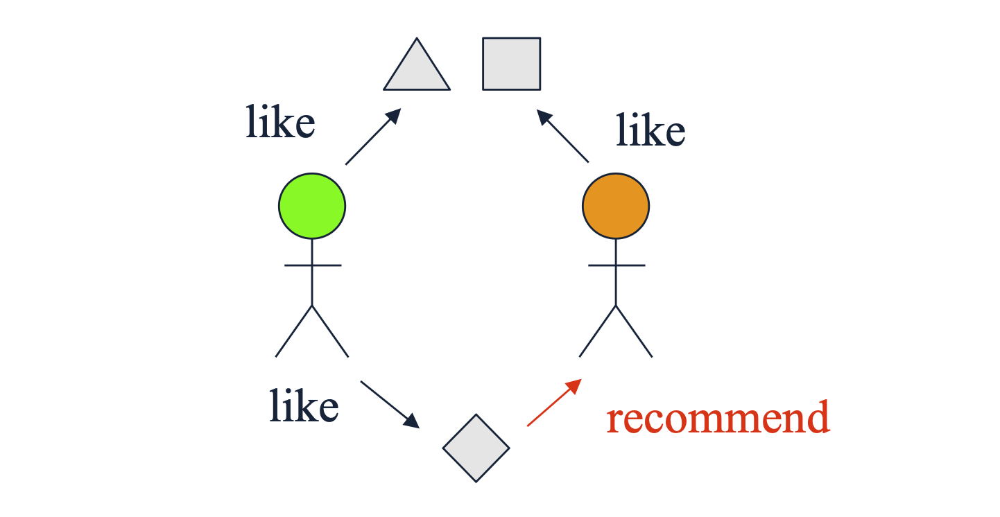

# 1. Introduction: 협업 필터링(Collaborative Filtering)이란?

* 지난 포스트에서는 아이템이 가진 고유의 텍스트나 메타데이터(장르, 감독 등)를 분석하는 '콘텐츠 기반 추천(Content-based Recommendation)'을 다루었습니다. 하지만 현실의 많은 추천 시스템은 아이템의 '내용'이 무엇인지 전혀 알지 못해도 훌륭하게 작동합니다. 이를 가능하게 하는 것이 바로 **협업 필터링(Collaborative Filtering)** 입니다.

* 협업 필터링의 철학은 매우 단순하고 직관적입니다. **'오직 유틸리티 행렬(Utility Matrix)에 기록된 사용자들의 행동(상호작용) 패턴만을 활용한다'**는 것입니다. 즉, 어떤 아이템의 프로필은 그 아이템을 구성하는 특성이 아니라, **'그 아이템을 구매하거나 평가한 사용자들의 집합(유틸리티 행렬의 열 벡터)'** 으로 정의됩니다. 

* 협업 필터링은 관점에 따라 크게 두 가지로 나뉩니다.
  * 1. **User-User Collaborative Filtering:** 나와 비슷한 취향을 가진 '사용자'를 찾아 그들이 좋아하는 아이템을 추천받는 방식.
  * 2. **Item-Item Collaborative Filtering:** 내가 과거에 좋아했던 '아이템'과 같이 소비되는 경향이 있는 비슷한 아이템을 추천받는 방식.

---

# 2. 유사도 측정 (Finding Similar Users)과 그 한계점

* User-User 협업 필터링의 첫 단계는 타겟 사용자 $U$와 유틸리티 행렬 상에서 가장 유사한 평가 기록을 남긴 **'이웃(Neighbors)'** 을 찾는 것입니다. 이를 위해 다양한 유사도 지표(Similarity Metrics)를 적용할 수 있으나, 유틸리티 행렬의 특성(극심한 희소성, 빈칸의 존재 등)으로 인해 단순 적용 시 논리적 모순이 발생할 수 있습니다. 

* 다음의 유틸리티 행렬 예시를 통해 문제점들을 살펴보겠습니다. (1~5점 척도, 빈칸은 미평가)

| Users | HP1 | HP2 | HP3 | TW | SW1 | SW2 | SW3 |
| :---: | :---: | :---: | :---: | :---: | :---: | :---: | :---: |
| **A** | 4 | | | 5 | 1 | | |
| **B** | 5 | 5 | 4 | | | | |
| **C** | | | | 2 | 4 | 5 | |
| **D** | | 3 | | | | | 3 |

* 목표는 사용자 **A**와 가장 유사한 사용자를 찾는 것입니다. A는 (HP1, TW)에 높은 평점을, (SW1)에 낮은 평점을 주었습니다. 직관적으로 HP1에 5점을 준 **B**가 A와 취향이 비슷해 보이고, TW에 2점을 주고 SW1에 4점을 준 **C**는 A와 정반대의 취향을 가진 것으로 보입니다.

## 2.1. 자카드 유사도 (Jaccard Similarity)의 함정
* 자카드 유사도는 평점의 **'값(크기)'을 무시하고, 단순히 평가를 했는지 안 했는지(교집합의 크기)** 만을 따집니다.
  * $A$가 평가한 집합: $\{HP1, TW, SW1\}$
  * $B$가 평가한 집합: $\{HP1, HP2, HP3\}$
  * $C$가 평가한 집합: $\{TW, SW1, SW2\}$

$$Jaccard(A, B) = \frac{|\{HP1\}|}{|\{HP1, HP2, HP3, TW, SW1\}|} = \frac{1}{5}$$
$$Jaccard(A, C) = \frac{|\{TW, SW1\}|}{|\{HP1, TW, SW1, SW2\}|} = \frac{2}{4}$$

* 결과적으로 $Jaccard(A, C) > Jaccard(A, B)$가 도출됩니다. 직관과 달리 취향이 정반대인 C가 더 유사하다고 판단하는 오류를 범하게 됩니다. 평점의 호불호(Likes vs Dislikes)를 무시한 결과입니다.

## 2.2. 코사인 유사도 (Cosine Similarity)의 함정
* 코사인 유사도는 평점을 벡터 공간의 점으로 취급합니다. 이때 평가하지 않은 **빈칸(결측치)을 0으로 간주**하고 내적을 계산합니다.
  * $\mathbf{v}_A = [4, 0, 0, 5, 1, 0, 0]$
  * $\mathbf{v}_B = [5, 5, 4, 0, 0, 0, 0]$
  * $\mathbf{v}_C = [0, 0, 0, 2, 4, 5, 0]$

* 계산해보면 $Cosine(A, B) \approx 0.380$, $Cosine(A, C) \approx 0.322$가 나옵니다. B가 더 유사하다는 직관에는 부합하지만, 근본적인 문제가 있습니다. **'평가하지 않음(No rating)'이 '매우 싫어함(0점)'으로 수학적으로 처리**되어 버린다는 점입니다.

---

# 3. 유사도 지표의 개선 (Improving Similarity Metrics)

* 앞서 발생한 문제들을 해결하기 위해 지표를 약간 변형해야 합니다.

## 3.1. 자카드 유사도의 개선: 반올림/이진화 (Rounding the data)
* 모든 평가 기록을 동일하게 취급하지 않고, 높은 평점(High ratings: 3, 4, 5점)만 '1'로 변환하고 나머지는 무시(0)하여 자카드 유사도를 다시 계산합니다. 
  * $A$의 긍정 평가 집합: $\{HP1, TW\}$ (SW1은 1점이므로 탈락)
  * $B$의 긍정 평가 집합: $\{HP1, HP2, HP3\}$
  * $C$의 긍정 평가 집합: $\{SW1, SW2\}$ (TW는 2점이므로 탈락)

* 이제 다시 교집합을 구해보면 $Jaccard(A, B) = \frac{1}{4}$, $Jaccard(A, C) = 0$이 됩니다. 비로소 우리의 직관과 일치하게 됩니다.

## 3.2. 피어슨 상관계수 (Pearson's Correlation Coefficient) / 평균 중심화 (Mean-Centering)
* 코사인 유사도에서 '빈칸 = 0' 문제를 가장 우아하게 해결하는 방법은 **각 사용자의 평균 평점을 빼서 데이터의 영점(Zero-point)을 맞추는 평균 중심화(Normalize / Mean-centering)** 를 수행하는 것입니다. 

* 예를 들어 사용자 A의 평균 평점이 $10/3$ 이라면, A가 준 4점은 $4 - 10/3 = 2/3$ (긍정)이 되고, 1점은 $1 - 10/3 = -7/3$ (부정)이 됩니다. 빈칸은 그대로 0을 유지하는데, 이제 이 0의 의미는 '싫어함'이 아니라 **'평균적인 선호도(Neutral)'** 로 합리적으로 해석됩니다.

* 이를 수식으로 엄밀히 정의한 것이 **피어슨 상관계수(Pearson Correlation)** 입니다. 두 사용자 $A, B$가 공통으로 평가한 아이템 집합을 $S$라고 할 때, 유사도는 다음과 같이 계산됩니다.
$$sim(A,B) = \frac{\sum_{s \in S} (r_{A,s} - \bar{r}_A)(r_{B,s} - \bar{r}_B)}{\sqrt{\sum_{s \in S} (r_{A,s} - \bar{r}_A)^2} \sqrt{\sum_{s \in S} (r_{B,s} - \bar{r}_B)^2}}$$
  * $r_{A,s}$: 사용자 $A$가 아이템 $s$에 부여한 평점
  * $\bar{r}_A$: 사용자 $A$의 전체 평균 평점

* 정규화된 행렬로 코사인 유사도(즉, 피어슨 상관계수)를 구하면 $sim(A, B) = 0.092 > sim(A, C) = -0.559$가 도출됩니다. C와의 유사도가 음수(-)로 떨어지면서 취향이 완전히 상반됨을 수학적으로 명확히 잡아냅니다. 단, 공통으로 평가한 집합 $S$의 크기가 너무 작으면 우연에 의해 상관계수가 극단적으로 나올 수 있으므로 주의해야 합니다.

---

# 4. 평점 예측 (Rating Predictions)

* 유사도 계산을 통해 타겟 사용자 $x$와 가장 유사한 이웃 그룹 $N$ (크기 $k$)을 찾았다면, 이제 목표 아이템 $i$에 대한 $x$의 평점 $r_{xi}$를 예측해야 합니다. 

* 이때 이웃 그룹 $N$ 중에서도 실제로 아이템 $i$를 평가한 사용자들의 부분집합을 $N'$이라고 합시다.

### 4.1. 단순 평균 (Simple version)
* 가장 간단한 방법은 이웃들이 남긴 평점의 산술 평균을 구하는 것입니다. $k'$은 $N'$의 크기를 의미합니다.
$$r_{xi} = \frac{1}{k'} \sum_{y \in N'} r_{yi}$$

### 4.2. 가중 평균 (Complicated version)
* 단순 평균은 '조금 비슷한' 이웃과 '매우 비슷한' 이웃의 의견을 동등하게 취급합니다. 이를 개선하여, **나와 유사도(sim)가 높을수록 그 사람의 평점에 더 높은 가중치를 부여**하는 방식을 사용합니다.
$$r_{xi} = \frac{\sum_{y \in N'} sim(x,y) \cdot r_{yi}}{\sum_{y \in N'} sim(x,y)}$$
  * 분모는 가중치의 총합으로 나누어 스케일을 맞춰주는 정규화 역할을 합니다.

---

# 5. Item-Item 협업 필터링의 대두

* 지금까지 설명한 접근법은 '유사한 사람'을 찾는 User-User 방식이었습니다. 하지만 행렬의 관점을 뒤집어(Transpose) **'유사한 아이템'**을 찾는 **Item-Item 협업 필터링**을 적용할 수도 있습니다.

* 특정 타겟 아이템 $i$의 평점을 예측하기 위해, 내가 과거에 평가했던 아이템 중 $i$와 소비 패턴이 가장 유사한 아이템들을 찾습니다. 예측 수식은 User-User의 구조와 완전히 동일하며 변수만 바뀝니다.
$$r_{xi} = \frac{\sum_{j \in N(i,x)} sim(i,j) \cdot r_{xj}}{\sum_{j \in N(i,x)} sim(i,j)}$$
  * $N(i,x)$: 아이템 $i$와 유사하면서, 동시에 사용자 $x$가 이미 평가를 완료한 아이템들의 집합.

### Item-Item이 실무에서 더 자주 쓰이는 이유
* 일반적으로 User-User보다 Item-Item 방식이 더 신뢰성(Reliable)이 높다고 평가받습니다.
* 사용자(User)의 취향은 매우 다차원적이고 변덕스럽습니다. (SF도 좋아하고 로맨스 코미디도 좋아할 수 있습니다.) 반면, **아이템(Item)은 그 자체가 가진 정체성이 뚜렷하여 단일한 속성(e.g., 특정 장르, 특정 용도)으로 분류되기 쉽기 때문**에 유사도를 계산했을 때 훨씬 안정적인 패턴이 도출됩니다. 다만, 신규 아이템이 쏟아지는 환경에서는 User-User가 유리할 때도 있으므로 상황에 맞게 혼합하여 사용합니다.

---

# 6. 협업 필터링의 장단점 (Pros and Cons)

### 장점 (Pros)
* **특성 공학 불필요 (Do not have to come up with features):** 콘텐츠 기반 추천처럼 복잡한 텍스트 분석, 이미지 인식, 메타데이터 구축 등 아이템 프로필을 만들기 위한 도메인 지식이나 노가다가 전혀 필요 없습니다. 행동 데이터 자체만으로 학습이 가능합니다.

### 단점 (Cons)
* **콜드 스타트 및 희소성 문제 (Cold Start & Sparsity):** 매칭을 성사시키기 위해서는 시스템 내에 '충분히 많은 사용자'와 상호작용 기록이 누적되어야 합니다. 또한, 누구도 평가하지 않은 완전한 신규 아이템이나 초비주류 아이템은 절대 추천될 수 없습니다.
* **인기 편향 및 필터 버블 (Popularity Bias):** 결국 다수의 사용자가 긍정적으로 평가한 유명한 아이템 위주로 추천이 몰리는 경향이 있습니다. 개인의 고유하고 독특한 취향(Unique taste)을 만족시키거나 참신한 발견(Serendipity)을 제공하는 데는 한계가 있습니다.