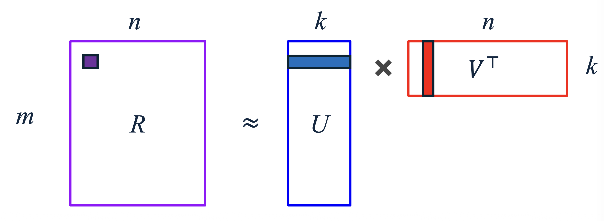
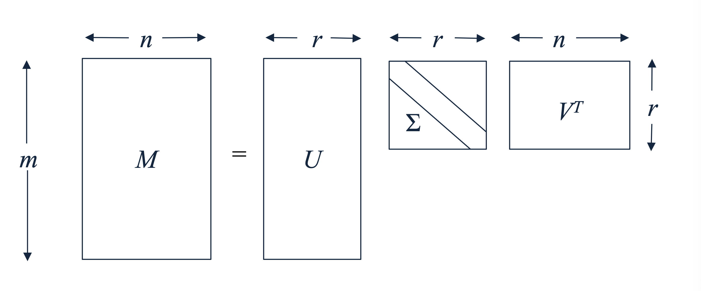

# 1. 추천 시스템의 목표와 유틸리티 행렬 (Introduction)

* 추천 시스템(Recommender Systems)의 궁극적인 목표는 사용자(User)와 아이템(Item) 간의 상호작용을 바탕으로, 아직 평가되지 않은 항목의 점수를 예측하는 것입니다. 이를 수학적으로 표현하기 위해 우리는 **유틸리티 행렬(Utility Matrix, $R$)**이라는 개념을 도입합니다.

* 추천 시스템의 핵심 연산은 사용자와 아이템을 각각 의미 있는 형태(Representation)로 나타내는 것입니다. 대표적인 접근 방식은 다음과 같습니다.
  * **콘텐츠 기반 필터링(Content-based approach):** 아이템의 고유한 속성(메타데이터)과 사용자의 프로필을 명시적으로 생성하여 추천합니다.
  * **협업 필터링(Collaborative Filtering, CF):** 유틸리티 행렬 $R$의 행(사용자)과 열(아이템) 간의 패턴만을 이용하여 추천합니다.

# 2. 잠재 요인 모델 (Latent Factor Models)

* 유틸리티 행렬 기반의 협업 필터링을 고도화하기 위해 **잠재 요인 모델(Latent Factor Models)**이 등장합니다. 현대 머신러닝에서 협업 필터링을 언급할 때, 대다수는 이 잠재 요인 모델을 지칭합니다.

* 잠재 요인 모델은 다음과 같은 핵심 가정을 바탕으로 합니다:
  * 1.  사용자와 아이템을 매우 잘 설명할 수 있는 숨겨진 **잠재 요인(Latent Factors)**이 존재한다.
      * 예를 들어, 영화 추천에서 이 요인은 "특정 장르에 대한 선호도", "유명 배우의 출연 여부", "특정 감독의 연출 스타일" 등 인간이 인지할 수 있는 개념(Concepts/Topics)일 수도 있고, 기계만이 이해할 수 있는 추상적인 특성일 수도 있습니다.
  * 2.  이러한 잠재 요인들은 외부의 추가적인 메타데이터 없이, 오직 유틸리티 행렬의 상호작용 데이터(User-item interactions)로부터 직접 추출(Extract)될 수 있다.

# 3. UV 분해 (UV Decomposition)

* 잠재 요인 모델을 구현하는 가장 대표적이고 직관적인 방법이 바로 **UV 분해(UV Decomposition)**입니다. 

## 3.1. 수학적 공식화 (Mathematical Formulation)

* UV 분해의 기본 아이디어는 $m$명의 사용자와 $n$개의 아이템으로 이루어진 커다란 유틸리티 행렬 $R$을 두 개의 저차원(Low-dimensional) 행렬 $U$와 $V$의 곱으로 분해하는 것입니다.

* **$R \in \mathbb{R}^{m \times n}$**: 원본 유틸리티 행렬 (관측된 평점 데이터) 
* **$U \in \mathbb{R}^{m \times k}$**: 사용자(User) 행렬. $m$명의 사용자를 $k$차원의 잠재 벡터로 표현합니다.
* **$V \in \mathbb{R}^{n \times k}$**: 아이템(Item) 행렬. $n$개의 아이템을 $k$차원의 잠재 벡터로 표현합니다.
    * 계산을 위해 행렬 곱에서는 $V^{\top} \in \mathbb{R}^{k \times n}$의 형태를 취합니다.

* 목표는 $U$와 $V^{\top}$의 곱이 유틸리티 행렬 $R$의 **"관측된(비어있지 않은) 항목"**들을 최대한 가깝게 근사(Approximate)하도록 만드는 것입니다.

$$R \approx UV^{\top}$$

## 3.2. 평점 예측 (Rating Prediction)

* 모델이 학습된 후, 사용자 $x$가 아이템 $i$에 내릴 평점(비어있는 항목)에 대한 예측값 $\hat{r}_{xi}$는 행렬 $U$의 $x$번째 행 벡터 $u_x$와 행렬 $V$의 $i$번째 행 벡터 $v_i$의 내적(Inner product)으로 간단히 계산됩니다.

$$\hat{r}_{xi} = u_{x}^{\top}v_{i} = \sum_{j=1}^{k} u_{xj} v_{ij}$$

* 이는 사용자의 잠재 요인 선호도 벡터와 아이템의 잠재 요인 특성 벡터가 얼마나 일치하는지를 투영(Projection)하여 점수화하는 논리적 과정입니다.

# 4. 목적 함수와 오차 측정 (Error Function)

* 행렬 $U$와 $V$를 학습시키기 위해서는 현재의 모델이 얼마나 예측을 잘하고 있는지 평가할 기준이 필요합니다. UV 분해에서는 주로 **RMSE (Root-mean-square error)** 또는 **SSE (Sum of squared errors)**를 목적 함수로 사용합니다.

* 여기서 매우 중요한 점은, 오차를 계산할 때 **오직 관측된 평점(Non-blank entries)**에 대해서만 계산한다는 것입니다. 관측된 평점의 집합을 $E$라고 할 때, 오차 함수는 다음과 같이 정의됩니다.
  * **1. RMSE (Root-Mean-Square Error)**
  $$RMSE(\hat{R}, R) = \sqrt{\frac{1}{|E|} \sum_{(x,i) \in E} (\hat{r}_{xi} - r_{xi})^{2}}$$ 
  * **2. SSE (Sum of Squared Errors)**
    * 수학적 최적화 과정(예: 미분)에서의 편의성을 위해 루트와 평균을 제거한 형태인 SSE도 널리 사용됩니다.
  $$SSE(\hat{R}, R) = |E| \cdot RMSE^{2}(\hat{R}, R) = \sum_{(x,i) \in E} (\hat{r}_{xi} - r_{xi})^{2}$$ 

* **예시 계산**: 만약 실제 평점이 $[5, 2, 3]$ 이고, 모델의 예측 평점이 모두 $2$인 행렬 $[2, 2, 2]$ 라고 가정해 봅시다.
    $$RMSE = \sqrt{\frac{(5-2)^2 + (2-2)^2 + (3-2)^2}{3}} = \sqrt{\frac{9 + 0 + 1}{3}} = \sqrt{3.333} \approx 1.826$$ 

# 5. UV Decomposition vs. SVD (특이값 분해와의 비교)

* 선형대수학에 익숙한 독자라면, 행렬을 저차원으로 분해하는 기법으로 **SVD (Singular Value Decomposition)**를 떠올릴 것입니다. SVD와 UV 분해는 어떤 차이가 있을까요?

## 5.1. SVD의 개념과 한계점
* 전통적인 SVD는 주어진 행렬 $M$을 직교 행렬(Orthogonal matrix) $U, V$와 대각 행렬(Diagonal matrix) $\Sigma$의 곱으로 완벽히 분해합니다. 추천 시스템에 적용할 때는 잠재 요인의 수 $r$을 선택하여 잘라낸(Truncated) 형태를 사용하며, 이 경우 SVD의 $U\Sigma$와 $V^{\top}$를 UV 분해의 $U, V$ 행렬처럼 취급할 수 있습니다.

$$M = U \Sigma V^{\top}$$

## 5.2. UV 분해만의 차별점 (Differences from SVD)

* 수학적 구조의 유사성에도 불구하고, 기계학습 모델로서의 UV 분해는 전통적 SVD와 결정적인 차이점들을 가집니다.
  * 1.  **경험적/확률적 접근 (Empirical & Stochastic Optimization)**
      * SVD는 수학적으로 닫힌 형태의 해(Closed-form solution)를 도출하는 해석적 기법입니다.
      * 반면, UV 분해는 주로 경사하강법(Gradient Descent)과 같은 **확률적 최적화(Stochastic optimization)** 기법을 통해 경험적으로 파라미터를 찾아갑니다.
  * 2.  **직교성 제약 없음 (No Orthonormal constraints)**
      * SVD에서 생성되는 행렬은 반드시 정규 직교(Orthonormal)해야 한다는 엄격한 수학적 제약이 존재합니다. UV 분해의 $U$와 $V$ 행렬은 이러한 제약에서 자유롭습니다.
  * 3.  **결측치(Missing Entries) 처리 방식**
      * 표준 SVD 행렬 연산을 수행하기 위해서는 행렬에 빈칸이 없어야 합니다. 따라서 추천 시스템의 희소 행렬을 SVD에 넣기 위해 보통 결측치를 $0$이나 평균값으로 채워 넣게 되는데, 이는 심각한 데이터 왜곡을 초래합니다.
      * UV 분해는 유틸리티 행렬의 **결측치를 철저히 무시(Ignores the missing entries)**합니다. 위에서 오차 함수를 정의할 때 보았듯, 오직 관측된 데이터($E$)에 대해서만 학습을 진행합니다.
  * 4.  **일반화(Generalization)와 과적합 방지**
      * UV 분해는 관측된 데이터를 훈련 데이터(Training portion)로 삼아 RMSE를 최소화하고, 이를 바탕으로 아직 보지 못한 데이터(Unseen data)에 대한 예측 성능, 즉 **일반화 성능(Generalization)**을 추구하는 머신러닝의 패러다임을 따릅니다.
      * 따라서 무작정 잠재 차원의 수 $k$를 늘리는 것이 항상 좋은 것은 아니며, $k$가 지나치게 커지면 훈련 데이터에 과적합(Overfitting)되어 테스트 세트의 RMSE가 오히려 증가할 수 있습니다.