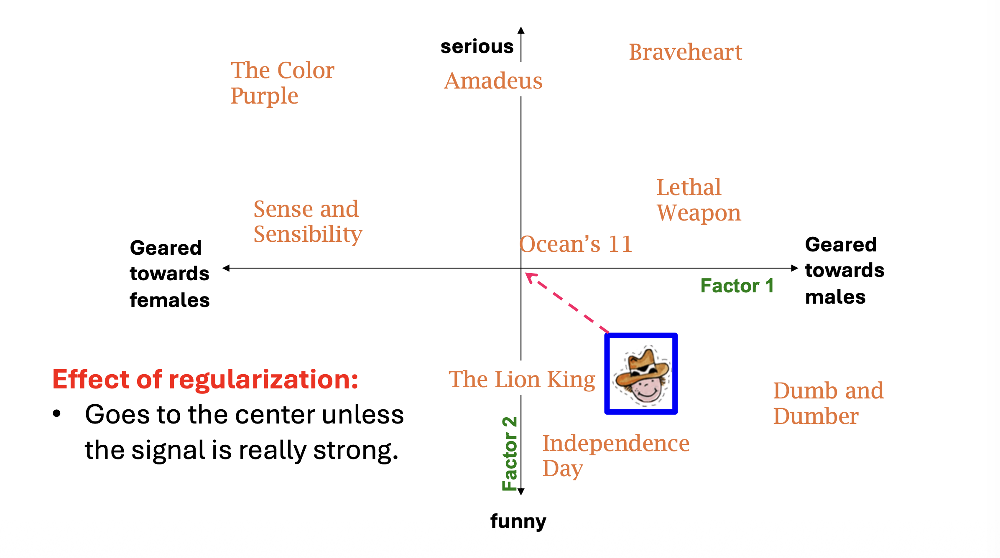
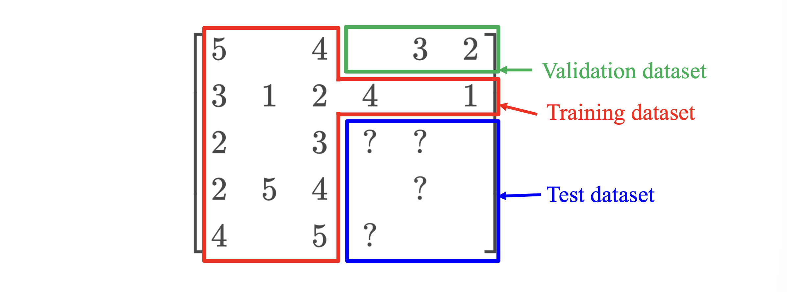
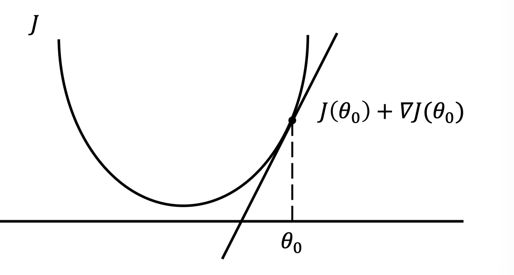
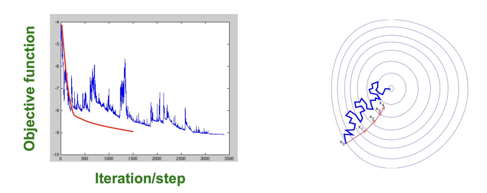

# 1. 머신러닝으로서의 추천 시스템 (Machine Learning Perspective)

* 이전 포스트에서 우리는 유틸리티 행렬 $R$을 두 개의 저차원 행렬 $U$와 $V$의 곱으로 근사하는 UV 분해(UV Decomposition)의 기본 개념을 살펴보았습니다. 이번에는 이 과정을 **머신러닝(Machine Learning)**의 관점에서 엄밀하게 재정의해보겠습니다.

* 전통적인 데이터 마이닝이나 초기 협업 필터링(CF)은 주로 엔지니어가 데이터 간의 유사도(Similarity measure) 규칙을 직접 설계(Design)하여 추천을 수행했습니다. 반면, 머신러닝 기반의 UV 분해는 시스템이 주어진 데이터 $R$로부터 잠재 요인 행렬(Factor matrices)을 스스로 **학습(Learn)**하도록 만듭니다. 

* 우리는 이 학습된 행렬들이 원본 행렬의 단순한 행/열 데이터보다 사용자와 아이템의 특성을 훨씬 더 잘 반영할 것이라 기대합니다. 하지만 SVD와 달리 수학적으로 닫힌 형태의 해(Closed-form solution)가 존재하지 않으므로, 우리는 목적 함수(Objective Function)를 정의하고 이를 최소화하는 최적화 알고리즘을 사용해야 합니다.

## 1.1. 목적 함수 (Objective Function) 정의

* 우리의 목표는 훈련 데이터(Training data) 집합 $E$에 대하여 오차 제곱합(SSE)을 최소화하는 행렬 $U^*$와 $V^*$를 찾는 것입니다.

$$U^*, V^* = \arg\min_{U,V} J(R, U, V)$$ 

* 여기서 목적 함수 $J(R, U, V)$는 다음과 같이 정의됩니다:

$$J(R, U, V) = \sum_{(x,i) \in E} (r_{xi} - u_x^\top v_i)^2$$ 

* 이 식에서 학습의 대상이 되는 행렬 $U$와 $V$를 **파라미터(Parameters)**라고 부르며, 잠재 차원의 수 $k$와 같이 사람이 직접 설정해야 하는 값들은 **하이퍼파라미터(Hyperparameters)**라고 부릅니다.

# 2. 과적합(Overfitting)과 정규화(Regularization)

## 2.1. 목적 함수의 괴리 (Mismatch in Objective Function)

* 우리가 $J(R, U, V)$를 훈련 데이터에 대해 최소화하고 있지만, 추천 시스템의 **진짜 목표는 아직 관측되지 않은 '테스트 데이터(Unseen test data)'에 대한 예측 오차를 줄이는 것**입니다. 

* 잠재 요인의 수 $k$를 계속 늘리면 더 많은 파라미터가 생기므로 훈련 데이터에 대한 $J(\cdot)$ 값은 거의 항상 감소합니다. 하지만 $k$가 지나치게 커지면, 모델이 데이터의 내재적 패턴이 아닌 무의미한 노이즈(Noise)까지 외워버리게 되어, 실제 테스트 데이터에서의 성능은 오히려 악화(Rise)되기 시작합니다. 이를 **과적합(Overfitting)**이라고 합니다.

## 2.2. 정규화 (Regularization) 도입

* 과적합을 방지하고 모델의 복잡도를 제어하기 위해(Control the model complexity) **정규화(Regularization)** 기법을 목적 함수에 추가합니다. 정규화는 데이터가 충분할 때는 유연한 모델링을 허용하지만, 데이터가 부족한(Scarce) 곳에서는 모델의 파라미터가 비정상적으로 커지는 것을 강하게 억제(Shrinks)합니다.

* L2 정규화(Ridge 패널티)가 추가된 새로운 목적 함수는 다음과 같습니다:

$$J(R, U, V) = \sum_{(x,i) \in E} (r_{xi} - u_x^\top v_i)^2 + \lambda_1 \sum_x ||u_x||_2^2 + \lambda_2 \sum_i ||v_i||_2^2$$ 

* 여기서 $\lambda_1$과 $\lambda_2$는 정규화의 강도를 조절하는 하이퍼파라미터이며, 이 항들은 잠재 벡터 $u_x$와 $v_i$의 유클리드 길이(Length)가 무한정 커지는 것을 제한합니다.

## 2.3. 검증 데이터 (Validation Data) 활용

* 하이퍼파라미터(예: $k, \lambda_1, \lambda_2$)를 최적의 값으로 설정하기 위해, 전체 훈련 데이터를 다시 분할하여 **검증 데이터(Validation dataset)**를 도입합니다. 훈련 중 검증 데이터에서의 성능을 지속적으로 모니터링하며, 이를 테스트 성능의 대리 지표(Proxy)로 활용하여 언제 학습을 멈춰야 할지(Early stopping) 결정합니다.

# 3. 최적화: 경사하강법 (Gradient Descent)

* 정해진 목적 함수를 최소화하기 위한 대표적인 알고리즘은 **경사하강법(Gradient Descent, GD)**입니다. 

## 3.1. 경사하강법의 원리

* 임의의 파라미터 $\theta_0$에서 시작하여, 목적 함수 $J(\theta)$의 도함수(Derivative, $\nabla J$)를 계산합니다. 기울기의 반대 방향(Reverse direction)으로 한 걸음(Step)씩 이동하며, 기울기가 충분히 작아질 때까지 이 과정을 반복합니다.

$$\theta_1 \leftarrow \theta_0 - \nabla J(\theta_0)$$ 

## 3.2. UV 분해에서의 경사하강법 적용

* UV 분해 행렬 $U, V$를 학습하기 위한 전체 프로세스는 다음과 같습니다:
  * 1. **초기화 (Initialization):** SVD를 사용하여 $U$와 $V$를 초기화합니다(이때 빈칸은 0으로 취급합니다). 이는 무작위 초기화(Random initialization)보다 훨씬 안정적이고 좋은 결과를 냅니다.
  * 2. **파라미터 업데이트:** 도함수에 학습률(Learning rate, $\eta$)을 곱하여 행렬을 업데이트합니다.
     * $U \leftarrow U - \eta \cdot \nabla_U J(R, U, V)$ 
     * $V \leftarrow V - \eta \cdot \nabla_V J(R, U, V)$ 

* 구체적으로 행렬 $U$의 특정 원소 $u_{xc}$ (사용자 $x$의 $c$번째 잠재 요인)에 대한 업데이트 식을 미분하여 도출해보면 다음과 같습니다.

$$u_{xc} \leftarrow u_{xc} - \eta \cdot \nabla_{u_{xc}} J(R, U, V)$$ 
$$\nabla_{u_{xc}} J(R, U, V) = \sum_{i: (x,i) \in E} -2v_{ic}(r_{xi} - u_x^\top v_i) + 2\lambda_1 u_{xc}$$ 

# 4. 확률적 경사하강법 (Stochastic Gradient Descent, SGD)

## 4.1. 왜 SGD를 사용하는가?

* 전통적인 GD는 한 번의 파라미터 업데이트를 위해 **모든 관측 데이터 집합 $E$**에 대해 오차와 그래디언트를 합산해야 합니다. 이는 대용량의 추천 시스템 데이터에서는 지나치게 느리고 연산 비용이 높습니다(Too slow for large data).

* 이 문제를 해결하기 위해 **확률적 경사하강법(Stochastic Gradient Descent, SGD)**을 도입합니다. 전체 데이터의 합 $\sum_{(x,i) \in E}$을 구하는 대신, **개별 평점 데이터 하나 $r_{xi}$**를 확인할 때마다 곧바로 파라미터를 업데이트하는 방식입니다.
  * **GD의 업데이트:** $U \leftarrow U - \eta \cdot \left[ \sum_{(x,i) \in E} \nabla J(r_{xi}, U, V) \right]$ 
  * **SGD의 업데이트:** 각각의 $(x,i) \in E$에 대하여, $U \leftarrow U - \eta \cdot \nabla J(r_{xi}, U, V)$ 

## 4.2. 수렴 특성 (Convergence of SGD vs. GD)

* **GD**는 매 스텝마다 모든 데이터를 고려하므로 목적 함수 값이 항상 안정적으로 개선되지만, 한 스텝을 내딛는 데 매우 긴 시간이 소요됩니다.
* **SGD**는 개별 샘플의 노이즈 때문에 지그재그 형태로 다소 불안정하게(Noisy way) 이동하지만, 1 에포크(전체 데이터를 한 번 훑는 과정) 동안 수많은 스텝을 밟기 때문에 전체적인 수렴 속도는 훨씬 빠릅니다.

## 4.3. UV 분해를 위한 SGD 알고리즘

* 수렴할 때까지 반복되는 SGD의 구체적 학습 알고리즘은 다음과 같이 정리할 수 있습니다.

* 모든 평점 데이터 $r_{xi} \in E$ 에 대하여 순회하며:
  * 1. 예측 오차(Error) 항을 계산합니다.
     $$\epsilon_{xi} \leftarrow 2(r_{xi} - u_x^\top v_i)$$ 
  * 2. 사용자 잠재 벡터 $u_x$를 업데이트합니다.
     $$u_x \leftarrow u_x + \eta(\epsilon_{xi} v_i - \lambda_1 u_x)$$ 
  * 3. 아이템 잠재 벡터 $v_i$를 업데이트합니다.
     $$v_i \leftarrow v_i + \eta(\epsilon_{xi} u_x - \lambda_2 v_i)$$ 

* 참고: 실무에서는 속도와 안정성의 균형(Balance between speed and stability)을 맞추기 위해 극단적인 1개의 샘플 단위(True SGD)가 아닌, $B$개의 샘플을 묶어 연산하는 **미니배치 SGD(Mini-batch SGD)**를 널리 사용합니다.