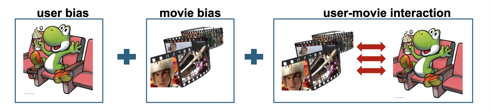

# 1. 상호작용 모델의 한계와 편향(Bias)의 도입

* 이전 포스트까지 다룬 기본 UV 분해 모델은 사용자가 아이템에 부여하는 평점을 오직 **"사용자와 아이템 간의 잠재적 상호작용(User-item interaction, $u_x^\top v_i$)"**으로만 설명하려고 했습니다. 

* 하지만 실제 현실의 추천 시스템에서 평점 $r_{xi}$는 순수한 취향의 일치도만으로 결정되지 않습니다. 시스템 전체에 걸쳐 존재하는 **전역적 효과(Global effects)**, 즉 **편향(Bias)**이 강력하게 작용하기 때문입니다.
  * **사용자 편향 (User Bias):** 평점을 매기는 기준은 사람마다 다릅니다. 예를 들어, 어떤 사용자 $x_1$은 평가 기준이 매우 엄격한 비평가(Critical reviewer)라서 최고로 재미있는 영화에도 3점을 주는 반면, 관대한 사용자 $x_2$는 웬만한 영화에는 모두 5점을 줄 수 있습니다.
  * **아이템 편향 (Movie/Item Bias):** 작품 자체가 가지는 대중적인 평판도 존재합니다. 넷플릭스에 등록된 명작 영화 "대부(The Godfather, $i_1$)"는 취향을 타지 않고 전반적으로 높은 평점을 받는 반면, 완성도가 떨어지는 "졸작 영화($i_2$)"는 누가 보더라도 낮은 평점을 받을 확률이 높습니다.

# 2. 편향이 추가된 예측 모델 (Model with Biases)

* 이러한 현실적인 요소를 반영하여, 평점 예측 공식 $\hat{r}_{xi}$를 더욱 정교하게 확장할 수 있습니다. 새로운 예측 모델은 다음과 같이 4가지 구성 요소의 합으로 표현됩니다.

$$\hat{r}_{xi} = \mu + b_x + b_i + u_x^\top v_i$$

* 각 항의 수학적 의미는 다음과 같습니다:
  * **$\mu$ (전체 평균 평점):** 모델 학습 대상이 아닌, 훈련 데이터 전체 평점의 단순 평균값입니다. 베이스라인의 기준점 역할을 합니다.
  * **$b_x$ (사용자 $x$의 편향):** 전체 평균 $\mu$ 대비, 이 사용자가 평점을 얼마나 더 후하게(+), 혹은 박하게(-) 주는지를 나타내는 스칼라 파라미터입니다.
  * **$b_i$ (아이템 $i$의 편향):** 전체 평균 $\mu$ 대비, 이 영화가 다른 영화들에 비해 얼마나 더 높은(+), 혹은 낮은(-) 평가를 받는지를 나타내는 스칼라 파라미터입니다.
  * **$u_x^\top v_i$ (상호작용):** 사용자의 잠재 취향 벡터와 아이템의 잠재 특성 벡터 간의 내적으로, 편향을 모두 걷어내고 남은 **"순수한 개인적 선호도"**를 의미합니다.

### 계산 예시 (Example)
* 훈련 데이터의 전체 평균 평점이 $\mu = 3.7$ 이라고 가정해 봅시다.
* 당신은 영화에 대해 평가가 깐깐한 편이라, 남들보다 보통 1점을 낮게 줍니다 ($b_x = -1.0$).
* 이번에 평가할 영화는 대다수의 사람들이 좋아하는 명작 "스타워즈"입니다 ($b_i = +0.5$).
* 따라서, 당신의 취향과 스타워즈의 특성이 만나는 순수 상호작용 항($u_x^\top v_i$)을 더하기 전의 베이스라인 점수는 다음과 같습니다.
  $$\text{Final score} = 3.7 - 1.0 + 0.5 + u_x^\top v_i = 3.2 + u_x^\top v_i$$
* 이 모델은 당신이 스타워즈에 3.2점을 줄 것이라 기본적으로 깔고 들어간 뒤, 당신의 SF 장르 선호도 등의 세부 상호작용을 계산하여 최종 점수를 미세조정합니다.

# 3. 새로운 목적 함수의 정의와 최적화 (Fitting the New Model)

* 모델에 편향 파라미터 $b_x$와 $b_i$가 추가되었으므로, 모델이 학습해야 할 파라미터 집합(Set of learnable parameters, $\theta$)은 $\theta = \{U, V, B_{user}, B_{item}\}$ 으로 확장되었습니다. 

* 과적합을 방지하기 위한 정규화(Regularizer) 항이 포함된 새로운 목적 함수 $J"(\cdot)$는 다음과 같이 정의됩니다.

$$J"(\cdot) = \sum_{(x,i) \in E} \left(r_{xi} - (\mu + b_x + b_i + u_x^\top v_i)\right)^2 + \text{regularizer}$$

* 확장된 파라미터에 대응하여, 이제 정규화 하이퍼파라미터 역량도 4개로 세분화됩니다 ($\lambda_1, \lambda_2, \lambda_3, \lambda_4$). 이는 사용자 행렬 $U$, 아이템 행렬 $V$, 사용자 편향 벡터 $B_{user}$, 아이템 편향 벡터 $B_{item}$ 각각의 크기(Norm)를 독립적으로 제어하기 위함입니다. 전체 평균 $\mu$는 학습 가능한 파라미터가 아니므로 정규화 대상에서 제외됩니다.

* 모델 구조가 더 복잡해지고 파라미터가 늘어났지만, 머신러닝의 프레임워크 내에서는 문제가 되지 않습니다. 우리는 모델(파라미터 $\theta$), 목적 함수($J$), 정규화($\lambda$)의 구성 요소를 얼마든지 자유롭게 수정할 수 있으며, 이전 포스트에서 다룬 **확률적 경사하강법(SGD)이나 경사하강법(GD)**과 같은 기울기 기반 최적화 알고리즘(Gradient-based optimization)이 이 복잡한 공간에서 최적의 파라미터를 자동으로 찾아줄 것이기 때문입니다.

# 4. 하이퍼파라미터 탐색 (Hyperparameter Search)

* 앞서 정의한 정규화 강도 $\lambda_1, \lambda_2, \lambda_3, \lambda_4$와 잠재 차원의 수 $k$, 그리고 학습률 $\eta$ 등은 모델이 스스로 학습할 수 없는 **하이퍼파라미터(Hyperparameters)**입니다. 이들의 최적 조합을 찾기 위해서는 훈련에 사용되지 않은 **검증 데이터(Validation performance)**에서 가장 높은 성능(가장 낮은 오차)을 내는 조합을 선택해야 합니다.

* 실무에서 하이퍼파라미터 공간을 탐색하는 대표적인 두 가지 기법은 다음과 같습니다.

## 4.1. 그리드 탐색 (Grid Search)
* 연구자가 사전에 의미 있을 것으로 예상되는 이산적인(Discrete) 후보 값들의 집합을 직접 지정하고, 가능한 **모든 조합(Combination)**을 전부 시도해보는 방법입니다.
  * **예시:** $\lambda_1$의 후보를 $\{0.001, 0.01, 0.1, 1, 10\}$와 같이 지정합니다. 하이퍼파라미터의 종류가 많아질수록 탐색해야 할 경우의 수가 기하급수적으로 늘어나는 단점이 있습니다.

## 4.2. 랜덤 탐색 (Random Search)
* 사전에 정의된 연속적인 범위(Range) 내에서 **무작위(Randomly selected)**로 값을 추출하여 조합을 시도하는 방법입니다.
  * **예시:** $\lambda_1$을 $0.001$에서 $10$ 사이의 범위에서 추출하되, 로그 스케일(Log scale) 분포를 사용하여 넓은 범위를 고르게 탐색합니다.
  * 특정 하이퍼파라미터가 모델 성능에 미치는 영향이 불균형할 때, 그리드 탐색보다 더 적은 횟수로 효율적인 최적점을 찾아내는 경향이 있습니다.