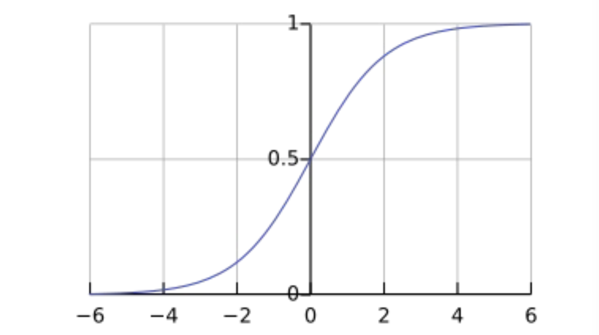
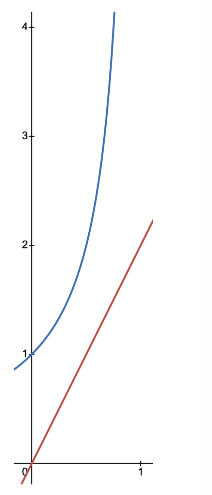

# 1. 암시적 피드백(Implicit Feedback)과 기존 방식의 한계

* 지금까지 우리는 사용자가 직접 영화에 부여한 1~5점의 평점, 즉 명시적 피드백(Explicit Feedback)을 기반으로 유틸리티 행렬 $R$을 구성했습니다. 하지만 현실의 많은 서비스에서는 사용자가 명시적인 점수를 매기기보다 클릭, 구매, 동영상 시청 여부 등으로 선호도를 간접적으로 드러냅니다. 이를 **암시적 피드백(Implicit Feedback)**이라고 합니다.

* 암시적 피드백 환경에서 유틸리티 행렬 $R$의 원소는 오직 0(시청하지 않음) 또는 1(시청함)의 이진(Binary) 값만 가집니다. 이러한 데이터에 기존의 연속형 수치 예측용인 RMSE 목적 함수를 그대로 사용하는 것은 다음 세 가지 치명적인 한계를 가집니다.
  * 1. **예측 범위의 이탈:** 우리의 모델 $u_x^\top v_i$는 이론적으로 $[-\infty, \infty]$ 범위의 값을 출력할 수 있으므로, 타겟 값인 1을 초과하는 예측값($u_x^\top v_i > 1$)이 나올 수 있습니다.
  * 2. **비효율적인 기울기(Gradient):** 잘못된 예측에 대해 파라미터를 효과적으로 업데이트하기 위한 최적화 관점의 기울기 곡선(Gradient curve)이 이상적이지 않습니다.
  * 3. **'0'의 의미 왜곡:** RMSE 방식은 $r_{xi} = 0$인 데이터를 '사용자가 이 아이템을 싫어한다(Dislike)'로 강력하게 가정합니다. 하지만 실제 암시적 피드백에서 0은 단지 '아직 발견하지 못했거나 시청하지 않음(Not watched)'을 의미할 확률이 높습니다.

---

# 2. 해결책 1: 시그모이드(Sigmoid) 함수의 도입

* 첫 번째 한계를 극복하기 위해, 예측값의 출력을 확률의 범위인 $[0, 1]$로 제한(Limit)하는 방법이 필요합니다. 이를 위해 선형 상호작용 $u_x^\top v_i$의 결과를 그대로 출력하는 대신, **시그모이드 함수(Sigmoid Function, $\sigma$)**를 통과시킵니다.

## 2.1. 시그모이드 함수의 수학적 정의

$$\sigma(x) = \frac{1}{1 + e^{-x}}$$

* 이 함수는 다음과 같은 중요한 수학적 특성을 가집니다:
  * 모든 실수 범위 $(-\infty, \infty)$의 입력값을 $(0, 1)$ 사이의 값으로 매핑(Mapping)합니다.
  * 입력값이 0일 때 정확히 중심값인 $0.5$를 가집니다 ($\sigma(0) = 0.5$).
  * 모든 구간에서 단조 증가(Monotonically increasing)합니다.

## 2.2. 시그모이드가 주는 모델 학습의 의미 (Implication)

* 시그모이드가 없다면, 모델의 업데이트 방향에 심각한 모순이 발생할 수 있습니다. 
* 예를 들어, 실제 정답이 $r_{xi} = 1$인데 모델의 예측값이 이미 1을 초과한 $1.5$($u_x^\top v_i > 1$)라고 가정해 봅시다. 단순 오차를 줄이는 방식은 예측값을 $1.5$에서 $1.0$으로 **감소(Decrease)**시키도록 파라미터를 업데이트합니다. 정답을 맞혔음에도 불구하고 선호도를 낮추는 방향으로 학습되는 셈입니다. 

* 반면, **시그모이드를 적용하면 신호의 일관성(Consistent signals)이 확보**됩니다.
  * $r_{xi} = 1$인 경우, 모델은 언제나 $u_x^\top v_i$를 **증가(Increase)**시키도록 학습됩니다.
  * $r_{xi} = 0$인 경우, 모델은 언제나 $u_x^\top v_i$를 **감소(Decrease)**시키도록 학습됩니다.

---

# 3. 해결책 2: 이진 교차 엔트로피 (Binary Cross Entropy, BCE)

* RMSE는 주로 범위가 없는 연속적인 타겟(Continuous, unbounded targets)을 위한 오차 함수입니다. 이진 분류 문제로 바뀐 암시적 피드백 환경에서는 **이진 교차 엔트로피(BCE)**를 사용하는 것이 수학적으로 타당합니다.

## 3.1. BCE 손실 함수 공식
$$J_{BCE}(r_{xi}, u_x, v_i) = -\left[ r_{xi}\log \sigma(u_x^\top v_i) + (1-r_{xi})\log(1 - \sigma(u_x^\top v_i)) \right]$$ 

* 이 식은 두 가지 상황으로 완벽히 분리되어 작동합니다:
  * **$r_{xi} = 1$일 때:** 두 번째 항은 사라지고 $-\log \sigma(u_x^\top v_i)$만 남습니다. 이를 최소화하려면 $\sigma(u_x^\top v_i)$가 $1$에 가까워져야 합니다.
  * **$r_{xi} = 0$일 때:** 첫 번째 항이 사라지고 $-\log(1 - \sigma(u_x^\top v_i))$만 남습니다. 이를 최소화하려면 $\sigma(u_x^\top v_i)$가 $0$에 가까워져야 합니다.

## 3.2. 기울기 곡선 (Gradient Curves) 비교: 왜 BCE가 우수한가?

* RMSE와 BCE의 결정적 차이는 오차를 뒤로 전파하는 **기울기(Gradient)**의 형태에 있습니다. 계산을 단순화하기 위해 정답 $r_{xi} = 0$이고, 예측 확률을 $a = \sigma(u_x^\top v_i)$라고 가정해 봅시다.

* **RMSE의 기울기:** $\nabla_a ||a||^2 = 2a$ 
    * 기울기가 $a$의 크기에 비례하여 선형적(Linearly)으로만 증가합니다.
* **BCE의 기울기:** $\nabla_a -\log(1-a) = 1/(1-a)$ 
    * 예측이 크게 틀릴수록(즉, $a$가 1에 가까워질수록) 분모가 0에 가까워지며 기울기가 기하급수적으로 폭발적(Rapidly)으로 증가합니다.

* 결과적으로 BCE 손실 함수는 이미 잘 맞추고 있는(Accurate) 샘플보다는, **강하게 확신하면서 틀린(Wrong) 샘플에 모델의 학습 역량을 집중**하도록 만듭니다.

---

# 4. 해결책 3: 랭킹 손실(Ranking Losses)과 BPR

* BCE를 도입하여 첫 번째와 두 번째 한계는 해결했지만, 세 번째 한계인 **'0을 Dislike로 맹신하는 문제'**는 여전히 남아있습니다. 이는 BCE와 RMSE 모두 개별 요소(Elementwise)에 대해 독립적인 0/1 예측을 강제하기 때문입니다.

* 이를 근본적으로 해결하기 위해 학계는 **'랭킹(Ranking)'** 관점의 접근법을 고안했습니다. 절대적인 점수를 맞추는 것이 아니라, 아이템 간의 상대적인 순서만 올바르게 나열하자는 아이디어입니다.

## 4.1. 상대적 선호도 가정

* 특정 사용자 $x$가 영화 $i$는 시청했고($r_{xi} = 1$), 영화 $j$는 시청하지 않았다면($r_{xj} = 0$), 우리는 다음과 같은 합리적인 가정을 할 수 있습니다:
  * **'사용자 $x$는 $j$보다 $i$를 더 좋아한다 ($i > j$).'** 

* 만약 사용자가 정말로 $j$를 좋아했다면, $i$보다 먼저 시청했을 것이기 때문입니다. 따라서 모델의 목적은 개별 $r_{xi}$를 1로 만드는 것이 아니라, **$u_x^\top v_i$가 $u_x^\top v_j$보다 크도록($u_{xi} > u_{xj}$) 파라미터를 업데이트**하는 것으로 바뀝니다.

## 4.2. 베이지안 개인화 랭킹 (Bayesian Personalized Ranking, BPR)

* 이러한 상대적 비교 아이디어를 우아하게 수식으로 풀어낸 것이 바로 추천 시스템의 명저로 꼽히는 **BPR (Bayesian Personalized Ranking)** 손실 함수입니다.

$$J_{BPR}(U, V) = \sum_{(x,i,j)} -\log \sigma\left( u_x^\top v_i - u_x^\top v_j \right)$$ 

* **작동 원리:** 관측된 긍정 아이템 $i$와 관측되지 않은 부정 아이템 $j$의 예측 점수 차이($u_x^\top v_i - u_x^\top v_j$)를 구합니다. 이 차이가 클수록(양수일수록) 올바른 랭킹이며, 시그모이드를 거친 로그 값은 0에 가까워집니다 (손실 최소화).
* **공정성 보장:** 쌍(Pair) 단위의 차이를 시그모이드 함수에 통과시킴으로써, 극단적인 이상치 차이값이 모델 전체 기울기를 지배하는 것을 방지하고 모든 쌍이 공정하게 학습에 기여(Contribute fairly)하도록 돕습니다.
* **네거티브 샘플링 (Negative Sampling):** 이 최적화가 잘 동작하기 위해서는 방대한 '시청하지 않은 데이터($r_{xj}=0$)' 집합에서 적절한 난이도의 부정 아이템 $j$를 어떻게 무작위 추출(Randomly selected)할 것인지가 모델 성능을 좌우하는 매우 중요한 요소(Important)가 됩니다.