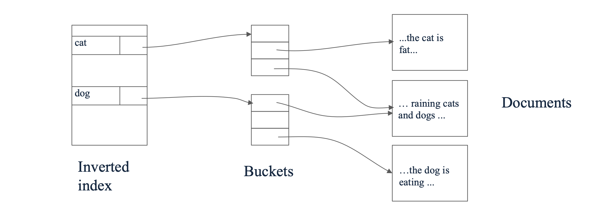
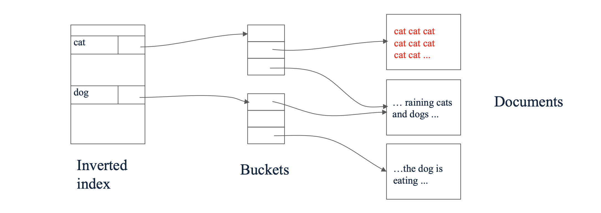
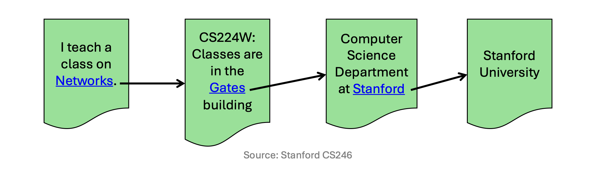
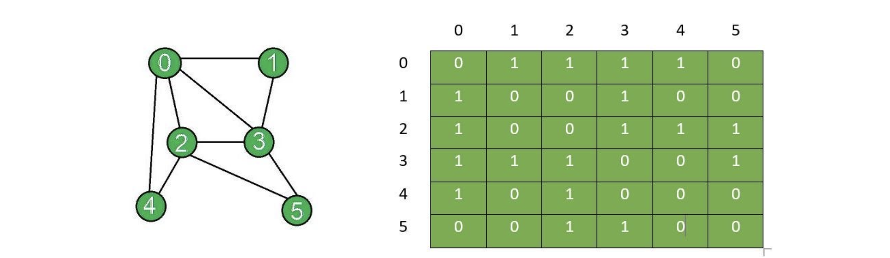

# 1. 서론: 웹 검색과 링크 분석(Link Analysis)

* 현대의 데이터 마이닝에서 **그래프 마이닝(Graph Mining)**은 데이터 내부의 연결성과 관계(Connections/Relationships)를 연구하는 매우 중요한 분야입니다. 그 중에서도 가장 대표적이고 성공적인 응용 사례가 바로 **웹 검색(Web Search)**입니다. 

* 본 포스트에서는 검색 엔진이 사용자의 질의(Query)에 어떻게 응답하는지, 초기의 텍스트 기반 검색 방식이 가졌던 한계는 무엇인지, 그리고 이를 극복하기 위해 **웹을 그래프(Graph)로 모델링**하는 아이디어가 어떻게 등장했는지 살펴봅니다.

---

# 2. 웹 검색의 기본 구조와 역색인(Inverted Index)

* 웹 검색의 궁극적인 목표는 **'사용자의 질의(Query)에 대해 가장 관련성 높은(relevant) 웹 페이지를 찾아 반환하는 것'**입니다. 이를 위해 검색 엔진은 크게 두 가지 핵심 과정을 거칩니다.
  * 1. **색인(Indexing):** 단어(Terms)를 해당 단어가 포함된 웹 페이지(Pages)에 매핑하는 **역색인(Inverted Index)** 구조를 구축합니다.
  * 2. **랭킹(Ranking):** 검색된 페이지들을 해당 페이지의 '권위(Authority)' 또는 '신뢰도(Trust)'를 기준으로 정렬합니다.

* 웹 검색은 인터넷 규모의 방대한 데이터(Web-scale size)를 실시간으로 처리해야 하며, 스팸(Spam) 조작을 걸러내야 한다는 두 가지 주요한 과제를 안고 있습니다.

## 2.1 역색인(Inverted Index)의 원리

* 역색인은 웹 검색을 위한 가장 핵심적인 자료 구조입니다. 책의 맨 뒤에 있는 '찾아보기(Index)'와 완전히 동일한 원리로 동작합니다.

* 검색 질의가 들어오면 검색 엔진은 모든 페이지를 처음부터 끝까지 스캔하는 것이 아니라, 역색인 테이블을 참조하여 해당 단어가 포함된 페이지들을 즉각적으로 추출합니다. 

* 전통적인 정보 검색(Information Retrieval) 관점에서는 **특정 단어가 페이지 내에서 더 자주 등장할수록(Term Frequency가 높을수록) 해당 페이지가 질의와 더 높은 관련성을 가진다고 판단**했습니다.

## 2.2 역색인 방식의 치명적인 한계: 스팸 조작

* 단어의 등장 빈도에만 의존하는 방식은 악의적인 사용자(Unethical people)에 의해 매우 쉽게 조작될 수 있다는 치명적인 한계를 가집니다. 검색 엔진을 속이는 대표적인 수법은 다음과 같습니다.
  * **보이지 않는 텍스트(Invisible Text) 삽입:** 배경색과 동일한 색상으로 특정 키워드(예: 'cat')를 페이지 내에 수천 번 반복해서 적어 넣습니다.
* 사용자의 눈에는 보이지 않지만, 검색 엔진의 크롤러는 해당 페이지가 'cat'이라는 키워드에 대해 엄청난 관련성(빈도)을 가진 문서라고 착각하게 됩니다.

* 이러한 조작(Spam manipulation)이 만연해지면서, 페이지 내부의 텍스트 콘텐츠(Content)만으로는 문서의 진정한 가치와 신뢰도를 평가할 수 없게 되었습니다.

---

# 3. 새로운 패러다임: 웹을 그래프(Graph)로 이해하기

* 텍스트 기반 랭킹의 한계를 극복하기 위한 근본적인 질문은 **'어떻게 해야 진정으로 신뢰할 수 있는(trustful) 페이지를 정확하게 랭킹할 수 있을까?'**였습니다.

* 그 해답은 웹 문서들이 서로 연결되어 있는 구조, 즉 **하이퍼링크(Hyperlinks)**에 있었습니다. 우리는 전체 웹을 하나의 거대한 **그래프(Graph)**로 모델링할 수 있습니다.
  * **노드(Nodes):** 각각의 웹 페이지
  * **간선(Edges):** 페이지 $p_1$에서 페이지 $p_2$로 향하는 하이퍼링크 (방향성 존재)

* 이 아이디어의 핵심 철학은 다음과 같습니다.

> **'신뢰할 수 있고 유용한 페이지들은 자연스럽게 서로를 가리킬(point to) 것이다.'**

* 누군가 다른 사람의 웹페이지로 링크를 건다는 것은 일종의 **추천(Endorsement)**이자 **투표(Vote)**로 해석할 수 있습니다. 텍스트는 조작하기 쉽지만, 전 세계의 수많은 사람들이 자발적으로 생성하는 하이퍼링크 구조는 조작하기가 훨씬 어렵습니다.

---

# 4. 그래프의 수학적 표현 (Mathematical Representation)

* 네트워크 분석과 머신러닝 알고리즘에 웹을 태우기 위해서는 이 거대한 그래프 구조를 수학적으로 명확하게 정의해야 합니다.

* 그래프 $G$는 $n$개의 노드(nodes)와 $m$개의 간선(edges)을 통해 객체들 간의 관계를 모델링합니다. 이를 컴퓨터가 효율적으로 처리하기 위해 일반적으로 **인접 행렬(Adjacency Matrix)** $S$를 사용합니다.

* 행렬 $S$의 크기는 $n \times n$이며, 각 원소 $S_{ij}$는 노드 $i$에서 노드 $j$로의 연결 여부를 나타냅니다. (행과 열의 인덱스가 0부터 시작한다고 가정합니다.)

### 4.1 인접 행렬의 종류와 희소성(Sparsity)

* **방향 그래프 (Directed Graph):** 하이퍼링크처럼 방향이 있는 경우, 행렬 $S$는 **비대칭 행렬(Asymmetric matrix)**이 되며 비영원소(non-zeros)의 개수는 간선의 수인 $m$개입니다.
* **무방향 그래프 (Undirected Graph):** 페이스북 친구 맺기처럼 양방향 관계인 경우, 행렬 $S$는 **대칭 행렬(Symmetric matrix)**이 되며 비영원소의 개수는 $2m$개가 됩니다.

* 실제 웹 환경에서는 $n$(페이지 수)이 수백억 개 이상에 달하지만, 한 페이지가 가지는 링크의 수는 보통 수십 개에 불과하므로 $S$는 0이 압도적으로 많은 **희소 행렬(Sparse Matrix)** 형태를 띱니다.

### 4.2 예시: 무방향 그래프의 인접 행렬 구성

* 다음과 같이 6개의 노드(0부터 5까지)를 가진 무방향 그래프가 주어졌다고 가정해 봅시다.

* 위 그림의 연결 상태를 기반으로 $6 \times 6$ 대칭 인접 행렬 $S$를 수학적으로 표현하면 다음과 같습니다. 무방향 그래프이므로 $S_{ij} = S_{ji}$가 성립하며, 자기 자신으로의 연결이 없다면 대각 원소는 모두 0이 됩니다.

$$S=\begin{bmatrix}0&1&1&1&1&0\\1&0&0&1&0&0\\1&0&0&1&1&1\\1&1&1&0&0&1\\1&0&1&0&0&0\\0&0&1&1&0&0\end{bmatrix}$$

* 예를 들어, 노드 0은 1, 2, 3, 4번 노드와 연결되어 있으므로 첫 번째 행(Row 0)은 `[0, 1, 1, 1, 1, 0]`이 됩니다.

---

# 5. 그래프 마이닝의 다양한 응용 (Applications)

* 데이터 마이닝 관점에서 그래프는 단지 웹 검색(PageRank)을 위해서만 존재하는 것이 아닙니다. 개체 간의 상호작용이 존재하는 곳이라면 어디든 그래프 분석을 적용할 수 있습니다.
  * 1. **소셜 네트워크 분석 (Social Network Analysis):** 페이스북, 인스타그램 등에서 사용자 간의 친구 관계나 팔로우 관계를 분석하여 커뮤니티를 발견하고 인플루언서를 찾습니다.
  * 2. **추천 시스템 (Recommender Systems):** 사용자와 상품(또는 영화 등)을 이분 그래프(Bipartite Graph)로 연결하여, 사용자가 선호할 만한 새로운 항목을 추천합니다.
  * 3. **네트워크 및 통신 (Communication & Routing):** 공유기(Routers) 및 도메인 간의 네트워크 패킷 전송 구조를 최적화하여 병목 현상을 해결합니다.
  * 4. **교통 최적화 (Transportation Optimization):** 도로망을 노드와 간선으로 모델링하여 최적 경로 안내와 교통 흐름을 분석합니다.
  * 5. **생물정보학 (Bioinformatics):** 단백질 상호작용 네트워크(Protein interaction networks)를 모델링하여 유전적 질병의 원인을 찾거나 신약을 개발합니다.