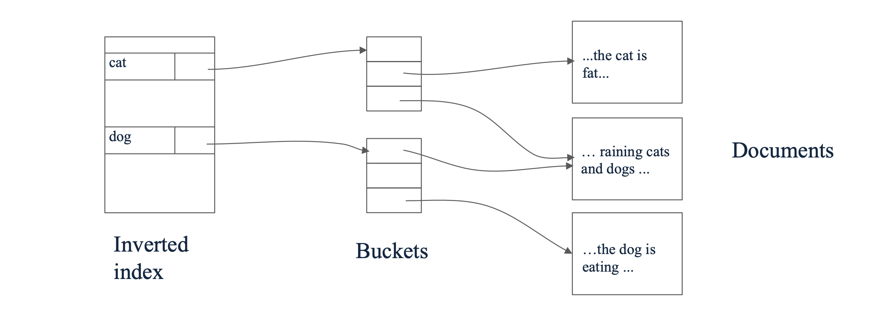
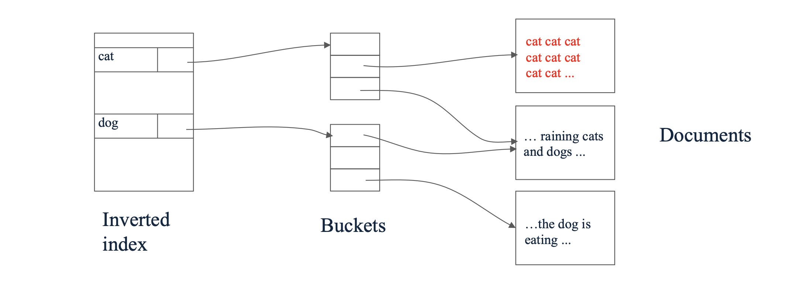
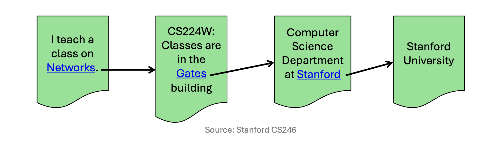
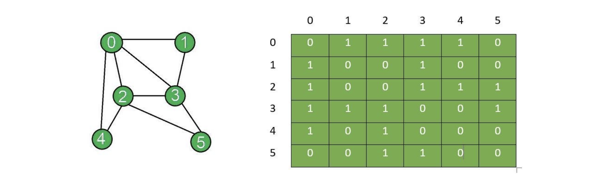
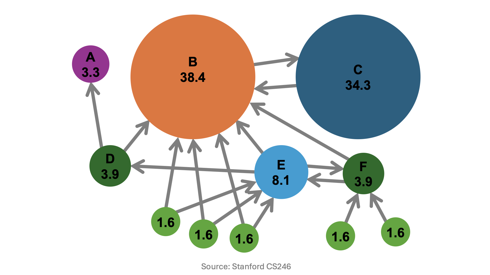

## 들어가며

지난 강의까지는 **UV 분해(UV Decomposition)** 기반의 추천 시스템 — UV 분해의 ML적 해석, 다양한 변형, 암묵적 피드백 처리 — 을 살펴보았습니다. 이번 강의부터는 **링크 분석(Link Analysis)** 이라는 새로운 주제로 전환합니다. 링크 분석은 데이터를 *그래프(Graph)* 로 표현하고, 그 연결 구조를 통해 새로운 정보를 추출하는 분야입니다.

이번 포스트의 핵심 주제는 **PageRank** 알고리즘입니다. 1998년 Google이 도입하여 세계 최고의 검색 엔진을 탄생시킨 이 알고리즘을 아이디어, 수학적 정식화, 수렴 이론, 실용적 구현까지 처음부터 끝까지 체계적으로 정리해 보겠습니다.

---

# 1. 웹 검색과 그래프 (Web Search as a Graph)

## 웹 검색의 목표와 구조

웹 검색의 근본적인 목표는 **사용자의 질의(query)에 가장 관련성 높은 웹 페이지를 찾아 반환**하는 것입니다. 이를 위해 검색 엔진은 두 가지 핵심 작업을 수행합니다.

- **인덱싱(Indexing):** 웹 전체를 크롤링하여, 어떤 단어(term)가 어떤 페이지에 등장하는지를 정리한 **역 인덱스(Inverted Index)** 를 구축합니다.
- **랭킹(Ranking):** 질의와 관련된 페이지들을 추출한 뒤, 각 페이지의 **권위(authority)** 또는 **신뢰도(trust)** 에 따라 순위를 매겨 반환합니다.

이 두 작업을 수행하는 데는 두 가지 근본적인 어려움이 존재합니다.

- **웹 규모의 거대함(web-scale size):** 전 세계 수십억 개의 웹 페이지를 실시간으로 빠르게 처리해야 합니다.
- **스팸 조작(spam manipulation):** 검색 결과를 인위적으로 높이려는 악의적 시도를 방어해야 합니다.

---

## 역 인덱스 (Inverted Index)

**역 인덱스**는 웹 검색의 핵심 자료구조입니다.

- 각 단어(term)에 대해, 해당 단어를 포함하는 문서(페이지)의 목록(버킷)을 저장합니다.
- 사용자가 질의를 입력하면, 역 인덱스를 탐색하여 관련 단어를 포함하는 페이지들을 빠르게 추출합니다.
- 단어가 한 페이지에 자주 등장할수록, 그 페이지는 해당 단어에 더 관련성이 높다고 판단합니다.

예를 들어 "cat"이라는 단어가 포함된 문서들의 포인터가 "cat" 버킷에 저장되고, 사용자가 "cat"을 검색하면 해당 버킷에서 관련 문서를 즉시 조회할 수 있습니다.



---

## 역 인덱스의 한계: 스팸 조작

역 인덱스만으로는 검색 품질을 보장하기 어렵습니다. 비윤리적인 사람들이 검색 엔진을 손쉽게 속일 수 있기 때문입니다.

- **단어 반복 삽입:** "cat"이라는 단어를 수천 번 페이지에 반복 삽입합니다.
- **숨기기 기법:** 배경색과 동일한 색상의 텍스트로 단어를 숨겨 사람 눈에는 보이지 않지만 검색 엔진은 단어를 감지하게 만듭니다.
- **복사 스팸:** 상위 노출된 페이지를 복사한 뒤 그 내용을 보이지 않게 붙여 넣습니다.

이런 방식으로 스패머들은 **콘텐츠 품질과 무관하게** 검색 순위를 높일 수 있었습니다. 이 문제를 근본적으로 해결하려면 단어 빈도를 넘어 페이지의 **신뢰도** 자체를 측정하는 새로운 접근이 필요합니다.



---

## 웹을 그래프로 모델링하기

그렇다면 어떻게 해야 페이지의 신뢰도를 제대로 평가할 수 있을까요?

**핵심 아이디어:** 웹을 방향 그래프(directed graph)로 표현하는 것입니다.

- 각 웹 페이지를 **노드(node)** 로 표현합니다.
- 페이지 $i$에서 페이지 $j$로의 **하이퍼링크(hyperlink)** 가 있으면 $i \to j$ 방향의 **엣지(edge)** 를 생성합니다.
- 핵심 직관: **신뢰할 수 있는 페이지들은 서로를 가리키는 경향이 있습니다.**

예를 들어, "Networks 강의 소개 페이지"가 "CS224W 강의 페이지"를 링크하고, 이 강의 페이지가 "Stanford CS 학과 페이지"를, 학과 페이지가 "Stanford University 공식 페이지"를 링크합니다. 이처럼 신뢰의 연쇄가 링크 구조에 자연스럽게 반영됩니다.



---

## 그래프의 정의와 표현

그래프 $G = (V, E)$는 $n$개의 **노드(nodes)** 와 $m$개의 **엣지(edges)** 로 구성됩니다.

- $n \times n$ 크기의 **희소 인접 행렬(sparse adjacency matrix)** $S$로 표현합니다.
- **방향 그래프(directed graph):** $S$는 비대칭(asymmetric) 행렬이며, 비영(non-zero) 원소의 수는 $m$개입니다.
- **무방향 그래프(undirected graph):** $S$는 대칭(symmetric) 행렬이며, 비영 원소의 수는 $2m$개입니다.

$$S_{ij} = \begin{cases} 1 & \text{if } (i,j) \in E \\ 0 & \text{otherwise} \end{cases}$$

실제 웹 그래프처럼 노드 수 $n$이 수십억 개에 달하면, $n^2$ 크기의 완전 행렬을 저장하는 것은 불가능합니다. 따라서 비영 원소만 저장하는 **희소 표현(sparse representation)** 이 반드시 필요합니다.



---

## 그래프 데이터의 실제 사례

그래프는 다양한 실세계 현상을 자연스럽게 모델링합니다.

- **소셜 네트워크(Social Networks):** Facebook에서 각 사용자를 노드, 친구 관계를 엣지로 표현합니다. 전 세계 수십억 명의 연결 구조를 분석하여 커뮤니티 구조, 정보 전파 패턴 등을 파악할 수 있습니다.


- **통신 네트워크(Communication Networks):** 인터넷에서 라우터와 도메인 간의 데이터 전송 경로를 그래프로 표현합니다. 각 도메인(domain1, domain2, domain3)과 라우터가 노드가 되고, 데이터 전송 경로가 엣지가 됩니다.


---

## 링크 분석의 활용 범위

**링크 분석(Link Analysis)** 은 데이터 마이닝의 인기 연구 분야로, 데이터 내의 연결 관계(connections/relationships)를 탐구합니다. 웹 검색 외에도 다양한 응용 분야가 있습니다.

- **소셜 네트워크 분석(Social network analysis):** 커뮤니티 탐지, 영향력 최대화, 이상 탐지
- **추천 시스템(Recommender systems):** 사용자-아이템 이분 그래프 기반 협업 필터링
- **교통 최적화(Transportation optimization):** 도로망·항공망에서의 최단 경로 및 혼잡도 분석
- **생물정보학(Bioinformatics):** 단백질 상호작용 네트워크(protein interaction networks) 분석을 통한 유전자 기능 예측

---

# 2. PageRank: 아이디어 (PageRank: Idea)

## 그래프에서 노드 순위 매기기

1998년, Google은 **PageRank** 알고리즘을 도입하여 링크 구조만으로 웹 페이지의 중요도를 측정하는 방식을 실현했습니다.

- PageRank는 Google을 **세계 최고의 검색 엔진**으로 만드는 데 핵심적인 역할을 했습니다.
- 그래프 마이닝 기법을 실제 웹 검색 문제에 성공적으로 적용한 대표적인 사례입니다.


---

## 직관 1 — 링크를 투표로 해석하기 (Links as Votes)

PageRank의 첫 번째 핵심 직관은 **하이퍼링크를 "투표"로 간주**하는 것입니다.

- 페이지로 들어오는 **인링크(in-link)가 많을수록** 더 중요한 페이지입니다.
  - 예: `www.stanford.edu`는 약 23,400개의 인링크를 가집니다.
  - 예: `www.joe-schmoe.com`은 인링크가 겨우 1개입니다.
- 그러나 **모든 인링크가 동등하지 않습니다.**
  - 중요한(PageRank가 높은) 페이지에서 오는 링크는 더 많은 가중치를 가집니다.
- 따라서 PageRank는 **재귀적(recursive)** 으로 정의됩니다. 중요한 페이지가 링크를 보내면 그 링크를 받은 페이지도 중요해지는 방식이 수렴할 때까지 반복됩니다.

---

## 직관 2 — 랜덤 서핑 모델 (Random Surfing)

두 번째 직관은 **랜덤 서퍼(random surfer)** 모델입니다.

- 실제로 사람들이 많이 방문하는 페이지가 중요한 페이지입니다.
- 하지만 전 세계 모든 사용자의 웹 행동을 관찰하는 것은 불가능합니다.
- **랜덤 서퍼 모델** 은 이에 대한 현실적인 대안입니다:
  - 임의의 페이지에서 시작하여, 현재 페이지의 아웃링크(out-link) 중 하나를 무작위로 선택해 이동합니다.
  - 이 과정을 무한히 반복합니다.
- **PageRank는 랜덤 서퍼가 임의의 시점에 특정 페이지에 있을 확률(장기 방문 확률)** 을 의미합니다.

> **두 직관의 동치성:** 링크를 투표로 보는 관점과 랜덤 서핑 관점은 수학적으로 동치입니다. 둘 다 동일한 공식으로 귀결됩니다.

---

## PageRank 점수 예시

아래는 실제 PageRank 점수의 예시입니다. 노드의 크기가 클수록 PageRank 점수(= 방문 확률)가 높습니다.

| 페이지 | PageRank 점수 |
|:------:|:------------:|
| B      | 38.4         |
| C      | 34.3         |
| E      | 8.1          |
| D      | 3.9          |
| F      | 3.9          |
| A      | 3.3          |
| (기타) | 1.6 (각각)   |

- **B와 C가 가장 높은 점수**를 가집니다. 이는 두 노드가 서로를 가리키는 강한 양방향 링크를 형성하고, 여러 소규모 노드들로부터 링크를 받기 때문입니다.
- 아웃링크만 있고 인링크가 없는 하단 소규모 노드들은 가장 낮은 점수(1.6)를 가집니다.



---

## 순환 정식화 (Recursive Formulation)

PageRank의 수학적 정식화를 유도해 보겠습니다.

**핵심 원칙:**
- 각 링크의 "투표 가중치"는 소스 페이지의 중요도에 비례합니다.
- 페이지 $j$가 중요도 $r_j$를 가지고 $d_j$개의 아웃링크를 가진다면, 각 링크는 **$r_j / d_j$만큼의 투표 가중치** 를 가집니다.
- 페이지 $i$의 중요도 $r_i$는 모든 인링크의 투표 가중치의 합입니다:

$$\boxed{r_i = \sum_{j \to i} \frac{r_j}{d_j}}$$

**예시:** 노드 $j$가 3개의 아웃링크(중 하나가 $i$로 향함), 노드 $k$가 4개의 아웃링크(중 하나가 $i$로 향함)를 가질 때:

$$r_i = \frac{r_j}{3} + \frac{r_k}{4}$$


---

## 행렬 정식화 (Matrix Formulation)

순환 정식화 $r_i = \sum_{j \to i} r_j / d_j$는 행렬 방정식으로 간결하게 표현할 수 있습니다.

### 랭크 벡터 $\mathbf{r}$

- $\mathbf{r} \in \mathbb{R}^n$은 $n$개의 페이지에 대한 **중요도 점수 벡터**입니다.
- 정규화 조건: $\sum_{i=1}^{n} r_i = 1$, $r_i \geq 0$ for all $i$ (확률 분포로 해석)

### 전이 행렬 $M$

$n \times n$ 크기의 **전이 행렬(transition matrix)** $M$을 다음과 같이 정의합니다:

$$M_{ij} = \begin{cases} \frac{1}{d_j} & \text{if } j \to i \text{ (j가 i를 링크)} \\ 0 & \text{otherwise} \end{cases}$$

여기서 $d_j$는 노드 $j$의 아웃-차수(out-degree)입니다. 열 $j$는 "노드 $j$에서 출발한 확률이 어떻게 분배되는가"를 나타냅니다.

$M$은 **열 확률 행렬(column-stochastic matrix)** 입니다: 모든 원소가 음이 아니고, 각 열의 합이 정확히 1입니다.

$$\mathbf{r} = M\mathbf{r}$$

### 예시: y–a–m 그래프

다음 세 페이지로 구성된 그래프를 생각해 봅시다.

**링크 구조:**
- $y \to y$, $y \to a$ (y의 아웃-차수 $d_y = 2$)
- $a \to y$, $a \to m$ (a의 아웃-차수 $d_a = 2$)
- $m \to a$ (m의 아웃-차수 $d_m = 1$)

**전이 행렬 $M$ (행 = 목적지, 열 = 출발지):**

$$M = \begin{pmatrix} 1/2 & 1/2 & 0 \\ 1/2 & 0 & 1 \\ 0 & 1/2 & 0 \end{pmatrix} \quad \begin{array}{l} \leftarrow y \\ \leftarrow a \\ \leftarrow m \end{array}$$

**PageRank 방정식 $\mathbf{r} = M\mathbf{r}$:**

$$r_y = \frac{r_y}{2} + \frac{r_a}{2}, \qquad r_a = \frac{r_y}{2} + r_m, \qquad r_m = \frac{r_a}{2}$$

이 연립방정식(+ 정규화 조건 $r_y + r_a + r_m = 1$)을 풀면 PageRank 벡터 $\mathbf{r}$을 구할 수 있습니다.


---

## 문제 1: Dead Ends (막힌 노드)

이상적인 전이 행렬은 열 확률 행렬이어야 하지만, 실제 웹에는 **아웃링크가 없는 페이지(dead end)** 가 존재합니다.

**문제의 발생:**
- Dead End 노드에 해당하는 열이 모두 0이 됩니다 → $M$이 열 확률 행렬이 아니게 됩니다.
- 랜덤 서퍼가 Dead End에 도달하면 이동할 곳이 없습니다.
- **중요도 누출(importance leakage):** PageRank 점수의 합이 매 반복마다 줄어들다가 결국 0으로 수렴합니다.

**예시:** y–a–m 그래프에서 $m$이 Dead End라면 (아웃링크 없음):

$$M = \begin{pmatrix} 1/2 & 1/2 & 0 \\ 1/2 & 0 & 0 \\ 0 & 1/2 & 0 \end{pmatrix}$$

열 $m$의 합 $= 0$ → 열 확률 행렬 조건 위반. 반복 계산 결과:

$$\mathbf{r}^{(0)} = \begin{pmatrix} 1/3 \\ 1/3 \\ 1/3 \end{pmatrix} \xrightarrow{\times M} \begin{pmatrix} 2/6 \\ 1/6 \\ 1/6 \end{pmatrix} \xrightarrow{\times M} \begin{pmatrix} 3/12 \\ 2/12 \\ 1/12 \end{pmatrix} \xrightarrow{\times M} \begin{pmatrix} 5/24 \\ 3/24 \\ 2/24 \end{pmatrix} \to \cdots \to \mathbf{0}$$

각 반복 후 합이 $1 \to 2/3 \to 1/2 \to 5/12 \to \cdots \to 0$으로 감소하는 것을 확인할 수 있습니다.


### 해결책: 항상 텔레포트 (Always Teleport)

Dead End 노드에서는 **전체 $N$개 페이지 중 하나로 균등하게(확률 $1/N$) 텔레포트**합니다.

- 구현: 전이 행렬에서 **모든 원소가 0인 열(dead end 열)을 $1/N$으로 교체**합니다.

위 예시에서 $m$ 열을 $1/3$으로 채우면:

$$M' = \begin{pmatrix} 1/2 & 1/2 & 1/3 \\ 1/2 & 0 & 1/3 \\ 0 & 1/2 & 1/3 \end{pmatrix}$$

$M'$은 다시 열 확률 행렬이 됩니다.

---

## 문제 2: Spider Traps (스파이더 트랩)

두 번째 문제는 **Spider Trap**입니다. 모든 아웃링크가 그룹 내부로만 향하는 노드(들)의 집합입니다.

**문제의 발생:**
- 랜덤 서퍼가 Spider Trap에 갇혀 빠져나오지 못합니다.
- 시간이 지남에 따라 Spider Trap이 **모든 PageRank 점수를 흡수**합니다.

**예시:** y–a–m 그래프에서 $m \to m$ 자기 루프가 추가된 경우 ($m$이 Spider Trap):

$$M = \begin{pmatrix} 1/2 & 1/2 & 0 \\ 1/2 & 0 & 0 \\ 0 & 1/2 & 1 \end{pmatrix}$$

반복 계산 결과 (합은 항상 1이지만 $m$에 집중):

$$\mathbf{r}^{(0)} = \begin{pmatrix} 1/3 \\ 1/3 \\ 1/3 \end{pmatrix} \xrightarrow{\times M} \begin{pmatrix} 2/6 \\ 1/6 \\ 3/6 \end{pmatrix} \xrightarrow{\times M} \begin{pmatrix} 3/12 \\ 2/12 \\ 7/12 \end{pmatrix} \xrightarrow{\times M} \begin{pmatrix} 5/24 \\ 3/24 \\ 16/24 \end{pmatrix} \to \cdots \to \begin{pmatrix} 0 \\ 0 \\ 1 \end{pmatrix}$$

결국 $r_m = 1$, $r_y = r_a = 0$으로 수렴합니다.


### 해결책: 확률적 텔레포트 (Probabilistic Teleport)

Spider Trap 문제의 해결책은 **랜덤 서퍼가 일정 확률로 임의의 페이지로 텔레포트**하는 것입니다.

각 스텝에서 랜덤 서퍼는 두 가지 선택을 합니다:
- 확률 $\beta$: 현재 페이지의 아웃링크 중 하나를 무작위로 따라갑니다. (**정상 탐색**)
- 확률 $1 - \beta$: 웹 전체에서 임의의 페이지로 텔레포트합니다. (**무작위 점프**)

**댐핑 계수(damping factor)** $\beta$는 일반적으로 $0.8 \sim 0.9$ 범위의 값을 사용합니다. 텔레포트 덕분에 Spider Trap에 갇힌 서퍼가 몇 스텝 이내에 탈출할 수 있게 됩니다.

---

## Google의 통합 해결책

Google은 Dead Ends와 Spider Traps, 두 문제를 동시에 해결하는 **Google's PageRank 방정식**을 제안했습니다.

$$\boxed{r_i = \sum_{j \to i} \beta \frac{r_j}{d_j} + (1-\beta) \frac{1}{N}}$$

- **첫 번째 항 $\sum_{j \to i} \beta r_j / d_j$:** 확률 $\beta$로 링크를 따라가는 정상 이동
- **두 번째 항 $(1-\beta)/N$:** 확률 $1-\beta$로 전체 $N$개 페이지 중 하나로 균등 텔레포트

> **Dead End 처리:** Dead End 노드의 경우 $\sum_{j \to i}$ 항이 0이 되므로, 해당 열의 Always Teleport 처리가 암묵적으로 적용됩니다. (수식에 명시적으로 드러나지 않음)

### The Google Matrix $A$

위 방정식을 행렬 형태로 표현하면 **Google Matrix $A$** 를 얻습니다:

$$\boxed{A = \beta M + (1-\beta) \frac{1}{N} \mathbf{1}_{N \times N}}$$

- $M$: Dead End 처리 후의 전이 행렬 ($n \times n$)
- $\frac{1}{N} \mathbf{1}_{N \times N}$: 모든 원소가 $1/N$인 밀집 행렬 ($n \times n$)
- 결과로 얻어진 $A$는 **열 확률 행렬임이 보장**됩니다.
  - 열합 = $\beta \cdot 1 + (1-\beta) \cdot N \cdot (1/N) = \beta + (1-\beta) = 1$ ✓

PageRank 벡터 $\mathbf{r}$은 다음의 고정점 방정식(fixed-point equation)의 해입니다:

$$\mathbf{r} = A\mathbf{r}$$

### Google Matrix 수치 예시

y–a–m 그래프에서 $m \to m$ Spider Trap이 있을 때, $\beta = 0.8$을 적용합니다.

**원래 전이 행렬 $M$:**

$$M = \begin{pmatrix} 1/2 & 1/2 & 0 \\ 1/2 & 0 & 0 \\ 0 & 1/2 & 1 \end{pmatrix}$$

**Google Matrix 계산:**

$$A = 0.8 \cdot \begin{pmatrix} 1/2 & 1/2 & 0 \\ 1/2 & 0 & 0 \\ 0 & 1/2 & 1 \end{pmatrix} + 0.2 \cdot \begin{pmatrix} 1/3 & 1/3 & 1/3 \\ 1/3 & 1/3 & 1/3 \\ 1/3 & 1/3 & 1/3 \end{pmatrix} = \begin{pmatrix} 7/15 & 7/15 & 1/15 \\ 7/15 & 1/15 & 1/15 \\ 1/15 & 7/15 & 13/15 \end{pmatrix}$$

검증 ($A[y][y]$):
$$A[y][y] = 0.8 \times \frac{1}{2} + 0.2 \times \frac{1}{3} = \frac{2}{5} + \frac{1}{15} = \frac{6}{15} + \frac{1}{15} = \frac{7}{15} \checkmark$$

**Power Iteration 수행** ($\mathbf{r}^{(0)} = [1/3,\ 1/3,\ 1/3]^T$):

| 반복 | $r_y$ | $r_a$ | $r_m$ | 합 |
|:----:|:-----:|:-----:|:-----:|:--:|
| $t=0$ | $1/3 \approx 0.333$ | $1/3 \approx 0.333$ | $1/3 \approx 0.333$ | 1 |
| $t=1$ | $1/3 \approx 0.333$ | $1/5 = 0.200$ | $7/15 \approx 0.467$ | 1 |
| $t=2$ | $7/25 = 0.280$ | $1/5 = 0.200$ | $13/25 = 0.520$ | 1 |
| $t=3$ | $\approx 0.259$ | $\approx 0.179$ | $\approx 0.563$ | 1 |
| $\cdots$ | $\cdots$ | $\cdots$ | $\cdots$ | 1 |
| **수렴** | $\mathbf{7/33 \approx 0.212}$ | $\mathbf{5/33 \approx 0.152}$ | $\mathbf{21/33 \approx 0.636}$ | 1 |

> $t=1$에서 $r_y$가 초기값 $1/3$을 유지하는 이유: 행 $y$의 합 $= 7/15 + 7/15 + 1/15 = 1$이고 초기 벡터가 균등 분포 $[1/3, 1/3, 1/3]^T$이므로, $r_y^{(1)} = 1 \times (1/3) = 1/3$입니다.

수렴 검증: $A\mathbf{r}^* = \mathbf{r}^*$

$$r_y^* = \frac{7}{15} \cdot \frac{7}{33} + \frac{7}{15} \cdot \frac{5}{33} + \frac{1}{15} \cdot \frac{21}{33} = \frac{49 + 35 + 21}{495} = \frac{105}{495} = \frac{7}{33} \checkmark$$

Spider Trap이 있음에도 $m$의 점수가 21/33로 유한하게 수렴하고, $y$와 $a$도 양의 점수를 가집니다.


---

## 비방향 그래프에서의 PageRank

만약 그래프가 방향성이 없는 **무방향 그래프(undirected graph)** 라면, PageRank의 수렴값은 해석적으로 바로 구할 수 있습니다.

**결론:** 노드 $i$의 PageRank는 다음과 같습니다:

$$\boxed{r_i = \frac{d_i}{2m}}$$

여기서 $d_i$는 노드 $i$의 차수(degree), $m$은 전체 엣지 수입니다.

**증명:** $r_i = d_i / 2m$을 $r_i = \sum_{j \sim i} r_j / d_j$에 대입합니다. 무방향 그래프에서 $j \to i \Leftrightarrow j \sim i$ (인접):

$$[M\mathbf{r}]_i = \sum_{j \sim i} \frac{r_j}{d_j} = \sum_{j \sim i} \frac{d_j / 2m}{d_j} = \sum_{j \sim i} \frac{1}{2m} = \frac{d_i}{2m} = r_i \quad \checkmark$$

**직관:** 무방향 그래프에서는 모든 관계가 대칭이므로, 연결이 많은(차수가 높은) 노드일수록 자연스럽게 더 높은 PageRank를 가집니다. 결과는 단순히 차수 중심성(degree centrality)의 정규화 버전이 됩니다.

---

# 3. PageRank: Power Iteration

## 고유벡터 정식화

PageRank 방정식 $\mathbf{r} = A\mathbf{r}$의 해를 어떻게 효율적으로 찾을 수 있을까요?

**핵심 관찰:** 방정식 $\mathbf{r} = A\mathbf{r}$은 고유값 문제 $A\mathbf{v} = \lambda\mathbf{v}$에서 $\lambda = 1$인 경우입니다.

$$A\mathbf{r} = 1 \cdot \mathbf{r}$$

즉, **$\mathbf{r}$은 $A$의 고유값 $\lambda = 1$에 대응하는 고유벡터**입니다.

**아이디어:** $A$의 **지배 고유벡터(dominant eigenvector)** 를 **Power Iteration** 으로 찾습니다.

- Q: $\mathbf{r}$이 $A$의 지배(principal) 고유벡터인가요? → **Yes!** (다음 절에서 증명)

---

## Power Iteration 알고리즘

**Power Iteration** 은 다음 절차로 지배 고유벡터를 찾습니다:

> 1. **초기화:** $\mathbf{r}^{(0)} = [1/N,\ 1/N,\ \ldots,\ 1/N]^T$
> 2. **반복:** $\mathbf{r}^{(t+1)} = A\mathbf{r}^{(t)}$ for $t = 0, 1, 2, \ldots$
>    - $A$는 열 확률 행렬이므로, 각 반복 후에도 $\sum_i r_i^{(t)} = 1$이 유지됩니다.
> 3. **수렴 판단:** $\|\mathbf{r}^{(t+1)} - \mathbf{r}^{(t)}\|_1$이 충분히 작아지면 중단합니다.

**랜덤 서핑 관점에서의 해석:**
- $\mathbf{r}^{(0)}$: 균등 분포로 출발한 랜덤 서퍼들의 초기 위치 분포
- $\mathbf{r}^{(t)}$: $t$ 스텝 이동 후의 서퍼 분포
- 수렴값 $\mathbf{r}^*$: 서퍼들의 **장기 정상 분포(stationary distribution)**

---

## 주 고유벡터 찾기: 이론적 배경

Power Iteration이 왜 지배 고유벡터로 수렴하는지 수학적으로 살펴보겠습니다.

$A$의 고유값이 $\lambda_1 > \lambda_2 \geq \cdots \geq \lambda_n$이고, 대응 고유벡터가 $\mathbf{v}_1, \mathbf{v}_2, \ldots, \mathbf{v}_n$이라 합시다.

**단계 1 — 초기 벡터 분해:**

$$\mathbf{r}^{(0)} = c_1\mathbf{v}_1 + c_2\mathbf{v}_2 + \cdots + c_n\mathbf{v}_n$$

**단계 2 — $t$회 반복 후:**

$$\mathbf{r}^{(t)} = A^t \mathbf{r}^{(0)} = \lambda_1^t c_1\mathbf{v}_1 + \lambda_2^t c_2\mathbf{v}_2 + \cdots + \lambda_n^t c_n\mathbf{v}_n$$

**단계 3 — $\lambda_1^t$으로 인수분해:**

$$\frac{\mathbf{r}^{(t)}}{\lambda_1^t} = c_1\mathbf{v}_1 + \left(\frac{\lambda_2}{\lambda_1}\right)^t c_2\mathbf{v}_2 + \cdots + \left(\frac{\lambda_n}{\lambda_1}\right)^t c_n\mathbf{v}_n$$

**단계 4 — 극한 ($t \to \infty$):**

$\lambda_1 > \lambda_i$ ($i > 1$)이므로 $(\lambda_i / \lambda_1)^t \to 0$. 따라서:

$$\frac{\mathbf{r}^{(t)}}{\lambda_1^t} \to c_1\mathbf{v}_1$$

Power Iteration은 **지배 고유벡터 $\mathbf{v}_1$에 수렴**합니다. $\square$

---

## Google Matrix의 수학적 성질

Power Iteration이 PageRank 계산에 올바르게 적용되려면, Google Matrix $A$가 특정 수학적 성질을 만족해야 합니다.

### 성질 1: 모든 고유값은 $|\lambda| \leq 1$을 만족합니다

**증명.** 행렬의 유도 1-노름(induced 1-norm)을 활용합니다:

$$\|A\|_1 = \max_j \sum_i |A_{ij}|$$

이는 "열의 절댓값 합의 최댓값"입니다. $A$는 열 확률 행렬이므로 각 열의 합이 정확히 1:

$$\|A\|_1 = 1$$

임의의 고유쌍 $(\lambda, \mathbf{x})$에 대해:

$$|\lambda| \|\mathbf{x}\|_1 = \|\lambda\mathbf{x}\|_1 = \|A\mathbf{x}\|_1 \leq \|A\|_1 \|\mathbf{x}\|_1 = \|\mathbf{x}\|_1$$

따라서 $|\lambda| \leq 1$. $\square$

---

### 성질 2: $\lambda = 1$은 지배 고유값(dominant eigenvalue)입니다

**증명.** $A$가 열 확률 행렬이므로, 각 열의 합이 1:

$$\mathbf{1}^T A = \mathbf{1}^T$$

양변을 전치하면:

$$A^T \mathbf{1} = 1 \cdot \mathbf{1}$$

따라서 $(\lambda = 1,\ \mathbf{v} = \mathbf{1})$은 $A^T$의 고유쌍입니다. 행렬과 그 전치 행렬은 **동일한 고유값 집합**을 가지므로, $\lambda = 1$은 $A$의 고유값이기도 합니다. 성질 1에 의해 $|\lambda| \leq 1$이므로, $\lambda = 1$은 **지배 고유값**입니다. $\square$

---

### 성질 3: $\lambda = 1$은 단순(simple)합니다

Google Matrix $A = \beta M + (1-\beta)/N \cdot \mathbf{1}_{N \times N}$은 $\beta > 0$이므로 **모든 원소가 양수인 행렬(strictly positive matrix)** 입니다.

**결론:** **Perron-Frobenius 정리**에 의해, $\lambda = 1$을 제외한 다른 모든 고유값은 절댓값이 엄밀히 1보다 작습니다:

$$\lambda_1 = 1 > |\lambda_2| \geq \cdots \geq |\lambda_n|$$

---

### 성질 4: 대응 고유벡터 $\mathbf{r}$은 양수(strictly positive)입니다

**Perron-Frobenius 정리**에 의해, $\lambda = 1$에 대응하는 고유벡터 $\mathbf{r}$은 **모든 원소가 양수인 벡터**로 선택될 수 있습니다. 이는 모든 페이지의 PageRank 점수가 양의 값을 가짐을 보장합니다.

---

## Power Iteration의 수렴 보장

Power Iteration이 $\mathbf{r} = A\mathbf{r}$에 올바르게 적용되려면 두 조건이 필요합니다:

| 조건 | 내용 | Google Matrix |
|:-----|:-----|:-------------:|
| 조건 1 | $\mathbf{r}$이 $A$의 지배 고유벡터여야 함 | 성질 2에 의해 ✓ |
| 조건 2 | 지배 고유값이 단순해야 함 ($\lambda_1 > \lambda_2$) | 성질 3에 의해 ✓ |

두 조건이 모두 성립하므로, **Google Matrix에 대한 Power Iteration은 올바른 PageRank 벡터 $\mathbf{r}^*$로 반드시 수렴합니다.**

> **실용적 참고:** 대각화 가능성(diagonalizability)은 실제로 필요하지 않습니다. 우리는 지배 고유벡터 $\mathbf{r}$ 하나만 필요하기 때문입니다. 좋은 알고리즘은 경험적으로 강할 뿐만 아니라 이론적으로도 보장이 됩니다.

---

# 4. PageRank: Sparse Encoding

## 희소 행렬을 이용한 효율적 PageRank 계산

실제 웹 규모에서 Google Matrix $A$를 명시적으로 구성하는 것은 **사실상 불가능**합니다.

- $A = \beta M + (1-\beta)/N \cdot \mathbf{1}_{N \times N}$에서, $\mathbf{1}_{N \times N}$은 **$n \times n$ 밀집 행렬(dense matrix)** 입니다.
- $n = 10^{10}$ (수백억 개 웹 페이지)이면, 단순한 부동소수점 저장만으로도 수백 엑사바이트(EB)가 필요합니다.
- 반면 $M$은 각 페이지가 평균 수십 개의 링크만 가지므로 **매우 희소(sparse)** 합니다.

**핵심 아이디어:** PageRank 방정식을 다음과 같이 **재배열**합니다:

$$\mathbf{r} = A\mathbf{r} = \left[\beta M + \frac{1-\beta}{N}\mathbf{1}\right]\mathbf{r} = \beta M\mathbf{r} + \frac{1-\beta}{N}\mathbf{1}$$

$$\boxed{\mathbf{r} = \beta M\mathbf{r} + \frac{1-\beta}{N}\mathbf{1}}$$

- $\beta M\mathbf{r}$: **희소 행렬-벡터 곱(sparse matrix-vector multiplication)** — $M$의 비영 원소만 계산
- $\frac{1-\beta}{N}\mathbf{1}$: 스칼라를 모든 원소에 더하는 $O(n)$ 단순 연산

전체 $n \times n$ 밀집 행렬 $A$ 대신 **희소 행렬 $M$만 처리**하면 됩니다.

---

## Sparse Matrix Encoding

희소 행렬 $\beta M$을 저장하는 방법은 **비영 원소만 기록**하는 것입니다.

| source node | degree | destination nodes        |
|:-----------:|:------:|:-------------------------|
| 0           | 3      | 1, 5, 7                  |
| 1           | 5      | 17, 64, 113, 117, 245    |
| 2           | 2      | 13, 23                   |

- **소스 노드(source node):** 출발지 페이지 번호
- **차수(degree):** 아웃링크의 수 $d_j$ (전이 확률 $1/d_j$ 계산에 사용)
- **목적지 노드(destination nodes):** 링크가 향하는 페이지들의 번호

**공간 복잡도:** 링크의 총 수 $m$에 비례합니다. 실제 웹 그래프는 $m \ll n^2$이므로, 이 인코딩은 매우 효율적입니다. 메모리에 올리기는 여전히 어려울 수 있지만, **디스크에는 충분히 저장**할 수 있습니다.


---

## 기본 알고리즘

Power Iteration의 한 스텝을 효율적으로 수행하는 알고리즘은 다음과 같습니다.

**전제 조건:**
- 현재 랭크 벡터 $\mathbf{r}_{\text{old}}$: 메모리에 저장
- 전이 행렬 $M$ (희소 인코딩): 디스크에 저장
- 새 랭크 벡터 $\mathbf{r}_{\text{new}}$: 메모리에 저장

```
# 텔레포트 항으로 r_new 초기화
r_new[i] ← (1-β)/N, for all i

# 링크 이동 항 누적
for each 소스 페이지 j (with out-degree d_j):
    디스크에서 읽기: j, d_j, dest_1, ..., dest_{d_j}, r_old[j]
    for i = 1, ..., d_j:
        r_new[dest_i] += β * r_old[j] / d_j
```

**알고리즘 분석:**
- **초기화:** $\mathbf{r}_{\text{new}} = (1-\beta)/N \cdot \mathbf{1}$ → 텔레포트 항 $(1-\beta)/N$ 처리
- **소스 페이지 순회:** $\beta \cdot r_{\text{old}}[j] / d_j$를 각 목적지 페이지에 누적 → 링크 이동 항 $\beta M\mathbf{r}$ 처리
- **디스크 접근:** 각 반복(iteration)마다 디스크를 **정확히 한 번 전체 순회**하면 됩니다.


> **역사적 사실:** MapReduce는 원래 이 PageRank 대규모 병렬 계산을 처리하기 위해 Google에서 설계되었습니다. 소스 페이지 $j$를 독립적으로 처리할 수 있으므로 Map 단계에서 자연스럽게 병렬화됩니다.

---

# 요약 (Summary)

이번 강의에서는 웹 검색 문제에서 출발하여 PageRank 알고리즘의 이론과 구현까지 전 과정을 다루었습니다.

**1. 웹 검색과 그래프**
- 역 인덱스는 스팸 조작에 취약하므로, 웹을 그래프로 모델링하여 링크 구조로 신뢰도를 평가합니다.
- 그래프는 $n$개의 노드와 $m$개의 엣지를 희소 인접 행렬 $S$로 표현하며, 소셜 네트워크·통신 네트워크·생물정보학 등 다양한 분야에 활용됩니다.

**2. PageRank: 아이디어**
- 링크를 투표로, 랜덤 서핑으로 해석하는 두 직관에서 출발합니다.
- 순환 정식화를 행렬 방정식 $\mathbf{r} = M\mathbf{r}$으로 표현합니다.
- Dead Ends(텔레포트 고정)와 Spider Traps(확률적 텔레포트)를 해결하여 Google Matrix를 구성합니다:
$$A = \beta M + (1-\beta) \frac{1}{N}\mathbf{1}_{N \times N}$$

**3. PageRank: Power Iteration**
- $\mathbf{r}$은 $A$의 고유값 $\lambda=1$에 대응하는 고유벡터입니다.
- Perron-Frobenius 정리에 의해 Google Matrix의 4가지 성질이 보장되고, Power Iteration의 수렴이 이론적으로 확립됩니다.

**4. PageRank: Sparse Encoding**
- $\mathbf{r} = \beta M\mathbf{r} + (1-\beta)/N \cdot \mathbf{1}$로 재배열하여 희소 행렬-벡터 곱으로 계산합니다.
- MapReduce로 대규모 병렬 처리가 가능하며, 매 반복마다 디스크 한 번 접근으로 충분합니다.
