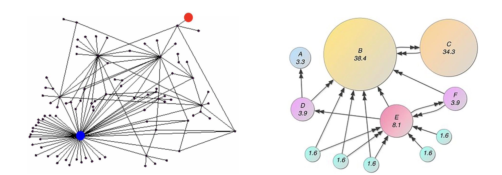
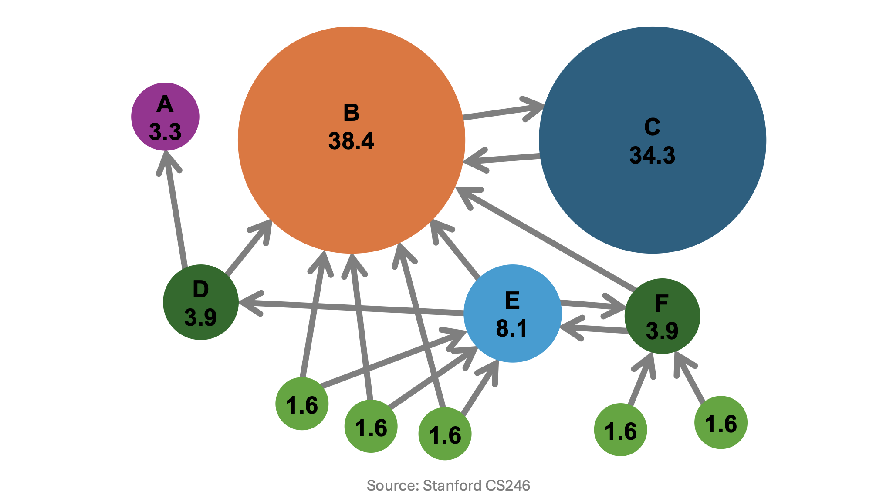
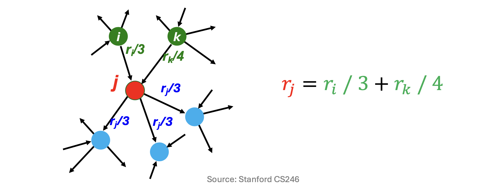
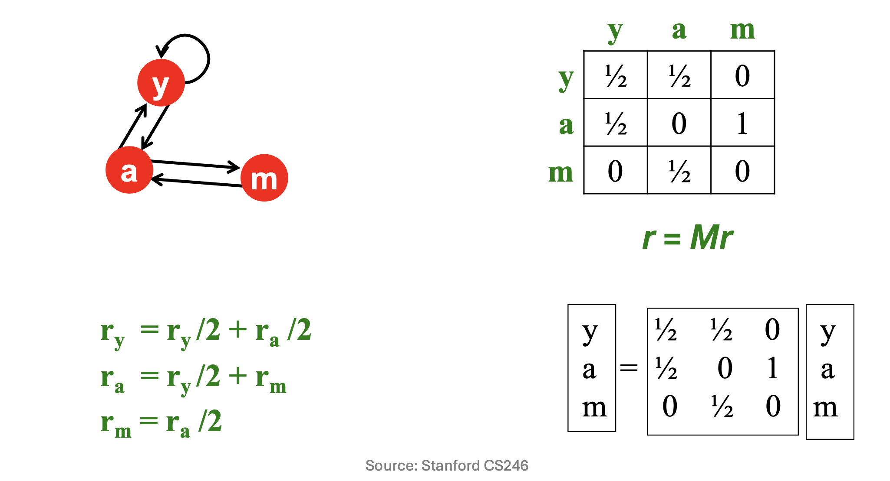
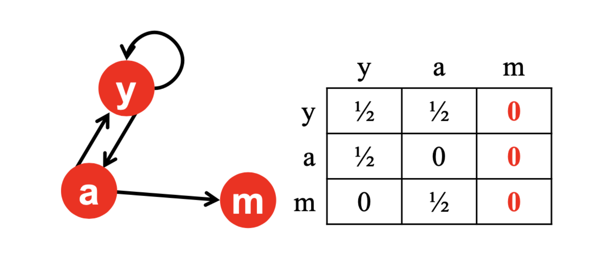
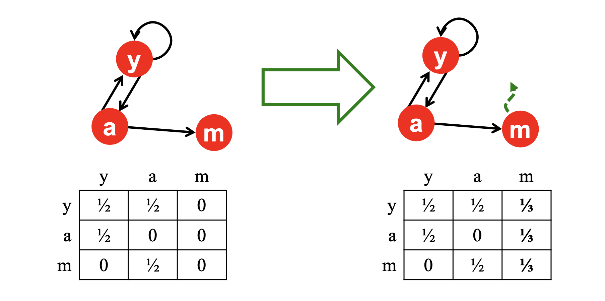
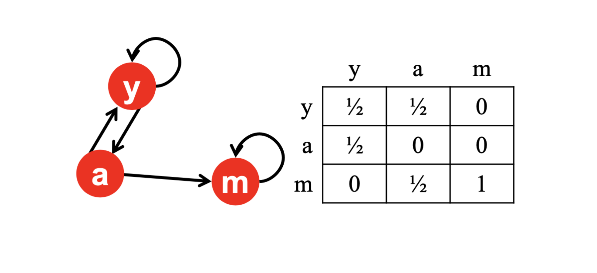
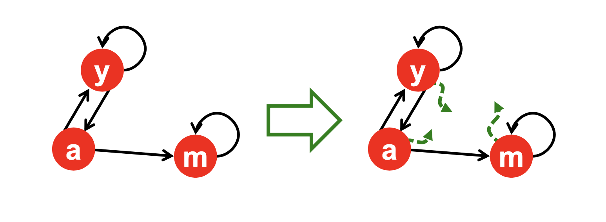

# 1. 서론: 그래프에서 중요도 순위 매기기

* 이전 포스트에서는 웹 문서들 사이의 연결 관계를 방향성 그래프(Directed Graph)와 인접 행렬(Adjacency Matrix)로 모델링하는 방법을 살펴보았습니다. 단순히 텍스트의 등장 빈도를 세는 역색인(Inverted Index) 방식은 스팸 조작에 취약했기 때문에, 웹의 구조적 연결성을 활용하는 새로운 접근이 필요했습니다.

* 1998년, 구글(Google)의 창립자인 래리 페이지(Larry Page)와 세르게이 브린(Sergey Brin)은 이 그래프 상의 노드(웹 페이지)들에 대해 중요도 순위를 매기는 혁신적인 알고리즘을 발표합니다. 이것이 바로 오늘날 구글을 세계 최고의 검색 엔진으로 만든 **페이지랭크(PageRank)**입니다. 

* 본 포스트에서는 PageRank 알고리즘이 어떤 직관에 기초하고 있는지, 이를 어떻게 수학적인 행렬 방정식으로 변환하는지, 그리고 실제 웹 생태계에서 발생하는 구조적 문제점들을 어떻게 극복했는지 상세히 유도해 보겠습니다.

---

# 2. PageRank의 두 가지 핵심 직관 (Intuitions)

* PageRank는 페이지의 권위(Authority)를 측정하기 위해 두 가지 상호보완적인 직관을 사용합니다.

## 2.1 직관 1: 투표로서의 링크 (Links as Votes)

* 하이퍼링크는 다른 페이지를 향한 **'투표(Vote)'**로 간주할 수 있습니다. 
기본적으로 자신을 가리키는 링크(In-coming links)가 많은 페이지일수록 중요하다고 판단합니다. 예를 들어, 수만 개의 사이트가 연결된 `stanford.edu`는 단 1개의 링크만 가진 개인 블로그보다 훨씬 중요할 것입니다.

* 하지만 단순히 들어오는 링크의 수를 세는 것만으로는 부족합니다. **"누가 투표했는가?"**가 중요합니다. 즉, **중요한 페이지로부터 받는 링크는 더 높은 가치(가중치)를 가집니다.** 이는 PageRank가 단순히 정적인 값이 아니라, 네트워크를 따라 재귀적 연산을 반복하여 수렴(Converged state of recursive computations)하는 값임을 시사합니다.

## 2.2 직관 2: 무작위 서퍼 모델 (Random Surfing)

* 투표라는 개념을 확률론적 관점에서 해석한 것이 **무작위 서퍼(Random Surfer) 모델**입니다.
어떤 웹 페이지가 중요하다면, 사람들은 웹서핑을 하다가 자연스럽게 그 페이지에 자주 방문하게 될 것입니다. 하지만 모든 사용자의 실제 브라우징 기록을 추적할 수는 없으므로, 다음과 같은 이상적인 무작위 서퍼를 가정합니다.
  * 1. 임의의 웹 페이지에서 서핑을 시작합니다.
  * 2. 현재 페이지에 있는 외부 링크(Out-links) 중 하나를 무작위로 클릭하여 다음 페이지로 이동합니다.
  * 3. 이 과정을 무한히 반복합니다.

* 이 모델에서 어떤 페이지의 **PageRank 점수는 곧 무한한 시간이 흘렀을 때 무작위 서퍼가 해당 페이지에 머물고 있을 '확률(Probability)'**과 정확히 일치하게 됩니다.

---

# 3. 수학적 정식화 (Mathematical Formulation)

* 이제 위에서 설명한 직관을 수식으로 엄밀하게 정의해 봅시다.

## 3.1 재귀적 방정식 (Recursive Formulation)

* 어떤 페이지 $j$의 중요도(PageRank 점수)를 $r_j$라고 합시다. 페이지 $j$가 $d_j$개의 외부 링크(out-degree)를 가지고 있다면, 이 페이지는 자신이 가진 중요도를 공평하게 $1/d_j$씩 나누어 연결된 페이지들에게 전달합니다. 즉, 페이지 $j$에서 나가는 링크 하나당 부여되는 투표의 가치는 $r_j / d_j$가 됩니다.

* 따라서 임의의 페이지 $j$의 최종 중요도 $r_j$는, 페이지 $j$를 향해 링크를 쏘는 모든 부모 페이지(노드 $i$)들로부터 전달받은 가치들의 총합으로 정의됩니다.

$$r_j = \sum_{i \rightarrow j} \frac{r_i}{d_i}$$

## 3.2 행렬 방정식 (Matrix Formulation)

* 위의 선형 방정식 시스템은 행렬을 이용해 간결하게 표현할 수 있습니다. 

* 전체 노드 수가 $n$개일 때, 그래프의 연결 상태를 크기 $n \times n$의 **전이 행렬(Transition Matrix) $M$**으로 정의합니다. 노드 $i$에서 노드 $j$로 가는 링크가 존재한다면($i \rightarrow j$), $M_{ji}$의 값은 $1/d_i$가 되며, 링크가 없다면 0이 됩니다. (참고: 전이 행렬의 정의에 따라 행은 도착지 $j$, 열은 출발지 $i$를 나타냅니다.)

* 랭크 벡터(Rank vector) $r$을 크기 $n$의 열 벡터로 정의하며, 각 원소 $r_i$는 앞서 정의한 무작위 서퍼가 노드 $i$에 있을 확률을 의미합니다. 확률이므로 다음 조건을 만족해야 합니다.
$$\sum_{i=1}^{n} r_i = 1 \quad \text{and} \quad r_i \ge 0 \quad \forall i$$

* 행렬 $M$의 각 열(column)의 합은 1이 되므로, $M$은 **열 확률 행렬(Column-stochastic matrix)**이 됩니다. 최종적으로 PageRank의 재귀식은 선형대수학의 고윳값 문제(Eigenvalue problem) 형태인 다음 방정식으로 귀결됩니다.

$$r = M r$$

* 이는 랭크 벡터 $r$이 전이 행렬 $M$의 고윳값이 1일 때의 **고유벡터(Eigenvector)**이자 마르코프 체인(Markov Chain)의 **정상 분포(Stationary distribution)**임을 의미합니다.

---

# 4. 현실 웹 그래프의 결함과 구글의 해결책

* 이론적으로는 아름다운 이 모델은, 실제 웹 환경에 적용할 때 두 가지 구조적 결함으로 인해 시스템이 붕괴하는 문제를 겪습니다. 구글은 각 문제에 대해 '순간이동(Teleportation)'이라는 우아한 해법을 제시했습니다.

## 4.1 문제 1: 막다른 노드 (Dead Ends)

* **데드 엔드(Dead Ends)**란 다른 어떤 페이지로도 링크를 내보내지 않는(Out-link가 0인) 페이지를 말합니다. 
* 무작위 서퍼가 웹 서핑을 하다가 이 페이지에 도달하면 더 이상 나갈 곳이 없으므로 서핑이 종료됩니다. 

* **수학적 문제:** 데드 엔드 노드에 해당하는 전이 행렬 $M$의 열(Column)은 모든 원소가 0이 됩니다. 결과적으로 $M$은 더 이상 확률 행렬(Stochastic matrix)이 아니게 되며, 시스템의 점수가 밖으로 빠져나가지 못하고 점진적으로 **'증발(Leak out)'**해버립니다.

### 해결책: 항상 순간이동 (Always Teleport)

* 나갈 곳이 없는 페이지에 도달한 서퍼는 브라우저를 끄는 것이 아니라, 주소창에 무작위로 새로운 주소를 입력할 것입니다. 즉, 데드 엔드 노드에서는 **확률 1로 그래프 내의 임의의 노드로 순간이동** 하도록 가정을 수정합니다.

* 전체 노드 수가 $n$개일 때, 행렬 $M$에서 원소가 모두 0이었던 데드 엔드 노드의 열을 모두 $1/n$로 채워 넣어 행렬을 완벽한 확률 행렬로 복구합니다.

## 4.2 문제 2: 스파이더 트랩 (Spider Traps)

* **스파이더 트랩(Spider Traps)**이란 밖으로 나가는 링크가 아예 없는 것은 아니지만, 오직 자기 자신이나 자신이 속한 작은 그룹 내부로만 링크를 순환시키는 구조를 말합니다.

* **수학적 문제:** 무작위 서퍼가 이곳에 우연히 진입하면 영원히 빠져나오지 못하게 됩니다. 행렬은 확률 행렬 조건을 만족하지만, 시간이 지날수록 그래프 전체의 중요도가 이 트랩 내부의 노드로 모두 **흡수(Absorb)**되어 버리는 극단적인 편향이 발생합니다.

### 해결책: 확률적 순간이동 (Probabilistically Teleport)

* 스파이더 트랩을 벗어나기 위해서는 사용자가 링크 클릭 행동 자체에 변칙을 주어야 합니다. 매 시점마다 무작위 서퍼는 다음 두 가지 행동 중 하나를 선택합니다.
  * 1. **확률 $\beta$:** 현재 페이지에 있는 정상적인 링크 중 하나를 따라 무작위로 이동합니다. (일반적인 서핑)
  * 2. **확률 $1-\beta$:** 링크를 무시하고 웹 상의 임의의 페이지로 순간이동합니다. (랜덤 점프)

* 여기서 $\beta$를 **감쇠 계수(Damping factor)**라고 부르며, 일반적으로 **0.8 ~ 0.9**로 설정됩니다. 서퍼는 아무리 견고한 스파이더 트랩에 갇히더라도, 몇 단계 지나지 않아 확률적으로 트랩 밖으로 순간이동하여 탈출하게 됩니다.

---

# 5. 구글 행렬 (The Google Matrix) 완성

* 래리 페이지와 세르게이 브린이 제시한 최종적인 PageRank 방정식은 이 두 가지 순간이동 아이디어를 모두 결합한 것입니다. 

$$r_j = \sum_{i \rightarrow j} \beta \frac{r_i}{d_i} + (1-\beta)\frac{1}{n}$$

* 이 스칼라 방정식을 행렬 형태로 변환하면, 치명적 결함을 모두 보완한 새로운 전이 행렬인 **구글 행렬(Google Matrix) $A$**를 얻을 수 있습니다. (단, 기존 $M$ 행렬의 Dead End 열은 이미 $1/n$로 보정되어 있다고 가정합니다.)

$$A = \beta M + (1-\beta)\left[ \frac{1}{n} \right]_{n \times n}$$

* 행렬 $A$는 원래의 링크 구조를 따를 확률 행렬($\beta M$)과 임의의 노드로 점프할 균등 분포 확률 행렬의 볼록 결합(Convex combination)이므로, 항상 수학적으로 완벽한 **확률 행렬(Stochastic matrix)**임이 보장됩니다. 

* 이 구글 행렬 $A$를 이용하여 $r = A r$을 풀면, 어떠한 웹 구조에서도 항상 고유하고 안정적인 PageRank 점수 벡터 $r$을 얻을 수 있습니다.

---

# 6. 확장: 무방향 그래프에서의 PageRank

* 추가로, 링크가 양방향으로 성립하는 소셜 네트워크의 친구 관계 같은 **무방향 그래프(Undirected Graph)**에서 PageRank를 계산하면 흥미로운 결과가 도출됩니다.
  * $n$: 전체 노드의 수
  * $m$: 전체 간선의 수 (무방향이므로 전체 차수의 합은 $2m$)
  * $d_v$: 특정 노드 $v$의 연결 차수(degree)

* 관계가 양방향 대칭(Symmetric)이므로 특정 그룹으로 점수가 쏠리는 현상이 발생하지 않습니다. 그 결과, 임의의 노드 $v$의 PageRank 점수 $r_v$는 단지 전체 네트워크의 연결선 중 자신이 차지하는 차수(degree)의 비율로 자명하게 결정됩니다.

$$r_v = \frac{d_v}{2m}$$

* 방정식 $r = Mr$에서 각 $r_i$ 자리에 $d_i / 2m$을 대입해보면, 좌우변이 정확히 일치하여 등식이 성립함을 쉽게 수학적으로 증명할 수 있습니다.