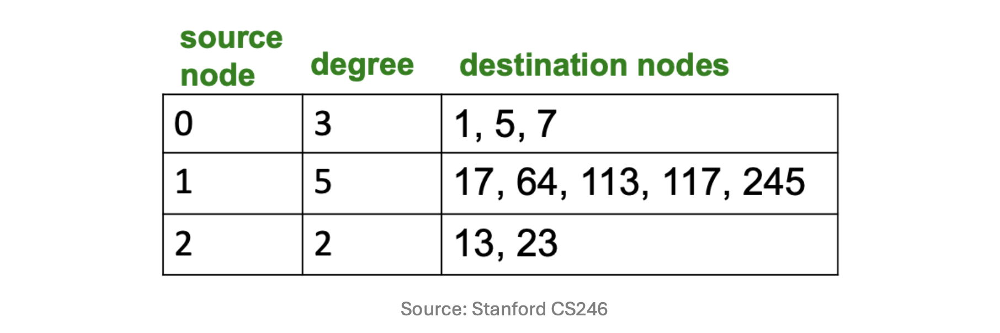
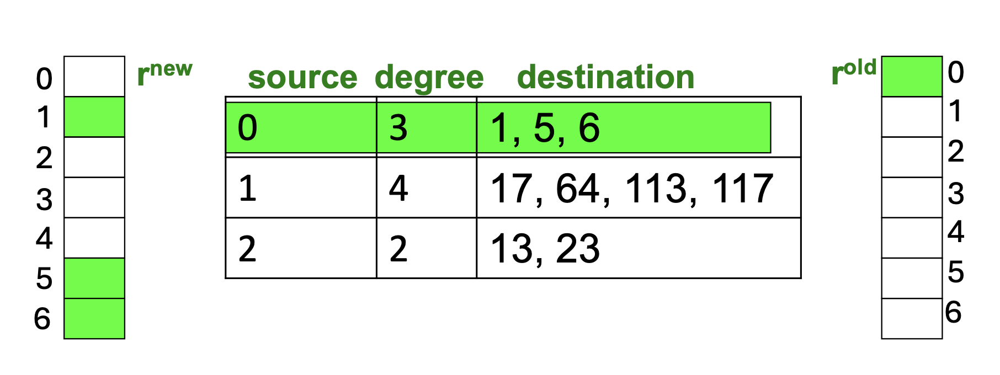

# 1. 서론: 구글 행렬(Google Matrix)의 역설

* 이전 포스트에서 우리는 멱제곱법(Power Iteration)을 활용해 PageRank 벡터 $r$을 계산하는 원리를 살펴보고, 이를 위해 수학적으로 수렴성이 보장된 구글 행렬 $A$를 도출했습니다.

$$A = \beta M + (1-\beta)\left[\frac{1}{n}\right]_{n \times n}$$

* 하지만 이 수식을 실제 구글 검색 엔진에 그대로 적용하려고 하면 치명적인 컴퓨팅 한계에 직면하게 됩니다. 
* 웹 페이지 간의 링크 연결 구조를 나타내는 전이 행렬 $M$은 0이 압도적으로 많은 **희소 행렬(Sparse Matrix)**입니다. 반면, 무작위 순간이동을 나타내는 두 번째 항 때문에 최종 산출된 **구글 행렬 $A$는 모든 원소가 0이 아닌 조밀 행렬(Dense Matrix)**이 되어버립니다. 

* 전 세계 웹 페이지 수 $n$이 수백억 개 단위임을 감안할 때, $n \times n$ 크기의 조밀 행렬을 메모리(RAM)는 물론이고 하드 디스크에 명시적으로 생성하고 저장하는 것조차 불가능합니다. 본 포스트에서는 이 공간 복잡도의 한계를 수학적 트릭과 자료구조 최적화를 통해 어떻게 극복했는지 살펴봅니다.

---

# 2. 수식의 재구성 (Rearranging the Equation)

* 행렬 $A$를 메모리에 올릴 수 없다면, 애초에 $A$를 명시적으로 만들지 않고 멱제곱법 연산($r = Ar$)을 수행해야 합니다. 이를 위해 PageRank 방정식을 다시 전개해 봅니다.

$$r = A r$$
$$r = \left( \beta M + (1-\beta)\left[\frac{1}{n}\right]_{n \times n} \right) r$$
$$r = \beta M r + (1-\beta)\left[\frac{1}{n}\right]_{n \times n} r$$

* 여기서 랭크 벡터 $r$은 모든 원소의 합이 1인 확률 벡터입니다 ($\sum_{i=1}^n r_i = 1$). 
* 따라서 모든 원소가 $1/n$인 $n \times n$ 행렬과 $r$ 벡터를 곱하면, 단순히 모든 원소가 $1/n$인 $n$차원 열 벡터가 결과로 나옵니다. 이를 수식으로 깔끔하게 정리하면 다음과 같습니다.

$$r = \beta M r + \left[\frac{1-\beta}{n}\right]_n$$

* 이 재구성된 방정식의 의미는 엄청납니다. 이제 우리는 거대한 조밀 행렬 $A$와 벡터의 곱셈을 수행할 필요가 없습니다. 연산의 핵심(Core operation)이 **희소 행렬 $M$과 벡터 $r$의 곱셈(Sparse matrix-vector multiplication)**으로 바뀌었기 때문입니다.

---

# 3. 희소 행렬 인코딩 (Sparse Matrix Encoding)

* 수식에서 $\beta M r$ 연산만을 수행하면 되므로, 행렬 $M$ 전체를 $n \times n$ 형태로 저장할 필요가 없습니다. 대부분의 공간을 차지하는 0을 제외하고, 0이 아닌 실제 연결(Nonzero entries) 데이터만 인코딩하여 저장합니다.

* 이렇게 하면 필요한 저장 공간은 웹 페이지 수의 제곱($n^2$)이 아니라, **실제 존재하는 웹 링크의 총개수에 대략적으로 비례(Proportional with the number of links)**하게 줄어듭니다.

* 일반적으로 이를 구현하기 위해 아래 그림과 같이 각 페이지(Source node)가 나가는 링크의 개수(Degree)와 도착지 페이지 번호(Destination nodes)만을 리스트 형태로 묶어서 디스크에 저장합니다.

* 이렇게 압축을 하더라도 수십억 개의 노드를 가진 거대한 그래프 정보는 여전히 메인 메모리(RAM)에 한 번에 올라가지 못할 수 있지만, 디스크(Disk)에는 충분히 저장할 수 있는 수준이 됩니다.

---

# 4. PageRank 연산을 위한 기본 알고리즘

* 이제 디스크에 저장된 희소 행렬 데이터를 활용하여 멱제곱법(Power Iteration)의 단일 스텝을 수행하는 알고리즘을 설계해 보겠습니다. 

* **기본 가정(Assumption):** 새롭게 계산되어 업데이트될 PageRank 벡터인 $r^{new}$ (크기 $n$) 하나 정도는 메인 메모리(RAM)에 충분히 올릴 수 있다고 가정합니다. 반면, 거대한 희소 행렬 $M$과 이전 단계의 랭크 벡터 $r^{old}$는 하드 디스크에 저장되어 있습니다.

## 4.1 알고리즘 의사코드 (Pseudocode)

* 매 반복(Iteration) 단계마다 다음의 과정을 거쳐 $r^{new}$를 업데이트합니다.
  * 1. **초기화:** 메모리 내의 $r^{new}$ 벡터의 모든 원소를 상수항에 해당하는 $\frac{1-\beta}{n}$ 로 초기화합니다.
     $$r^{new}_j = \frac{1-\beta}{n} \quad \text{for all } j$$
  * 2. **디스크 순차 탐색:** 각 페이지 $i$에 대하여 디스크에서 다음 정보들을 메모리로 순차적으로 읽어 들입니다.
     * 출발지 노드 번호: $i$
     * 외부 링크 개수: $d_i$
     * 도착지 노드 목록: $dest_1, \dots, dest_{d_i}$
     * 노드 $i$의 이전 PageRank 점수: $r^{old}(i)$
  * 3. **점수 분배 (메모리 업데이트):** 노드 $i$가 가진 $r^{old}(i)$ 점수를 외부 링크 수 $d_i$로 나눈 뒤 감쇠 계수 $\beta$를 곱하여, 모든 도착지 노드 $dest_j$의 $r^{new}$ 누적합 공간에 더해줍니다.
     $$\text{For } j = 1, \dots, d_i :$$
     $$r^{new}(dest_j) \mathrel{+}= \beta \frac{r^{old}(i)}{d_i}$$

## 4.2 알고리즘의 장점과 한계

* 이 방식의 가장 큰 장점은 **매 반복(Iteration)마다 하드 디스크를 단 한 번만 순차적으로 스캔(Only one full disk access)**하면 된다는 점입니다. 랜덤 액세스(Random access) 없이 순차 읽기(Sequential read)를 수행하므로 디스크 I/O 비용이 대폭 감소합니다.

* 하지만 웹 규모가 지속적으로 커짐에 따라, $r^{new}$ 벡터조차 단일 컴퓨터의 메모리 용량을 초과하게 되었고 한 대의 서버로 디스크를 읽는 것의 물리적 한계에 부딪혔습니다. 

* 이러한 "여전히 느린(Still slow?)" 문제를 해결하고 PageRank 계산을 수백, 수천 대의 컴퓨터에 분산시키기 위해 구글이 개발한 프레임워크가 바로, 오늘날 빅데이터 처리의 근간이 된 **맵리듀스(MapReduce)**입니다. (실제로 MapReduce는 초기에 PageRank를 계산하기 위한 목적으로 설계되었습니다.)