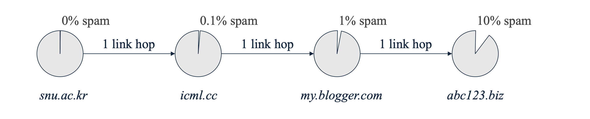
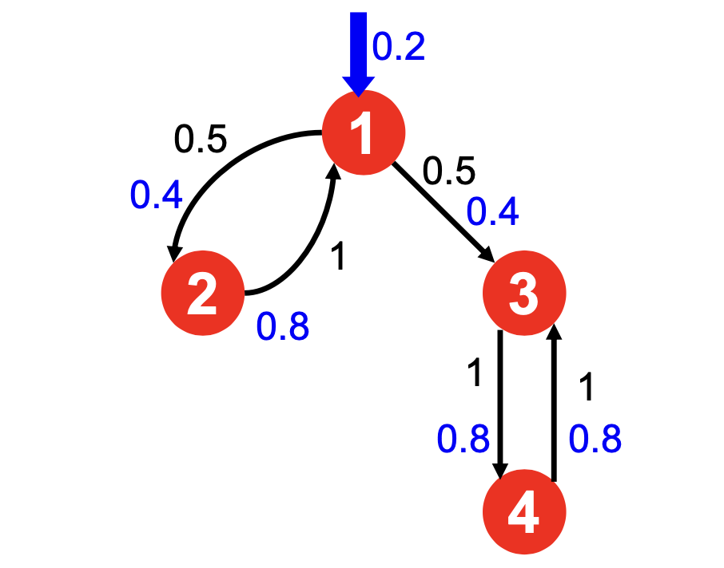
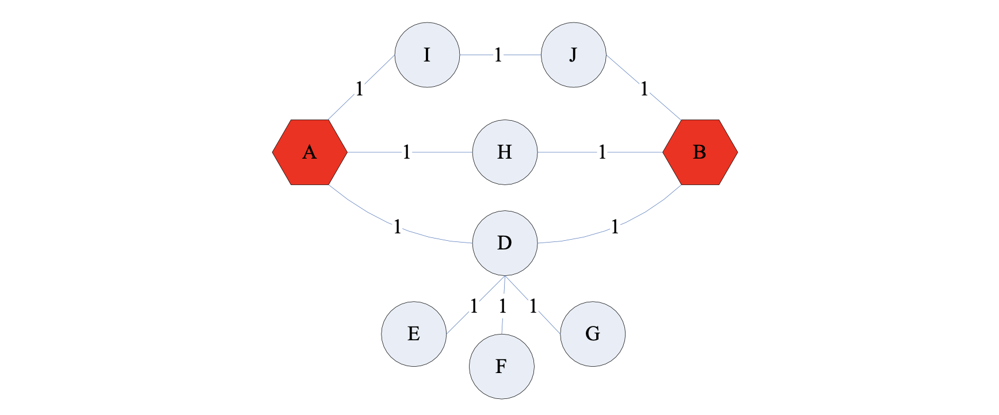
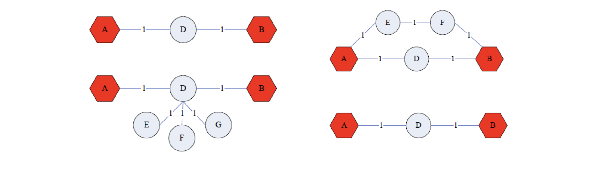
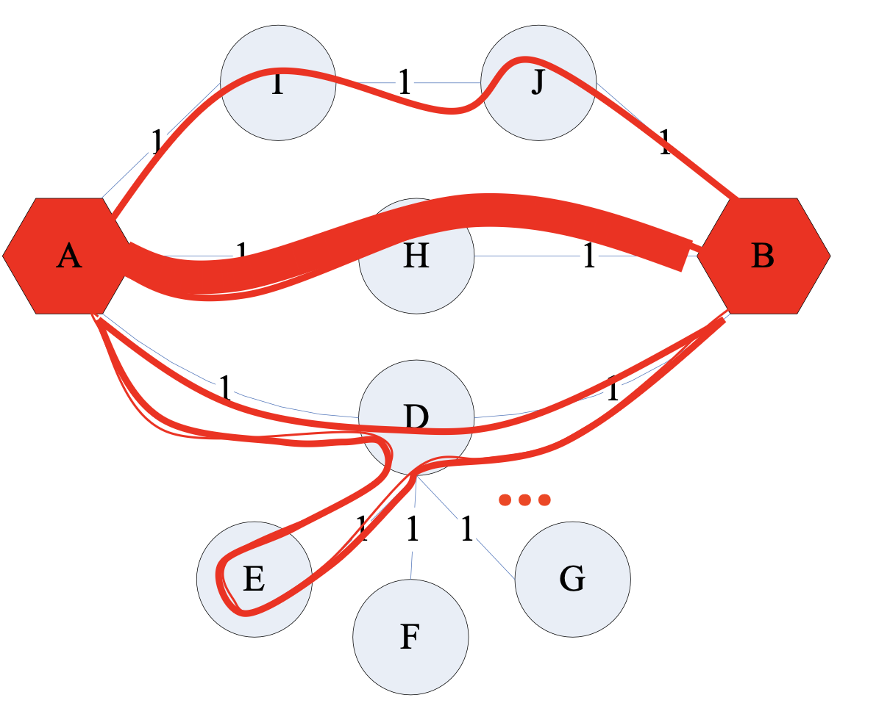

# 1. Introduction: PageRank의 취약점과 Link Spam

* 초기 검색 엔진의 성공을 이끈 핵심 알고리즘인 PageRank는 웹페이지의 중요도를 측정하는 강력한 도구입니다. 그러나 검색 결과 상단 노출의 가치가 커지면서, 스패머(Spammer)들은 인위적으로 PageRank 알고리즘을 속일 방법을 고안하기 시작했습니다. 

* 가장 대표적인 공격 방식은 **Link Spam**입니다. 이는 특정 대상 페이지의 PageRank를 인위적으로 증폭시키기 위해 조작된 링크 구조를 생성하는 기법을 말합니다. 이러한 스팸 링크들을 위해 대규모로 조직된 페이지들의 군집을 **Link Farm(링크 농장)**이라고 부릅니다. 본 문서에서는 Link Farm의 수학적 원리를 분석하고, 이를 방어하기 위한 TrustRank 알고리즘과 네트워크 근접성을 측정하는 Topic-Specific PageRank를 다룹니다.

---

# 2. Link Farms: 스패머의 관점에서 본 웹의 구조

* 스패머의 궁극적인 목표는 단일 타겟 페이지(Target Page, $t$)의 PageRank 점수를 극대화하는 것입니다. 이를 위해 스패머들은 전체 웹페이지를 통제 가능성에 따라 세 가지로 분류합니다.
  * 1. **Owned Pages (소유 페이지)**: 스패머가 완전히 통제할 수 있는 페이지들입니다. 다수의 도메인에 걸쳐 봇(Bot)을 통해 수백만 개를 기계적으로 생성할 수 있습니다.
  * 2. **Accessible Pages (접근 가능 페이지)**: 스패머가 소유하지는 않지만, 임의로 링크를 삽입할 수 있는 외부 페이지들입니다. 블로그나 뉴스 기사의 댓글, 위키피디아 등이 여기에 해당합니다.
  * 3. **Inaccessible Pages (접근 불가 페이지)**: 웹의 절대다수를 차지하며, 스패머가 어떠한 임의 조작도 할 수 없는 일반적인 페이지들입니다.

* 위 그림과 같이 스패머는 Accessible 페이지에 스팸성 링크를 달아 타겟 페이지 $t$로 향하는 초기 트래픽을 확보합니다. 동시에 수백만 개의 Owned 페이지(1부터 M까지)를 생성하여 $t$와 상호 참조(양방향 링크)하도록 네트워크를 엮습니다 . 이 구조가 타겟 페이지의 점수를 어떻게 증폭시키는지 수식으로 확인해보겠습니다.

---

# 3. Mathematical Analysis of Link Farms

* Link Farm이 타겟 페이지 $t$의 점수에 미치는 영향을 엄밀하게 유도해 봅니다. 분석을 위해 다음과 같은 기호를 정의합니다.
  * $N \gg 0$: 전체 웹페이지의 총 개수.
  * $M > 0$: 스패머가 소유한(Owned) Farm 페이지의 총 개수.
  * $\beta$: Damping factor (랜덤 텔레포트 방지 계수).
  * $x$: Accessible 페이지들로부터 타겟 페이지 $t$로 유입되는 PageRank 기여분.
  * $y$: 타겟 페이지 $t$의 최종 PageRank 점수.
  * $z$: Owned 페이지들로부터 타겟 페이지 $t$로 유입되는 PageRank 기여분.

## 3.1. PageRank 공식의 설정
* 타겟 페이지 $t$의 PageRank 점수 $y$는 외부의 기여분($x$), 자신이 통제하는 기여분($z$), 그리고 무작위 텔레포트에 의한 고정 기여분으로 구성됩니다.

$$y = x + z + \frac{1-\beta}{N}$$ 

* 웹의 크기 $N$이 매우 크기 때문에, $\frac{1-\beta}{N}$ 항은 0에 가까운 아주 작은 상수가 되어 계산 편의상 무시할 수 있습니다.

$$y \approx x + z$$ 

## 3.2. Owned Page의 PageRank 도출
* 각각의 Owned 페이지는 타겟 페이지 $t$로부터만 링크를 받도록 설계됩니다. 타겟 페이지 $t$는 $M$개의 Owned 페이지로 링크를 균등하게 나누어 줍니다. 따라서 개별 Owned 페이지의 점수는 $t$로부터 받는 $\frac{\beta y}{M}$에 기본 텔레포트 확률을 더한 값이 됩니다.

$$\text{PR}(\text{Owned}_i) = \frac{\beta y}{M} + \frac{1-\beta}{N}$$ 

## 3.3. 타겟 페이지 $y$의 최종 증폭률 유도
* 타겟 페이지 $t$는 $M$개의 Owned 페이지 모두로부터 온전하게 링크를 다시 돌려받습니다. 즉, 전체 Owned 페이지가 $t$에 기여하는 총합 $z$는 개별 Owned 페이지 점수에 $\beta$를 곱한 후 전체 개수 $M$을 곱한 것과 같습니다. 이를 $y$ 방정식에 대입합니다.

$$y = x + \beta M \left[ \frac{\beta y}{M} + \frac{1-\beta}{N} \right]$$ 

* 이 식을 $y$에 대해 전개하여 풀면 다음과 같습니다.

$$y - \beta^2 y = x + \frac{\beta M (1-\beta)}{N}$$
$$y(1 - \beta^2) = x + \frac{\beta M (1-\beta)}{N}$$

* 양변을 $(1 - \beta^2)$으로 나눕니다. 합차 공식 $(1-\beta^2) = (1-\beta)(1+\beta)$를 적용하여 분모분자를 약분하면 최종적인 $y$의 공식을 얻을 수 있습니다.

$$y = \frac{x}{1-\beta^2} + \frac{\beta M}{(1+\beta)N}$$ 

## 3.4. 분석 결과와 시사점
* Google 시스템의 일반적인 $\beta = 0.85$를 위 식에 대입해 보겠습니다.
* $(1-0.85^2) \approx 0.2775$ 이고, $1 / 0.2775 \approx 3.6$입니다.
* $\beta / (1+\beta) = 0.85 / 1.85 \approx 0.46$이 됩니다.

$$y = 3.6x + \frac{0.46}{N}M$$ 

* 이 공식의 결론은 치명적입니다. 스패머는 외부의 유효한 트래픽 $x$를 3.6배 증폭시킬 수 있습니다. 더 나아가, 상수로 취급되는 $\beta$와 $N$은 통제할 수 없지만, 봇(Bots)을 이용해 만들어내는 농장 페이지의 수 **$M$은 원하는 만큼 기하급수적으로 늘릴 수 있습니다**. 따라서 $M$의 증가만으로 타겟 페이지의 점수를 무한히 끌어올릴 수 있다는 결론에 도달합니다.

---

# 4. TrustRank: 스팸 방어 알고리즘

* Link Farm에 의한 PageRank 조작을 방어하기 위해 **TrustRank**라는 알고리즘이 제안되었습니다. TrustRank는 균등한 무작위 텔레포트(Uniform Teleportation)라는 기존 PageRank의 맹점을 역이용합니다.

## 4.1. 기본 가정과 원리
* **Assumption (가정)**: "신뢰할 수 있는(Trustworthy) 페이지는 스팸 페이지로 링크를 걸지 않을 것이다".
* **Mechanism**: 랜덤 워크 시 텔레포트를 할 때, 모든 웹페이지가 아닌 **사전에 정의된 신뢰할 수 있는 텔레포트 집합(Teleport set, $S$)으로만 이동**하도록 무작위성을 편향시킵니다.

## 4.2. Teleport Set $S$의 구축
* 신뢰도 높은 집합 $S$를 구축하기 위한 대표적인 접근 방식은 다음 두 가지입니다.
  * 1. **Human Evaluation**: 기존 PageRank 점수가 높은 최상위 페이지들을 사람이 직접 검수하여 신뢰 가능한 화이트리스트를 구성합니다.
  * 2. **Domain Membership**: 임의 발급이 불가능하고 통제되는 특수 도메인(예: `.edu`, `.gov`, `.ac.kr` 등)을 $S$ 집합으로 지정합니다.

* 위 다이어그램에서 보듯, 신뢰할 수 있는 시드(Seed) 노드로부터 링크를 타고 이동하는 거리(Hop)가 길어질수록, 해당 페이지가 스팸일 확률은 기하급수적으로 높아집니다 .

## 4.3. Matrix Formulation (행렬 수학 공식)
* 일반 PageRank 행렬의 텔레포트 항을 수정하여 TrustRank 전이 행렬 $A$를 다음과 같이 정의합니다.

$$ A_{ij} = \begin{cases} 
\beta M_{ij} + \frac{1-\beta}{|S|} & \text{if } i \in S \\ 
\beta M_{ij} & \text{otherwise} 
\end{cases} $$ 

* 여기서 $M_{ij}$는 노드 $j$에서 노드 $i$로 향하는 링크의 역수 확률 행렬입니다. 이 변형 행렬 역시 각 열의 합이 1을 유지하므로 마르코프 체인의 성질이 유지되며, 집합 $S$ 내의 페이지마다 서로 다른 가중치를 부여할 수도 있습니다.

* 예를 들어, $\beta=0.8$ 이고 $S=\{1\}$ 일 때 , 지속적으로 반복 연산을 수행하면 네트워크 전체로 TrustRank 점수가 전파되며, in-link가 없거나 적더라도 집합 $S$에 포함되거나 인접한 노드들은 최종적으로 매우 높은 안정 상태(Stable) 점수를 확보하게 됩니다.

---

# 5. Topic-Specific PageRank & Random Walk with Restarts (RWR)

* TrustRank는 본질적으로 특정한 목적(스팸 필터링)을 위해 텔레포트 대상을 편향시킨 **Topic-Specific PageRank**의 한 형태입니다 . 이를 일반화하면 다양한 형태의 네트워크 근접성 측정 모델로 확장할 수 있습니다.

## 5.1. 네트워크에서 근접성(Proximity) 평가의 어려움
* 네트워크 노드 $A$와 $B$가 얼마나 가까운지(Proximity)를 평가한다고 해봅시다.

* 일반적으로 최단 경로(Shortest path)를 떠올리기 쉽지만, 이는 복잡한 그래프 환경에서 좋은 지표가 되지 못합니다.

* 1. **말단 노드 무시**: 차수(Degree)가 1인 노드(E, F, G)들이 추가되더라도 최단 경로는 이를 계산에 넣지 못합니다. 위 그래프처럼 D에 주변부 노드가 많이 붙어있을수록, 랜덤 탐색에서는 D에 갇힐 확률이 높아져 실질적으로 $A$와 $B$의 거리는 멀어지지만, 최단 경로 공식은 이를 포착하지 못합니다.
* 2. **다중 관계(Multi-faceted relationships) 무시**: 노드 사이를 잇는 다양한 우회로나 복수 연결 다발이 가지는 응집력을 최단 거리는 단순히 '하나의 경로'로 취급해버립니다.

## 5.2. Random Walk with Restarts (RWR)
* 최단 경로의 단점을 보완하고 진정한 형태의 근접성을 도출해내는 해법이 바로 **Random Walk with Restarts (재시작이 있는 랜덤 워크)**, 또는 **Personalized PageRank (PPR)**입니다 .

* RWR의 동작 원리는 텔레포트 범위를 단일한 "기준 노드" 하나로 고정하는 것입니다.
  * 질의 노드가 $A$라면, 텔레포트 집합을 $S=\{A\}$ 하나로 설정합니다.
  * 무작위 이동을 진행하다 텔레포트가 발동되면, 언제 어디서든 무조건 다시 노드 $A$로 돌아와(Restart) 탐색을 시작합니다.
  * 수없이 탐색을 반복하여 도출된 수렴 점수 $r_j$는, 네트워크의 모든 간선 확률과 우회로, 주변부 노드 분산 구조 등을 모두 반영한 종합적인 **$A$와의 Proximity(근접성)** 점수가 됩니다.

* 이 알고리즘은 추천 시스템(Recommendation System) 등에서 개별 사용자의 위치(Node)를 기준으로 개인화된(Personalized) 정보를 검색하고 제공하는 핵심 기술로 활용됩니다.