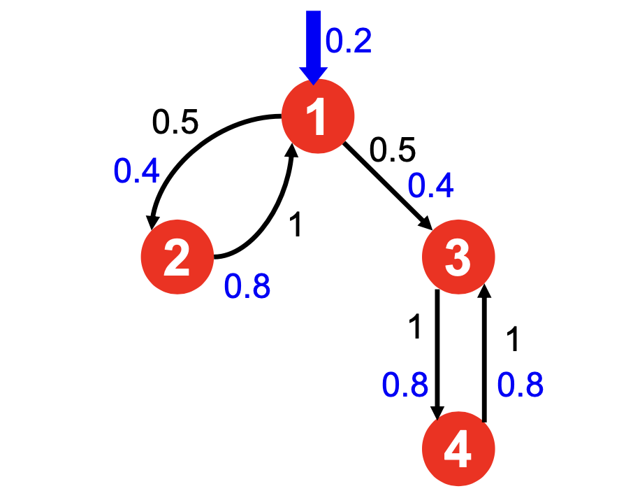
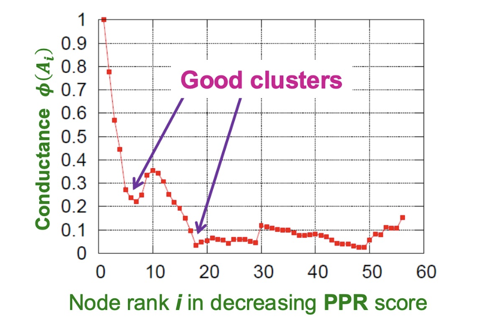

# 들어가며 (Overview)

이번 포스트는 SNU 데이터 마이닝 강의 "Link Analysis 2"의 내용을 다룹니다. 지난 강의에서 PageRank의 기본 아이디어와 Google Matrix, Sparse Encoding까지 살펴봤습니다. 이번에는 그 위에서 자연스럽게 등장하는 세 가지 큰 주제를 다룹니다.

1. **Topic-Specific PageRank**: 스팸 공격에 대응하는 TrustRank, 그리고 노드 간 근접도(proximity) 측정 도구로서의 Personalized PageRank
2. **Community Detection**: 그래프에서 의미 있는 클러스터를 찾는 방법과 그 품질 지표
3. **Approximate Personalized PageRank (APPR)**: 전체 그래프를 탐색하지 않고도 PPR을 효율적으로 근사하는 알고리즘

---

## 지난 강의 요약 (Recap)

본격적인 내용에 앞서 지난 시간의 핵심을 간략히 짚고 넘어가겠습니다.

- **PageRank**는 웹 그래프 위의 무작위 보행(random walk)을 통해 각 노드의 중요도를 정량화합니다.
- **Google Matrix**는 수렴성과 고유한 정류 분포(stationary distribution)를 보장하기 위해 다음과 같이 정의됩니다.

$$
A = \beta M + (1-\beta) \left[\frac{1}{N}\right]_{N \times N}
$$

- $M$: 열(column) 방향으로 정규화된 하이퍼링크 행렬
- $\beta$: 링크를 따라갈 확률 (일반적으로 0.8~0.9)
- $(1-\beta)$: 전체 페이지 중 임의의 페이지로 순간이동(teleport)할 확률
- $N$: 전체 페이지 수

PageRank 벡터 $\mathbf{r}$은 $\mathbf{r} = A\mathbf{r}$ 을 만족하는 고유벡터(eigenvector)로, 거듭제곱 반복법(power iteration)으로 수렴합니다.

---

# 1. Topic-Specific PageRank

## Google vs. Spammers: Round 2

PageRank는 등장 직후부터 스패머들의 공격 대상이 되었습니다.

- **링크 스팸(Link spam)**: 특정 페이지의 PageRank를 인위적으로 끌어올리기 위해 링크 구조를 조작하는 행위
- **링크 팜(Link farm)**: 링크 스팸을 위해 만들어진 페이지들의 집합

스패머 입장에서 웹 페이지는 세 종류로 분류됩니다.

| 종류 | 설명 |
|------|------|
| **Owned pages** | 스패머가 완전히 통제 가능한 페이지 (다수의 도메인에 걸쳐 있을 수 있음) |
| **Accessible pages** | 링크를 삽입할 수 있는 페이지 (블로그 댓글, 신문 댓글, Wikipedia 등) |
| **Inaccessible pages** | 스패머가 손댈 수 없는 대부분의 웹 |

---

## Link Farms

### 링크 팜의 구조

링크 팜의 최종 목표는 **타깃 페이지 $t$의 PageRank를 극대화**하는 것입니다.

전략적으로:
- Accessible 페이지에 $t$로 향하는 링크를 심어 외부 유입 점수를 올립니다.
- 수백만 개의 Owned 페이지가 $t$에 링크를 걸도록 하여 PageRank를 증폭시킵니다.


---

### Link Farms: Analysis — PageRank 수식 유도

링크 팜이 얼마나 효과적인지 수식으로 분석해 보겠습니다. 다음 기호를 정의합니다.

- $N$: 전체 웹 페이지 수 ($N \gg 0$)
- $x$: Accessible 페이지들로부터 $t$에 기여되는 PageRank
- $y$: 타깃 페이지 $t$의 PageRank (우리가 최대화하려는 값)
- $c$: Owned 팜 페이지들로부터 $t$에 기여되는 PageRank
- $M$: 스패머가 소유한 팜 페이지의 수

**Step 1: $y$에 대한 기본 방정식 세우기**

타깃 페이지 $t$의 PageRank는 외부 기여 + 팜 기여 + 텔레포테이션 항의 합입니다.

$$
y = x + c + \frac{1-\beta}{N}
$$

$N \gg 0$이므로 텔레포테이션 항 $\frac{1-\beta}{N}$은 무시할 수 있습니다.

$$
y \approx x + c
$$

**Step 2: 팜 페이지 각각의 PageRank 계산**

각 팜 페이지는 $t$에만 링크를 걸고 있으므로, $t$로부터 링크를 1개 받습니다. $t$의 출력 링크가 $M$개이므로, $t$가 각 팜 페이지에 전달하는 PageRank는 $y/M$입니다.

따라서 팜 페이지 하나의 PageRank는

$$
p_{\text{farm}} = \beta \cdot \frac{y}{M} + \frac{1-\beta}{N}
$$

**Step 3: $c$를 구하고 $y$에 대입**

$M$개의 팜 페이지가 모두 $t$에 링크를 걸므로, $t$는 각 팜 페이지로부터 $\beta \cdot p_{\text{farm}}$를 받습니다. 따라서

$$
c = M \cdot \beta \cdot p_{\text{farm}}
  = M \cdot \beta \cdot \left(\frac{\beta y}{M} + \frac{1-\beta}{N}\right)
  = \beta^2 y + \frac{M\beta(1-\beta)}{N}
$$

$y \approx x + c$에 대입하면

$$
y \approx x + \beta^2 y + \frac{M\beta(1-\beta)}{N}
$$

**Step 4: $y$에 대해 풀기**

$$
y(1 - \beta^2) \approx x + \frac{M\beta(1-\beta)}{N}
$$

$$
\boxed{y = \frac{x}{1-\beta^2} + \frac{M\beta(1-\beta)}{N(1-\beta^2)}}
$$

$1 - \beta^2 = (1-\beta)(1+\beta)$를 이용해 정리하면

$$
y = \frac{x}{1-\beta^2} + \frac{M\beta}{N(1+\beta)}
$$

**Step 5: $\beta = 0.85$ 대입**

$$
y = \frac{x}{1 - 0.85^2} + \frac{0.85 \cdot M}{1.85 \cdot N}
  = 3.6x + \frac{0.85}{1.85} \cdot \frac{M}{N}
$$

**핵심 결론**: 스패머는 $M$ (팜 페이지 수)을 얼마든지 늘릴 수 있습니다. 봇(bot)으로 수백만 개의 팜 페이지를 만들면 $y$를 사실상 무한정 키울 수 있습니다.

- $x$와 $N$은 통제 불가능
- **$M$은 통제 가능** → 팜 규모를 키울수록 $y$ 증가

---

## TrustRank

### 직관 및 동기

링크 팜 문제를 해결하기 위한 핵심 직관은 다음과 같습니다.

> **신뢰할 수 있는 페이지는 스팸 페이지에 링크를 걸 가능성이 낮다.**

이 직관에서 **TrustRank**가 탄생합니다. 기본 아이디어는 표준 PageRank의 텔레포테이션 부분을 수정하여, 무작위 노드로 이동하는 대신 **신뢰할 수 있는 페이지 집합 $S$**로만 이동하도록 편향시키는 것입니다.

신뢰할 수 있는 텔레포트 집합 $S$를 구성하는 두 가지 접근법:
- **인간 검수**: 가장 높은 PageRank를 가진 페이지들을 사람이 직접 확인
- **도메인 기반**: `.edu`, `.gov`, `.ac.kr` 등 가입이 통제되는 도메인 활용

이렇게 신뢰도가 높은 페이지에서 시작된 랜덤워크는 링크를 타고 이동하면서 점점 신뢰도가 낮아집니다. `snu.ac.kr`(스팸 비율 0%)에서 1-hop 이동하면 1% 스팸의 블로그가 나오고, 2-hop이면 10% 스팸의 `.biz` 사이트가 등장하는 식입니다.

---

### TrustRank: Matrix Formulation

TrustRank는 PageRank 공식의 텔레포테이션 항을 $S$에 대한 균등 분포로 교체하여 다음과 같이 표현됩니다.

$$
A_{ij} =
\begin{cases}
\beta M_{ij} + \dfrac{1-\beta}{|S|} & \text{if } i \in S \\[6pt]
\beta M_{ij} & \text{otherwise}
\end{cases}
$$

- **$i \in S$인 행**: 텔레포테이션이 발생할 경우, $S$ 내의 모든 페이지에 균등하게 $(1-\beta)/|S|$의 확률로 도달합니다.
- **$i \notin S$인 행**: 텔레포테이션 시 도달 확률이 0입니다.
- $A$는 여전히 확률 행렬(stochastic matrix)입니다.
- 신뢰도 가중치를 달리 주고 싶다면, $S$ 내 페이지에 가중치를 부여하는 것도 가능합니다.

---

### TrustRank: Example

아래 예시를 통해 TrustRank의 동작을 확인해 보겠습니다.

- 텔레포트 집합 $S = \{1\}$, 감쇠 인수 $\beta = 0.8$
- 그래프: 노드 1, 2, 3, 4와 다수의 방향 간선



| 노드 | Iteration 0 | Iteration 1 | Iteration 2 | Stable |
|------|------------|------------|------------|--------|
| 1    | 0.25       | 0.40       | 0.28       | **0.294** |
| 2    | 0.25       | 0.10       | 0.16       | 0.118 |
| 3    | 0.25       | 0.30       | 0.32       | **0.327** |
| 4    | 0.25       | 0.20       | 0.24       | 0.261 |

주목할 점: 텔레포트 집합 내 노드 1은 인링크(in-link)가 적더라도 높은 TrustRank를 유지합니다. 이는 신뢰할 수 없는 페이지들이 인링크를 많이 받더라도 신뢰도 점수가 쉽게 높아지지 않는다는 것을 의미합니다.

---

## Topic-Specific PageRank

### 직관: Flexible Teleport Set

TrustRank는 **Topic-Specific PageRank**의 한 인스턴스입니다. 텔레포트 집합 $S$를 어떻게 설정하느냐에 따라 다양한 맥락에서 활용됩니다.

- **TrustRank**: $S$ = 신뢰할 수 있는 페이지들
- **Topic PageRank**: $S$ = 특정 주제(스포츠, 과학 등)와 관련된 페이지들

이렇게 하면 "이 페이지가 스포츠 주제와 얼마나 관련이 있는가?"와 같은 **주제-특화 근접도(proximity)**를 측정할 수 있습니다.

---

## Good Proximity Measure?

### 최단 경로의 한계

두 노드 $u$, $v$ 사이의 근접도를 측정하는 가장 단순한 방법은 최단 경로(shortest path)입니다. 그런데 이는 두 가지 이유에서 불충분합니다.

**문제 1 — Degree-1 노드의 무시**

아래 왼쪽 그림에서, $E$, $F$, $G$ 같은 degree-1 노드들이 $D$에 추가로 연결되어 있어도, $A$와 $B$ 사이의 최단 경로 거리는 변하지 않습니다. 직관적으로 $D$가 여러 노드와 연결되어 있다면 $A$-$D$-$B$ 경로의 "진정한" 근접도가 낮아져야 하지만, 최단 경로는 이를 반영하지 못합니다.

**문제 2 — 다중 경로의 무시**

오른쪽 그림에서 $A$와 $B$ 사이에 $E$-$F$를 거치는 경로가 추가되면, 두 노드의 근접도가 높아져야 합니다. 하지만 최단 거리는 여전히 2로 동일합니다.


---

## Random Walk with Restarts (PPR)

이 문제의 해결책은 **Random Walk with Restarts**, 즉 **Personalized PageRank (PPR)**입니다.

- 텔레포테이션 집합을 쿼리 노드 하나로 설정합니다: $S = \{q\}$
- 랜덤 워커가 이동하다가 리셋될 때마다 항상 쿼리 노드 $q$로 돌아갑니다.
- 이 과정을 통해 계산된 **각 노드 $v$의 PPR 점수 $p_v$**가 바로 쿼리 노드 $q$와의 근접도가 됩니다.

PPR의 장점:
- **Degree-1 효과 반영**: 분기가 많은 노드를 통과하면 확률이 분산되어 근접도가 낮아집니다.
- **다중 경로 반영**: 두 노드 사이에 경로가 많을수록 PPR 점수가 높아집니다.
- **비대칭 근접도**: 방향 그래프에서 $p_{uv} \neq p_{vu}$, 즉 방향성을 자연스럽게 반영합니다.


---

# 2. Community Detection

## Community Detection

현실 세계의 네트워크(소셜 네트워크, 인용 네트워크 등)는 자연스럽게 **클러스터(community)**로 조직됩니다. 같은 클러스터 안의 노드들은 서로 촘촘히 연결되어 있고, 다른 클러스터와는 비교적 성기게 연결됩니다.

**커뮤니티 탐지(Community Detection)**는 이런 클러스터를 자동으로 발견하는 그래프 마이닝의 핵심 과제입니다. 점들의 클러스터링이 아닌, **노드들의 클러스터링**이라는 점이 일반 군집화와의 차이점입니다.


---

## Definition of a Good Cluster

무방향 그래프 $G = (V, E)$에서 좋은 클러스터 $A \subseteq V$란 무엇일까요?

- **클러스터 내부(within-cluster) 연결 수 최대화**
- **클러스터 외부(between-cluster) 연결 수 최소화**


---

## Cut Score

### 형식적 정의

클러스터의 품질을 측정하는 첫 번째 도구는 **컷 점수(Cut Score)**입니다.

- **Cut**: 클러스터 $A$ 안의 노드와 $A$ 밖의 노드를 연결하는 간선들의 집합

$$
\text{cut}(A) = \sum_{i \in A,\, j \notin A} a_{ij}
$$

직관적으로, 외부로 나가는 간선이 적을수록 좋은 클러스터입니다. 아래 예시에서 클러스터 $A = \{1, 2, 3\}$은 간선 두 개(1→5와 3→4)로 나머지와 연결되므로 $\text{cut}(A) = 2$입니다.


---

## Cut Score: Limitations

Cut Score만으로는 좋은 클러스터를 잡아내기 어렵습니다.

- **문제**: 외부 연결(inter-cluster)만 고려하고, 내부 연결(intra-cluster)은 고려하지 않습니다.
- **결과**: 최솟값 컷(minimum cut)이 단일 노드를 클러스터로 고를 가능성이 있습니다. 고립된 1개 노드를 클러스터로 잡으면 외부 연결이 단 1개만 끊기므로 컷이 최소가 될 수 있지만, 이는 전혀 의미 있는 커뮤니티가 아닙니다.

아래 그림에서 파란 점선("Optimal cut")은 두 큰 밀집 커뮤니티를 잘 분리하지만, 최솟값 컷(빨간 점선 "Minimum cut")은 오른쪽 고립 노드 하나를 걸러내는 쪽을 선택합니다.


---

## Graph Partitioning Criteria: Conductance

이 문제를 해결하는 보다 균형 잡힌 척도가 **Conductance(전도도) $\phi$**입니다.

### 정의

Conductance는 클러스터의 **외부 연결**을 그 **내부 밀도(볼륨)**로 나눈 상대적 비율입니다.

$$
\phi(A) = \frac{\text{cut}(A)}{\text{vol}(A)}
= \frac{\displaystyle\sum_{i \in A,\, j \notin A} a_{ij}}{\min\!\bigl(\text{vol}(A),\; 2m - \text{vol}(A)\bigr)}
$$

각 기호의 의미:
- $\text{vol}(A) = \sum_{i \in A} d_i$: 클러스터 $A$ 안 노드들의 차수(degree) 합
  - 내부 간선은 양쪽 끝점이 모두 $A$ 안에 있으므로 **2번** 카운트됩니다.
  - 외부로 나가는 간선은 **1번** 카운트됩니다.
  - 즉, $\text{vol}(A)$ = $2 \times (\text{내부 간선 수})$ + $(\text{외부 간선 수})$
- $m$: 전체 그래프의 간선 수
- $\min(\text{vol}(A), 2m - \text{vol}(A))$: 클러스터와 그 여집합 중 작은 쪽을 분모로 사용 (대칭성 보정)

**해석**: $\phi(A)$가 낮을수록 좋은 클러스터입니다. 외부로 나가는 비율이 낮고, 내부가 촘촘하게 연결되어 있을수록 값이 0에 가까워집니다.

---

## Example: Conductance Score

아래 두 분할을 비교해 봅니다.

- **왼쪽 분할**: 단일 노드를 걸러낸 경우
  $$\phi = \frac{2}{4} = 0.5$$
- **오른쪽 분할**: 두 큰 커뮤니티를 분리한 경우
  $$\phi = \frac{6}{92} \approx 0.065$$

직관적으로 올바른 오른쪽 분할이 훨씬 낮은 Conductance를 가집니다.


---

## Local Community Detection

### 왜 '로컬'이 필요한가?

대형 그래프에서 전역(global) 커뮤니티 탐지는 현실적으로 불가능합니다.

- 20억 개의 간선을 가진 그래프를 단순히 메모리에 올리려면 **16GB RAM**이 필요합니다.
- 복잡한 전역 알고리즘을 실행하는 것은 시간·공간 모두 비현실적입니다.

**로컬 커뮤니티 탐지(Local Community Detection)**의 설정:

- **입력**: 시드 노드(seed node) $s$ 하나
- **목표**: $s$를 포함하는 클러스터 $A$ 찾기
- **복잡도**: 클러스터 크기 $|A|$에 선형 — 전체 $|V|$나 $|E|$에 무관


---

## Algorithm Outline: PPR + Sweep

로컬 커뮤니티 탐지 알고리즘의 핵심 아이디어는 두 단계로 구성됩니다.

**Step 1 — PPR 실행**:
- 텔레포트 집합을 시드 노드 하나로 설정합니다: $S = \{s\}$
- 시드 노드를 중심으로 한 PPR 점수 벡터를 계산합니다.

**Step 2 — Sweep**:
1. 모든 노드를 PPR 점수 내림차순으로 정렬합니다: $u_1, u_2, \ldots$
2. 각 $i$에 대해 $A_i = \{u_1, u_2, \ldots, u_i\}$의 Conductance $\phi(A_i)$를 계산합니다.
3. $\phi(A_i)$의 **지역 최솟값(local minimum)**이 좋은 클러스터 후보입니다.

**직관**: PPR 점수가 높은 노드일수록 시드 노드와 가깝습니다. 이 순서로 차례로 집합에 추가하면서 Conductance가 낮아지는 지점(클러스터 경계에 도달하기 전)에서 멈추면, 바로 그 시점의 집합이 좋은 클러스터를 나타냅니다.



---

## Complexity of a Sweep Curve

Sweep Curve 전체를 계산하는 데 **선형 시간**이 충분합니다. 이유는 incremental update가 가능하기 때문입니다.

새 노드 $u_{i+1}$을 추가했을 때의 갱신 공식:

**볼륨 갱신:**
$$
\text{vol}(A_{i+1}) = \text{vol}(A_i) + d_{i+1}
$$

**컷 갱신:**
$$
\text{cut}(A_{i+1}) = \text{cut}(A_i) + d_{i+1} - 2 \times (\text{$u_{i+1}$에서 $A_i$ 내부 노드로 향하는 간선 수})
$$

- $d_{i+1}$: $u_{i+1}$의 전체 차수 → 외부로 나가는 잠재적 컷 증가
- $2 \times (\text{내부 연결 수})$: $A_i$로 향하는 간선은 컷에서 제거됨

$A_i$의 노드를 효율적으로 추적하기 위해 해시 테이블 $h$를 사용합니다.

$$
h(v) = \begin{cases} 1 & \text{if } v \in A_i \\ 0 & \text{otherwise} \end{cases}
$$

$u_{i+1}$의 이웃을 순회할 때 $h(v) = 1$인 노드의 수를 세어 내부 연결 수를 $O(d_{i+1})$에 계산합니다. 따라서 전체 Sweep의 복잡도는 $O(\sum_i d_{u_i}) = O(\text{vol}(A))$, 즉 클러스터 크기에 선형입니다.

---

# 3. Approximate Personalized PageRank (APPR)

## Approximate Personalized PageRank

### 동기: 전체 그래프 없이 PPR 계산하기

표준 PPR은 **거듭제곱 반복법(power iteration)**으로 계산합니다. 이 방법은 매 반복마다 전체 그래프의 모든 노드를 갱신해야 하므로 대형 그래프에서는 사용이 불가능합니다.

**APPR의 핵심 차이**:

| | PPR (동기) | APPR (비동기) |
|--|-----------|--------------|
| 갱신 방식 | 모든 노드를 동시에 갱신 | 노드를 하나씩 갱신 |
| 우선순위 | 없음 | 잔차(residual)가 큰 노드 먼저 |
| 그래프 접근 | 전체 필요 | 로컬 범위만 접근 |
| 계산 시간 | 그래프 크기에 비례 | 그래프 크기와 무관 |

---

## Residual Scores

APPR은 두 종류의 정보를 유지합니다.

- **추정 점수 $q^t_v$**: 반복 $t$ 시점에서 노드 $v$의 PPR 점수에 대한 현재 추정값
- **잔차 점수 $r_v$**: 아직 전파되지 않은 "미결(pending)" PPR 점수

관계:
$$
r_v \approx |p_v - q^t_v|
$$

- $p_v$: 노드 $v$의 진짜 PPR 점수 (미지수)
- 잔차 $r_v$가 추정 오차의 상한선 역할을 합니다.

**종료 조건**: 모든 노드의 잔차 $r_v$가 작아지면 알고리즘을 종료합니다. 이 시점에 $q_v$가 진짜 PPR 점수의 좋은 근사값이 됩니다.

---

## APPR: Overall Algorithm

전체 알고리즘의 흐름은 다음과 같습니다.

1. 모든 노드에 대해 추정 점수 $q$와 잔차 $r$을 초기화합니다.
2. 매 반복마다:
   - 가장 높은 **정규화 잔차 $r_v / d_v$**를 가진 노드 $v$를 선택합니다.
   - 만약 $r_v / d_v > \varepsilon$ 이면, 노드 $v$에 대해 **Push 연산**을 수행합니다:
     - $(1-\alpha) r_v$를 $q_v$에 더해 추정값을 개선합니다.
     - $\alpha r_v$를 $v$의 이웃 노드들로 분배합니다.
   - 그렇지 않으면 알고리즘을 종료합니다.

여기서 $\alpha \in (0,1)$는 계속 걷기(continue walking) 확률 (표준 PageRank의 $\beta$에 해당), $\varepsilon > 0$는 종료 임계값(threshold)입니다.

---

## APPR: Initialization

알고리즘의 초기 상태:

- 텔레포트 벡터(teleport vector): $\mathbf{e} = (0, \ldots, 1, \ldots, 0)$, 즉 시드 노드 $s$에만 1이 있는 one-hot 벡터
- 초기 추정 점수: $\mathbf{q} = \mathbf{0}$ (아직 아무 정보 없음)
- 초기 잔차: $\mathbf{r} = \mathbf{e}$ (시드 노드에 모든 잔차가 몰려 있음)

따라서:
- $q_s = 0$, $r_s = 1$: 시드 노드에 큰 잔차가 있고 아직 추정값은 0
- $q_v = 0$, $r_v = 0$ for $v \neq s$: 다른 노드들은 아직 아무것도 모름

다음 단계는 $r_s = 1$을 $s$의 이웃들에게 분배하는 것입니다.

---

## APPR: Push Operation

노드 $u$에 대한 Push 연산은 **1 step의 Lazy Random Walk**에 해당합니다.

```
push(u, q, r):
    q' ← q,  r' ← r          # 새 벡터 초기화
    q'_u ← q_u + (1-α)r_u    # 추정값 개선
    r'_u ← ½αr_u              # 노드 u에 절반 남기기 (lazy)
    for each v such that u → v:
        r'_v ← r_v + ½αr_u / d_u   # 나머지 절반을 이웃에게 균등 분배
    return q', r'
```

각 단계의 의미:

1. **추정값 갱신** $q'_u = q_u + (1-\alpha)r_u$:
   - 현재 잔차 중 $(1-\alpha)$ 비율만큼은 "여기서 텔레포테이션으로 종료"에 해당합니다.
   - 이 부분을 추정 점수에 적립합니다.

2. **잔차 분배 (Lazy)**:
   - 남은 $\alpha r_u$ 중 절반($\frac{1}{2}\alpha r_u$)은 $u$에 잔류합니다 → $r'_u$
   - 나머지 절반($\frac{1}{2}\alpha r_u$)을 모든 이웃 $v$에 균등 분배합니다 → $r'_v$ 각각에 $\frac{\alpha r_u}{2 d_u}$씩 추가

---

## Why Lazy Random Walk?

### Lazy Walk를 사용하는 이유

일반적인(non-lazy) 랜덤 워크에서는 $\alpha r_u$ 전체를 이웃들에게 분배합니다. Lazy walk에서는 절반만 이웃에게 보냅니다.

**장점**:
- Lazy walk에서는 잔차 일부가 항상 현재 노드 $u$에 남아 있습니다.
- 따라서 $r_v / d_v > \varepsilon$ 검사가 자연스럽게 시드 노드 근처에 집중하는 효과를 만듭니다.
- 이로 인해 알고리즘이 로컬 이웃에 집중하고, 전체 그래프로 퍼지는 것을 억제합니다.

**참고**: 이론적으로 알고리즘은 non-lazy walk에서도 정확히 작동합니다. 다만 점수가 더 넓게 퍼지고 시드 근처에 덜 집중됩니다. 커뮤니티 탐지 목적으로는 Lazy 버전이 더 실용적입니다.

---

## Priority Queue

**Q**: 매 반복마다 어떤 노드를 Push할지 효율적으로 선택하려면?

**A**: $r_v / d_v$를 키로 하는 **최대 우선순위 큐(max-priority queue)**를 유지합니다.

- 큐에서 최대 $r_v / d_v$를 가진 노드를 꺼냅니다.
- 해당 노드의 $r_v / d_v \leq \varepsilon$이면 종료합니다.
- Push 후 갱신된 이웃 노드들의 키를 큐에서 업데이트합니다.

각 Push 연산의 복잡도는 $O(d_v)$입니다 (이웃 모두를 업데이트해야 하므로). 최적 우선순위 큐를 가정하면 이 복잡도가 지배적입니다.

---

## Will It Finish?

### 수렴성 증명

**총 잔차**를 $\Gamma \equiv \sum_v r_v$로 정의합니다.

노드 $u$에 대한 Push 연산 후 잔차 변화를 계산합니다:
- $r_u$: $r_u$에서 $\frac{1}{2}\alpha r_u$로 감소 → 감소량 $(1 - \frac{1}{2}\alpha) r_u$
- 각 이웃 $v$: $r_v$에서 $r_v + \frac{\alpha r_u}{2 d_u}$로 증가 → $d_u$개 이웃의 총 증가량 $\frac{\alpha r_u}{2}$

$$
\Delta\Gamma = -\!\left(1 - \frac{\alpha}{2}\right) r_u + \frac{\alpha}{2} r_u = -(1-\alpha) r_u
$$

$$
\Gamma \text{ 감소량} = (1-\alpha) r_u > 0
$$

따라서 **Push 연산마다 $\Gamma$는 정확히 $(1-\alpha) r_u$만큼 감소**하며, $\Gamma$는 단조 감소(monotonically decreasing)합니다. 초기에 $\Gamma = 1$이고 $\Gamma \geq 0$이 유지되므로, 알고리즘은 반드시 종료합니다.

---

## Computational Complexity

### 총 복잡도 분석

Push 조건 $r_v / d_v > \varepsilon$에서, Push가 발생하는 노드는 $r_v > \varepsilon d_v$를 만족합니다. 따라서

$$
\Delta\Gamma = (1-\alpha) r_v > (1-\alpha) \varepsilon d_v
$$

각 Push 연산의 비용은 $O(d_v)$이므로, **$\Gamma$ 단위 감소당 비용(amortized cost)**은

$$
\frac{O(d_v)}{(1-\alpha)\varepsilon d_v} = O\!\left(\frac{1}{(1-\alpha)\varepsilon}\right)
$$

$\Gamma$의 초기값이 1이고 0 이하로 내려가지 않으므로, **전체 복잡도**는

$$
\boxed{T_{\text{APPR}} = O\!\left(\frac{1}{(1-\alpha)\varepsilon}\right)}
$$

**이 복잡도는 그래프 크기 $|V|$, $|E|$와 무관합니다!** $\alpha$와 $\varepsilon$만 고정하면 됩니다.

직관적 해석:
- $\varepsilon$이 작을수록 → 더 정확하지만 더 오래 걸립니다.
- $\alpha$가 1에 가까울수록(텔레포테이션 적게) → 더 멀리 퍼져서 더 오래 걸립니다.

관련 논문: [Fan Chung, "Local Graph Partitioning using PageRank Vectors"](https://fanchung.ucsd.edu/wp/localpartfull.pdf)

---

## Approximation Error

APPR은 **시드 노드에서 멀리 떨어진 노드일수록 근사 오차가 커집니다**.

아래 그래프에서:
- **실선(Full PPR)**: 전체 그래프 PPR로 계산한 커뮤니티 경계
- **점선(Approximate PPR)**: APPR로 계산한 커뮤니티 경계
- 두 선은 시드에 가까운 노드(낮은 인덱스 구간)에서는 거의 일치하지만, 멀어질수록 diverge합니다.

이는 APPR이 본질적으로 **로컬 알고리즘**이기 때문입니다. 시드에서 가까운 영역에서는 충분한 정보를 축적했지만, 먼 영역에서는 $\varepsilon$ 임계값 때문에 조기 종료됩니다.


---

# 정리 (Summary)

이번 강의에서 다룬 내용을 세 주제로 정리합니다.

**1. Topic-Specific PageRank**

- **TrustRank**: 텔레포트 집합을 신뢰 가능한 페이지로 제한하여 링크 스팸의 PageRank 조작을 방어합니다. 링크 팜 분석에서 스패머가 팜 페이지 수 $M$을 늘릴수록 타깃 PageRank가 $3.6x + \frac{0.85M}{1.85N}$까지 선형 증가함을 보였습니다.
- **Random Walk with Restarts (PPR)**: 단일 쿼리 노드로의 텔레포트를 통해 노드 간 근접도를 자연스럽게 정량화하며, 최단 경로가 놓치는 다중 경로 및 degree 정보를 반영합니다.

**2. Community Detection**

- **Cut Score**: 클러스터 외부 연결 수를 최소화하는 직관적 척도이지만, 내부 밀도를 무시하여 trivial한 분할이 선택될 수 있습니다.
- **Conductance $\phi$**: cut / vol의 비율로 내부-외부 균형을 반영하는 더 좋은 척도입니다. 값이 낮을수록 좋은 커뮤니티입니다.
- **로컬 커뮤니티 탐지**: PPR + Sweep 방식으로 시드 노드 주변의 클러스터를 $O(|A|)$ 시간에 탐지합니다.

**3. Approximate Personalized PageRank (APPR)**

- **잔차 기반 비동기 업데이트**: 추정 점수 $q$와 잔차 $r$을 분리하여 관리하며, $r_v/d_v > \varepsilon$인 노드만 선택적으로 Push합니다.
- **Lazy Random Walk + Push 연산**: 각 Push에서 절반의 잔차는 현재 노드에 잔류하고, 절반은 이웃으로 전파됩니다. 이 게으름(laziness)이 알고리즘의 로컬 집중 특성을 만듭니다.
- **그래프 크기와 무관한 복잡도**: 전체 복잡도는 $O\!\left(\frac{1}{(1-\alpha)\varepsilon}\right)$로, 그래프 규모에 독립적입니다.
