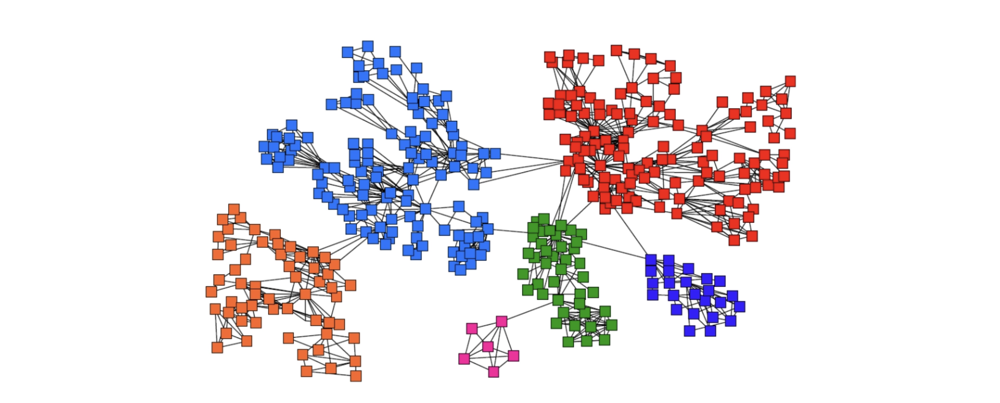
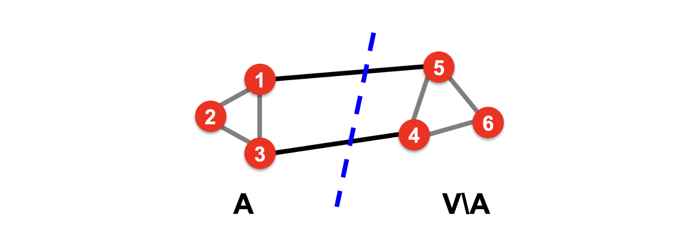
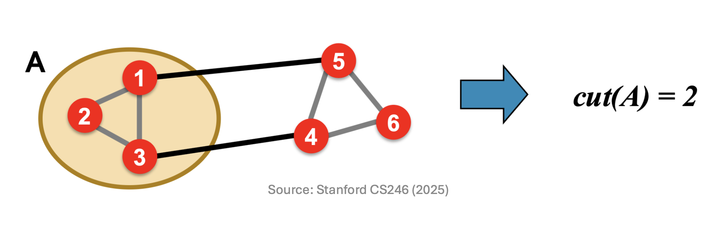
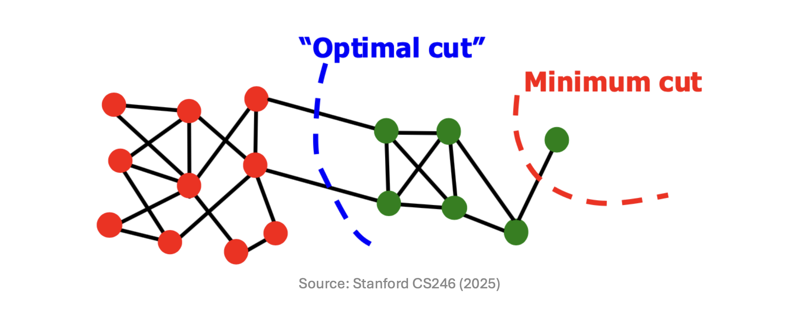
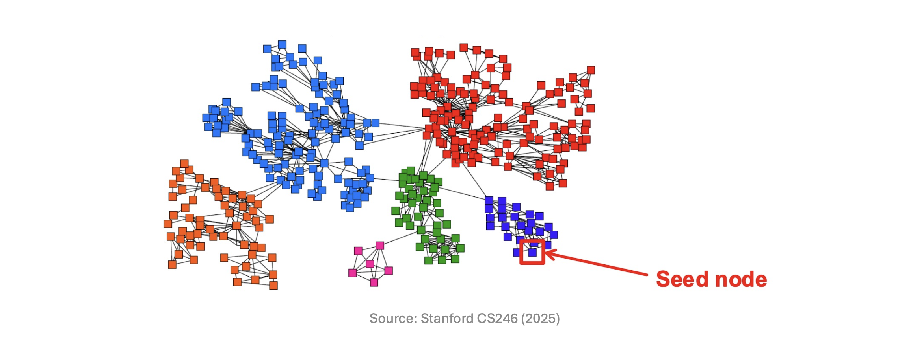

# 1. Introduction: 거대 네트워크와 커뮤니티 탐지
* 이전 포스트에서는 검색 엔진이 Link Spam을 방어하기 위해 어떻게 랜덤 워크를 변형하여 TrustRank와 Topic-Specific PageRank를 고안해냈는지, 그리고 특정 노드와의 네트워크상 '근접성(Proximity)'을 측정하는 Personalized PageRank(PPR) 모델의 원리를 확인했습니다.

* 이번 포스트에서는 한 걸음 더 나아가, **PPR 점수를 활용하여 네트워크 내부의 숨겨진 군집(Community)을 찾아내는 알고리즘**을 다룹니다. 현실 세계의 소셜 네트워크나 인용 네트워크는 무작위로 연결되어 있지 않으며, 비슷한 특성을 공유하는 노드들이 특정한 군집(Community) 구조를 이룹니다.

* 거대한 그래프 데이터에서 의미 있는 커뮤니티를 수학적으로 정의하는 방법과, 메모리 한계를 극복하기 위해 제안된 '국소 커뮤니티 탐지(Local Community Detection)' 기법 및 **Sweep Algorithm**을 자세히 살펴보겠습니다.

---

# 2. 좋은 커뮤니티(Good Cluster)의 기준과 Cut Score

* 공간상의 점(Points)을 거리 기반으로 묶는 일반적인 클러스터링과 달리, 그래프 상의 노드(Nodes)를 묶는 커뮤니티 탐지는 **'간선(Edges)의 연결성'**을 핵심 기준으로 삼습니다.

* 무방향 그래프(Undirected graph) $G=(V, E)$가 주어졌을 때, 이상적인 커뮤니티는 다음 두 가지 직관적인 조건을 동시에 만족해야 합니다.
  * 1. **내부 연결의 극대화**: 군집 내부의 노드들끼리는 서로 촘촘하게 얽혀 있어야 합니다.
  * 2. **외부 연결의 최소화**: 군집 외부에 있는 노드들과는 연결선이 최대한 적어야 합니다.

* 이러한 조건 중 '외부 연결의 최소화'를 수학적으로 수치화한 지표가 바로 **Cut Score**입니다.

## 2.1. Cut Score의 정의와 계산
* 노드 집합 $V$를 우리가 평가하려는 군집 $A$와 나머지 외부 집합 $V \setminus A$로 분할했다고 가정해 보겠습니다. 

* 이때 $A$의 **Cut Score**는 $A$ 내부 노드와 $A$ 외부 노드를 가로질러 연결하는 간선들의 총합으로 정의됩니다. 수식으로는 다음과 같이 표현됩니다.

$$cut(A) = \sum_{i \in A, j \notin A} a_{ij}$$

## 2.2. Cut Score 최적화의 한계 (Minimum Cut Problem)
* 군집 분할을 위해 단순히 Cut Score 수치를 최소화(Minimum cut)하는 최적화를 수행하면, 수학적 맹점으로 인해 알고리즘이 망가지게 됩니다.

* Cut Score는 '외부로 나가는 선이 몇 개인가?'에만 집착할 뿐, **'군집 내부의 결속력(intra-cluster connectivity)'은 전혀 고려하지 않습니다**. 그 결과, 거대한 네트워크를 의미 있는 덩어리로 쪼개는 대신 연결선이 하나뿐인 주변부 말단 노드(Degree-1 node) 하나만 잘라내는 편법을 선택하게 됩니다.

---

# 3. Conductance (전도도): 완벽한 군집 평가 지표

* Cut Score의 한계(Minimum Cut)를 극복하기 위해 등장한 보다 완벽하고 균형 잡힌 분할 지표가 바로 **Conductance (전도도, $\phi$)**입니다. Conductance는 외부로 향하는 컷의 크기를, 해당 군집이 품고 있는 **간선의 밀도(Volume)**로 나누어 페널티를 부여합니다.

## 3.1. Volume과 Conductance 수식
* 어떤 노드 집합 $A$의 볼륨 $vol(A)$는 해당 집합에 속한 모든 노드들의 차수(Degree, $d_i$) 총합입니다.

$$vol(A) = \sum_{i \in A} d_i$$

* 이 $vol(A)$ 값은 **(집합 A 내부에서 서로 연결된 간선 수 $\times 2$) + (외부로 뻗어나가는 간선 수)**와 정확히 일치합니다.
* 이를 바탕으로 Conductance $\phi(A)$는 다음과 같이 계산됩니다.
$$\phi(A) = \frac{cut(A)}{\min(vol(A), 2m - vol(A))} = \frac{|\{(i, j) \in E \mid i \in A, j \notin A\}|}{\min(vol(A), 2m - vol(A))}$$
  * 단, $m$은 그래프 전체의 간선 수이며, $2m$은 그래프 전체의 총 Volume을 의미합니다.

## 3.2. Conductance가 문제를 해결하는 원리
* Conductance 수식은 분모에 $\min(vol(A), 2m-vol(A))$를 취하여 군집의 규모를 평가합니다. 
* 앞선 Minimum Cut 문제처럼 말단 노드 단 하나만 잘라낼 경우, 컷은 1(혹은 2)로 작아지지만 분리된 군집의 내부 볼륨 역시 극히 작아집니다. 결과적으로 분모가 아주 작아져 $\phi(A)$는 거의 1에 가까운 최악의 점수를 받게 됩니다. 반면 내부가 촘촘한 거대한 덩어리로 나누면 분모가 기하급수적으로 커져 $\phi(A)$는 0에 가깝게 낮아집니다. 

* **즉, Conductance $\phi(A)$가 0에 가까울수록 내부 결속력은 탄탄하고 외부 유출은 적인 이상적인 커뮤니티 구조임을 뜻합니다.**

---

# 4. Local Community Detection (국소 커뮤니티 탐지)

* Conductance를 통해 최적의 군집을 평가할 수 있게 되었으나, 이를 현실의 초거대 소셜 네트워크(노드 수억 개, 간선 수십억 개)에 적용하면 전역(Global) 탐색에 천문학적인 메모리와 시간이 소모됩니다.

* 이러한 연산의 한계를 돌파하기 위해 고안된 것이 **Local Community Detection (국소 탐지 기법)**입니다. 전체 네트워크를 분석하는 대신, 특정 **시드 노드(Seed Node) $s$를 부여하고 오직 그 노드가 속한 지역 커뮤니티 하나만을 빠르고 정확하게 찾아내는 접근법**입니다.

* 국소 커뮤니티 탐지의 가장 중요한 목표는 알고리즘의 시간 복잡도를 전체 그래프의 크기 $|V|$나 $|E|$가 아니라, **발견하고자 하는 로컬 커뮤니티 집합 크기 $|A|$에 선형적으로 비례하도록(Linear time) 억제**하는 데 있습니다.

---

# 5. The Sweep Algorithm (스윕 알고리즘)

* 앞서 배운 Personalized PageRank(PPR) 모델과 Conductance 개념을 합치면, 로컬 군집을 선형 시간에 찾아내는 기발한 **Sweep Algorithm**이 완성됩니다. 

## 5.1. 알고리즘 동작 원리
* 1. **PPR (근접성) 계산**: 시드 노드 $S=\{s\}$로 텔레포트를 100% 한정시킨 Random Walk with Restarts를 실행하여, 모든 노드들이 시드 노드 $s$와 가지는 네트워크 근접성(PPR score)을 계산합니다.
* 2. **정렬 (Sort)**: 계산된 PPR 점수가 높은 순서(내림차순)로 노드들을 줄 세웁니다.
* 3. **스윕 (Sweep)**: 상위 노드부터 하나씩 새로운 군집 $A_i$에 집어넣어가며 그 순간의 Conductance $\phi(A_i)$를 측정합니다.
   * $A_1 = \{u_1\}$
   * $A_i = \{u_1, u_2, \dots, u_i\}$
* 4. **로컬 미니마(Local Minima) 판별**: $\phi(A_i)$ 값을 그래프로 그렸을 때, 값이 크게 하락하여 골짜기를 이루는 점(Local minima)들이 발견됩니다. 이 지점들이 바로 이상적인 군집의 경계(Good clusters)를 의미합니다.

## 5.2. 선형 시간($O(|A|)$) 처리를 위한 동적 갱신(Update) 식
* 매 $i$번째 스윕 단계마다 집합 $A_i$의 $vol$과 $cut$을 처음부터 다시 센다면 연산 시간이 비효율적으로 증가합니다. 이를 해결하기 위해 새로운 노드 $u_{i+1}$이 추가될 때 이전 단계의 값을 활용하여 빠르게 업데이트하는 점화식을 사용합니다.

* **Volume 업데이트**: 단순 합계입니다. 새 노드의 간선 수를 기존 볼륨에 더합니다.
  $$vol(A_{i+1}) = vol(A_i) + d_{i+1}$$
* **Cut 업데이트**: 새 노드의 모든 간선은 일단 외부를 향하는 컷으로 간주하여 더합니다. 하지만 그중에서 **기존 집합 $A_i$를 향하는 내부 간선**들은 컷의 성질을 잃게 되므로 그 개수의 **2배를 빼줍니다** (기존에 밖으로 나가던 컷 1번 상쇄 + 방금 들어오면서 컷으로 추가했던 것 1번 상쇄).
  $$cut(A_{i+1}) = cut(A_i) + d_{i+1} - 2 \times (\text{\# of edges from } u_{i+1} \text{ to } A_i)$$

* 어떤 이웃 노드 $v$가 이미 집합 $A_i$ 안에 있는지 확인하는 작업은 1과 0을 반환하는 상수 시간 $O(1)$의 해시 테이블(Hash table, $h(v)$)을 사용하여 즉각적으로 판별합니다. 이러한 트릭 덕분에 대규모 네트워크에서도 타겟 커뮤니티를 찾아내는 연산이 완벽한 선형 시간 내에 종료됩니다.