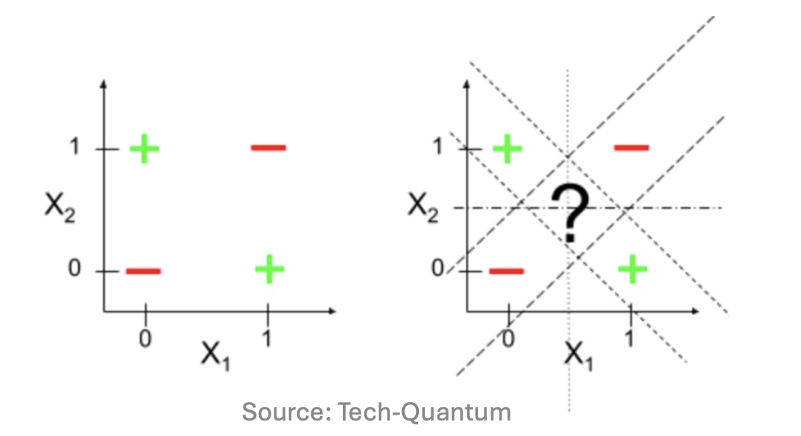
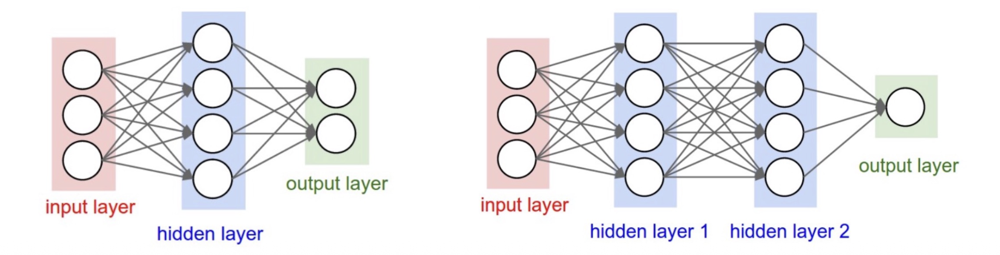
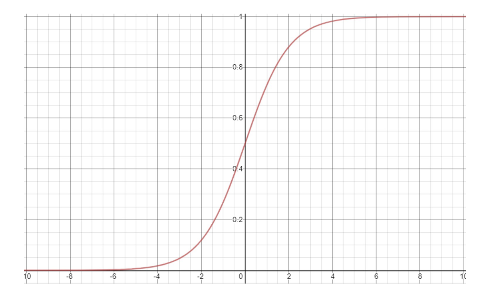
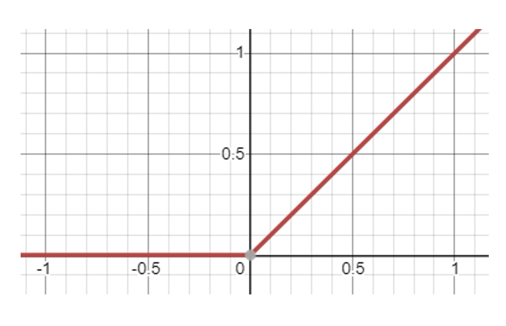
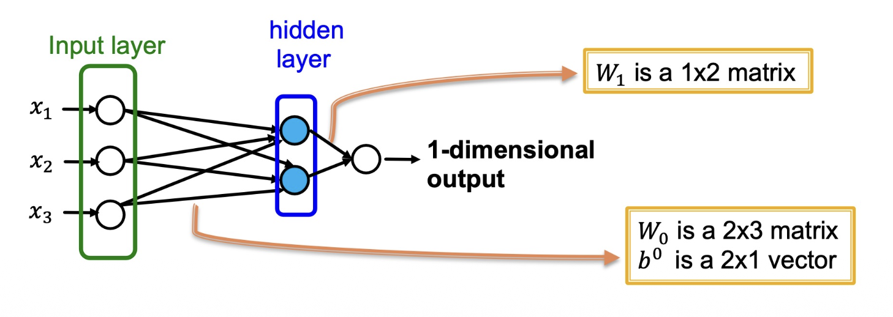
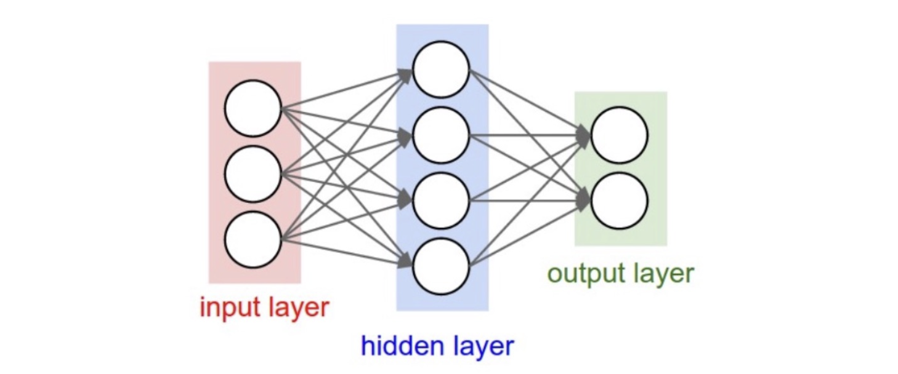
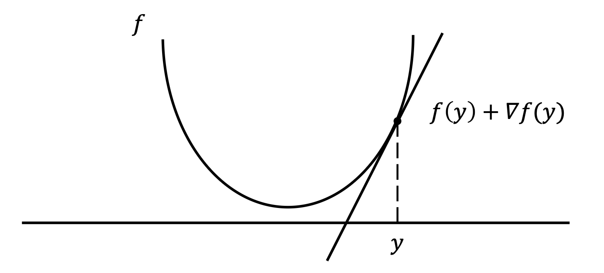

# 들어가며

이번 포스트는 서울대학교 데이터 마이닝 강의(Introduction to Data Mining, Spring 2026)의 16번째 강의 **딥러닝 1**을 정리한 내용입니다. 지금까지 PageRank, 커뮤니티 탐지 등 그래프 기반 알고리즘을 공부했다면, 이제부터는 본격적으로 **딥러닝(Deep Learning)**의 세계로 들어갑니다.

이번 강의의 전체 목차는 다음과 같습니다.

1. **딥러닝(Deep Learning)** — 왜 딥러닝이 필요한가?
2. **다층 퍼셉트론(Multi-layer Perceptrons)** — 신경망의 구조와 활성화 함수
3. **역전파(Backpropagation)** — 효율적인 경사 계산의 핵심 알고리즘

---

# 1. 딥러닝 (Deep Learning)

## 1-1. 머신러닝 복습: 무엇을 배우는가?

딥러닝으로 들어가기 전에, 머신러닝이 무엇인지 간략히 복습해 봅시다.

- **주어진 것**: 데이터 $\mathcal{D}$
- **목표**: 문제 $\mathcal{T}$를 풀기 위한 함수 $f$를 찾는 것

접근 방식에 따라 두 가지로 나뉩니다.

- **전통적 데이터 마이닝**: 엔지니어가 $f$를 직접 설계합니다. 예를 들어, A-priori 알고리즘은 빈번 아이템셋을 찾도록 명시적으로 설계됩니다.
- **머신러닝(ML)**: 엔지니어가 $f$를 직접 설계하는 대신, **데이터 $\mathcal{D}$로부터 $f$를 학습**합니다.
  - 학습(training)에는 상당한 계산 비용이 따릅니다.
  - 이미 좋은 알고리즘이 있다면 ML이 반드시 필요하지 않을 수도 있습니다.

## 1-2. 핵심 구성 요소: 데이터 (Data)

머신러닝에는 세 가지 핵심 구성 요소가 있습니다: **데이터(data)**, **모델(model)**, **손실(loss)**.

먼저 데이터를 정의합니다.

$$
\mathcal{D} = \{(x_1, y_1),\ (x_2, y_2),\ \ldots,\ (x_N, y_N)\}
$$

- $N$개의 **독립적인 샘플(sample)**의 집합입니다.
- $x_i \in \mathcal{X}$: $i$번째 샘플의 **피처(feature)**. 보통 벡터이지만, 이미지 등 다른 형태도 가능합니다. 추천 시스템처럼 여러 피처가 주어지기도 합니다.
- $y_i \in \mathcal{Y}$: $i$번째 샘플의 **레이블(label)**. 클러스터링처럼 레이블이 없는 태스크도 있고, BPR 손실처럼 부정 샘플(negative sample)이 포함되는 경우도 있습니다.

## 1-3. 핵심 구성 요소: 모델과 손실 함수 (Model & Loss)

- **파라미터화된 모델(Parameterized model)** $f_\theta: \mathcal{X} \mapsto \mathcal{Y}'$
  - 파라미터 $\theta \in \Theta$의 값에 따라 $f_\theta$의 성능이 달라집니다.
  - 출력 공간이 $\mathcal{Y}'$인 이유: 예측값이 실제 레이블 공간 $\mathcal{Y}$와 다를 수 있기 때문입니다 (예: 분류 확률 vs. 클래스 레이블).

- **손실 함수(Loss function)** $\mathcal{L}: \mathcal{Y}' \times \mathcal{Y} \to \mathbb{R}^+$
  - 현재 $f_\theta$의 출력이 얼마나 좋은지 측정합니다.
  - 일반적으로 **값이 작을수록 좋은 모델**입니다.

## 1-4. 최적화 문제 (Optimization Problem)

**학습(training)**이란, 훈련 데이터 $\mathcal{D}$ 위에서 기대 손실 $\mathcal{L}$을 최소화하는 최적 파라미터 $\theta^*$를 찾는 과정입니다.

$$
\theta^* = \arg\min_\theta R(\theta) = \arg\min_\theta \sum_{i=1}^{N} \mathcal{L}(f_\theta(x_i),\, y_i)
$$

> **주의**: 이것이 테스트 데이터에서도 잘 동작함을 보장하지는 않습니다. **과적합(overfitting)** 위험이 항상 존재합니다.

## 1-5. 머신러닝은 마법이 아니다

$f_\theta$의 **함수적 설계(functional design)** 자체는 학습되는 것이 아니라, 엔지니어가 직접 결정해야 합니다. 예를 들어, **선형 회귀 모델**은 다음과 같이 설계됩니다.

$$
f_\theta(x) = wx + b \quad \text{where } \theta = (w, b)
$$

이 모델이 나이($x$)로부터 기대 소득($y$)을 예측하기에 충분할까요? 현실의 복잡한 관계를 표현하려면 더 풍부한 표현력이 필요합니다.

## 1-6. 선형성의 표현력 한계 (Limited Expressivity of Linearity)

전통적인 데이터 마이닝 알고리즘 대부분이 **입력에 대해 선형적**입니다.

- **차원 축소**: SVD, PCA, UV 분해
- **링크 분석**: PageRank 및 그 변형

하지만 **선형 모델은 표현력이 부족**합니다. 이를 가장 명확하게 보여주는 예가 바로 **XOR 문제**입니다.

함수 $\hat{y} = ax_1 + bx_2$는 XOR을 학습할 수 없습니다.

| $x_1$ | $x_2$ | $y$ |
|:---:|:---:|:---:|
| 0 | 0 | 0 |
| 0 | 1 | 1 |
| 1 | 0 | 1 |
| 1 | 1 | 0 |



이 한계를 극복하려면 **비선형 모델**이 필요합니다.

## 1-7. 왜 딥러닝인가? (Why Deep Learning?)

비선형 모델을 설계하는 것은 쉽지 않습니다. 두 가지 근본적인 질문이 생깁니다.

- **Q1.** 모델의 설계 공간(design space)을 어떻게 선택할까?
- **Q2.** 비선형 모델을 어떻게 효율적으로 학습할까?

딥러닝은 이 두 질문에 핵심적인 답을 제시합니다.

- **A1. 신경망(Neural Network)** — 비선형 모델의 설계 공간
- **A2. 역전파(Backpropagation)** — 효율적인 학습 알고리즘

---

# 2. 다층 퍼셉트론 (Multi-layer Perceptrons)

## 2-1. 신경망 (Neural Network)

**신경망**은 여러 개의 **뉴런(neuron)**을 **레이어(layer)** 단위로 조직한 구조입니다.



표현력(expressivity)은 두 가지 **하이퍼파라미터**로 조절합니다.

- **깊이(Depth)**: 레이어의 수
- **너비(Width)**: 레이어당 뉴런의 수

## 2-2. 신경망의 종류 (Types of Neural Networks)

이 강의에서는 **순방향 신경망(Feedforward Neural Networks, FNNs)**에 집중합니다.

- **FNN의 특징**: 정보가 루프(loop) 없이 입력에서 출력 방향으로만 전파됩니다.
- **다층 퍼셉트론(Multi-layer Perceptron, MLP)**은 가장 기본적인 FNN 구조입니다.


## 2-3. 퍼셉트론 (Perceptron)

**퍼셉트론(perceptron)**은 신경망의 가장 기본 단위로, **일반화된 선형 함수**입니다. 1969년 Minsky-Papert 모델로 공식화되었습니다.

- **입력**: $x = (x_1, x_2, x_3)$
- **출력**:

$$
f_\theta(x) = \sigma\!\left(\sum_{i=1}^{3} w_i x_i + b\right)
$$

- $\sigma$는 **활성화 함수(activation function)**입니다.
- **파라미터**: $\theta = \{w_1, w_2, w_3, b\}$


계산은 세 단계로 이루어집니다.

1. **내적 (Dot product)**: 입력 벡터 $x$와 가중치 벡터 $w$를 내적합니다. → $\sum_i w_i x_i$
2. **편향 추가 (Bias addition)**: 편향(bias) $b$를 더합니다. → $\sum_i w_i x_i + b$
3. **활성화 함수 적용 (Activation)**: 비선형 함수 $\sigma$를 적용합니다. → $\sigma(\cdot)$

## 2-4. 활성화 함수 (Activation Function)

**활성화 함수**는 뉴런의 출력에 비선형성(nonlinearity)을 부여하는 함수입니다.

- 스칼라 하나를 입력으로 받습니다.
- **미분 가능한(differentiable)** 비선형 연산을 수행합니다.
  - 미분 가능성은 학습(역전파)을 위해 필수입니다.

대표적인 활성화 함수들:

- **시그모이드(Sigmoid)**: $\sigma(x) = \dfrac{1}{1 + \exp(-x)}$
- **쌍곡탄젠트(Tanh)**: $\tanh(x) = 2\sigma(2x) - 1$
- **ReLU**: $\text{relu}(x) = \max(0, x)$

---

### 시그모이드 함수 (Sigmoid Function)

시그모이드는 **얕은 신경망(shallow network)**에서 주로 사용되어 왔습니다.

$$
\sigma(x) = \frac{1}{1 + \exp(-x)}
$$

- **장점(Pros):**
  - 연속적이고 미분 가능합니다.
  - 출력이 $(0, 1)$ 범위에 있어 **확률(probability)**로 해석 가능합니다.
- **단점(Cons):**
  - 0 주변의 "임계 구간(critical region)"을 벗어나면 빠르게 **포화(saturate)**됩니다.
  - 포화 구간에서 기울기가 0에 가까워져 깊은 신경망 학습이 어려워집니다 (**기울기 소실 문제**).

**도함수:**

$$
\frac{d}{dx}\sigma(x) = \sigma(x)\bigl(1 - \sigma(x)\bigr)
$$

> 이 도함수의 간결한 형태는 역전파 구현 시 매우 유용합니다.



---

### ReLU (Rectified Linear Unit)

ReLU는 **현대 (깊은) 신경망**에서 시그모이드를 대체하는 가장 널리 쓰이는 활성화 함수입니다.

$$
\sigma(x) = \max(0, x)
$$

**도함수:**

$$
\frac{d}{dx}\sigma(x) = \begin{cases} 1 & \text{if } x \geq 0 \\ 0 & \text{if } x < 0 \end{cases}
$$

- **장점(Pros):**
  - 계산이 매우 효율적입니다.
  - $x \geq 0$ 구간에서 기울기가 **절대 포화되지 않습니다**.
- **단점(Cons):**
  - $x < 0$이면 출력이 0, 즉 **뉴런이 "죽는(dying ReLU)" 문제**가 발생할 수 있습니다.
  - $x = 0$에서 미분 불가능하지만, 실제 학습에서는 중요하지 않습니다.

**ReLU의 변형들:**
- **Leaky ReLU**: $x < 0$일 때 작은 기울기를 유지합니다.
- **ELU (Exponential Linear Unit)**: 음수 구간을 지수 함수로 부드럽게 처리합니다.
- **GELU (Gaussian Error Linear Unit)**: Transformer 등 최신 모델에서 널리 사용됩니다.



## 2-5. 레이어 (Layer)

**레이어(layer)**는 여러 개의 뉴런을 결합하여 만든 구조입니다. (입력 레이어는 학습 가능한 파라미터가 없으므로 레이어 수에서 제외합니다.)

예시로 **2-레이어 신경망**을 살펴봅시다.

$$
f_\theta(x) = W_1\bigl(\sigma(W_0 x + b^0)\bigr) + b^1
$$

- **은닉층(hidden layer)**: 가중치 행렬 $W_0 \in \mathbb{R}^{2 \times 3}$, 편향 $b^0 \in \mathbb{R}^2$
- **출력층(output layer)**: 가중치 행렬 $W_1 \in \mathbb{R}^{1 \times 2}$, 편향 $b^1 \in \mathbb{R}^1$

각 가중치 행렬은 해당 레이어에 속하는 뉴런들의 가중치 벡터를 **행(row) 방향으로 쌓은(stack) 것**입니다.



## 2-6. 출력층 (Output Layer)

출력 뉴런의 수는 **태스크(task)**에 따라 결정됩니다.

- **회귀(Regression)**: 실수 하나를 출력하는 뉴런 1개
- **이진 분류(Binary classification)**: 시그모이드를 통해 확률을 출력하는 뉴런 1개
- **$N$-클래스 분류($N$-way classification)**: 각 클래스에 대응하는 뉴런 $N$개



## 2-7. 소프트맥스 함수 (Softmax Function)

$N$-클래스 분류에서는 신경망이 $N$개의 점수 벡터(score vector) $z \in \mathbb{R}^N$를 출력합니다. **소프트맥스 함수**는 이를 **확률 벡터**로 정규화합니다.

$$
\hat{y} = \text{softmax}(z), \qquad \hat{y}_j = \frac{\exp(z_j)}{\sum_{k} \exp(z_k)}
$$

소프트맥스의 핵심 성질:
- 모든 원소가 양수: $\hat{y}_j > 0$
- 합이 1: $\sum_j \hat{y}_j = 1$
- 따라서 $\hat{y}$는 **유효한 확률 분포(probability distribution)**입니다.
- 가장 큰 점수를 받은 클래스의 확률이 지수적으로 강조됩니다.

## 2-8. 은닉 표현 (Hidden Representations)

신경망을 통과하면서 입력 피처 $x$는 점진적으로 변환되어 최종 예측값 $\hat{y}$가 됩니다. 이 중간 출력들을 **은닉 표현(hidden representations)** $h$라고 합니다.

예를 들어 3-레이어 신경망에서는:

$$
x \;\to\; h_1 \;\to\; h_2 \;\to\; \hat{y}
$$

은닉 표현 $h$는 원본 피처 $x$보다 여러 면에서 우수합니다.

- **추상성**: $h$는 레이블(label)을 예측하기 유리한 방향으로 학습된, 더 **추상적이고 레이블 인식적(label-aware)인** 정보를 담습니다.
- **밀도**: $x$가 희소(sparse) 벡터이더라도, $h$는 **밀집(dense) 벡터**입니다.
- **전이 학습**: 이러한 이유로 $h$는 원본 피처보다 더 나은 표현(representation)으로 여겨지며, 전이 학습(transfer learning) 등에서 활용됩니다.

## 2-9. 활성화 함수의 중요성 (Importance of Activation Functions)

**비선형 활성화 함수가 없으면 깊이(depth)는 무의미합니다.**

이를 수학적으로 증명해 봅시다. 활성화 함수가 없는 2-레이어 신경망 $f_\theta$를 생각합시다.

$$
f_\theta(x) = W_1(W_0 x + b^0) + b^1
$$

이를 전개하면:

$$
= W_1 W_0 x + W_1 b^0 + b^1 = \underbrace{(W_1 W_0)}_{W'} x + \underbrace{(W_1 b^0 + b^1)}_{b'}= W' x + b'
$$

결국 이것은 **단일 선형 레이어**와 동일합니다! $W'$와 $b'$를 직접 학습하는 것과 $W_1$, $W_0$, $b^0$, $b^1$를 각각 학습하는 것이 등가입니다. 따라서:

> **활성화 함수 없이 레이어를 아무리 많이 쌓아도, 표현력은 단일 선형 레이어를 벗어나지 못합니다.**

## 2-10. 보편 근사 정리 (Universal Approximation Theorem)

모든 활성화 함수 $\sigma$는 $f_\theta$에 약간의 비선형성을 추가합니다. 이 비선형성이 쌓이면 놀라운 결과로 이어집니다.

> **정리 (Universal Approximation Theorem)**
>
> 컴팩트 집합(compact set) $\mathcal{K} \subset \mathbb{R}^n$ 위에서 정의된 임의의 연속 함수 $f$에 대해, 임의의 $\varepsilon > 0$에 대해 다음을 만족하는 신경망 $f_\theta$가 존재합니다.
>
> $$\bigl|f_\theta(x) - f(x)\bigr| < \varepsilon \quad \forall x \in \mathcal{K}$$

즉, **충분한 너비를 가진 신경망은 임의의 연속 함수를 원하는 정밀도로 근사할 수 있습니다.** 이것이 딥러닝이 다양한 문제에 적용 가능한 이론적 근거입니다.

## 2-11. 파라미터 수와 표현력 (Number of Parameters)

신경망의 표현력을 파라미터 수로 단순히 측정하기는 어렵습니다. 아키텍처가 더 중요한 경우가 많습니다. 비슷한 파라미터 수를 가진 세 신경망을 비교해 봅시다.

| 구조 | 파라미터 수 (약) | 특징 |
|:---:|:---:|:---:|
| $10 \to 100 \to 1$ | ~1K | 너비 위주, 2-레이어 |
| $10 \to 1 \to 500 \to 1$ | ~1K | 병목(bottleneck) 구조 |
| $10 \to 20 \to 20 \to 20 \to 1$ | ~1K | 깊이 위주, 4-레이어 |

파라미터 수가 같더라도 **아키텍처 설계와 hyperparameter 선택**이 모델의 실제 성능을 좌우합니다.

---

# 3. 역전파 (Backpropagation)

## 3-1. 확률적 경사 하강법 (Stochastic Gradient Descent)

신경망 $f_\theta$는 **확률적 경사 하강법(SGD)**을 통해 학습됩니다.

- $\theta$: 학습할 파라미터 집합
- $\mathcal{L}$: 최소화할 손실 함수

각 데이터 샘플 $(x, y)$에 대해:

1. **그래디언트 계산**: $\nabla_\theta\, \mathcal{L}(f_\theta(x),\, y)$를 계산합니다.
2. **파라미터 업데이트**:

$$
\theta \leftarrow \theta - \eta \cdot \nabla_\theta\, \mathcal{L}(f_\theta(x),\, y)
$$

여기서 $\eta > 0$은 **학습률(learning rate)**입니다.



## 3-2. 그래디언트 (Gradient)

함수 $f: \mathbb{R}^n \to \mathbb{R}$과 입력 벡터 $x = [x_1;\, x_2;\, \ldots;\, x_n]$에 대해, $f(x)$의 그래디언트는 다음과 같이 정의됩니다.

$$
\nabla_x f(x) = \left[\frac{\partial f(x)}{\partial x_1};\; \frac{\partial f(x)}{\partial x_2};\; \ldots;\; \frac{\partial f(x)}{\partial x_n}\right]
$$

- $\partial f / \partial x_i$: 나머지 변수를 상수로 고정하고 $x_i$에 대해 미분한 **편미분(partial derivative)**입니다.
- $\nabla_x f$와 $x$는 **같은 크기의 열벡터(column vector)**로 다룹니다.

**예시**: $f(x) = ax_1^2 + bx_2 + c$ ($x$는 2차원 벡터, $a, b, c$는 계수)

$$
\nabla_x f(x) = \begin{bmatrix} 2ax_1 \\ b \end{bmatrix}
$$

각 원소는 해당 변수 방향으로의 변화율을 나타냅니다.

## 3-3. 역전파란? (What is Backpropagation?)

학습의 핵심 과제는 다음 질문에 답하는 것입니다.

> **Q**: $f_\theta$가 깊고 복잡하고 파라미터 수가 매우 많을 때, 어떻게 $\nabla_\theta \mathcal{L}$을 효율적으로 계산할 수 있을까?

**역전파(Backpropagation)**는 이 질문에 대한 명쾌한 해답입니다.

- **핵심 아이디어**: 손실 $\mathcal{L}$로부터 파라미터까지, **그래디언트를 역방향으로 전파(propagate)**합니다.
- 연쇄 법칙(chain rule)을 계산 그래프에 체계적으로 적용하여, 각 파라미터에 대한 그래디언트를 단 한 번의 역방향 패스(backward pass)로 모두 구합니다.

## 3-4. 계산 그래프 (Computation Graph)

신경망의 순방향 패스(forward pass)는 **계산 그래프**를 형성합니다. 다음 2-레이어 신경망 예시를 살펴봅시다.

$$
\begin{aligned}
h_1 &= W_1 x + b_1 \\
h_2 &= \sigma(h_1) \\
\hat{y} &= W_2 h_2 + b_2 \\
\mathcal{L} &= (y - \hat{y})^2
\end{aligned}
$$

계산 그래프는 각 연산을 노드(node)로, 데이터 흐름을 엣지(edge)로 표현합니다.

$$
x \xrightarrow{W_1,\, b_1} h_1 \xrightarrow{\sigma} h_2 \xrightarrow{W_2,\, b_2} \hat{y} \xrightarrow{} \mathcal{L}
$$

역전파의 목표는 **단말 노드(leaf nodes)**에 해당하는 파라미터들에 대한 그래디언트를 구하는 것입니다.

$$
\nabla_{W_1} \mathcal{L},\quad \nabla_{b_1} \mathcal{L},\quad \nabla_{W_2} \mathcal{L},\quad \nabla_{b_2} \mathcal{L}
$$


## 3-5. 연쇄 법칙 (Chain Rule)

역전파의 수학적 기반은 **연쇄 법칙(chain rule)**입니다.

**단변수 경우:**

$y = g(u)$이고 $u = f(x)$이면,

$$
\frac{dy}{dx} = \frac{dy}{du} \cdot \frac{du}{dx}
$$

**다변수 경우:**

$z = f(u, v)$이고 $u = g(x)$, $v = h(x)$이면,

$$
\frac{dz}{dx} = \frac{\partial z}{\partial u}\frac{du}{dx} + \frac{\partial z}{\partial v}\frac{dv}{dx}
$$


## 3-6. 야코비안 (Jacobian)

벡터값 함수에 대한 그래디언트의 일반화가 **야코비안(Jacobian)**입니다.

함수 $f: \mathbb{R}^n \to \mathbb{R}^m$이고 $y = f(x)$일 때, 야코비안 $J_y(x)$는 크기 $n \times m$의 행렬로 정의됩니다 (이 강의에서 사용하는 표기법).

$$
J_y(x) = \begin{bmatrix}
\dfrac{\partial y_1}{\partial x_1} & \cdots & \dfrac{\partial y_m}{\partial x_1} \\
\vdots & \ddots & \vdots \\
\dfrac{\partial y_1}{\partial x_n} & \cdots & \dfrac{\partial y_m}{\partial x_n}
\end{bmatrix}_{n \times m}
$$

즉, $[J_y(x)]_{i,j} = \dfrac{\partial y_j}{\partial x_i}$ 입니다.

> **참고**: 이는 일반적인 야코비안 정의의 **전치(transposed form)**입니다. 강의에서는 표기 편의를 위해 이 정의를 사용합니다. 이 정의 하에서 **연쇄 법칙은 다음과 같이 작동합니다:**
>
> $$\nabla_x \mathcal{L} = J_y(x) \cdot \nabla_y \mathcal{L}$$
>
> 이것은 $(n \times m) \cdot (m \times 1) = (n \times 1)$로 차원이 일치합니다.

## 3-7. 역전파 예시 (Example: Backpropagation)

앞서 정의한 2-레이어 신경망에 역전파를 단계별로 적용해 봅시다.

$$
h_1 = W_1 x + b_1, \quad h_2 = \sigma(h_1), \quad \hat{y} = W_2 h_2 + b_2, \quad \mathcal{L} = (y - \hat{y})^2
$$

현재 $W_2$는 벡터(행 벡터), $b_2$는 스칼라, $\hat{y}$는 스칼라입니다.

---

**Step 1: 손실에서 출력까지 ($\hat{y}$)**

$$
\delta(\hat{y}) \coloneqq \nabla_{\hat{y}}\mathcal{L} = 2(\hat{y} - y)
$$

이 값을 $\delta(\hat{y})$로 표기합니다 (스칼라).

---

**Step 2: 출력에서 $h_2$까지**

$\hat{y} = W_2 h_2 + b_2$이므로, 야코비안의 $(j, i)$ 원소는:

$$
[J_{\hat{y}}(h_2)]_{j,i} = \frac{\partial \hat{y}_i}{\partial h_{2,j}} = [W_2]_{i,j}
$$

$\hat{y}$가 스칼라($i=1$)이므로, $J_{\hat{y}}(h_2) = W_2^\top$ (열벡터).

$$
\delta(h_2) \coloneqq \nabla_{h_2}\mathcal{L} = J_{\hat{y}}(h_2)\, \delta(\hat{y}) = W_2^\top \cdot \delta(\hat{y})
$$

---

**Step 3: $h_2$에서 $h_1$까지 (활성화 함수)**

$h_2 = \sigma(h_1)$이 원소별 적용이므로, 야코비안 $J_{h_2}(h_1)$은 **대각 행렬(diagonal matrix)**입니다.

$$
[J_{h_2}(h_1)]_{i,i} = \frac{\partial h_{2,i}}{\partial h_{1,i}} = \sigma'(h_{1,i})
$$

$$
\delta(h_1) \coloneqq \nabla_{h_1}\mathcal{L} = J_{h_2}(h_1)\, \delta(h_2) = \text{diag}(\sigma'(h_1)) \cdot \delta(h_2)
$$

---

**Step 4: 파라미터에 대한 그래디언트**

$h_1 = W_1 x + b_1$에서:

$$
\nabla_{W_1}\mathcal{L} = J_{W_1}(h_1)\, \delta(h_1) = \delta(h_1) \cdot x^\top
\qquad (\text{외적, outer product})
$$

$$
\nabla_{b_1}\mathcal{L} = J_{b_1}(h_1)\, \delta(h_1) = \delta(h_1)
$$

마찬가지로, $W_2$와 $b_2$에 대한 그래디언트는 $\delta(\hat{y})$로부터:

$$
\nabla_{W_2}\mathcal{L} = \delta(\hat{y}) \cdot h_2^\top, \qquad \nabla_{b_2}\mathcal{L} = \delta(\hat{y})
$$


> **핵심 통찰**: 역전파는 그래디언트를 출력에서 입력 방향으로 전파하며, 각 연산에서의 국소적(local) 야코비안과 이전에 전파된 그래디언트의 곱을 이용합니다. 따라서 어떤 파라미터도 개별적으로 수치 미분할 필요 없이, **단 한 번의 역방향 패스로 모든 그래디언트를 효율적으로 계산**할 수 있습니다.

## 3-8. 구현 (Implementation)

신경망의 구현은 일반적으로 두 단계로 이루어집니다.

1. **네트워크 구조 구성**: 연산(operation)들을 순서대로 쌓습니다.
2. **각 연산에 대해 순방향(forward) 및 역방향(backward) 패스를 정의**합니다.

예시로 시그모이드의 구현을 살펴봅시다.

```python
class Sigmoid:
    def forward(self, x):
        # 순방향 패스: 시그모이드 출력 계산
        y = 1 / (1 + exp(-x))
        return y

    def backward(self, x, y):
        # 역방향 패스: 시그모이드의 도함수 = y(1-y)
        return y * (1 - y)
```

PyTorch와 같은 딥러닝 프레임워크는 이러한 forward/backward 정의를 내부적으로 자동 처리하는 **자동 미분(automatic differentiation)** 기능을 제공합니다.

## 3-9. 팝 퀴즈 (Pop Quiz)

**문제**: $N$-클래스 분류를 위한 소프트맥스 분류기 $f_\theta$를 생각해 봅시다.

$$
\hat{z} = Wx + b
$$

- $z$는 $N$-차원 벡터 (소프트맥스 입력)
- $W \in \mathbb{R}^{N \times D}$, $b \in \mathbb{R}^N$이 파라미터

소프트맥스와 크로스엔트로피(cross-entropy) 손실을 사용할 때, 손실 $\mathcal{L}$에 대한 $\nabla_W \mathcal{L}$과 $\nabla_b \mathcal{L}$을 구하시오.

> *힌트*: 소프트맥스-크로스엔트로피의 결합 도함수는 $\delta(\hat{z}) = \hat{p} - y_{\text{one-hot}}$으로 매우 간결하게 표현됩니다 (여기서 $\hat{p} = \text{softmax}(\hat{z})$). 이를 출발점으로 연쇄 법칙을 적용해 보세요.

---

# 마치며: 핵심 요약

이번 강의에서 다룬 내용을 세 가지 주제로 요약합니다.

**① 딥러닝의 동기:**
- 전통적 알고리즘의 선형성 한계(XOR 문제)를 극복하기 위해 비선형 모델이 필요합니다.
- 딥러닝은 신경망(모델 공간)과 역전파(학습 알고리즘)라는 두 가지 핵심 요소로 이 한계를 돌파합니다.

**② 다층 퍼셉트론의 구조:**
- 퍼셉트론(뉴런) → 레이어(뉴런 묶음) → MLP(레이어 스택)
- 활성화 함수(Sigmoid, ReLU)가 비선형성을 부여하며, 없으면 깊이가 무의미합니다.
- 보편 근사 정리: 충분한 너비의 MLP는 임의의 연속 함수를 근사할 수 있습니다.

**③ 역전파 알고리즘:**
- 계산 그래프 위에서 연쇄 법칙과 야코비안을 이용해 그래디언트를 역방향으로 전파합니다.
- 단 한 번의 역방향 패스로 모든 파라미터의 그래디언트를 효율적으로 계산합니다.
- 각 연산은 forward/backward 패스를 정의함으로써 모듈화됩니다.

다음 강의에서는 이 기초 위에 더 발전된 딥러닝 구조(CNN, RNN, Transformer 등)와 학습 기법들을 다룰 예정입니다.
