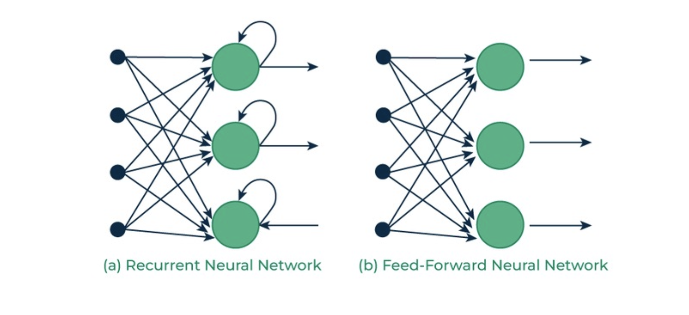
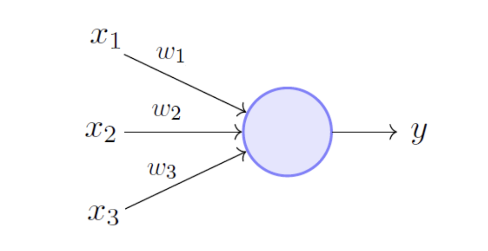

# 1. 들어가며

지난 포스트에서는 선형 모델의 한계(예: XOR 문제)와 이를 극복하기 위한 비선형 모델 설계의 필요성을 살펴보았습니다. 이번 포스트에서는 그 비선형성을 부여하고 복잡한 함수 공간을 탐색할 수 있게 해주는 딥러닝의 가장 기본적인 뼈대, **다층 퍼셉트론(Multi-layer Perceptrons, MLP)**의 구조와 수학적 원리를 깊이 있게 다룹니다.

---

# 2. 신경망과 퍼셉트론의 구조

## 2.1. 인공 신경망 (Neural Network)
인공 신경망은 '뉴런(Neuron)'이라고 불리는 기본 연산 단위들이 여러 개의 층(Layer)으로 조직된 집합체입니다. 신경망의 표현력(Expressivity)은 다음과 같은 하이퍼파라미터(Hyperparameters)를 조절함으로써 튜닝할 수 있습니다.
* **깊이 (Depth):** 신경망을 구성하는 은닉층(Hidden Layer)의 개수
* **너비 (Width):** 각 층에 포함된 뉴런의 개수

신경망은 정보의 흐름에 따라 여러 종류로 나눌 수 있는데, 가장 기본적이고 널리 쓰이는 형태는 **순방향 신경망(Feedforward Neural Networks, FNN)**입니다. FNN은 정보가 입력층(Input Layer)에서 출력층(Output Layer)으로 향하며, 내부적으로 순환하는 루프(loop)를 생성하지 않습니다. 다층 퍼셉트론(MLP)이 바로 이 FNN의 대표적인 아키텍처입니다.

## 2.2. 퍼셉트론 (Perceptron)
단일 뉴런, 즉 퍼셉트론은 수학적으로 **일반화된 선형 함수(Generalized Linear Function)**로 정의할 수 있습니다. 입력 벡터가 $x = (x_1, x_2, x_3)$라고 할 때, 퍼셉트론의 연산 과정은 다음과 같이 표현됩니다.

$$f_\theta(x) = \sigma \left( \sum_{i=1}^3 w_i x_i + b \right)$$

이 수식은 크게 세 가지 단계로 분해하여 이해할 수 있습니다.
1. **내적 연산 (Dot Product):** 입력 벡터 $x$와 모델의 가중치 벡터 $w$를 내적하여 입력 신호들의 중요도를 가중합합니다.
2. **편향 덧셈 (Add Bias):** 계산된 가중합에 편향(Bias) $b$를 더해줍니다. 이를 통해 결정 경계를 원점에서 평행 이동시킬 수 있습니다. 학습 파라미터는 $\theta = \{w_1, w_2, w_3, b\}$가 됩니다.
3. **활성화 함수 (Activation Function):** 마지막으로 $\sigma$라 불리는 비선형 활성화 함수를 통과시켜 최종 출력값을 생성합니다.

---

# 3. 활성화 함수 (Activation Function)

활성화 함수 $\sigma$는 퍼셉트론의 선형적 출력에 **비선형성(Nonlinearity)**을 부여하는 핵심 요소입니다. 이 함수는 단일 스칼라 값을 입력받아 미분 가능한 비선형 연산을 수행합니다. 미분 가능성이 요구되는 이유는 딥러닝 모델이 기울기 기반의 역전파(Backpropagation) 알고리즘을 통해 학습되어야 하기 때문입니다.

## 3.1. 시그모이드 함수 (Sigmoid Function)
전통적으로 얕은 신경망(Shallow networks)에서 널리 사용되었던 활성화 함수입니다.

$$\sigma(x) = \frac{1}{1 + \exp(-x)}$$

* **장점:** 함수값이 항상 (0, 1) 사이에 존재하며, 연속적이고 미분 가능합니다. 또한 출력을 '확률(probability)'로 해석할 수 있어 이진 분류의 최종 출력층에 자주 사용됩니다.
* **단점 (포화 문제):** $x$가 0에서 멀어지는 "임계 영역(Critical region)"을 벗어나면 함수의 기울기가 급격히 0에 가까워집니다(Saturates). 시그모이드의 도함수는 $\frac{d}{dx}\sigma(x) = \sigma(x)(1 - \sigma(x))$ 이므로, $\sigma(x)$가 0이나 1에 가까워지면 미분값이 0에 수렴하여 학습이 진행되지 않는 **기울기 소실(Vanishing Gradient)** 문제를 야기합니다.

## 3.2. ReLU 함수 (Rectified Linear Unit)
현대 딥러닝에서 시그모이드를 대체하여 기본적으로 사용되는 강력한 활성화 함수입니다.

$$\text{relu}(x) = \max(0, x)$$

* **미분:**
$$\frac{d}{dx}\text{relu}(x) = \begin{cases} 1 & \text{if } x \ge 0 \\ 0 & \text{if } x < 0 \end{cases}$$
* **장점:** 단순히 0과의 최댓값을 구하는 연산이므로 연산 효율이 압도적으로 좋습니다. 가장 큰 장점은 $x > 0$ 인 구간에서 미분값이 항상 1이므로 기울기가 포화되지 않고 안정적으로 역전파를 수행할 수 있다는 점입니다.
* **단점 및 특징:** $x < 0$ 인 구간에서는 출력과 미분값이 모두 0이 되어, 뉴런이 영구적으로 비활성화되는 이른바 'Dead Neuron' 현상(Saturation of derivative)이 발생할 수 있습니다. (참고: $x=0$ 에서 수학적으로 미분 불가능하지만, 실제 구현상 영공간 할당을 통해 문제는 생기지 않습니다.)
* 이 단점을 보완하기 위해 0 이하에서도 미세한 기울기를 허용하는 Leaky ReLU, ELU, GELU 등 다양한 변형이 개발되어 사용됩니다.

---

# 4. 신경망의 계층적 확장 (Layers)

퍼셉트론이 횡적으로 모여 하나의 층(Layer)을 이루고, 이 층들이 종적으로 쌓여 다층 퍼셉트론(MLP)을 형성합니다. 학습 가능한 파라미터를 갖는 층만을 의미 있게 카운트하므로, 단순히 값을 전달하는 입력층(Input layer)은 층 개수에서 제외합니다.

## 4.1. 행렬 연산을 통한 계층 표현
은닉층을 1개 포함하는 단순한 2층 신경망을 수학적으로 수식화하면 다음과 같습니다.

$$f_\theta(x) = W_1 \left( \sigma(W_0 x + b^0) \right) + b^1$$

각 가중치 행렬(Weight matrix)은 뉴런들이 가진 가중치 벡터들을 쌓아올린(stack) 형태입니다. 만약 입력 차원이 3, 은닉층 뉴런이 2개, 출력층 뉴런이 1개라면 행렬의 차원은 다음과 같이 결정됩니다.
* $W_0 \in \mathbb{R}^{2 \times 3}$: 3차원 입력을 받아 2차원으로 변환
* $b^0 \in \mathbb{R}^{2 \times 1}$: 첫 번째 층의 편향
* $W_1 \in \mathbb{R}^{1 \times 2}$: 은닉층의 2차원 출력을 받아 1차원의 최종 예측값 도출

## 4.2. 출력층 (Output Layer)과 Softmax
출력 뉴런의 개수는 우리가 풀고자 하는 **태스크(Task)의 성격**에 따라 결정됩니다.
* **회귀(Regression):** 연속적인 실수를 예측하므로 1개의 출력 뉴런 사용.
* **이진 분류(Binary Classification):** 참/거짓을 판별하므로 최종단에 Sigmoid를 덧붙여 1개의 확률값을 반환하는 뉴런 사용.
* **다중 분류(N-way Classification):** 각 클래스에 대응하는 N개의 뉴런이 필요합니다.

다중 분류 시 출력되는 N개의 원시 점수(Raw scores, 로짓)를 확률 분포로 변환하기 위해 **소프트맥스(Softmax) 함수**를 사용합니다.

$$f(x)_i = \frac{\exp(g(x)_i)}{\sum_j \exp(g(x)_j)}$$
이 함수는 모든 점수를 지수화하여 양수로 만들고, 전체 합이 1이 되도록 정규화(Normalize)하여 각 클래스에 대한 확률 벡터를 반환합니다.

---

# 5. 딥러닝이 강력한 이유: 은닉 표현과 비선형성

## 5.1. 은닉 표현 (Hidden Representations)
신경망의 여러 층을 거치며 원본 입력 $x$는 점진적으로 변환됩니다. 
$$x \rightarrow h_1 \rightarrow h_2 \rightarrow y$$
여기서 중간 출력값 $h$를 **은닉 표현(Hidden Representations)**이라고 부릅니다. 이 $h$는 단순한 숫자 배열이 아니라, 태스크를 해결하는 데 필수적인 고도로 추상화되고 라벨 친화적인(label-aware) 정보를 담고 있습니다. 또한 $x$가 희소(sparse)한 데이터일지라도, 신경망을 통과하며 조밀하고 압축된(dense & compact) 형태의 우수한 벡터 표현으로 거듭납니다.

## 5.2. 활성화 함수의 필수 불가결성
왜 신경망을 "깊게(Deep)" 쌓을 때 반드시 비선형 활성화 함수 $\sigma$가 필요할까요?
만약 2층 신경망에서 활성화 함수를 제거해버린다면 다음과 같은 수식 전개가 일어납니다.

$$\begin{aligned} f_\theta(x) &= W_1(W_0 x + b^0) + b^1 \\ &= W_1 W_0 x + W_1 b^0 + b^1 \end{aligned}$$

여기서 $W' = W_1 W_0$로, $b' = W_1 b^0 + b^1$로 치환하면 결국 다음과 같이 정리됩니다.

$$f_\theta(x) = W' x + b'$$

놀랍게도, 아무리 층을 깊게 쌓더라도 활성화 함수가 없다면 전체 연산은 **단 하나의 단일 계층 선형 변환(단층 퍼셉트론)으로 붕괴(Reduce)**해버립니다. 따라서 망의 깊이(Depth)가 의미를 갖기 위해서는 각 층 사이에 반드시 $\sigma$를 통한 비선형적 꺾임이 수반되어야 합니다.

## 5.3. 보편적 근사 정리 (Universal Approximation Theorem)
비선형 활성화 함수가 층마다 더해짐으로써, 신경망은 매우 놀라운 수학적 성질을 획득합니다. 바로 **보편적 근사 정리(UAT)**입니다. 
정리에 따르면, 콤팩트(compact)한 집합 $K \subset \mathbb{R}^n$ 상에서 정의된 임의의 연속 함수 $g(x)$가 주어졌을 때, 임의의 작은 오차 허용치 $\epsilon > 0$에 대하여 다음을 만족하는 신경망 $f_\theta$가 항상 존재합니다.

$$|f_\theta(x) - g(x)| < \epsilon \quad (\forall x \in K)$$

즉, 뉴런의 수와 층이 충분하다면, 딥러닝 모델은 우주 상에 존재하는 **그 어떠한 복잡하고 기괴한 연속 함수라도 원하는 만큼 정밀하게 근사(Represent)할 수 있는 무한한 표현력**을 지니고 있음을 수학적으로 보장합니다.

## 5.4. 파라미터 수의 함정
그렇다면 단순히 파라미터(가중치)의 숫자가 많으면 무조건 더 표현력이 좋은 신경망일까요? 
가령, 모두 약 1,000개의 파라미터를 가진 세 가지 신경망이 있다고 가정해 봅시다.
* NN 1: $10 \rightarrow 100 \rightarrow 1$
* NN 2: $10 \rightarrow 1 \rightarrow 500 \rightarrow 1$
* NN 3: $10 \rightarrow 20 \rightarrow 20 \rightarrow 20 \rightarrow 1$

파라미터 총량은 비슷하더라도, 중간에 정보의 병목(Bottleneck, 예: NN 2의 1 뉴런 층)이 생기거나 층이 깊게 분포하는 방식에 따라 네트워크가 학습할 수 있는 함수의 형태는 천차만별입니다. 결국 딥러닝에서 중요한 것은 단순한 파라미터의 수가 아니라, **풀고자 하는 문제에 맞는 올바른 신경망 아키텍처(Architecture)와 하이퍼파라미터의 설계적 선택(Design choices)**입니다.