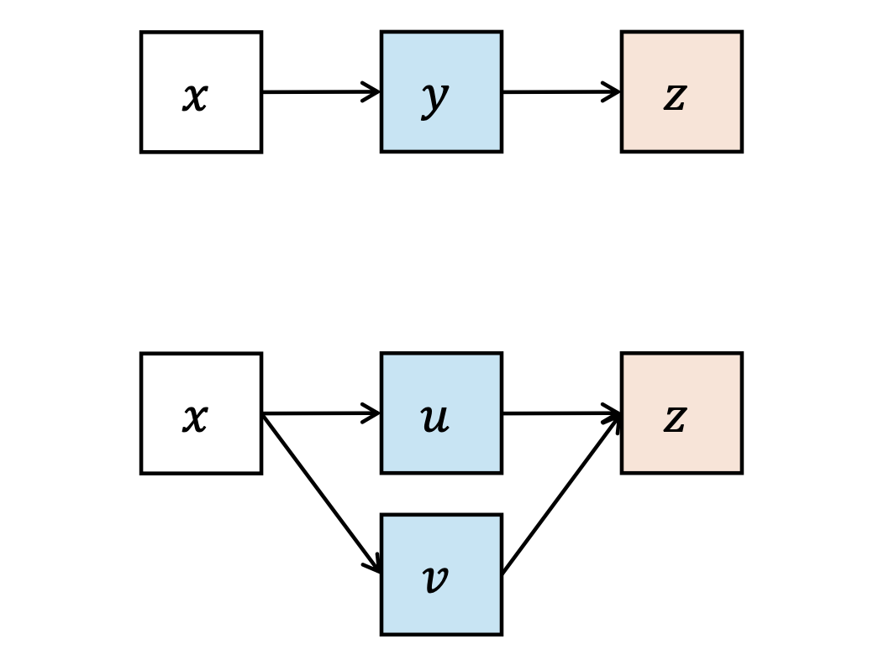
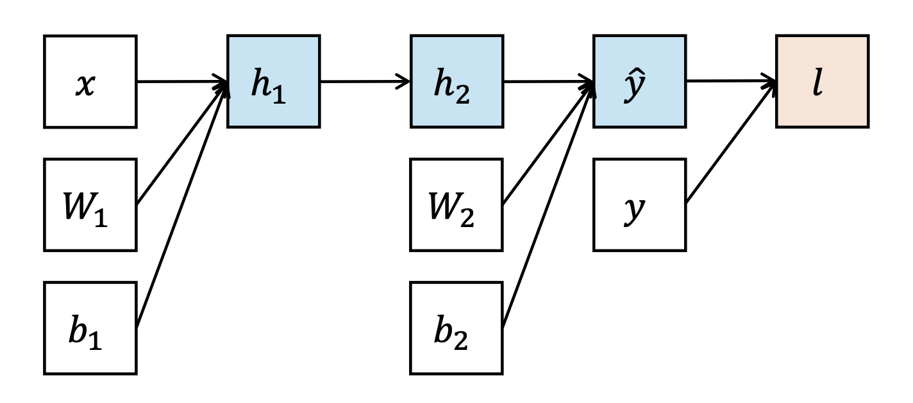
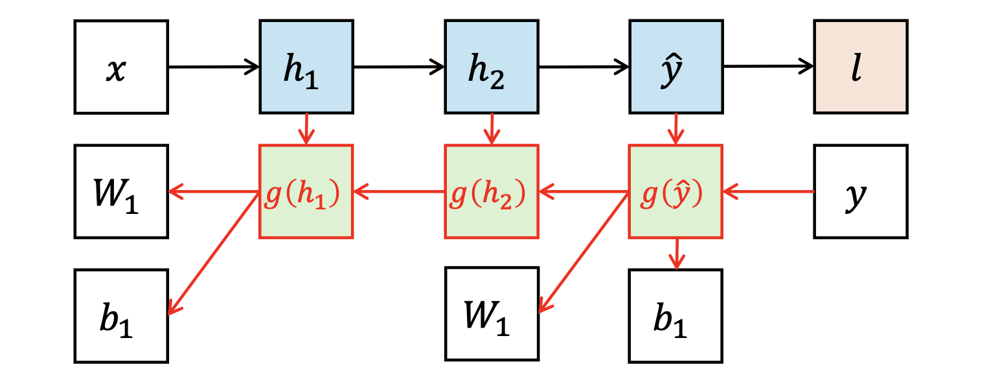

# 1. 들어가며

지난 포스트를 통해 다층 퍼셉트론(MLP)이 보편적 근사 정리(Universal Approximation Theorem)를 만족하는 강력한 표현력을 지녔음을 확인했습니다. 하지만 복잡하고 깊게 층을 쌓은 모델을 설계하는 것만으로는 충분하지 않습니다. 수많은 파라미터를 가진 이 모델이 실제 데이터에 맞게 작동하도록 **'어떻게 효율적으로 학습시킬 것인가?'** 하는 최적화(Optimization) 문제가 남아있습니다. 

이번 포스트에서는 모델 학습의 엔진 역할을 하는 **확률적 경사 하강법(SGD)**과 심층 신경망 학습을 가능하게 한 핵심 알고리즘인 **역전파(Backpropagation)**의 수학적 원리를 자세히 살펴봅니다.

---

# 2. 확률적 경사 하강법 (Stochastic Gradient Descent)

신경망을 훈련한다는 것은 궁극적으로 손실 함수(Loss function) $\mathcal{L}$의 값을 최소화하는 파라미터 집합 $\theta$를 찾는 과정입니다. 이를 위해 우리는 **경사 하강법(Gradient Descent)**을 사용합니다. 

단일 데이터 샘플 $(x, y)$에 대한 업데이트 과정은 다음과 같습니다.
1. 파라미터 $\theta$에 대한 손실 함수의 그래디언트(Gradient) $\nabla_\theta \mathcal{L}(f_\theta(x), y)$를 계산합니다.
2. 계산된 그래디언트의 반대 방향으로 파라미터를 미세하게 조정합니다.

수식으로 표현하면 아래와 같습니다.
$$\theta \leftarrow \theta - \eta \cdot \nabla_\theta \mathcal{L}(f_\theta(x), y)$$

여기서 $\eta$(에타)는 학습률(Learning Rate)로, 한 번의 업데이트에서 얼마나 멀리 이동할지를 결정하는 중요한 하이퍼파라미터입니다.


---

# 3. 미분 기초: 그래디언트(Gradient)와 야코비안(Jacobian)

역전파 알고리즘을 온전히 이해하기 위해서는 다변수 함수의 미분 개념인 그래디언트와 야코비안 행렬에 대한 정립이 필요합니다.

## 3.1. 그래디언트 (Gradient)
어떤 스칼라 함수 $f: \mathbb{R}^n \rightarrow \mathbb{R}$가 주어졌을 때, 입력 벡터 $x = [x_1; x_2; \dots; x_n]$에 대한 $f(x)$의 그래디언트는 각 원소에 대한 편미분(Partial derivative)을 모아놓은 열벡터(Column vector)로 정의됩니다.

$$\nabla_x f(x) = \left[ \frac{\partial f(x)}{\partial x_1}; \frac{\partial f(x)}{\partial x_2}; \dots; \frac{\partial f(x)}{\partial x_n} \right]$$

* 편미분 $\partial/\partial x_i$는 대상 변수 $x_i$를 제외한 나머지 모든 변수를 상수로 취급하여 미분하는 연산입니다.
* 벡터 $\nabla_x f$와 입력 $x$는 동일한 형태(shape)의 열벡터로 취급됩니다.

**[예시]**
입력 벡터가 2차원 열벡터 $x = [x_1; x_2]$이고, 계수 $a, b, c$를 가지는 2차 함수 $f(x) = ax_1^2 + bx_2 + c$가 있다고 가정해 봅시다.
이에 대한 그래디언트는 편미분 결과를 담은 2차원 열벡터가 됩니다.
$$\nabla_x f(x) = \begin{bmatrix} 2ax_1 \\ b \end{bmatrix}$$

## 3.2. 야코비안 행렬 (Jacobian Matrix)
출력값이 스칼라가 아닌 벡터인 함수, 즉 $f: \mathbb{R}^m \rightarrow \mathbb{R}^n$ 형태의 다변수 벡터 함수 $y = f(x)$를 다룰 때는 그래디언트를 일반화한 **야코비안(Jacobian)** 행렬을 사용해야 합니다.

$$J_x(y) = \begin{bmatrix} \frac{\partial y_1}{\partial x_1} & \dots & \frac{\partial y_n}{\partial x_1} \\ \vdots & \ddots & \vdots \\ \frac{\partial y_1}{\partial x_m} & \dots & \frac{\partial y_n}{\partial x_m} \end{bmatrix}$$

* 본 강의에서는 이후 수식 전개의 표기적 편의(Notational simplicity)를 위해, 널리 쓰이는 표준 정의의 **전치 행렬(Transposed form)** 크기인 $m \times n$ 차원으로 야코비안을 정의합니다. (입력 차원수 $m$ $\times$ 출력 차원수 $n$)

---

# 4. 역전파 알고리즘 (Backpropagation)

심층 신경망 $f_\theta$는 매우 깊고 복잡하며, 학습해야 할 파라미터의 개수 $|\theta|$가 수천만에서 수억 개에 달하기도 합니다. 이 거대한 네트워크 파라미터 각각에 대한 손실 $\mathcal{L}$의 미분값 $\nabla_\theta \mathcal{L}$을 어떻게 빠르고 효율적으로 구할 수 있을까요? 

이를 해결하는 우아하고 효과적인 기법이 바로 **역전파(Backpropagation)**입니다. 직관적인 아이디어는 손실 함수에서 발생한 오차(그래디언트)를 연쇄 법칙(Chain Rule)을 통해 입력 방향으로 거꾸로 '전파(Propagate)'시키는 것입니다.

## 4.1. 연쇄 법칙 (Chain Rule)
역전파의 근간은 미적분학의 연쇄 법칙입니다.
* 단일 경로: $z = f(y)$ 이고 $y = g(x)$ 라면, $\frac{dz}{dx} = \frac{dz}{dy} \frac{dy}{dx}$
* 다중 경로: $z = f(u, v)$ 이고 $u = g(x)$, $v = h(x)$ 라면,
  $$\frac{dz}{dx} = \frac{\partial z}{\partial u} \frac{du}{dx} + \frac{\partial z}{\partial v} \frac{dv}{dx}$$



## 4.2. 연산 그래프 (Computation Graph)
신경망은 순방향 전파(Forward pass)를 수행할 때 연산 그래프를 생성합니다. 단일 출력을 가지는 단순한 2층 신경망을 예로 들어봅시다.

1. $h_1 = W_1 x + b_1$
2. $h_2 = \sigma(h_1)$
3. $\hat{y} = W_2 h_2 + b_2$
4. $l = (y - \hat{y})^2$

우리의 목표는 잎 노드(leaves)에 해당하는 파라미터들에 대한 그래디언트 $\nabla_{W_1}l$, $\nabla_{b_1}l$, $\nabla_{W_2}l$, $\nabla_{b_2}l$를 구하는 것입니다.



## 4.3. 단계별 역전파 수행
오차를 뒤로 전파하며(Backward pass) 각 노드에서의 그래디언트를 구해보겠습니다. 편의상 특정 노드 $k$에 대한 손실의 그래디언트 $\nabla_k l$을 $g(k)$라고 표기하겠습니다.

**Step 1: 손실 함수에서 직전 출력 노드로**
가장 끝단인 손실 함수에서 출발합니다. (일반성을 잃지 않고 $\hat{y} > y$라 가정)
$$g(\hat{y}) = \nabla_{\hat{y}} l = \frac{\partial}{\partial \hat{y}} (\hat{y} - y)^2 = 2(\hat{y} - y)$$

**Step 2: 최종 출력에서 두 번째 은닉층으로 ($h_2$)**
이제 야코비안과 연쇄 법칙을 사용하여 그래디언트를 이전 층으로 넘깁니다.
$$g(h_2) = \nabla_{h_2} l = J_{h_2}(\hat{y}) \nabla_{\hat{y}} l = J_{h_2}(\hat{y}) g(\hat{y})$$
여기서 $\hat{y} = W_2 h_2 + b_2$ 이므로, 야코비안 행렬 $J_{h_2}(\hat{y})$의 각 원소는 다음과 같이 스칼라 가중치 행렬 원소와 매칭됩니다.
$$J_{h_2}(\hat{y})_{ij} = \frac{\partial \hat{y}_j}{\partial h_{2,i}} = W_{2, ji}$$

**Step 3: 비선형 활성화 함수를 거슬러 ($h_1$)**
동일한 방식으로 두 번째 은닉층에서 첫 번째 은닉층으로 전파합니다.
$$g(h_1) = \nabla_{h_1} l = J_{h_1}(h_2) \nabla_{h_2} l = J_{h_1}(h_2) g(h_2)$$
이때 $h_2 = \sigma(h_1)$ 은 각 요소별(element-wise) 연산이므로 야코비안 $J_{h_1}(h_2)$는 대각 성분만 존재하는 **대각 행렬(Diagonal matrix)**이 되어 연산이 매우 간단해집니다.
$$J_{h_1}(h_2)_{ii} = \frac{\partial h_{2,i}}{\partial h_{1,i}} = \frac{d}{dh_{1,i}} \sigma(h_{1,i})$$

**Step 4: 목표 파라미터 업데이트 ($W_1, b_1$)**
최종적으로, 흘러온 그래디언트 $g(h_1)$을 사용하여 우리가 업데이트하고자 하는 첫 번째 층의 파라미터 미분값을 구합니다.
* $\nabla_{W_1} l = J_{W_1}(h_1) g(h_1)$
* $\nabla_{b_1} l = J_{b_1}(h_1) g(h_1)$
* (마찬가지로 두 번째 층 파라미터 $W_2, b_2$는 $g(\hat{y})$ 단계에서 병렬적으로 계산할 수 있습니다.)



---

# 5. 실제 구현의 관점 (Implementation)

현대 딥러닝 프레임워크(PyTorch, TensorFlow 등)에서 역전파 알고리즘을 구현할 때는 주로 **객체 지향적(Object-oriented)** 접근 방식을 사용합니다. 
전체 복잡한 미분식을 한 번에 코딩하는 것이 아니라, 다음과 같이 두 단계로 나누어 구현합니다.

1. 단위 연산이나 함수들을 블록처럼 쌓아 전체 신경망 구조를 구축합니다.
2. 각각의 단위 연산 $f$ 클래스 내부에, 입력값을 받아 출력을 내보내는 `forward` 메서드와, 뒤에서 전달된 오차 그래디언트($y$)를 받아 로컬 기울기를 곱해 앞으로 전달하는 `backward` 메서드를 독립적으로 정의합니다.

**[Sigmoid 계층의 파이썬 구현 예시]**
```python
class Sigmoid:
    def forward(self, x):
        return 1 / (1 + math.exp(-x))
    
    def backward(self, x, y):
        # y는 흘러들어온 그래디언트, (1-y) 부분은 sigmoid 미분의 특성을 반영
        return y * (1 - y)
```
이러한 모듈화된 구현 덕분에, 연구자들은 복잡한 수학적 미분을 직접 손으로 계산하지 않고도 새로운 아키텍처를 자유롭게 설계할 수 있습니다.

---

# 6. 마무리 (Pop Quiz)

역전파에 대한 이해도를 점검하기 위해 N-way 다중 분류에 쓰이는 Softmax 분류기를 생각해 볼 수 있습니다. 
만약 모델이 $\hat{y} = Wx + b$ 의 선형 구조를 가지고, 파라미터가 $W \in \mathbb{R}^{N \times D}$, $b \in \mathbb{R}^N$ 이며, 교차 엔트로피 손실(Cross-entropy loss)을 사용한다면, 주어진 손실 $l$에 대한 그래디언트 $\nabla_W l$과 $\nabla_b l$의 정확한 행렬 연산식은 어떻게 도출될까요? 야코비안 행렬과 연쇄 법칙을 종이에 차근차근 전개해 보는 것은 딥러닝 이론을 체화하는 아주 훌륭한 복습이 될 것입니다.