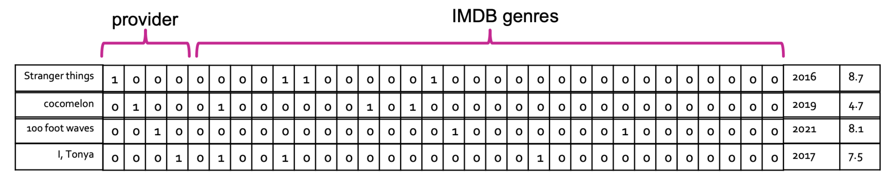
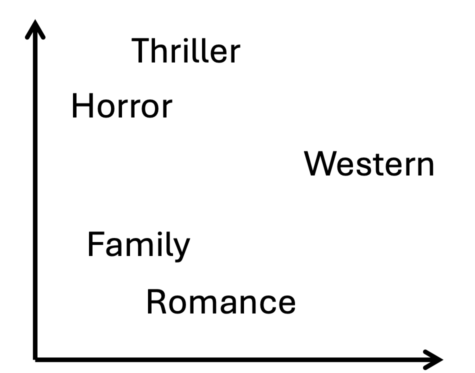
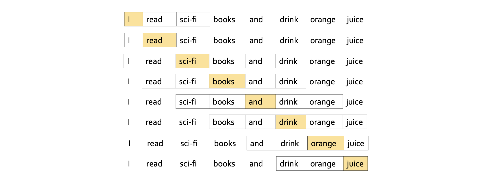
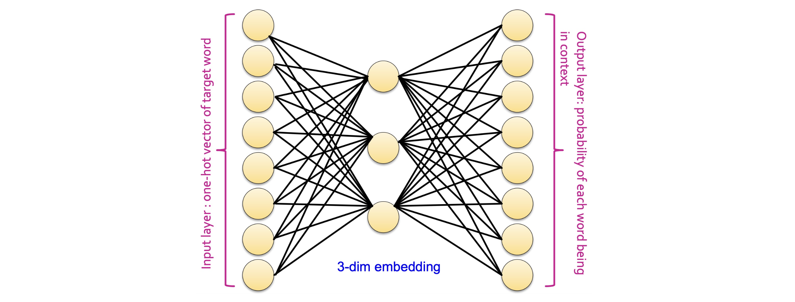
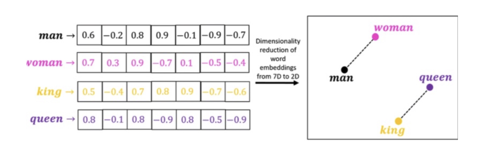
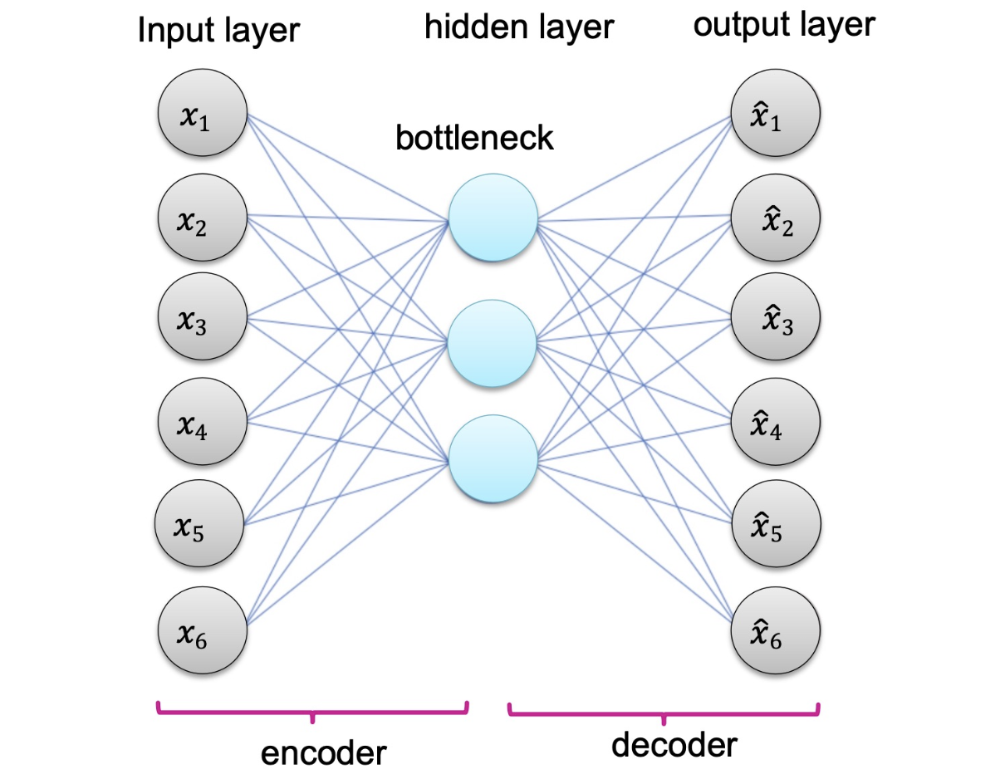
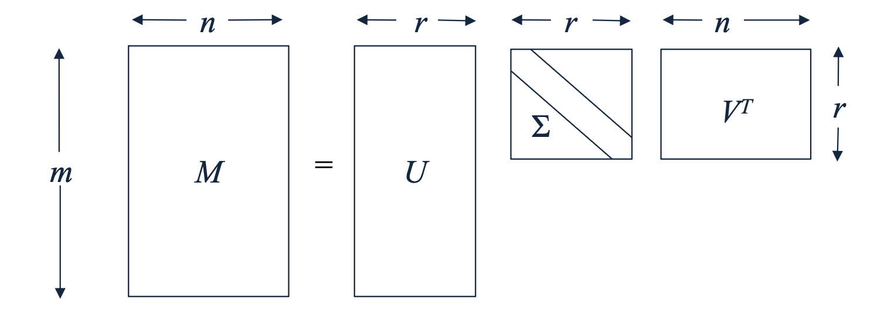
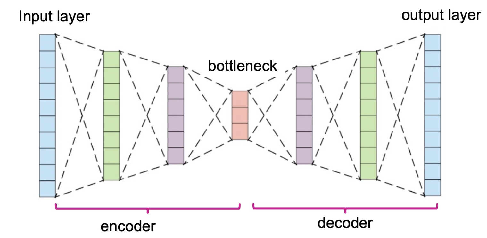

## 개요 (Outline)

이번 강의는 크게 네 가지 주제로 구성됩니다.

1. **임베딩 학습 (Learning Embeddings)**: 데이터를 어떻게 표현할 것인가?
2. **Word2Vec**: 단어 임베딩을 학습하는 대표적 방법
3. **Word2Vec 예시**: 구체적인 수치 예제를 통한 이해
4. **Autoencoder**: 일반적인 표현 학습 프레임워크

---

# 1. 임베딩 학습 (Learning Embeddings)

## 데이터를 어떻게 표현할 것인가? (How to Represent Data)

딥러닝의 중요한 목표 중 하나는 **데이터 표현(data representation)**입니다.  
같은 정보라도 표현 방식에 따라 모델의 성능이 크게 달라질 수 있습니다.

- **좋은 데이터 표현이 주어지면, 단순한 알고리즘도 잘 작동합니다.**
- 실제 데이터는 고차원(high-dimensional), 구조적(structured), 이산적(discrete), 무한히 많은(never-ending) 등 다양한 형태를 가집니다.
- 핵심 질문: **이런 데이터를 어떻게 고정된 길이의 특성 벡터 $\mathbf{x}$로 표현할 수 있을까요?**

---

## 특성의 종류 (Types of Features)

머신러닝 관점에서 정보는 크게 두 종류로 나뉩니다.

### 수치형 데이터 (Numerical Data)
- **연속형(Continuous)**: 키, 몸무게 등
- **이산형(Discrete)**: 나이, 연도 등

### 범주형 데이터 (Categorical Data)
- **순서형(Ordinal)**: `Level = {초급, 중급, 고급}` — 순서가 있음
- **명목형(Nominal)**: `Color = {빨강, 파랑, 초록}` — 순서 없음

---

## 수치형 특성 (Numerical Features)

수치형 데이터는 적절한 **정규화(normalization)** 후 그대로 사용할 수 있습니다.  
예를 들어 몸무게, 키, 발 사이즈를 함께 사용한다고 가정해 봅시다.  
샘플 $i$의 특성값을 $x_i$라 할 때, 두 가지 대표적 정규화 방법이 있습니다.

### 표준화 (Standardization)

$$x_i' = \frac{x_i - \mu}{\sigma}$$

- $\mu$: 전체 샘플의 평균, $\sigma$: 전체 샘플의 표준편차
- 변환 후 데이터의 평균은 0, 표준편차는 1이 됩니다.

### 최소-최대 정규화 (Min-Max Normalization)

$$x_i' = \frac{x_i - x_{\min}}{x_{\max} - x_{\min}}$$

- $x_{\min}$: 최솟값, $x_{\max}$: 최댓값
- 변환 후 데이터는 $[0, 1]$ 범위로 압축됩니다.

---

## 범주형 특성 (Categorical Features)

범주형 변수를 인코딩하는 두 가지 대표적 방법이 있습니다.  
아래 영화 데이터셋을 예시로 살펴보겠습니다.

| Title | Provider | IMDB Genres | Release Year | IMDB Rating |
|---|---|---|---|---|
| Stranger Things | Netflix | drama, fantasy, horror | 2016 | 8.7 |
| Cocomelon | Prime Video | animation, comedy, family | 2019 | 4.7 |
| 100 Foot Waves | HBO Max | documentary, sport | 2021 | 8.1 |
| I, Tonya | Hulu | biography, drama, comedy | 2017 | 7.5 |

### 정수 인코딩 (Integer Encoding)

- 각 범주 값에 정수를 하나씩 할당합니다.
- 예: `{Netflix→1, Prime Video→2, HBO Max→3, Hulu→4}`
- **한계**: 범주 간에 순서가 존재하는 것처럼 암시합니다. (실제로는 없는데도)
  - 순서형 변수(`Education = {학부, 석사, 박사}`)에는 어느 정도 의미가 있지만, 값들이 동일한 간격으로 떨어져 있다는 오해를 줄 수 있습니다.
  - 명목형 변수에는 적합하지 않습니다.

### 원-핫 인코딩 (One-hot Encoding)

이산값 하나를 **이진 벡터(binary vector)**로 표현합니다.

- Provider에 정수 인코딩을 먼저 적용한 뒤: `Netflix→1, Prime Video→2, HBO Max→3, Hulu→4`
- 길이 4인 이진 벡터를 각 값에 부여합니다.

| Provider | 벡터 |
|---|---|
| Netflix | $[1, 0, 0, 0]$ |
| Prime Video | $[0, 1, 0, 0]$ |
| HBO Max | $[0, 0, 1, 0]$ |
| Hulu | $[0, 0, 0, 1]$ |

- 정수 인코딩 값이 벡터의 인덱스(index)로 사용됩니다.
- 서로 다른 범주 간에 거리가 모두 동일하므로, 순서 문제가 해결됩니다.

![Figure: 원-핫 인코딩의 구조. Netflix, Prime Video, HBO Max, Hulu를 각각 [1,0,0,0], [0,1,0,0], [0,0,1,0], [0,0,0,1]로 표현한다. 정수 인코딩 값이 해당 위치(index)에만 1이 오고 나머지는 0인 이진 벡터를 만든다.](./images/one_hot_encoding.png)

### 멀티-핫 인코딩 (Multi-hot Encoding)

원-핫 인코딩의 확장으로, **변수가 동시에 여러 값을 가질 수 있을 때** 사용합니다.

- 예: 영화 한 편이 여러 장르(28개 중 복수)를 가질 수 있음.
- Stranger Things는 Drama, Fantasy, Horror 세 가지 장르 → 해당 인덱스 위치에 모두 1을 표시합니다.

![Figure: 멀티-핫 인코딩의 예시. 28개 장르 벡터에서 Stranger Things는 Drama, Fantasy, Horror에 해당하는 인덱스에 1이 채워진 [0,0,0,0,1,1,0,...,1,...,0] 형태의 벡터를 가지며, 나머지 영화들도 각자의 장르 조합에 맞게 복수의 위치에 1이 표시된다.](./images/multi_hot_encoding.png)

---

## 최종 인코딩 결과 (Final Encodings of Movies)

각 특성의 인코딩 결과를 **연결(concatenate)**하면 다음과 같은 행렬이 완성됩니다.

- Provider(원-핫, 4차원) + IMDB Genres(멀티-핫, 28차원) + Release Year(수치형) + IMDB Rating(수치형)을 이어 붙입니다.
- 추천 시스템(Recommender Systems)의 **아이템 프로파일(item profile)** 생성과 동일한 방식입니다.



### ⚠️ 단점 (Cons)

이 방식에는 세 가지 근본적인 한계가 있습니다.

1. **희소성(Sparse)**: 대부분의 값이 0입니다.
2. **고차원(High-dimensional)**: 범주 수가 늘수록 벡터 길이가 기하급수적으로 증가합니다.
3. **의미적 유사성 부재(No semantic similarity)**: Horror와 Thriller는 실제로 비슷하지만, 서로 다른 위치의 비트이므로 벡터 간 거리가 동일하게 멀어집니다.

---

## 임베딩 (Embedding)

이러한 단점을 극복하기 위해 **임베딩(embedding)**이 필요합니다.

> **임베딩이란**: 고차원의 원본 특성을 저차원의 연속적인 벡터 공간으로 변환하는 것입니다.

좋은 임베딩이 갖춰야 할 조건은 다음과 같습니다.

- **밀집(Dense)**: 부동소수점 값으로 채워져 있습니다. (희소 벡터 문제 해결)
- **저차원(Low-dimensional)**: 수천 차원 이하로 압축됩니다. (고차원 문제 해결)
- **의미적 유사성 포착(Semantic similarity)**: 의미가 비슷한 개념은 임베딩 공간에서도 가까이 위치합니다. (유사성 부재 문제 해결)

좋은 임베딩이 주어지면, 추천, 클러스터링 등에서 매우 단순한 모델만으로도 우수한 성능을 낼 수 있습니다.



---

## 표현 학습 (Representation Learning)

**표현 학습(Representation Learning)**은 임베딩을 학습하는 머신러닝 태스크입니다.

- **비지도 학습(Unsupervised)**: 명시적인 정답 레이블이 없습니다.
- 많은 알고리즘이 표현 학습기(embedder)로 해석될 수 있습니다.

### SVD를 이용한 표현 학습

행렬 $M$의 **특이값 분해(SVD)**:

$$M = U \Sigma V^\top$$

- $U$: 행(row) 임베딩 (스케일을 무시하면 $\Sigma$ 생략 가능)
- $V$: 열(column) 임베딩

### UV 분해(UV Decomposition)

$$M = UV^\top$$

- $U$와 $V$: 각각 행과 열의 임베딩

두 방법 모두 **입력 $M$으로부터의 재구성 오차(reconstruction error)를 최소화**하는 방식으로 좋은 표현을 정의합니다.

---

## 임베딩을 위한 신경망 (Neural Networks for Embeddings)

문제 $P$를 위한 큰 신경망 $f_\theta$가 있다고 가정해 봅시다.  
이 신경망은 특정 문제에 특화된 표현 학습기로 해석할 수 있습니다.

$f_\theta$를 두 부분으로 나눌 수 있습니다:

$$f_\theta(\mathbf{x}) = h_\phi\bigl(g_\psi(\mathbf{x})\bigr) \quad \text{where } \theta = \psi \cup \phi$$

- $g_\psi(\mathbf{x})$: 입력 데이터의 **학습된 표현(learned representation)**. 보통 마지막 레이어 직전 출력을 가리킵니다.
- $h_\phi$: $g_\psi(\mathbf{x})$를 입력으로 받는 **다운스트림 모델(downstream model)**.
- $\mathbf{x}$: 입력 데이터의 초기 표현.

즉, 신경망 학습 과정에서 자동으로 **문제 $P$에 적합한 저차원 표현 $g_\psi(\mathbf{x})$**를 배우게 됩니다.

---

# 2. Word2Vec

## 단어 임베딩 (Word Embedding)

> **Q: 어떻게 단어의 좋은 임베딩을 찾을 수 있을까요?**

- **Word2Vec**은 2013년 Google에서 개발되었으며, 현재는 LLM으로 대체되었지만 근본 원리를 이해하는 데 매우 중요합니다.
- **핵심 아이디어**: 비슷한 문맥(context)에서 등장하는 단어는 비슷한 의미를 가집니다.
  - "apple"이 "tree"와 함께 자주 등장한다면 → 두 단어의 임베딩이 비슷해야 합니다.
- 단어의 **사용 방식(usage)**을 바탕으로 임베딩을 학습합니다.

---

## 문제 정의 (Problem Definition)

각 단어를 **원-핫 벡터** $\mathbf{x}$로 표현합니다.  
어휘가 `{apple, banana, cookie}`라면:

$$\mathbf{x}_{\text{apple}} = [1, 0, 0]$$

단어 $w$의 임베딩은 다음과 같이 정의됩니다:

$$\text{embedding}(w) = W^\top \mathbf{x}_w$$

- $W$: 크기 $V \times N$인 **가중치 행렬(weight matrix)**
  - $V$: 어휘 크기(vocabulary size). 위 예시에서는 3.
  - $N$: 임베딩 차원(embedding dimension).
- **목표**: 좋은 $W$를 찾는 것.  
  이는 각 단어에 $N$차원 벡터를 학습하는 것과 동일합니다.

---

## 타겟 단어와 문맥 단어 (Target and Context Words)

**아이디어**: 단어 $c$가 단어 $t$의 문맥에서 자주 등장하면, $t$와 $c$는 가깝습니다.

**문맥의 정의** (윈도우 기반):
- 하이퍼파라미터 **윈도우 크기 $L$**을 설정합니다.
- 각 **타겟(target) 단어**를 기준으로
  - 왼쪽 $L$개, 오른쪽 $L$개 단어가 **문맥(context) 단어**입니다.
- 슬라이딩 윈도우를 이동시키며 모든 **(타겟, 문맥)** 쌍을 수집합니다.

---

## 타겟-문맥 예시 (Target and Context Words: Example)

문장 "I read sci-fi books and drink orange juice"에서 $L = 2$로 설정합니다.



예를 들어:
- 타겟 "books" → 문맥: (books, read), (books, sci-fi), (books, and), (books, drink)
- 타겟 "and" → 문맥: (and, sci-fi), (and, books), (and, drink), (and, orange) *(단, L=2)*

---

## 프록시 태스크 (Proxy Task)

Word2Vec의 학습 목표는 다음 **로그 우도(log likelihood)를 최대화**하는 것입니다.

$$\log P(c_1, \cdots, c_{2L} \mid t)$$

여기서 타겟 단어 $t$가 주어졌을 때 문맥 단어들의 결합 확률을 최대화합니다.

문맥 단어들이 **조건부 독립(conditionally independent)**이라고 가정하면, 곱셈 법칙에 의해:

$$\log P(c_1, \cdots, c_{2L} \mid t) = \sum_{j=1}^{2L} \log P(c_j \mid t)$$

- **각 문맥 단어 $c_j$의 로그 확률의 합**으로 분해됩니다.
- $t$의 임베딩을 이용해 $P(c_j \mid t)$를 모델링하는 것이 핵심입니다.

---

## 프록시 태스크: 분류 (Proxy Task: Classification)

$P(c_j \mid t)$는 실질적으로 **확률 $\Pr[C = c_j \mid t]$**입니다.  
랜덤 변수 $C$는 어휘의 $V$개 단어 중 하나가 될 수 있으므로:

> **문맥 단어 예측은 $V$-way 분류 문제입니다.**

예: 어떤 재료가 나무, 금속, 고무 중 무엇인지 예측하는 것과 유사합니다.

---

## 소프트맥스 분류기 (Softmax Classifier)

분류를 위해 **소프트맥스(Softmax)**를 사용합니다.

- 추가 파라미터 행렬 $W'$ (크기 $N \times V$)를 도입합니다.
- 타겟 단어 $t$에 대해:

$$\hat{\mathbf{y}} = \text{softmax}\bigl(W^\top \mathbf{x}_t \cdot W'\bigr)$$

  - $W^\top \mathbf{x}_t$: $N$차원 임베딩 벡터
  - $W^\top \mathbf{x}_t \cdot W'$: $V$차원 로짓(logit) 벡터

**소프트맥스 함수**의 정의:

$$\text{softmax}_k(\mathbf{z}) = \frac{\exp(z_k)}{\sum_{j} \exp(z_j)}$$

- 출력은 양수이며 합이 1인 확률 분포를 형성합니다.
- $\hat{y}_k$: 모델이 예측한 $k$번째 단어가 문맥 단어일 확률.

---

## 소프트맥스 분류기: 전체 구조 (Softmax Classifier: Illustration)

전체 구조를 신경망으로 이해하면 다음과 같습니다.


- **입력층**: 크기 $V$의 원-핫 벡터 $\mathbf{x}$
- **은닉층(임베딩 층)**: $W_{V \times N}$에 의한 $N$차원 임베딩
- **출력층**: $W'_{N \times V}$에 의한 $V$차원 출력 + 소프트맥스 → 각 단어가 문맥 단어일 확률

---

## 학습 과정 (Training Process)

1. **말뭉치(corpus) 준비**: 문서 집합 $\mathcal{D} = \{d_1, d_2, \ldots\}$를 수집합니다.
2. **토크나이징(Tokenizing)**: 모든 문서를 토큰으로 분리하고 어휘를 구축합니다.

### 토크나이징 방법

다양한 방법이 있습니다:
- **WordPiece**
- **BPE (Byte Pair Encoding)**
- **$n$-gram (가장 단순)**: 연속된 $n$개의 단어(또는 글자)를 하나의 토큰으로 취급.
  - `"I have an apple"` → $n=2$일 때 `{"I have", "have an", "an apple"}`
  - **1-gram**: 문장을 단어 단위로 분리하는 것과 동일.

---

## 크로스 엔트로피 손실 (Cross-Entropy Loss)

파라미터 $W$와 $W'$는 **크로스 엔트로피 손실(cross-entropy loss)**을 최소화하여 갱신됩니다.

$$\mathcal{L}(y, \hat{y}) = -\sum_{k=1}^{V} y_k \log \hat{y}_k$$

- $\hat{y}$: 소프트맥스 분류기의 $V$차원 출력 (예측 확률 분포)
- $y$: 예측하고자 하는 실제 문맥 단어의 **원-핫 타겟 벡터**

$y$가 원-핫 벡터이면 정답 인덱스 $k^*$에 대해서만 $y_{k^*} = 1$이고 나머지는 0이므로, 수식은 실질적으로:

$$\mathcal{L} = -\log \hat{y}_{k^*}$$

즉, 정답 단어의 예측 확률의 로그를 최대화하는 것입니다.

---

## 학습 데이터 수집 (Training Data)

슬라이딩 윈도우를 문서 위로 이동시켜 (타겟, 문맥) 쌍 데이터를 수집합니다.


---

## 완전한 알고리즘 (Complete Algorithm)

Word2Vec의 전체 학습 알고리즘은 다음과 같습니다.  
**확률적 경사 하강법(SGD, Stochastic Gradient Descent)**을 사용합니다.

```
1. 학습 데이터 수집 및 준비
2. For each epoch:
3.     For each pair (x, c):
4.         W  ← W  - η · ∇_W  ℒ(W, W', x, c)
5.         W' ← W' - η · ∇_W' ℒ(W, W', x, c)
6. Return W
```

- $\eta$: 학습률(learning rate)
- 최종적으로 **$W$ (타겟 임베딩 행렬)만 반환**하고, $W'$는 버립니다.

---

# 3. Word2Vec 예시 (Word2Vec: Example)

## 문서와 어휘 (Document and Vocabulary)

다음 하나의 문서가 있다고 가정합니다.

- **문서**: `"I read sci-fi books and drink orange juice"`
- **1-gram 어휘**: `{"I", "read", "sci-fi", "books", "and", "drink", "orange", "juice"}`
- 어휘 크기: $V = 8$

각 단어에 원-핫 벡터를 부여합니다:

| 단어 | 원-핫 벡터 |
|---|---|
| "I" | $[1,0,0,0,0,0,0,0]$ |
| "read" | $[0,1,0,0,0,0,0,0]$ |
| $\vdots$ | $\vdots$ |
| "juice" | $[0,0,0,0,0,0,0,1]$ |

---

## 아키텍처 (Architecture)

임베딩 차원을 $N = 3$으로 설정합니다.

$$W: V \times N = 8 \times 3, \quad W': N \times V = 3 \times 8$$



---

## 임베딩 추출 (Getting Embeddings)

타겟 단어가 "books"일 때, 원-핫 벡터는:

$$\mathbf{x} = [0, 0, 0, 1, 0, 0, 0, 0]^\top$$

가중치 행렬 $W$가 아래와 같다면:

$$W = \begin{bmatrix}
1   & 1.2 & 1.2 & 0.5 & 1.1 & 1   & 0.3 \\
2   & 3   & 1.1 & 2.3 & 0.6 & 1   & 1.2 \\
2   & 2   & 0.5 & 2   & 1   & 2   & 0.7 \\
\end{bmatrix}$$

"books"의 임베딩은 $W$의 **4번째 열**이 선택됩니다 (원-핫의 1이 4번째 위치에 있으므로):

$$W^\top \mathbf{x} = [0.5, \; 2.3, \; 2.2]$$

- 이처럼 원-핫 벡터와의 행렬 곱은 결국 $W$의 특정 행(row)을 조회하는 **임베딩 룩업(embedding lookup)**과 동일합니다.

---

## 아키텍처: Books (Architecture: Books)

![Figure: 타겟 단어 "books"(원-핫 벡터의 4번째 위치에 1)를 입력으로 넣었을 때, 은닉층에서 [0.5, 2.3, 2.2]라는 3차원 임베딩이 출력되는 과정. 붉은색 연결선이 원-핫 벡터의 1에 해당하는 입력 뉴런에서 은닉층으로 이어지며, 나머지 연결(0인 입력)은 실제로 영향을 미치지 않는다.](./images/word2vec_softmax_output.png)

---

## 문맥 단어 예측 (Predicting Context Words)

이제 두 번째 가중치 행렬 $W'$를 이용해 문맥 단어를 예측합니다.

$$W' = \begin{bmatrix}
1   & 2   & 2   & 0   & 0.7 & 1.3 & 1   & 0.1 \\
1.2 & 0.5 & 1   & 1   & 0.3 & 2   & 0.6 & 1   \\
1   & 1.6 & 0.5 & 1.4 & 2.3 & 1   & 1   & 0.6 \\
\end{bmatrix}$$

"books"의 임베딩 $[0.5, 2.3, 2.2]$에 $W'$를 곱하면:

$$[0.5, 2.3, 2.2] \cdot W' = [1.0, \; 5.6, \; -2.4, \; 5.3, \; 6.1, \; 7.4, \; 3.0, \; 3.5]$$

이 벡터에 **소프트맥스**를 적용해 각 단어가 문맥에 등장할 확률로 변환합니다.

$$\hat{y}_k = \frac{\exp(z_k)}{\sum_j \exp(z_j)}$$

![Figure: "books"를 타겟으로 한 문맥 단어 예측의 최종 결과. 로짓 벡터 [1.0, 5.6, -2.4, 5.3, 6.1, 7.4, 3.0, 3.5]에 소프트맥스를 적용하면 [0.001, 0.104, 0, 0.077, 0.177, 0.627, 0.008, 0.013]이 되고, 6번째 단어인 "drink"가 0.627로 가장 높은 확률을 가진다. 오른쪽의 원-핫 레이블(정답)은 "drink"에 해당하는 위치에 1이 있고, 크로스 엔트로피 손실을 계산하는 데 사용된다.](./images/word2vec_softmax_output.png)

- 위 예시에서 타겟 "books"의 문맥 단어 정답이 "drink"라면, 정답 원-핫 벡터의 6번째 위치가 1입니다.
- 모델 예측값 $\hat{y}_6 = 0.627$이 이미 높게 나왔으며, 학습을 통해 이 값을 더 높이는 방향으로 $W$와 $W'$가 갱신됩니다.

---

## Word2Vec 요약 (Word2Vec: Summary)

- Word2Vec은 어휘의 모든 단어에 임베딩을 부여합니다.
- 핵심: **임베딩 차원 $N \ll$ 어휘 크기 $V$** (저차원 압축)

학습 완료 후의 임베딩 예시:

| 단어 | 임베딩 (7차원으로 표현된 예) |
|---|---|
| man | $[0.6, -0.2, 0.8, 0.9, -0.1, -0.9, -0.7]$ |
| woman | $[0.7, 0.3, 0.9, -0.7, 0.1, -0.5, -0.4]$ |
| king | $[0.5, -0.4, 0.7, 0.8, 0.9, -0.7, -0.6]$ |
| queen | $[0.8, -0.1, 0.8, -0.9, 0.8, -0.5, -0.9]$ |



---

# 4. Autoencoder

## Autoencoder 개요

Word2Vec은 **Autoencoder 아키텍처**의 일종으로 해석될 수 있습니다.  
Autoencoder는 **일반적인 표현 학습**을 위한 신경망입니다.

Autoencoder는 두 구성 요소로 이루어집니다.

- **인코더(Encoder) $f$**: 데이터 차원 $D$에서 임베딩 차원 $M$으로 매핑
  - $D \gg M$임을 가정합니다 (차원 축소).
- **디코더(Decoder) $g$**: 임베딩 차원 $M$에서 데이터 차원 $D$로 복원
  - $f(\mathbf{x})$를 원래 공간으로 되돌립니다.

---

## Autoencoder의 목표 (Goal of Autoencoders)

**목표**: $f$와 $g$를 찾아 **재구성 오차(reconstruction error)**를 최소화합니다.

$$\mathcal{L}(\mathbf{x}) = \| g(f(\mathbf{x})) - \mathbf{x} \|^2$$

(여기서는 $L_2$ 노름을 예로 들었으나, 다양한 변형이 존재합니다.)

### 의미 해석

- $f(\mathbf{x})$: $\mathbf{x}$로부터 배운 임베딩.
- 이 임베딩으로부터 원본 $\mathbf{x}$를 최대한 복원할 수 있어야 합니다.
- 따라서 $f(\mathbf{x})$는 **$\mathbf{x}$의 가장 핵심적인 정보를 압축하여 담고 있어야 합니다.**
- 결론: $f(\mathbf{x})$를 $\mathbf{x}$의 효과적인 임베딩으로 사용할 수 있습니다.

---

## Autoencoder 아키텍처 (Architecture)

$f(\mathbf{x}) = x^\top W$, $g(\mathbf{v}) = v^\top W'$로 설정하면, 아키텍처는 Word2Vec과 약간 다릅니다.

**Word2Vec과의 차이점:**

| | Word2Vec | Autoencoder |
|---|---|---|
| 입력 $\mathbf{x}$ | 원-핫 벡터 | **임의의 연속 벡터** |
| 출력 $g(f(\mathbf{x}))$ | 소프트맥스 적용 | **소프트맥스 미적용** |
| 학습 목표 | 문맥 단어 예측 | 입력 재구성 |



### 병목(Bottleneck)이 핵심!

- 병목층의 차원 $M$이 데이터 차원 $D$ 이상이면($M \geq D$) 네트워크가 입력을 그냥 **통째로 기억(memorize)**해버릴 수 있어 의미 있는 표현을 배우지 못합니다.
- 반드시 $M < D$ 조건이 필요합니다.

---

## SVD와 Autoencoder (SVD as an Autoencoder)

SVD와 Autoencoder는 **유사한 목표**를 가집니다.

$$M = U \Sigma V^\top$$

| | SVD | Autoencoder |
|---|---|---|
| 재구성 목표 | 저랭크 SVD의 $U\Sigma V^\top$로 재구성 오차 최소화 | $f$와 $g$로 재구성 오차 최소화 |
| 행 임베딩 | $U \in \mathbb{R}^{m \times r}$ (column-to-concept) | $W$ 에 대응 |
| 열 임베딩 | $V^\top \in \mathbb{R}^{r \times n}$ (concept-to-row) | $W'$ 에 대응 |



---

## SVD 개선: 비선형성 도입 (Improving SVD)

**Autoencoder는 비선형성(nonlinearity)을 통해 SVD를 능가할 수 있습니다.**

1. $f$와 $g$를 **다층 신경망(deep neural networks)**으로 설계합니다.
2. 병목층($f$의 출력)에 **활성화 함수(activation function)**를 적용합니다.

- SVD는 선형 변환만 가능하지만, Autoencoder는 비선형 변환을 통해 더 풍부한 표현을 학습합니다.
- 층이 깊어질수록 계층적(hierarchical)이고 추상적인 특성을 포착합니다.



---

# 요약 (Summary)

| 주제 | 핵심 개념 |
|---|---|
| **임베딩 학습** | 원-핫 인코딩의 한계(희소, 고차원, 유사성 없음) → 저차원 밀집 벡터로 해결 |
| **Word2Vec (Skip-Gram)** | 타겟 단어로 문맥 단어를 예측하는 $V$-way 분류. 소프트맥스 + 크로스엔트로피 손실 |
| **학습 절차** | 슬라이딩 윈도우로 (target, context) 쌍 수집 → SGD로 $W, W'$ 갱신 → $W$ 반환 |
| **Autoencoder** | 인코더 $f$ + 디코더 $g$로 재구성 오차 최소화. 병목 차원($M < D$)이 핵심 |
| **SVD와의 관계** | SVD는 선형 Autoencoder와 동치. 비선형 활성화 + 다층 구조로 SVD 능가 가능 |
