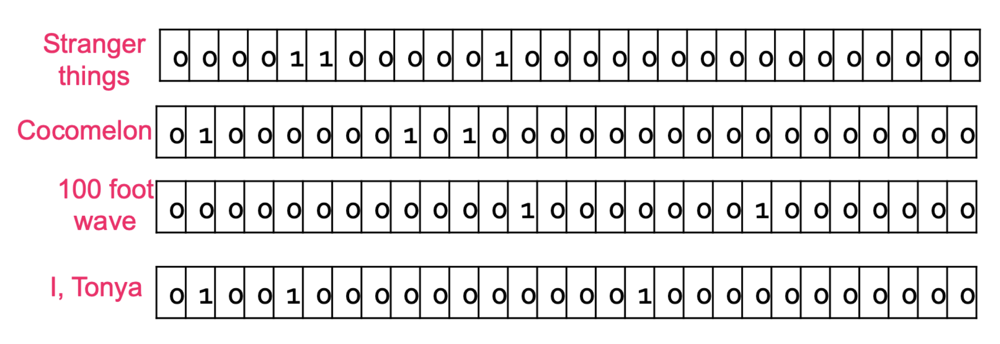

# 1. Introduction: 데이터 표현의 중요성

* 딥러닝과 머신러닝의 가장 핵심적인 목표 중 하나는 데이터를 모델이 이해할 수 있도록 '잘 표현(Representation)'하는 것입니다. 동일한 정보라 할지라도 어떻게 표현하느냐에 따라 모델의 성능이 크게 달라질 수 있습니다. 실제로 훌륭한 데이터 표현을 확보한다면, 복잡한 알고리즘 없이 아주 단순한 알고리즘만으로도 뛰어난 성능을 발휘할 수 있습니다.

* 하지만 우리가 현실에서 마주하는 데이터는 고차원적(High-dimensional)이고, 복잡한 구조를 가지며(Structured), 이산적(Discrete)이거나 끊임없이 쏟아지는(Never-ending) 형태일 때가 많습니다. 따라서 기계학습의 첫 번째 과제는 이러한 **다양하고 복잡한 정보를 어떻게 고정된 길이의 특징 벡터(Fixed-length feature vector) $x$로 변환할 것인가**에 대한 질문에서 출발합니다.

---

# 2. 특징의 종류 (Types of Features)

* 데이터를 고정된 벡터로 변환하기 앞서, 우리가 다루는 데이터의 속성을 파악해야 합니다. 머신러닝 관점에서 데이터는 크게 두 가지 범주로 나뉩니다.
    * **수치형 데이터 (Numerical Data)**:
        * **연속형 (Continuous):** 키(Height), 몸무게(Weight) 등 무한한 정밀도를 가질 수 있는 값.
        * **이산형 (Discrete):** 나이(Age), 연도(Year) 등 셀 수 있는 특정 정수 값.
    * **범주형 데이터 (Categorical Data)**:
        * **순서형 (Ordinal):** 초급, 중급, 고급 등 항목 간에 명확한 대소 혹은 순위 관계가 존재하는 값.
        * **명목형 (Nominal):** 빨강, 파랑, 초록 등 순서나 우위 없이 이름만으로 구분되는 값.

---

# 3. 수치형 데이터의 처리: 정규화 (Normalization)

* 수치형 데이터는 그 자체로 수식 연산이 가능하므로, 스케일을 맞춰주는 **정규화(Normalization)** 과정만 거치면 모델에 직접 사용할 수 있습니다. 예를 들어 한 사람의 특징으로 '몸무게, 키, 발 사이즈'가 주어졌을 때, 각각의 단위와 값의 범위가 다르므로 이를 맞춰주는 작업이 필수적입니다.

* 샘플 $i$의 특징 값을 $x_{i}$라고 할 때, 널리 쓰이는 두 가지 정규화 방법은 다음과 같습니다.
  * 1.  **표준화 (Standardization)**:
      $$x_{i}^{\prime}=\frac{x_{i}-\mu}{\sigma}$$
      * 여기서 $\mu$는 해당 특징의 전체 평균, $\sigma$는 표준편차를 의미합니다. 데이터를 평균이 0, 분산이 1인 정규분포 형태로 변환합니다.
  * 2.  **최소-최대 정규화 (Min-max Normalization)**:
      $$x_{i}^{\prime}=\frac{x_{i}-x_{min}}{x_{max}-x_{min}}$$
      * 여기서 $x_{min}$과 $x_{max}$는 각각 데이터의 최솟값과 최댓값입니다. 이 변환을 거치면 모든 데이터가 0과 1 사이의 값으로 스케일링됩니다.

---

# 4. 범주형 데이터의 인코딩 (Categorical Data Encoding)

* 수치형 데이터와 달리, 텍스트나 범주로 이루어진 데이터는 컴퓨터가 연산할 수 있도록 숫자로 매핑해주는 **인코딩(Encoding)** 과정이 필요합니다.

## 4.1. 정수 인코딩 (Integer Encoding)
* 가장 단순한 방법은 각 범주값에 임의의 정수를 부여하는 것입니다. 예를 들어 스트리밍 플랫폼(Provider) 범주가 `{Netflix, Prime Video, HBO Max, Hulu}`로 주어졌다면, 각각을 `1, 2, 3, 4`로 매핑합니다.

* **한계점:** 이 방식은 명목형 데이터에 부적합합니다. 모델은 `Netflix(1) < Prime Video(2)` 혹은 `Netflix(1) + Prime Video(2) = HBO Max(3)`와 같은 **존재하지 않는 순서나 수학적 관계를 암묵적으로 학습**하게 됩니다.
* **적합한 사례:** 학력(학사=1, 석사=2, 박사=3)과 같은 순서형(Ordinal) 변수에는 비교적 합리적입니다. 하지만 이 경우에도 학사-석사 간의 차이와 석사-박사 간의 차이가 동일하다는(equally spaced out) 가정이 깔리게 되는 단점이 있습니다.

## 4.2. 원-핫 인코딩 (One-hot Encoding)
* 정수 인코딩의 한계를 극복하기 위해, 이산값을 이진 벡터(Binary vector)로 표현하는 원-핫 인코딩을 사용합니다. 

* 범주의 총 개수만큼 벡터의 길이를 만들고, 해당하는 인덱스만 1, 나머지는 모두 0으로 채웁니다. 정수 인코딩의 값이 곧 벡터에서 1이 위치할 인덱스가 됩니다.
  * Netflix: `[1, 0, 0, 0]` 
  * Prime Video: `[0, 1, 0, 0]` 
  * HBO Max: `[0, 0, 1, 0]` 
  * Hulu: `[0, 0, 0, 1]` 

## 4.3. 멀티-핫 인코딩 (Multi-hot Encoding)
* 원-핫 인코딩의 확장형으로, 하나의 변수가 동시에 여러 값을 가질 수 있을 때 사용합니다.

* 예를 들어 영화 데이터셋에서 28개의 장르 중 'Stranger Things'가 `Drama, Fantasy, Horror` 세 가지 장르를 동시에 가진다면 , 해당되는 3개의 인덱스를 모두 1로 표시합니다.

* 위 그림처럼 Cocomelon, 100 foot wave, I, Tonya 등 각 영화의 다중 속성을 희소 벡터(Sparse vector) 형태로 변환할 수 있습니다.

---

# 5. 기존 인코딩의 한계와 임베딩 (Embedding)의 등장

* 각 특징(Feature)들에 대한 인코딩이 완료되면, 이를 모두 이어 붙여(Concatenate) 하나의 최종 행렬(Matrix) 혹은 특징 벡터를 완성합니다. 이는 추천 시스템에서 아이템의 프로필을 생성하는 것과 완전히 동일한 원리입니다. 

* 하지만 위 표와 같이 원-핫/멀티-핫 인코딩을 단순 결합한 방식에는 치명적인 **세 가지 단점**이 존재합니다.
  * 1.  **희소성 (Sparse):** 대부분의 값이 0으로 채워져 메모리와 연산이 비효율적입니다.
  * 2.  **고차원 (High-dimensional):** 범주가 늘어날수록 벡터의 길이가 기하급수적으로 길어집니다.
  * 3.  **의미적 유사성 결여 (No semantic similarity):** 예를 들어 '공포(Horror)'는 '로맨스(Romance)'보다 '스릴러(Thriller)'에 내용적으로 훨씬 가깝습니다. 하지만 원-핫 인코딩 공간에서 Horror 벡터와 Thriller 벡터를 내적(Dot product)하면 0이 되어 서로 직교(Orthogonal)하므로, 모델은 두 장르가 완전히 독립적이라고 착각하게 됩니다.

### 임베딩 공간 (Embedding Space)으로의 투영

* 이 문제를 해결하는 핵심 기술이 바로 **임베딩(Embedding)**입니다. 임베딩은 이산적인 범주형 특징들을 **저차원 공간(Low-dimensional space)으로 변환**하는 기법을 뜻합니다.

* 좋은 임베딩은 다음과 같은 속성을 가져야 합니다.
  * **밀집형 (Dense):** 0과 1이 아닌 연속적인 실수(Floating-point) 값들로 채워집니다.
  * **저차원 (Low-dimensional):** 범주의 개수가 수백만 개라도 임베딩 벡터는 수십~수천 차원으로 압축됩니다.
  * **의미적 유사성 캡처 (Capture semantic similarity):** 데이터 간의 의미적 관계가 벡터 공간에서의 거리(Distance)로 표현됩니다.

* 위 그림처럼 임베딩이 잘 구축되면, Thriller와 Horror는 공간상에 가깝게 위치하게 됩니다. 이렇게 의미를 내포한 좋은 임베딩을 입력으로 사용하면, 아주 단순한 추천 모델이나 클러스터링 알고리즘만으로도 훌륭한 성능을 낼 수 있습니다.

---

# 6. 표현 학습과 딥러닝 (Representation Learning & Neural Networks)

* 그렇다면 데이터의 의미를 담아내는 임베딩 벡터는 어떻게 찾아낼까요? 기계학습에서는 이를 **표현 학습 (Representation Learning)**이라는 하나의 독립적인 과제로 다룹니다. 이는 명시적인 정답 라벨이 주어지지 않은 상태에서 데이터의 구조를 파악하는 **비지도 학습 (Unsupervised task)**에 해당합니다.

* 전통적인 표현 학습(임베딩) 방법론들은 주어진 행렬(데이터)을 압축한 뒤 다시 복원할 때 발생하는 **재구성 오차(Reconstruction error)를 최소화**하는 것을 '좋은 표현'의 기준으로 삼았습니다.
  * **SVD (특이값 분해):** $R=U\Sigma V^{\top}$  에서, 분해된 행렬 $U$는 행(Row)에 대한 임베딩을, $V$는 열(Column)에 대한 임베딩을 나타냅니다.
  * **UV 분해:** $R=UV^{\top}$ 방식 역시 행렬 $U$와 $V$를 각각 행/열의 저차원 임베딩으로 활용합니다.

### 딥러닝 관점에서의 임베딩 (Neural Networks for Embeddings)

* 최근의 딥러닝 모델들은 그 자체로 아주 강력한 **'표현 학습기(Representation Learner)'**로 기능합니다. 특정 문제(Task) $P$를 풀기 위해 거대한 신경망 $f_{\theta}$를 학습시킨다고 가정해 보겠습니다. 이 신경망의 구조를 수학적으로 두 부분으로 분리할 수 있습니다.

$$f_{\theta}(x) = h_{\rho}(g_{\phi}(x)) \quad (\text{단, } \theta=\{\phi,\rho\})$$

* 여기서 각 기호의 의미는 다음과 같습니다.
  * 1.  **$x$**: 모델에 들어가는 원시/초기 입력 데이터 특징(예: 정규화된 픽셀 값이나 단순 인코딩 벡터).
  * 2.  **$g_{\phi}(x)$**: 네트워크의 앞단(Front-end) 층들이 $x$를 변환하여 생성해 낸 은닉 벡터. 이것이 바로 모델이 문제 $P$를 풀기 위해 스스로 찾아낸 **가장 적합하고 밀집된 임베딩(Learned representation)**입니다.
  * 3.  **$h_{\rho}$**: 주로 신경망의 마지막 레이어(Classifier 등)를 지칭하며 , 고차원적인 임베딩 $g_{\phi}(x)$를 입력으로 받아 최종적인 예측(Downstream task)을 수행하는 모델로 볼 수 있습니다.

* 결론적으로, 딥러닝이 높은 성능을 달성하는 근본적인 이유는 모델 $g_{\phi}$가 원시 데이터를 모델이 학습하기 가장 유리한 임베딩 공간으로 매핑하는 **표현 학습 능력을 내재**하고 있기 때문입니다.