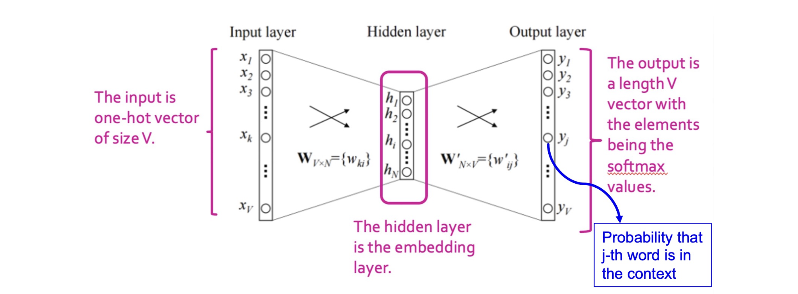

# 1. Introduction: 단어 임베딩 (Word Embedding)의 동기

지난 포스트에서는 범주형 데이터를 밀집된 실수형 저차원 벡터로 변환하는 '임베딩(Embedding)'의 중요성과, 신경망을 이용한 표현 학습(Representation Learning)의 기본 개념을 살펴보았습니다. 이번 포스트에서는 이 임베딩 기법을 자연어 처리(NLP) 도메인에 적용하여, 단어의 의미를 벡터 공간에 표현하는 대표적인 알고리즘인 **Word2Vec**에 대해 상세히 다룹니다.

2013년 구글에서 개발된 Word2Vec은 최근의 거대 언어 모델(LLM)에 밀려 주류에서 물러났지만, 표현 학습의 근본적인 원리와 직관을 이해하는 데 있어 여전히 매우 가치 있는 알고리즘입니다. 

Word2Vec의 핵심 아이디어는 언어학의 **분포 가설(Distributional Hypothesis)**에 기반합니다.
> **"비슷한 문맥(Context)에서 등장하는 단어들은 비슷한 의미를 가진다."**

예를 들어, "apple"이라는 단어가 "tree", "eat", "fruit" 등과 자주 함께 쓰인다면, 우리는 단어의 형태적 특성이 아닌 **'사용되는 문맥'**을 바탕으로 단어의 의미를 추론할 수 있습니다. 즉, 문맥이 유사한 단어들이 임베딩 공간 상에서도 서로 가까이 위치하도록 학습시키는 것이 Word2Vec의 최종 목표입니다.

---

# 2. 문제 정의 및 수식화 (Problem Definition)

단어 임베딩을 학습하기 위해 먼저 입력을 정의해야 합니다. 문서에 등장하는 전체 단어 집합(Vocabulary)의 크기를 $V$라고 합시다.

* **입력 표현:** 각 단어는 크기가 $V$인 원-핫 벡터(One-hot vector) $x$로 표현됩니다.
  * 예: Vocabulary = `{apple, banana, cookie}` 이고 $V=3$일 때, "apple"의 입력 벡터는 $x_{apple} = [1, 0, 0]^\top$가 됩니다.

우리가 찾고자 하는 임베딩 공간의 차원을 $N$이라고 할 때, 각 단어를 이 $N$차원 공간으로 매핑하는 **가중치 행렬(Weight Matrix) $W$**를 정의할 수 있습니다.
* $W \in \mathbb{R}^{V \times N}$: 이 행렬의 각 행(Row)이 특정 단어의 $N$차원 임베딩 벡터가 됩니다.

따라서 대상 단어(Target word)의 임베딩 벡터는 입력 원-핫 벡터 $x$와 가중치 행렬 $W$의 곱으로 나타낼 수 있습니다.
$$\text{Embedding of word } x = x^\top W$$
(원-핫 벡터 $x$의 위치만 1이므로, 행렬 곱 연산은 사실상 $W$ 행렬에서 해당 단어의 인덱스에 대응하는 **행을 그대로 가져오는(Lookup) 작업**과 같습니다.)

우리의 궁극적인 목표는 각 단어에 대해 의미적 유사성을 잘 담아내는 훌륭한 행렬 $W$를 찾는(학습하는) 것입니다.

---

# 3. 중심 단어와 주변 단어 (Target and Context Words)

학습을 위해서는 어떤 단어가 같이 쓰였는지(Co-occurrence)를 모델에 알려주어야 합니다. 이를 위해 특정 단어를 **중심 단어(Target Word)**로 삼고, 그 주변에 위치한 단어들을 **주변 단어(Context Words)**로 정의하여 데이터셋을 구성합니다.

* **윈도우 크기 (Window Size, $L$):** 중심 단어를 기준으로 좌우로 몇 개의 단어까지를 문맥으로 볼 것인지 결정하는 하이퍼파라미터입니다.
* 중심 단어가 정해지면, 좌측 $L$개와 우측 $L$개의 단어가 해당 중심 단어의 주변 단어(Context)가 됩니다.
* 문서의 처음부터 끝까지 **슬라이딩 윈도우(Sliding Window)** 방식을 통해 이동하며 (중심 단어, 주변 단어) 쌍을 모두 추출합니다.

---

# 4. 목적 함수: 대리 문제 (Proxy Task) 설정

Word2Vec은 "중심 단어의 임베딩이 주어졌을 때, 그 주변에 어떤 단어들이 등장할지 잘 예측하도록" 모델을 훈련시킵니다. 즉, 중심 단어로 주변 단어를 예측하는 분류 문제(Proxy task)를 푸는 과정에서 자연스럽게 임베딩이 학습되는 구조입니다.

이를 통계적 모델로 수식화하면, 우리는 주어진 파라미터(임베딩 행렬) 조건 하에서 정답 주변 단어들이 등장할 **로그 우도(Log likelihood)**를 최대화하는 $W$를 찾고자 합니다.

$$\max_W \log p(y_{1}, \cdots, y_{2L} \mid x^\top W)$$
* $x^\top W$: 중심 단어의 임베딩 벡터
* $y_{1}, \dots, y_{2L}$: 윈도우 내에 존재하는 정답 주변 단어들

하지만 문맥에 있는 여러 단어의 동시 등장 확률(Joint probability)을 한 번에 계산하는 것은 연산량이 너무 많습니다. 따라서, 중심 단어가 주어졌을 때 **주변 단어들이 등장할 확률은 서로 조건부 독립(Conditionally Independent)이라는 강력한 가정을 도입**합니다.

이 가정 덕분에 결합 확률은 개별 확률들의 곱으로 분해되며, 로그(log)의 성질에 의해 다음과 같이 합(Sum)의 형태로 식을 전개할 수 있습니다.

$$\log p(y_{1}, \cdots, y_{2L} \mid x^\top W) = \sum_{k=1}^{2L} \log p(y_k \mid x^\top W)$$

즉, 모델은 "중심 단어 임베딩($x^\top W$)을 바탕으로, $k$번째 주변 단어 $y_k$가 나올 확률"들을 각각 최대화하도록 학습하게 됩니다.

---

# 5. 모델 아키텍처: Softmax Classifier

앞서 구한 식 $\log p(y_k \mid x^\top W)$는 수식일 뿐, 이를 계산해 줄 구체적인 함수 모델이 필요합니다. 이 확률을 $V$개의 전체 단어 중 정답 $y_k$를 골라내는 **$V$-way 다중 클래스 분류(Multi-class Classification) 문제**로 취급합니다.

이를 위해 신경망의 **소프트맥스(Softmax) 분류기**를 도입합니다.
분류를 위해 $N$차원의 중심 단어 임베딩을 다시 크기 $V$의 확률 분포 공간으로 투영해야 하므로, 크기가 $N \times V$인 **새로운 파라미터 행렬 $W'$**를 추가합니다.

예측 결과 벡터 $\hat{y}$는 다음과 같이 계산됩니다.

$$\hat{y} = \text{softmax}(x^\top W W')$$

1. $x^\top W$: 중심 단어의 임베딩 (크기: $1 \times N$)
2. $(x^\top W) W'$: 출력 전 로짓(Logit) 벡터 (크기: $1 \times V$)
3. $\text{softmax}(\cdot)$: $V$차원 로짓 벡터의 각 원소를 0~1 사이의 확률 값으로 변환하며, 전체 합이 1이 되도록 조정합니다.

소프트맥스 함수의 개별 원소 $j$ (즉, $j$번째 단어가 주변 단어로 등장할 예측 확률)의 수식은 다음과 같습니다.
$$\text{softmax}_j(v) = \frac{\exp(v_j)}{\sum_k \exp(v_k)}$$
따라서 $\hat{y}_j$는 중심 단어가 주어졌을 때 $j$번째 단어가 문맥으로 등장할 것이라는 모델의 예측 확률(Probability)로 해석됩니다.

---

# 6. 학습 과정 (Training Process)

Word2Vec의 전체 학습 프로세스는 다음과 같은 순서로 진행됩니다.

## 6.1. 데이터 준비 (Data Preparation)
1. 문서 코퍼스(Corpus) $D = \{d_1, d_2, \dots\}$를 수집합니다.
2. 모든 문서를 토큰화(Tokenization)하고 $V$ 크기의 단어 사전(Vocabulary)을 구축합니다.
   * 토큰화 기법으로는 k-gram, WordPiece, BPE 등 다양하지만, 가장 단순하게는 띄어쓰기 기준의 1-gram 단어 분리를 사용합니다.
3. 슬라이딩 윈도우를 적용하여 $(x, c)$ 즉, (중심 단어, 주변 단어) 형태의 방대한 학습 데이터 쌍을 구축합니다.

## 6.2. 목적 함수: 교차 엔트로피 손실 (Cross-Entropy Loss)
분류 문제에 가장 널리 쓰이는 손실 함수인 **교차 엔트로피(Cross-Entropy) Loss**를 최소화하는 방향으로 파라미터 행렬 $W, W'$를 업데이트합니다.

$$\mathcal{L}(y, \hat{y}) = - \sum_{i=1}^V y_i \log \hat{y}_i$$
* $y$: 정답 주변 단어의 원-핫 타겟 벡터 (정답 위치만 1, 나머지는 0)
* $\hat{y}$: 모델이 소프트맥스로 추정한 $V$차원 확률 예측 벡터

위 식에서 정답 라벨 $y_i$는 실제 정답 위치(인덱스 $k$)에서만 1의 값을 가지므로, 수식은 본질적으로 $- \log \hat{y}_k$를 최소화하는 것과 같습니다. 이는 곧 앞서 정의한 정답 확률 $p(y_k \mid x^\top W)$를 최대화하는 것과 완벽히 동일한 의미를 가집니다.

## 6.3. 경사 하강법 업데이트 (SGD Optimization)
확률적 경사 하강법(Stochastic Gradient Descent)을 이용하여 데이터 쌍 $(x, c)$마다 그레디언트(Gradient)를 구하고 가중치를 반복적으로 업데이트합니다. 

학습률(Learning rate)을 $\eta$라 할 때, 파라미터 업데이트 수식은 다음과 같습니다.
1. $W \leftarrow W - \eta \cdot \nabla_{W} \mathcal{L}(W, W', x, c)$
2. $W' \leftarrow W' - \eta \cdot \nabla_{W'} \mathcal{L}(W, W', x, c)$

학습(모든 Epoch)이 완전히 종료되면, 문맥을 분류하는 용도로 쓰였던 가중치 $W'$는 버리고(ignoring), **은닉층의 가중치 행렬 $W$ (또는 $H$로 표기되기도 함)만을 최종적인 "단어 임베딩 공간" 결과물로 채택**하여 다양한 후속 자연어 처리 태스크(Downstream task)의 입력으로 활용합니다.