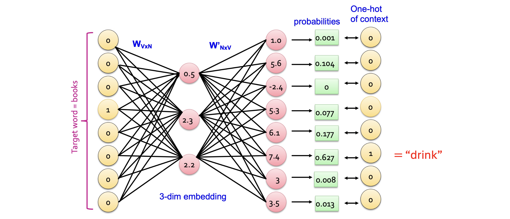

# 1. Introduction: 이론에서 실전으로

* 이전 포스트에서는 Word2Vec이 '분포 가설'을 바탕으로 어떻게 신경망 구조를 통해 단어의 의미를 학습하는지 이론적인 배경과 수식을 살펴보았습니다. 중심 단어(Target word)로 주변 단어(Context words)를 예측하는 과정에서 가중치 행렬 $W$가 자연스럽게 의미를 담은 임베딩 공간으로 진화한다는 것이 핵심이었습니다.

* 하지만 수식만으로는 행렬의 차원이 어떻게 변하고 연산이 어떻게 이루어지는지 직관적으로 와닿지 않을 수 있습니다. 따라서 이번 포스트에서는 **단 하나의 문장으로 이루어진 극단적으로 단순화된 코퍼스(Corpus)**를 가정하고, 실제 숫자들이 모델 내부에서 어떻게 흘러가는지(Forward Pass) 단계별로 추적해 보겠습니다.

---

# 2. 문서 및 어휘 사전 구축 (Document and Vocabulary)

* 가장 먼저 해야 할 일은 학습 데이터를 준비하고 어휘 사전(Vocabulary)을 구축하는 것입니다.
  * **입력 문서 (Document):** `"I read sci-fi books and drink orange juice"`

* 이 문서 하나가 우리가 가진 전체 데이터라고 가정해 봅시다. 

* 1-gram(단어 단위) 기준으로 띄어쓰기를 통해 토큰화를 진행하면, 어휘 사전은 다음과 같이 구성됩니다.
  * **Vocab** = `{"I", "read", "sci-fi", "books", "and", "drink", "orange", "juice"}`

* 총 8개의 고유한 단어가 존재하므로, 어휘 사전의 크기 $V = 8$이 됩니다. 이제 각 단어를 크기가 8인 **원-핫 벡터(One-hot vector)**로 변환합니다.
  * `"I"` $\rightarrow [1, 0, 0, 0, 0, 0, 0, 0]$
  * `"read"` $\rightarrow [0, 1, 0, 0, 0, 0, 0, 0]$
  * ...
  * `"books"` $\rightarrow [0, 0, 0, 1, 0, 0, 0, 0]$ (4번째 인덱스)
  * ...
  * `"juice"` $\rightarrow [0, 0, 0, 0, 0, 0, 0, 1]$

---

# 3. 신경망 아키텍처 및 차원 설정 (Architecture)

* 이제 이 원-핫 벡터를 입력으로 받는 Word2Vec 모델의 구조를 정의합니다. 모델이 학습할 임베딩 공간의 차원(Embedding dimension)을 $N = 3$으로 설정하겠습니다.

* 모델은 크게 세 부분으로 나뉩니다.
  * 1. **입력층 (Input Layer):** 중심 단어의 원-핫 벡터 ($1 \times 8$ 차원)
  * 2. **은닉층 (Hidden Layer):** 3차원으로 압축된 임베딩 벡터 ($1 \times 3$ 차원)
  * 3. **출력층 (Output Layer):** 어휘 사전 내 각 단어가 주변 단어일 확률 ($1 \times 8$ 차원)

---

# 4. 임베딩 벡터 추출 (Getting Embeddings)

* 모델에 **"books"**라는 중심 단어가 주어졌다고 가정해 봅시다. 우리의 목표는 주어진 두 가중치 행렬 $W$와 $W'$를 거쳐 어떤 결과가 나오는지 확인하는 것입니다.

* 입력 벡터 $x$는 4번째 위치가 1인 원-핫 벡터입니다.
$$x^\top = [0, 0, 0, 1, 0, 0, 0, 0]$$

* 입력층과 은닉층을 연결하는 가중치 행렬 $W$ (크기 $8 \times 3$)가 다음과 같이 학습되어 있다고 가정해 보겠습니다. (계산의 편의를 위해 행렬 $W$의 전치 행렬인 $W^\top$를 제시합니다.)

$$W^\top = \begin{bmatrix} 
1 & -1.2 & 1.2 & \mathbf{0.5} & -1.1 & 1 & 0.3 & \dots \\ 
2 & -3 & 1.1 & \mathbf{2.3} & 0.6 & -1 & 1.2 & \dots \\ 
2 & -2 & 0.5 & \mathbf{2.2} & -1 & 2 & 0.7 & \dots 
\end{bmatrix}_{3 \times 8}$$

* 중심 단어 "books"의 임베딩 벡터는 $x^\top W$를 곱하여 계산됩니다. 앞서 배웠듯 원-핫 벡터와의 행렬 곱은 사실상 행렬 $W$에서 해당하는 행(Row), 즉 $W^\top$의 4번째 열(Column)을 그대로 **가져오는(Lookup)** 작업과 동일합니다.

$$x^\top W = [0.5, 2.3, 2.2]$$

* 이 $[0.5, 2.3, 2.2]$라는 3차원 벡터가 바로 신경망이 현재 이해하고 있는 **"books"의 임베딩 표현**입니다.

---

# 5. 주변 단어 확률 예측 (Predicting Context Words)

* 이제 이 3차원 임베딩 벡터를 바탕으로 어떤 단어가 주변 문맥으로 등장할지 예측해야 합니다. 이를 위해 은닉층과 출력층을 연결하는 가중치 행렬 $W'$ (크기 $3 \times 8$)를 통과시킵니다.

* 현재 $W'$가 다음과 같은 값을 가지고 있다고 가정합니다.
$$W' = \begin{bmatrix} 
1 & 2 & 2 & 0 & 0.7 & 1.3 & -1 & -0.1 \\ 
1.2 & 0.5 & -1 & 1 & 0.3 & 2 & 0.6 & 1 \\ 
-1 & 1.6 & -0.5 & 1.4 & 2.3 & 1 & 1 & 0.6 
\end{bmatrix}_{3 \times 8}$$

* 은닉 벡터 $[0.5, 2.3, 2.2]$와 $W'$를 내적(Dot product)하여 각 단어에 대한 **로짓(Logit)** 값을 계산합니다. 

$$x^\top W W' \approx [1.0, 5.6, -2.4, 5.3, 6.1, \mathbf{7.4}, 3.0, 3.5]$$

* 예를 들어, 첫 번째 원소(1.0)는 $0.5(1) + 2.3(1.2) + 2.2(-1) = 0.5 + 2.76 - 2.2 = 1.06 \approx 1.0$ 으로 계산된 것입니다. 이 8차원 벡터는 아직 확률 값이 아닌 단순한 실수형 스코어입니다.

### Softmax 연산을 통한 확률 변환
  
* 이 로짓 벡터를 모두 더해 1이 되는 형태의 확률 분포로 바꾸기 위해 **소프트맥스(Softmax)** 함수를 적용합니다. 각 출력 뉴런 $j$의 값은 다음과 같이 변환됩니다.

$$\hat{y}_j = \frac{e^{v_j}}{\sum_k e^{v_k}}$$

* 이를 적용하면 최종적으로 다음과 같은 예측 확률(Probability)이 산출됩니다.
  * $P(\text{"I"}) = 0.001$
  * $P(\text{"read"}) = 0.104$
  * $P(\text{"sci-fi"}) \approx 0$ (매우 작은 값)
  * $P(\text{"books"}) = 0.077$
  * $P(\text{"and"}) = 0.177$
  * **$P(\text{"drink"}) = 0.627$**
  * $P(\text{"orange"}) = 0.008$
  * $P(\text{"juice"}) = 0.013$

* 만약 실제 문장에서 타겟 단어 "books"의 주변 단어가 **"drink"** 였다면, 모델은 "drink" 인덱스에 해당하는 확률($0.627$)을 정답으로 판단하고, 이 확률이 1.0에 가까워지도록 오차를 계산하여 $W$와 $W'$를 업데이트하게 됩니다.

---

# 6. Word2Vec 요약 및 의미적 관계 (Semantic Relationships)

* 이러한 학습이 수만, 수백만 번 반복되면, 가중치 행렬 $W$는 단순히 단어를 압축하는 것을 넘어 **단어 간의 의미적 관계를 공간적 거리와 방향으로 인코딩**하게 됩니다.
  * 1. **차원 축소의 효과:** 어휘 사전의 크기 $V$가 100만 개일지라도, 임베딩 차원 $N$은 보통 100~300 정도로 매우 작습니다 ($N \ll V$). 이는 정보의 '압축'을 강제하여 불필요한 노이즈를 제거하고 핵심 의미만 남기게 합니다.
  * 2. **벡터 연산을 통한 추론:** 임베딩 공간에서 단어 벡터들은 놀라운 대수적 특성을 보입니다.

* 가장 유명한 예시로, 잘 학습된 Word2Vec 벡터들은 다음과 같은 연산이 성립합니다.
$$\text{vector("King")} - \text{vector("Man")} + \text{vector("Woman")} \approx \text{vector("Queen")}$$

* 위 그림처럼 남성(man)에서 여성(woman)으로 향하는 벡터의 방향과 거리(관계)가 왕(king)에서 여왕(queen)으로 향하는 벡터의 방향과 완벽히 유사하게 학습됩니다. 즉, 모델은 단순히 단어가 같이 등장하는 빈도를 학습했을 뿐인데도, 인간 언어의 복잡한 '의미론적(Semantic)' 및 '구문론적(Syntactic)' 규칙을 스스로 깨우친 것입니다.