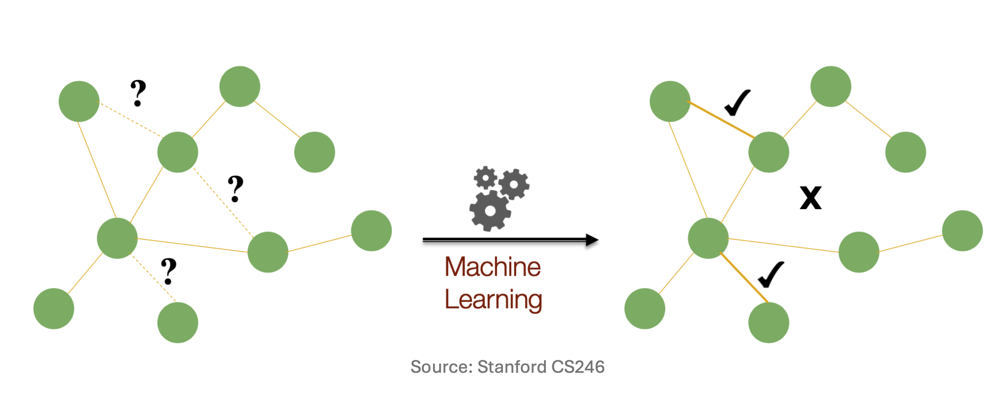
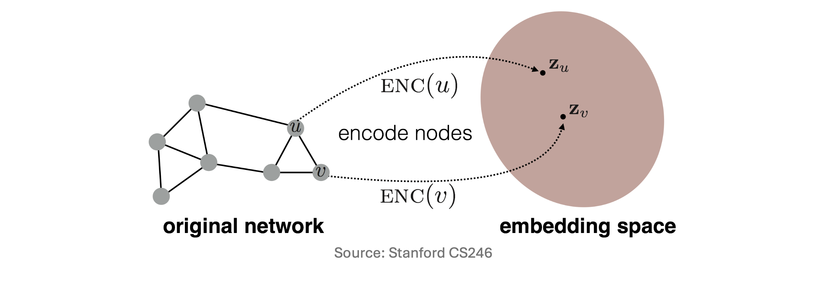

# 1. Introduction: 그래프 데이터에서의 기계학습 태스크

그래프(Graph)는 웹(Web)의 하이퍼링크 구조뿐만 아니라 소셜 네트워크, 분자 구조, 교통망 등 객체 간의 복잡한 관계를 나타내는 다양한 형태의 데이터를 일반화하는 강력한 자료구조입니다. 전통적인 데이터 마이닝에서는 다음과 같은 알고리즘들을 통해 그래프의 특성을 분석해 왔습니다.

* **PageRank**: 네트워크 내에서 각 노드(Node)의 상대적 중요도(Importance)를 계산.
* **Proximity**: 노드 간의 물리적 혹은 위상수학적 거리(Distance)를 측정.
* **Community Detection**: 밀도 높게 연결된 노드들의 군집(Dense node communities)을 탐지.

하지만 현대의 기계학습(Machine Learning)은 단순히 구조를 분석하는 것을 넘어, 예측 모델링을 수행하는 데 초점을 맞춥니다. 그래프 기계학습의 대표적인 두 가지 태스크는 다음과 같습니다.

## 1.1. 노드 분류 (Node Classification)
네트워크 내에서 레이블이 주어지지 않은 노드의 속성이나 범주를 예측하는 태스크입니다. 예를 들어, 소셜 네트워크 상에서 특정 사용자의 정치적 성향을 식별하거나, 추천 시스템에서 사용자와 아이템을 특정 카테고리로 분류하는 작업이 이에 해당합니다.

## 1.2. 링크 예측 (Link Prediction)
현재는 존재하지 않지만 미래에 생성될 가능성이 높거나, 혹은 관측 과정에서 누락된 간선(Edge)을 예측하는 태스크입니다. 소셜 네트워크에서 '알 수도 있는 사람(새로운 친구)'을 추천하거나, 넷플릭스와 같은 시스템에서 사용자가 좋아할 만한 새로운 영화를 추천하는 것이 전형적인 링크 예측 문제입니다.

# 2. 전통적 그래프 표현 방식과 그 한계

그래프 구조에 기계학습 모델을 적용하기 위해서는 그래프를 컴퓨터가 연산할 수 있는 수학적 형태로 표현해야 합니다.

## 2.1. 인접 행렬 (Adjacency Matrix)을 통한 표현
가장 직관적인 방법은 그래프 $G = (V, E)$를 크기 $N \times N$의 인접 행렬(Adjacency Matrix) $A \in \{0, 1\}^{N \times N}$로 나타내는 것입니다. (단, $N$은 총 노드의 수 $|V|$를 의미합니다).

행렬의 각 원소 $a_{ij}$는 위 도식과 같이 노드 $i$와 노드 $j$의 연결 여부에 따라 다음과 같이 정의됩니다:
$$a_{ij} = \begin{cases} 1, & \text{if nodes } i \text{ and } j \text{ are connected} \\ 0, & \text{otherwise} \end{cases}$$

이 방식에 따르면, 네트워크 상의 특정 노드 $i$는 자신과 연결된 다른 노드들의 정보를 담고 있는 크기 $N$의 다중 원-핫 벡터(Multi-hot vector) $a_i$로 표현됩니다.

## 2.2. 단순 접근법의 한계점 (Limitations of the Naïve Approach)
하지만 노드 $i$를 다중 원-핫 벡터 $a_i$로 표상하여 기계학습 모델의 입력으로 사용하는 단순(Naïve) 접근법에는 치명적인 한계가 존재합니다.

1.  **차원의 저주와 희소성 (High-dimensional and Sparse)**
    노드 벡터 $a_i$의 차원은 전체 노드의 수 $N$과 같습니다. 수억 개의 노드를 가진 네트워크에서는 벡터의 차원이 지나치게 크고, 대부분이 0으로 채워진 극단적인 희소 행렬(Sparse matrix)이 되어 연산 효율성이 극도로 떨어집니다.

2.  **치환 불변성 (Permutation Invariance)의 부재**
    인접 행렬 $A$는 유일(Unique)하지 않습니다. 그래프의 기하학적 구조가 완전히 동일하더라도, 노드에 번호를 매기는 순서가 달라지면 행렬 $A$의 모습이 변합니다. 
    $$A^{(1)} = \begin{bmatrix} 0 & 1 & 1 \\ 1 & 0 & 0 \\ 1 & 0 & 0 \end{bmatrix}, \quad A^{(2)} = \begin{bmatrix} 0 & 0 & 1 \\ 0 & 0 & 1 \\ 1 & 1 & 0 \end{bmatrix}$$
    이러한 입력 변동성은 모델을 불안정하게 만듭니다.

# 3. 그래프 표현 학습 (Graph Representation Learning)

위의 한계를 극복하기 위해 등장한 패러다임이 **그래프 표현 학습(Graph Representation Learning)**입니다. 핵심 목표는 이산적이고 고차원적인 그래프 구조를 컴퓨터가 처리하기 쉬운 저차원의 연속적인 벡터 공간(Continuous vector space)으로 매핑하는 것입니다. 

가장 중요한 대전제는 **"원본 그래프에서의 기하학적, 구조적 관계가 저차원 임베딩 공간에서도 그대로 보존되어야 한다"**는 것입니다.

## 3.1. 노드 임베딩과 활용
특히 각 노드를 개별적인 벡터로 변환하는 '노드 임베딩(Node Embedding)'은 딥러닝 그래프 모델의 가장 뼈대가 됩니다. 이렇게 학습된 노드 임베딩 벡터는 앞서 살펴본 Node Classification, Link Prediction은 물론 Community Detection에도 매우 유용하게 쓰입니다.

# 4. 노드 임베딩의 수학적 정식화 (Mathematical Formulation)

구조를 보존하는 임베딩은 수식으로 어떻게 정의될까요? 주어진 그래프 $G = (V, E)$에서 우리의 목표는 각 노드 $u \in V$를 연속적인 $d$-차원 벡터 $z_u \in \mathbb{R}^d$로 매핑하는 인코더(Encoder) 함수 $\text{ENC}(\cdot)$을 찾는 것입니다.

위 그림에서처럼 $\text{ENC}(v) = z_v$ 가 정의되었다면, 임베딩의 품질을 결정하는 핵심 원칙은 **유사도 보존(Similarity Preservation)**입니다.

수식으로 다시 쓰면 다음과 같습니다.
$$\text{similarity}_{G}(u, v) \approx \text{similarity}_{\mathbb{R}^d}(z_u, z_v)$$
즉, 원본 네트워크에서 이웃을 많이 공유하거나 거리가 가까워 구조적으로 유사한 두 노드는, 임베딩 공간에서도 서로 가까운 위치(높은 유사도)를 가져야 합니다.

## 4.1. 임베딩 유사도 척도: 내적 (Dot Product)
임베딩 공간 $\mathbb{R}^d$에서의 두 벡터 간 유사도 함수로는 **내적(Dot Product)**을 주로 사용합니다.
$$\text{similarity}_{\mathbb{R}^d}(z_u, z_v) = z_u^\top z_v$$

내적은 정규화되지 않은 코사인 유사도와 같습니다. 두 벡터의 사이각이 좁을수록(비슷한 방향을 향할수록) 내적 값이 커집니다.
* **장점 (Pros)**: 행렬 곱셈만으로 병렬 연산이 가능하여 계산이 매우 빠릅니다.
* **단점 (Cons)**: 벡터의 스케일(Scale)에 민감합니다. 하지만 학습 과정에서 정규화를 거치면 큰 문제가 되지 않습니다.

## 4.2. 인코더의 구조: 임베딩 룩업 (Embedding Lookup)
인코더 $\text{ENC}(\cdot)$를 구현하는 가장 얕고 단순한 방법은, 자연어 처리의 Word2Vec처럼 고유 벡터를 직접 매핑하는 **임베딩 룩업(Embedding Lookup)**입니다.

$$\text{ENC}(v) = Z \, 1_v$$

* $Z \in \mathbb{R}^{d \times |V|}$: 최적화해야 할 전체 임베딩 파라미터 행렬 (각 열이 각 노드의 임베딩 벡터).
* $1_v \in \{0, 1\}^{|V|}$: 노드 $v$의 위치만 1인 원-핫 지시 벡터.

결론적으로, 이 행렬 연산은 커다란 $Z$ 행렬 창고에서 $v$번째 노드 전용 벡터를 쏙 빼오는(Lookup) 역할을 합니다. 
