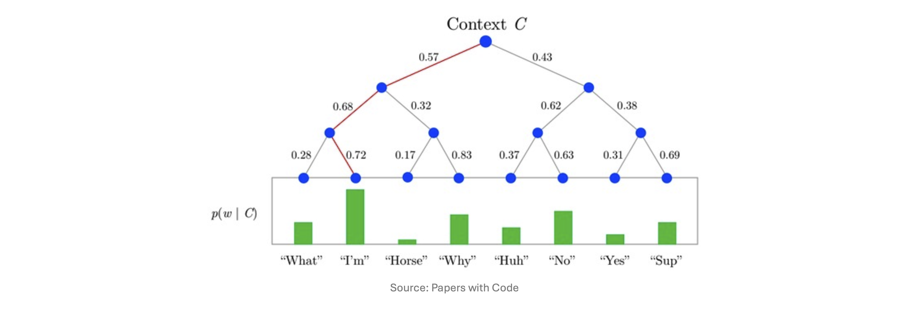

# 1. Introduction: Word2Vec의 아이디어를 그래프로 (Motivation)

이전 포스트에서 우리는 노드 임베딩의 목표가 "원본 네트워크에서의 유사도($\text{similarity}_G(u,v)$)를 임베딩 공간의 내적($z_u^\top z_v$)으로 근사하는 것"임을 확인했습니다. 그렇다면 **"그래프 상에서 두 노드가 유사하다"**는 것은 수학적으로 어떻게 정의할 수 있을까요?

이 질문에 답하기 위해 DeepWalk는 자연어 처리(NLP) 분야의 혁명이었던 **Word2Vec**의 아이디어를 차용합니다. Word2Vec은 "하나의 문장 안에서 윈도우 크기(Window size, $L$) 내에 인접하여 함께 등장하는 두 단어 $u$와 $v$는 의미적으로 유사하다"고 가정합니다.

그렇다면 그래프에서는 어떨까요? 노드 간의 연결망 위를 무작위로 이동하는 **무작위 보행(Random Walk)**을 통해 방문한 노드들의 시퀀스 $u_1, u_2, \dots, u_n$을 하나의 '문장'으로 간주해 보는 것입니다. 이 시퀀스 안에서 $L$ 스텝 이내에 함께 등장하는 노드 $u_i$와 $u_j$를 유사하다고 정의하는 것이 바로 DeepWalk의 핵심 동기입니다.

## 1.1. 왜 무작위 보행(Random Walks)인가?
Random Walk를 통해 생성된 시퀀스에서 노드 $u$와 $v$가 자주 함께 등장(Co-occur)한다면, 우리는 다음 두 가지 사실을 유추할 수 있습니다.
1. 두 노드가 그래프 상에서 위상적으로 가깝다. (최대 $L$-hop 거리 내에 존재)
2. 두 노드가 강한 연결성을 가진다. (많은 이웃을 공유함)

따라서 $\text{similarity}_G(u, v)$를 **"무작위 보행에서 두 노드가 함께 등장할 빈도(Frequency)"**로 정의하고, 이것이 임베딩의 내적 $z_u^\top z_v$에 비례하도록 학습시킵니다. 이 방식은 모든 노드 쌍 간의 거리를 직접 계산(All-pair proximity)하는 것보다 연산 효율성이 훨씬 뛰어납니다.

# 2. 최적화 문제로서의 특징 학습 (Feature Learning as Optimization)

그래프 $G=(V,E)$가 주어졌을 때, 우리의 목표는 각 노드를 $d$차원 공간으로 매핑하는 임베더 $f_\theta: V \rightarrow \mathbb{R}^d$를 학습하는 것입니다. (여기서 $f_\theta(v) = z_v$ 입니다.)

이 학습 과정은 특정 노드 임베딩 $z_u$가 주어졌을 때, 그 노드의 주변 이웃들을 얼마나 잘 예측하는지 측정하는 **최대 우도 추정(Maximum Likelihood Estimation, MLE)** 문제로 정식화됩니다.

$$\max_\theta \sum_{u \in V} \log p(N_R(u) | z_u)$$

* $N_R(u)$: 무작위 보행자(Random walker) $R$에 의해 생성된 노드 $u$의 이웃(Neighborhood) 집합.

## 2.1. 목적 함수의 분해와 Softmax (Random Walk Optimization)
위의 식을 계산 가능한 형태로 만들기 위해 두 가지 중요한 가정을 도입합니다.

**가정 1. 조건부 독립성 (Conditional Independence)**
주변 이웃 노드를 관측할 확률은 다른 노드들의 관측 여부와 독립적이라고 가정합니다. 이를 통해 결합 확률을 개별 확률의 합으로 분해할 수 있습니다.
$$\log p(N_R(u) | z_u) = \sum_{v \in N_R(u)} \log p(z_v | z_u)$$

**가정 2. Softmax 매개변수화 (Softmax Parameterization)**
특정 노드 $u$가 주어졌을 때 $v$가 이웃으로 등장할 확률 $p(z_v | z_u)$를, 전체 노드 집합 $V$에 대한 다중 클래스 분류(Multi-class classification, $|V|$-way) 문제로 정의하고 Softmax 함수를 적용합니다.
$$p(z_v | z_u) = \frac{\exp(z_u^\top z_v)}{\sum_{n \in V} \exp(z_u^\top z_n)}$$
우리는 그래프 내의 수많은 노드 중 대상 노드 $v$가 $u$와 가장 높은 내적값(유사도)을 가지기를 원하므로, 분자에는 $u$와 $v$의 내적이, 분모에는 $u$와 전체 노드 $n$ 간의 내적 합이 들어갑니다.

## 2.2. 특징 공간에서의 대칭성 (Symmetry in Feature Space)
참고로 원본 Word2Vec 알고리즘은 중심 단어용 가중치 $W$와 주변 단어용 가중치 $W'$ 두 개의 행렬을 사용하여 $p_{ij} = \text{softmax}(W' z_i)$ 형태로 계산합니다. 

하지만 DeepWalk에서는 매개변수의 중복을 줄이고 구조의 대칭성을 살리기 위해 **단일 행렬 $W \in \mathbb{R}^{d \times |V|}$** 만을 사용합니다 ($W^\top = W_2$로 취급). 결과적으로 두 노드 벡터의 직접적인 내적인 $z_i^\top z_j$ 꼴을 활용하게 되며, 이는 임베딩 공간에서 $i$와 $j$의 기하학적 유사도를 직관적으로 표현하는 장점이 있습니다.

# 3. 최종 목적 함수와 연산량의 한계

위의 수식들을 모두 결합하여 최소화해야 할 최종 손실 함수(Objective Function) $\mathcal{L}$을 도출하면 다음과 같습니다. (최대 우도 추정의 $\max$를 $-\log$를 취해 $\min$ 문제로 바꾼 형태입니다.)

$$\mathcal{L} = \sum_{u \in V} \sum_{v \in N_R(u)} -\log \left( \frac{\exp(z_u^\top z_v)}{\sum_{n \in V} \exp(z_u^\top z_n)} \right)$$

수식의 각 부분은 다음을 의미합니다:
* $\sum_{u \in V}$: 네트워크 상의 모든 노드 $u$에 대하여 합산
* $\sum_{v \in N_R(u)}$: $u$에서 출발한 무작위 보행에서 관측된 노드 $v$들에 대하여 합산
* $-\log(\dots)$: 대상 노드 $u$에서 출발한 보행 중 $v$가 등장할 예측 확률에 대한 음의 로그 우도(Negative Log-Likelihood)

## 3.1. 연산 비용의 문제 (Computational Cost)
이론적으로는 완벽해 보이지만, 이 목적 함수에는 치명적인 약점이 있습니다. 바로 Softmax 분모의 **정규화 항(Normalization term)** 계산에 $O(|V|)$의 비용이 든다는 것입니다. 
노드 쌍 하나를 계산할 때마다 그래프 내의 *모든* 노드와의 내적을 구해야 하므로, 전체 시간 복잡도가 $O(|V|^2)$가 되어 Facebook이나 Twitter 같이 수억 개의 노드를 가진 거대한 그래프에서는 계산이 불가능(Intractable)해집니다.

# 4. 정규화 병목 현상에 대한 3가지 솔루션

이러한 막대한 계산 비용을 해결하기 위해 어떤 방법들을 고려해볼 수 있을까요?

## 4.1. 솔루션 1: 정규화 항 제거 (No Normalization)
단순히 연산량이 많은 분모 항을 통째로 날려버리면 어떨까요?
$$\mathcal{L} = \sum_{u \in V} \sum_{v \in N_R(u)} -\log(\exp(z_u^\top z_v))$$
얼핏 보면 $\mathcal{L}$을 최소화하는 것이 곧 내적 $z_u^\top z_v$를 최대화하는 것이므로 목적에 부합해 보입니다. 
하지만 이 방식은 **자명한 해(Trivial solution)**라는 치명적인 문제를 낳습니다. 모델이 단순히 그래프 상의 모든 노드의 임베딩을 완벽히 똑같은 벡터로 만들어버리면, 내적 값이 무한히 커지면서 Loss가 최소화되기 때문입니다. 즉, 노드 간의 차이를 구분하는 학습이 아예 이루어지지 않습니다.

## 4.2. 솔루션 2: 계층적 소프트맥스 (Hierarchical Softmax)
$N$개의 클래스를 분류하는 다중 분류 문제를 $O(\log N)$ 번의 이진 분류(Binary classification) 문제로 근사하는 기법입니다.

계층적 소프트맥스의 적용 단계는 다음과 같습니다.
1. 그래프의 모든 노드가 리프(Leaf)가 되도록 이진 트리(Binary tree)를 구축합니다.
2. 타겟 노드 $v$에 대해 루트(Root)에서 $v$까지 도달하는 경로 $S(v)$를 찾습니다.
3. 경로상의 노드 $n$들에 대해 좌/우 분기 확률을 계산하여 목적 함수를 최소화합니다.
$$\mathcal{L} = \sum_{u \in V} \sum_{v \in N_R(u)} \sum_{n \in S(v)} -\log \left( \frac{\exp(z_u^\top z_n)}{\exp(z_u^\top z_n) + \exp(z_u^\top z_{n'})} \right)$$
(여기서 $n'$은 트리의 분기점에서 $n$의 반대쪽(Opposite side)에 위치한 노드를 의미합니다.) 이 방식을 쓰면 계산량을 $O(|V|)$에서 $O(\log |V|)$로 획기적으로 줄일 수 있습니다.

## 4.3. 솔루션 3: 네거티브 샘플링 (Negative Sampling)
Node2vec 등에서 가장 널리 쓰이는 실용적인 해결책입니다. Softmax의 정규화 목적은 결국 타겟이 아닌 노드($n \ne v$)들과의 내적 $z_u^\top z_n$ 값을 낮추는(Push down) 것입니다. 그렇다면 모든 노드를 다 계산할 필요 없이, 소수의 **$k$개 노드만 무작위로 추출하여 가짜 데이터(Negative samples)로 사용**하자는 아이디어입니다.

$$\log \frac{\exp(z_u^\top z_v)}{\sum_{n \in V} \exp(z_u^\top z_n)} \approx \log(\sigma(z_u^\top z_v)) - \sum_{i=1}^k \log(\sigma(z_u^\top z_{n_i}))$$
* $n_i$: 전체 그래프 노드 중 무작위로 샘플링된 네거티브 노드.
* $\sigma$: 시그모이드 함수. 내적 값이 발산하지 않도록 각 쌍의 기여도를 $[0, 1]$로 바운딩(Bound)해줍니다.
* 위 식은 진짜 이웃과의 내적 유사도는 높이면서(첫 번째 항), 무작위로 뽑은 $k$개의 가짜 노드와의 내적은 낮추는(두 번째 뺄셈 항) 형태로 근사합니다.

**샘플링 전략 및 K의 선택**
보통 네거티브 노드는 각 노드의 연결수(Degree)에 비례하여 샘플링합니다. 왜냐하면 연결수가 많은 노드(허브 노드)일수록 무작위 보행 중에 우연히 등장할 확률이 높기 때문에, 이들을 집중적으로 네거티브 샘플링하여 페널티를 주는 것이 학습에 더 효과적이기 때문입니다.
일반적으로 샘플 개수 $k$는 5에서 20 사이의 값을 사용합니다. $k$가 커질수록 추정이 정교해지지만 연산 비용도 함께 증가하는 트레이드오프(Trade-off)가 존재합니다.
