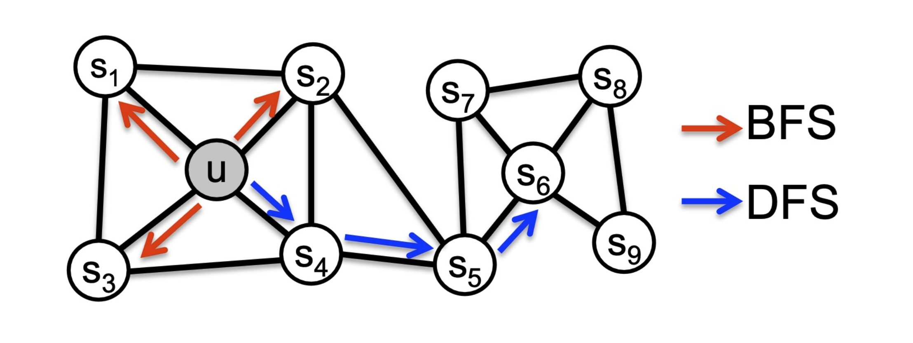

# 1. Introduction: 왜 편향된 탐색이 필요한가? (Motivation)

* DeepWalk가 가정한 "무작위 보행에서 자주 함께 등장하는 노드는 유사하다"는 논리는 주로 위상학적으로 가까이 뭉쳐 있는 군집(Community)을 찾는 데 탁월합니다. 하지만 실제 네트워크에서는 **거리가 멀리 떨어져 있더라도 그래프 내에서 매우 유사한 '역할'을 수행하는 노드**들이 존재합니다.

* 가장 대표적인 예가 항공망(Airport Network)입니다. 대한민국의 인천국제공항과 미국의 JFK 공항은 지리적, 위상학적 거리는 멀 수 있지만 '국제 허브 공항'이라는 동일한 **구조적 역할(Structural Role)**을 가집니다. 반면, 허브 공항 주변의 수많은 지역 소규모 공항들은 서로 다른 군집에 속해 있더라도 주변을 연결하는 '스포크(Spoke)'라는 유사한 역할을 갖습니다.

* DeepWalk와 같은 단순 무작위 보행(Simple random walks)은 주로 전자(군집)의 경우만 잘 포착할 뿐, 후자(역할)를 학습하는 데는 취약합니다. 이러한 한계를 극복하기 위해 제안된 것이 바로 탐색의 방향을 의도적으로 조절하는 **Node2vec**입니다.

# 2. 유연한 그래프 탐색: BFS vs DFS

* Node2vec의 핵심 아이디어는 그래프 탐색의 두 가지 극단적인 전략인 **너비 우선 탐색(BFS, Breadth-First Search)**과 **깊이 우선 탐색(DFS, Depth-First Search)**을 무작위 보행에 통합하여, 이 둘 사이를 유연하게 조절(Interpolate)하는 것입니다.

## 2.1. 깊이 우선 탐색 (DFS: Depth-First Search)
* DFS 성향을 띠는 보행은 위 도식의 푸른색 화살표처럼 출발 노드 $u$로부터 점점 더 멀어지는 바깥 방향(Outgoing direction)으로 트리를 따라가듯 이동합니다. 
  * 무작위 보행 시 $N_{DFS}(u) = [s_4, s_5, s_6]$와 같이 거리가 먼 노드들이 이웃으로 샘플링될 확률이 높습니다.
  * 이는 네트워크의 거시적인 뷰(Macroscopic view)를 제공하며, 거리가 어느 정도 있는 노드들까지 하나의 문맥(Context)으로 묶어 **동종 선호(Homophily, 유사한 속성을 가진 노드들이 군집을 이루는 성질)**를 포착하는 데 유리합니다. DeepWalk의 특성과 매우 유사합니다.

## 2.2. 너비 우선 탐색 (BFS: Breadth-First Search)
* BFS 성향을 띠는 보행은 붉은색 화살표처럼 출발 노드 $u$의 바로 주변, 즉 가까운 이웃들만을 맴돌며 탐색합니다.
  * 무작위 보행 시 $N_{BFS}(u) = [s_1, s_2, s_3]$와 같이 근거리 노드들이 이웃으로 집중적으로 샘플링됩니다.
  * 좁은 지역의 연결망 구조(Microscopic view)를 세밀하게 파악하기 때문에, 주변 이웃의 연결 형태가 비슷한 허브(Hub)인지 주변부(Peripheral)인지 등의 **구조적 동치성(Structural equivalence)**을 파악하는 데 특화되어 있습니다.

# 3. 편향된 무작위 보행 설계 (Biased Random Walks)

* 그렇다면 BFS와 DFS의 비율을 어떻게 수학적으로 제어할 수 있을까요? Node2vec은 보행자(Walker)가 직전에 머물렀던 노드 정보를 활용하는 2차 마르코프 체인(2nd-order * Markov chain) 방식을 채택합니다.

* 보행자가 방금 전 노드 $s_1$에서 현재의 타겟 노드 $w$로 이동해 왔다고 가정해 봅시다. 이제 $w$에서 다음으로 이동할 노드 $t \in \{s_1, s_2, s_3\}$를 결정해야 합니다. Node2vec은 직전 노드 $s_1$과 다음 후보 노드 $t$ 사이의 최단 거리 $\text{Dist}(s_1, t)$를 기준으로 탐색의 편향성을 부여합니다.

* 이를 조절하기 위해 두 가지 하이퍼파라미터 $p$와 $q$를 도입합니다.

## 3.1. 하이퍼파라미터 $p$와 $q$의 역할

* 1. **Return parameter $p$ (회귀 파라미터)**
   * 보행자가 직전 노드 $s_1$으로 다시 되돌아갈 확률을 제어합니다. (가중치: $1/p$)
   * $p$값이 작을수록 직전 노드로 돌아갈 확률이 커지므로 보행자가 매우 좁은 지역에 갇히게 됩니다. 반대로 $p$가 크면 이미 방문한 노드로 돌아가는 것을 억제합니다.

* 2. **In-out parameter $q$ (안팎 파라미터)**
   * 보행자가 출발지 $s_1$을 기준으로 **멀어질지(Outward)** 아니면 **유지할지(Inward)**를 결정합니다. 직관적으로 $q$는 "BFS 대비 DFS의 비율"을 의미합니다.
   * **DFS 촉진 ($q < 1$)**: $s_1$에서 거리가 멀어지는 노드($s_3, s_4$)로 이동할 가중치($1/q$)가 1보다 커지므로 밖으로 뻗어나가는 성향을 가집니다.
   * **BFS 촉진 ($q > 1$)**: 거리가 멀어지는 노드로 갈 가중치($1/q$)가 작아지므로, 현재 거리(Dist=1)를 유지할 가중치($1$)가 상대적으로 커져 주변을 맴도는 성향을 가집니다.

## 3.2. 수학적 전이 확률 (Transition Probabilities)
* 위 내용을 종합하여, 현재 노드 $w$에서 다음 타겟 $t$로 갈 가중치를 정규화되지 않은 전이 확률 행렬로 나타내면 다음과 같습니다.

* 수식표로 정리하면 거리 $\text{Dist}(s_1, t)$에 따라 가중치가 결정됨을 명확히 알 수 있습니다.

$$\begin{array}{l|c|c} \text{Target } t & \text{Dist}(s_1, t) & \text{Prob. Weight} \\ \hline s_1 & 0 & 1/p \\ s_2 & 1 & 1 \\ s_3, s_4 & 2 & 1/q \end{array}$$ 

* **극단적 파라미터 셋업 예시:**
  * $p \gg 1, q \gg 1$: 바깥으로도 안 가고 직전으로도 안 가므로, 주변의 $s_2$와 같이 동일 거리에 있는 이웃들만 맴도는 국소적 탐색(Circling triangles, 완벽한 BFS 성향)을 합니다.
  * $p \gg 1, q \ll 1$: 뒤로 돌아가지 않으면서 계속해서 거리를 벌리기 때문에 밖으로 깊게 파고드는 DFS 성향을 강하게 띱니다.
  * $p \ll 1, q \ll 1$: 밖으로도 나가려 하지만 직전 노드로도 강하게 돌아가려 하므로, 나뭇가지(Tree)를 앞뒤로 왔다갔다 하는 형태의 탐색을 보입니다.

# 4. Node2vec 알고리즘 통합

* 탐색을 통해 얻은 편향된 이웃들의 시퀀스 $N$을 바탕으로, 임베딩 행렬 $Z$를 학습하는 최종 Node2vec 알고리즘 과정은 다음과 같이 요약됩니다.
  * 1. $Z \leftarrow$ 노드 임베딩 파라미터 행렬 초기화
  * 2. **For each node $r \in V$:** (Root node, 기준 노드)
  * 3. $\quad N \leftarrow$ 앞서 정의한 $p, q$ 기반의 Biased Random Walk를 통해 $r$의 이웃 시퀀스 샘플링
  * 4. $\quad$ **For each node $u$ in $N$:** (Target node, 문맥의 중심 노드)
  * 5. $\quad \quad$ **For each node $v$ around $u$ in $N$:** (Source node, 문맥 주변 윈도우 내 노드)
  * 6. $\quad \quad \quad Z \leftarrow Z - \eta \cdot \nabla_Z L(u, v)$ (두 노드 간의 손실 함수 $L$을 통해 기울기 하강법으로 파라미터 업데이트)

* 요약하자면, Node2vec은 DeepWalk의 최적화 파이프라인(Skip-gram, Negative Sampling)을 그대로 계승하면서도, 데이터를 생성하는 무작위 보행 단계에 파라미터 $p, q$를 도입하여 그래프 탐색의 유연성을 극대화한 알고리즘입니다.