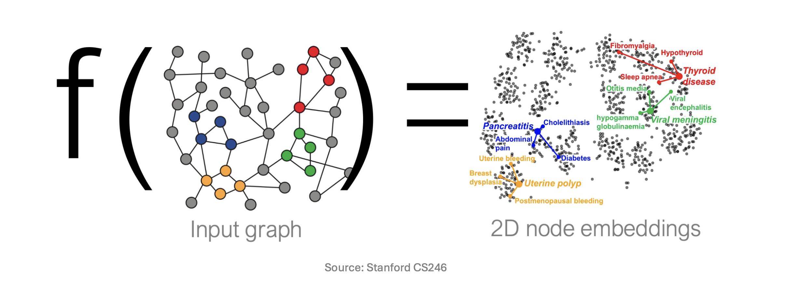
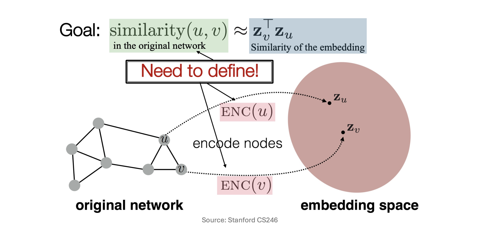
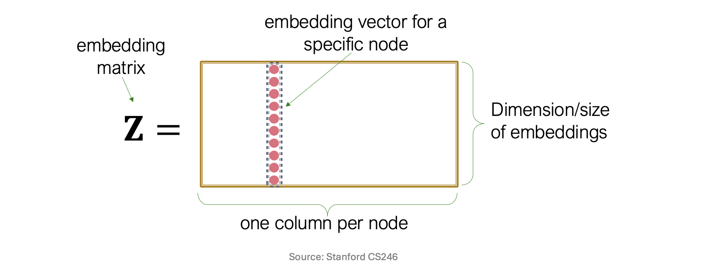
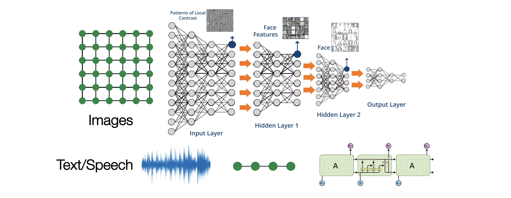
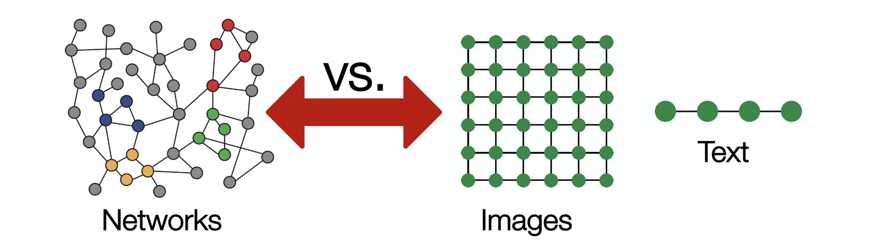

# 들어가며: 그래프 딥러닝의 필요성

* 그래프(Graph)는 노드(Node)와 간선(Edge)을 통해 엔티티 간의 복잡한 상호작용과 관계를 모델링하는 데 특화된 데이터 구조입니다. 과거의 기계학습 기법들은 네트워크의 위상(Topology)이나 노드의 통계적 특성을 사람이 직접 수동으로 추출(Hand-crafted features)하여 사용했습니다. 

* 하지만 **표현 학습(Representation Learning)**의 패러다임이 그래프 데이터에 적용되면서, 그래프의 구조적 정보를 보존하는 임베딩(Embedding)을 신경망이 스스로 학습할 수 있게 되었습니다. 이번 포스트에서는 초기 그래프 임베딩 기법인 '얕은 임베딩(Shallow Embeddings)'의 수학적 구조와 치명적인 한계점들을 짚어보고, 이를 극복하기 위해 등장한 **그래프 신경망(Graph Neural Networks, GNN)** 기반의 깊은 인코더(Deep Graph Encoders) 개념을 논리적 흐름에 따라 상세히 다룹니다.

---

# 1. 그래프 표현 학습 복습 (Recap: Graph Representation Learning)

## 1.1 노드 임베딩의 핵심 목표

* 그래프 표현 학습의 가장 근본적인 목표는 원본 네트워크 상에서 노드들이 가지고 있는 **구조적 특성과 위상적 유사성(Structural properties)**을 보존하면서, 이를 저차원 벡터 공간(Embedding Space)으로 매핑(Mapping)하는 것입니다. 

* 함수 $f$를 통해 원본 그래프를 입력받아 각 노드의 2D 혹은 고차원의 임베딩 벡터를 출력하게 되며, 이 공간 안에서는 비슷한 구조적 역할을 하거나 서로 밀접하게 연결된 노드들이 기하학적으로 가깝게 위치하게 됩니다.

## 1.2 인코더와 유사도 함수 (Encoder & Similarity Function)

* 노드 임베딩을 수학적으로 정립하기 위해, 노드 $u$와 $v$ 간의 관계를 수식화할 필요가 있습니다. 그래프 표현 학습은 다음의 핵심 수식을 만족하는 인코더 함수 $\text{ENC}(\cdot)$를 찾는 최적화 과정입니다.

$$
\text{similarity}(u, v) \approx \mathbf{z}_v^\top \mathbf{z}_u
$$

* **$\text{similarity}(u, v)$**: 원본 네트워크 상에서 두 노드 간의 구조적 유사도를 의미합니다. (예: 두 노드가 직접 연결되어 있는지, 공유하는 이웃 노드가 얼마나 많은지, 무작위 보행(Random Walk) 시 얼마나 자주 함께 방문되는지 등을 측정)
* **$\text{ENC}(u), \text{ENC}(v)$**: 원본 그래프의 노드를 임베딩 공간으로 보내는 인코더 함수입니다.
* **$\mathbf{z}_u, \mathbf{z}_v$**: 인코더를 통과하여 생성된 노드 $u$와 $v$의 $d$차원 잠재 벡터(Latent vector)입니다. 즉, $\mathbf{z}_u = \text{ENC}(u)$ 입니다.
* **$\mathbf{z}_v^\top \mathbf{z}_u$**: 임베딩 공간 상에서 두 벡터의 내적(Dot product)입니다. 벡터 간의 코사인 유사도 혹은 거리에 비례하는 값으로, 임베딩 공간에서의 유사도를 나타냅니다.

---

# 2. 얕은 임베딩의 구조와 한계 (Shallow Embeddings and Limitations)

* DeepWalk, Node2vec, LINE과 같은 1세대 그래프 임베딩 기법들은 매우 직관적이고 단순한 **얕은 임베딩(Shallow Embeddings)** 구조를 채택했습니다. 

## 2.1 얕은 인코더의 수학적 정의

* 얕은 인코더에서 함수 $\text{ENC}(v)$는 단순히 **임베딩 행렬(Embedding Matrix)에서 해당 노드에 대응하는 열(Column)을 조회(Look-up)**하는 방식으로 작동합니다. 전체 노드 집합을 $V$라 하고, 우리가 원하는 임베딩의 차원을 $d$라고 할 때, 임베딩 행렬 $\mathbf{Z}$는 다음과 같이 정의됩니다.

$$
\mathbf{Z} \in \mathbb{R}^{d \times |V|}
$$

* 특정 노드 $v$의 임베딩 벡터 $\mathbf{z}_v$는 임베딩 행렬 $\mathbf{Z}$와 지시 벡터(Indicator vector) $\mathbf{v} \in \{0, 1\}^{|V|}$ 의 행렬 곱으로 산출됩니다. (여기서 지시 벡터 $\mathbf{v}$는 노드 $v$의 인덱스 위치만 1이고 나머지는 0인 원-핫 인코딩 벡터입니다.)

$$
\text{ENC}(v) = \mathbf{z}_v = \mathbf{Z} \mathbf{v}
$$

## 2.2 얕은 인코더의 3가지 치명적 한계

* 이러한 단순 행렬 룩업 방식은 직관적이지만, 실제 대규모/동적 그래프에 적용할 때 다음과 같은 명확한 한계를 지닙니다.

* 1.  **매개변수 효율성 부족 (Limitation 1: $O(|V|d)$ parameters are needed)**
    * **파라미터 비공유(No sharing of parameters)**: 노드들 사이에 가중치를 공유하는 메커니즘이 전혀 없습니다.
    * 모든 노드가 자신만의 고유한 임베딩 벡터(열)를 독립적으로 학습해야 하므로, 그래프의 노드 수 $|V|$가 수백만~수십억 개로 증가하면 학습해야 할 행렬 $\mathbf{Z}$의 크기도 선형적으로 폭발하여 메모리 초과 현상이 발생합니다.

* 2.  **본질적인 변환적 학습의 한계 (Limitation 2: Inherently "transductive")**
    * 행렬 $\mathbf{Z}$의 크기와 구조는 모델이 **훈련되는 시점의 노드 집합**에 완전히 고정됩니다.
    * 학습 시점에 존재하지 않았던 완전히 새로운 노드(Unseen nodes)가 네트워크에 추가될 경우, 이 노드에 대한 임베딩을 즉각적으로 생성해내는 추론(Inductive inference)이 불가능합니다. 새로운 노드를 반영하려면 $\mathbf{Z}$에 새로운 열을 추가하고 전체 모델을 다시 학습해야만 합니다.

* 3.  **노드 특성(Features) 활용 불가 (Limitation 3: Do not incorporate node features)**
    * 현실의 네트워크(예: 소셜 네트워크의 사용자 프로필 텍스트, 분자 구조 내 원자의 화학적 성질 등)에서 각 노드는 매우 풍부한 고유 특성(Features) 데이터를 가집니다.
    * 하지만 얕은 임베딩은 오직 연결 구조(Topology) 정보만을 사용하여 $\mathbf{Z}$ 행렬을 업데이트할 뿐, 노드가 원래 가지고 있는 특성 행렬(Feature Matrix)를 임베딩 생성 과정에 결합할 수 있는 구조적 방법론이 부재합니다.

---

# 3. 깊은 그래프 인코더의 도입 (Deep Graph Encoders)

* 앞서 언급한 얕은 임베딩의 3가지 한계를 근본적으로 해결하기 위해, 입력 그래프의 위상 구조와 노드의 특성을 모두 입력받아 복잡한 함수 근사를 수행하는 **깊은 그래프 인코더(Deep Graph Encoders)**가 제안되었습니다. 이것이 바로 그래프 신경망(GNN)의 뼈대가 됩니다.

## 3.1 새로운 인코더의 수학적 정의

* 이제 그래프 $G=(A, X)$가 주어졌다고 가정해 봅시다.

* **인접 행렬 (Adjacency Matrix) $A$**: $A \in \mathbb{R}^{|V| \times |V|}$ (노드 간의 연결 여부나 가중치를 나타내는 행렬)
* **노드 특성 행렬 (Feature Matrix) $X$**: $X \in \mathbb{R}^{|V| \times d_{in}}$ (노드 자체의 속성값, 예를 들어 유저 프로필이나 이미지 피처 등을 나타냄)

* 우리가 설계할 새로운 깊은 인코더 $f_\theta$는 학습 가능한 파라미터 $\theta$의 집합으로 구성된 신경망이며, 구조 정보 $A$와 특성 정보 $X$를 동시에 고려하여 최종 잠재 표현 행렬 $H$를 만들어냅니다.

$$
H = f_\theta(A, X) \quad \text{where } H \in \mathbb{R}^{|V| \times d}
$$

* 즉, 특정 노드 $v$에 대한 인코딩은 더 이상 단순한 행렬 조회가 아니라, 노드 $v$의 속성값과 주변 이웃들의 구조적 정보를 조합한 다층적인 연산의 결과물이 됩니다.

## 3.2 GNN 파이프라인과 딥러닝 아키텍처

* 깊은 인코더는 여러 층의 **그래프 합성곱 계층(Graph Convolutions Layer)**을 쌓아 올린 형태를 취합니다. 

* **깊은 인코더가 기존 한계를 해결하는 메커니즘**:
  * 1.  **파라미터 공유 및 효율성**: 모든 노드가 고유한 벡터를 가지는 대신, 이웃의 정보를 집계(Aggregation)하고 변환하는 '가중치 행렬 $\theta$'를 공유합니다. 따라서 파라미터 수가 노드 수 $|V|$에 의존하지 않고 특성 차원에만 의존하므로 메모리 효율이 극대화됩니다.
  * 2.  **귀납적 추론(Inductive Capability)**: 학습된 모델 $f_\theta$는 정보를 모으는 '규칙'을 학습한 것입니다. 따라서 새로운 노드가 추가되더라도, 그 노드의 주변 이웃 구조($A$의 일부)와 고유 특성($X$)만 입력하면 즉각적으로 새로운 임베딩을 연산해낼 수 있습니다.
  * 3.  **다양한 정보의 융합**: 식 $f_\theta(A, X)$에서 명시되어 있듯, 노드가 원래 가지는 텍스트/이미지 특성 정보가 그래프 구조 정보와 함께 다층 신경망(Multi-layer Neural Network)을 통해 유기적으로 결합됩니다.

---

# 4. 그래프 데이터 머신러닝의 본질적 어려움

* 딥러닝 기술, 특히 CNN(합성곱 신경망)과 RNN(순환 신경망)은 이미지 처리나 자연어 처리에서 눈부신 성과를 이루었습니다. 이들은 **데이터의 구조가 일정하다는 강력한 귀납적 편향(Inductive Bias)**을 활용합니다.

* 하지만 위 그림과 같은 정형화된 데이터와 달리, 그래프 네트워크(Networks)에 기존의 딥러닝 도구를 그대로 가져다 쓰는 것은 불가능에 가깝습니다.

* **그래프 데이터 모델링이 어려운 근본적 이유 (Why is it Hard?)**:
  * 1.  **임의의 크기와 복잡한 위상 구조 (Arbitrary size and complex topological structure)**:
      * 이미지는 모든 내부 픽셀이 8개의 인접 픽셀을 가지며, 텍스트는 앞뒤로 1개씩의 인접 단어를 가집니다.
      * 반면 그래프의 각 노드는 차수(Degree)가 1개일 수도, 10,000개일 수도 있습니다. 매우 이질적인 연결망 구조를 가지므로 고정된 크기의 필터를 씌울 수 없습니다.
  * 2.  **노드 순서 및 고정된 기준점의 부재 (No fixed node ordering or reference point)**:
      * 이미지는 보통 '좌측 상단 픽셀'이라는 기준점이 있고 텍스트는 '첫 단어'가 있습니다. 그래프 공간에서는 기준점(Reference point)이 존재하지 않으며 위, 아래, 왼쪽, 오른쪽이라는 방향성도 없습니다.
  * 3.  **동형 그래프(Isomorphic Graphs)의 순열 불변성(Permutation Invariance)**:
      * 노드 {1, 2, 3}으로 이루어진 그래프 $G$와, 같은 위상 구조를 가지지만 노드 이름을 {1, 3, 2}로 바꾼 그래프 $G'$는 사실상 완전히 동일한 정보입니다. 
      * 따라서 인접 행렬 $A$의 행과 열 순서가 뒤섞이더라도, 그래프 신경망은 "동일한 그래프"임을 인식하고 출력값을 일관되게 유지해야 하는(Permutation Invariant / Equivariant) 까다로운 수학적 조건을 만족하도록 설계되어야 합니다.

* 결론적으로, 이러한 그래프만의 복잡하고 불규칙적인 위상 특성을 다루기 위해 일반적인 합성곱(Convolution)을 일반화한 **Graph Convolutions** 연산이 필요하게 된 것입니다.
