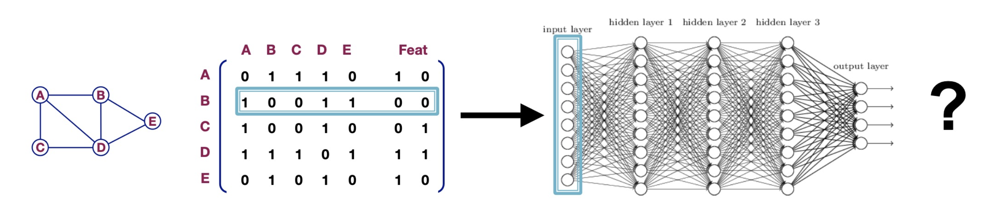
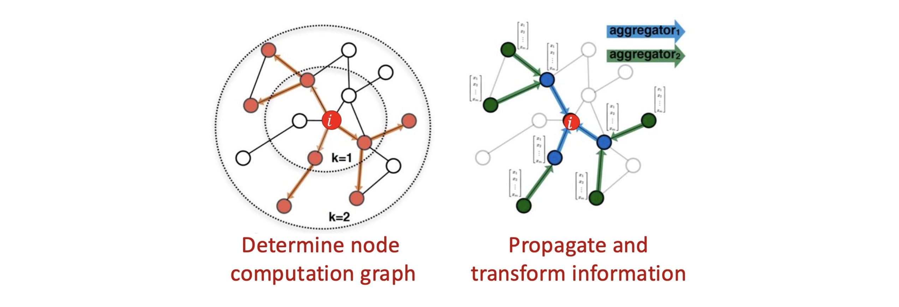
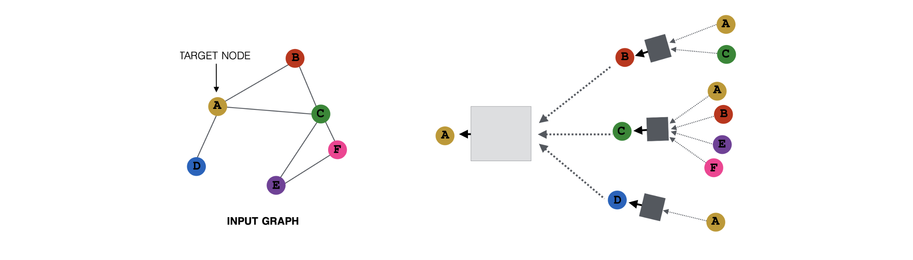
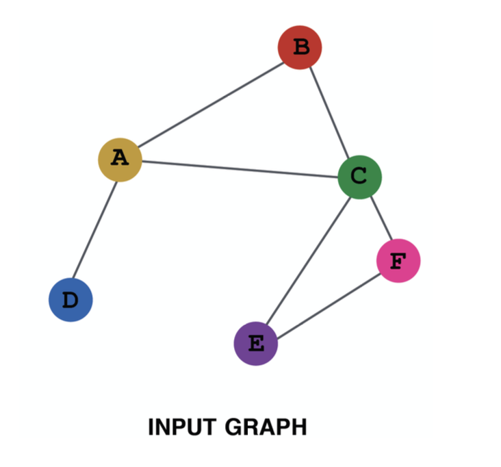
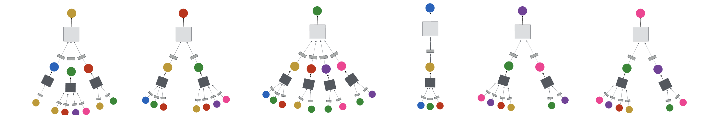
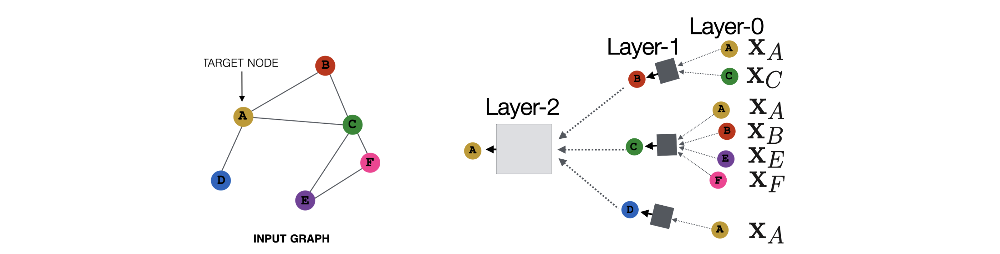
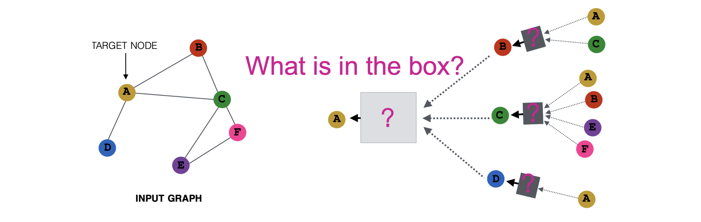

# 들어가며: GNN 계층의 본질

* 이전 포스트에서는 기존의 얕은 임베딩(Shallow Embeddings) 방식이 노드 수에 비례하여 파라미터가 증가하고 새로운 노드에 대응하지 못하는 한계가 있음을 확인했습니다. 이를 해결하기 위해 등장한 **그래프 신경망(Graph Neural Networks, GNN)**은 그래프의 구조와 노드의 특성을 동시에 활용하는 깊은 인코더(Deep Encoder) 모델입니다.

* 이번 포스트에서는 GNN이 도대체 '어떻게' 그래프 데이터를 신경망 구조에 태우는지, 그 내부의 **계층(Layer)** 구조와 수학적 원리를 상세히 파헤쳐 보겠습니다.

---

# 1. 그래프 데이터 처리의 단순한 접근법과 그 한계 (Naïve Approach)

* 그래프 구조($A$)와 노드 특성($X$)이 주어졌을 때, 딥러닝을 적용하기 위해 가장 먼저 떠올릴 수 있는 단순한 방법(Naïve approach)은 두 행렬을 하나로 이어 붙여(Concatenation) 다층 퍼셉트론(MLP)에 입력하는 것입니다.

* 수식으로 표현하면 입력값은 $A || X$ 가 됩니다. 하지만 이 방식은 그래프 데이터의 본질적 특성을 무시하기 때문에 다음과 같은 치명적인 문제점을 낳습니다.

* 1.  **입력 크기의 비유연성 (Different sizes)**: MLP는 입력 차원이 고정되어 있습니다. 그래프에 노드가 새롭게 추가되거나 삭제되어 인접 행렬 $A$의 크기가 변하면, 기존에 학습된 모델을 아예 사용할 수 없습니다.
* 2.  **순열에 대한 취약성 (Different node orders)**: 행렬 $A$의 행과 열의 순서는 사람이 임의로 정한 것에 불과합니다. 동일한 위상 구조를 가지더라도 노드의 나열 순서가 바뀌면 MLP는 이를 전혀 다른 입력으로 인식하여 다른 결과를 출력하게 됩니다. (순열 불변성 부재)

---

# 2. 연산 그래프와 정보 전파 (Computation Graph)

* 앞선 단순한 MLP 접근법의 한계를 극복하기 위한 GNN의 핵심 아이디어는 **"노드의 이웃 구조가 곧 신경망의 연산 그래프(Computation Graph)를 정의한다"**는 것입니다. 

## 2.1 입력 그래프와 트리 구조로 펼쳐지는 연산 그래프

* GNN이 동작하는 방식을 구체적으로 이해하기 위해, 다음과 같은 간단한 장난감 그래프(Toy Graph)를 가정해 봅시다.

* 각 노드는 주변 이웃들로부터 정보를 받아 자신의 상태를 업데이트합니다. 타겟 노드 A를 중심으로 정보를 끌어오는 과정을 역추적해 보면, 타겟 노드를 루트(Root)로 하는 **트리 형태의 연산 그래프**가 만들어집니다.

* 레이어 $l$에서의 노드 $A$의 은닉 상태(Hidden representation)를 $h_A^{(l)}$라고 합시다.
* $h_A^{(l)}$는 이전 레이어 $l-1$에 있는 자신의 상태 $h_A^{(l-1)}$와 이웃 노드들의 상태 $h_B^{(l-1)}, h_C^{(l-1)}, h_D^{(l-1)}$를 바탕으로 계산됩니다.

## 2.2 독립적이고 병렬적인 그래프 정의

* 중요한 점은, 이러한 연산 그래프가 전체를 아우르는 단 하나의 거대한 수식이 아니라, **모든 노드에 대해 각자의 이웃 구조를 바탕으로 병렬적으로(in parallel) 정의**된다는 것입니다.

## 2.3 깊은 그래프 신경망 (Deep GNNs)

* GNN은 이러한 정보 집계 계층을 여러 겹 쌓아 임의의 깊이(Arbitrary depth)를 가질 수 있습니다. 계층(Layer)의 개념을 연산 그래프 위에 매핑해 보면 정보의 흐름이 더욱 명확해집니다.

* **Layer-0 (초기 상태)**: 0번째 계층에서 노드 $u$의 임베딩 $h_u^{(0)}$는 그래프 구조의 반영 없이 노드 자신이 원래 가지고 있던 특성 벡터 $x_u$로 초기화됩니다.
* **Layer-k (k-hop 정보의 통합)**: $k$번째 계층의 임베딩은 네트워크 상에서 반경 $k$-hop 이내에 있는 모든 이웃들의 정보를 집계한 결과입니다. 계층이 깊어질수록 노드는 더 넓은 전역적(Global) 문맥을 이해하게 됩니다.

---

# 3. 이웃 집계 함수 (Aggregation Function)

* 연산 그래프에서 여러 자식 노드(이웃)들의 상태를 모아 부모 노드로 전달해 주는 회색 박스가 바로 **이웃 집계 함수(Neighborhood Aggregation)**입니다.

* 이 함수는 여러 개의 노드 표현(Representations) 집합을 입력으로 받아, 하나의 새로운 표현 벡터로 매핑합니다. 노드마다 이웃의 개수(차수, Degree)가 천차만별이므로, 집계 함수는 입력의 개수에 유연하게 대응하면서 입력 순서와 무관한(Permutation Invariant) 연산(예: 합계, 평균, 최댓값 풀링 등)으로 구성되어야 합니다.

---

# 4. GNN의 기본 계층 수식 (Basic Approach: Layer Update)

* 그렇다면 구체적으로 이 집계 함수와 계층 업데이트는 어떻게 수식으로 정의될까요? 가장 직관적이고 기본적인 형태의 GNN 레이어는 **'메시지를 변환(Transform)한 뒤 평균(Average)을 내는'** 방식입니다.

## 4.1 상태 업데이트 수식
* $L$개의 계층으로 이루어진 GNN을 가정할 때, 각 노드 $v$의 상태 업데이트 수식은 다음과 같습니다.
  * 1.  **초기화 (Layer 0)**: $h_v^{(0)} = x_v$
  * 2.  **레이어 업데이트 (Layer $l \rightarrow l+1$)**:
      $$h_v^{(l+1)} = \sigma \left( \sum_{u \in N(v)} \frac{W^{(l)} h_u^{(l)}}{|N(v)|} + B^{(l)} h_v^{(l)} \right)$$
  * 3.  **최종 임베딩 반환**: $z_v = h_v^{(L)}$

## 4.2 수식의 3단계 해부
* 위 수식은 딥러닝 관점에서 다음과 같은 3가지 명확한 단계로 분해됩니다.

* **Step 1. 변환 (Transform)**
    * $W^{(l)} h_u^{(l)}$ : 이웃 노드 $u$가 보내는 메시지를 가중치 행렬 $W^{(l)}$에 곱하여 의미 있는 잠재 공간으로 투영합니다.
    * $B^{(l)} h_v^{(l)}$ : 다음 계층의 업데이트를 위해, 자기 자신의 이전 상태 $h_v^{(l)}$ 역시 별도의 가중치 $B^{(l)}$에 곱해 변환합니다.
* **Step 2. 집계 (Aggregate)**
    * $\sum_{u \in N(v)} \frac{(\cdot)}{|N(v)|}$ : 이웃 $N(v)$들로부터 온 메시지들을 모두 합친 뒤 이웃의 개수 $|N(v)|$로 나누어 **평균(Average)**을 취합니다. 허브(Hub) 노드처럼 연결이 비정상적으로 많은 노드의 값이 폭발하는 것을 방지하는 정규화 과정입니다.
* **Step 3. 비선형 활성화 (Nonlinearity)**
    * $\sigma(\cdot)$ : 계산된 선형 결합 결과에 ReLU 연산과 같은 비선형 함수를 적용합니다. 이를 통해 다층 네트워크가 복잡한 표현력을 획득하게 됩니다.

---

# 5. 행렬 연산 기반의 수식화 (Matrix Formulation)

* 위 수식은 특정 노드 $v$ 하나에 초점을 맞춘 것입니다. 하지만 실제 구현 시 수많은 노드를 순회 반복(For-loop)하는 것은 매우 비효율적입니다. 따라서 전체 그래프에 대한 연산을 한 번의 텐서 연산으로 처리하는 **행렬 공식(Matrix Formulation)**이 필수적입니다.

## 5.1 전체 노드 업데이트 행렬 수식
* 전체 노드의 $l$번째 은닉 상태를 행으로 차곡차곡 쌓은 행렬을 $H^{(l)} \in \mathbb{R}^{|V| \times d_l}$ 이라고 합시다. 기본 GNN 레이어는 다음과 같이 우아한 행렬식으로 표현됩니다.

$$
H^{(l+1)} = \sigma \left( D^{-1} A H^{(l)} W^{(l)} + H^{(l)} B^{(l)} \right)
$$

* $A \in \mathbb{R}^{|V| \times |V|}$ : 인접 행렬
* $D \in \mathbb{R}^{|V| \times |V|}$ : 대각선 성분에 각 노드의 차수(이웃 수)를 기록한 대각 행렬 ($d_{ii} = \sum_k a_{ik}$)
* $W^{(l)}, B^{(l)} \in \mathbb{R}^{d_l \times d_{l+1}}$ : 해당 레이어에서 학습되는 가중치 행렬

## 5.2 행렬 곱의 의미 해석
* **$A H^{(l)}$** : 인접 행렬과 노드 상태를 곱하면, 자연스럽게 각 노드 행에 연결된 이웃들의 상태 벡터 합산(Sum) 결과가 맺히게 됩니다.
* **$D^{-1} (A H^{(l)})$** : 역행렬 $D^{-1}$을 곱하는 것은 각 행을 해당 노드의 차수로 나누어주는 것과 완벽히 일치합니다. 즉, 단순 합산을 **평균(Average)**으로 정규화하는 수학적 트릭입니다.

## 5.3 기존 MLP 수식과의 비교
* 일반적인 MLP의 업데이트 수식은 $H^{(l+1)} = \sigma \left( H^{(l)} W^{(l)} \right)$ 입니다.
* 이를 GNN 식과 비교하기 위해 자기 자신 변환 행렬 $B$와 이웃 변환 행렬 $W$를 단순화하여 하나로 묶어본다면, GNN은 다음과 같이 요약할 수 있습니다.

$$H^{(l+1)} \approx \sigma \left( \hat{A} H^{(l)} W^{(l)} \right) \quad (\text{단, } \hat{A} = D^{-1}A)$$

* 결과적으로 **GNN은 기존 MLP 연산(특성 변환 $H W$) 앞에 정규화된 인접 행렬 $\hat{A}$를 곱해주는 구조적 혼합(Structural mixing) 과정을 하나 더 얹은 것**으로 볼 수 있습니다. 즉, GNN은 완전히 새로운 이질적인 구조가 아니라 딥러닝 패러다임을 비유클리드 그래프 공간으로 자연스럽게 확장(Natural extension)한 것입니다.

---

# 6. 파라미터 개수 비교 및 학습 (Parameters & Training)

## 6.1 막대한 파라미터 절감 효과
* DeepWalk와 같은 얕은 인코더(Shallow Encoder)는 각 노드마다 별개의 임베딩 룩업 벡터를 생성하므로 파라미터 수가 노드 수에 비례하는 $\mathcal{O}(|V|d)$ 이었습니다. 그래프가 커지면 학습이 불가능했습니다.

* 하지만 GNN의 파라미터 행렬 $W$와 $B$는 노드의 식별자나 개수($|V|$)에 의존하지 않고 오직 특성 벡터의 차원($d$)에만 의존합니다. 은닉층 차원이 $d$, 초기 입력 차원이 $d_{in}$일 때 $L$층 GNN의 파라미터 수는 대략 다음과 같습니다.

$$\text{Number of parameters: } \mathcal{O}(L d^2 + d \cdot d_{in})$$

* 노드들이 가중치를 완벽하게 공유(Weight sharing)하므로 거대한 네트워크도 학습 가능하며, 학습 시 보지 못했던 새로운 서브그래프나 노드가 추가되어도 즉시 임베딩을 계산할 수 있는 귀납적 추론(Inductive learning)이 가능합니다.

## 6.2 GNN의 손실 함수와 학습
* **비지도 학습 (Unsupervised Learning)**
    * 레이블 없이 오직 그래프 구조만으로 임베딩을 학습할 때 사용합니다. 임베딩 벡터 간 유사도를 이용해 원본 그래프의 주변 문맥을 잘 복원하도록 모델 파라미터 $\theta$를 최적화합니다.
    $$\theta^* = \arg\min_\theta \sum_v - \log P(N(v) | z_v)$$
* **지도 학습 (Supervised Learning)**
    * 노드 분류, 링크 예측 등의 명확한 태스크 라벨 $y$가 주어졌을 때는, 최종 출력된 임베딩 기반의 예측값 $f(z_v)$과 실제 라벨 간의 오차(Cross-Entropy 등) $\mathcal{L}$을 최소화하는 방향으로 엔드투엔드(End-to-End) 학습을 진행합니다.
    $$\theta^* = \arg\min_\theta \sum_v \mathcal{L}(y, f(z_v))$$
