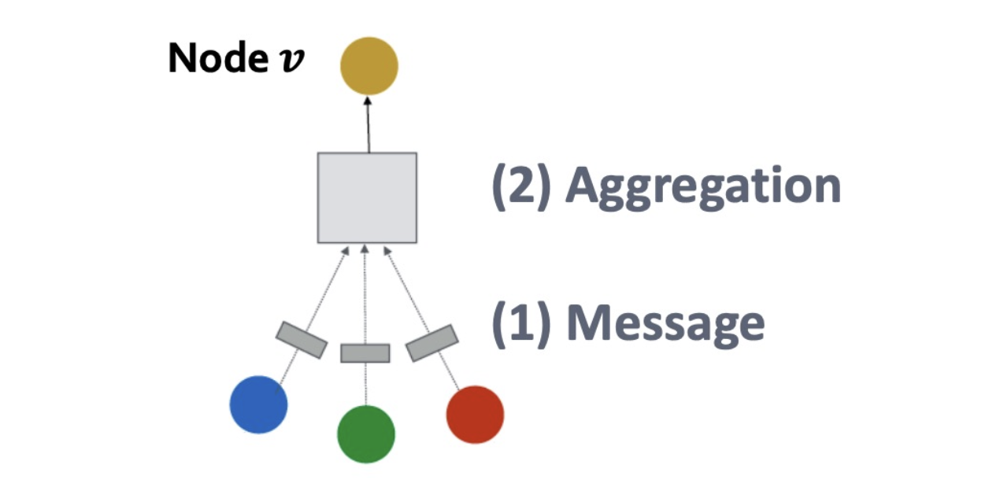
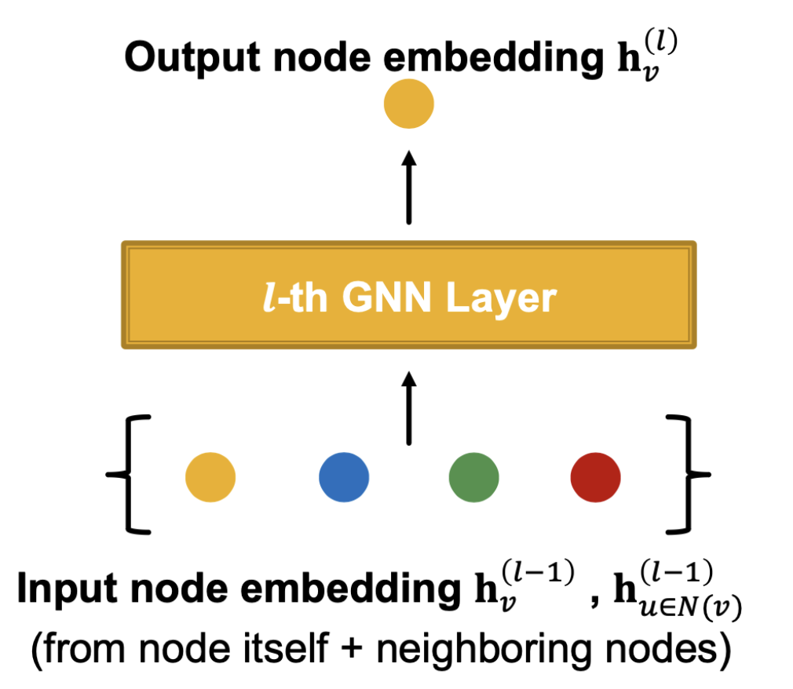
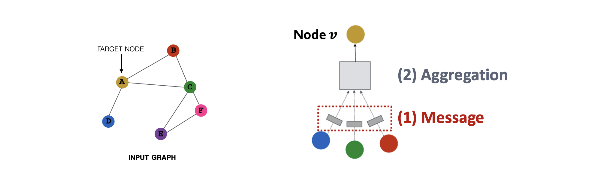
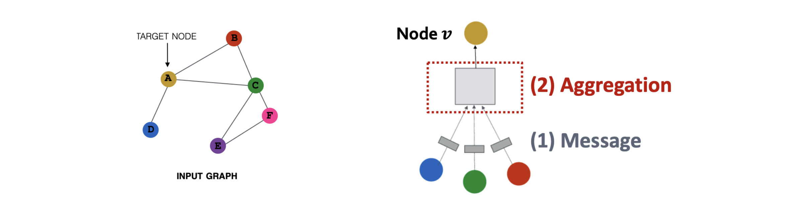

# 들어가며: GNN 계층의 모듈화

* 지난 포스트에서는 그래프 신경망(GNN)이 노드의 이웃 구조를 연산 그래프(Computation Graph)로 변환하여 정보를 집계하는 기본 원리를 살펴보았습니다. 

* 현대적인 GNN은 단순한 하나의 수식으로 정의되기보다는, **메시지(Message), 집계(Aggregation), 업데이트(Update)**라는 3단계의 독립적인 모듈로 구성된 **메시지 패싱 프레임워크(Message Passing Framework)**를 따릅니다. 이 세 가지 컴포넌트를 어떻게 설계하느냐에 따라 우리가 흔히 아는 GCN, GraphSAGE, GAT 등 수많은 GNN 변형(Variants)들이 탄생하게 됩니다. 

* 이번 포스트에서는 GNN 계층의 일반적인 프레임워크를 수학적으로 정립하고, 제공된 6장의 상세 도식을 통해 대표적인 아키텍처인 GraphSAGE와 GCN의 내부 동작 원리를 깊이 있게 분석해 보겠습니다.

---

# 1. GNN 계층의 기본 개념과 수용 영역 (Receptive Field)

* GNN에서 하나의 계층(Layer)은 모델을 구성하는 핵심 조립 블록(Core building block)입니다. 

* **표현력의 결정 (Expressiveness)**: 위 도식처럼 계층을 몇 개나 쌓을 것인지(Number of layers)가 GNN 모델이 그래프의 위상을 얼마나 깊이 이해할 수 있는지를 결정합니다.
* **$L$-hop 이웃 (L-hop neighborhood)**: $L$개의 계층을 쌓은 GNN($L$-layer GNN)은 각 노드에 대해 최대 거리 $L$만큼 떨어진 이웃들의 정보까지 모두 탐색하여 임베딩에 반영하게 됩니다.

---

# 2. 메시지 패싱 프레임워크의 3단계 컴포넌트

* 단일 GNN 계층은 본질적으로 **'벡터들의 집합'을 입력받아 '단일 벡터'로 변환하는 함수(Function from a set of vectors into a single vector)**입니다.

* 위와 같은 블랙박스 계층의 내부를 들여다보면, 아래 그림처럼 메시지 생성과 집계라는 명확한 컴포넌트들로 세분화됩니다.

* 임의의 노드 $v$를 타겟으로 할 때, GNN의 $l$번째 계층은 다음의 3단계 과정을 거쳐 상태를 업데이트합니다.

## 2.1 1단계: 메시지 계산 (Message Computation)

* 가장 먼저, 이웃 노드들이 타겟 노드에게 전달할 **'메시지(Message)'**를 생성해야 합니다.

$$
m_u^{(l)} = \text{MSG}^{(l)}\left(h_u^{(l-1)}\right)
$$

* **직관 (Intuition)**: 각 이웃 노드 $u$는 자신의 이전 계층 상태 $h_u^{(l-1)}$를 바탕으로 다른 노드들에게 보낼 정보 덩어리($m_u^{(l)}$)를 만듭니다.
* **예시 (Example)**: 가장 흔하게 사용되는 $\text{MSG}$ 함수는 가중치 행렬 $W^{(l)}$을 곱하는 단순 선형 변환(Linear layer)입니다. ($m_u^{(l)} = W^{(l)} h_u^{(l-1)}$)

## 2.2 2단계: 집계 (Aggregation)

* 이웃 노드들이 생성한 다수의 메시지들을 타겟 노드 $v$ 입장에서 **'하나로 결합'**하는 과정입니다.

$$
\hat{h}_v^{(l)} = \text{AGG}^{(l)}\left( \left\{ m_u^{(l)} \mid u \in N(v) \right\} \right)
$$

* **직관 (Intuition)**: 타겟 노드 $v$의 이웃 집합 $N(v)$에 속한 모든 노드들로부터 온 메시지들을 병합하여 임시 벡터 $\hat{h}_v^{(l)}$를 만듭니다.
* **필수 조건 (Permutation Invariance)**: 노드들이 메시지를 보내는 '순서'는 존재하지 않으므로, 집계 함수 $\text{AGG}$는 입력 순서가 바뀌어도 결과가 완벽히 동일한 **순열 불변 함수**여야 합니다. (예: 원소별 합 $\text{sum}(\cdot)$, 평균 $\text{mean}(\cdot)$, 최댓값 $\text{max}(\cdot)$ 등)

## 2.3 3단계: 자가 연결 및 업데이트 (Self-Connection & Update)

* 이웃의 정보를 모두 모았으니, 이제 **'자기 자신의 기존 정보'**와 결합하여 최종적으로 상태를 업데이트해야 합니다.

$$
h_v^{(l)} = \text{UPDATE}^{(l)}\left( \hat{h}_v^{(l)}, h_v^{(l-1)} \right)
$$

* **직관 (Intuition)**: 이웃으로부터 얻은 새로운 정보 $\hat{h}_v^{(l)}$에 타겟 노드 $v$ 본연의 이전 상태 $h_v^{(l-1)}$(Self-connection)를 더하여 융합합니다. 
* 보통 이 단계에서 ReLU와 같은 **비선형 활성화 함수(Activation function)**가 적용되어 신경망의 비선형적 표현력을 극대화합니다.

* 이러한 **$\text{MSG} \rightarrow \text{AGG} \rightarrow \text{UPDATE}$** 의 일반 프레임워크 안에서 각 함수를 어떻게 선택하느냐에 따라 다양한 GNN 모델이 파생됩니다.

---

# 3. 대표적 아키텍처 1: GraphSAGE

* **GraphSAGE (Graph Sample and AggreGatE)**는 대규모 그래프 모델링을 위해 널리 쓰이는 아키텍처입니다. GraphSAGE의 계층 업데이트 수식은 다음과 같습니다.

$$
h_v^{(l)} = \sigma \left( W^{(l)} \cdot \text{CONCAT} \left( h_v^{(l-1)}, \text{AGG}\left( \left\{ h_u^{(l-1)} \mid u \in N(v) \right\} \right) \right) \right)
$$

* **GraphSAGE 설계의 3가지 핵심:**
  * 1. **덧셈 대신 연결(CONCAT)**: 이전 상태 $h_v^{(l-1)}$와 이웃 집계 정보 $\text{AGG}(\cdot)$를 단순 합산하지 않고 가로로 이어 붙입니다(Concatenation).
  * 2. **독립적인 가중치 부여**: $\text{CONCAT}$ 연산 직후 가중치 행렬 $W^{(l)}$을 곱하면, 행렬의 앞부분은 내 정보 전용 가중치로, 뒷부분은 이웃 정보 전용 가중치로 작용하여 정보를 더 정교하게 분리해 학습할 수 있습니다.
  * 3. **유연한 AGG 함수**: 구조상 집계 함수 $\text{AGG}$의 제약이 적어, 실험 목적에 따라 $\text{sum}(\cdot), \text{mean}(\cdot)$ 외에도 LSTM이나 Max-Pooling 등을 자유롭게 갈아 끼워 성능을 튜닝할 수 있습니다.

---

# 4. 대표적 아키텍처 2: GCN (Graph Convolutional Network)

* 가장 널리 쓰이는 표준적 모델인 **GCN(Graph Convolutional Network)**은 수식은 단순해 보이지만 깊은 네트워크 과학적 직관을 담고 있습니다.
$$
h_v^{(l)} = \sigma \left( \sum_{u \in N(v) \cup \{v\}} \frac{W^{(l)} h_u^{(l-1)}}{\sqrt{d_v + 1} \sqrt{d_u + 1}} \right)
$$
  * *여기서 $d_v$는 노드 $v$의 차수(이웃 수)를 의미합니다.*

## 4.1 GCN 수식의 구조적 특징
* **Self-connection의 융합**: 합산 기호 아래의 $N(v) \cup \{v\}$ 조건에서 보듯, 타겟 노드 자기 자신($v$)을 아예 이웃 집합의 일부로 취급(Self-loop)합니다. 따라서 업데이트(UPDATE) 단계가 집계(AGG) 단계와 하나로 통합되어 있습니다.

## 4.2 가장 중요한 차이: 대칭 정규화 (Symmetric Normalization)

* 단순 평균을 쓴다면 $\frac{1}{d_v + 1}$ 이면 충분할 텐데, 왜 GCN은 굳이 분모에 **$\sqrt{d_v + 1} \sqrt{d_u + 1}$** 이라는 **대칭 정규화(Symmetric Normalization)** 텀을 도입했을까요?

* 1. **타겟 노드의 차수 조절 ($\frac{1}{\sqrt{d_v + 1}}$)**:
   * 인맥이 지나치게 넓은 타겟 노드(Hub node)가 수많은 이웃으로부터 정보를 받을 때 값이 무한정 커지는 것을 방지(스케일 다운)합니다.
* 2. **소스 노드의 차수 조절 ($\frac{1}{\sqrt{d_u + 1}}$)**: *(GCN의 핵심 직관)*
   * 메시지를 **보내는 이웃(Source node $u$)의 차수도 함께 패널티로 적용**합니다. 만약 이웃 $u$가 수만 명과 연결된 인플루언서라면, 그 노드가 나에게 주는 메시지의 정보량(고유성)은 매우 떨어질 것입니다.
   * 반대로 나하고만 연결된 희귀한 이웃의 정보는 매우 귀중합니다. 즉, **"발이 넒은 이웃이 보내는 정보는 가중치를 낮추고, 좁은 관계를 가진 이웃의 정보는 높은 가중치로 받아들인다"**는 철학이 $\sqrt{d_u + 1}$에 담겨 있는 것입니다.