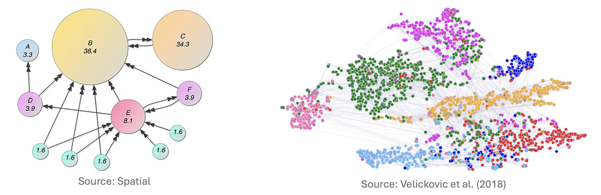
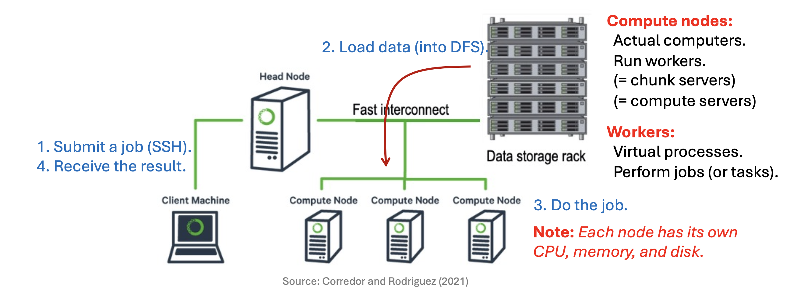

# 1. Introduction: The Need for Distributed Computing

* 현대 데이터 마이닝과 머신러닝에서 다루는 데이터의 규모는 단일 머신(Single Machine)의 처리 능력을 넘어선 지 오래입니다. 우리가 다루는 문제는 더 이상 단순한 스프레드시트 수준이 아니며, 거대한 그래프와 행렬 연산을 포함합니다.

* 강의에서는 대규모 연산이 필요한 대표적인 두 가지 예시를 제시합니다.

## 1.1. Web Ranking (PageRank)
* 웹 페이지의 중요도를 산정하는 **PageRank** 알고리즘은 웹을 거대한 그래프로, 링크를 행렬로 표현합니다.
  * **규모:** 수십억(Billions) 개의 웹 페이지(차원).
  * **연산:** $M \times v$ 형태의 **반복적인 행렬-벡터 곱(Iterated matrix-vector multiplication)** 수행.
* 단일 메모리에 적재조차 불가능한 희소 행렬(Sparse Matrix)을 반복적으로 연산해야 합니다.

## 1.2. Social Network Analysis
* 소셜 네트워크에서 친구를 추천하거나 특정 패턴을 탐색하는 문제 역시 거대한 그래프를 다룹니다.
  * **규모:** 수억(Hundreds of millions) 명의 노드(사용자)와 수십억 개의 엣지(친구 관계).
  * **복잡성:** 단순 저장이 아니라 그래프 상에서의 탐색과 연산이 필요합니다.

* 결국, 슈퍼컴퓨터(Supercomputer) 한 대의 성능을 높이는 것(Scale-up)은 비용과 물리적 한계에 부딪히게 됩니다. 따라서 우리는 **저렴한 일반 하드웨어(Commodity Hardware)를 수천, 수만 대 연결하여(Scale-out)** 이 문제를 해결해야 합니다. 이것이 분산 컴퓨팅(Distributed Computing)의 시작입니다.

---

# 2. Physical Architecture of Large-Scale Computing

* 대규모 연산을 위한 물리적 인프라는 어떻게 구성될까요? 핵심은 "고가의 장비"가 아닌 "다수의 저렴한 장비"를 묶는 것입니다.

## 2.1. Node, Rack, and Switch
* 일반적인 데이터 센터의 계층 구조는 다음과 같습니다.
  * 1.  **Compute Node**: CPU, 메모리, 디스크를 가진 개별 서버입니다. (일반적인 데스크탑 수준의 사양일 수 있음)
  * 2.  **Rack**: 여러 개의 노드(보통 8~64개)를 물리적으로 묶은 단위입니다. 같은 랙에 있는 노드들은 **Gigabit Ethernet**으로 연결되어 있어 통신 속도가 비교적 빠릅니다.
  * 3.  **Switch**: 랙과 랙 사이를 연결하는 네트워크 장비입니다. 랙 간 통신(Inter-rack communication)은 랙 내부 통신(Intra-rack communication)보다 대역폭(Bandwidth) 제약이 더 큽니다.

---

# 3. The Challenge: Machine Failures

* 수천 대의 머신을 사용하면 필연적으로 **"장애(Failure)"** 문제가 발생합니다. 분산 시스템 설계에서 장애는 예외적인 상황이 아니라 **일상적인(Norm)** 상황으로 간주해야 합니다.

## 3.1. Statistical View on Failures
* 서버의 신뢰성을 확률적으로 접근해 봅시다.
  * 가정: 서버 한 대의 평균 수명(Mean Time To Failure)은 약 3년이라고 가정합니다.
      $$3 \text{ years} \approx 1,000 \text{ days}$$
  * 이는 하루에 서버가 고장 날 확률이 약 $1/1000$임을 의미합니다.

* 만약 우리가 **1,000대의 서버**를 운영한다면?
$$\text{Expected Failures per Day} = 1,000 \text{ servers} \times \frac{1}{1000} = 1$$
* 즉, 매일 1대의 서버가 고장 납니다.

* 만약 **100만 대(1M)의 서버**를 운영한다면?
$$\text{Expected Failures per Day} = 1,000,000 \times \frac{1}{1000} = 1,000$$
* **매일 1,000대의 머신이 고장** 나는 상황이 벌어집니다.

## 3.2. Types of Failures
* 장애의 유형은 크게 두 가지로 나뉩니다.
  * 1.  **Single Node Failure**: 디스크 고장, 메인보드 불량 등 개별 서버의 문제.
  * 2.  **Rack Failure**: 랙 전체의 전원 공급 장치나 랙 스위치(Switch) 고장으로 인해, 해당 랙에 속한 수십 대의 노드가 동시에 오프라인 되는 경우.

* **핵심 질문:** 노드가 수시로 죽고 랙 통신이 끊기는 상황에서, 데이터를 어떻게 **영구적으로(Persistently)** 저장하고 유실을 막을 것인가?

---

# 4. Storage Infrastructure: Distributed File System (DFS)

* 위의 장애 문제를 해결하고 대용량 데이터를 처리하기 위해 등장한 것이 **분산 파일 시스템(Distributed File System, DFS)**입니다. 대표적으로 Google File System (GFS)와 이를 오픈소스로 구현한 **Hadoop Distributed File System (HDFS)**가 있습니다.

## 4.1. Usage Patterns
* DFS는 일반적인 PC의 파일 시스템과는 다른 사용 패턴을 가정합니다.
  * **Huge Files**: 수백 GB에서 TB 단위의 거대한 파일들을 다룹니다.
  * **Access Pattern**: 데이터는 주로 **읽기(Reads)**와 **추가(Appends)**가 빈번하며, 기존 내용을 수정(Update in place)하는 경우는 드뭅니다.

## 4.2. Architecture: Chunks and Replication
* DFS는 데이터를 안정적으로 저장하기 위해 파일을 잘게 쪼개고 복제합니다.
  * 1.  **Chunk Nodes (Data Nodes)**
      * 거대한 파일을 **Chunk**라는 단위(일반적으로 16MB ~ 64MB)로 분할하여 저장합니다.
      * **Replication (복제):** 각 청크는 서버 고장에 대비해 보통 **3번 복제(3x Replication)**됩니다.
      * **Placement Strategy:** 만약 랙 하나가 통째로 고장 나더라도 데이터가 살아남을 수 있도록, 복제본들은 **서로 다른 랙(Different Racks)**에 위치하도록 배치합니다.
  * 2.  **Master Node (Name Node)**
      * 파일 시스템 전체를 관리하는 관리자 역할을 합니다.
      * **Metadata 저장:** 실제 데이터가 아닌, "어떤 파일의 몇 번째 청크가 어떤 노드에 저장되어 있는지"에 대한 위치 정보(메타데이터)를 관리합니다.
      * **Single Point of Failure:** 마스터 노드가 죽으면 파일 시스템 전체가 마비되므로, 별도의 백업(Secondary Master)을 두어 장애 발생 시 즉시 대체할 수 있게 합니다.

---

# 5. Distributed Computation Paradigm

* 데이터를 분산 저장(DFS)했다면, 이제 그 데이터를 가지고 연산을 수행해야 합니다.

## 5.1. The Bottleneck: Network
* 전통적인 방식처럼 데이터를 연산 장치로 가져오는 것은 불가능합니다. 수 페타바이트(PB)의 데이터를 네트워크를 통해 이동시키는 것은 시간이 너무 오래 걸리기 때문입니다.

## 5.2. Solution: "Bring Computation to Data"
* MapReduce와 같은 프레임워크의 핵심 아이디어는 발상의 전환입니다.
> **"데이터를 이동시키지 말고, 코드를 데이터가 있는 곳으로 이동시키자."**

* **Locality (지역성):** 데이터가 저장된 **Chunk Server**가 곧 **Compute Server** 역할을 수행합니다.
* 각 노드는 자신이 로컬 디스크에 가지고 있는 데이터 청크(Chunk)에 대해 연산을 수행합니다.
* 연산 결과(중간 산출물)는 원본 데이터보다 훨씬 작으므로, 결과를 취합할 때 발생하는 네트워크 비용은 감당할 수 있습니다.

---

# 6. Computing Cluster Workflow

* 실제 클러스터 환경에서 작업(Job)이 처리되는 과정은 다음과 같습니다.

* 1.  **Load Data**: 먼저 대용량 데이터를 DFS에 적재합니다. 데이터는 여러 노드에 청크 단위로 분산 저장됩니다.
* 2.  **Submit Job**: 사용자가 클라이언트 머신(Client Machine)에서 SSH 등을 통해 **Head Node**에 작업을 제출합니다.
* 3.  **Assign Tasks**: Head Node는 메타데이터를 확인하여, 데이터가 저장된 위치를 파악하고 해당 노드들에게 작업(Task)을 할당합니다.
* 4.  **Do the Job (Workers)**:
    * **Compute Nodes**는 실제 컴퓨터(하드웨어)를 의미하고, 그 위에서 실행되는 가상 프로세스를 **Workers**라고 부릅니다.
    * 각 Worker는 자신의 CPU, 메모리, 디스크를 사용하여 할당받은 데이터 청크를 처리합니다.
* 5.  **Receive Result**: 각 노드의 처리 결과가 취합되어 최종 결과로 반환됩니다.