# 1. 시계열 예측 (Time Series Forecasting)

## 시계열이란 무엇인가?

**시계열(time series)**은 시간 순서를 가진 순차적 데이터(sequential data)를 폭넓게 지칭합니다. 다음 조건 중 어떤 것에 해당하더라도 시계열로 볼 수 있습니다.

- **고정/가변 길이**: 길이가 고정되어 있어도, 가변적이어도 모두 시계열
- **명시적 타임스탬프 유무**: 시간 정보가 명시되지 않은 순서 데이터도 포함
- **단변량/다변량**: 단일 변수(주가)부터 다수의 변수(센서 데이터 묶음)까지
- **등간격/비등간격 관측**: 관측 간격이 일정하지 않아도 시계열

즉, 순서 정보가 의미를 갖는 데이터라면 모두 시계열의 범주에 들어옵니다. 주식 가격, 기상 데이터, 전력 소비량, ECG(심전도), 웹 트래픽 로그 등이 대표적인 예입니다.

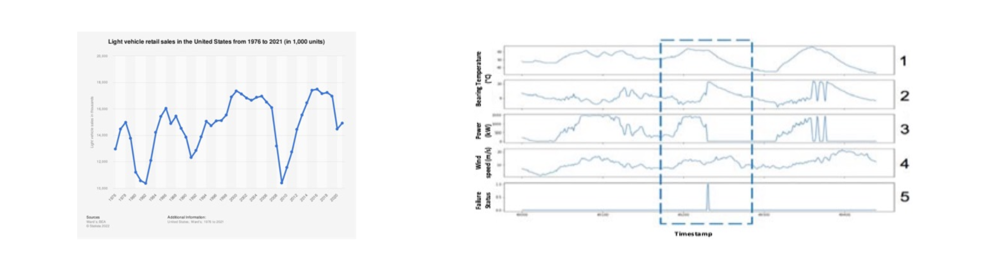

---

## 시계열 분석의 문제 유형

**시계열 분석(time series analysis)**은 크게 **시계열 수준(series-level)** 문제와 **타임스탬프 수준(timestamp-level)** 문제로 나뉩니다.

### 시계열 수준 문제 (Series-level Problems)

전체 시계열을 하나의 단위로 보고 레이블을 예측하거나 구조를 파악합니다.

1. **시계열 분류 (Time Series Classification)**: 전체 시계열을 보고 하나의 레이블을 출력합니다.
   - 예: ECG 데이터 → "정상/비정상" 판별

2. **시계열 이상 탐지 (Time Series Anomaly Detection)**: 시계열 전체에서 이상(anomaly)이 발생했는지를 감지합니다.
   - 예: ECG 데이터 → "특정 구간에 문제가 있는가?"

3. **시계열 클러스터링 (Time Series Clustering)**: 여러 시계열을 유사도 기준으로 군집화합니다.
   - 예: ECG 데이터 → 유사한 패턴을 가진 환자 그룹 식별

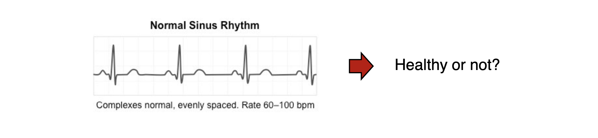

### 타임스탬프 수준 문제 (Timestamp-level Problems)

각 시점(timestep)별로 레이블이나 예측값을 산출합니다.

- **시계열 예측 (Time Series Forecasting)**: 과거 관측값을 바탕으로 미래 시점의 값을 예측합니다.
  - 예: 주가 시계열 → 향후 N일간의 가격 예측
- **이상 이벤트 탐지 (Abnormal Event Detection)**: 각 시점이 이상한지를 판별합니다.
  - 예: 주가 시계열 → 의심스러운 매매 시점 탐지

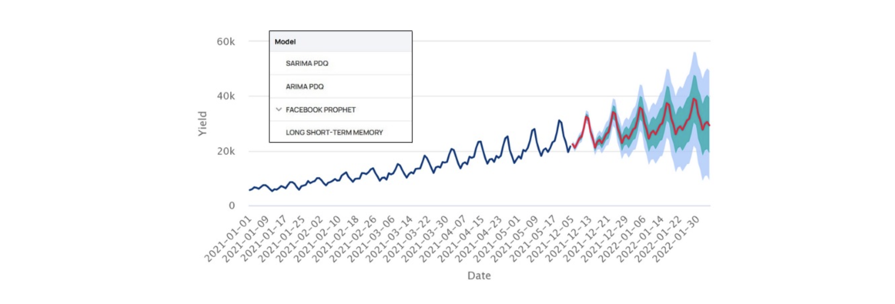

---

## 왜 시계열 예측인가?

이 강의에서는 **시계열 예측(time series forecasting)**에 집중합니다. 그 이유는 다음과 같습니다.

- **실용적 응용이 매우 넓습니다.** 수요 예측, 재고 관리, 에너지 계획, 금융, 기상 예보 등 거의 모든 산업 분야에서 예측이 필요합니다.
- **시계열의 본질적 특성에 대한 깊은 이해를 요구합니다.** 트렌드, 계절성, 노이즈, 자기상관 등 다양한 구조를 이해해야 좋은 모델을 만들 수 있습니다.
- **예측 모델의 품질이 다른 문제(분류, 이상 탐지 등)에도 전이됩니다.** 좋은 예측 모델은 잠재 표현을 잘 학습하므로, 다른 시계열 문제에도 활용 가능합니다.

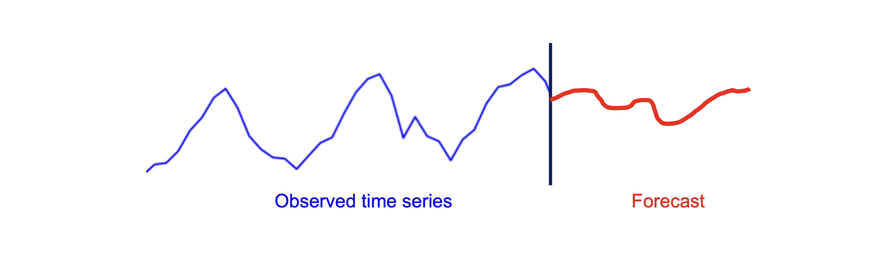

---

## 예측 문제 정식 설정 (Forecasting Problem Setup)

수학적 표기를 정의해 봅시다.

- $i \in I$: 예측 대상 변수 인덱스
- $T$: 현재 시점(타임스탬프)
- $z_{i,t}$: 변수 $i$의 시점 $t$에서의 관측값

**목표**: 과거 관측값 $z_{i,0}, z_{i,1}, \cdots, z_{i,T-1}, z_{i,T}$가 주어졌을 때, 미래 $h$개 스텝의 **결합 분포(joint distribution)**를 추정합니다.

$$
z_{i,0}, \cdots, z_{i,T-1}, z_{i,T} \implies P(z_{i,T+1}, z_{i,T+2}, \cdots, z_{i,T+h})
$$

여기서 $h$를 **예측 지평(forecast horizon)**이라 부릅니다. 단순히 미래 값 하나를 맞추는 것이 아니라, **불확실성을 포함한 분포**를 추정하는 것이 이상적인 목표입니다.

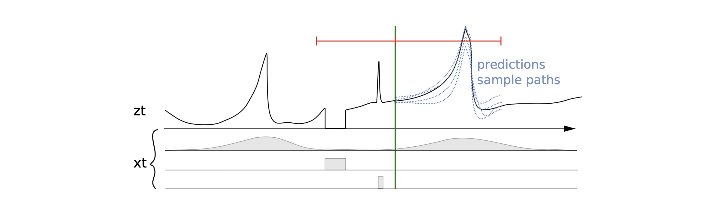

---

## 핵심 고려사항 1 — 시퀀스 예측 (Predicting a Sequence)

목표는 미래 $h$개 스텝의 예측값 $\hat{z}_{i,T+1}, \hat{z}_{i,T+2}, \cdots, \hat{z}_{i,T+h}$를 동시에 구하는 것입니다. 이를 위한 두 가지 접근이 있습니다.

**접근법 1: 자기회귀(Autoregressive) 방식**

- 단일 스텝만 예측하는 모델 $f$를 학습합니다. 즉, $\hat{z}_{i,t+1} = f(z_{i,1:t})$.
- 이를 $h$번 반복 적용합니다: $\hat{z}_{i,T+1}$로 $\hat{z}_{i,T+2}$를 만들고, 그 결과로 $\hat{z}_{i,T+3}$을 만드는 식입니다.
- **장점**: 모델 구조가 단순합니다.
- **단점**: 초기 오차가 누적되어 먼 미래일수록 예측 품질이 저하됩니다(error accumulation).

**접근법 2: 시퀀스 전체를 한 번에 예측하는 방식**

- **인코더(encoder) $g$**로 과거 시계열을 압축하고, **디코더(decoder) $f$**로 미래 시퀀스를 통째로 출력합니다.
- Seq2Seq, Transformer 기반 모델들이 이 방식에 해당합니다(이후 강의에서 다룸).

---

## 핵심 고려사항 2 — 추가 속성 (Additional Attributes)

실제 예측 문제에서는 시계열 자체 외에도 각 시점 $t$에 부가적인 공변량(covariate) $\mathbf{x}_{i,t}$가 주어지는 경우가 많습니다.

- 예시: 요일(day of the week), 공휴일 여부, 환율, 주가 지수 등
- 이 공변량은 **예측 대상 시점**에도 주어질 수도, 주어지지 않을 수도 있습니다.

공변량을 활용하면 더 풍부한 맥락에서 예측이 가능하지만, 우선은 단순화를 위해 **이 추가 속성은 무시하고** 시계열 값만을 입력으로 사용하는 설정에서 출발합니다.

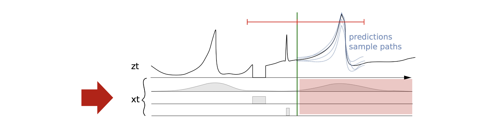

---

## 핵심 고려사항 3 — 예측의 불확실성 (Uncertainty of Predictions)

시계열 예측의 궁극적 목적은 단순히 미래 값을 하나 찍는 것이 아닙니다. 우리가 예측을 하는 이유는 **예측을 바탕으로 최적의 행동(decision)을 결정**하기 위해서입니다.

예를 들어 최적 행동 $a^*$는 다음과 같이 정의됩니다.

$$
a^* = \underset{a}{\arg\min} \; \mathbb{E}_{z \sim P} \left[ \text{cost}(a, \, z_{i,T+1}, \cdots, z_{i,T+h}) \right]
$$

이 최적화를 위해서는 단일 점 예측(point forecast)이 아니라 **미래 행동의 분포 $P$를 추정**하는 것이 이상적입니다. 100% 정확한 예측은 불가능하므로, 불확실성을 분포로 표현하는 **확률적 예측(probabilistic forecasting)**이 더 나은 의사결정을 가능하게 합니다.

---

## 뉴스벤더 모델 (The Newsvendor Model)

확률적 예측이 왜 중요한지를 보여주는 고전적인 예제입니다.

### 문제 설정

- $c$: 신문 구매 단가(purchase price)
- $q$: 구매 수량 — **최적화해야 하는 변수(decision variable)**
- $s$: 판매 단가(sales price)
- $d$: 실제 수요(actual demand)

이익 함수는 다음과 같습니다.

$$
\text{profit}(q) = s \cdot \min(d, q) - cq
$$

$\min(d, q)$는 실제로 팔린 수량입니다. 수요보다 많이 사면 남은 신문은 손실이 되고, 적게 사면 잠재 수익을 놓치게 됩니다.

### Solution 1: 점 예측 (Point Forecast)의 한계

- 예측 모델 $f$로 수요의 점 예측 $\hat{d} = f(x)$를 구하고, $q = \hat{d}$로 설정합니다.
- **문제**: 점 예측 $\hat{d}$ 하나만으로는 최적 의사결정이 어렵습니다.
  - **과소 주문** ($\hat{d} < d$): 단위당 $(s - c)$의 기회 손실이 발생합니다.
  - **과다 주문** ($\hat{d} > d$): 남은 수량만큼 단위당 $c$의 비용 손실이 발생합니다.
- 두 종류의 비용이 **비대칭**이기 때문에, 단순히 기댓값을 구매 수량으로 설정하는 것은 최적이 아닐 수 있습니다.

### Solution 2: 확률적 예측 (Probabilistic Forecast)의 활용

- 예측 모델 $g$로 수요의 **분포** $P = g(x)$를 추정합니다.
- 분포 $P$를 바탕으로 최적 $q^*$를 결정합니다.

**최적 조건(optimality condition)**:

이익의 기댓값 $\mathbb{E}[\text{profit}(q)]$를 $q$에 대해 미분하면, 최적 구매 수량 $q^*$는 다음 조건을 만족해야 합니다.

$$
P(d \leq q^*) = \frac{s - c}{c}
$$

이를 누적분포함수(CDF) $F$로 표현하면,

$$
q^* = F^{-1}\!\left(\frac{s - c}{c}\right)
$$

즉, **수요 분포의 특정 분위수(quantile)**를 구매 수량으로 설정하는 것이 최적입니다. 판매 마진이 클수록 더 높은 분위수를, 낮을수록 더 낮은 분위수를 선택해야 합니다.

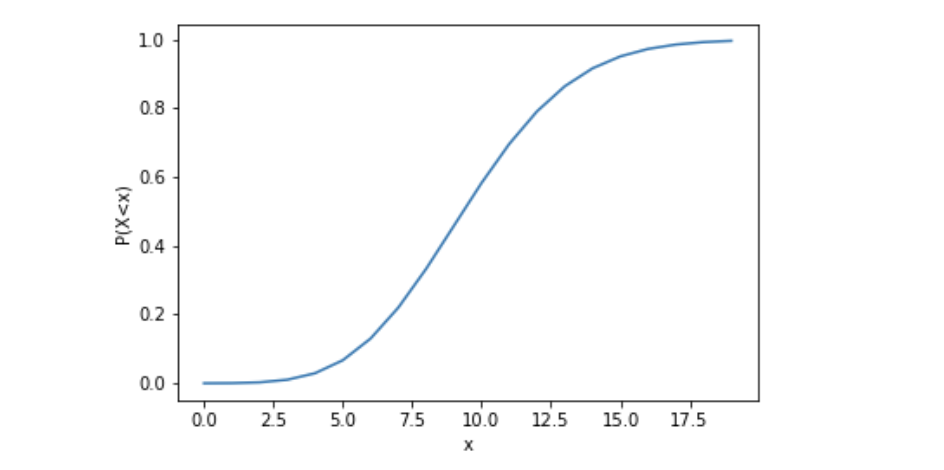

---

# 2. 선형 회귀 (Linear Regression)

## 파라미터 없는 기준 모델들 (Parameter-Free Methods)

모델 개발에 앞서, **아무 파라미터도 학습하지 않는 기준 모델(baseline)**들을 이해하는 것이 중요합니다. 이 모델들을 이기지 못하는 모델은 실용적 가치가 없습니다.

---

### Naïve 방법 (Naïve Method)

가장 단순한 예측: **마지막 관측값을 그대로 반복**합니다.

$$
\hat{z}_{T+t} = z_T, \qquad \forall t = 1, 2, \cdots, h
$$

- **직관**: 시계열이 매우 잡음이 심하고 예측 불가한 경우(예: 금융 자산), 마지막 값이 최선의 추정일 수 있습니다.
- **한계**: 트렌드나 계절성을 전혀 반영하지 못합니다.

---

### 평균 방법 (Mean Method)

**최근 $w$개 관측값의 평균**을 예측값으로 사용합니다.

$$
\hat{z}_{T+t} = \frac{1}{w}\bigl(z_{T-w+1} + z_{T-w+2} + \cdots + z_T\bigr), \qquad \forall t = 1, 2, \cdots, h
$$

- $w$는 **윈도우 크기(window size)**로, 하이퍼파라미터입니다.
- $w = T$(전체 길이)로 설정하면 전체 평균을 사용하는 것과 같습니다.
- 노이즈를 평균내어 완화하지만, 트렌드나 최근 변화에 반응이 느립니다.

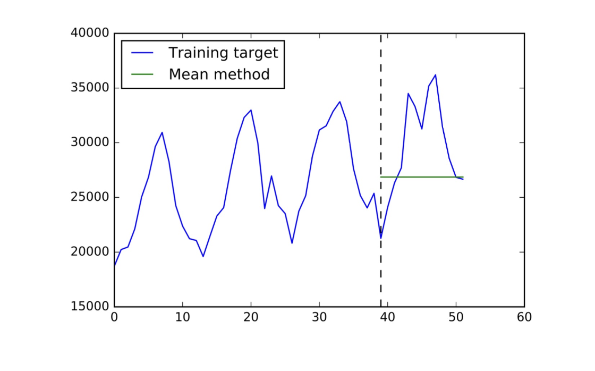

---

### Naïve 계절성 방법 (Naïve Seasonal Method)

**직전 시즌의 동일 시점 값**을 예측값으로 사용합니다.

- 예: 기온 예측 시 "전년도 같은 달의 기온"을 사용
- 계절성의 주기(seasonal period)를 올바르게 설정하는 것이 핵심입니다.
- 강한 계절성을 가진 데이터에서는 Naïve나 Mean 방법보다 훨씬 나은 성능을 보입니다.

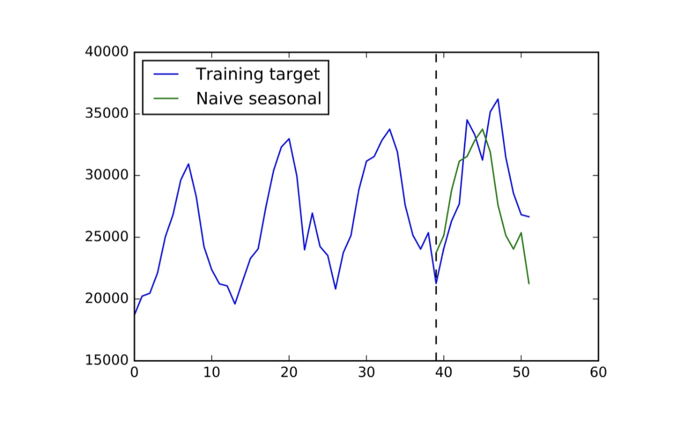

---

### 파라미터 없는 모델의 역할

파라미터 없는 모델들은 **중요한 기준선(baseline)**입니다.

- 개발한 모델이 이 기준선보다 못하다면, 두 가지 원인 중 하나를 의심해야 합니다.
  1. **데이터 자체가 예측 불가능할 정도로 잡음이 심한 경우** (예: 주가). 어떤 모델도 의미 있게 이기기 어렵습니다.
  2. **모델 개발 과정에서 문제가 있는 경우**:
     - 잘못된 전처리
     - 잘못된 아키텍처 선택
     - 학습 실패(학습률, 수렴 문제 등)

---

## 선형 회귀 모델 (Linear Regression)

선형 회귀(LR)는 파라미터 없는 방법들을 **일반화**합니다. 피처(feature)를 잘 설계하면, 위의 기준 모델들을 모두 선형 회귀의 특수한 경우로 볼 수 있습니다.

### 모델 정의

$n$개의 피처로 이루어진 입력 벡터 $\mathbf{x}_i \in \mathbb{R}^n$이 주어질 때, 선형 함수 $f$를 다음과 같이 정의합니다.

$$
f(\mathbf{x}_i; \theta) = \sum_{j=1}^{n} w_j x_{i,j} + b
$$

- $\theta = (\mathbf{w}, b)$: 학습 가능한 파라미터(가중치와 편향)
- 파라미터는 **예측 RMSE(Root Mean Squared Error)를 최소화**하도록 최적화됩니다.

---

## 피처 설계 (How to Choose Features)

선형 모델에서 **피처 설계(feature engineering)**의 품질이 성능을 결정합니다. 어떤 피처를 사용할 수 있는지 살펴봅시다.

### 주요 피처 유형

| 피처 유형 | 설명 | 예시 |
|---|---|---|
| **외부 피처** | 시계열에 포함되지 않은 외부 정보 | 요일, 공휴일 여부, 환율 |
| **지연(Lag) 값** | 과거 관측값들 | $z_{t-1}, z_{t-2}, z_{t-7}, z_{t-14}$ |
| **트렌드 피처** | 연속된 값들의 차이 | $z_{t-1} - z_{t-2}$, $z_{t-3} - z_{t-4}$ |
| **계절성 지연값** | 계절 주기만큼 전의 값 | $z_{t-S}$ ($S$는 계절 주기) |
| **이동 평균 피처** | 특정 구간의 평균 | $\text{mean}(z_{t-w:t-1})$ |

### 피처 설계의 어려움

좋은 피처를 선택하는 것은 쉽지 않습니다.

- **도메인 지식이 필수적**입니다. 예를 들어 주식 가격 예측에는 RSI, MACD, Stochastic 등 수십 가지의 기술적 지표(technical indicators)가 활용됩니다.
- 경험과 실험을 통해 어떤 피처 조합이 유효한지를 검증해야 합니다.

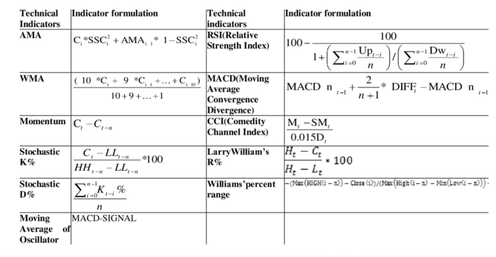

### 피처를 활용한 시계열 분해 (Decomposition)

좋은 피처가 갖추어지면, 시계열을 **트렌드(trend), 계절성(seasonality), 잔차(residual)** 등 여러 성분으로 분해할 수 있습니다. 이 분해는 모델이 각 성분을 독립적으로 포착하도록 돕습니다.

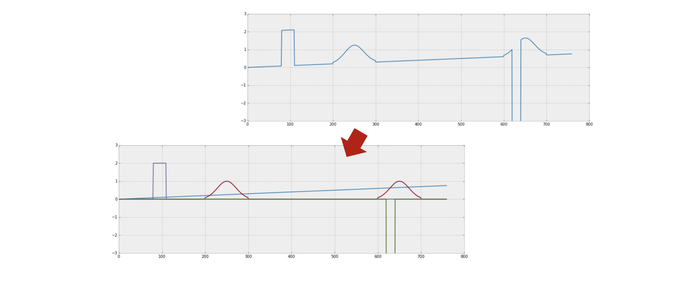

---

# 3. ARIMA

## ARIMA란?

**ARIMA(AutoRegressive Integrated Moving Average)**는 **특정 방식의 피처 엔지니어링이 적용된 선형 모델**로 이해할 수 있습니다.

ARIMA$(p, d, q)$는 세 가지 성분으로 구성됩니다.

| 기호 | 성분 | 역할 |
|---|---|---|
| $p$ | **AR**: Autoregressive | 자기회귀 항 |
| $d$ | **I**: Integrated | 시계열 차분(differencing) |
| $q$ | **MA**: Moving Average | 이동 평균 오차 항 |

---

## AR(p): 자기회귀 모델 (Autoregressive Model)

**자기회귀(AR) 모델**은 과거 $p$개의 관측값을 피처로 사용합니다.

$$
f(z_{t-p+1:t}; \theta) = \sum_{j=0}^{p-1} \phi_j \, z_{t-j} + b
$$

- AR$(p)$에서는 **$p$개의 과거 관측값** $z_{t-1}, z_{t-2}, \cdots, z_{t-p}$가 입력 피처입니다.
- $p$를 **AR 차수(order)**라 하며, 얼마나 먼 과거를 참조하는지를 결정합니다.

### 백색 잡음 항 (White Noise)

일부 모델에서는 AR 함수에 **백색 잡음(white noise)** $\epsilon \sim \mathcal{N}(0, 1)$을 추가합니다.

$$
f(z_{t-p+1:t}; \theta) = \sum_{j=0}^{p-1} \phi_j \, z_{t-j} + b + \epsilon
$$

- 이 잡음 항은 **예측의 불가피한 오차**를 모델링합니다. 어떤 모델도 완벽할 수 없으며, 외부 요인이 항상 존재하기 때문입니다.
- 확률적 예측(probabilistic forecasting)에서 **미래 불확실성을 분포로 표현**하는 핵심 요소가 됩니다(잠시 후 SSM 섹션에서 더 다룹니다).
- 현재 단계에서는 단순화를 위해 이 잡음을 무시해도 무방합니다.

---

## I(d): 차분 항 (Differencing Term)

### 차분의 동기

일반적인 예측은 미래 값 $z_{T+1}$을 직접 예측합니다. 그런데 $z_T$를 이미 알고 있으므로, 다음 두 예측은 수학적으로 동치입니다.

- $z_{T+1}$을 예측하는 것
- $z'_{T+1} = z_{T+1} - z_T$를 예측하는 것 (정보 손실 없음)

**차분된 시계열 $z'$을 예측하는 것이 원래 시계열을 직접 예측하는 것보다 쉬울 수 있습니다.** 그 이유는, 차분을 통해 시계열의 **비정상성(non-stationarity)**을 제거하고, 스케일의 변화가 아닌 **변화량(movement)을 일정하게** 만들기 때문입니다.

### 차분의 정의

- **1차 차분** ($d = 1$):
$$
z'_t = z_t - z_{t-1}
$$

- **2차 차분** ($d = 2$): 1차 차분의 차분
$$
z''_t = z'_t - z'_{t-1} = (z_t - z_{t-1}) - (z_{t-1} - z_{t-2}) = z_t - 2z_{t-1} + z_{t-2}
$$

> **주의**: 차분의 순서가 중요합니다. ARIMA$(p, d, q)$를 적용할 때, **먼저 $d$번 차분하여 새 시계열 $z^{(d)}$를 만든 후**, 이 새 시계열에 AR$(p)$와 MA$(q)$를 적용합니다.

### 예시: ARIMA(1, 1, 0)

1. $d = 1$: 원래 시계열 $z$를 1차 차분하여 $z'_t = z_t - z_{t-1}$을 생성합니다. ($z'$의 길이는 $z$보다 1 짧아집니다.)
2. $p = 1$, $q = 0$: $z'$에 AR(1)을 적용합니다.

최종 모델:

$$
\hat{z}'_t = \phi \cdot z'_{t-1} + b
$$

즉, **차분된 시계열에서의 다음 스텝 변화량**을 이전 변화량으로 선형 예측하는 것입니다.

---

## MA(q): 이동 평균 항 (Moving Average Term)

**MA$(q)$**는 **과거의 예측 오차(prediction error)** 항들을 피처로 추가합니다.

- $\epsilon_{t-k} = z_{t-k} - \hat{z}_{t-k}$: 시점 $t-k$에서의 예측 오차
- MA$(q)$는 $\epsilon_{t-1}, \epsilon_{t-2}, \cdots, \epsilon_{t-q}$를 피처로 사용합니다.

예를 들어 MA(2)의 모델식은 다음과 같습니다.

$$
\hat{z}_t = \theta_1 \epsilon_{t-1} + \theta_2 \epsilon_{t-2} + b
$$

**핵심 특징**: MA 항은 자기회귀 예측을 반복하면서 **이전 예측의 오차를 다음 예측에 반영**합니다. 즉 모델이 체계적인 오류를 자기보정(self-correct)할 수 있게 합니다.

---

## ARIMA: 종합 정리

ARIMA$(p, d, q)$는 세 아이디어를 결합한 선형 모델입니다.

**예시: ARIMA(2, 1, 2)**

1. **차분(I)**: $d = 1$이므로 시계열을 1회 차분 → $z'_t = z_t - z_{t-1}$
2. **AR 피처**: $z'_{t-1}$, $z'_{t-2}$
3. **MA 피처**: $\epsilon_{t-1}$, $\epsilon_{t-2}$ (차분된 시계열 $z'$ 기준)
4. 이 피처들을 사용하여 선형 회귀 모델을 학습

> **중요**: AR과 MA의 피처는 원래 시계열 $z$가 아닌 **차분된 시계열 $z'$에서 계산**됩니다.

---

# 4. 상태 공간 모델 (State Space Models)

## 오차 수정 함수 (Error-Correction Functions)

선형 회귀의 대안으로, 예측을 **이전 예측을 점진적으로 수정하는 방식**으로 만들 수 있습니다.

$$
\hat{z}_{t+1} = \underbrace{\hat{z}_t}_{\text{previous forecast}} + \alpha \underbrace{(z_t - \hat{z}_t)}_{\text{error in previous forecast}}
$$

- **$\hat{z}_t$**: 이전 시점의 예측값
- **$z_t - \hat{z}_t$**: 이전 예측의 오차
- **$\alpha$**: **평활 파라미터(smoothing parameter)**, 일반적으로 $0 < \alpha < 1$

$\alpha$가 클수록 최근 오차를 빠르게 반영하여 예측을 수정하고, 작을수록 변화에 보수적으로 반응합니다. 이 방식을 **오차 수정 함수(error-correction function)**라 부릅니다.

---

## 단순 지수 평활 (Simple Exponential Smoothing, ETS)

오차 수정 함수를 반복 전개하면 **지수 평활(ETS)** 형태가 드러납니다.

### 전개 과정

$\hat{z}_3$을 예시로 전개해 봅시다.

$$
\begin{aligned}
\hat{z}_3 &= \hat{z}_2 + \alpha(z_2 - \hat{z}_2) \\
          &= \alpha z_2 + (1 - \alpha)\hat{z}_2 \\
          &= \alpha z_2 + (1 - \alpha)\bigl[\hat{z}_1 + \alpha(z_1 - \hat{z}_1)\bigr] \\
          &= \alpha z_2 + \alpha(1-\alpha) z_1 + (1-\alpha)^2 \hat{z}_1
\end{aligned}
$$

이를 일반화하면:

$$
\hat{z}_{T+h} = \alpha z_T + \alpha(1-\alpha)z_{T-1} + \alpha(1-\alpha)^2 z_{T-2} + \cdots + (1-\alpha)^T \hat{z}_1
$$

이것이 바로 **단순 지수 평활(ETS: Exponential Smoothing)**입니다.

### 해석

- 각 과거 관측값의 가중치가 **$(1-\alpha)^k$의 지수 함수적으로 감소**합니다.
- 즉, 최근 관측값일수록 더 큰 가중치를 받습니다.
- $\alpha$가 크면 → 최근 값에 집중 (빠른 반응, 높은 분산)
- $\alpha$가 작으면 → 먼 과거까지 고르게 참조 (느린 반응, 낮은 분산)

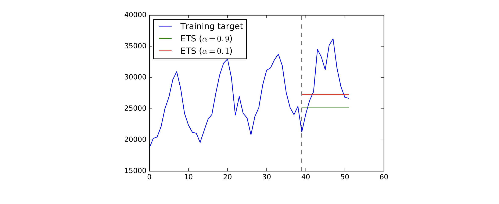

---

## 상태(State)와 예측(Prediction) 분리

ETS를 **상태(state)**와 **예측(prediction)**의 두 가지 연산으로 분리하면 더 일반적인 프레임워크로 확장할 수 있습니다.

- $l_t$: 시점 $t$에서의 **상태 벡터(state)**
- **예측 방정식(Forecast equation)**: 상태를 이용해 예측값을 생성
  $$
  \hat{z}_t = l_{t-1}
  $$
- **오차 수정 방정식(Error Correction)**: 실제 관측값으로 상태를 업데이트
  $$
  l_t = l_{t-1} + \alpha(z_t - \hat{z}_t)
  $$

이를 도식화하면 다음과 같습니다.

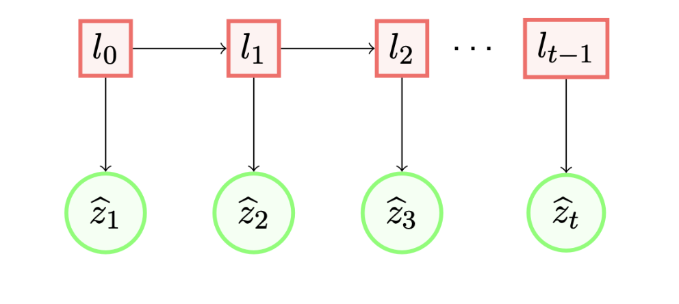

이 구조에서 상태 $l_t$는 **과거 시계열로부터 추출된 요약 정보(sufficient statistic)**로, 미래를 예측하기 위한 모든 관련 정보를 담고 있습니다.

---

## 일반화된 지수 평활 (General Exponential Smoothing)

ETS에서 스칼라였던 상태를 **벡터** $\mathbf{l}_t \in \mathbb{R}^d$로 확장합니다.

$$
\text{Forecast equation:} \quad \hat{z}_t = \mathbf{a}_t^T \mathbf{l}_{t-1}
$$

$$
\text{Error Correction:} \quad \mathbf{l}_t = \mathbf{F}_t \mathbf{l}_{t-1} + \mathbf{g}_t(z_t - \hat{z}_t)
$$

학습 가능한 파라미터는 4종류입니다.

| 파라미터 | 차원 | 역할 |
|---|---|---|
| $\mathbf{a}_t \in \mathbb{R}^d$ | $d$ | $\mathbf{l}_{t-1}$을 예측값 $\hat{z}_t$로 변환하는 선형 투영 벡터 |
| $\mathbf{F}_t \in \mathbb{R}^{d \times d}$ | $d \times d$ | $\mathbf{l}_{t-1}$을 $\mathbf{l}_t$로 전이시키는 상태 전이 행렬 |
| $\mathbf{g}_t \in \mathbb{R}^d$ | $d$ | 오차 $(z_t - \hat{z}_t)$를 상태 업데이트에 반영하는 게인 벡터 |
| $\mathbf{l}_0 \in \mathbb{R}^d$ | $d$ | 초기 상태 벡터 |

스칼라 ETS는 $d = 1$로 설정한 특수한 경우에 해당합니다.

---

## 상태 공간 모델 (State Space Model, SSM)

### 오차 수정 항의 재해석

일반화된 ETS에서 **오차 수정 항 $z_t - \hat{z}_t$를 굳이 명시적으로 넣어야 할까요?**

대신 이 오차 자체를 **랜덤 변수 $\epsilon_t$로 모델링**하면 어떨까요?

$$
\text{Measurements (관측 방정식):} \quad z_t = \mathbf{a}_t^T \mathbf{l}_{t-1} + \epsilon_t, \qquad \epsilon_t \sim \mathcal{N}(0, \sigma^2)
$$

$$
\text{State transition (상태 전이 방정식):} \quad \mathbf{l}_t = \mathbf{F}_t \mathbf{l}_{t-1} + \mathbf{g}_t \epsilon_t, \qquad \mathbf{l}_0 \sim \mathcal{N}(\boldsymbol{\mu}_0, \text{diag}(\boldsymbol{\sigma}_0^2))
$$

이것이 바로 **상태 공간 모델(State Space Model, SSM)**입니다.

### ETS와의 차이

| 구분 | 일반화된 ETS | SSM |
|---|---|---|
| 오차 처리 | 관측 오차를 명시적으로 수정 | 오차를 가우시안 랜덤 변수로 모델링 |
| 초기 상태 | 결정론적 파라미터 $\mathbf{l}_0$ | 랜덤 변수 $\mathbf{l}_0 \sim \mathcal{N}(\boldsymbol{\mu}_0, \text{diag}(\boldsymbol{\sigma}_0^2))$ |
| 예측 결과 | 점 예측 | **확률적 분포** (자연스럽게) |

SSM의 핵심 강점은 **확률적 프레임워크**를 통해 예측 불확실성을 자연스럽게 정량화한다는 점입니다.

---

## 선형 상태 공간 모델 (Linear State Space Models)

SSM과 피처 기반 선형 회귀를 결합하면 더 강력한 모델을 만들 수 있습니다.

$$
\text{SSM 파트:} \quad u_t = \mathbf{a}_t^T \mathbf{l}_{t-1}
$$

$$
\text{피처 기반 파트:} \quad b_t = \mathbf{w}^T \mathbf{x}_t
$$

$$
\text{확률적 관측 모델:} \quad z_t \sim P(z_t \mid u_t + b_t)
$$

- $u_t$: 상태로부터 추출된 **시간 의존적(time-dependent)** 구성 요소
- $b_t$: 공변량 $\mathbf{x}_t$로부터 추출된 **피처 기반** 구성 요소
- 두 항을 합산하여 관측 분포를 결정합니다.

이 모델은 더 많은 파라미터를 가지지만, SSM의 비선형 상태 역학과 선형 회귀의 풍부한 피처 표현을 동시에 활용할 수 있습니다.

---

# 강의 요약 (Summary)

이번 강의에서 다룬 내용을 핵심만 정리합니다.

| 섹션 | 핵심 내용 |
|---|---|
| **시계열 예측** | 과거 관측값으로 미래 분포 $P(z_{T+1}, \cdots, z_{T+h})$를 추정하는 문제. 불확실성을 고려한 확률적 예측이 점 예측보다 의사결정에 우월함 (뉴스벤더 모델) |
| **선형 회귀** | Naïve, Mean, Seasonal 기준 모델을 일반화. 피처 설계(lag, trend, seasonal, mean)가 성능을 결정함 |
| **ARIMA** | AR(자기회귀), I(차분), MA(이동 평균 오차) 세 성분을 결합한 선형 모델. $d$번 차분 후 $z'$에 AR$(p)$·MA$(q)$ 적용 |
| **상태 공간 모델** | ETS(지수 평활) → 일반화된 ETS(벡터 상태) → SSM(오차를 랜덤 변수로 모델링) → 선형 SSM(피처와 결합)으로의 점진적 확장. 자연스러운 확률적 예측이 핵심 강점 |
