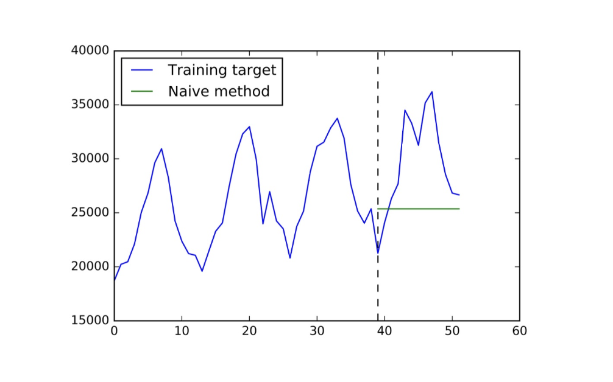

# 1. 시계열 예측의 기준점: 파라미터 없는 모델 (Parameter-Free Models)

* 시계열 예측 모델을 설계할 때, 복잡한 머신러닝/딥러닝 모델을 도입하기에 앞서 반드시 성능의 기준점(Baseline)으로 삼아야 하는 단순한 모델들이 있습니다. 시계열 데이터는 본질적으로 무작위성(Randomness)과 노이즈(Noise)를 강하게 포함하고 있기 때문에, 학습 파라미터가 전혀 없는 극도로 단순한 모델이 오히려 정교한 모델보다 더 좋은 성능을 내는 경우가 빈번합니다.

## 1.1. Naïve Method (단순 예측법)

* 가장 단순한 예측 방법론으로, **"미래의 값은 가장 최근에 관측된 과거의 값과 동일할 것"**이라고 가정합니다.

* 주어진 현재 시점을 $T$라고 할 때, 미래 시점 $T+t$ ($t=1, 2, \dots, h$)에 대한 예측값 $z_{T+t}$는 다음과 같이 정의됩니다:
$$z_{T+t} = z_T, \quad \forall t=1,2,\dots,h$$

## 1.2. Mean Method (평균 예측법)

* 가장 최근 값 하나만 사용하는 Naïve Method와 달리, **"과거 특정 윈도우(Window) 기간 동안의 평균값이 미래에도 유지될 것"**이라고 가정하는 방법입니다.

* 윈도우 크기(Window size)를 $w$라고 할 때, 예측식은 다음과 같습니다:
$$z_{T+t} = \frac{1}{w}(z_{T-w+1} + z_{T-w+2} + \dots + z_T), \quad \forall t=1,2,\dots,h$$

## 1.3. Naïve Seasonal Method (단순 계절성 예측법)

* 시계열 데이터에 명확한 계절성(Seasonality)이 존재할 때 사용하는 방법입니다. **"미래의 값은 직전 주기의 동일한 시점(Season) 값과 같을 것"**이라고 가정합니다. (예: 내년 8월의 기온은 올해 8월의 기온과 동일할 것이다)

* 다만, 이 방법을 적용하기 위해서는 데이터에 존재하는 계절성의 주기($S$)를 어떻게 정확히 포착할 것인가(How to capture the seasonality)라는 별도의 문제가 선행되어야 합니다.

## 1.4. Parameter-Free 모델의 의의 (Remarks)

* 이러한 파라미터 없는 모델들은 예측 성능 평가의 **강력한 베이스라인(Baselines)** 역할을 합니다. 만약 우리가 고안한 복잡한 모델이 이 단순한 모델들조차 이기지 못한다면 (Outperform 실패), 그 모델은 실용적 가치가 없습니다.

* 우리의 모델이 베이스라인보다 성능이 떨어진다면 원인은 보통 다음 중 하나입니다:
  * 1. **데이터의 문제**: 주식 가격과 같이 데이터 자체가 극도로 노이즈가 많아(Highly noisy), 애초에 어떤 복잡한 접근법도 성공할 수 없는 경우.
  * 2. **모델 설계 및 학습의 문제**:
     * 데이터를 잘못 전처리(Preprocess)했음
     * 모델의 아키텍처(Architecture)가 해당 시계열 패턴과 맞지 않음
     * 여러 이유로 제대로 학습(Train)시키는 데 실패함

---

# 2. 선형 회귀 (Linear Regression)를 활용한 시계열 예측

* Parameter-free 방법론을 일반화하고 데이터의 패턴을 학습하기 위해 도입할 수 있는 가장 기본적인 모델이 바로 **선형 회귀(Linear Regression, LR)**입니다. 선형 회귀는 입력 변수(Features)와 출력 변수(Target) 사이의 선형적 매핑(Linear mapping) 규칙을 학습합니다.

## 2.1. 모델 공식화 (Mathematical Formulation)

* 주어진 $i$번째 샘플 벡터를 $x_i \in \mathbb{R}^d$ ($d$는 특성의 개수)라고 할 때, 선형 모델 함수 $f$는 다음과 같이 정의됩니다:
$$f(x_i; \theta) = \sum_{k=1}^d w_k x_{i,k} + b$$
  * $x_{i,k}$: $i$번째 샘플의 $k$번째 특성값
  * $\theta = \{w, b\}$: 모델이 데이터로부터 학습해야 할 가중치(Weights, $w$)와 편향(Bias, $b$) 파라미터 집합

* 이 파라미터 $\theta$는 일반적으로 실제 값과 예측값 차이의 제곱 평균의 제곱근인 **RMSE(Root Mean Squared Error)**를 최소화(Minimize)하는 방향으로 최적화(Optimize)됩니다.

---

# 3. 특성 공학 (Feature Engineering)

* 선형 회귀와 같은 단순한 모델이 시계열 데이터에서 강력한 성능을 발휘하기 위해서는 **특성 설계(Feature design)**가 매우 중요합니다. 고품질의 피처(High-quality features)는 선형 모델의 예측력을 기하급수적으로 끌어올릴 수 있습니다.

## 3.1. 기본 시계열 피처 (Possible Input Features)

* 과거의 시계열 값 $z_t$로부터 도출할 수 있는 주요 피처들은 다음과 같습니다:
  * **외부 특성 (External features)**: 날씨, 공휴일 여부 등 목표 시계열 외부에서 주어지는 유용한 정보.
  * **지연 값 (Lagged values)**: 직전 과거의 값들. 예: $z_{t-1}, z_{t-2}, z_{t-3}, z_{t-4}$
  * **추세 특성 (Trend features)**: 데이터의 증감 추세를 나타내는 차분(Difference) 값. 예: $z_{t-1} - z_{t-2}$, $z_{t-2} - z_{t-3}$
  * **계절성 지연 값 (Seasonal lagged values)**: 주기 $S$만큼 떨어진 과거의 값. 예: $z_{t-S}$
  * **평균 특성 (Average features)**: 특정 구간의 이동 평균. 예: $\text{mean}(z_{t-7:t-1})$

## 3.2. 도메인 지식 기반 특성: 기술적 지표 (Technical Indicators)

* 적절한 피처를 선택하는 것은 매우 어려우며, 깊은 **도메인 지식(Domain knowledge)**과 경험을 요구합니다. 예를 들어 주식 가격 예측의 경우, 단순한 지연 값을 넘어 금융 도메인에 특화된 수많은 기술적 지표(Technical indicators)를 입력 피처로 활용합니다.
  * **WMA (가중이동평균)**: 최근 데이터에 더 큰 가중치를 두는 이동 평균입니다. $\frac{10 C_t + 9 C_{t-1} + \dots + 1 C_{t-9}}{10 + 9 + \dots + 1}$ 와 같이 계산하여 최근 추세에 민감하게 반응하도록 설계됩니다.
  * **Momentum (모멘텀)**: 현재 가격과 $n$일 전 가격의 차이($C_t - C_{t-n}$)를 통해 추세의 강도와 방향을 측정합니다.
  * **RSI (상대강도지수)**: 상승폭과 하락폭을 바탕으로 과매수/과매도 상태를 판단하는 지표입니다.
  * **MACD**: 단기 이동평균과 장기 이동평균의 수렴/발산을 측정합니다.
  * **Stochastic K%, D%**: 일정 기간의 최고가($HH$)와 최저가($LL$) 범위 내에서 현재 가격($C_t$)의 위치를 백분율로 나타낸 지표입니다. $\frac{C_t - LL_{t-n}}{HH_{t-n} - LL_{t-n}} \times 100$

* 이처럼 도메인에 특화된 변수 조합을 통해 선형 모델이 학습할 수 있는 비선형적이고 풍부한 특성 공간을 창출할 수 있습니다.

## 3.3. 피처를 활용한 시계열 분해 (Decomposition)

* 좋은 피처(Good features)를 발굴하고 구성하게 되면, 복잡하게 얽혀 있는 시계열 데이터를 여러 개의 의미 있는 성분으로 분해(Decompose)할 수 있습니다.

* 이처럼 데이터를 기저 트렌드, 주기적 패턴, 이벤트 성분 등으로 완벽히 분해할 수 있다면, 단순한 선형 모델이 각 성분의 특징을 개별적으로 학습하게 하여 매우 뛰어난 최종 예측 성능을 달성할 수 있습니다.