# 들어가며

지난 강의에서는 시계열 예측의 고전적 방법론들 — 선형 회귀(Linear Regression), ARIMA, 상태 공간 모델(State Space Model, SSM) — 을 살펴보았습니다. 이번 강의에서는 이 흐름을 심층 신경망으로 자연스럽게 확장합니다. 구체적으로 세 가지 주제를 다룹니다.

1. **순환 신경망(Recurrent Neural Networks, RNN)**: SSM의 선형 상태 전이를 신경망으로 일반화
2. **확률적 예측(Probabilistic Forecasting)**: 단일 점 예측을 넘어 미래 값의 분포를 추정
3. **최대우도추정(Maximum Likelihood Estimation, MLE)**: 분포 기반 모델의 학습 원리

---

# 1. 순환 신경망 (Recurrent Neural Networks)

## 복습: 선형 회귀와 MLP

### 선형 회귀는 단일 뉴런이다

이전 강의에서 배운 **선형 회귀**는 신경망의 관점에서 보면 **단 하나의 뉴런(single neuron)**에 불과합니다. 입력 특성 벡터 $\mathbf{x}_t$와 가중치 벡터 $\mathbf{w}$, 편향 $b$를 이용해 시점 $t$의 예측값을 다음과 같이 계산합니다.

$$\hat{z}_t = \mathbf{w}^\top \mathbf{x}_t + b$$

이 구조에서 시계열의 각 시점 $t$마다 **동일한 가중치**를 공유하면서 독립적으로 예측을 수행합니다. 즉, 이전 시점의 정보는 명시적으로 활용되지 않습니다.

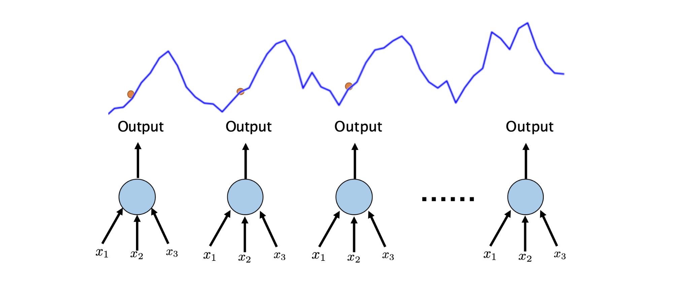

### 심층 신경망(MLP)으로의 일반화

선형 회귀를 일반화하면, 예측 함수 $f$를 임의의 복잡한 함수로 확장할 수 있습니다.

$$\hat{z}_t = f(\mathbf{x}_t)$$

이때 $f$를 여러 층의 비선형 변환으로 구성한 것이 **다층 퍼셉트론(Multi-layer Perceptron, MLP)** 입니다. $l$개의 레이어를 쌓으면 다음과 같이 표현됩니다.

$$z_t = \sigma\!\left(\mathbf{w}_l^\top\!\left(\sigma\!\left(W_{l-1}^\top\!\left(\sigma\!\left(W_{l-2}^\top\!\left(\cdots W_0^\top \mathbf{x}_t\right)\right)\right)\right)\right)\right) := \text{DEEP-NET}(\mathbf{x}_t)$$

여기서 $\sigma$는 활성화 함수(예: ReLU, tanh)이며, 각 층이 비선형 변환을 누적적으로 쌓아 복잡한 함수 관계를 근사합니다.

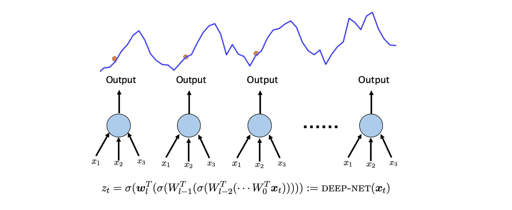

### MLP의 장단점

MLP는 선형 회귀보다 훨씬 복잡한 패턴을 학습할 수 있지만, 그만큼 대가도 따릅니다.

**장점:**

- 복잡한 비선형 관계를 직접 학습 가능
- 수동 피처 엔지니어링(manual feature engineering)의 필요성 감소

**단점:**

- 더 많은 학습 데이터 필요
- 정규화(regularization) 등 세밀한 하이퍼파라미터 튜닝 필요
- 입력 스케일(scaling)에 민감
- 더 많은 연산 자원과 시간 소요

---

## SSM에서 RNN으로 — 동기와 구조

### 상태 공간 모델(SSM)을 신경망으로 확장하는 아이디어

지난 강의에서 배운 SSM은 다음과 같은 **선형** 상태 전이를 사용합니다.

$$l_t = l_{t-1} + \alpha \cdot \epsilon_t$$
$$z_t = \mathbf{v}^\top l_t + \mathbf{w}^\top \mathbf{x}_t + \epsilon_t$$

상태 벡터 $l_t$가 이전 상태 $l_{t-1}$로부터 선형 변환을 통해 업데이트됩니다. 여기서 자연스러운 질문이 생깁니다.

> **"선형 회귀를 MLP로 일반화했듯이, SSM도 심층 신경망으로 일반화할 수 있지 않을까?"**

이것이 바로 **순환 신경망(RNN)**의 출발점입니다.

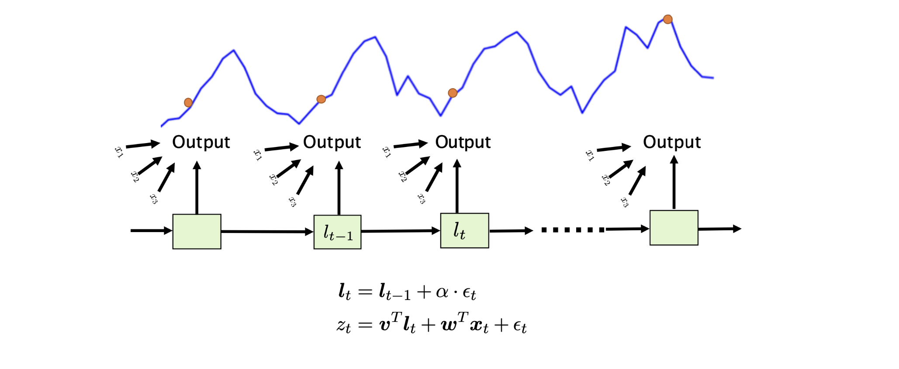

### 순환 신경망(RNN)의 정의

**RNN**은 SSM의 선형 상태 전이를 **비선형 함수**로 대체합니다. 현재 은닉 상태(hidden state) $\mathbf{h}_t$는 다음 세 가지에 의해 결정됩니다.

- **이전 은닉 상태** $\mathbf{h}_{t-1}$
- **현재 입력** $\mathbf{x}_t$
- **활성화 함수** $\sigma$

$$\mathbf{h}_t = \sigma(\theta_0 h_{t-1} + \theta_1 x_t)$$
$$z_t = \sigma(\theta h_t)$$

$z_t$는 은닉 상태 $\mathbf{h}_t$에 비선형 함수를 적용하여 생성됩니다.

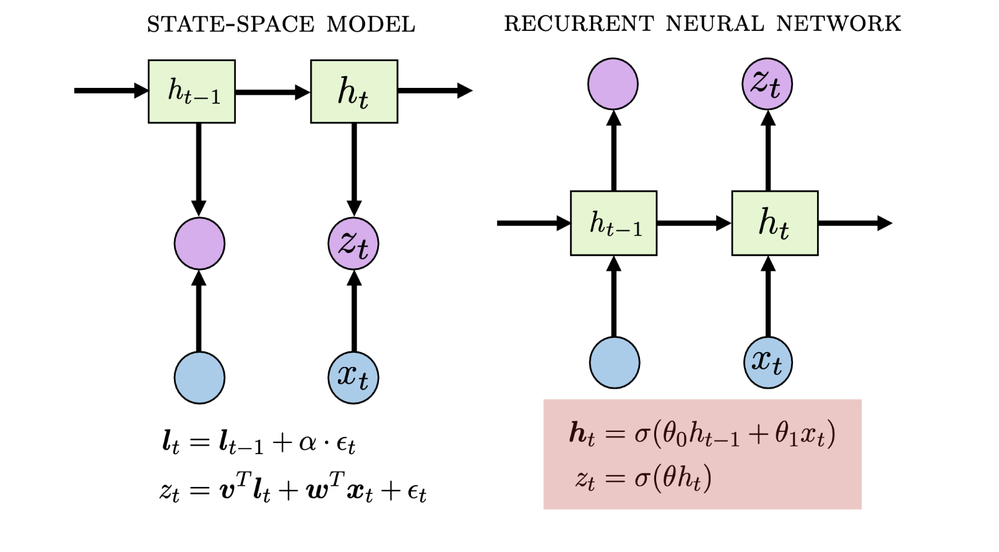

---

## 상태 전이를 레이어로 보기 (State Transition as Layers)

RNN의 각 셀(cell)은 MLP의 하나의 레이어와 대응됩니다. 시퀀스의 각 시점에서 활성화 함수가 적용되어 비선형성이 **시간 방향으로 누적**됩니다.

**장점 (Pro):**

- **강한 표현력(expressive power)**: 시퀀스가 진행될수록 은닉 상태가 점점 더 풍부한 정보를 담습니다. 긴 시계열의 복잡한 패턴도 포착할 수 있습니다.

**단점 (Con):**

- **학습 불안정성**: 시퀀스 길이만큼 레이어가 쌓이는 것과 같아, 역전파(backpropagation) 경로가 매우 길어집니다. 이로 인해 **그래디언트 소실(vanishing gradient)** 이나 **그래디언트 폭발(exploding gradient)** 문제가 발생하여 학습이 불안정해집니다. 특히 시퀀스 길이가 길수록 이 문제가 심각해집니다.

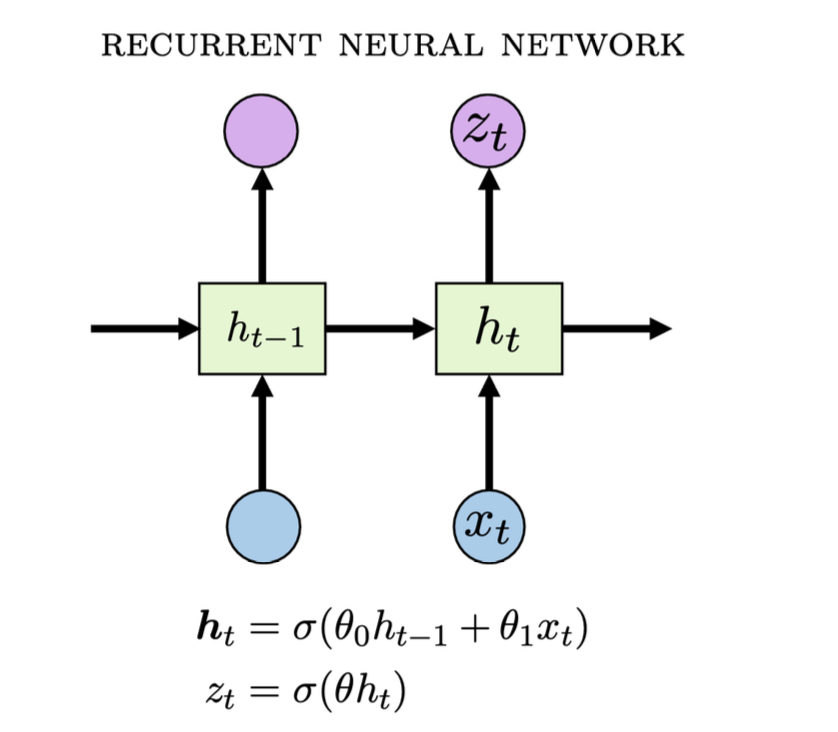

---

## Projection Head

RNN을 실제 예측 태스크에 활용하는 방법을 살펴보겠습니다.

입력 시계열 $\mathbf{x} = (x_1, \cdots, x_t)$를 RNN에 입력하면, 크기 $t \times h$의 은닉 상태 행렬 $\mathbf{H} = \text{RNN}(\mathbf{x})$가 생성됩니다. 여기서 $h$는 하이퍼파라미터인 **은닉 차원(hidden dimension)**입니다.

일반적으로 **마지막 상태 $z_t$만을 활용**합니다. 마지막 상태가 전체 시계열의 요약 정보를 가장 잘 담고 있기 때문입니다.

마지막으로, **projection head**를 붙여 최종 예측값을 계산합니다.

$$y = \mathbf{w}^\top z_t$$

이는 MLP의 단일 뉴런(선형 매핑)에 해당하며, RNN 인코더가 생성한 표현을 최종 예측값으로 변환합니다.

---

# 2. 확률적 예측 (Probabilistic Forecasting)

## 확률적 예측이란?

지금까지 다룬 모델들은 모두 **점 예측(point prediction)** $\hat{z}_t$를 출력했습니다. 그러나 현실의 예측 문제에서는 단일 예측값만으로는 불충분합니다. 미래의 불확실성을 정량화하는 것이 매우 중요합니다.

**확률적 예측(Probabilistic Forecasting)**의 목표는 단일 예측값이 아니라, **미래 값의 분포 $P(z_t)$를 추정**하는 것입니다. 이는 다음과 같은 실용적 이점을 제공합니다.

- 예측의 불확실성(uncertainty) 정량화
- 리스크 관리 및 의사결정 지원 (예: "90% 확률로 수요가 X 이하일 것")
- 이상값(extreme value) 발생 가능성 평가

아래에서는 설명의 단순화를 위해 **1단계 예측(one-step-ahead prediction, $h=1$)**을 가정합니다.

---

## 인코더와 Projection Head의 역할

RNN을 포함한 모든 심층 신경망은 크게 두 부분으로 구성됩니다.

- **인코더(Encoder)**: 입력 $\mathbf{x}_t$를 처리하여 표현 벡터(representation) $\mathbf{h}$를 생성합니다. 마지막(penultimate) 레이어까지의 모든 연산을 포함합니다.
- **Projection Head**: $\mathbf{h}$를 최종 예측값으로 변환합니다. 전형적으로 선형 매핑 $\hat{\mathbf{y}} = W\mathbf{h} + \mathbf{b}$을 사용합니다.

확률적 예측을 위해서는 **projection head만 수정하여 $P(z_t | \mathbf{h}_t)$를 모델링**합니다. 인코더 전체를 수정하는 것보다 훨씬 효율적인 방법입니다.

두 가지 주요 접근 방법이 있습니다.

1. **분위수 회귀(Quantile Regression)**: 다양한 분위수에 대한 예측값을 직접 생성
2. **모수적 분포(Parametric Distribution)**: 데이터 분포를 명시적으로 가정하고 그 모수를 예측

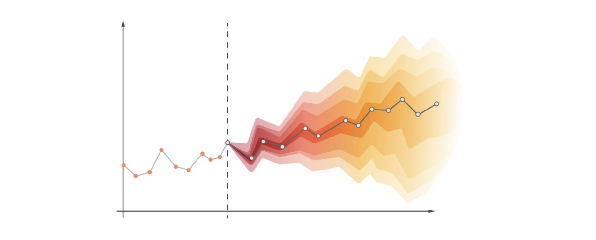

---

## 접근 방법 1: 분위수 회귀 (Quantile Regression)

### 분위수의 정의와 해석

분위수 회귀의 핵심 아이디어는 **다양한 신뢰 수준(confidence level)의 예측값을 동시에 생성**하는 것입니다.

**$Px$ 예측값** $\hat{z}_t^x$ 는 "$z_t \leq \hat{z}_t$가 전체 시간의 $x\%$에서 성립한다"는 의미입니다. 즉:

- **P50 예측**: 50%의 시간에서 $z_t \leq \hat{z}_t$ → **중앙값(median)**
- **P90 예측**: 90%의 시간에서 $z_t \leq \hat{z}_t$ → 상위 90번째 백분위수

분위 수준의 순서도 보존되어야 합니다: $a < b$이면 $\hat{z}_t^a < \hat{z}_t^b$.

> **주의**: $\hat{z}_t^{0.5}$는 중앙값(median)이지, 최빈값(mode)이나 평균(mean)이 아닙니다.

### 다중 Projection Head

각 분위수 $q$에 대해 **별도의 projection head**를 사용합니다. 인코더는 공유하되, 분위수별로 서로 다른 선형 매핑 $\mathbf{w}_q$를 적용합니다.

$$\hat{z}_t^q = \mathbf{w}_q^\top \mathbf{h}_t \quad \text{for } q \in \{0.01,\, 0.1,\, 0.3,\, \ldots\}$$

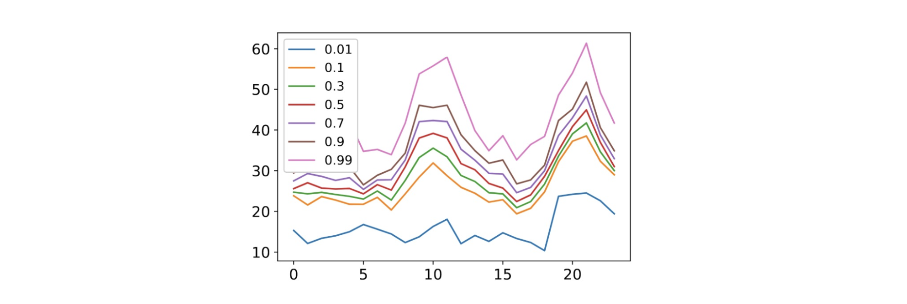

### 분위수 손실 함수 (Quantile Loss / Pinball Loss)

모델은 다음 목적 함수를 최소화하도록 학습합니다.

$$\mathcal{L}(\theta) = \sum_q \text{loss}_q(\hat{z}_t^q)$$

각 분위수에 대한 손실은 **비대칭 손실(asymmetric loss)** — 또는 **핀볼 손실(pinball loss)** — 으로 정의됩니다.

$$\text{loss}_q(\hat{z}_t^q) = \begin{cases} q \cdot (z_t - \hat{z}_t^q) & \text{if } z_t > \hat{z}_t^q \quad \text{(실제값이 예측값보다 클 때)} \\[4pt] (1-q) \cdot (\hat{z}_t^q - z_t) & \text{if } z_t < \hat{z}_t^q \quad \text{(실제값이 예측값보다 작을 때)} \end{cases}$$

이 손실의 비대칭성이 핵심입니다.

- **낮은 분위수** ($q$ 작음): 예측값이 실제값보다 낮을 때(과소 예측) 더 큰 페널티 → 예측값이 아래쪽으로 이동
- **높은 분위수** ($q$ 큼): 예측값이 실제값보다 높을 때(과대 예측) 더 큰 페널티 → 예측값이 위쪽으로 이동
- **$q = 0.5$**: 손실이 대칭 → 평균절대오차(MAE)와 수학적으로 동치

### 분위수 회귀의 장단점

**장점:**

- 데이터의 분포를 명시적으로 가정할 필요 없음 (distribution-free)
- 예측 결과가 직관적으로 해석 가능 ("X% 확률로 이 값 이하")

**단점:**

- 분포의 **연속적인 표현이 불가능** (이산적인 분위수만 출력)
- 부드러운 분포를 얻으려면 매우 많은 projection head 필요

---

## 접근 방법 2: 모수적 분포 (Parametric Distribution)

### 개념과 동기

모수적 분포 접근법의 핵심 아이디어는: **$P(z_t | \mathbf{h}_t)$가 특정 잘 알려진 분포(예: 가우시안)를 따른다고 가정**하고, 신경망이 그 분포의 **모수(parameter)**를 출력하도록 하는 것입니다.

즉, projection head는 예측값 자체가 아니라 **분포의 모수**를 반환합니다. **분포의 선택은 중요한 하이퍼파라미터**입니다.

### 가우시안 분포 (Gaussian Distribution)

가장 널리 사용되는 선택지는 **정규 분포(가우시안)**입니다.

$$P(z_t|\mathbf{h}_t) = \mathcal{N}(z_t \mid \mu(\mathbf{h}_t),\, \sigma^2(\mathbf{h}_t))$$

가우시안의 확률밀도함수(PDF)는 다음과 같습니다.

$$f(x) = \frac{1}{\sqrt{2\pi\sigma^2}} \exp\!\left(-\frac{(x-\mu)^2}{2\sigma^2}\right)$$

우리의 목표는 인코딩된 표현 $\mathbf{h}_t$로부터 **평균 $\mu$와 표준편차 $\sigma$를 예측**하는 것입니다.

### 가우시안을 위한 Projection Head

가우시안 분포를 모델링하려면 **두 개의 projection head**가 필요합니다.

$$\text{P}(z_t | \mathbf{h}_t) = \mathcal{N}\!\left(z_t \mid \mu(\mathbf{h}_t),\, \sigma^2(\mathbf{h}_t)\right)$$

$$\mu(\mathbf{h}_t) = \mathbf{w}_\mu^\top \mathbf{h}_t \qquad \sigma(\mathbf{h}_t) = \text{softplus}(\mathbf{w}_\sigma^\top \mathbf{h}_t)$$

- $\mu$는 임의의 실수값을 가질 수 있으므로 선형 매핑을 그대로 사용합니다.
- $\sigma$는 반드시 **양수**여야 하므로 **softplus 함수**를 활용합니다.

$$\text{softplus}(x) = \log(1 + e^x)$$

softplus는 항상 양수이고, $x \to +\infty$이면 선형에 수렴하며, $x \to -\infty$이면 0에 근접합니다.

### 음이항 분포 (Negative Binomial Distribution)

가우시안 외에도 다양한 분포를 활용할 수 있습니다. 수요 예측처럼 **양수 값**을 다루는 경우에는 **음이항 분포(Negative Binomial, NB)**가 적합합니다.

$$\text{P}(z_t|\mathbf{h}_t) = \text{NB}\!\left(z_t \mid \mu(\mathbf{h}_t),\, \alpha(\mathbf{h}_t)\right)$$

$$\mu(\mathbf{h}_t) = \text{softplus}(\mathbf{w}_\mu^\top \mathbf{h}_t) \qquad \alpha(\mathbf{h}_t) = \text{softplus}(\mathbf{w}_\alpha^\top \mathbf{h}_t)$$

두 모수 모두 양수임을 보장하기 위해 softplus를 사용합니다. 음이항 분포는 양수 범위에 집중되며, 분산이 평균을 초과하는 **과산포(overdispersion)** 데이터에 특히 유용합니다.

### 가우시안 혼합 모형 (Mixture of Gaussians)

여러 개의 가우시안 분포를 혼합한 **가우시안 혼합 모형(Mixture of Gaussians, MoG)**도 사용할 수 있습니다. 단일 분포로는 표현하기 어려운 **다봉(multimodal) 분포**를 포착할 수 있습니다.

$$\text{P}(z_t|\mathbf{h}_t) = \sum_{k=1}^K \pi_k\, \mathcal{N}(z_t \mid \mu_k(\mathbf{h}_t),\, \sigma_k^2(\mathbf{h}_t))$$

이를 위해 세 종류의 projection head가 필요합니다.

- **혼합 계수(mixture weights)**: $\boldsymbol{\pi} = \text{softmax}(W_\pi \mathbf{h}_t)$ — 합이 1이 되도록 softmax 적용
- **각 가우시안의 평균**: $\mu_k(\mathbf{h}_t) = \mathbf{w}_{\mu_k}^\top \mathbf{h}_t$
- **각 가우시안의 표준편차**: $\sigma_k(\mathbf{h}_t) = \text{softplus}(\mathbf{w}_{\sigma_k}^\top \mathbf{h}_t)$

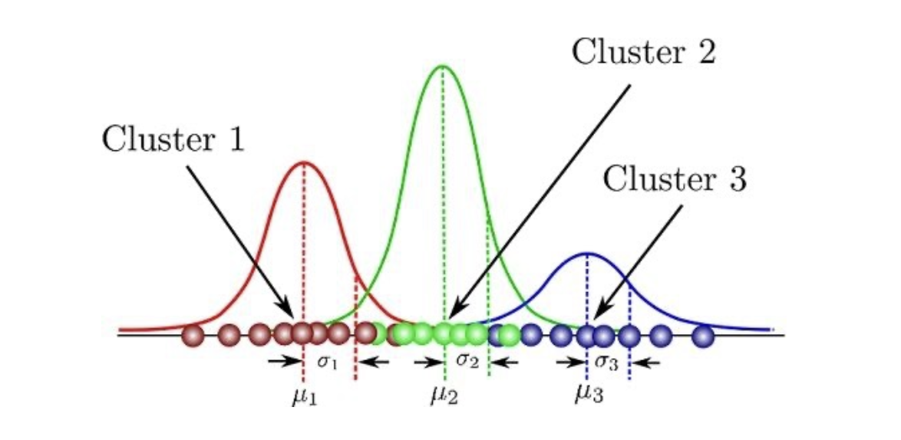

### 분포 선택의 중요성

어떤 분포를 선택하느냐는 매우 중요한 설계 결정입니다. **데이터의 실제 분포를 꼼꼼히 관찰**해야 합니다.

예를 들어, 실제 판매 데이터에서는 **98%의 값이 0인 롱테일 분포(long-tail distribution)**가 나타날 수 있습니다. 이런 경우:

- 가우시안, 감마, 포아송 분포도 사용할 수 있지만
- **영 팽창 음이항 분포(Zero-inflated Negative Binomial, ZINB)**가 더 적합합니다.
  - 많은 0값을 자연스럽게 처리하면서, 양수 값에 대해서도 유연한 분포를 모델링하기 때문입니다.

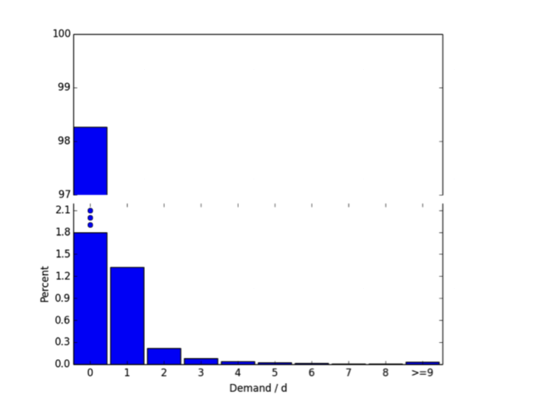

### 데이터 표준화에 대한 주의

실무에서 흔히 쓰이는 **데이터 표준화(standardization)** — 평균을 빼고 표준편차로 나누는 변환 — 은 데이터의 **실제 분포 모양을 바꾸지 않습니다**.

$$z_t \leftarrow \frac{z_t - \text{mean}(\cdot)}{\text{std}(\cdot)}$$

표준화 후 평균이 0이고 분산이 1이 되더라도, 원래 분포가 비대칭이거나 두꺼운 꼬리를 가지고 있다면 그 형태는 그대로 유지됩니다. 잘못된 표준화 방식은 올바른 분포 선택을 방해할 수 있습니다.

### 모수적 분포의 장단점

**장점:**

- 적절한 분포를 선택하면 분위수 회귀보다 더 좋은 성능 가능
- 분포가 **닫힌 형태(closed-form)의 해**를 지원 — 예: "최적 재고량은 얼마인가?" 같은 의사결정 문제에 직접 활용 가능

**단점:**

- 데이터의 분포를 명시적으로 가정해야 함 — 잘못된 가정은 성능 저하
- 분포가 시간에 따라 변하는 경우(non-stationary) 성능이 저하될 수 있음

---

# 3. 최대우도추정 (Maximum Likelihood Estimation)

## MLE의 개념과 학습 절차

분포 기반 모델을 어떻게 학습시킬까요? 점 예측 모델은 MSE 같은 손실 함수를 최소화했지만, 확률 분포를 출력하는 모델에는 다른 학습 방법이 필요합니다. 그것이 바로 **최대우도추정(Maximum Likelihood Estimation, MLE)**입니다.

MLE의 학습 절차는 다음과 같습니다.

1. **Step 1**: $\mathbf{h}_t$를 이용해 분포 $P(z_t | \mathbf{h}_t)$를 추정
2. **Step 2**: 관측된 실제 값 $z_t$에 대한 우도(likelihood) $\mathcal{L}(z_t)$를 계산
3. **Step 3**: $\mathcal{L}(z_t)$를 **최대화**하도록 모수(parameters) 업데이트

실제 사용하는 목적 함수의 구체적인 형태는 가정한 분포에 따라 달라집니다.

---

## 우도 (Likelihood)

데이터 집합 $D$와 모수화된 함수 $f_\theta$가 주어질 때, **우도(likelihood)**는 조건부 확률 $p(D|\theta)$로 정의됩니다.

$$\mathcal{L}(\theta; D) = p(D|\theta)$$

우도가 높을수록 $f_\theta$가 데이터 $D$를 더 잘 설명한다는 의미입니다. 따라서 $f_\theta$의 학습은 $p(D|\theta)$를 증가시키는 방향으로 진행됩니다.

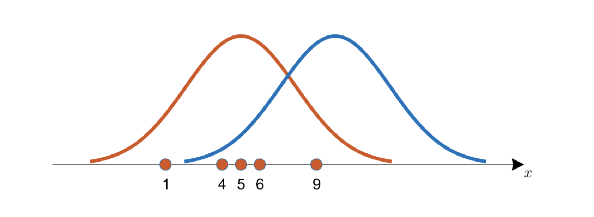

---

## 음의 로그 우도 (Negative Log Likelihood, NLL)

우도를 직접 최대화하는 것보다, **음의 로그 우도(NLL)**를 최소화하는 것이 계산상 더 편리합니다.

유도 과정을 단계별로 살펴보겠습니다. 데이터 $D$의 각 샘플이 독립적으로 생성되었다고 가정합니다(i.i.d. 가정):

$$\theta^* = \underset{\theta}{\text{argmax}}\; p(D|\theta) \tag{우도 최대화 목표}$$

$$= \underset{\theta}{\text{argmax}}\; \prod_{d \in D} p(d|\theta) \tag{샘플 독립성 적용}$$

$$= \underset{\theta}{\text{argmax}}\; \sum_{d \in D} \log p(d|\theta) \tag{$\log\prod = \sum\log$ 성질 활용}$$

$$= \underset{\theta}{\text{argmin}}\; -\sum_{d \in D} \log p(d|\theta) \tag{최소화 손실로 변환}$$

이것이 바로 **NLL 손실 함수**입니다.

> **왜 로그를 취하는가?** 두 가지 실용적 이유가 있습니다.
>
> - **수치 안정성(numerical stability)**: 많은 작은 확률의 곱은 수치 언더플로(underflow)를 일으킬 수 있습니다. 로그를 취하면 곱이 합으로 변환되어 안전합니다.
> - **계산 편의성**: 지수 함수를 포함한 분포(가우시안 등)에서 로그가 깔끔히 정리됩니다.

---

## 가우시안 분포에서의 MLE

### NLL 유도

가우시안 분포를 가정하면, $\mu$와 $\sigma$를 두 projection head로 예측합니다. 가우시안의 PDF는 우도 함수로도 쓰입니다.

$$p(z|\mu, \sigma) = \frac{1}{\sqrt{2\pi\sigma^2}} \exp\!\left(-\frac{(z-\mu)^2}{2\sigma^2}\right)$$

NLL을 단계별로 유도합니다.

$$-\log p(z|\mu, \sigma)$$

$$= -\log\!\left(\frac{1}{\sqrt{2\pi\sigma^2}}\right) + \left(-\log\exp\!\left(-\frac{(z-\mu)^2}{2\sigma^2}\right)\right)$$

$$= \frac{1}{2}\log(2\pi\sigma^2) + \frac{(z-\mu)^2}{2\sigma^2}$$

$$= \underbrace{\frac{(z-\mu)^2}{2\sigma^2}}_{\text{오차 항}} + \underbrace{\frac{1}{2}\log(2\pi\sigma^2)}_{c(\sigma)}$$

이 손실 함수의 두 항이 서로 어떻게 작동하는지 살펴보겠습니다.

- **오차 항** $\frac{(z-\mu)^2}{2\sigma^2}$: 평균 $\mu$를 실제 관측값 $z$ 방향으로 업데이트합니다. 예측 오차가 클수록 손실이 커집니다.

- **정규화 항** $\frac{1}{2}\log(2\pi\sigma^2)$: 표준편차 $\sigma$에 대한 트레이드오프를 형성합니다.
  - $\sigma$가 지나치게 클 경우, 이 항이 커져 페널티를 줍니다 → $\sigma$를 줄이도록 유도
  - 그러나 오차가 작을 때 오차 항을 $\sigma^2$으로 나누면 손실이 작아지므로, $\sigma$를 줄이는 방향으로도 작동

결과적으로 $\sigma$는 **실제 예측 오차에 비례하는 값**으로 자연스럽게 수렴합니다.

### 고정 표준편차 → RMSE와의 동치 관계

만약 $\sigma$를 학습하지 않고 **고정된 상수로 가정**하면 어떻게 될까요?

정규화 항 $\frac{1}{2}\log(2\pi\sigma^2)$이 상수가 되어 모수 최적화에 영향을 주지 않으므로:

$$-\log p(z|\mu) \propto (z-\mu)^2$$

이는 **RMSE(L2) 손실과 완전히 동치**입니다!

$$\mathcal{L}_{\text{MSE}}(\mu; z) = (z - \mu)^2$$

> **핵심 통찰**: **점 예측 모델을 MSE로 학습하는 것은, 가우시안 분포를 고정된 표준편차로 가정한 MLE와 수학적으로 동일합니다.** 즉, 점 예측도 묵시적으로 가우시안 분포 가정을 내포하고 있는 셈입니다.

---

## 임의 태스크로의 일반화

MLE의 아이디어는 시계열 예측을 넘어 **임의의 지도 학습 태스크**에 적용됩니다.

- **기존 관점**: $f_\theta(\mathbf{x}) = \hat{y}$ — $y$에 대한 결정론적(deterministic) 예측
- **새로운 관점**: $f_\theta(\mathbf{x}) = p_\phi(\cdot | y)$ — $y$에 대한 확률 분포

모델 구조 자체는 동일하며, **해석 방식만** 달라집니다.

### 회귀 예시: 사과 가격 예측

사과의 크기 $X_1$과 무게 $X_2$가 주어졌을 때 가격 $y$를 예측하는 문제를 생각해 봅시다.

> **왜 점 예측으로는 부족한가?** 같은 크기와 무게의 사과라도 판매 장소, 계절, 공급 상황에 따라 가격이 다를 수 있습니다. 즉, $y$에 내재적 불확실성(aleatoric uncertainty)이 존재합니다. 따라서 오차를 0으로 만드는 것 자체가 불가능합니다.

대신 **가우시안 분포 $\mathcal{N}(\mu, \sigma)$로 가격을 모델링**합니다.

- $f_\theta$는 두 피처 $X_1, X_2$로부터 평균 $\mu$를 결정합니다 (MSE를 최소화하도록 학습).
- 불확실성 $\sigma$는 새로운 projection head로 추가 모델링할 수 있습니다.

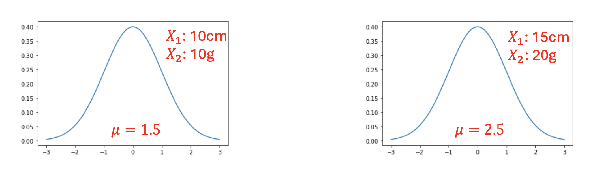

### 지수 분포와 새로운 목적 함수: 제주 감귤 예시

다른 예시로, **제주도에서 감귤의 가격을 예측**해봅시다. 제주도에서는 감귤을 거의 공짜로 얻을 수 있어, 가격 $y$가 **지수 분포(Exponential Distribution)**를 따를 수 있습니다.

지수 분포의 PDF는 다음과 같습니다($y \geq 0$으로 가정):

$$f(y; \lambda) = \lambda\, e^{-\lambda y}$$

평균은 $\frac{1}{\lambda}$이며, 이것이 유일한 모수입니다.

신경망이 평균 $f_\theta(\mathbf{x}) = \frac{1}{\lambda}$를 예측한다고 하면, NLL을 유도할 수 있습니다.

$$-\log f(y; \lambda) = -\log\left(\lambda\, e^{-\lambda y}\right) = -\log\lambda + \lambda y$$

$\lambda = \frac{1}{f_\theta(\mathbf{x})}$로 치환하면:

$$\mathcal{L}(\cdot) = \log f_\theta(\mathbf{x}) + \frac{y}{f_\theta(\mathbf{x})}$$

주목할 점은 이 손실 함수에는 **"예측값과 실제값의 오차"라는 개념이 명시적으로 존재하지 않는다**는 것입니다. 이는 지수 분포의 특성상 평균이 척도 모수(scale parameter)와 직접 연결되기 때문입니다.

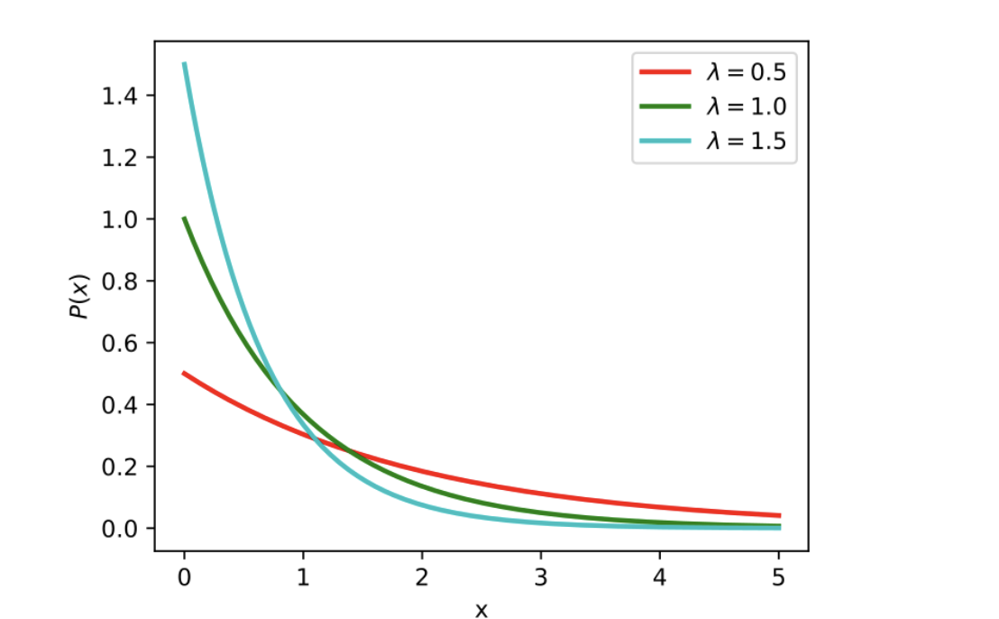

> **핵심 통찰**: **사용하는 분포가 달라지면 손실 함수도 달라집니다.** 가우시안 → MSE류 손실, 지수 분포 → 완전히 다른 형태의 손실. 이것이 분포 선택의 중요성을 보여주는 또 하나의 강력한 근거입니다.

---

# 마무리 요약

이번 강의에서는 세 가지 핵심 주제를 다루었습니다.

**1. 순환 신경망 (RNN)**

- 선형 회귀 → MLP, SSM → RNN으로의 자연스러운 일반화 흐름
- RNN은 비선형 활성화 함수 $\sigma$로 상태 전이를 수행하여 강한 표현력 확보
- 마지막 은닉 상태에 projection head를 붙여 예측 수행
- 단, 시퀀스가 길어지면 그래디언트 소실/폭발 문제가 발생할 수 있음

**2. 확률적 예측 (Probabilistic Forecasting)**

- 목표: 단일 점 예측 → 미래 분포 $P(z_t|\mathbf{h}_t)$ 추정
- **분위수 회귀**: 분포 가정 없이 다양한 신뢰 구간을 직접 예측 / 비대칭 핀볼 손실 사용 / 불연속적
- **모수적 분포**: 가우시안, 음이항, MoG 등 분포를 직접 모델링 / 분포 선택이 핵심 / 닫힌 형태 해석 가능

**3. 최대우도추정 (MLE)**

- NLL로 분포 기반 모델 학습
- 가우시안 + 고정 $\sigma$ → MSE(L2 손실)와 수학적으로 동치
- 분포에 따라 손실 함수 형태가 달라짐 — 지수 분포는 오차 기반 손실과 근본적으로 다른 형태

| 방법 | 가정 | 장점 | 단점 |
|------|------|------|------|
| 분위수 회귀 | 없음 | 직관적, distribution-free | 불연속, head 수 많음 |
| 모수적 분포 | 분포 형태 명시 | 성능↑, closed-form 해 | 잘못된 가정 시 성능↓ |
| 점 예측 (MSE) | 가우시안 + 고정 σ | 단순, 해석 쉬움 | 불확실성 정량화 불가 |
