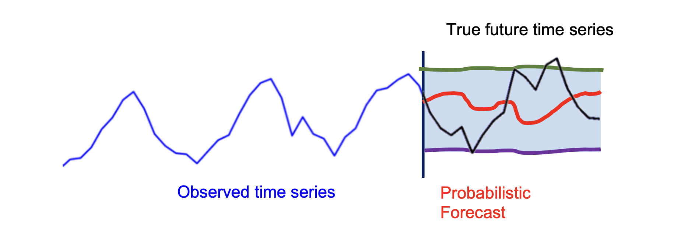
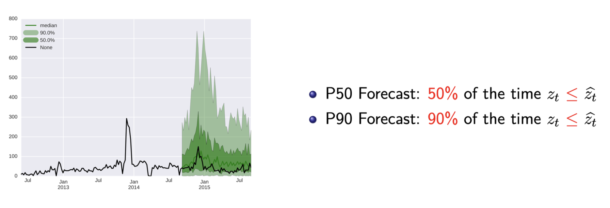
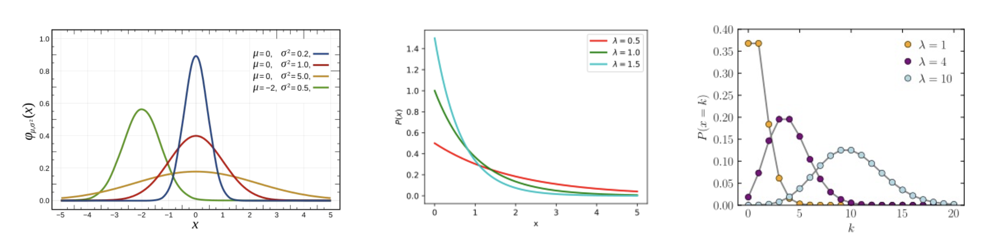
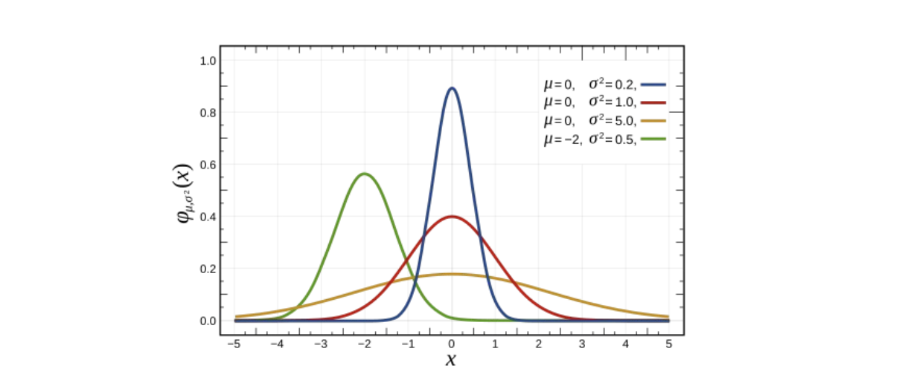
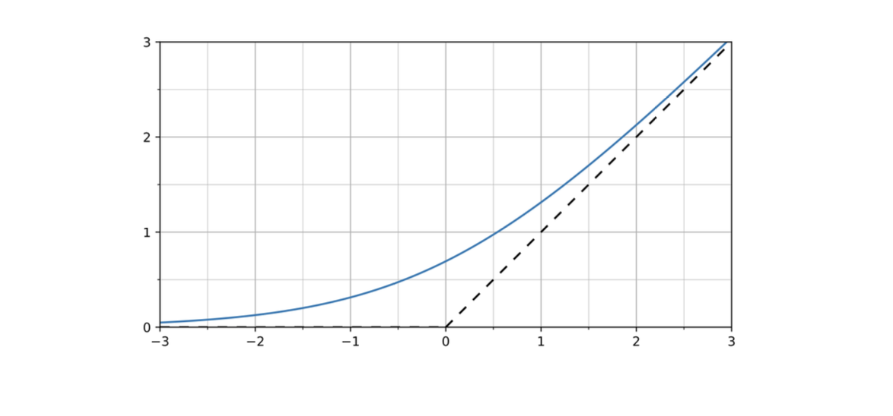
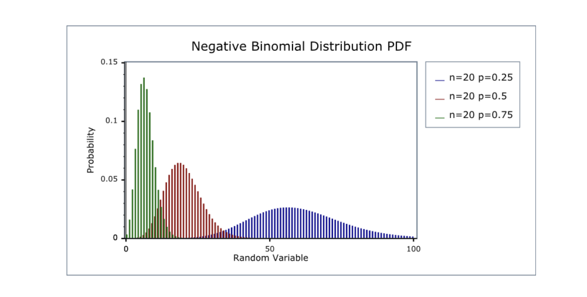

# 1. 단일 예측에서 확률적 예측(Probabilistic Forecasts)으로

* 이전 포스트에서는 시계열 데이터의 순차적(sequential) 특징을 모델링하기 위해 다층 퍼셉트론(MLP)에서 순환 신경망(RNN)으로 확장하는 과정을 다루었습니다. 하지만 현실의 시계열 예측 문제에서는 단순히 미래의 특정 시점 $t$에 대한 단일 예측값(single prediction) $\hat{z}_{t}$를 도출하는 것만으로는 충분하지 않은 경우가 많습니다. 

* 불확실성이 존재하는 실제 환경에서는 미래 값의 **확률 분포(distribution) $P(z_{t})$ 자체를 추정**하는 것이 궁극적인 목표가 됩니다. 이러한 접근 방식을 **확률적 예측(Probabilistic Forecasting)**이라고 합니다. 본 포스트에서는 계산의 편의를 위해 1-step 예측($h=1$) 상황을 가정하고 논의를 진행하겠습니다.

---

# 2. 신경망 구조의 재구성: Encoder와 Projection Head

* 딥러닝을 활용해 확률적 예측을 수행하려면 기존 신경망의 구조를 어떻게 변경해야 할까요? RNN을 포함한 모든 딥러닝 기반 예측 모델은 크게 두 부분으로 나누어 볼 수 있습니다.
  * 1.  **인코더 (Encoder):** 입력 데이터를 처리하여 유용한 잠재 표현(representation) $h$를 생성하는 역할을 합니다. 이는 신경망의 마지막 직전 층(penultimate layer)까지의 연산을 포함합니다.
  * 2.  **프로젝션 헤드 (Projection Head):** 인코더가 추출한 $h$를 우리가 원하는 최종 예측값으로 변환(converting)합니다. 일반적으로는 $\hat{y} = Wh + b$ 형태의 선형 맵핑(Linear mapping)이 사용됩니다.

* 확률적 예측을 위해 신경망 전체 구조를 바꿀 필요는 없습니다. 인코더가 생성한 요약 벡터 $h_{t}$가 주어졌을 때, 미래 값의 조건부 분포 $P(z_{t}|h_{t})$를 모델링할 수 있도록 **프로젝션 헤드(Projection Head)만을 수정**하는 것이 훨씬 효율적인 접근 방식입니다.

* 딥러닝 모델에서 확률적 예측을 구현하는 대표적인 방법론으로는 **분위수 회귀(Quantile Regression)**와 **파라메트릭 분포(Parametric Distribution)** 방법이 있습니다.

---

# 3. 접근법 1: 분위수 회귀 (Quantile Regression)

## 3.1. 분위수 예측의 개념

* 분위수 회귀의 핵심 아이디어는 각기 다른 신뢰 수준(confidence levels)을 가진 여러 개의 예측값을 생성하는 것입니다. 

* 특정 분위수 $x$에 대한 예측값을 $\hat{z}_{t}^{x}$라고 할 때, $P_{x}$ 예측(forecast)이 의미하는 바는 실제 관측치 $z_{t}$가 $\hat{z}_{t}^{x}$보다 작거나 같을 확률이 **x%**라는 것입니다.

* **P50 Forecast:** 전체 시간의 **50%** 동안 $z_{t} \le \hat{z}_{t}$가 성립합니다. 이는 곧 예측의 중앙값(median)을 의미하며, 분포의 최빈값(가장 발생 확률이 높은 값)을 의미하는 것은 아닙니다.
* **P90 Forecast:** 전체 시간의 **90%** 동안 $z_{t} \le \hat{z}_{t}$가 성립합니다.

* 분위수의 통계적 정의에 따라, $a < b$일 때 $\hat{z}_{t}^{a} < \hat{z}_{t}^{b}$가 자연스럽게 성립할 것으로 기대할 수 있습니다.

## 3.2. 다중 프로젝션 헤드 (Multiple Projection Heads)

* 다양한 분위수(예: $q \in \{0.01, 0.1, 0.3, \dots, 0.99\}$)를 한 번에 예측하기 위해, 인코더에서 나온 동일한 은닉 상태(encoded state) $h_{t}$를 공유하되 **각 분위수 $q$마다 서로 다른 선형 맵핑(가중치 $w_{q}$)을 적용하는 다중 프로젝션 헤드**를 구성합니다.

$$\hat{z}_{t}^{q} = w_{q}^{\top} h_{t}$$

## 3.3. 비대칭 분위수 손실 함수 (Asymmetric Quantile Loss)

* 여러 개의 분위수를 동시에 올바르게 학습시키기 위해서는 모델 파라미터 $\theta$를 최적화할 새로운 목적 함수(Objective Function) $\mathcal{L}(\theta)$가 필요합니다. 이는 각 분위수별 손실의 합으로 정의됩니다.

$$\mathcal{L}(\theta) = \sum_{q} loss_{q}(\hat{z}_{t}^{q})$$

* 여기서 각 $loss_{q}$는 **비대칭 분위수 손실(Asymmetric quantile loss)** 혹은 핀볼 손실(Pinball loss)이라고 불리며 다음과 같이 정의됩니다.

$$loss_{q}(\hat{z}_{t}^{q}) = \begin{cases} q \cdot (z_{t} - \hat{z}_{t}^{q}) & \text{if } z_{t} > \hat{z}_{t}^{q} \\ (1-q) \cdot (\hat{z}_{t}^{q} - z_{t}) & \text{if } z_{t} < \hat{z}_{t}^{q} \end{cases}$$

* 이 수식은 예측값 $\hat{z}_{t}^{q}$가 실제값 $z_{t}$를 과소 추정했을 때와 과대 추정했을 때, $q$의 값에 따라 패널티를 비대칭적으로 부여함으로써 모델이 정확한 분위수 지점을 찾아가도록 유도합니다.

## 3.4. 분위수 회귀의 장단점

* **장점 (Pros):** 데이터가 따르는 특정 분포를 명시적으로 가정하고 모델링할 필요가 없습니다. 또한, 도출된 결과가 특정 신뢰 구간으로 바로 해석(interpretable) 가능하다는 실무적 이점이 있습니다.
* **단점 (Cons):** 예측 결과가 연속적인 확률 분포(continuous representation) 형태를 지원하지 않습니다. 부드럽고 촘촘한 분포 형태를 추정하려면 매우 많은 수의 프로젝션 헤드가 필요하여 연산 비효율이 발생합니다.

---

# 4. 접근법 2: 파라메트릭 분포 (Parametric Distribution)

* 분위수 회귀의 단점을 극복하기 위한 두 번째 접근법은 파라메트릭 분포(Parametric Distribution)를 활용하는 것입니다. 이 아이디어는 조건부 분포 $P(z_{t}|h_{t})$가 가우시안(Gaussian) 정규분포와 같은 **명시적이고 잘 알려진 통계적 분포를 따른다고 가정**하는 데서 출발합니다.

* 이 방식에서 프로젝션 헤드의 반환값은 직접적인 예측값이 아닙니다. 대신, **가정한 분포의 파라미터(예: 평균, 분산 등)를 반환**하게 됩니다.

## 4.1. 가우시안 분포 (Gaussian Distribution)의 적용

* 만약 $P(z_{t}|h_{t})$가 가우시안 분포를 따른다고 가정한다면, 이 분포의 확률 밀도 함수(PDF, Probabilistic density function)는 다음과 같습니다.

$$f(x) = \frac{1}{\sqrt{2\pi\sigma^{2}}} \exp\left(-\frac{(x-\mu)^{2}}{2\sigma^{2}}\right)$$

* 우리의 목표는 잠재 상태 $h_{t}$로부터 가우시안 분포를 결정짓는 두 파라미터인 평균 $\mu$와 분산 $\sigma^{2}$ (혹은 표준편차 $\sigma$)를 생성하여 $P(z_{t}|h_{t})$를 정의하는 것입니다. 이를 위해 다음과 같이 두 개의 독립적인 프로젝션 헤드를 설계합니다.
  * **평균 추정:** $\mu(h_{t}) = w_{\mu}^{\top} h_{t}$ (실수 전체 범위를 가질 수 있으므로 일반 선형 결합 사용)
  * **표준편차 추정:** $\sigma(h_{t}) = \text{softplus}(w_{\sigma}^{\top} h_{t})$

* 여기서 표준편차 $\sigma$는 통계적 정의상 항상 양수여야 합니다. 이를 보장하기 위해 출력층에 **Softplus 함수** $f(x) = \log(1+e^{x})$를 적용하여 네트워크 출력이 항상 0보다 큰 양수 값을 갖도록 강제합니다.

$$P(z_{t}|h_{t}) = \mathcal{N}(z_{t}|\mu(h_{t}), \sigma^{2}(h_{t}))$$

## 4.2. 음이항 분포 (Negative Binomial Distribution)

* 시계열 데이터가 수요량(demand)이나 판매량처럼 양수(Positive side)에만 집중되어 있고 이산적인(discrete) 특성을 띨 때는 가우시안보다 음이항 분포(Negative binomial distribution)가 더 적합할 수 있습니다.

$$P(z_{t}|h_{t}) = NB(z_{t}|\mu(h_{t}), \alpha(h_{t}))$$

* 음이항 분포를 위한 두 파라미터 $\mu$와 $\alpha$ 역시 양수 제약 조건을 만족해야 하므로, 두 프로젝션 헤드 모두에 softplus 활성화 함수를 통과시킵니다.
  * $\mu(h_{t}) = \text{softplus}(w_{\mu}^{\top} h_{t})$
  * $\alpha(h_{t}) = \text{softplus}(w_{\alpha}^{\top} h_{t})$

## 4.3. 가우시안 혼합 모델 (Mixture of Gaussians, MoG)

* 데이터의 분포가 단일 봉우리(unimodal)가 아닌 복잡한 다봉형(multimodal) 형태를 가질 경우, 여러 개의 분포를 혼합한 가우시안 혼합 모델(Mixture of distributions)을 사용할 수 있습니다. 

* 여러 분포를 혼합하기 위해서는 데이터가 어느 군집(Cluster)에 속할지를 결정하는 '소속 확률 파라미터(membership parameter)' $\pi$가 추가로 필요합니다. $K$개의 군집을 가정할 때 혼합 분포는 다음과 같이 정의됩니다.

$$P(z_{t}|h_{t}) = \sum_{k=1}^{K} \pi_{k} \mathcal{N}(z_{t}|\mu_{k}(h_{t}), \sigma_{k}^{2}(h_{t}))$$

* 각 파라미터를 추정하는 프로젝션 헤드의 수식은 아래와 같습니다.
  * $\pi = \text{softmax}(W_{\pi} h_{t})$ (확률의 합이 1이 되어야 하므로 softmax 적용)
  * $\mu_{k}(h_{t}) = w_{\mu_{k}}^{\top} h_{t}$
  * $\sigma_{k}(h_{t}) = \text{softplus}(w_{\sigma_{k}}^{\top} h_{t})$

---

# 5. 실무적 고려사항: 데이터 분포 확인 및 표준화의 함정

## 5.1. 올바른 분포의 선택 (Choice of Distributions)

* 파라메트릭 접근법에서는 데이터 분포를 면밀히 관찰하여 적합한 분포를 선택하는 것이 매우 중요합니다. 

* 위 그림처럼 실제 산업 현장의 판매량(sales) 데이터 등을 분석해보면, 값이 0인 데이터가 전체의 **98%**를 차지하는 등 극단적인 '롱테일(long-tail)' 형태를 보일 때가 많습니다. 이 경우 단순한 가우시안이나 푸아송 분포보다는, **영과잉 음이항 분포 (Zero-inflated negative binomial)**를 선택하는 것이 압도적으로 나은 모델링 결과를 가져옵니다.

## 5.2. 표준화 (Standardization)의 한계

* 시계열 데이터 전처리 시 $z_{t} \leftarrow \frac{z_{t} - \text{mean}(\cdot)}{\text{std}(\cdot)}$ 식을 통해 모든 값의 평균을 0, 분산을 1로 맞추는 표준화(Standardization)를 널리 수행합니다.

* 하지만 주의할 점은, **데이터를 표준화한다고 해서 데이터의 실제 분포 형태(shape) 자체가 정규분포(normal distribution)로 변하는 것은 아니라는 점입니다**. 잘못된 정규화(Bad normalization)는 오히려 본래 데이터의 특성을 왜곡하여, 모델링에 적합한 좋은 분포를 선택하는 것을 어렵게 만들 수 있습니다.

## 5.3. 파라메트릭 분포 모델의 장단점 요약

* **장점 (Pros):**
    * 데이터의 특성에 맞는 적절한 분포를 선택했을 때 모델의 예측 성능이 뛰어납니다.
    * 예측된 분포가 닫힌 형태의 해(closed-form solutions)를 지원하므로, 재고 관리 최적화('최적의 구매 물품 수량은 얼마인가?') 등 응용 문제에 수학적으로 바로 적용할 수 있습니다.
* **단점 (Cons):**
    * 데이터가 어떤 분포를 따르는지 사전에 명시적으로 가정해야 하는 부담이 있습니다.
    * 시간이 지남에 따라 데이터의 근본적인 분포 자체가 변한다면, 과거에 맞춘 분포 모델이 더 이상 작동하지 않을 위험이 큽니다.