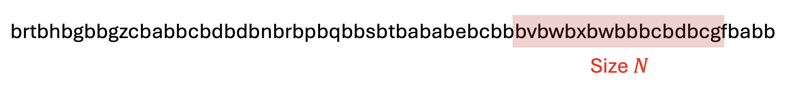
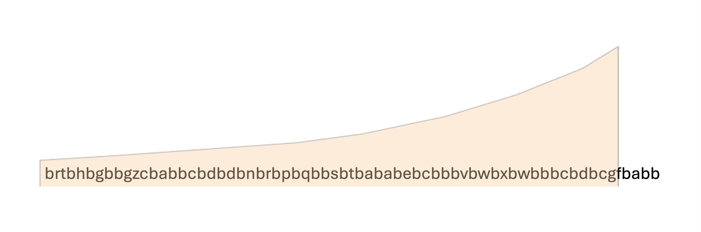

## 강의 개요

이번 강의는 **데이터 스트림(Data Stream)** 처리의 두 번째 파트입니다. 지난 강의에서 스트림 샘플링과 블룸 필터를 통한 필터링을 다뤘다면, 이번에는 더 복잡한 세 가지 분석 문제를 다룹니다.

1. **고유 원소 개수 세기(Counting Distinct Elements)**: 스트림에서 몇 종류의 원소가 등장했는지 메모리 효율적으로 추정
2. **최근 가장 빈번한 항목 세기(Counting Most-Common Recent Items)**: 최근 데이터에 가중치를 두어 현재 인기 항목을 추적
3. **행렬 스케칭(Matrix Sketching)**: 스트림으로 들어오는 고차원 행렬을 효율적으로 압축하여 랭크-$k$ 근사를 유지

세 문제 모두 **무한한 스트림을 제한된 메모리로 처리**해야 한다는 근본적인 제약을 공유합니다. 각 알고리즘이 이 제약을 어떻게 근사(approximation) 또는 확률적 보장(probabilistic guarantee)으로 극복하는지 살펴봅니다.

---

# 1. 고유 원소 개수 세기 (Counting Distinct Elements)

## 1.1 문제 정의 및 응용

**문제 설정**은 다음과 같습니다.

- 크기 $N$의 전체 집합(universal set)에서 원소들이 하나씩 도착하는 스트림이 주어집니다.
- 지금까지 관찰한 원소들 중 **고유한(distinct) 원소의 수**를 추정해야 합니다.

가장 직관적인 접근은 등장한 모든 원소를 해시 테이블에 저장하는 것입니다. 그러나 고유 원소가 수백만, 수십억 개라면 메모리가 부족해집니다. 우리는 훨씬 작은 공간으로 **근사값**을 구해야 합니다.

**대표적인 응용 사례**:

- **웹사이트 순방문자 수 추정**: 전체 집합 = 모든 사용자, 스트림 원소 = 로그인 이벤트. 이번 달에 몇 명의 고유한 사용자가 방문했는지 파악합니다.
- **판매된 고유 상품 종류 파악**: 전체 집합 = 전체 상품 목록, 스트림 원소 = 개별 판매 이벤트. 지난 한 주 동안 몇 종류의 상품이 팔렸는지 추적합니다.

## 1.2 Flajolet-Martin 알고리즘

### 핵심 아이디어

**Flajolet-Martin 알고리즘**의 핵심 발상은 다음과 같습니다.

- 각 원소를 해시 함수(hash function)로 **충분히 긴 이진 문자열(bit string)**에 매핑합니다.
- 이진 문자열들의 "다양성(diversity)"이 고유 원소의 수와 비례한다는 점을 활용합니다.
- **다양성의 척도**: 지금까지 본 모든 이진 문자열에서 **후행 0(trailing zeros)의 최대 개수**

직관: 고유 원소가 많을수록 다양한 해시값이 나오고, 그 중에는 긴 연속 0을 가진 해시값이 등장할 가능성이 높아집니다.

### 알고리즘 단계

**Step 1. 해시 함수 $h$ 선택**

원소 $a$를 이진 문자열로 변환하는 해시 함수 $h$를 선택합니다.

- 전체 집합 $N$개의 원소를 서로 다른 값에 매핑하려면 최소 $\log_2 N$ 비트가 필요합니다.
- 예: $N = 16$이면 4비트로 충분. $h(a) = 1100$

**Step 2. 후행 0의 개수 $r(a)$ 계산**

$$r(a) = \text{해시값 } h(a) \text{의 뒤에서부터 연속된 0의 개수}$$

- 예: $h(a) = 1100$ → $r(a) = 2$
- 예: $h(a) = 1010$ → $r(a) = 1$
- 예: $h(a) = 1000$ → $r(a) = 3$

**Step 3. 최댓값 $R$ 유지**

$$R = \max_{a \,\text{seen so far}} r(a)$$

스트림을 처리하면서 지금까지 관찰된 모든 $r(a)$ 값의 최댓값을 단 하나의 변수 $R$에 저장합니다.

**추정치**: 고유 원소의 수 $\approx 2^R$

## 1.3 왜 작동하는가? — 수학적 분석

### 직관적 설명

해시 함수 $h$가 원소 $a$를 $N$개의 값 중 하나에 **균등 확률**로 매핑한다고 가정합니다. 이때:

$$\Pr[\text{후행 0이 정확히 } k \text{개}] = \frac{1}{2^k} - \frac{1}{2^{k+1}} = \frac{1}{2^{k+1}}$$

$$\Pr[\text{후행 0이 } k \text{개 이상}] = \frac{1}{2^k}$$

이를 구체적으로 해석하면:

- 약 **50%**의 원소가 `***0` 꼴의 해시값을 가집니다 ($k \geq 1$).
- 약 **25%**의 원소가 `**00` 꼴을 가집니다 ($k \geq 2$).
- 약 **12.5%**의 원소가 `*000` 꼴을 가집니다 ($k \geq 3$).
- 따라서 후행 0이 $k$개인 해시값을 처음 보려면, 평균적으로 **약 $2^k$개의 서로 다른 원소**를 봐야 합니다.

결론: $R = k$가 관찰되었다는 것은 **고유 원소 수 $m \approx 2^k$**임을 암시합니다.

### 엄밀한 수학적 분석

고유 원소 수를 $m$이라 할 때, **후행 0이 $k$개 이상인 해시값이 적어도 하나 존재할 확률**은 다음과 같습니다.

$$\Pr[R \geq k] = 1 - \left(1 - \frac{1}{2^k}\right)^m$$

*유도*:

- $\left(1 - \frac{1}{2^k}\right)$: 특정 원소 하나의 해시값이 후행 0을 $k$개 갖지 **않을** 확률
- $\left(1 - \frac{1}{2^k}\right)^m$: $m$개의 독립적인 원소들 중 **어느 것도** $k$개 이상의 후행 0을 갖지 않을 확률
- 여사건(complement)을 취하면 위의 식을 얻습니다.

**근사 과정**: $(1 + x/n)^n \to e^x$ 성질을 활용하여 $2^k$가 클 때 근사합니다.

$$1 - \left(1 - \frac{1}{2^k}\right)^m = 1 - \underbrace{\left[\left(1 - \frac{1}{2^k}\right)^{2^k}\right]^{m/2^k}}_{\approx\, e^{-1} \text{ 의 } m/2^k \text{ 거듭제곱}} \approx 1 - e^{-m/2^k}$$

여기서 $\lim_{n \to \infty}(1 - 1/n)^n = e^{-1}$을 이용했습니다.

**해석 표**:

| 조건 | $\Pr[R \geq k]$ | 의미 |
|:---|:---|:---|
| $2^k \ll m$ | $\approx 1 - e^{-\infty} = 1$ | 이미 후행 0이 $k$개짜리를 봤을 것 |
| $2^k \approx m$ | $\approx 1 - e^{-1} \approx 0.63$ | 전환 구간 |
| $2^k \gg m$ | $\approx 1 - e^{0} = 0$ | 아직 그런 해시값 없음 |

따라서 $\Pr[R \geq k]$는 $2^k \approx m$ 근방에서 1에서 0으로 급격히 전환되고, **$R$은 $\log_2 m$ 근방에서 안정화**됩니다. 결국 $2^R$이 $m$의 합리적인 추정치가 됩니다.

## 1.4 한계 및 개선 방안

**한계**: $\mathbb{E}[2^R]$은 실제로 **무한대(infinite)**입니다.

- $R$이 $k$에서 $k+1$로 증가할 확률은 절반씩 줄어들지만, 추정값 $2^k$는 두 배로 뜁니다.
- 두 효과가 상쇄되어 기댓값이 발산합니다.
- 전형적으로 $2^R \approx m$이지만, **드물게 크게 튀어** 추정치가 매우 불안정해질 수 있습니다.

**해결책: 여러 해시 함수 사용**

- 독립적인 해시 함수 $h_1, h_2, \ldots, h_t$를 사용하여 각각 $R_1, R_2, \ldots, R_t$를 계산합니다.
- 이 값들을 **robust한 방법으로 결합**합니다. 예를 들어, 값들을 여러 그룹으로 나누어 각 그룹의 평균을 취한 뒤, 그 평균들의 **중앙값(median)**을 최종 추정치로 사용합니다.
- 중앙값은 극단값(outlier)에 강건하여 $2^R$이 튀는 문제를 효과적으로 억제합니다.

---

# 2. 최근 가장 빈번한 항목 세기 (Counting Most-Common Recent Items)

## 2.1 문제 정의

**목표**: 스트림에서 **최근에 가장 자주 등장한 항목**을 효율적으로 추적합니다.

**응용 사례**:

- 영화 티켓 판매 스트림 → 현재 가장 인기 있는 영화는 무엇인가?
- 아마존 상품 판매 스트림 → 최근 가장 많이 팔린 상품은 무엇인가?
- 트위터 트윗 스트림 → 현재 가장 활발히 트윗하는 사용자는 누구인가?

이 문제의 핵심 도전은 **"최근(recent)"**의 정의입니다.

**슬라이딩 윈도우(Sliding Window) 방식**:

- 가장 최근 $N$개의 원소만을 고려합니다.
- 한계: 윈도우 내부와 외부를 **날카롭게(sharply) 이분**합니다. 윈도우 경계에서 한 칸 밖의 원소는 완전히 무시되지만, 경계 안의 원소는 시간에 상관없이 동일한 가중치를 가집니다. 이는 "최근성"을 부자연스럽게 반영합니다.

## 2.2 지수 감쇠 윈도우 (Exponentially Decaying Window)

**해결책**: 슬라이딩 윈도우 대신, 스트림의 **모든 원소를 포함하되 과거 원소일수록 가중치를 지수적으로 감쇠**시킵니다. 이를 **지수 감쇠 윈도우(Exponentially Decaying Window)**라 합니다.

- 경계가 없으므로 날카로운 구분이 사라집니다.
- 가장 최근 원소가 가장 큰 영향력을 가집니다.
- 오래된 원소의 영향은 시간이 지남에 따라 자연스럽게 줄어듭니다.

## 2.3 개별 항목 카운팅

### 이진 스트림으로 변환

각 항목 $i$에 대해, 원래 스트림을 다음과 같은 **이진 스트림(binary stream)**으로 변환합니다.

$$a_t = \begin{cases} 1 & \text{if } x_t = i \\ 0 & \text{otherwise} \end{cases}$$

예를 들어 전체 스트림이 `b r t b h b g ···`라면, 항목 `b`에 대한 이진 스트림은 `1 0 0 1 0 1 0 ···`이 됩니다. 항목의 수만큼 이진 스트림이 병렬로 존재하는 셈입니다.

### 가중 카운트(Weighted Count) 정의

감쇠 상수 $c$ ($0 < c \ll 1$, 예: $c = 10^{-6}$ 또는 $c = 10^{-7}$)를 사용하여, 시각 $t$에서 항목 $i$의 **가중 카운트**를 다음과 같이 정의합니다.

$$f_t(i) = \sum_{j=1}^{t} a_j \cdot (1 - c)^{t-j}$$

$$= a_t \cdot (1-c)^0 + a_{t-1} \cdot (1-c)^1 + a_{t-2} \cdot (1-c)^2 + \cdots + a_1 \cdot (1-c)^{t-1}$$

- 가장 최근 시각($j=t$)의 기여는 $(1-c)^0 = 1$로 최대입니다.
- $k$ 시각 전의 기여는 $(1-c)^k$로, 시간이 지날수록 지수적으로 감소합니다.
- $c$가 작을수록(예: $10^{-6}$) 과거 정보가 오래 유지됩니다.

### 재귀적 업데이트 공식

$f_t(i)$의 정의식을 펼쳐보면, 시각 $t+1$에서의 가중 카운트는 다음과 같이 **$O(1)$ 시간에 점진적으로 업데이트** 할 수 있습니다.

$$f_{t+1}(i) = (1-c) \cdot f_t(i) + a_{t+1}$$

*유도*: $f_{t+1}(i) = a_{t+1} + \sum_{j=1}^{t} a_j \cdot (1-c)^{t+1-j} = a_{t+1} + (1-c) \sum_{j=1}^{t} a_j \cdot (1-c)^{t-j} = a_{t+1} + (1-c) f_t(i)$.

이 공식 덕분에 전체 히스토리를 저장하지 않고도, 현재 값 $f_t(i)$ 하나만 유지하면서 슬라이딩 방식으로 효율적인 카운팅이 가능합니다.

## 2.4 카운터 수의 이론적 상한

### 문제: 모든 항목 추적의 비실용성

전체 집합의 크기 $N$이 매우 크다면, 모든 항목의 카운터를 유지하는 것은 현실적으로 불가능합니다. 핵심 관찰을 통해 **실제로 추적해야 하는 항목 수가 제한적**임을 보입니다.

### 전체 가중치 합의 상한

어떤 시각 $t$에서도 모든 항목에 걸친 가중치의 합은 다음과 같이 유계됩니다.

$$\sum_{i} f_i(t) \leq \sum_{j=0}^{\infty} (1-c)^j = \frac{1}{1-(1-c)} = \frac{1}{c}$$

*증명 아이디어*: 각 시각에 최대 하나의 이진 스트림에서 $a_t = 1$이 발생하므로, 전체 가중치 합의 증분은 1을 넘지 않습니다. 이전 모든 가중치는 $(1-c)$배 감소하므로, 전체 합은 등비급수의 합 $1/c$를 초과하지 않습니다.

### 인기 있는 항목 수의 상한

임계값 $\theta$를 설정하여 $f_t(i) > \theta$인 항목을 **인기 항목**이라 정의합니다. 인기 항목의 수를 $K$라 하면:

$$K \cdot \theta < \sum_{i} f_i(t) < \frac{1}{c} \implies K < \frac{1}{c \cdot \theta}$$

**구체적 예시**: 임계값 $\theta = 1/2$로 설정하면:

$$K < \frac{1}{c \cdot (1/2)} = \frac{2}{c}$$

$c = 10^{-6}$이면 최대 $2 \times 10^6$개의 항목만 추적하면 됩니다. $N$이 수십억 수준이더라도 이는 훨씬 작은 수입니다. 이것이 **메모리 사용량을 $O(N)$에서 $O(1/c)$로 줄이는** 핵심 관찰입니다.

## 2.5 제안된 알고리즘

가중치가 $1/2$를 초과하는 인기 항목을 찾는 알고리즘은 다음과 같습니다.

**초기화**:

- $2/c$개의 카운터를 준비하고 모두 0으로 초기화합니다.

**각 시각 $t$에 원소 $x_t$ 도착 시**:

1. **모든 카운터에 $(1-c)$를 곱합니다** (과거 데이터 감쇠 반영).
2. $x_t$가 이미 카운터에 존재한다면 → 해당 카운터를 $1$ 증가시킵니다.
3. 값이 $1/2$ 미만인 모든 카운터 항목을 **삭제**합니다.
4. $x_t$가 카운터에 없다면 → 빈 카운터 슬롯에 $x_t$를 추가하고 값을 $1$로 설정합니다.

**출력**:

- 현재 카운터에 존재하는 항목들이 가장 빈번한 최근 항목들의 후보입니다.

앞서 증명한 상한에 의해 카운터의 항목 수가 항상 $2/c$ 이하임이 보장되므로, 알고리즘은 $O(1/c)$ 공간만 사용합니다.

## 2.6 알고리즘의 한계: 거짓 음성(False Negative) 가능성

**Q**: 이 알고리즘은 가중치 $> 1/2$인 모든 항목을 반드시 찾을 수 있는가?

**A**: **아닙니다.** 거짓 음성(false negative)이 발생할 수 있습니다.

**반례 구성**: $f_t(i)$를 시각 $t-s$를 경계로 두 파트로 분해합니다.

$$f_t(i) = \underbrace{f_{t:t-s+1}(i)}_{\text{최근 } s \text{개 기여}} + \underbrace{(1-c)^s \cdot f_{t-s}(i)}_{\text{그 이전 기여 (감쇠 반영)}}$$

다음 두 조건이 동시에 성립하는 상황을 생각해봅니다.

- $f_{t-s}(i) < 1/2$ → 시각 $t-s$에서 카운터가 삭제됨.
- $f_{t:t-s+1}(i) < 1/2$ → 최근 $s$개의 새로운 기여분도 아직 $1/2$에 미치지 못함.

그럼에도 두 파트의 합 $f_t(i) > 1/2$가 되는 경우, 항목 $i$는 실제로 인기 항목이지만 알고리즘의 카운터에서 탈락한 상태입니다. 이처럼 거짓 음성이 발생할 수 있다는 점이 이 알고리즘의 근본적인 한계입니다.

---

# 3. 행렬 스케칭 (Matrix Sketching)

## 3.1 배경: 스트리밍 행렬 데이터

많은 실제 문제에서 데이터를 행렬 $A \in \mathbb{R}^{n \times d}$로 표현합니다.

- $n$: 샘플(관측치)의 수
- $d$: 변수(특성)의 수. 일반적으로 $n \gg d$

데이터 행렬이 **스트리밍 방식**으로 관찰되는 경우가 많습니다.

- 각 시각에 크기 $d$의 행 벡터(row vector) $a_i \in \mathbb{R}^d$가 하나씩 도착합니다.
- 예: 여러 센서가 동시에 $d$차원의 측정값을 생성하고, 각 시각의 측정값이 한 행으로 누적되는 경우

**핵심 질문**: 전체 $n \times d$ 행렬 $A$를 메모리에 올릴 수 없을 때, 스트리밍 방식으로 어떻게 **좋은 근사(approximation)**를 유지할 수 있는가?

## 3.2 복습: 랭크-$k$ 근사와 SVD

**랭크-$k$ 근사(Rank-$k$ Approximation)**: 행렬 $A \in \mathbb{R}^{n \times d}$에 대해, 랭크(rank)가 $k$ 이하이면서 Frobenius 노름 의미에서 $A$를 가장 잘 근사하는 행렬 $B$를 찾는 문제입니다.

**SVD(Singular Value Decomposition)**는 이 문제의 정확한 최적해를 제공합니다.

$$A \approx B = U_k S_k V_k^\top$$

- $U_k \in \mathbb{R}^{n \times k}$: 왼쪽 특이 벡터(left singular vectors) — 샘플 공간에서의 방향
- $S_k \in \mathbb{R}^{k \times k}$: 특이값 대각 행렬, $S_1 \geq S_2 \geq \cdots \geq S_k > 0$
- $V_k \in \mathbb{R}^{d \times k}$: 오른쪽 특이 벡터(right singular vectors) — 특성 공간에서의 방향

**스트리밍 환경의 문제**: 전체 $A$를 저장하지 않으므로 SVD를 직접 계산할 수 없습니다. 대신 **스케치 행렬(sketch matrix)** $B \in \mathbb{R}^{\ell \times d}$ ($\ell \ll n$)를 구성하여 $A$를 근사합니다. $B$는 SVD의 $V_k^\top \in \mathbb{R}^{k \times d}$와 유사한 역할, 즉 **특성 공간에서의 주요 방향들**을 포착합니다.

## 3.3 행 샘플링과 CUR 분해의 관계

행 샘플링은 **CUR 분해(CUR Decomposition)**와 유사한 발상에서 출발합니다.

- **CUR 분해**: $A \approx CUR$이 되도록 $C$($A$의 열 샘플)와 $R$($A$의 행 샘플), 그리고 연결 행렬 $U$를 구합니다. $\|A - CUR\|_F^2$를 최소화하는 것이 목표입니다.
- **스트리밍 환경에서의 차이**: 전체 $A$를 관찰할 수 없으므로 $C$를 구성할 방법이 없습니다. 따라서 **행 스케치 $B \approx R$**에만 집중합니다.

## 3.4 균등 행 샘플링 (Uniform Row Sampling)

### 방법

가장 단순한 접근: 예약 표본추출(Reservoir Sampling)을 적용하여 행을 **균등하게 무작위 샘플링**합니다.

- 각 행 $a_i$를 독립적인 원소로 취급하여 Reservoir Sampling을 그대로 적용합니다.
- 최종적으로 $\ell$개의 행을 무작위로 선택하여 스케치 $B \in \mathbb{R}^{\ell \times d}$를 구성합니다.

### 한계

- **모든 행이 행렬 근사에 동등하게 중요하지 않습니다.** 크기가 큰 행일수록 $L_2$ 오차에 더 크게 기여합니다.
- 균등 샘플링은 이러한 중요도(importance) 차이를 무시하므로, 중요한 행이 누락될 가능성이 있습니다.

## 3.5 가중 행 샘플링 (Weighted Row Sampling)

### 방법

각 행 $a_i$를 **L2 노름 제곱 $\|a_i\|_2^2$에 비례하는 확률**로 샘플링합니다.

$$p_i \propto w_i = \|a_i\|_2^2$$

*직관*: 크기가 큰 행일수록 행렬의 전체 분산(variance)에 더 많이 기여하므로, 더 높은 확률로 스케치에 포함시켜야 합니다.

### 알고리즘: 키(Key) 기반 가중 Reservoir Sampling

표준 Reservoir Sampling은 가중치를 자연스럽게 처리하지 못합니다. 이를 해결하기 위해 다음의 **키 기반 방법**을 사용합니다.

각 행 $a_i$에 대해:

1. $u_i \sim \text{Uniform}[0, 1]$을 독립적으로 샘플링합니다.
2. 키를 다음과 같이 정의합니다: $\displaystyle k_i = \frac{\log u_i}{w_i}$
3. 저장소(reservoir)에서 키가 가장 작은 행 $a_j$의 키 $k_j$와 비교합니다.
4. $k_i > k_j$이면 $a_j$를 $a_i$로 교체합니다. 그렇지 않으면 $a_i$를 무시합니다.

결국 **키가 가장 큰 $\ell$개의 행**이 최종 스케치 $B$에 포함됩니다.

### 정리: 가중 샘플링의 올바름 증명

**주장**: 가중치가 $w_i = p \cdot w_j$인 행 $a_i$는 행 $a_j$보다 정확히 **$p$배 더 자주 선택**됩니다.

**증명**: $\Pr[k_i > k_j]$를 계산합니다.

**Step 1. 부등식 변환**

$u_1$과 $u_2$를 $a_i$와 $a_j$의 균등 난수라 하면:

$$k_i > k_j \iff \frac{\log u_1}{p \cdot w_j} > \frac{\log u_2}{w_j} \iff \log u_1 > p \log u_2 \iff u_1 > u_2^p$$

*주의*: $u_1, u_2 \in [0, 1]$이므로 $\log u_1, \log u_2 \leq 0$입니다. 두 번째 부등호 방향은 $w_j > 0$으로 나누어도 유지되며, 세 번째 부등호는 $e^x$가 단조증가(monotone increasing)이므로 성립합니다.

**Step 2. 확률 계산**

$u_1, u_2$는 $[0,1]$의 독립 균등 분포를 따르므로:

$$\Pr[u_1 > u_2^p] = \int_0^1 \Pr[u_1 > u_2^p \mid u_2] \, du_2 = \int_0^1 \left(1 - u_2^p\right) du_2$$

$$= 1 - \int_0^1 u_2^p \, du_2 = 1 - \frac{1}{p+1} = \frac{p}{p+1}$$

따라서:

$$\Pr[k_i > k_j] = \frac{p}{p+1}, \quad \Pr[k_j > k_i] = \frac{1}{p+1}$$

두 확률의 **비(ratio)**가 정확히 $p$이므로, $a_i$는 $a_j$보다 $p$배 더 자주 선택됩니다. $\blacksquare$

## 3.6 오차 측정 방법

스케치 $B \in \mathbb{R}^{\ell \times d}$만 갖고 있을 때, 원래 행렬 $A \in \mathbb{R}^{n \times d}$에 대한 근사 품질을 어떻게 측정할까요?

$B$의 행들이 $d$차원 특성 공간에서 $\ell$차원의 부분공간(subspace)을 정의합니다. 이는 SVD의 $V_k^\top$와 유사한 **잠재 공간(latent space)** 역할을 합니다.

**투영 연산자(Projection Operator) $\Pi_B$**: $A$의 각 행을 $B$의 행 공간으로 투영합니다.

$$\Pi_B(A) = A V_B V_B^\top$$

여기서 $V_B$는 $B$의 오른쪽 특이 벡터들로 이루어진 행렬입니다.

**근사 오차(Approximation Error)**는 Frobenius 노름의 제곱으로 측정합니다.

$$\text{Error} = \|A - \Pi_B(A)\|_F^2$$

## 3.7 가중 행 샘플링의 이론적 보장

$\ell$개의 행을 가중 샘플링하여 $B \in \mathbb{R}^{\ell \times d}$를 구성할 때, 다음 이론적 보장이 성립합니다.

$$\|A - \Pi_B(A)\|_F^2 \leq \|A - A_k\|_F^2 + \varepsilon \|A\|_F^2$$

- $A_k$: $A$의 **최적 랭크-$k$ 근사** (SVD로 계산한 이론적 하한)
- $\varepsilon$: 정확도(accuracy)를 조절하는 파라미터
- $\delta$: 실패 확률(failure probability)

$\ell = O\!\left(\dfrac{k}{\varepsilon^2} \log \dfrac{1}{\delta}\right)$로 설정하면, 확률 $\geq 1 - \delta$로 위 부등식이 성립합니다.

**해석**: 스케치 $B$의 투영 오차가 최적 랭크-$k$ 근사 오차에 **추가적인 항(additive error)** $\varepsilon \|A\|_F^2$이 더해진 형태입니다. 이 추가항은 데이터 전체의 크기에 비례하여, 데이터가 클수록 절대적인 오차도 커진다는 단점이 있습니다.

## 3.8 Frequent Directions 알고리즘

### 행 샘플링 방식의 한계

균등/가중 행 샘플링이 공통적으로 가진 문제:

- 선택된 행들이 **중복 정보(redundant information)**를 포함할 수 있습니다.
- 행들이 원래 데이터 $A$에서 직접 가져온 것이므로, 선택된 행들이 서로 **직교(orthogonal)하지 않을 수 있습니다**.
- 이로 인해 CUR 분해에서 $R$ 행렬이 최적 부분공간을 포착하지 못하는 경우와 유사한 문제가 발생합니다.

### 핵심 아이디어

**Frequent Directions (FD)**는 행렬에서 **가장 중요한 직교 방향들**을 점진적으로 추출합니다. 알고리즘의 이름은 데이터에서 "자주 나타나는 방향(frequent directions)"을 찾는다는 의미에서 유래합니다.

행 샘플링이 "원본 행을 선택"하는 방식이라면, FD는 **SVD를 반복 적용하여 직교적이고 대표성 있는 방향들을 합성**합니다.

### 알고리즘 (Lib'13)

**입력**: $A \in \mathbb{R}^{n \times d}$, 정수 $\ell$

---

**Step 1. 초기화**

$$B \leftarrow \mathbf{0}^{\ell \times d} \quad (\ell \times d \text{ 영행렬})$$

$B$는 스트림에서 들어오는 행들을 임시로 저장하는 버퍼이자, 최종적으로 반환할 스케치 행렬입니다.

---

**Step 2. 행 삽입**

스트림에서 행 $a_i$가 도착하면, $B$의 마지막 영벡터 행(zero-row)에 $a_i$를 삽입합니다.

---

**Step 3. $B$가 꽉 찼을 때 SVD 수행**

$B$의 모든 $\ell$개 행이 채워지면 SVD를 수행합니다.

$$[U, S, V] \leftarrow \text{SVD}(B)$$

이로부터 $B = U S V^\top$이 계산됩니다. $S V^\top$의 행들은 서로 직교합니다. $U$는 $\ell \times \ell$ 직교 행렬, $S$는 내림차순 특이값 $S_1 \geq S_2 \geq \cdots \geq S_\ell \geq 0$을 가진 대각 행렬입니다.

![Figure: FD 알고리즘 Step 3 — SVD 수행. 의사코드에서 파란색으로 강조된 `[U, S, V] ← svd(B)` 줄이 이 단계에 해당합니다. 오른쪽 다이어그램에서 꽉 찬 스케치 $B$가 왼쪽의 정방 직교 행렬 $U$(회전 아이콘으로 표시)와 오른쪽의 $SV^\top$(빨간색 수평 화살표들로 표시)으로 분해됩니다. 빨간색 행들의 화살표 방향이 서로 직교함을 표현하며, 이 직교성이 FD 알고리즘이 행 샘플링보다 우수한 이유입니다.](./images/fd_step3_svd.png)

---

**Step 4. 특이값 축소(Singular Value Shrinkage)를 통한 행 압축**

특이값 $S_1, \ldots, S_\ell$ 중 $\ell/2$번째 값 $S_{\ell/2}$를 기준으로, **모든 특이값 제곱에서 $S_{\ell/2}^2$를 균등하게 뺍니다**. 음수가 되는 값은 0으로 처리합니다.

$$\tilde{S} = \left[\sqrt{\max(S_1^2 - S_{\ell/2}^2, 0)}, \; \sqrt{\max(S_2^2 - S_{\ell/2}^2, 0)}, \; \ldots, \; 0, \; \ldots, \; 0\right]$$

그런 다음 $B$를 업데이트합니다.

$$B \leftarrow \tilde{S} V^\top$$

$S_{\ell/2}^2$보다 작거나 같은 특이값을 가진 행들의 $\tilde{S}$ 값이 0이 되므로, $B$에 $\ell/2$개의 영벡터 행이 다시 생겨납니다. 이 빈 공간이 다음 Step 2에서 새 데이터를 받을 자리가 됩니다.

---

**Step 2로 복귀**하여 다음 행 삽입을 반복합니다.

**반환**: 최종 스케치 $B$

---

### Step 4의 핵심 직관

$S_{\ell/2}^2$를 빼는 연산의 의미:

- 모든 방향의 에너지를 **균등하게(equally) 줄입니다**.
- 에너지가 작은 하위 절반의 방향들이 0이 되어 제거되고, 에너지가 큰 상위 절반의 방향들만 남습니다.
- 이는 데이터에서 **가장 자주 나타나는 방향(frequent directions)**을 선별적으로 유지하는 효과입니다.

이 "균등 축소(equal shrinkage)" 전략이 행 샘플링 대비 더 나은 이론적 보장의 원천입니다.

## 3.9 이론적 보장 비교

### Frequent Directions의 보장

$$\|A - \Pi_B(A)\|_F^2 \leq (1 + \varepsilon) \|A - A_k\|_F^2$$

$\ell = k + k/\varepsilon$로 설정 시 위 부등식이 항상 성립합니다 (확률적 보장 없이 결정론적으로).

### 두 방법의 비교 정리

| 방법 | 오차 상한 | 추가 설명 |
|:---|:---|:---|
| 가중 행 샘플링 | $\|A - A_k\|_F^2 + \varepsilon\|A\|_F^2$ | **추가항(additive term)**이 존재. 데이터 크기에 의존 |
| Frequent Directions | $(1 + \varepsilon)\|A - A_k\|_F^2$ | **곱셈적(multiplicative) 보장**만 존재. 데이터 크기 독립 |

**FD의 이점**:

- 추가항 $\varepsilon\|A\|_F^2$ 없이, 최적 랭크-$k$ 근사 오차 $\|A - A_k\|_F^2$에만 비례하는 bound를 제공합니다.
- 데이터의 절대적 크기에 관계없이 최적 근사 대비 $(1 + \varepsilon)$배 이내의 오차를 보장합니다.
- 많은 실험에서 행 샘플링보다 우수한 실제 성능을 보입니다.

---

# 요약 (Summary)

이번 강의에서 세 가지 스트림 처리 문제를 다뤘습니다.

**1. 고유 원소 개수 세기 — Flajolet-Martin 알고리즘**

- 해시 함수 → 이진 문자열 → 최대 후행 0 개수 $R$ → 추정치 $2^R$
- 이론적 분석: $\Pr[R \geq k] \approx 1 - e^{-m/2^k}$, $2^k = m$ 근방에서 전환
- 불안정성 문제는 여러 해시 함수 + 중앙값으로 보완

**2. 최근 가장 빈번한 항목 세기 — 지수 감쇠 윈도우**

- 가중 카운트 $f_{t+1}(i) = (1-c) f_t(i) + a_{t+1}$로 $O(1)$ 업데이트
- 전체 가중치 합 $< 1/c$ → 임계값 $1/2$ 초과 항목은 최대 $2/c$개
- 알고리즘은 $2/c$개의 카운터만 유지, 거짓 음성 가능성 존재

**3. 행렬 스케칭 — 스트리밍 행렬의 랭크-$k$ 근사**

- **균등 행 샘플링**: 간단하지만 중요도 차이를 무시
- **가중 행 샘플링** ($w_i \propto \|a_i\|_2^2$): 키 기반 Reservoir Sampling으로 구현, 추가항 오차 보장
- **Frequent Directions**: SVD + 특이값 균등 축소, 곱셈적 오차 보장으로 더 우수한 성능
