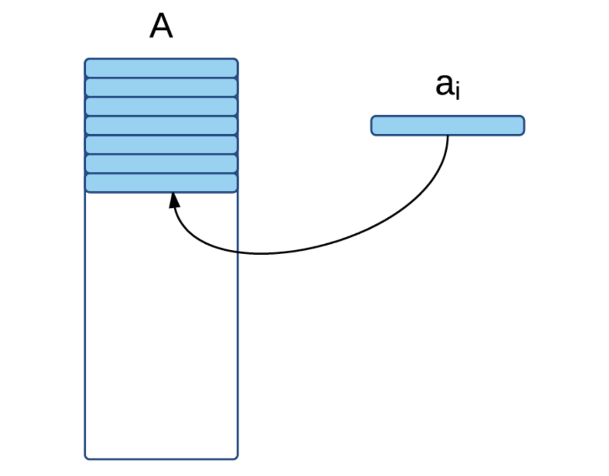
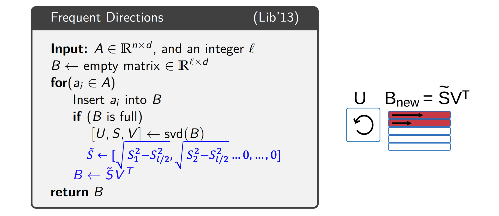

# 1. 스트림 환경에서의 데이터 행렬 (Data as a Matrix)

* 수많은 머신러닝 응용 분야에서 우리는 전체 데이터를 행렬 $A \in \mathbb{R}^{n \times d}$로 표현합니다. 
  * 여기서 $n$은 표본(samples)의 개수를 의미합니다.
  * $d$는 변수(variables)의 개수를 의미하며, 일반적으로 표본의 수가 변수의 수보다 압도적으로 많은 $n \gg d$의 상황을 가정합니다.

* 문제는 이 데이터 행렬이 한 번에 주어지는 것이 아니라, **스트림(Stream)의 형태로 끊임없이 관찰된다는 점**입니다. 매 시점마다 길이가 $d$인 행 벡터 $a_i$가 하나씩 추가되는 상황입니다. 다수의 센서에서 동시에 수집되는 데이터 로그를 떠올리면 이해하기 쉽습니다. 전체 행렬을 저장할 수 없을 때, 우리는 어떻게 이 스트리밍 행렬을 샘플링하고 요약할 수 있을까요?

---

# 2. 기존 방법론의 한계: SVD와 CUR 분해

* 이 문제를 해결하기 위한 단초를 얻기 위해 전통적인 행렬 근사 기법들을 먼저 짚고 넘어가겠습니다.

## 2.1. 특이값 분해 (Singular Value Decomposition, SVD)

* 전통적인 선형대수학에서 행렬 $A$의 최적의 Rank-$k$ 근사(Rank-k approximation)를 구하는 가장 완벽한 방법은 특이값 분해(SVD)를 사용하는 것입니다.
$$A \approx B = U_k S_k V_k^\top$$
  * 여기서 $U_k \in \mathbb{R}^{n \times k}$, $S_k \in \mathbb{R}^{k \times k}$, $V_k \in \mathbb{R}^{d \times k}$ 입니다. 그러나 SVD는 전체 행렬 $A$가 메모리에 존재해야 연산이 가능하므로 스트림 환경에서는 직접 사용할 수 없습니다.

## 2.2. CUR 분해와의 비교
* 또 다른 방법론으로 행렬의 실제 행(Row)과 열(Column)을 샘플링하여 근사하는 CUR 분해($A \approx CUR$)가 있습니다. 하지만 스트림 환경에서는 행 단위로만 데이터가 들어오기 때문에, 전체 데이터를 보지 않고서는 열 행렬 $C$를 추출할 방법이 아예 존재하지 않습니다. 

* 따라서 스트림 마이닝에서는 오직 추출된 행으로 구성된 스케치 행렬 $R \in \mathbb{R}^{k \times d}$을 구성하는 데에만 집중합니다. 이렇게 만들어진 $R$은 SVD에서의 $V^\top$와 유사한 역할을 수행하여 $k$차원의 잠재 공간을 형성하게 됩니다. (단, $R$의 행들은 실제 데이터에서 추출되었으므로 직교하지 않는다는 차이가 있습니다.)

---

# 3. 행 표본 추출 기법 (Row Sampling Methods)

* 행렬 $A$에서 일부 행을 추출하여 스케치 행렬 $R$을 만드는 방법에는 크게 두 가지가 있습니다.

## 3.1. 균등 행 표본 추출 (Uniform Row Sampling)
* 가장 단순한 접근법은 $A$의 행들을 **동일한 확률(uniformly at random)**로 샘플링하는 것입니다. 각 행을 독립적인 요소로 간주하고 레저보어 샘플링(Reservoir sampling)을 적용합니다. 하지만 모든 행이 행렬 스케칭에 동일한 중요도를 가지는 것은 아닙니다. 행의 크기(Norm)에 따라 L2 오차 항에 기여하는 바가 전혀 다르기 때문입니다.

## 3.2. 가중 행 표본 추출 (Weighted Row Sampling)
* 위의 한계를 극복하기 위해, 행의 L2 노름의 제곱인 $\|a_i\|_2^2$에 비례하는 샘플링 확률 $q_i$를 부여하여 비균등하게 샘플링하는 방법이 제안되었습니다.

* **알고리즘 상세 및 수학적 증명**
  * 일반적인 레저보어 샘플링을 가중치 기반으로 일반화하기 위해, 각 행에 무작위 '키(key)'를 생성하고 가장 큰 키를 유지하는 트릭을 사용합니다.
    * 각 행 $a_i$가 들어올 때 (0, 1) 사이의 균등 분포에서 난수 $r_i$를 추출합니다.
    * 해당 행의 키를 $k_i = \frac{\log(r_i)}{q_i}$ 로 할당합니다.
    * 보관소에 있는 가장 작은 키 $k_l$을 가진 행 $a_l$을 찾고, $k_i > k_l$ 이라면 $a_l$을 $a_i$로 교체합니다.

* 이 방식이 목표한 가중 확률을 만족할까요? $q_1 = c q_2$ 라고 가정할 때, $a_1$이 $a_2$보다 선택될 확률은 키 값의 비교 확률 $Pr(k_1 > k_2)$와 같습니다. 

$$k_1 > k_2 \Rightarrow \frac{\log(r_1)}{q_1} > \frac{\log(r_2)}{q_2}$$
$$\Rightarrow \log(r_1) > c \cdot \log(r_2)$$
$$\Rightarrow r_1 > r_2^c$$

* $r_1, r_2 \sim \text{Uniform}(0, 1)$ 이므로, $r_2$가 주어졌을 때의 조건부 확률은 $1 - r_2^c$ 입니다. 이를 전체 구간에 대해 평균 내면 다음과 같습니다.

$$Pr(k_1 > k_2) = \int_0^1 (1 - r_2^c) dr_2 = \left[ r_2 - \frac{r_2^{c+1}}{c+1} \right]_0^1 = 1 - \frac{1}{c+1} = \frac{c}{c+1}$$

* 따라서 $a_1$이 $a_2$보다 정확히 $c$배 더 많이 선택된다는 것이 증명됩니다.

* **오차 한계 (Theoretical Bound)**
  * 가중 행 표본 추출로 크기 $t = (k/\epsilon)^2 \cdot \log(1/\delta)$ 인 행렬 $R \in \mathbb{R}^{t \times d}$을 구성하면, 최소 $1-\delta$의 확률로 다음의 오차 한계를 보장받습니다.
  $$||A - \Pi_R(A)||_F^2 \le ||A - A_k||_F^2 + \epsilon||A||_F$$
    * $A_k$는 최고 Rank-k 근사 행렬, $\Pi_R$은 원본 행렬을 $R$ 공간으로 매핑하는 함수를 의미합니다.

---

# 4. 빈발 방향 (Frequent Directions) 알고리즘

* 가중 행 표본 추출은 훌륭한 방법이지만 샘플링된 행들이 서로 직교하지 않으므로 행렬 내에 **중복된 정보(redundant information)**가 포함되는 한계가 있습니다. 이를 해결하기 위해 행렬 $A$에서 서로 직교하는 가장 핵심적인 방향 벡터들을 찾는 **빈발 방향(Frequent Directions)** 알고리즘이 제안되었습니다. 

## 4.1. 알고리즘 수행 단계 시각화

* **Step 1: 빈 스케치 행렬 초기화**
  * 가장 먼저 $l \times d$ 크기의 비어있는 스케치 행렬 $B$를 생성합니다.

* **Step 2: 스트림 데이터 삽입**
  * 스트림에서 들어오는 행 $a_i$를 행렬 $B$의 비어있는 행에 순차적으로 삽입합니다.

* **Step 3: 꽉 찬 행렬에 대한 SVD 연산**
  * 행렬 $B$가 꽉 차게 되면 SVD를 수행하여 직교 성분을 추출합니다. $[U, S, V] \leftarrow \text{svd}(B)$.

* **Step 4: 특이값 축소 및 빈 공간 확보**
  * 특이값을 담은 대각 행렬 $S$에서 정보량이 가장 적은 절반의 영향을 제거하기 위해 특이값을 다음과 같이 깎아냅니다.
  $$\tilde{S} \leftarrow [\sqrt{S_1^2 - S_{l/2}^2}, \sqrt{S_2^2 - S_{l/2}^2}, \dots, 0, \dots, 0]$$
  * 이후 새로운 $B$를 $B \leftarrow \tilde{S}V^\top$ 로 업데이트하여 중요도가 낮은 정보를 버리고 새로운 데이터를 받을 빈 공간을 만듭니다.

## 4.2. Frequent Directions의 분석과 장점
* 이 알고리즘은 앞선 샘플링 기법보다 훨씬 타이트한(tighter) 오차 한계를 가집니다. $t = k + k/\epsilon$ 크기의 공간만으로 다음 한계를 확정적으로 보장합니다.
* 단순 표본 추출 방식이 $\|A\|_F$ 라는 큰 페널티 항을 가졌던 반면, 이 방식은 최적 오차 $\|A - A_k\|_F^2$에 단순히 $(1+\epsilon)$을 곱한 수준으로 근사 오차가 억제되는 강력한 안정성을 보여줍니다.

$$||A - \Pi_B(A)||_F^2 \le (1+\epsilon)||A - A_k||_F^2$$
