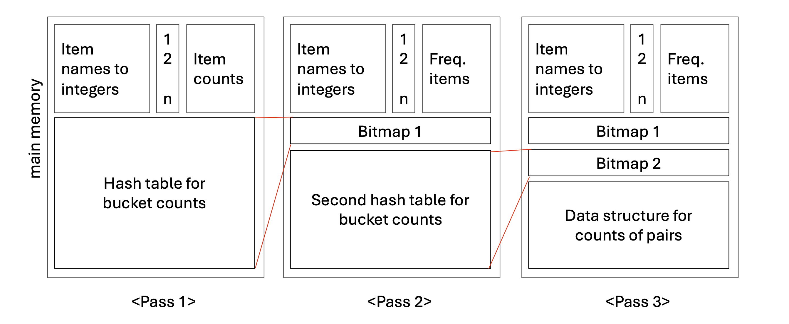
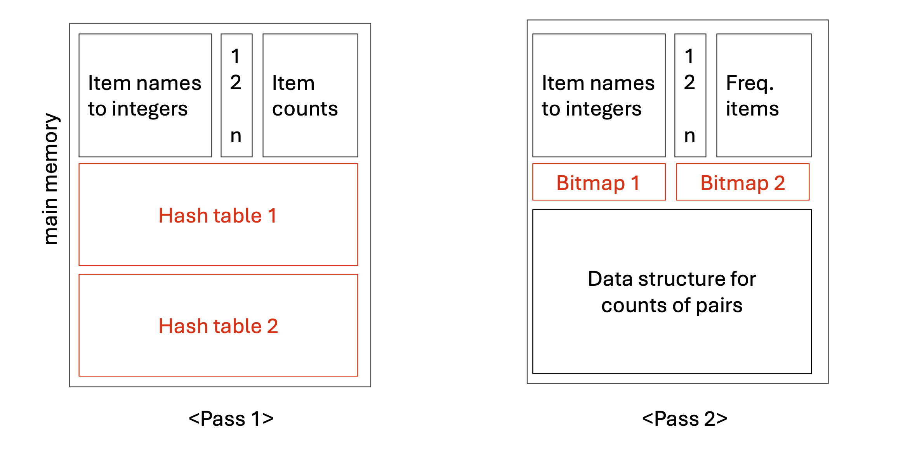

# 1. Introduction: PCY의 한계와 확장 알고리즘의 등장

이전 포스트에서는 A-Priori 알고리즘의 메모리 비효율성을 극복하기 위해 제안된 PCY 알고리즘의 기본 원리를 살펴보았습니다. PCY 알고리즘은 유휴 메모리에 해시 테이블을 구축하여 빈발할 가능성이 없는 아이템 쌍을 사전에 효과적으로 걸러냈습니다. 

하지만 데이터의 크기가 극단적으로 커진다면 단 하나의 해시 테이블만으로는 충분한 필터링 효과를 얻기 어려울 수 있습니다. 이러한 문제를 해결하기 위해 고안된 것이 **PCY의 확장 알고리즘(Extensions of PCY)** 입니다. 대표적으로 두 가지 모델이 존재합니다.

1. **The Multistage Algorithm**
2. **The Multihash Algorithm**

두 알고리즘 모두 후보 쌍(Candidate pairs)의 개수를 더욱 줄이기 위해 **여러 개의 해시 테이블을 생성**한다는 핵심 아이디어를 공유합니다. 그러나 다중 테이블을 구축하는 방식에 있어 Multistage는 순차적(successive passes)으로, Multihash는 병렬적(in parallel)으로 접근한다는 근본적인 차이가 있습니다. 

본 포스트에서는 이 두 가지 확장 알고리즘의 작동 원리와 메모리 관리 메커니즘을 심도 있게 분석합니다.

---

# 2. The Multistage Algorithm

Multistage 알고리즘은 패스(Pass)를 여러 번 반복하면서 연속적으로 해시 테이블을 생성하여 필터링의 정밀도를 높이는 방법입니다.

## 2.1. 단계별 작동 원리

* **Pass 1:** 기존 PCY 알고리즘의 첫 번째 패스와 완전히 동일합니다. 단일 아이템의 빈도를 세고, 여유 메모리에 전체 아이템 쌍에 대한 첫 번째 해시 테이블을 만듭니다. 패스가 끝나면 이 테이블은 비트맵(Bitmap 1)으로 압축됩니다.
* **Pass 2:** 비트맵 압축을 통해 기존 메모리 공간의 $31/32$가 다시 유휴 상태가 됩니다. Multistage는 이 공간에 **두 번째 해시 테이블**을 생성합니다. 

이때 핵심은 Pass 2에서 모든 아이템 쌍을 해싱하는 것이 아니라는 점입니다. 다음 두 조건을 **모두 만족하는 쌍 $\{i, j\}$만 해싱**합니다.
1. 아이템 $i$와 $j$가 모두 빈발 아이템(Frequent items)이다.
2. 쌍 $\{i, j\}$가 첫 번째 비트맵(Bitmap 1)에서 빈발 버킷(Frequent bucket)으로 해싱되었다.

이러한 사전 필터링 덕분에 두 번째 해시 테이블에 기록되는 쌍의 수는 훨씬 적어지며, 결과적으로 빈발 버킷의 수 자체를 극적으로 줄일 수 있습니다.

## 2.2. 후보 쌍 $C_2$의 정의와 논리적 주의점

Multistage (Pass 3 기준)에서 특정 쌍 $\{i, j\}$가 최종 후보 쌍 집합 $C_2$에 포함되기 위해서는 **세 가지 조건**을 완벽히 충족해야 합니다.

1. $i$와 $j$가 모두 빈발 아이템이어야 한다.
2. 쌍 $\{i, j\}$가 Bitmap 1에서 빈발 버킷에 해싱되어야 한다.
3. 쌍 $\{i, j\}$가 Bitmap 2에서 빈발 버킷에 해싱되어야 한다.

**[중요한 질문] 여기서 Condition 2는 정말 필수적일까요?**
**정답은 '그렇다(Yes!)' 입니다 .** 어떤 쌍 $\{i, j\}$가 Bitmap 1에서는 비빈발 버킷에 배정되었다고 가정해 봅시다. 이 쌍은 Pass 2에서 해싱 작업 자체에서 제외되므로 두 번째 해시 테이블에 카운트되지 않습니다. 
하지만 해시 함수의 특성상, 이 쌍을 두 번째 해시 함수에 통과시켰을 때 우연히 '다른 빈발 쌍들에 의해 카운트가 높아진 빈발 버킷'에 배정될 가능성은 여전히 존재합니다. 만약 Condition 2를 확인하지 않는다면, 이처럼 실제로는 비빈발 쌍이면서 Condition 1과 3만 우연히 만족한 쌍이 후보에 오르는 오류(False Positive)가 발생할 수 있습니다.

> **💡 Note:** 메모리가 허용하는 한 패스의 수는 계속 늘릴 수 있습니다. 패스가 아무리 많아지더라도 진짜 빈발 쌍(Truly frequent pairs)은 언제나 모든 해시 테이블에서 빈발 버킷에 해싱되므로 정보의 유실은 발생하지 않습니다.

---

# 3. The Multihash Algorithm

Multistage가 '시간(Pass)'을 투자해 정밀도를 높였다면, Multihash 알고리즘의 목표는 **여러 번의 패스로 얻는 이점을 단 한 번의 패스(Single pass)로 얻어내는 것**입니다.

## 3.1. 메커니즘: 병렬 해시 테이블

접근 방식은 직관적입니다. Pass 1에서 사용 가능한 유휴 메모리 공간을 반으로 쪼개어, **서로 다른 해시 함수를 사용하는 두 개의 독립적인 해시 테이블**을 동시에 생성합니다. 

* **Pass 1:** 장바구니 데이터를 스캔하면서 각 아이템 쌍 $\{i, j\}$를 두 개의 해시 함수에 각각 통과시키고, 두 해시 테이블의 해당 버킷 카운트를 동시에 올립니다.
* **Pass 2:** 두 해시 테이블을 각각 압축하여 Bitmap 1과 Bitmap 2를 생성합니다. 

단, 이 방식은 메모리를 분할하여 버킷의 수가 줄어들기 때문에, 버킷 하나당 할당되는 아이템 쌍의 밀도(density)가 지나치게 높지 않을 때만 유의미한 효과를 발휘합니다.

## 3.2. 후보 쌍 $C_2$의 조건

Multihash 알고리즘에서 쌍 $\{i, j\}$가 후보 쌍 $C_2$로 채택되기 위한 조건은 다음과 같습니다.

1. $i$와 $j$가 모두 빈발 아이템이어야 한다.
2. 해당 쌍이 **두 해시 테이블 모두에서(in both hash tables)** 빈발 버킷에 해싱되어야 한다.

---

# 4. Optimization: 테이블의 개수 $n$과 확률적 트레이드오프

Multihash 알고리즘에서는 테이블의 개수 $n$을 2개 이상으로 얼마든지 늘릴 수 있습니다. 그렇다면 $n$이 클수록 무조건 좋을까요? 최적의 $n$값을 찾기 위해서는 수학적 트레이드오프를 고려해야 합니다.

비빈발 쌍이 우연히 모든 비트맵을 통과하여 $C_2$에 포함될 확률을 수식으로 정의해 봅시다.
어떤 쌍이 개별 해시 테이블에서 우연히 빈발 버킷에 해싱될 확률을 $p$라고 한다면 , 비빈발 쌍이 $n$개의 독립적인 테이블 모두에서 빈발 버킷에 해싱될 확률은 다음과 같습니다.

$$\text{Probability} = p^n$$

제한된 메인 메모리 환경에서 테이블의 수 $n$을 늘린다는 것은 필연적으로 각 테이블에 할당되는 메모리 크기(버킷의 수)가 줄어듦을 의미합니다. 버킷의 수가 줄어들면 충돌(Collision)이 잦아져, 각 버킷이 빈발 버킷이 될 확률 $p$ 자체가 상승하게 됩니다.

즉, $n$을 늘리면 지수 값은 커지지만, 동시에 밑인 $p$의 값도 커지는 상충 관계가 발생합니다. 초기에는 $n$의 증가가 필터링 효과를 높이지만, 일정 수준을 넘어서면 **$p$의 증가폭이 압도하여 오히려 최종 확률 $p^n$이 증가(성능 저하)하는 지점**에 도달하게 됩니다. 따라서 가용 메모리와 데이터의 희소성을 고려하여 적절한 $n$을 설정하는 것이 알고리즘 최적화의 핵심입니다.