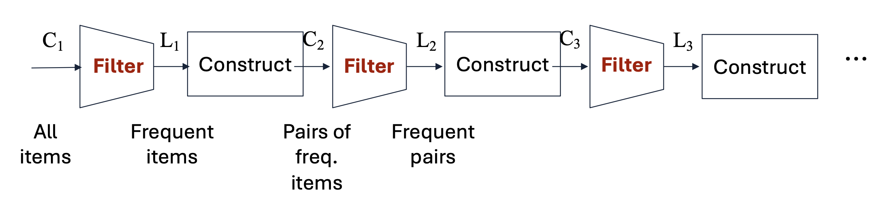
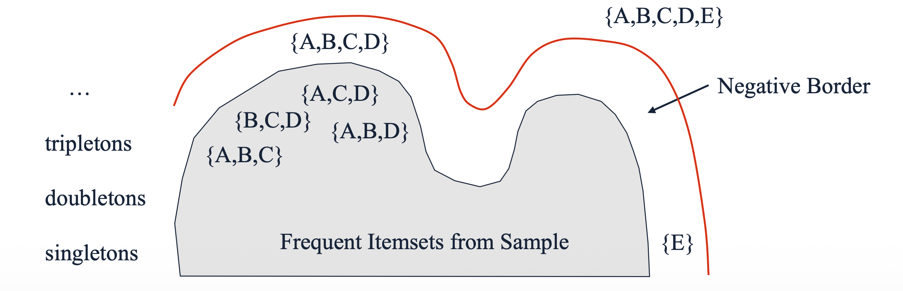
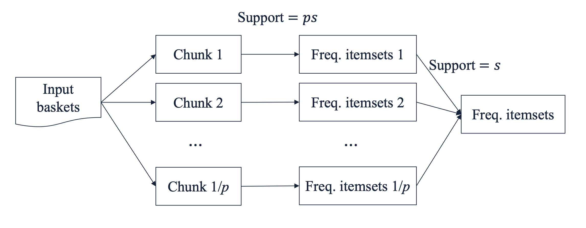

# 1. Introduction: 다중 패스의 한계와 속도-정확도 트레이드오프

지금까지 우리가 다룬 A-Priori 알고리즘이나 그 확장판(PCY 등)은 아이템 집합의 크기 $k$가 커질 때마다 전체 데이터셋을 새롭게 스캔해야 합니다. 즉, 후보 $k$-튜플 집합인 $C_k$를 생성하고, 이를 필터링하여 진짜 빈발 집합인 $L_k$를 찾는 과정(Pass)이 각 $k$마다 반복적으로 요구됩니다. 

하지만 현실의 많은 데이터 마이닝 애플리케이션(예: 슈퍼마켓 장바구니 분석)에서는 약간의 정확도를 희생하더라도 **분석 속도**를 획기적으로 높이는 것이 더 유리할 때가 많습니다. 이러한 맥락에서 전체 데이터 스캔 횟수를 **2회 이하($\le 2$ passes)**로 제한하면서도 모든(혹은 대부분의) 빈발 항목 집합을 찾아내는 **Limited-Pass Algorithms**이 고안되었습니다. 

본 포스트에서는 대표적인 세 가지 접근법인 **Random Sampling**, **Toivonen's Algorithm**, 그리고 **SON Algorithm**을 차례로 살펴봅니다.

---

# 2. Random Sampling (단순 샘플링)

가장 직관적이고 단순한 방법은 전체 장바구니 데이터(Market baskets) 중 일부만 무작위로 추출하여 메모리 내에서 처리하는 것입니다. 

## 2.1. 수학적 지지도 보정
만약 전체 데이터 중 $p$의 비율($p < 1$)만큼을 샘플링했다면, 우리가 설정했던 원래의 지지도 임계값(Support threshold) $s$ 역시 동일한 비율로 줄여주어야 합니다. 즉, 샘플 데이터에 대한 새로운 임계값은 **$ps$**가 됩니다. 이렇게 스케일을 조정한 뒤, 메모리에 올라간 샘플 데이터를 대상으로 A-Priori나 PCY 알고리즘을 수행합니다.

## 2.2. 샘플링의 오류: False Positives & False Negatives
단일 패스만으로 끝나는 샘플링은 필연적으로 두 가지 유형의 오류를 발생시킵니다.

* **False Positives (거짓 양성):** 샘플 내에서는 빈발하다고 판정되었으나, 실제 전체 데이터에서는 빈발하지 않은 항목 집합입니다. 
    * *해결책:* 전체 데이터에 대해 패스를 한 번 더 수행하여 샘플에서 찾은 후보들의 진짜 빈도를 셈으로써 완벽히 제거할 수 있습니다.
* **False Negatives (거짓 음성):** 실제 전체 데이터에서는 빈발하지만, 샘플에서는 우연히 적게 뽑혀 누락된 항목 집합입니다.
    * *대응:* 임계값을 $ps$보다 조금 더 낮춰서(예: $0.9ps$) 더 많은 후보를 포함시키면 줄일 수는 있지만, 단순 샘플링 구조상 False Negatives를 완전히 제거할 수 있는 쉬운 방법은 없습니다.

---

# 3. Toivonen's Algorithm

샘플링의 가장 큰 문제인 **False Negatives를 완벽히 제거할 수 없을까?**라는 질문에서 출발한 것이 Toivonen의 알고리즘입니다. 이 알고리즘은 평균 2회의 패스만으로 어떠한 오류(거짓 양성 및 거짓 음성 모두)도 없는 정확한 결과를 도출합니다.

## 3.1. Pass 1: 샘플링과 Negative Border 구축
1.  작은 샘플 데이터를 추출하고, 비례값인 $ps$보다 더 낮은 임계값(예: $0.9ps$)을 사용하여 후보 집합을 찾습니다.
2.  이때, **네거티브 보더(Negative Border)**라는 특수한 안전망을 함께 구축합니다.

> **Definition: Negative Border (경계 집합)**
> 어떤 항목 집합이 네거티브 보더에 속하기 위한 필요충분조건은 다음과 같습니다.
> 1. 해당 집합 자체는 샘플 내에서 빈발하지 않다.
> 2. 해당 집합의 **모든 직속 부분집합(Immediate subsets)**은 샘플 내에서 빈발하다. (※ 직속 부분집합이란 원소를 정확히 하나만 제거하여 만든 부분집합을 의미합니다 ).

**[Example]**
집합 $\{A, B, C, D\}$가 네거티브 보더에 포함되려면, 이 집합 자체는 비빈발이어야 하지만 그 직속 부분집합인 $\{A, B, C\}$, $\{B, C, D\}$, $\{A, C, D\}$, $\{A, B, D\}$는 모두 빈발해야 합니다. 단일 아이템(Singleton)인 $\{E\}$의 경우, 공집합 $\emptyset$은 항상 빈발하다고 간주되므로 $\{E\}$가 비빈발이기만 하면 자동으로 보더에 포함됩니다.

## 3.2. Pass 2: 전체 데이터 검증과 종료 조건
두 번째 패스에서는 전체 데이터셋을 대상으로 (a) 샘플에서 빈발했던 집합과 (b) 네거티브 보더에 속한 집합의 실제 빈도를 모두 셉니다.

* **성공 (종료):** 전체 데이터를 세어본 결과, **네거티브 보더의 원소 중 전체 데이터에서도 빈발한 것이 하나도 없다면** 알고리즘은 즉시 종료됩니다. 샘플에서 찾은 빈발 집합 중 검증을 통과한 것들이 완벽한 정답이 됩니다.
* **실패 (재시도):** 만약 네거티브 보더 원소 중 단 하나라도 전체 데이터에서 빈발하다면, 보더 바깥에 우리가 놓친 더 큰 빈발 집합이 존재할 가능성이 있습니다. 이 경우 알고리즘은 결과를 폐기하고 새로운 무작위 샘플을 뽑아 처음부터 다시 시작합니다. 확률은 낮지만 2회 이상의 패스가 발생할 수 있는 이유가 바로 이 지점 때문입니다.

## 3.3. 왜 Toivonen의 알고리즘은 False Negatives가 없을까?
결과로 도출된 집합에 거짓 음성이 없다는 것은 수학적 귀류법으로 증명 가능합니다. 
만약 전체 데이터에서는 빈발하지만, 샘플에서는 누락된(비빈발로 판정된) 어떤 집합 $S$가 존재한다고 가정해 봅시다. 그렇다면 $S$가 네거티브 보더에 있거나, 혹은 $S$의 직속 부분집합 $T$가 전체에서는 빈발하지만 샘플에서는 누락되었을 것입니다. 이 논리를 계속 아래로 전개하다 보면, 결국 네거티브 보더 내부에는 반드시 전체 데이터에서 빈발한 원소가 최소 하나 이상 존재해야만 합니다. (최악의 경우라도 단일 아이템(Singleton)들이 네거티브 보더에 속하기 때문입니다 ).
따라서, 네거티브 보더 내에 빈발 항목이 하나도 없다는 종료 조건을 통과했다면, 놓친 집합 $S$는 애초에 존재할 수 없습니다.

---

# 4. SON Algorithm (Savasere, Omiecinski, Navathe)

Toivonen 알고리즘이 '확률적으로' 2번의 패스에 끝난다면, **SON 알고리즘은 어떠한 경우에도 정확히 2번의 전체 패스로 False Positives와 False Negatives를 모두 제거**합니다. 이는 병렬 분산 처리 환경(MapReduce 등)에 매우 적합한 구조를 가집니다.

## 4.1. 2-Pass 메커니즘
* **Pass 1 (로컬 빈발 집합 추출):** 전체 데이터를 $1/p$ 개의 청크(Chunk)로 분할합니다. 각 청크가 전체의 $p$ 비율을 차지하므로, 각 청크 메모리 내부에서 지지도 임계값을 $ps$로 설정하고 A-Priori를 돌려 로컬 빈발 항목 집합들을 찾습니다.
* **Pass 2 (전체 검증):** 각 청크에서 발견된 로컬 빈발 항목 집합들을 모두 합집합(Union)하여 하나의 후보군을 만듭니다. 이후 두 번째 전체 데이터 패스를 돌면서 이 후보군들의 실제 빈도수가 원래 임계값 $s$를 넘는지 최종 확인합니다.

## 4.2. 논리적 증명: 왜 누락(False Negatives)이 발생하지 않는가?
SON 알고리즘의 핵심 전제는 **"어떤 항목 집합이 전체 데이터에서 빈발하다면, 그것은 반드시 적어도 하나의 청크(Chunk) 내에서도 빈발해야 한다"**는 것입니다.

이를 수식으로 반증해 보겠습니다. 만약 어떤 집합이 그 어떤 청크에서도 빈발하지 않다고 가정해 봅시다. 
그러면 각 청크에서의 지지도(빈도수)는 모두 해당 청크의 임계값인 $ps$ 보다 작습니다. 총 $1/p$ 개의 청크가 있으므로, 전체 데이터에서의 총 지지도는 아무리 커도 다음을 넘을 수 없습니다.

$$\text{Total Support} < \left(\frac{1}{p}\right) \times (ps) = s$$

결과적으로 이 집합의 전체 지지도는 무조건 $s$ 미만이 되므로 전체 데이터에서도 절대 빈발할 수 없습니다. 따라서 특정 청크에서 한 번이라도 선발되지 못한 후보는 과감히 버려도 안전합니다.

## 4.3. MapReduce 구현 구조
SON 알고리즘은 MapReduce 프레임워크를 이용해 우아하게 구현됩니다.

### **[Pass 1: 후보 집합 찾기]** 
* **Map:** 할당된 데이터 청크를 받아 임계값 $ps$ 기준으로 로컬 빈발 집합 $F$를 찾고, `(F, 1)` 형태의 Key-Value 쌍을 반환합니다.
* **Reduce:** Map에서 올라온 결과들 중 한 번이라도 등장한 항목 집합을 후보군으로 통과시킵니다 (Value는 무시).

### **[Pass 2: 진짜 빈발 집합 찾기]** 
* **Map:** Pass 1의 결과인 후보 집합군 $C$와 자신에게 할당된 전체 데이터의 일부(portion)를 입력받습니다. 해당 portion 내에서 집합 $C$의 출현 빈도 $v$를 세어 `(C, v)`를 반환합니다.
* **Reduce:** 동일한 후보 $C$에 대해 들어온 모든 카운트 $v$를 합산하고, 그 합이 최종 임계값 $s$ 이상($\ge s$)인 집합만 정답으로 출력합니다.