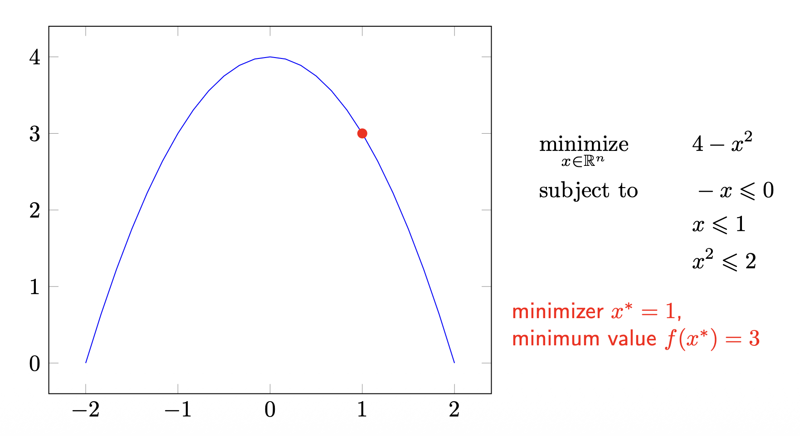

# 1. 머신러닝 개요 (Introduction)

## 머신러닝이란? (Machine learning)

이 강의의 핵심 목표는 머신러닝을 깊이 있게 연구·응용하는 데 필요한 토대를 다지는 것입니다. 머신러닝을 한 문장으로 정의하면, **데이터 $x$ 로부터 학습하는 알고리즘에 대한 연구**입니다.

가장 기본적인 구조는 입력 $x$ 를 어떤 함수 $f$ 에 통과시켜 출력 $y$ 를 얻는 형태로 표현할 수 있습니다.

$$
x \;\longrightarrow\; f(x) \;\longrightarrow\; y
$$

여기서 학습의 본질은, 좋은 출력 $y$ 를 내놓는 **함수 $f$ 를 데이터로부터 찾아내는 것**이라 할 수 있습니다.

## 머신러닝 문제의 유형 (Types of ML problems)

머신러닝 문제는 크게 **지도 학습**, **비지도 학습**, 그리고 **환경과의 상호작용** 세 가지 범주로 나눌 수 있습니다.

### 지도 학습 (Supervised learning)

지도 학습은 입력 $x$ 와 정답 레이블 $y$ 가 짝지어진 데이터로 학습하는 방식이며, 출력 $y$ 의 형태에 따라 다음과 같이 세분화됩니다.

* **이진/다중 분류 (Binary/Multiclass classification):** 입력 $x$ 가 주어지면, 이산적인 클래스 집합에서 $y \in \{1, \dots, K\}$ 를 찾습니다.
* **회귀 (Regression):** 입력 $x$ 가 주어지면, 연속적인 값 $y \in \mathbb{R}^d$ 를 찾습니다.
* **시퀀스 주석 (Sequence annotation):** 시퀀스 $x_1, \dots, x_n$ 이 주어지면, 그에 대응하는 출력 시퀀스 $y_1, \dots, y_m$ 을 찾습니다.
* **예측 (Prediction):** 현재 입력 $x_t$ 와 과거 출력 $y_1, \dots, y_{t-1}$ 이 주어졌을 때, 다음 출력 $y_t$ 를 찾습니다.

#### 예시: 분류 (Classification)

분류 문제를 직관적으로 이해하기 위해, 고양이 사진을 입력으로 받아 레이블을 출력하는 예시를 살펴보겠습니다.


여기서 한 가지 중요한 관점이 있습니다. 사람에게는 직관적인 "고양이"라는 개념이, **컴퓨터에게는 단지 거대한 숫자 격자(grid of numbers)** 에 불과하다는 점입니다.


* 즉, 이미지는 본질적으로 **$[0, 255]$ 사이의 값을 갖는 큰 숫자 격자**입니다.
* 머신러닝 모델의 역할은 이 무의미해 보이는 숫자 배열로부터 **의미 있는 레이블을 추론**하는 함수 $f$ 를 학습하는 것입니다.

### 비지도 학습 (Unsupervised learning)

비지도 학습은 정답 레이블 없이 데이터 $x$ 자체의 구조나 패턴을 찾아내는 방식입니다.

* **군집화 (Clustering):** 데이터를 대표하는 **프로토타입(prototype)** 집합을 찾습니다.
* **시퀀스 분석 (Sequence analysis):** 관측값 뒤에 숨어 있는 **잠재적 인과 시퀀스(latent causal sequence)** 를 찾습니다. (HMM, Kalman Filter 등)
* **독립 성분 / 사전 학습 (Independent components / dictionary learning):** 관측값을 구성하는 **요인(factor)** 집합을 찾습니다.
* **이상치 탐지 (Novelty detection):** 다른 데이터와 동떨어진 **"이상한 하나(odd one out)"** 를 찾습니다.

#### 예시: 독립 성분 분석 (Independent Component Analysis, ICA)

비지도 학습의 대표적 예시로 **칵테일 파티 문제(cocktail party problem)** 가 있습니다.


#### 예시: 정규화 절단 (Normalized cuts)

군집화/분할의 또 다른 예시로, 이미지의 픽셀들을 의미 있는 영역으로 분할하는 **정규화 절단** 기법이 있습니다.


#### 예시: 주성분 분석 (Principal Component Analysis, PCA)

데이터의 분산을 가장 잘 설명하는 축(주성분)을 찾는 PCA 또한 대표적인 비지도 학습 기법입니다.


### 환경과의 상호작용 (Interaction with environments)

세 번째 범주는 학습자(agent)가 환경과 능동적으로 상호작용하며 학습하는 방식입니다.

* **온라인 학습 (Online):** 입력 $x_t$ 를 관측하고, 예측 $f(x_t)$ 를 내놓은 뒤, 실제 정답 $y_t$ 를 관측하며 순차적으로 학습합니다.
* **능동 학습 (Active learning):** 모델이 직접 정보가 될 만한 $x_t$ 에 대한 레이블 $y_t$ 를 질의(query)하여 모델을 개선하고, 다음에 질의할 $x$ 를 선택합니다.
* **밴딧 (Bandits):** 여러 선택지(arm) 중 하나를 고르고 보상을 받은 뒤 다음 선택을 하는 문제로, **상태가 하나뿐인(one-state) 혹은 상태 없는(stateless) 강화학습**으로도 볼 수 있습니다.
* **강화 학습 (Reinforcement learning):** 행동을 취하면 환경이 반응하고, 그에 따라 다시 새로운 행동을 취하는 본격적인 순차적 의사결정 문제입니다.

#### 강화 학습의 기본 구조

강화 학습의 상호작용 루프는 다음과 같이 도식화됩니다.


##### 예시 1: 로봇 보행 (Robot locomotion)


##### 예시 2: Atari 게임


* 여기서 제기되는 핵심 질문은 **"가능한 이미지 상태(image state)의 구성은 몇 가지인가?"** 입니다. 이는 상태 공간이 얼마나 거대한지를 가늠하게 하는 질문입니다.

##### 예시 3: 바둑 (Go)


* Atari와 바둑 예시에서 반복되는 "가능한 상태의 수는?"이라는 질문의 의도는 분명합니다. **상태 공간이 너무나 거대하여 모든 상태를 일일이 다룰 수 없기 때문에, 함수 근사(function approximation)와 같은 학습 기반 접근이 필수적**이라는 점을 강조하기 위함입니다.

## 판별 모델 vs. 생성 모델 (Discriminative vs. Generative)

머신러닝 모델은 무엇을 추정하느냐에 따라 **판별 모델**과 **생성 모델**로 구분할 수 있습니다.

### 핵심 정의

* **판별 모델 (Discriminative models)**
  * 조건부 확률 $p(y \mid x)$ 를 **직접(directly)** 추정합니다.
  * 종종 더 나은 수렴(convergence)과 더 단순한 해(solution)로 이어집니다.

* **생성 모델 (Generative models)**
  * 결합 분포(joint distribution) $p(y, x)$ 를 추정합니다.
  * 조건부 확률의 정의를 이용해 $p(y \mid x)$ 를 추론합니다.
    $$
    p(y \mid x) = \frac{p(y, x)}{p(x)}
    $$
  * 데이터 분포 $p(x)$ 를 알고 있으므로, 이를 이용해 **새로운 데이터를 생성(generate)** 할 수 있습니다.

> **보충 설명:** 위 식은 확률의 기본 정의인 조건부 확률 $p(y \mid x) = \frac{p(x, y)}{p(x)}$ 에서 곧바로 따라옵니다. 판별 모델은 분류 경계(decision boundary)에만 집중하는 반면, 생성 모델은 데이터가 "어떻게 생성되었는가"라는 더 풍부한 정보까지 모델링한다는 차이가 있습니다.

### 판별 모델의 특징


* 판별 모델은 **오직 조건부 확률 추정에만 관심**을 둡니다.
* 따라서 **데이터의 실제 분포가 매우 복잡할 때 특히 좋은 성능**을 보입니다. 분포 전체를 모델링하는 부담 없이, 클래스를 가르는 경계만 잘 찾으면 되기 때문입니다.

### 생성 모델의 특징

생성 모델은 데이터 분포 $p(x)$ 자체를 모델링하며, 최근의 다양한 생성 AI가 이 범주에 속합니다.


# 2. 수리 최적화 개요 (Optimization overview)

거의 모든 머신러닝 알고리즘은 결국 **어떤 목적 함수를 최소화(또는 최대화)하는 문제**로 귀결됩니다. 따라서 최적화는 머신러닝의 핵심 엔진입니다.

## 최적화 문제의 정의 (Mathematical optimization)

> **정의 1 (최적화 문제의 기본 형태)**
>
> $$
> \begin{aligned}
> \underset{x \in \mathbb{R}^n}{\text{minimize}} \quad & f(x) \\
> \text{subject to} \quad & h_i(x) \leq b_i, \quad \forall i = 1, \dots, m
> \end{aligned}
> $$

각 구성 요소의 의미는 다음과 같습니다.

* **최적화 변수 (optimization variable):** $x = (x_1, \dots, x_n)$, 우리가 조정할 수 있는 변수입니다.
* **목적 함수 (objective function):** $f : \mathbb{R}^n \to \mathbb{R}$, 최소화하고자 하는 대상입니다.
* **제약 함수 (constraint function):** $h_i : \mathbb{R}^n \to \mathbb{R}$, 해가 만족해야 하는 조건을 정의합니다.
* **최소화 해 (minimizer / solution):** $x^* \in \mathbb{R}^n$, 모든 제약 조건을 만족하는 벡터들 중에서 **가장 작은 목적 함수 값**을 갖는 벡터입니다.

## 전역 최소와 국소 최소 (Global and local minimum)

최적화에서 "최소"라는 개념은 그 범위에 따라 둘로 나뉩니다.

> **정의 2 (전역 최소, Global minimum)**
>
> 정의역 $\mathcal{X}$ 위에서 정의된 실수값 함수 $f$ 가 $x^*$ 에서 전역 최소를 갖는다는 것은, **모든** $x \in \mathcal{X}$ 에 대해 다음이 성립함을 의미합니다.
> $$
> f(x^*) \leq f(x)
> $$

> **정의 3 (국소 최소, Local minimum)**
>
> 함수 $f$ 가 $x^*$ 에서 국소 최소를 갖는다는 것은, 어떤 $\epsilon > 0$ 이 존재하여 $x^*$ 의 $\epsilon$-근방 안의 모든 점에 대해 다음이 성립함을 의미합니다.
> $$
> f(x^*) \leq f(x) \quad \text{for all } x \in \mathcal{X} \cap B(x^*, \epsilon)
> $$
> 여기서 $B(x^*, \epsilon)$ 는 $x^*$ 와의 거리가 $\epsilon$ 보다 작은 점들의 집합입니다.

* 핵심 차이는 비교 범위입니다. 전역 최소는 **정의역 전체**와 비교하지만, 국소 최소는 **자기 주변의 작은 공(ball) 안**에서만 가장 작으면 됩니다.

## 예시 (Example)

다음과 같은 간단한 제약 최적화 문제를 살펴보겠습니다.

$$
\begin{aligned}
\underset{x \in \mathbb{R}^n}{\text{minimize}} \quad & 4 - x^2 \\
\text{subject to} \quad & -x \leq 0 \\
& x \leq 1 \\
& x^2 \leq 2
\end{aligned}
$$



이 문제의 해를 단계별로 분석해 보겠습니다.

* **제약 조건 정리:**
  * $-x \leq 0 \Rightarrow x \geq 0$
  * $x \leq 1$
  * $x^2 \leq 2 \Rightarrow -\sqrt{2} \leq x \leq \sqrt{2}$
* 세 조건을 모두 만족하는 **가능 영역(feasible region)** 은 $0 \leq x \leq 1$ 입니다. ($x \le 1$ 이 가장 강한 상한 조건이기 때문입니다.)
* 목적 함수 $f(x) = 4 - x^2$ 는 $x$ 가 커질수록 감소하는 함수입니다. 따라서 가능 영역 $[0, 1]$ 안에서 $f$ 를 최소화하려면 **$x$ 를 최대한 크게** 해야 합니다.

이로부터 다음 결론을 얻습니다.

* **최소화 해:** $x^* = 1$
* **최소값:** $f(x^*) = 4 - 1^2 = 3$

## 비제약 최소화 (Unconstrained minimization)

이제 제약이 없는 가장 기본적인 형태를 생각해 봅니다.

$$
\underset{x \in \mathbb{R}^n}{\text{minimize}} \quad f(x)
$$

논의를 위해 다음을 가정합니다.

* $f$ 는 **미분 가능(differentiable)** 하다.
* 최적값 $x^* = \arg\inf_x f(x)$ 가 **달성(attained)** 된다.

목표는 정의역 안의 점들의 수열 $\{x^{(k)}\}_{k \in \mathbb{N}_0} \subseteq \text{dom} f$ 를 만들어, 다음이 성립하게 하는 것입니다.

$$
f(x^{(k)}) \to f(x^*) \quad \text{as } k \to \infty
$$

즉, **반복(iteration)을 거듭할수록 목적 함수 값이 최적값에 수렴**하는 알고리즘을 설계하는 것이 핵심입니다.

## 강하법 (Descent methods)

강하법의 기본 아이디어는, 매 반복마다 함수값이 줄어드는 방향으로 한 걸음씩 이동하는 것입니다. 갱신 규칙은 다음과 같습니다.

$$
x^{(k+1)} = x^{(k)} + t^{(k)} \Delta x^{(k)}
$$

여기서 $\Delta x^{(k)}$ 는 **이동 방향**, $t^{(k)}$ 는 **걸음 크기(step size)** 이며, 목표는 $f(x^{(k+1)}) < f(x^{(k)})$ 를 만족시키는 것입니다.

### 1차 근사를 통한 강하 조건 유도

함수값이 줄어드는 방향을 찾기 위해, **테일러 1차 근사(first-order approximation)** 를 사용합니다. $t$ 가 충분히 작을 때,

$$
f(x + t \Delta x) \approx f(x) + t \nabla f(x)^\top \Delta x
$$

이 근사에서 $f(x + t\Delta x) < f(x)$ 가 되려면, 두 번째 항이 음수여야 합니다. 즉,

$$
t \nabla f(x)^\top \Delta x < 0
$$

$t > 0$ 이므로 결국 다음 조건이 필요합니다.

* **방향 도함수 (Directional derivative):** $t=0$ 에서의 변화율은 다음과 같습니다.
  $$
  \left. \frac{d}{dt} f(x + t\Delta x) \right|_{t=0} = \nabla f(x)^\top \Delta x
  $$
* **강하 조건 (Descent condition):**
  $$
  \nabla f(x)^\top \Delta x < 0
  $$

이 조건이 의미하는 바를 기하학적으로 해석하면 다음과 같습니다.

* $\nabla f(x)^\top \Delta x < 0$ 은 두 벡터 $\nabla f(x)$ 와 $\Delta x$ 사이의 각 $\theta$ 가 **$90^\circ$ 보다 큰 둔각(obtuse angle)** 임을 의미합니다.
* 즉, **그래디언트와 둔각을 이루는 어떤 방향이든 함수값을 감소**시킵니다.
* 이 조건을 만족하는 $\Delta x$ 를 **강하 방향(descent direction)** 이라 부르며, 충분히 작은 $t > 0$ 에 대해 $f(x + t\Delta x) < f(x)$ 가 보장됩니다.

## 직선 탐색 (Line search)

강하 방향 $\Delta x$ 를 정했다면, 얼마나 멀리 갈지(걸음 크기 $t$)를 정해야 합니다.

* **정확한 직선 탐색 (Exact line search):** 해당 방향에서 함수값을 최소로 만드는 $t$ 를 직접 구합니다.
  $$
  t = \underset{t > 0}{\arg\min}\ f(x + t \Delta x)
  $$

* **역추적 직선 탐색 (Backtracking line search):** 실제로는 정확한 최소화가 비싸므로, 충분히 좋은 감소가 확인될 때까지 걸음 크기를 점점 줄여나가는 휴리스틱을 씁니다.

```
주어진 값: x, Δx, f, t0, c ∈ (0, 0.5), τ ∈ (0, 1).
t = t0 으로 설정한다.
repeat
    t = τ·t
until  f(x) − f(x + tΔx) ≥ −c·t·⟨∇f(x), Δx⟩
```

* $\tau \in (0,1)$ 은 매 반복마다 걸음 크기를 줄이는 비율이며, $c \in (0, 0.5)$ 는 "충분한 감소"의 기준을 정하는 상수입니다. 이 종료 조건은 **Armijo 조건**으로 알려진, 함수값이 충분히 감소했는지를 판정하는 부등식입니다.

## 경사하강법 (Gradient descent method)

강하법에서 방향을 $\Delta x = -\nabla f(x)$ 로 택하면, 가장 유명한 **경사하강법**이 됩니다.

```
시작점 x ∈ dom f 가 주어진다.
repeat
    1. Δx := −∇f(x)
    2. 직선 탐색(Line search): 걸음 크기 t > 0 를 선택한다.
    3. 갱신(Update): x := x + tΔx
until  종료 조건이 만족될 때까지
```

* **종료 조건(stopping criterion):** 일반적으로 그래디언트의 크기가 충분히 작아지는 조건, 즉 $\lVert \nabla f(x) \rVert_2 \leq \epsilon$ 을 사용합니다. 이는 거의 정류점(stationary point)에 도달했음을 의미합니다.

> 참고로 수렴성 분석(convergence analysis)에 대한 자세한 논의는 대학원 수준의 머신러닝 강의에서 다룬다고 강의에서 언급되었습니다.

## 왜 음의 그래디언트가 최급강하 방향인가? (Why is the negative gradient the direction of the steepest descent?)

경사하강법이 하필 $-\nabla f(x)$ 방향을 택하는 이유를 엄밀하게 증명해 보겠습니다.

> **정의 4 (방향 도함수, Directional derivative)**
>
> 점 $x \in \text{dom} f$ 에서 임의의 단위 벡터 $v$ 방향으로의 함수 $f$ 의 변화율을 **방향 도함수** $D_v f(x)$ 라 하며, 다음과 같이 정의됩니다.
> $$
> D_v f(x) = \lim_{h \to 0} \frac{f(x + hv) - f(x)}{h}
> $$

이제 우리의 질문은 다음과 같이 번역됩니다.

> "함수 $f$ 의 $x$ 에서의 **최급강하(steepest descent) 방향은 무엇인가?**"
> $\Longleftrightarrow$ "**어떤 단위 벡터 $v$ 에 대해 $D_v f(x)$ 가 최소가 되는가?**"

### 1단계: 방향 도함수를 그래디언트로 표현

$f$ 가 $x$ 에서 미분 가능하다면, 위 극한은 **그래디언트와의 내적**으로 정리됩니다.

$$
D_v f(x) = \nabla_x f(x)^\top v
$$

> **보충 설명:** 이는 다변수 함수의 1차 테일러 전개 $f(x + hv) = f(x) + h\,\nabla f(x)^\top v + o(h)$ 를 방향 도함수 정의식에 대입하면 곧바로 얻어집니다. 즉, 한 방향으로의 순간 변화율은 그 방향과 그래디언트의 내적과 같습니다.

### 2단계: 코사인 법칙(내적의 기하학적 의미) 적용

내적은 두 벡터의 크기와 사잇각으로 표현할 수 있습니다. $v$ 가 **단위 벡터**($\lVert v \rVert = 1$)이므로,

$$
D_v f(x) = \lVert \nabla_x f(x) \rVert\, \lVert v \rVert \cos\theta = \lVert \nabla_x f(x) \rVert \cos\theta
$$

여기서 $\theta$ 는 $\nabla_x f(x)$ 와 $v$ 사이의 각입니다.

### 3단계: 최소화

위 식에서 $\lVert \nabla_x f(x) \rVert$ 는 $v$ 에 의존하지 않는 고정된 값이므로, $D_v f(x)$ 를 최소화하는 것은 $\cos\theta$ 를 최소화하는 것과 같습니다.

* $\cos\theta$ 는 $\theta = 180^\circ$ 일 때, 즉 두 벡터가 **정확히 반대 방향**을 가리킬 때 최소값 $-1$ 을 가집니다.
* 따라서 방향 도함수의 최소값은 다음과 같습니다.
  $$
  \min_v D_v f(x) = -\lVert \nabla_x f(x) \rVert
  $$
* 그리고 이 최소값은 $v$ 가 $-\nabla_x f(x)$ 방향을 가리킬 때 달성됩니다.

**결론적으로, 음의 그래디언트 방향이 함수값을 가장 가파르게 감소시키는 최급강하 방향임이 증명됩니다.** 이것이 경사하강법이 $-\nabla f(x)$ 를 택하는 수학적 근거입니다.

## 확률적 경사하강법 (Stochastic gradient descent, SGD)

머신러닝에서 목적 함수는 흔히 **개별 데이터에 대한 손실의 합(또는 평균)** 형태를 가집니다.

$$
f(x) = \frac{1}{n} \sum_{i=1}^{n} f_i(x)
$$

여기서 각 항 $f_i(x)$ 는 데이터셋의 $i$-번째 관측치에 대응하는 손실입니다.

* **표준(배치) 경사하강법:** 매 갱신마다 전체 데이터에 대한 그래디언트를 계산합니다.
  $$
  x := x - \eta \nabla f(x) = x - \eta \sum_{i=1}^{n} \frac{1}{n} \nabla f_i(x)
  $$
  * 문제점: $n$ 이 매우 크면 매 스텝마다 전체 합을 계산하는 비용이 **지나치게 비쌉니다.**

* **확률적 경사하강법(SGD):** 매 스텝마다 하나의 항 $f_i$ 를 무작위로 **샘플링**하여 그래디언트를 근사합니다.
  $$
  x := x - \eta \nabla f_i(x)
  $$
  * 한 개의 샘플만으로 전체 그래디언트를 추정하므로, 계산 비용을 극적으로 줄여 **확장성(scalability)** 을 확보합니다.

## 미니배치 SGD (Minibatch SGD)

미니배치 SGD는 전체 그래디언트(배치)와 단일 샘플 그래디언트(SGD) 사이의 **절충안**입니다.

* 단일 샘플 대신 작은 묶음(minibatch, 크기 $m$)을 사용하여 그래디언트를 추정합니다.
* 이를 통해 **그래디언트 추정치의 분산(variance)을 줄일 수 있습니다.**
* 실무적으로는, 미니배치 크기를 메모리에 맞게 설정하여 **벡터화된 병렬 계산(vector-process)** 의 이점을 누립니다.

알고리즘은 다음과 같습니다.

```
시작점 x ∈ dom f 가 주어진다.
repeat
    1. 데이터를 섞는다(Shuffle).
    2. i = 0, ..., ⌈n/m⌉ − 1 의 각 미니배치 시퀀스에 대해:
        a. 강하 방향(= 음의 미니배치 그래디언트)을 계산한다.
           Δx = −(1/m) Σ_{j=1}^{m} ∇f_{m·i+j}(x)
        b. 걸음 크기를 갱신한다.  t := Update(t)
        c. x 를 갱신한다.  x := x + tΔx
    3. 걸음 크기를 감쇠시킨다(Decay).
until  종료 조건이 만족될 때까지
```

* 한 번의 전체 데이터 순회(epoch)마다 데이터를 섞고, 크기 $m$ 의 미니배치 단위로 순차적으로 갱신하며, 에폭이 끝날 때마다 학습률을 감쇠시키는 구조입니다.
