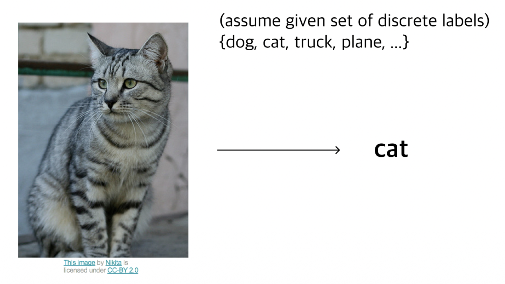
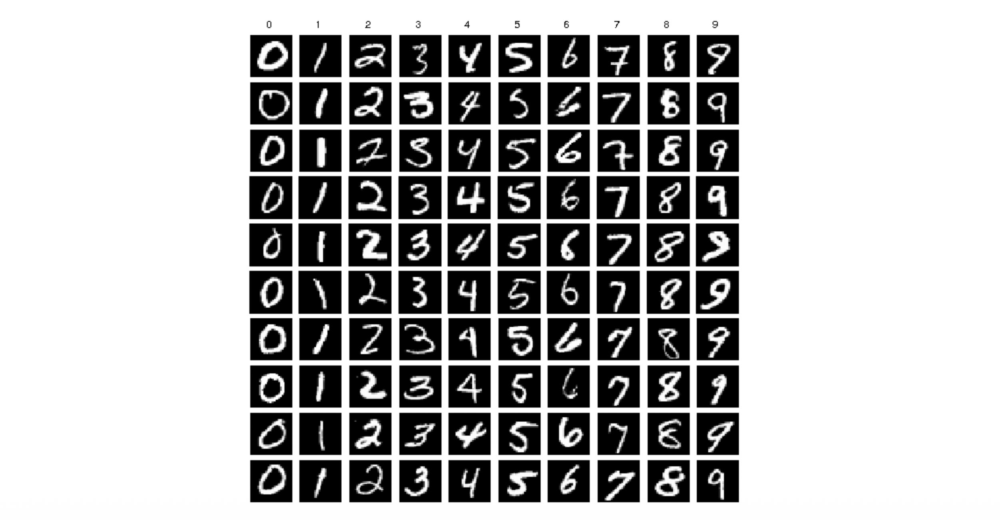
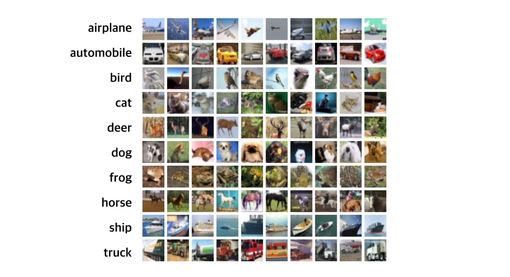
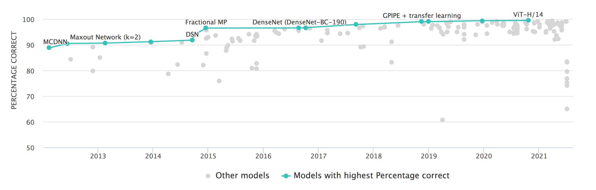
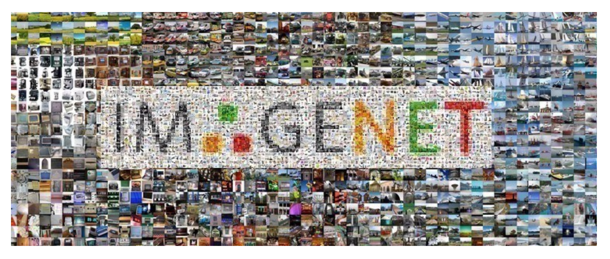
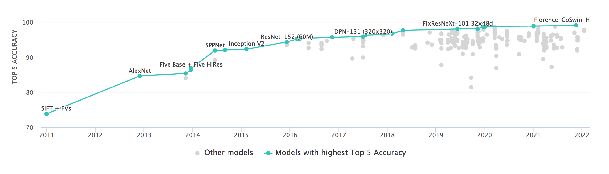

# 1. Introduction

* 본 포스트는 서울대학교 "Basics of Deep Learning" 강의(M2177.0043)의 Lecture 2 내용 중 앞부분인 **이미지 분류(Image Classification)**의 기초 개념과 주요 데이터셋에 대해 정리한 것이다.

* 딥러닝, 특히 컴퓨터 비전(Computer Vision) 분야에서 가장 기본이 되는 태스크(Task)는 바로 **분류(Classification)**이다. 본 강의에서는 기계가 이미지를 어떻게 인식하는지, 그리고 인간의 인식 체계와 어떤 차이(Gap)가 있는지 살펴보고, 이를 평가하기 위한 표준 데이터셋들의 발전 과정을 다룬다.

# 2. Image Classification Problem

## 2.1. 문제 정의 (Problem Definition)

* 이미지 분류란 입력된 이미지에 대해 미리 정의된 이산적인(discrete) 라벨 집합에서 하나의 정답 라벨을 할당하는 작업을 말한다.
* 이를 수식적으로 표현하면 다음과 같다.
* 입력 이미지 $X$가 주어졌을 때, 분류 모델 $f$는 정의된 라벨 집합 $Y = \{y_1, y_2, \dots, y_K\}$ 중 하나를 출력해야 한다.
* 예를 들어, 아래의 고양이 사진을 입력받았을 때, 컴퓨터는 이를 "cat"이라는 라벨로 분류해내야 한다.

## 2.2. 컴퓨터가 보는 세상 (What the computer sees)

* 사람은 직관적으로 이미지를 객체(Object) 단위로 인식하지만, 컴퓨터에게 이미지는 거대한 **숫자들의 그리드(Grid of numbers)**일 뿐이다.
* 디지털 이미지는 일반적으로 다음과 같은 3차원 텐서(Tensor)로 표현된다.
$$
\text{Image} \in \mathbb{R}^{H \times W \times C}
$$
  * 여기서 각 차원은 다음을 의미한다.
    * $H$: 높이(Height)
    * $W$: 너비(Width)
    * $C$: 채널(Channel, RGB의 경우 3)
* 각 픽셀(Pixel)은 정수 값을 가지며, 보통 8-bit 이미지의 경우 $[0, 255]$ 사이의 값을 가진다.
$$
\text{Pixel Value} \in \{0, 1, \dots, 255\}
$$

* 예를 들어, $800 \times 600$ 해상도의 컬러 이미지는 컴퓨터 내부에서 다음과 같은 크기의 배열로 처리된다.
$$
800 \times 600 \times 3 = 1,440,000 \text{ numbers}
$$

![Figure 2: 컴퓨터 시각에서의 이미지 처리. 고양이 사진의 특정 영역(박스)을 확대하면, 컴퓨터는 이를 의미론적 정보가 아닌 [0, 255] 범위의 3채널(RGB) 정수 행렬로 인식함을 보여준다.](./images/pixel_grid_representation.png)

## 2.3. Semantic Gap 및 도전 과제

* 이미지 분류가 어려운 핵심적인 이유는 **Semantic Gap** 때문이다.
* **Semantic Gap**: 픽셀 값들의 변화와 인간이 인지하는 의미(Semantic meaning) 사이의 괴리.
* 고양이 사진의 픽셀 값을 조금만 바꾸거나, 카메라 각도를 살짝만 틀어도 픽셀 데이터의 분포는 완전히 달라진다. 하지만 인간은 여전히 이를 "고양이"로 인식한다.

* 컴퓨터 비전 알고리즘은 이러한 격차를 극복하고 다음과 같은 다양한 변형(Variation)에 강건(Robust)해야 한다.
  * **Viewpoint variation**: 카메라의 시점에 따라 객체가 다르게 보임
  * **Illumination**: 조명 조건에 따른 픽셀 값 변화
  * **Deformation**: 객체의 형태 변형 (예: 앉아있는 고양이 vs 누워있는 고양이)
  * **Occlusion**: 객체의 일부가 가려짐
  * **Background clutter**: 배경과 객체의 색상이나 패턴이 유사하여 구분이 어려움
  * **Intraclass variation**: 같은 클래스(예: 의자) 내에서도 다양한 생김새가 존재

# 3. Standard Datasets (Benchmarks)

* 머신러닝 알고리즘의 성능을 객관적으로 비교 평가하기 위해서는 표준화된 데이터셋이 필수적이다. 딥러닝의 발전사는 데이터셋의 발전사와 궤를 같이한다.

## 3.1. MNIST

* 가장 고전적인 데이터셋으로, 손글씨 숫자 분류를 위해 사용된다.
  * **Content**: 0부터 9까지의 필기체 숫자 (10 Classes)
  * **Dimension**: $28 \times 28$ Grayscale (흑백)
  * **Size**: Training 50,000장 / Test 10,000장

## 3.2. CIFAR-10

* 작은 크기의 컬러 이미지 데이터셋으로, 일반적인 객체 인식을 위해 널리 사용된다.
  * **Content**: 비행기, 자동차, 새, 고양이, 사슴, 개, 개구리, 말, 배, 트럭 (10 Classes)
  * **Dimension**: $32 \times 32 \times 3$ Color (RGB)
  * **Size**: Training 50,000장 / Test 10,000장

### CIFAR-10에서의 성능 발전
* CIFAR-10 데이터셋에 대한 분류 정확도는 딥러닝 모델의 발전과 함께 급격히 상승했다.
  * 2013~2015년: Maxout Network, Fractional MP 등의 모델들이 등장하며 정확도 90% 돌파
  * 2017년 이후: DenseNet, GPIPE 등을 거치며 인간의 인식 능력을 상회
  * 최신(ViT-H/14 등): 99% 이상의 정확도에 도달하며 사실상 포화 상태(Saturated)에 이름

## 3.3. ImageNet (ILSVRC)

* 현대 딥러닝, 특히 Convolutional Neural Network(CNN)의 붐을 일으킨 대규모 데이터셋이다.
  * **Content**: 매우 다양한 실제 사물 및 동물 사진
  * **Classes**: 1,000개 (WordNet 계층 구조 기반)
  * **Size**: Training ~1.2 Million장 / Test 100,000장
  * **Resolution**: 고해상도 (모델 입력 시 보통 $224 \times 224$ 등으로 리사이징하여 사용)

### ImageNet Challenge의 의미
* ImageNet Large Scale Visual Recognition Challenge (ILSVRC)의 Top-5 Error Rate(상위 5개 예측 중 정답이 없을 확률) 변화는 딥러닝 역사의 이정표와 같다.
  * **Human Performance**: 훈련된 인간 전문가의 오차율은 약 **5.1%**로 알려져 있다.
  * **AlexNet (2012)**: 딥러닝 기반 모델의 가능성을 증명하며 오차율을 획기적으로 낮춤.
  * **ResNet (2015)**: 인간의 성능(5.1%)을 처음으로 넘어섬 (Super-human performance).
  * **Current SOTA**: Top-5 Accuracy가 99% 이상(Error < 1%)에 도달함 (Florence, CoSwin 등).

