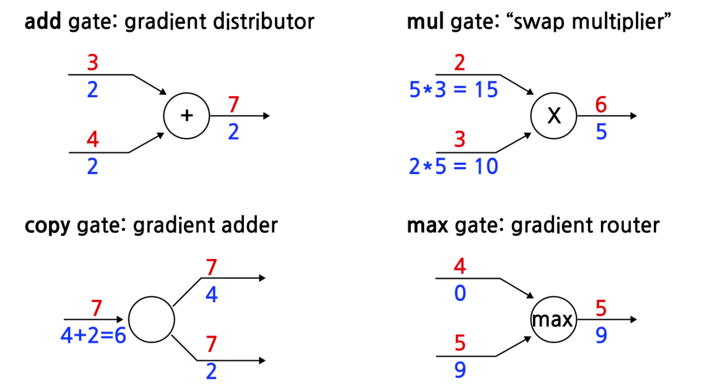

## 들어가며 (Overview)

지난 시간에는 강의 운영 방식과 딥러닝에 대한 소개, 그리고 최적화의 큰 그림을 살펴보았습니다. 이번 강의에서는 **신경망 학습의 가장 기본적인 골격**을 구성하는 다음 네 가지 주제를 다룹니다.

* **Classification (분류):** 우리가 풀고자 하는 문제의 정의와 그 어려움
* **Score functions (점수 함수):** 입력을 클래스별 점수로 매핑하는 함수
* **Loss functions (손실 함수):** 그 점수가 얼마나 좋은지 정량화하는 함수
* **Computational graphs (계산 그래프):** 손실을 파라미터에 대해 미분하기 위한 추상화 도구

큰 흐름은 다음과 같습니다. 먼저 **입력 $x$를 점수 $s$로 바꾸는 함수**를 정의하고, 그 점수가 정답과 얼마나 어긋나는지를 **손실 함수**로 측정합니다. 그리고 이 손실을 줄이는 방향으로 파라미터를 갱신하기 위해, 손실을 파라미터로 미분해야 하는데 이때 사용하는 핵심 알고리즘이 바로 **역전파(backpropagation)**입니다. 본 강의의 전반부는 "무엇을 최소화할 것인가(손실)"를, 후반부는 "어떻게 그 미분을 계산할 것인가(계산 그래프)"를 다룬다고 보시면 됩니다.

---

## 1. 분류 (Classification)

### 1.1 분류 문제의 정의

분류란, 미리 주어진 **이산적인 레이블 집합(discrete labels)** 예를 들어 $\{\text{dog}, \text{cat}, \text{truck}, \text{plane}, \dots\}$ 가운데 입력에 가장 알맞은 하나를 선택하는 문제입니다. 예컨대 고양이 사진을 입력으로 받으면 출력으로 "cat"이라는 레이블을 내놓아야 합니다.


### 1.2 분류의 어려움 (Challenges)

#### 의미 격차 (Semantic gap)

사람에게 고양이 사진은 그냥 "고양이"이지만, 컴퓨터가 보는 것은 **$[0, 255]$ 범위의 정수들로 이루어진 거대한 격자(grid)**일 뿐입니다. 예를 들어 $800 \times 600$ 해상도의 RGB 이미지는 $800 \times 600 \times 3$개의 숫자로 이루어집니다.

* 우리가 부여하는 "고양이"라는 **의미(semantic concept)**와, 컴퓨터가 실제로 다루는 **픽셀 값의 배열** 사이에는 큰 간극이 존재합니다. 이를 **의미 격차(semantic gap)**라고 부릅니다.
* 분류 알고리즘이 해야 할 일은 결국 이 픽셀 숫자들로부터 의미를 복원해 내는 것입니다.


#### 그 밖의 어려움 (Other challenges)

같은 "고양이"라도 다음과 같은 변동 요인 때문에 픽셀 값이 크게 달라집니다.

* **배경 혼잡(Background clutter):** 대상이 배경과 비슷한 색·질감을 가져 구분이 어려운 경우
* **가림(Occlusion):** 대상의 일부만 보이는 경우
* **변형(Deformation):** 같은 객체라도 자세나 형태가 달라지는 경우

이 외에도 조명 변화, 시점 변화, 크기 변화 등 수많은 요인이 존재합니다. 분류기는 이런 **클래스 내 변동(intra-class variation)**에도 강건해야 합니다.


### 1.3 대표적인 데이터셋 (Example datasets)

강의에서는 분류 연구의 표준 벤치마크로 세 가지 데이터셋을 소개합니다.

* **MNIST:** 손글씨 숫자 분류. $28 \times 28$ 해상도, 학습 이미지 50,000장, 테스트 이미지 10,000장.
* **CIFAR-10:** 유명한 이미지 분류 데이터셋. 10개 클래스, $32 \times 32$ 해상도, 학습 50,000장, 테스트 10,000장.
* **ImageNet:** 고해상도 이미지 분류. 1,000개 클래스, 학습 약 1.2M장, 테스트 100K장.


### 1.4 기계 분류기의 발전 (Progress of machine classifiers)

* **CIFAR-10:** 2013년경 MCDNN, Maxout Network에서 시작하여 Fractional MP, DSN, DenseNet, GPIPE + transfer learning을 거쳐 ViT-H/14에 이르기까지, Top-1 테스트 정확도가 90% 수준에서 거의 99%에 가깝게 꾸준히 향상되었습니다.
* **ImageNet:** **사람 전문가의 top-5 오류율은 약 5.1%**인 반면, 최신 기계 분류기는 **약 1%의 top-5 오류율**을 달성하여 인간 수준을 넘어섰습니다. SIFT+FVs → AlexNet → Inception/ResNet → DPN → FixResNeXt → Florence-CoSwin-H로 이어지는 발전 궤적이 이를 보여줍니다.


---

## 2. 점수 함수 (Score Functions)

### 2.1 정의 (Definition)

> **정의 (Score function).** 점수 함수는 파라미터화된 함수
> $$
> f_\theta : \mathcal{X} \to \mathbb{R}^C
> $$
> 로서, 입력 $x \in \mathcal{X}$를 실수값 점수 벡터
> $$
> s = f_\theta(x) = (s_1, \dots, s_C)
> $$
> 로 매핑합니다. 여기서 $s_j$는 클래스 $j$에 부여된 점수이고, $\theta$는 모델 파라미터를 의미합니다.

핵심적으로 이해해야 할 두 가지 성질이 있습니다.

* **예측 레이블**은 보통 점수가 가장 큰 클래스로 정합니다.
$$
\hat{y} = \arg\max_{j \in \{1, \dots, C\}} s_j
$$
* **점수는 확률이 아닙니다.** 점수는 각 클래스에 대한 **정규화되지 않은 선호도(unnormalized preferences)**일 뿐입니다. "정답 클래스가 다른 클래스보다 더 높은 점수를 받도록" 강제하는 것은 곧이어 정의할 손실 함수의 역할입니다.

### 2.2 $C$-way 분류를 위한 예시 점수 함수

가장 단순한 형태는 **선형 분류기(linear classifier)**입니다. CIFAR-10 이미지($32 \times 32 \times 3 = 3072$개의 숫자)를 입력으로 받는다고 하면,

$$
\underbrace{f(x, W)}_{C \times 1} = \underbrace{W}_{C \times 3072}\, \underbrace{x}_{3072 \times 1} + \underbrace{b}_{C \times 1}
$$

* 입력 이미지 $x$는 픽셀을 일렬로 펼친 **3072차원 벡터**입니다.
* $W$는 $C \times 3072$ **가중치(weight) 행렬**, $b$는 $C$차원 **편향(bias) 벡터**입니다.
* 출력은 클래스별 점수를 담은 $C$차원 벡터입니다.

> **선형대수 보충.** 행렬-벡터 곱 $Wx$에서 $W$의 $j$번째 행 $W_{j,:}$와 입력 $x$의 내적 $W_{j,:}\cdot x$가 클래스 $j$의 점수를 만듭니다. 즉 각 클래스는 자신만의 가중치 벡터(템플릿)를 가지며, 입력과의 정렬도(내적)가 곧 점수가 됩니다.


### 2.3 3-way 분류 구체 예시

작은 예시로, 입력 이미지의 픽셀을 펼친 열벡터 $x = [56, 231, 24, 2]^\top$와 다음 가중치·편향을 생각해 봅니다.

$$
W = \begin{bmatrix} 0.2 & -0.5 & 0.1 & 2.0 \\ 1.5 & 1.3 & 2.1 & 0.0 \\ 0 & 0.25 & 0.2 & -0.3 \end{bmatrix}, \qquad
b = \begin{bmatrix} 1.1 \\ 3.2 \\ -1.2 \end{bmatrix}
$$

이때 점수 $s = Wx + b$를 행별로 계산하면 다음과 같습니다(첫 번째 행만 풀어 보면):

$$
s_{\text{cat}} = (0.2)(56) + (-0.5)(231) + (0.1)(24) + (2.0)(2) + 1.1 = -96.8
$$

같은 방식으로 $s_{\text{dog}} = 437.9$, $s_{\text{ship}} = 61.95$를 얻습니다. 즉 이 $W$로는 입력 고양이 이미지를 **dog로 잘못 분류**하게 됩니다(가장 높은 점수가 dog). 좋은 $W$라면 cat 점수가 가장 높아야 합니다.


### 2.4 학습된 선형 분류기의 해석 (Interpreting a learned linear classifier)

#### 템플릿 관점

선형 분류기의 각 클래스 가중치 $W_{j,:}$를 다시 이미지 형태로 펼쳐 보면, 그 클래스의 **평균적 외형(템플릿)**처럼 보입니다. CIFAR-10에서 학습된 가중치를 시각화하면, 예를 들어 "ship" 가중치는 배경이 파란색(물·하늘)을 띠고, "horse" 가중치는 머리가 양쪽에 달린 듯한 형상을 보입니다. 이는 선형 분류기가 한 클래스당 **하나의 템플릿**만 학습할 수 있다는 한계도 동시에 드러냅니다.


#### 기하학적 관점

또 다른 관점은 **고차원 픽셀 공간 속 결정 경계(decision boundary)**로 보는 것입니다. 각 클래스의 가중치 벡터는 그 클래스 점수가 0이 되는 초평면(hyperplane)을 정의하며, 가중치 벡터 방향으로 갈수록 해당 클래스 점수가 커집니다.


### 2.5 10-way 분류 점수 예시와 동기 부여

세 장의 이미지(고양이, 자동차, 개구리)에 대해 10개 클래스 점수를 계산해 보면, 정답 클래스가 항상 최고 점수를 받지는 않습니다. 예를 들어 고양이 이미지에서는 cat 점수(2.9)보다 dog 점수(8.02)가 더 높게 나오기도 합니다.

여기서 자연스러운 질문이 생깁니다.

> **이 $W$가 좋은지 나쁜지를 어떻게 판단할 수 있을까요?**

이 질문에 정량적으로 답하기 위한 도구가 바로 다음 장의 **손실 함수**입니다.


---

## 3. 손실 함수 (Loss Functions)

### 3.1 직관과 정의

* 손실 함수는 어떤 사건이나 값에 대해, 그것과 결부된 **"비용(cost)"**을 직관적으로 나타내는 실수값을 대응시키는 함수입니다.
* 분류 예시에서, 데이터셋 $\{(x_i, y_i)\}_{i=1}^n$ ($x_i$는 이미지, $y_i$는 레이블)이 주어졌을 때 데이터셋 전체의 손실은 다음과 같이 정의됩니다.

$$
\ell(W) = \frac{1}{n}\sum_i \ell_i(W) = \frac{1}{n}\sum_i d\big(\underbrace{f(x_i, W)}_{\text{score function}}, \underbrace{y_i}_{\text{label}}\big)
$$

좀 더 형식적으로 정리하면 다음과 같습니다.

> **정의 (Loss function).** 입력 공간을 $\mathcal{X}$, 레이블 공간을 $\mathcal{Y}$라 하고, $\theta$로 파라미터화된 점수 함수를 $f_\theta : \mathcal{X} \to \mathbb{R}^C$라 합시다. **손실 함수**는 점수 벡터 $f_\theta(x)$와 레이블 $y$에 실수 페널티를 대응시키는 사상
> $$
> d : \mathbb{R}^C \times \mathcal{Y} \to \mathbb{R}
> $$
> 이며, $d(f_\theta(x), y)$는 예측이 정답 레이블과 얼마나 비호환적인지(incompatible)를 측정합니다. 데이터셋 $\{(x_i, y_i)\}_{i=1}^n$이 주어지면, 대응되는 **경험적 위험(empirical risk)**은
> $$
> \ell(\theta) = \frac{1}{n}\sum_{i=1}^n \ell_i(\theta) = \frac{1}{n}\sum_{i=1}^n d(f_\theta(x_i), y_i)
> $$
> 입니다. 분류에서는 흔히 $\theta = W$ (또는 $\theta = (W, b)$)로 두어
> $$
> \ell(W) = \frac{1}{n}\sum_{i=1}^n d(f(x_i; W), y_i)
> $$
> 로 씁니다.

> **통계학 보충.** 여기서 "경험적 위험"이란, 데이터 분포에 대한 기대 손실(진짜 위험)을 우리가 가진 유한한 표본 평균으로 근사한 것입니다. 학습은 이 경험적 위험을 최소화하는 파라미터를 찾는 과정(ERM, Empirical Risk Minimization)으로 이해할 수 있습니다.

### 3.2 학습 파이프라인 (Training pipeline)

전체 학습 과정은 다음과 같은 흐름으로 요약됩니다.

$$
x \xrightarrow{\;\text{score function } f_\theta\;} s \xrightarrow{\;\text{loss } \ell(\cdot, y)\;} \ell
$$

* **점수 함수**는 입력을 클래스 점수로 매핑합니다.
* **손실 함수**는 그 점수가 정답 레이블과 얼마나 잘 맞는지 측정합니다.
* **역전파(backpropagation)**는 손실을 파라미터에 대해 미분하여 그래디언트를 계산합니다.

이제 구체적인 손실 함수 두 가지를 살펴봅니다.

### 3.3 다중 클래스 힌지 손실 (Multiclass hinge loss)

예제 $(x_i, y_i)$가 주어지고, 점수 벡터를 $s = f(x_i, W) \in \mathbb{R}^C$로 줄여 쓰면 힌지 손실(SVM 손실)은 다음 형태를 가집니다.

$$
\ell_i(W) = \sum_{j \neq y_i} \text{hinge}(s_j, s_{y_i}) = \sum_{j \neq y_i} \max(0,\, s_j - s_{y_i} + 1)
$$

**해석 단계별로 살펴보면:**

* 정답 클래스가 아닌 모든 $j$에 대해, "오답 점수 $s_j$"가 "정답 점수 $s_{y_i}$"보다 **1(마진) 이상 작지 않으면** 그만큼 페널티를 줍니다.
* 즉 정답 점수가 다른 모든 점수를 **적어도 마진 1만큼 앞서면** 그 항의 손실은 0이 됩니다.
* 여기서 "1"은 **마진(margin)** 하이퍼파라미터로, 점수의 스케일에 따라 흡수될 수 있어 통상 1로 고정합니다.


### 3.4 다항 로지스틱 손실 (Multinomial logistic loss)

로지스틱 손실(softmax + cross-entropy)은 점수를 **정규화되지 않은 로그 확률**로 간주합니다. 클래스 확률을 softmax로 정의하면,

$$
P(Y = k \mid X = x_i) = \frac{e^{s_k}}{\sum_j e^{s_j}}
$$

여기서 우리는 **정답 클래스의 로그 가능도를 최대화**하거나, 동치로 **음의 로그 가능도(negative log-likelihood)를 최소화**하고자 합니다.

$$
\ell_i(W) = -\log\!\left( \frac{e^{s_{y_i}}}{\sum_j e^{s_j}} \right)
$$

**유도 흐름을 정리하면:**

1. **가정:** 점수 $s_k$를 클래스 $k$의 비정규화 로그 확률로 본다, 즉 $\log P(Y=k) \propto s_k$.
2. **정규화:** 확률이 되려면 합이 1이어야 하므로 분모 $\sum_j e^{s_j}$로 나누는 softmax를 취한다.
3. **목적식:** 정답 클래스 확률 $P(Y=y_i)$를 최대화 → 로그를 취해 합으로 다루기 쉽게 → 부호를 뒤집어 최소화 문제로 전환.

> **확률 보충 (softmax의 성질).** softmax는 모든 출력을 $(0,1)$로 보내고 합을 1로 만듭니다. 또한 모든 점수에 같은 상수를 더해도 값이 불변($\frac{e^{s_k+c}}{\sum_j e^{s_j+c}} = \frac{e^{s_k}}{\sum_j e^{s_j}}$)이라는 **이동 불변성**을 가지며, 이는 수치 안정화를 위해 최댓값을 빼는 트릭의 근거가 됩니다.


### 3.5 두 손실의 비교 (Comparison)

$$
\ell_i(W) = \sum_{j \neq y_i} \max(0,\, s_j - s_{y_i} + 1) \qquad \text{vs.} \qquad \ell_i(W) = -\log\!\left( \frac{e^{s_{y_i}}}{\sum_j e^{s_j}} \right)
$$

정답이 $y_i = 0$(첫 번째 클래스)이라고 할 때, 다음 두 점수 벡터를 생각해 봅니다.

* **$[10, 9, 9]$:** 정답이 1등이지만 간발의 차이
* **$[10, -100, -100]$:** 정답이 압도적으로 1등

**힌지 손실 관점:**

* $[10, 9, 9]$: $\max(0, 9 - 10 + 1) + \max(0, 9 - 10 + 1) = \max(0, 0) + \max(0, 0) = 0$
* $[10, -100, -100]$: $\max(0, -100 - 10 + 1) \times 2 = 0$

→ 두 경우 모두 손실이 0입니다. 그러나 $[10, 9, 9]$는 **마진 경계에 아슬아슬하게 걸쳐** 있어, 데이터를 조금만 perturb해도 손실이 양수가 될 수 있습니다. 반면 $[10, -100, -100]$은 흔들어도 여전히 0입니다.

**로지스틱 손실 관점:**

* $[10, 9, 9]$: $-\log \frac{e^{10}}{e^{10} + 2e^{9}}$는 작지만 0보다 분명히 큽니다.
* $[10, -100, -100]$: $-\log \frac{e^{10}}{e^{10} + 2e^{-100}} \approx 0$

→ 로지스틱 손실은 두 경우를 **다르게** 평가합니다. 확률 질량이 정답에 더 집중될수록 손실이 더 작아집니다.

**핵심 차이 요약:**

* **힌지 손실**은 정답 클래스가 나머지를 **충분한 마진으로 이기는지 여부**만 신경 씁니다. 일단 마진을 넘기면 더 이상의 보상이 없습니다.
* **로지스틱 손실**은 정답 클래스에 **확률 질량이 얼마나 확신 있게 집중되는지**까지 신경 씁니다. 항상 더 확신하도록 미세하게 밀어붙입니다.

### 3.6 해의 유일성 (Uniqueness)

손실을 0으로 만드는 $W$를 찾았다고 합시다. 이 $W$는 유일할까요? 다음 설정에서 생각해 봅니다.

$$
f(x, W) = Wx, \qquad \ell(W) = \frac{1}{n}\sum_{i=1}^n \sum_{j \neq y_i} \max\big(0,\, f(x_i, W)_j - f(x_i, W)_{y_i} + 1\big)
$$

* **일반적으로 답은 '아니오'입니다.**
* 모든 학습 예제가 이미 마진 제약을 만족한다면, $W$를 1보다 큰 상수로 **스케일링**해도 여전히 손실이 0으로 유지됩니다.
* 특히 $\ell(W) = 0$이면 항상 $\ell(2W) = 0$입니다.

**증명 스케치.** $\ell(W) = 0$이라면, 모든 $i$와 모든 $j \neq y_i$에 대해
$$
f(x_i, W)_j - f(x_i, W)_{y_i} + 1 \leq 0 \;\Longleftrightarrow\; f(x_i, W)_j - f(x_i, W)_{y_i} \leq -1.
$$
이때 $f(x, 2W) = 2Wx = 2 f(x, W)$이므로 점수 차이도 2배가 되어
$$
2\big(f(x_i, W)_j - f(x_i, W)_{y_i}\big) \leq -2 \leq -1
$$
이고, 따라서 $\max(0, 2(\cdots) + 1) = 0$이 성립합니다. 즉 $\ell(2W) = 0$. $\square$

이처럼 **데이터 손실만으로는 해가 무수히 많을 수 있습니다.** 이 모호성을 해소하고 "더 단순한 모델"을 선호하도록 만드는 장치가 다음에 다룰 정규화입니다.

### 3.7 정규화: 더 단순한 모델 선호 (Regularization: Prefer simpler model)

같은 학습 데이터를 설명하는 여러 모델이 있을 때, 우리는 **더 단순한 모델을 선호**해야 합니다. 그 이유는 일반화(generalization) 때문입니다.

* 데이터 점들을 보면, 이를 통과시키는 방법은 여러 가지입니다.
* 복잡한 곡선 $f_1$은 학습 데이터를 완벽히 통과하지만 매우 구불구불합니다. 단순한 직선 $f_2$는 학습 데이터에 약간의 오차를 남깁니다.
* 새로운 **테스트 데이터**가 들어오면, 학습 데이터에 과하게 맞춰진 $f_1$은 노이즈까지 학습한 탓에 오히려 더 나쁜 예측을 합니다. 단순한 $f_2$가 더 잘 일반화합니다.
* **정규화는 데이터를 "너무 잘" 맞추는 것에 제동을 걸어, 데이터의 노이즈까지 학습하지 않도록 합니다.**


#### 정규화의 형식화

* **정규화 함수**는 모델의 복잡도를 정량화하고, 복잡한 모델에 페널티를 부과합니다.
* **단순한 모델은 과소적합(underfit)**할 수 있고, **복잡한 모델은 과적합(overfit)**할 수 있습니다. 둘 사이의 균형이 필요합니다.

전체 목적 함수는 **데이터 손실(data loss) + 정규화(regularization)**의 합으로 구성됩니다.

$$
\ell(W) = \underbrace{\frac{1}{n}\sum_{i=1}^n \ell_i(W)}_{\substack{\text{Data loss:}\\ \text{모델 예측이 학습 데이터와}\\ \text{일치해야 함}}} + \underbrace{\lambda R(W)}_{\substack{\text{Regularization:}\\ \text{테스트 데이터에서 잘 작동하도록}\\ \text{모델이 단순해야 함}}}
$$

여기서 $\lambda$는 두 항의 균형을 조절하는 **정규화 강도(하이퍼파라미터)**입니다.

#### 대표적인 정규화 항

* **$\ell_2$ 정규화:** $R(W) = \|W\|^2$ — MAP 추론(Maximum a Posteriori)과의 연결을 가집니다(가중치에 가우시안 사전분포를 가정한 것에 대응).
* **$\ell_1$ 정규화:** $R(W) = \|W\|_1$ — 희소 해(sparse solution)를 유도합니다(이후 Network Pruning 강의에서 더 자세히 다룹니다).
* **핵 노름(Nuclear/trace norm):**
$$
R(W) = \|W\|_* = \text{Tr}\!\left(\sqrt{W^\top W}\right) = \sum_{i=1}^{\min(m,n)} \sigma_i(W)
$$
즉 특이값(singular value)들의 합으로, 저랭크(low-rank) 해를 유도합니다.
* **Dropout, Batch normalization** 등도 넓은 의미의 정규화 기법에 속합니다.

> **선형대수 보충 (핵 노름).** $\sqrt{W^\top W}$는 대칭 양의 준정부호 행렬의 제곱근으로, 그 고윳값이 곧 $W$의 특이값 $\sigma_i$입니다. 따라서 핵 노름은 특이값들의 $\ell_1$ 노름에 해당하며, 행렬의 "랭크"를 부드럽게(convex하게) 대리하는 양으로 자주 쓰입니다.

---

## 4. 계산 그래프 (Computational Graphs)

### 4.1 정의 (Definition)

> **정의 (Computation graph).** 계산 그래프는 함수들의 모음과 함께 주어지는 **방향 비순환 그래프(DAG, Directed Acyclic Graph)** $G = (V, E)$로서, 다음과 같이 구성됩니다.
>
> * **노드 $V$:** 각 노드 $v \in V$는 입력, 파라미터, 또는 계산 연산 중 하나를 나타냅니다. 입력 노드의 값은 외부에서 공급되며(데이터나 모델 파라미터), 입력이 아닌 노드는 자신의 선행 노드 출력으로부터 값을 계산하는 함수 $f_v$와 결합됩니다.
> * **엣지 $E \subseteq V \times V$:** 방향 엣지 $(u, v) \in E$는 노드 $u$의 출력이 노드 $v$의 입력으로 사용됨을 나타냅니다.
> * **계산:** 입력이 아닌 노드 $v$의 직접 선행자 집합을 $\text{pred}(v) = \{u \mid (u, v) \in E\}$라 할 때, 노드 $v$에서 계산되는 값은
> $$
> x_v = f_v\big(\{x_u \mid u \in \text{pred}(v)\}\big)
> $$
> 입니다.

이어지는 정의는 다음과 같습니다.

> * **입력과 출력:** 입력 노드의 부분집합 $I \subset V$와 출력 노드의 부분집합 $O \subset V$가 지정됩니다. 그래프가 수행하는 전체 계산은 노드 함수들의 합성을 통해 입력값을 출력값으로 보내는 함수 $F : \mathbb{R}^{|I|} \to \mathbb{R}^{|O|}$입니다.
> * **비순환성(Acyclicity):** 그래프가 비순환이라는 성질은 노드들의 **위상 정렬(topological ordering)**이 존재함을 보장합니다. 이로써 각 노드의 값은 자신의 모든 의존성(선행자)이 평가된 뒤에 계산될 수 있어, 계산이 잘 정의(well-defined)됩니다.

딥러닝에서 이 추상화는 신경망의 **순전파(forward pass)**를 단순한 함수들(선형 변환, 비선형 활성화, 손실 함수 등)의 합성으로 표현하게 해 주며, 그래프를 **역순으로 순회하며 미분을 계산하는 역전파** 알고리즘의 토대가 됩니다.

### 4.2 계산 그래프로 본 분류 손실

앞서 다룬 분류 손실 전체를 계산 그래프로 그리면 다음과 같은 모듈들의 합성으로 표현됩니다.

* 입력 $x_i$와 파라미터 $W$가 곱셈 노드 $*$로 들어가 점수 $s = Wx_i$를 만든다.
* 점수가 hinge loss 노드로 들어가 $L_i = \sum_{j \neq y_i} \max(0, s_j - s_{y_i} + 1)$을 계산한다.
* 동시에 $W$는 정규화 노드 $R$로 들어가 $R(W)$를 계산한다.
* 마지막 덧셈 노드 $+$가 데이터 손실과 정규화를 합쳐 최종 손실 $L$을 낸다.


### 4.3 역전파 예시 (Backpropagation example)

가장 단순한 예시로 다음 함수를 봅니다.

$$
f(x, y, z) = (x + y)z, \qquad \text{예: } x = -2,\; y = 5,\; z = -4
$$

#### 순전파 (Forward pass)

중간 변수 $q = x + y$를 도입하면 $f = qz$입니다.

$$
q = x + y = -2 + 5 = 3, \qquad f = qz = (3)(-4) = -12
$$

#### 국소 미분 (Local gradients)

각 노드의 국소 미분은 다음과 같습니다.

$$
q = x + y \;\Rightarrow\; \frac{\partial q}{\partial x} = 1,\quad \frac{\partial q}{\partial y} = 1
$$
$$
f = qz \;\Rightarrow\; \frac{\partial f}{\partial q} = z,\quad \frac{\partial f}{\partial z} = q
$$

우리가 구하고 싶은 것은 $\dfrac{\partial f}{\partial x}, \dfrac{\partial f}{\partial y}, \dfrac{\partial f}{\partial z}$입니다.

#### 역전파 (Backward pass)

출력에서 시작해 입력 방향으로 **연쇄 법칙(chain rule)**을 적용합니다.

$$
\frac{\partial f}{\partial f} = 1, \qquad \frac{\partial f}{\partial z} = q = 3, \qquad \frac{\partial f}{\partial q} = z = -4
$$

$q$를 거쳐 $x, y$로 그래디언트를 흘려보내면:

$$
\frac{\partial f}{\partial y} = \frac{\partial f}{\partial q} \cdot \frac{\partial q}{\partial y} = (-4)(1) = -4
$$
$$
\frac{\partial f}{\partial x} = \underbrace{\frac{\partial f}{\partial q}}_{\text{Upstream gradient}} \cdot \underbrace{\frac{\partial q}{\partial x}}_{\text{Local(downstream) gradient}} = (-4)(1) = -4
$$

여기서 **upstream gradient(상류 그래디언트)**는 출력 쪽에서 흘러 들어온 $\partial f / \partial q$이고, **local gradient(국소 그래디언트)**는 해당 노드 자체의 미분 $\partial q / \partial x$입니다. 둘의 곱이 입력으로 전달할 그래디언트가 됩니다.


### 4.4 계산 그래프의 노드 (Nodes in computational graph)

역전파의 핵심 단위인 **하나의 노드 $f$**에 집중해 봅시다. 노드는 입력 $x, y$를 받아 출력 $z$를 냅니다.

* **국소 그래디언트(local gradient):** 노드는 자신의 출력을 입력으로 미분한 $\dfrac{\partial z}{\partial x}$, $\dfrac{\partial z}{\partial y}$를 알고 있습니다.
* **상류 그래디언트(upstream gradient):** 역전파 시, 출력 쪽에서 $\dfrac{\partial L}{\partial z}$가 흘러 들어옵니다.
* **하류 그래디언트(downstream gradient):** 연쇄 법칙에 의해, 각 입력으로 전달할 그래디언트는 **국소 × 상류**입니다.

$$
\frac{\partial L}{\partial x} = \frac{\partial L}{\partial z} \cdot \frac{\partial z}{\partial x}, \qquad
\frac{\partial L}{\partial y} = \frac{\partial L}{\partial z} \cdot \frac{\partial z}{\partial y}
$$

이것이 역전파의 **모듈성(modularity)**의 핵심입니다. 각 노드는 전체 네트워크 구조를 몰라도, "내 국소 미분"과 "위에서 받은 상류 그래디언트"만 알면 "아래로 보낼 하류 그래디언트"를 계산할 수 있습니다.


### 4.5 시그모이드 예시 (Sigmoid example)

좀 더 복잡한 예시로 로지스틱 회귀의 출력 함수를 봅니다.

$$
f(w, x) = \frac{1}{1 + e^{-(w_0 x_0 + w_1 x_1 + w_2)}}
$$

#### 순전파

값 $w_0 = 2, x_0 = -1, w_1 = -3, x_1 = -2, w_2 = -3$을 대입하여 그래프를 따라 계산합니다.

* $w_0 x_0 = (2)(-1) = -2$
* $w_1 x_1 = (-3)(-2) = 6$
* $-2 + 6 = 4$, 그리고 $4 + w_2 = 4 + (-3) = 1$
* $\times(-1)$: $-1$
* $\exp(\cdot)$: $e^{-1} \approx 0.37$
* $+1$: $1.37$
* $1/x$: $1/1.37 \approx 0.73$

최종 출력은 약 $0.73$입니다.

#### 기본 미분 공식

역전파에 필요한 국소 미분들은 다음과 같습니다.

$$
f(x) = e^x \;\Rightarrow\; \frac{df}{dx} = e^x, \qquad f_a(x) = ax \;\Rightarrow\; \frac{df}{dx} = a
$$
$$
f(x) = \frac{1}{x} \;\Rightarrow\; \frac{df}{dx} = -\frac{1}{x^2}, \qquad f_c(x) = c + x \;\Rightarrow\; \frac{df}{dx} = 1
$$

#### 역전파 (노드 단위로)

출력에서 그래디언트 1.00으로 시작하여 거꾸로 흘립니다.

* **$1/x$ 노드** (입력 1.37): 국소 미분 $-1/x^2 = -1/1.37^2$. 따라서 그래디언트 $= \left(\dfrac{-1}{1.37^2}\right)(1.00) = -0.53$.
* **$+1$ 노드** (덧셈): 국소 미분 1. $\;(1)(-0.53) = -0.53$.
* **$\exp$ 노드** (입력 $-1$): 국소 미분 $e^{x} = e^{-1} = 0.37$. $\;(0.37)(-0.53) \approx -0.20$. (강의 표기 $(e^{-1})(-0.53) = -0.20$)
* **$\times(-1)$ 노드**: 국소 미분 $a = -1$. $\;(-1)(-0.20) = 0.20$.
* **덧셈 노드들**: 덧셈 게이트는 그래디언트를 그대로 분배하므로, $w_2$ 가지와 위쪽 합산 가지에 각각 0.20을 전달합니다(`[1] x [0.2] = 0.2`, 양쪽 입력 모두).
* **곱셈 게이트 $w_0 x_0$**: 곱셈은 입력을 서로 바꾸어 곱합니다(swap).
$$
\frac{\partial f}{\partial x_0} = w_0 \cdot 0.2 = (2)(0.2) = 0.4, \qquad \frac{\partial f}{\partial w_0} = x_0 \cdot 0.2 = (-1)(0.2) = -0.2
$$

이 모든 단계는 "**[국소 그래디언트] × [상류 그래디언트]**"라는 동일한 규칙의 반복입니다.

#### 시그모이드 게이트로 묶어 보기

붉은 박스로 표시된 $\times(-1) \to \exp \to +1 \to 1/x$의 네 노드는 사실 **하나의 시그모이드 함수**를 이룹니다.

$$
\sigma(x) = \frac{1}{1 + e^{-x}}
$$

이 시그모이드의 미분은 다음과 같이 우아하게 정리됩니다.

$$
\frac{d\sigma(x)}{dx} = \frac{e^{-x}}{(1 + e^{-x})^2}
= \left(\frac{1 + e^{-x} - 1}{1 + e^{-x}}\right)\!\left(\frac{1}{1 + e^{-x}}\right)
= \big(1 - \sigma(x)\big)\,\sigma(x)
$$

**유도 과정:**

1. $\sigma(x) = (1 + e^{-x})^{-1}$이므로 연쇄 법칙으로 $\dfrac{d\sigma}{dx} = -(1+e^{-x})^{-2}\cdot(-e^{-x}) = \dfrac{e^{-x}}{(1+e^{-x})^2}$.
2. 분자 $e^{-x} = (1 + e^{-x}) - 1$로 쪼갠다.
3. $\dfrac{(1+e^{-x}) - 1}{(1+e^{-x})^2} = \left(\dfrac{1+e^{-x}-1}{1+e^{-x}}\right)\left(\dfrac{1}{1+e^{-x}}\right) = (1 - \sigma(x))\,\sigma(x)$.

이를 통해 시그모이드 게이트 전체의 국소 그래디언트를 **출력값 하나만으로** 즉시 계산할 수 있습니다. 출력이 0.73이므로,

$$
(0.73)\,(1 - 0.73) = (0.73)(0.27) \approx 0.2
$$

이는 위에서 네 노드를 일일이 통과시켜 얻은 그래디언트 0.2와 정확히 일치합니다. 이렇게 **여러 노드를 의미 있는 단위로 묶으면(modularize)** 계산이 훨씬 간결해집니다.


### 4.6 분기에서 그래디언트는 더해진다 (Gradients add at branches)

하나의 변수 $x$가 여러 경로 $q_1, q_2, \dots$로 갈라져(branch) 출력에 영향을 준다면, 역전파 시 각 경로에서 흘러 들어온 그래디언트를 **모두 합산**합니다. 이는 다변수 연쇄 법칙(multivariate chain rule)의 직접적인 결과입니다.

> **연쇄 법칙 (Chain rule).**
> $$
> \frac{\partial f}{\partial x} = \sum_i \frac{\partial f}{\partial q_i}\,\frac{\partial q_i}{\partial x}
> $$

직관적으로, $x$를 조금 흔들면 그 변화가 $q_1$을 통한 경로와 $q_2$를 통한 경로 모두로 출력에 영향을 미치므로, 두 영향을 합한 것이 총 그래디언트가 됩니다.


### 4.7 벡터화된 코드에서의 그래디언트 (Gradients for vectorized code)

지금까지는 $x, y, z$가 스칼라였지만, 실제 신경망에서는 이들이 **벡터**입니다. 이 경우 국소 그래디언트 $\dfrac{\partial z}{\partial x}$는 더 이상 스칼라가 아니라 **야코비 행렬(Jacobian matrix)**, 즉 $z$의 각 원소를 $x$의 각 원소로 미분한 값들의 행렬이 됩니다. 연쇄 법칙의 형태는 동일하되, 곱이 행렬-벡터 곱으로 바뀝니다.

$$
\frac{\partial L}{\partial x} = \frac{\partial L}{\partial z}\,\frac{\partial z}{\partial x}
$$

여기서 $\dfrac{\partial z}{\partial x}$가 야코비 행렬입니다.


### 4.8 벡터화된 예시 (Vectorized example)

다음 함수의 그래디언트를 계산 그래프로 구해 봅니다.

$$
f(x, W) = \|Wx\|^2 = \sum_{i=1}^n (Wx)_i^2
$$

중간 변수 $q = Wx$를 도입하면,

$$
q = W \cdot x = \begin{pmatrix} W_{1,1}x_1 + \cdots + W_{1,n}x_n \\ \vdots \\ W_{n,1}x_1 + \cdots + W_{n,n}x_n \end{pmatrix}, \qquad
f(q) = \|q\|^2 = q_1^2 + \cdots + q_n^2
$$

#### 구체 수치

$$
W = \begin{bmatrix} 0.1 & 0.5 \\ -0.3 & 0.8 \end{bmatrix}, \qquad x = \begin{bmatrix} 0.2 \\ 0.4 \end{bmatrix}
$$

순전파:
$$
q = Wx = \begin{bmatrix} (0.1)(0.2) + (0.5)(0.4) \\ (-0.3)(0.2) + (0.8)(0.4) \end{bmatrix} = \begin{bmatrix} 0.22 \\ 0.26 \end{bmatrix}, \qquad f = 0.22^2 + 0.26^2 = 0.116
$$

#### $q$에 대한 그래디언트

$$
\frac{\partial f}{\partial q_i} = 2 q_i \quad\Longrightarrow\quad \boxed{\nabla_q f = 2q} = \begin{bmatrix} 0.44 \\ 0.52 \end{bmatrix}
$$

#### $W$에 대한 그래디언트

$q_k = \sum_j W_{k,j} x_j$이므로 국소 미분은
$$
\frac{\partial q_k}{\partial W_{i,j}} = \mathbf{1}_{k=i}\, x_j
$$
입니다($q_k$는 $W$의 $i$번째 행이 $k$와 같을 때만 $W_{i,j}$에 의존). 연쇄 법칙을 적용하면,
$$
\frac{\partial f}{\partial W_{i,j}} = \sum_k \frac{\partial f}{\partial q_k}\,\frac{\partial q_k}{\partial W_{i,j}}
= \sum_k (2 q_k)(\mathbf{1}_{k=i}\, x_j) = 2 q_i x_j
$$
이를 행렬로 묶으면,
$$
\boxed{\nabla_W f = 2q \cdot x^\top}
= 2\begin{bmatrix} 0.22 \\ 0.26 \end{bmatrix}\begin{bmatrix} 0.2 & 0.4 \end{bmatrix}
= \begin{bmatrix} 0.088 & 0.176 \\ 0.104 & 0.208 \end{bmatrix}
$$

#### $x$에 대한 그래디언트

$\dfrac{\partial q_k}{\partial x_i} = W_{k,i}$이므로,
$$
\frac{\partial f}{\partial x_i} = \sum_k \frac{\partial f}{\partial q_k}\,\frac{\partial q_k}{\partial x_i} = \sum_k 2 q_k W_{k,i}
$$
이를 행렬로 묶으면,
$$
\boxed{\nabla_x f = 2 W^\top \cdot q}
= 2\begin{bmatrix} 0.1 & -0.3 \\ 0.5 & 0.8 \end{bmatrix}\begin{bmatrix} 0.22 \\ 0.26 \end{bmatrix}
= 2\begin{bmatrix} -0.056 \\ 0.318 \end{bmatrix}
= \begin{bmatrix} -0.112 \\ 0.636 \end{bmatrix}
$$

> **선형대수 보충 (지시함수와 외적).** $\mathbf{1}_{k=i}$는 $k = i$일 때 1, 아니면 0인 지시함수(indicator)로, 행렬 미분에서 "어느 성분이 어느 파라미터에 의존하는가"를 깔끔히 추려 줍니다. 그 결과로 얻은 $2q\,x^\top$는 두 벡터의 **외적(outer product)** 형태이며, 일반적으로 "**(상류 그래디언트) × (입력)$^\top$**"가 가중치 그래디언트가 되는 패턴은 신경망 전반에서 반복됩니다.

![Figure: W=[[0.1,0.5],[-0.3,0.8]], x=[0.2,0.4]가 곱셈(*) 노드를 거쳐 q=[0.22,0.26]가 되고, L2 노드에서 f=0.116이 되는 순전파(초록 박스)와, 출력 그래디언트 1.00에서 시작해 ∇_q f=[0.44,0.52], ∇_W f=[[0.088,0.176],[0.104,0.208]], ∇_x f=[-0.112,0.636]로 거꾸로 흐르는 역전파(빨간 박스)를 함께 표시한 그림입니다. 우측에 ∇_q f=2q, ∇_W f=2q·xᵀ, ∇_x f=2Wᵀ·q 공식이 단계별로 병기되어 벡터 역전파의 전 과정을 보여줍니다.](./images/vectorized_example.png)

### 4.9 그래디언트 흐름의 패턴 (Patterns in gradient flow)

자주 등장하는 기본 게이트들은 역전파 시 특징적인 그래디언트 흐름 패턴을 가집니다. 이를 외워 두면 손으로 역전파를 따라가기가 쉬워집니다.

* **덧셈 게이트(add gate) — 그래디언트 분배기(distributor):** 상류 그래디언트를 모든 입력에 **그대로 복사**해 분배합니다(국소 미분이 모두 1이므로).
* **곱셈 게이트(mul gate) — 스왑 곱셈기(swap multiplier):** 한 입력의 그래디언트는 **다른 입력의 값** $\times$ 상류 그래디언트입니다($z = xy$에서 $\partial z/\partial x = y$).
* **복사 게이트(copy gate) — 그래디언트 가산기(adder):** 하나의 값을 여러 곳으로 복사하면, 역전파 시 각 갈래의 그래디언트를 **모두 더해서** 되돌려줍니다(4.6의 분기 합산과 동일).
* **최댓값 게이트(max gate) — 그래디언트 라우터(router):** 순전파에서 **최댓값을 택한 입력에만** 상류 그래디언트를 전부 보내고, 나머지 입력에는 0을 보냅니다.



### 4.10 모듈화된 forward/backward API

실제 딥러닝 프레임워크는 각 노드(게이트/함수)를 **`forward`와 `backward` 두 메서드를 가진 객체**로 모듈화합니다. PyTorch의 곱셈 노드를 예로 들면 다음과 같은 구조를 가집니다.

```python
class Multiply(torch.autograd.Function):
    @staticmethod
    def forward(ctx, x, y):
        ctx.save_for_backward(x, y)   # backward에서 쓸 값을 저장
        z = x * y
        return z

    @staticmethod
    def backward(ctx, grad_z):        # grad_z는 상류(upstream) 그래디언트
        x, y = ctx.saved_tensors
        grad_x = y * grad_z           # dz/dx * dL/dz
        grad_y = x * grad_z           # dz/dy * dL/dz
        return grad_x, grad_y
```

* **`forward`:** 출력 $z = x \cdot y$를 계산하고, **backward에서 필요한 값들을 stash(저장)**해 둡니다(`ctx.save_for_backward`). 곱셈 노드는 스왑 곱셈기이므로 입력값을 기억해야 합니다.
* **`backward`:** 상류 그래디언트 `grad_z`($=\partial L / \partial z$)를 받아, **국소 그래디언트와 곱한** 하류 그래디언트 `grad_x`, `grad_y`를 반환합니다.

이 forward/backward 인터페이스만 지키면, 각 노드를 독립적으로 구현하고 자유롭게 조합해도 전체 네트워크의 역전파가 자동으로 동작합니다. 이것이 **자동 미분(autograd)**의 본질입니다.


### 4.11 실제 PyTorch 레이어들

이러한 forward/backward 모듈은 실제 PyTorch 소스 코드에서 수많은 레이어 구현 파일로 존재합니다. 예를 들어 `AbsCriterion`, `BCECriterion`, `ClassNLLCriterion`, `Sigmoid`, `Tanh`, `LeakyReLU`, `SpatialConvolutionMM`, `SpatialMaxPooling` 등, 우리가 사용하는 거의 모든 연산이 각각의 forward/backward 규칙을 가진 모듈로 구현되어 있습니다.


---

## 마치며 (Summary)

이번 강의를 한 문장으로 요약하면, **"입력을 점수로 바꾸고(score function), 그 점수가 정답과 얼마나 어긋나는지 측정한 뒤(loss function), 그 손실을 파라미터로 미분하기 위해 계산 그래프 위에서 역전파를 수행한다"**는 것입니다.

핵심 정리:

* **점수 함수**는 입력을 클래스별 점수 벡터로 매핑하며, 선형 분류기 $f = Wx + b$가 가장 기본적인 형태입니다.
* **손실 함수**로는 마진을 중시하는 **힌지 손실**과 확신도를 중시하는 **로지스틱 손실**이 있고, 해의 모호성을 해소하고 일반화를 돕기 위해 **정규화**를 더합니다.
* **계산 그래프**는 복잡한 함수를 단순 노드의 합성으로 표현하며, 각 노드는 "**국소 그래디언트 × 상류 그래디언트**"라는 단순한 규칙만으로 역전파를 수행합니다.
* 덧셈(분배), 곱셈(스왑), 복사(가산), 최댓값(라우팅)의 **그래디언트 흐름 패턴**과 **forward/backward API** 모듈화는 현대 자동 미분 프레임워크의 토대입니다.
