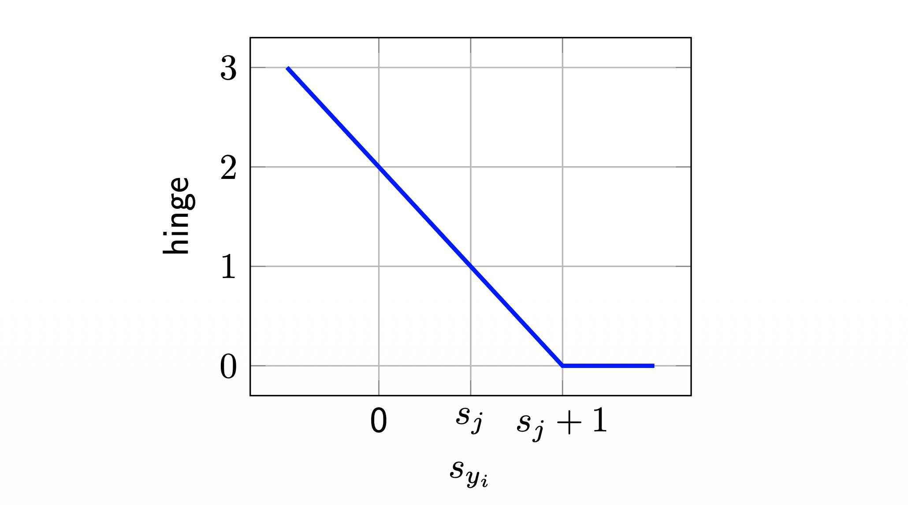
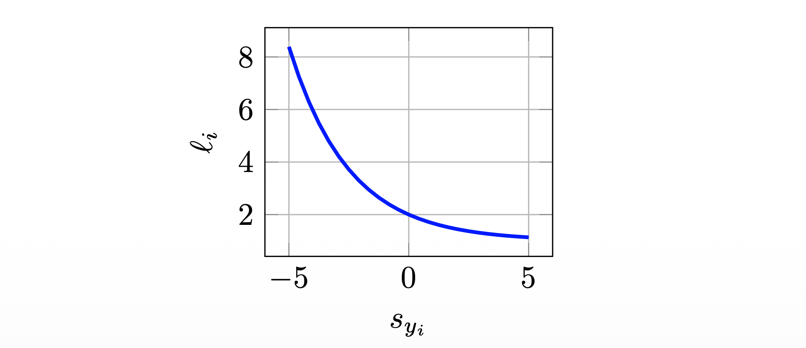
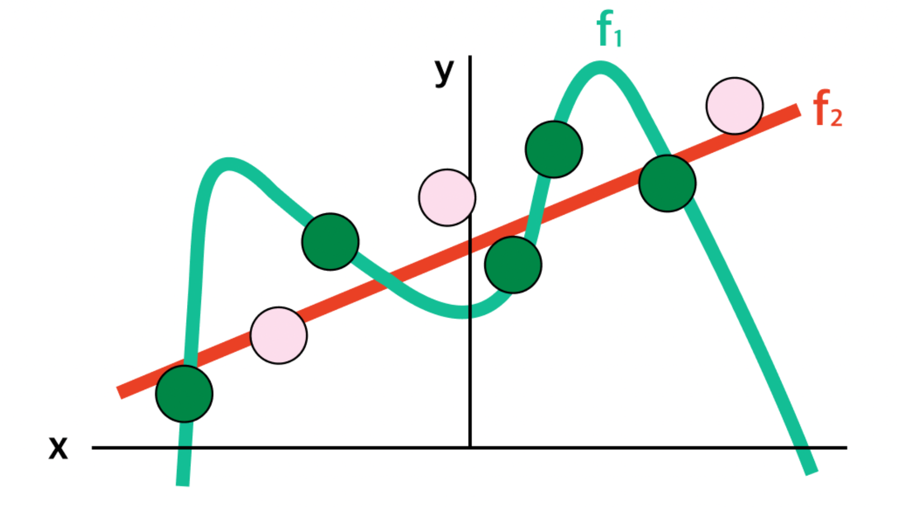

# 1. Introduction

* 지난 포스트([Lecture 2.2])에서 우리는 입력 이미지를 클래스 점수(Score)로 변환하는 **선형 분류기(Linear Classifier)** $f(x, W) = Wx + b$를 정의했다. 하지만 단순히 점수를 계산하는 것만으로는 충분하지 않다. 모델이 정답 클래스에 대해 더 높은 점수를 부여하도록 학습시키기 위해서는, 현재 파라미터 $W$가 "얼마나 나쁜지"를 정량적으로 나타내는 지표가 필요하다.

* 이번 포스트에서는 이 지표인 **손실 함수(Loss Function)**의 두 가지 대표적인 형태(Hinge Loss, Logistic Loss)와, 모델의 과적합(Overfitting)을 막기 위한 **규제(Regularization)**에 대해 다룬다.

# 2. Loss Functions: A Measure of "Badness"

## 2.1. 정의 (Definition)

* 손실 함수(Loss function) $d$는 모델의 예측값(Score)과 실제 정답(Label)을 입력받아, 그 불일치 정도를 하나의 실수값(Real number)으로 매핑하는 함수이다.

$$
d: \mathbb{R}^{C} \times \mathcal{Y} \rightarrow \mathbb{R}
$$

* 데이터셋 $\{(x_{i}, y_{i})\}_{i=1}^{n}$ 전체에 대한 총 손실 $L(W)$는 개별 데이터 포인트의 손실 $l_i(W)$의 평균으로 정의된다(Empirical Risk).

$$
L(W) = \frac{1}{n}\sum_{i=1}^{n} l_{i}(W) = \frac{1}{n}\sum_{i=1}^{n} d(f(x_{i}, W), y_{i})
$$

* 이제 $l_i(W)$를 구체적으로 어떻게 정의하느냐에 따라 서로 다른 성질을 가진 분류기가 만들어진다.

## 2.2. Multiclass Hinge Loss (SVM Loss)

* 첫 번째로 살펴볼 함수는 Support Vector Machine(SVM)에서 사용되는 **Hinge Loss**이다. 이 함수는 정답 클래스의 점수가 오답 클래스의 점수보다 **최소한 마진(Margin) $\Delta$ 만큼** 더 높아야 한다고 주장한다. (보통 $\Delta=1$로 설정)

* 수식은 다음과 같다.
$$
l_{i}(W) = \sum_{j \ne y_{i}} \max(0, s_{j} - s_{y_{i}} + 1)
$$
  * $s_{y_i}$: 정답 클래스의 점수
  * $s_{j}$: 오답 클래스의 점수
* **해석**: 만약 정답 점수 $s_{y_i}$가 오답 점수 $s_j$보다 1 이상 크다면($s_{y_i} > s_j + 1$), 손실은 0이다. 그렇지 않다면 그 차이만큼 페널티(손실)가 부과된다.

## 2.3. Multinomial Logistic Loss (Softmax Loss)

* 두 번째는 딥러닝에서 가장 흔하게 사용되는 **Logistic Loss**이다. 이 함수는 점수 벡터 $s$를 확률 분포로 해석한다.

* 먼저, 점수들을 **Softmax** 함수를 통해 확률값으로 변환한다.

$$
P(Y=k | X=x_{i}) = \frac{e^{s_{k}}}{\sum_{j} e^{s_{j}}}
$$

* 그리고 정답 클래스에 대한 **음의 로그 우도(Negative Log Likelihood)**를 최소화하는 방향으로 손실을 정의한다.

$$
l_{i}(W) = -\log\left( \frac{e^{s_{y_{i}}}}{\sum_{j} e^{s_{j}}} \right)
$$

* **해석**: 정답 클래스의 확률을 최대화(1에 가깝게)하고자 한다. 로그 함수 특성상 확률이 1이면 손실은 0, 확률이 0에 가까우면 손실은 무한대로 발산한다.

## 2.4. Comparison: Hinge vs Logistic

* 두 손실 함수는 모델을 학습시키는 방식에서 미묘한 차이를 보인다.

| 특징 | Hinge Loss (SVM) | Logistic Loss (Softmax) |
| :--- | :--- | :--- |
| **목표** | 정답이 오답보다 **마진만큼만** 높으면 만족 | 정답 확률을 **계속해서** 높이려고 함 |
| **민감도** | 점수 차이가 충분하면 데이터 변화에 둔감함 | 데이터의 작은 변화에도 손실 값이 변함 |
| **비유** | "1등이 2등보다 1점만 높으면 돼" | "1등이 압도적인 차이로 이겨야 해" |

* **Example**: 정답 클래스($y_i=0$)의 점수가 10이고, 나머지 오답 점수가 바뀔 때:
  * 1.  Scores: `[10, 9, 9]` $\rightarrow$ 두 모델 모두 손실 발생 (나쁨)
  * 2.  Scores: `[10, -100, -100]`
      * **Hinge**: 이미 마진을 만족했으므로 손실 변화 없음 (0).
      * **Logistic**: 정답 확률이 더 올라갔으므로 손실이 더 줄어듦.

# 3. Regularization: Beyond Training Error

## 3.1. 문제 제기 (Motivation)

* 최적화 과정을 통해 학습 데이터에 대한 손실(Loss)을 0으로 만드는 가중치 행렬 $W$를 찾았다고 가정해 봅시다. 여기서 근본적인 질문이 생깁니다: 
  * **우리가 찾은 최적의 파라미터 $W$는 유일(Unique)할까요?**

* 다중 클래스 SVM에서 사용하는 **Hinge Loss**의 수식을 살펴보면 이 질문에 대한 답이 '아니오'라는 것을 알 수 있습니다. 데이터 $x_i$에 대한 Hinge Loss는 다음과 같이 정의됩니다 (안전 마진 $\Delta > 0$).

$$L_i(W) = \sum_{j \neq y_i} \max(0, w_j^\top x_i - w_{y_i}^\top x_i + \Delta)$$

* 만약 현재 파라미터 $W$가 완벽하게 분류를 수행하여 $L_i(W) = 0$이 되었다면, 이는 모든 오답 클래스 $j$에 대해 정답 점수와 오답 점수의 격차가 마진 $\Delta$ 이상 벌어졌음을 의미합니다.

$$w_{y_i}^\top x_i - w_j^\top x_i \ge \Delta$$

* 이제 이 가중치를 두 배로 뻥튀기한 새로운 파라미터 **$W' = 2W$**를 대입해 보겠습니다. 선형 모델이므로 점수의 격차도 정확히 두 배가 됩니다.

$$2w_{y_i}^\top x_i - 2w_j^\top x_i = 2(w_{y_i}^\top x_i - w_j^\top x_i) \ge 2\Delta$$

* 새로운 가중치 $2W$에 대한 Hinge Loss를 계산해보면 다음과 같습니다.

$$
\begin{aligned}
L_i(2W) &= \sum_{j \neq y_i} \max(0, 2w_j^\top x_i - 2w_{y_i}^\top x_i + \Delta) \\
&\le \sum_{j \neq y_i} \max(0, -2\Delta + \Delta) \\
&= \sum_{j \neq y_i} \max(0, -\Delta) = 0
\end{aligned}
$$

* 결과적으로, $W$에서 손실이 0이라면 **$2W, 3W, 100W$ 등 가중치의 스케일을 무한히 키워도 손실은 여전히 0**이 됩니다. 즉, 오직 데이터의 손실 함수(Data Loss)만 최소화하려고 하면, 알고리즘은 무한히 많은 $W$ 중 어떤 것을 선택해야 할지 모호해집니다.

* 또한, 가중치 값($W$)이 제약 없이 무한정 커지게 방치하면, 모델이 학습 데이터의 미세한 노이즈(Noise)에까지 민감하게 반응하여 곡선이 심하게 요동치게 됩니다. 이는 결국 **과적합(Overfitting)**을 유발하여, 처음 보는 새로운 데이터(Test data)에 대한 일반화(Generalization) 성능을 심각하게 떨어뜨립니다. 아래 그림을 통해 과적합된 모델의 형태를 확인해 봅시다.

* 우리는 학습 데이터(초록색 점)뿐만 아니라, 보이지 않는 테스트 데이터(회색 점/핑크색 점)에서도 잘 동작하는 **단순한 모델(Simpler Model)**을 선호한다.

## 3.2. Regularization Term

* 이를 위해 전체 손실 함수에 **규제항(Regularization term)** $R(W)$를 추가한다.
$$
L(W) = \underbrace{\frac{1}{n}\sum_{i=1}^{n} l_{i}(W)}_{\text{Data Loss}} + \underbrace{\lambda R(W)}_{\text{Regularization}}
$$
  * **Data Loss**: 학습 데이터를 얼마나 잘 맞추는가? (Prediction Performance)
  * **Regularization**: 모델이 얼마나 단순한가? (Model Complexity)
  * **$\lambda$ (Lambda)**: 두 목표 사이의 균형을 조절하는 하이퍼파라미터.

## 3.3. Common Regularizers

* 가장 널리 쓰이는 규제 기법들은 다음과 같다.
  * 1.  **$L_2$ Regularization (Weight Decay)**
      $$R(W) = \sum_{k} \sum_{l} W_{k,l}^{2} = ||W||_{2}^{2}$$
      * 가중치 $W$의 원소들이 너무 큰 값을 가지지 않도록 억제한다.
      * 가중치를 골고루 퍼뜨리는(Diffuse) 효과가 있다. (MAP inference와 Gaussian prior와 연관됨)
  * 2.  **$L_1$ Regularization**
      $$R(W) = \sum_{k} \sum_{l} |W_{k,l}| = ||W||_{1}$$
      * 가중치를 희소(Sparse)하게 만든다. 즉, 불필요한 가중치를 0으로 만든다. (Feature Selection 효과)
  * 3.  **Other Techniques**
      * **Nuclear Norm**: $R(W) = ||W||_{*} = \sum \sigma_i(W)$ (행렬의 랭크를 낮춤)
      * **Dropout, Batch Normalization**