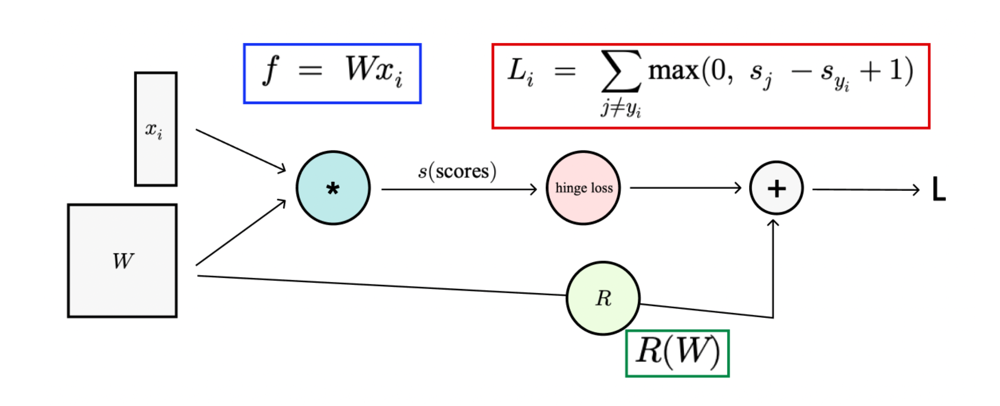
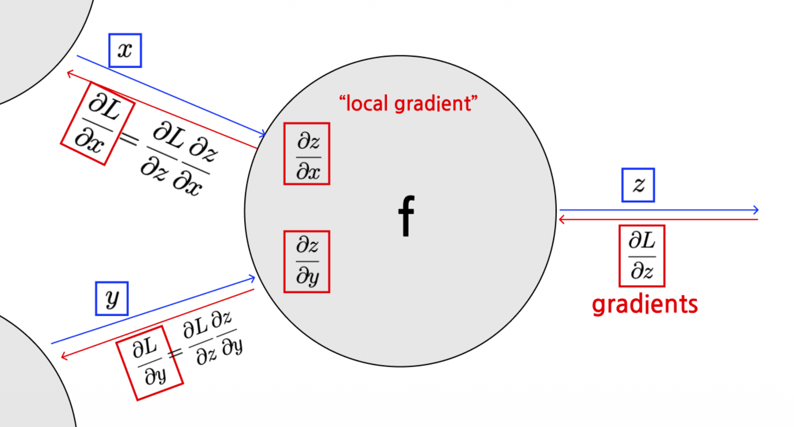
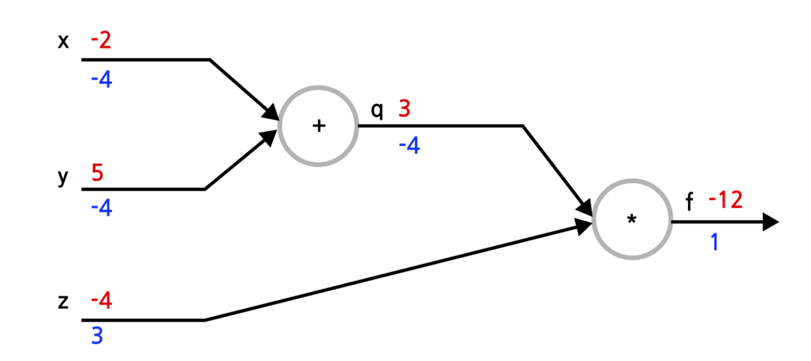
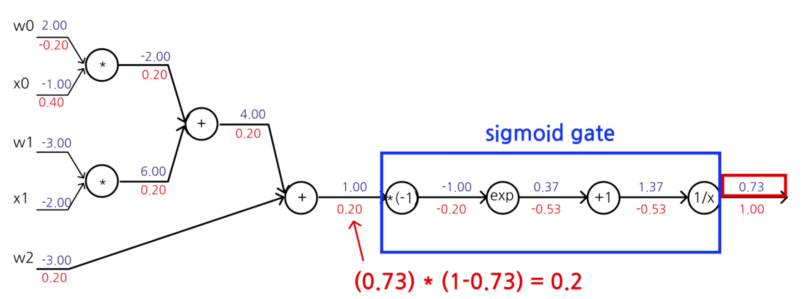
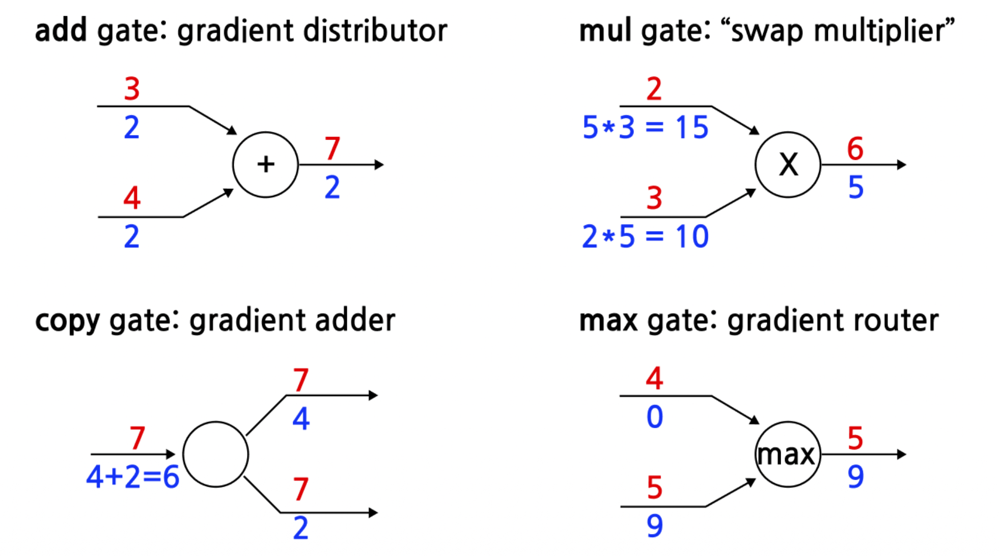
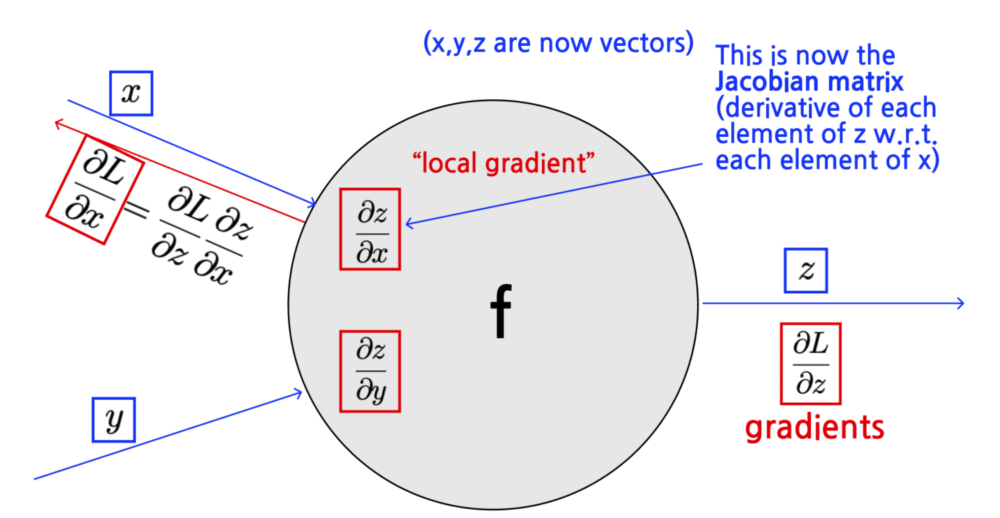

# 1. Introduction

* 지난 포스트([Lecture 2.3])까지 우리는 이미지 분류를 위한 모델(Score Function)과 모델의 성능을 평가하는 지표(Loss Function)를 정의했다. 이제 우리의 목표는 **Loss를 최소화하는 파라미터 $W$를 찾는 것**이다.
* 이를 위해서는 손실 함수 $L$에 대한 각 파라미터의 변화율, 즉 **기울기(Gradient, $\nabla_W L$)**를 계산해야 한다. 하지만 딥러닝 모델은 수많은 연산이 중첩된 매우 복잡한 합성 함수 형태를 띤다.
* 이번 포스트에서는 이러한 복잡한 함수의 기울기를 **계산 그래프(Computational Graph)**와 **역전파(Backpropagation)** 알고리즘을 이용해 체계적이고 효율적으로 구하는 방법을 알아본다.

# 2. Computational Graphs

## 2.1. 정의 (Definition)

* 계산 그래프는 수학적 연산 과정을 표현하는 **방향성 비순환 그래프(Directed Acyclic Graph, DAG)**이다.
  * **노드(Nodes)**: 입력 데이터, 파라미터, 또는 연산(Operation)을 나타낸다.
  * **엣지(Edges)**: 데이터의 흐름을 나타낸다. 엣지 $(u, v)$는 노드 $u$의 출력값이 노드 $v$의 입력으로 사용됨을 의미한다.

* 그래프의 각 노드 $v$는 자신의 부모 노드(Predecessors)들의 값을 입력받아 함수 $f_v$를 계산한다.

$$
x_v = f_v(\{x_u \mid u \in \text{pred}(v)\})
$$

## 2.2. Forward Pass

* 계산 그래프를 이용하면 복잡한 수식을 단순한 연산들의 연속으로 분해할 수 있다.
* 예를 들어, 선형 분류기에 Hinge Loss와 Regularization이 결합된 전체 식은 다음과 같이 시각화된다.



* 이 구조 덕분에 우리는 입력부터 출력까지 순차적으로 값을 계산하는 **Forward Pass**를 명확하게 정의할 수 있다.

# 3. Backpropagation: Computing Gradients

* **역전파(Backpropagation)**는 미분의 연쇄 법칙(Chain Rule)을 이용하여 출력(Loss)에서부터 입력 방향으로 거슬러 올라가며 기울기를 계산하는 알고리즘이다.

## 3.1. Chain Rule과 Local Gradient

* 어떤 노드 $f$가 입력 $x, y$를 받아 출력 $z$를 내보낸다고 가정하자. 그리고 최종 손실을 $L$이라고 하자.



* 우리는 최종 목적지인 $\frac{\partial L}{\partial x}, \frac{\partial L}{\partial y}$를 구하고 싶다. 이때 노드 내부와 외부에서 일어나는 일은 다음과 같다.
  * 1.  **Upstream Gradient**: 뒤쪽(출력 방향)에서 이미 계산되어 넘어온 기울기 ($\frac{\partial L}{\partial z}$)
  * 2.  **Local Gradient**: 현재 노드의 연산에 대한 미분값 ($\frac{\partial z}{\partial x}, \frac{\partial z}{\partial y}$)
  * 3.  **Downstream Gradient**: **Chain Rule**에 의해 두 값을 곱하여 앞쪽(입력 방향)으로 전달 ($\frac{\partial L}{\partial x} = \frac{\partial L}{\partial z} \cdot \frac{\partial z}{\partial x}$)

## 3.2. Step-by-Step Example

* 간단한 함수 $f(x, y, z) = (x + y)z$를 예로 들어보자. (초기값: $x=-2, y=5, z=-4$)

* 1.  **Forward Pass**:
    * $q = x + y = -2 + 5 = 3$
    * $f = q \cdot z = 3 \cdot (-4) = -12$

* 2.  **Backward Pass**:
    * **Start**: $\frac{\partial f}{\partial f} = 1$
    * **Node (\*)**: $f = qz$ 이므로
        * $\frac{\partial f}{\partial z} = q = 3$
        * $\frac{\partial f}{\partial q} = z = -4$
    * **Node (+)**: $q = x + y$ 이므로
        * Local Gradient: $\frac{\partial q}{\partial x} = 1, \frac{\partial q}{\partial y} = 1$
        * Downstream Gradient (Chain Rule):
            * $\frac{\partial f}{\partial x} = \frac{\partial f}{\partial q} \cdot \frac{\partial q}{\partial x} = -4 \cdot 1 = -4$
            * $\frac{\partial f}{\partial y} = \frac{\partial f}{\partial q} \cdot \frac{\partial q}{\partial y} = -4 \cdot 1 = -4$

* 결과적으로 각 변수에 대한 미분값 $[-4, -4, 3]$을 얻게 된다.



## 3.3. Sigmoid Example

* 조금 더 복잡한 **Sigmoid 함수** $\sigma(x) = \frac{1}{1+e^{-x}}$가 포함된 경우를 보자.
* Sigmoid의 미분은 자기 자신을 이용해 표현할 수 있다는 특징이 있다.

$$
\frac{d\sigma(x)}{dx} = (1 - \sigma(x))\sigma(x)
$$

* 이러한 성질을 이용하면, 복잡한 지수 연산 그래프를 하나하나 미분할 필요 없이 **Sigmoid Gate** 하나로 묶어서 처리할 수 있다.



# 4. Patterns in Gradient Flow

* 역전파 과정에서 자주 등장하는 연산 게이트들은 직관적인 "Gradient 흐름 패턴"을 보인다.

* 1.  **Add Gate (+)**: **Gradient Distributor**
    * 덧셈은 미분하면 1이 되므로, 상류에서 온 Gradient를 입력 노드들에게 **그대로 복사**해서 분배한다.
* 2.  **Mul Gate (\*)**: **Swap Multiplier**
    * $z = xy$ 미분 시 $\frac{\partial z}{\partial x}=y$가 되므로, 상류 Gradient에 **상대방의 값**을 곱해서 전달한다.
* 3.  **Max Gate (max)**: **Gradient Router**
    * Max 연산은 큰 값으로만 흐르므로, Gradient 역시 **가장 큰 값을 가졌던 입력으로만 전달**되고, 나머지는 0이 된다.



# 5. Vectorized Backpropagation

* 실제 딥러닝에서는 스칼라(Scalar)가 아닌 벡터(Vector)나 행렬(Matrix) 단위로 연산이 이루어진다. 이 경우에도 기본 원리는 같지만, **Jacobian Matrix**의 개념이 등장한다.
* 입력 $x \in \mathbb{R}^n$와 출력 $z \in \mathbb{R}^m$에 대해, 미분은 $m \times n$ 행렬(Jacobian)이 된다.

$$
\left( \frac{\partial z}{\partial x} \right)_{ij} = \frac{\partial z_i}{\partial x_j}
$$

* **Example**: $L_2$ Norm 함수 $f(x, W) = ||Wx||^2$
  * Forward: $q = Wx$, $f = ||q||^2$
  * Backward:
      * $\frac{\partial f}{\partial q} = 2q$
      * $\frac{\partial q}{\partial x} = W$
      * Chain Rule: $\nabla_x f = 2 W^T q = 2 W^T (Wx)$

* 벡터 연산에서는 차원(Dimension)을 항상 체크하는 것이 중요하다. Gradient의 차원은 항상 원본 변수의 차원과 같아야 한다.



# 6. Modular Implementation

* 최신 딥러닝 프레임워크(PyTorch, TensorFlow)는 이러한 계산 그래프를 **모듈화**하여 구현한다. 각 연산(Layer)은 `forward`와 `backward`라는 두 가지 메서드를 가진 클래스로 정의된다.

```python
class Multiply(torch.autograd.Function):
    @staticmethod
    def forward(ctx, x, y):
        # Forward pass: 값 계산 및 저장
        ctx.save_for_backward(x, y)
        z = x * y
        return z

    @staticmethod
    def backward(ctx, grad_z):
        # Backward pass: 저장된 값을 꺼내 Gradient 계산
        x, y = ctx.saved_tensors
        grad_x = y * grad_z  # Swap multiplier pattern
        grad_y = x * grad_z
        return grad_x, grad_y

```

* 이러한 모듈들이 레고 블록처럼 연결되어 거대한 신경망을 구성하며, 사용자는 복잡한 미분 공식을 직접 유도할 필요 없이 그래프를 구성하기만 하면 된다(AutoGrad).