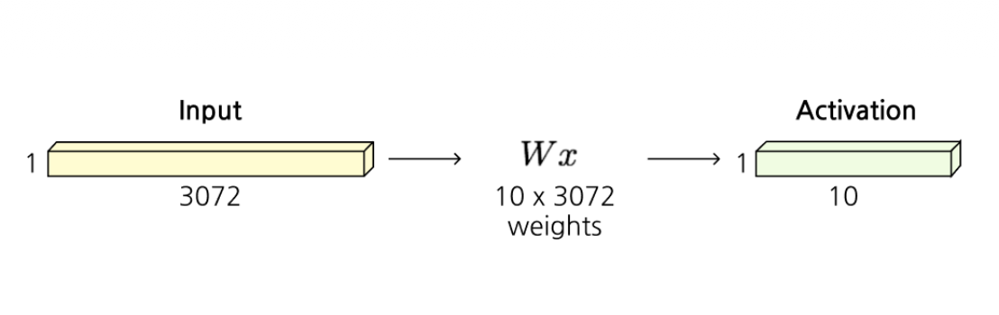
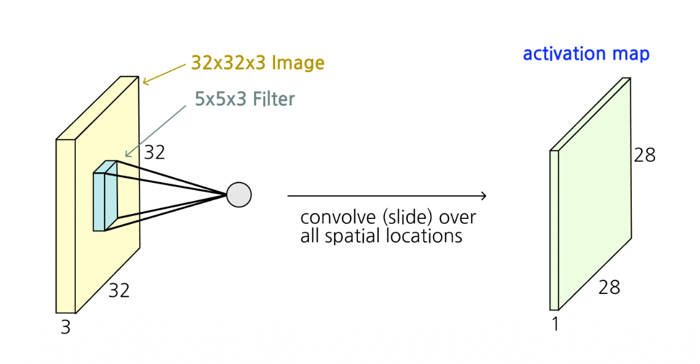
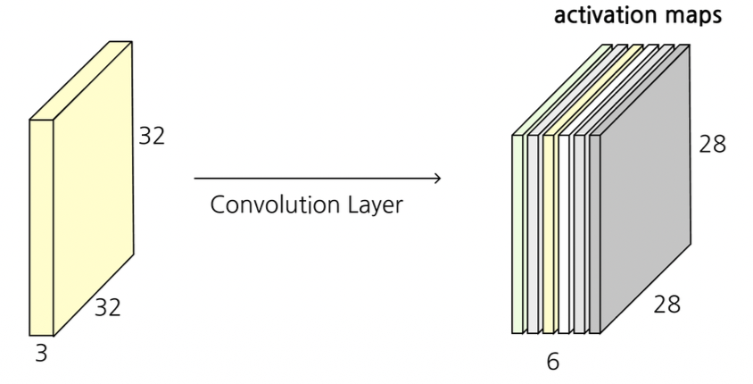
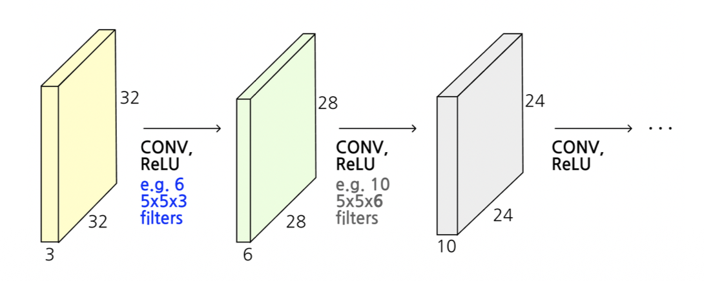
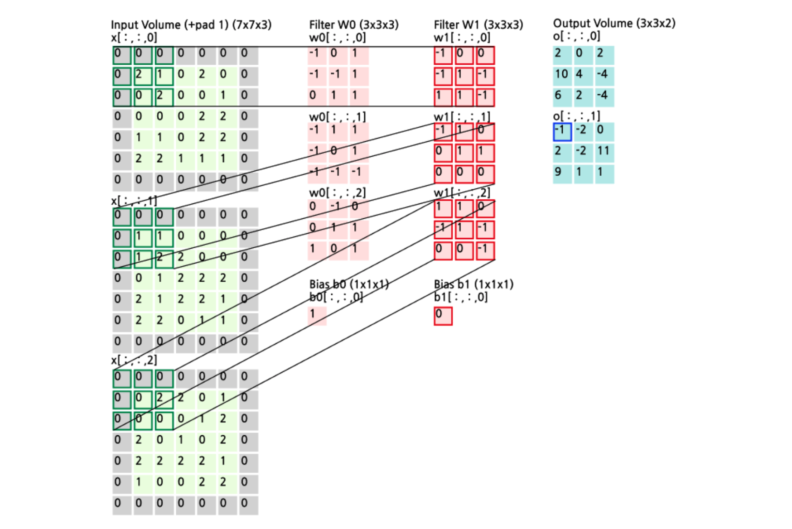

# 1. Introduction: Fully Connected Layer의 한계와 CNN의 등장

* 이전 포스트에서는 신경망의 기본적인 구조와 보편적 근사 정리(UAT)에 대해 다루었습니다. 전통적인 인공 신경망인 **완전 연결 계층(Fully Connected Layer, FC Layer)**은 이미지를 처리할 때 치명적인 한계를 가집니다. 

* 예를 들어, 가로 32, 세로 32 픽셀의 RGB 색상 채널 3개를 가진 이미지($32 \times 32 \times 3$)를 FC Layer에 입력한다고 가정해 봅시다. 
FC Layer는 2차원(또는 3차원)의 공간 정보를 무시하고, 모든 픽셀을 1차원 벡터로 길게 펼칩니다(Stretch). 결과적으로 $3072 \times 1$ 크기의 길다란 벡터가 만들어집니다. 

* 이 입력 벡터가 10개의 클래스(출력)를 분류하기 위해 하나의 은닉층을 거칠 경우, 가중치 행렬 $W$의 크기는 $10 \times 3072$가 되어 무려 **30,720개의 파라미터**가 필요해집니다.
* 이는 두 가지 큰 문제를 야기합니다.
  * 1. **공간적 구조(Spatial structures) 파괴:** 이미지에서 인접한 픽셀들은 서로 강한 상관관계를 가지지만, 1차원으로 펼치면 이러한 지역적(local) 특성이 사라집니다.
  * 2. **과도한 파라미터 수:** 입력 크기가 커지면 가중치의 수가 기하급수적으로 늘어나 모델이 과적합(Overfitting)되기 쉽고, 연산량이 폭발적으로 증가합니다.

* 이러한 문제를 해결하기 위해 등장한 것이 바로 **가중치 공유(Weight sharing)**를 통해 파라미터 수를 획기적으로 줄이고, 이미지의 공간적 구조를 그대로 보존하는 **합성곱 신경망(Convolutional Neural Network, CNN)**입니다.

# 2. Convolution Layer의 동작 원리

* Convolution Layer(합성곱 계층)의 가장 큰 특징은 입력 데이터의 공간적 형태($32 \times 32 \times 3$)를 유지한 상태에서, 작은 크기의 **필터(Filter, 가중치)**를 사용하여 국소적인 영역의 특징을 추출한다는 것입니다.

## 2.1. 필터(Filter)와 합성곱 연산

* 가령 $5 \times 5 \times 3$ 크기의 필터 $w$가 주어졌다고 해봅시다. 필터의 깊이(Depth)는 항상 입력 이미지의 깊이(채널 수, 여기서는 3)와 동일해야 합니다.
이 필터는 이미지의 좌측 상단부터 시작하여 전체 공간을 미끄러지듯 이동(Slide over the image spatially)하며 **점곱(Dot product)** 연산을 수행합니다.

* 필터가 덮고 있는 $5 \times 5 \times 3$ 크기의 작은 이미지 조각 $x$와 필터 가중치 $w$ 간의 연산은 수식으로 다음과 같이 표현됩니다.

$$w^T x + b$$

* 이 연산은 75 차원($5 \times 5 \times 3 = 75$)의 벡터 간 내적을 수행한 후 하나의 편향(Bias, $b$)을 더하여 **단 1개의 숫자(스칼라 값)**를 만들어냅니다.

## 2.2. Activation Map 생성과 다중 필터

* 이 필터를 이미지의 처음부터 끝까지 모두 슬라이딩시키면, 결과적으로 2차원 형태의 **활성화 지도(Activation Map)**가 생성됩니다. (원본 32x32 크기에서 5x5 필터를 움직이면 가장자리가 줄어들어 28x28 크기가 됩니다.)

* 실제 CNN에서는 하나의 계층에서 다양한 패턴(예: 가로 엣지, 세로 엣지, 색상 대비 등)을 추출하기 위해 여러 개의 독립적인 필터를 사용합니다.
* 만약 6개의 서로 다른 $5 \times 5 \times 3$ 필터를 사용한다면, 결과적으로 6장의 28x28 Activation Map이 만들어집니다. 우리는 이를 차곡차곡 쌓아 올려(Stack) **$28 \times 28 \times 6$ 크기의 새로운 3차원 볼륨(New image)**을 얻게 됩니다.
* 이후 비선형성을 부여하기 위해 활성화 함수 ReLU($\max(0, \cdot)$)를 통과시키며, 여러 Convolution Layer를 직렬로 연결(CONV $\rightarrow$ ReLU $\rightarrow$ CONV $\rightarrow$ ReLU)하여 층을 깊게 쌓아갑니다.

# 3. 주요 하이퍼파라미터 (Hyperparameters)

* Convolution Layer의 출력 크기와 모델의 용량을 결정짓는 핵심 하이퍼파라미터는 다음과 같습니다.
* 1. **필터의 수 (Number of filters):** 
   * 우리가 몇 개의 필터를 사용할 것인지를 결정합니다. 
   * 이 개수는 곧 **출력 볼륨의 깊이(Depth)**와 동일한 활성화 지도(Activation maps)의 개수가 됩니다.
* 2. **스트라이드 (Stride):** 
   * 필터가 한 번에 공간적으로 몇 픽셀씩 이동할지 결정하는 보폭입니다.
   * Stride가 1이면 1픽셀씩 촘촘히 이동하고, Stride가 2이면 2픽셀씩 건너뛰며 이동합니다.
   * Stride를 키울수록 필터가 찍는 횟수가 줄어들어 **출력 볼륨의 공간적 크기(가로, 세로)가 작아집니다.**
* 3. **제로 패딩 (Zero-padding):**
   * 입력 이미지의 가장자리에 0으로 채워진 테두리를 덧대는 기법입니다.
   * 필터를 씌우면 출력 크기가 작아지는 현상을 방지하고, **출력 볼륨의 공간적 크기를 입력과 동일하게 유지하거나 원하는 크기로 제어**할 수 있게 해주는 아주 유용한 기능입니다.

# 4. 연산 과정 구체화 (Step-by-Step Example)

* 패딩과 스트라이드가 어떻게 연산에 적용되는지 구체적인 3D 텐서 연산 예시를 통해 살펴보겠습니다.

* **입력(Input):** 원래 $5 \times 5 \times 3$ 크기의 볼륨 가장자리에 패딩(pad=1)을 둘러서 **$7 \times 7 \times 3$** 크기의 입력이 되었습니다. (가장자리의 0들이 패딩입니다.)
* **필터(Filters):** 2개의 필터($W_0, W_1$)를 사용합니다. 각 필터의 크기는 $3 \times 3 \times 3$이며, 각각 고유한 편향 $b_0=1$, $b_1=0$을 가집니다. (num_filters = 2)
* **보폭(Stride):** 2 픽셀씩 건너뜁니다. (stride = 2)

* **계산 원리**
  * 첫 번째 필터 $W_0$를 입력의 제일 왼쪽 상단(녹색 테두리로 표시된 $3 \times 3 \times 3$ 영역)에 위치시킵니다.
  * 1. 입력 볼륨의 선택된 $3 \times 3 \times 3$ 영역에 있는 숫자들과 필터 $W_0$에 적힌 가중치 숫자들을 각각 같은 위치끼리(element-wise) 곱합니다.
  * 2. 그 곱한 27개($3 \times 3 \times 3$)의 결과값들을 모두 더합니다.
  * 3. 마지막에 편향 $b_0=1$을 더합니다. 
  * 4. 이 연산의 결과로 Output Volume 첫 번째 채널의 맨 위쪽 첫 번째 픽셀 값(예: 2, 10, 6 등)이 채워집니다.

* 이후 필터는 Stride=2 규칙에 따라 오른쪽으로 2칸씩 껑충 뛰어 이동하며 똑같은 연산을 반복하고, 한 줄이 끝나면 아래로 2칸 내려와 이동합니다. 그 결과 공간적 크기는 $3 \times 3$으로 축소되며, 2개의 필터를 썼으므로 깊이는 2가 되어 최종적으로 **$3 \times 3 \times 2$ 크기의 Output Volume**이 생성됩니다.

# 5. 공간 크기 및 파라미터 수 계산 연습 (Exercises)

* 강의 자료에 등장하는 두 가지 핵심 예제(Example)를 통해, 수식을 어떻게 적용하는지 알아보겠습니다.
* 출력 볼륨의 가로(또는 세로) 길이 $O$는 입력 크기 $W$, 필터 크기 $F$, 패딩 크기 $P$, 스트라이드 $S$에 대해 다음과 같은 공식으로 계산할 수 있습니다.

$$O = \frac{W - F + 2P}{S} + 1$$

## Example 1: 출력 활성화 맵 크기(Output activation size) 계산
* **조건:** Input volume은 $32 \times 32 \times 3$. 10개의 $5 \times 5$ 필터 적용. (Stride = 1, Padding = 2)
* **공식 대입:** $W = 32, F = 5, P = 2, S = 1$
  $$O = \frac{32 - 5 + 2 \times 2}{1} + 1 = \frac{32 - 5 + 4}{1} + 1 = 31 + 1 = 32$$
* **결과:** 가로와 세로는 32로 원본과 똑같이 유지됩니다. 사용한 필터의 수가 10개이므로 깊이는 10이 됩니다. 
* **최종 Output Volume 크기:** **$32 \times 32 \times 10$**

## Example 2: 파라미터 수(Number of parameters) 계산
* 파라미터 수는 입력의 공간적 크기($32 \times 32$)와는 무관하게, **오직 필터의 크기와 개수**에 의해서만 결정되는 가중치 공유(Weight sharing)의 마법을 보여줍니다.
* **조건:** Example 1과 동일. (입력 깊이 $C_{in}=3$, 필터 공간 크기 $5 \times 5$, 필터 개수 10개)
* **단일 필터의 파라미터 수:** 각 필터는 채널 깊이만큼 존재하므로 $5 \times 5 \times 3 = 75$개의 가중치를 가지며, 여기에 1개의 편향(Bias)이 추가됩니다.
  $$75 + 1 = 76 \text{ parameters per filter}$$
* **전체 파라미터 수:** 이 필터가 총 10개 있으므로, 해당 계층에서 학습해야 할 총 파라미터 수는 다음과 같습니다.
  $$76 \times 10 = \mathbf{760}$$

* FC Layer가 앞선 Introduction에서 30,720개의 가중치가 필요했던 반면, CNN은 단 **760개의 파라미터**만으로 깊이 있는 특성 추출을 수행할 수 있습니다.