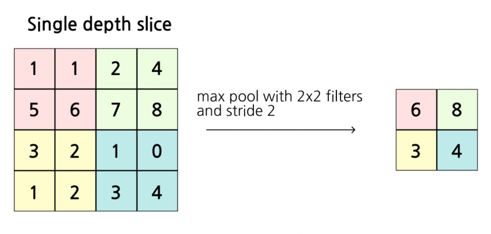
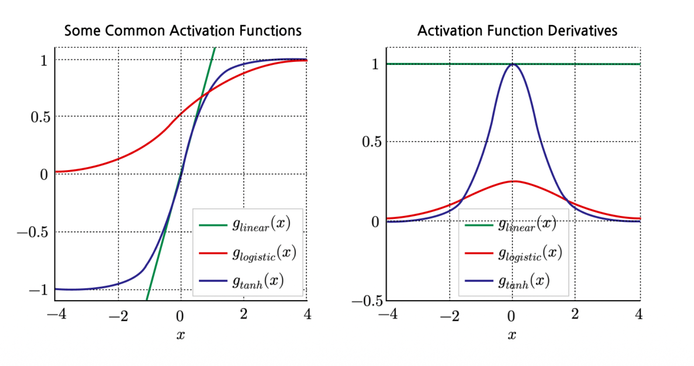
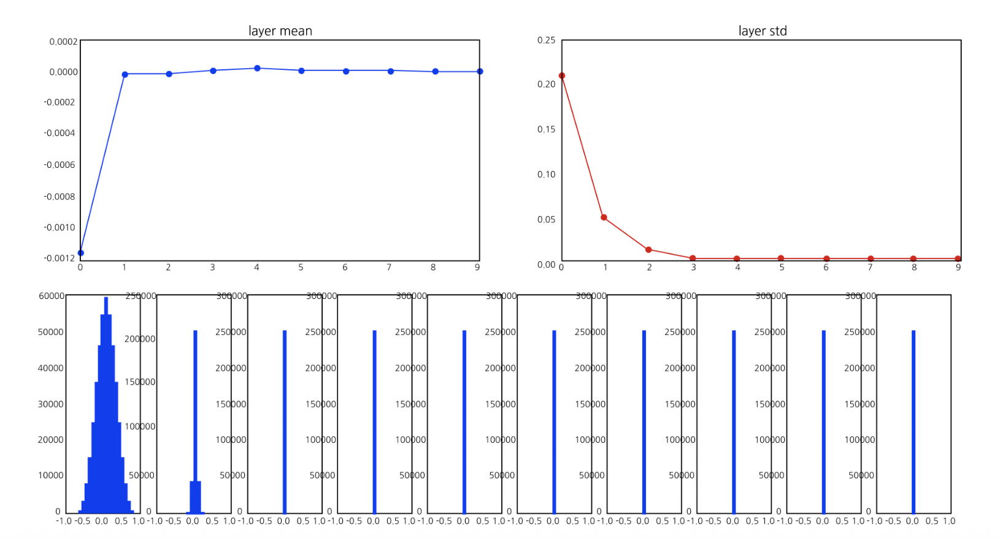
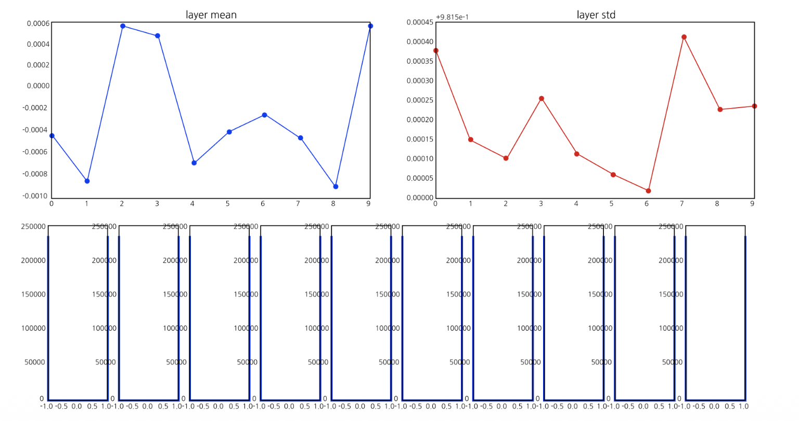
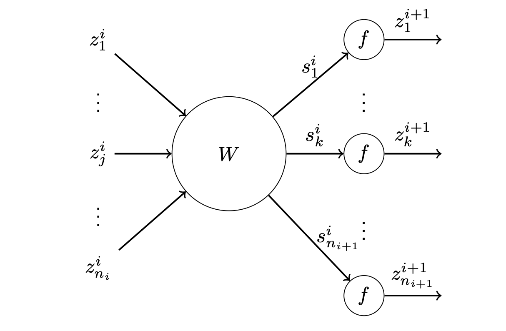
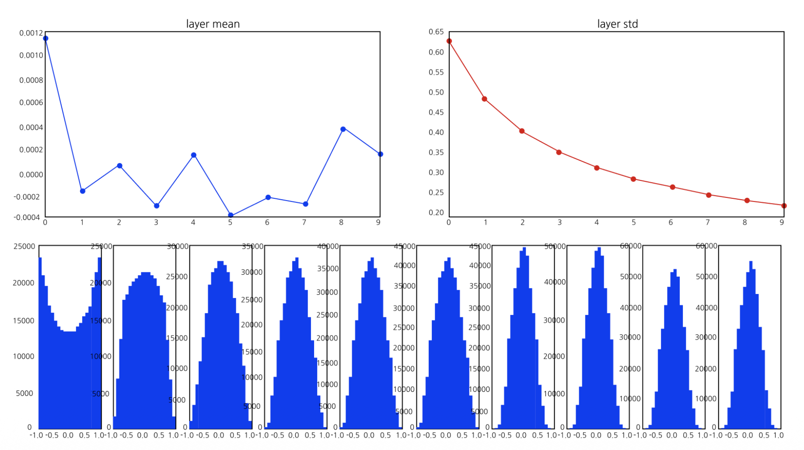

# 1. Pooling Layer (풀링 계층)

* Convolutional Neural Network (CNN) 구조에서 합성곱(Convolution) 계층 다음으로 자주 등장하는 것이 **풀링 계층(Pooling Layer)**입니다. 풀링 계층의 주된 목적은 공간적 차원(가로, 세로)을 축소하여 연산량을 줄이고, 미세한 위치 변화에 대한 공간적 불변성(Spatial Invariance)을 부여하는 것입니다. 
* 주로 사용되는 방법에는 대상 영역 내의 최댓값을 취하는 **Max Pooling(최대 풀링)**과 평균값을 취하는 **Average Pooling(평균 풀링)**이 있습니다.

* 위 그림의 Max Pooling 과정을 수학적으로 살펴보면 다음과 같습니다.
* $4 \times 4$ 입력 행렬에 대해 크기가 $2 \times 2$인 필터를 보폭(Stride) 2로 슬라이딩하면, 입력 데이터가 겹치지 않는 4개의 구역으로 분할됩니다.
  * 좌상단 영역: $\max(1, 1, 5, 6) = 6$
  * 우상단 영역: $\max(2, 4, 7, 8) = 8$
  * 좌하단 영역: $\max(3, 2, 1, 0) = 3$
  * 우하단 영역: $\max(1, 2, 3, 4) = 4$

* 이처럼 풀링은 학습해야 할 별도의 파라미터(가중치)가 존재하지 않으며, 단순히 주어진 규칙(Max, Average 등)에 따라 데이터를 다운샘플링(Downsampling)하는 역할을 수행합니다.

# 2. Activation Functions and Derivatives (활성화 함수와 도함수)

* 신경망에 비선형성을 부여하는 활성화 함수들의 수식과, 학습에 필수적인 도함수(Derivative, Gradient)의 형태를 이해하는 것은 매우 중요합니다.

* 1. **Logistic (Sigmoid)**
   $$g_{logistic}(z) = \frac{1}{1 + e^{-z}}$$
   * 출력값을 $[0, 1]$ 사이로 압축합니다. 도함수의 최댓값이 0.25에 불과하여, 층이 깊어질수록 기울기가 빠르게 소멸하는 단점이 있습니다.
* 2. **Tanh (Hyperbolic Tangent)**
   $$g_{tanh}(z) = \frac{e^z - e^{-z}}{e^z + e^{-z}}$$
   * 출력값을 $[-1, 1]$ 사이로 압축하며, 영점 중심(Zero-centered)입니다. 도함수의 최댓값이 1이지만, Sigmoid와 마찬가지로 입력의 절댓값이 커지면 양극단에서 도함수(기울기)가 0으로 수렴합니다.

* 이러한 **포화(Saturation)** 현상은 기울기 소실(Vanishing Gradient) 문제를 일으켜 학습을 방해합니다.

# 3. 가중치 초기화(Weight Initialization)의 실패 사례

* 딥러닝 모델의 성능은 가중치(Weight)를 처음에 어떤 값으로 초기화하느냐에 따라 극단적으로 달라집니다. $tanh$ 활성화 함수를 사용하는 10층짜리 Multi-Layer Perceptron(MLP)을 예로 들어 잘못된 초기화의 두 가지 케이스를 살펴보겠습니다.

## 3.1. Small Weights (가중치가 너무 작을 때)
* 만약 가중치를 아주 작은 값으로 초기화하면 어떻게 될까요?
`W = 0.01 * np.random.randn(n_in, n_out)`

* **문제점:** 입력 데이터가 가중치와 곱해질 때마다 값이 기하급수적으로 작아집니다. 그 결과, 깊은 층으로 갈수록 활성화 값들이 모두 0으로 붕괴(Collapse)됩니다.
* **역전파(Backward) 시의 문제:** 연쇄 법칙(Chain rule)에 의해 기울기를 계산할 때, 이 0에 가까운 값들이 계속 곱해지면서 Upstream gradient 역시 0으로 붕괴합니다. 결국 가중치 업데이트가 일어나지 않습니다.

## 3.2. Big Weights (가중치가 너무 클 때)
* 그렇다면 반대로 가중치를 아주 큰 값으로 초기화하면 어떻게 될까요?
`W = 1.0 * np.random.randn(n_in, n_out)`

* **문제점:** 순전파(Forward) 시 큰 가중치가 곱해지면서 활성화 함수($tanh$)의 입력이 매우 커지거나 작아집니다. 결과적으로 모든 활성화 값들이 $-1$ 또는 $+1$로 완전히 **포화(Saturated)**되어 버립니다.
* **역전파(Backward) 시의 문제:** 앞서 [Figure 2]에서 확인했듯, $tanh$ 함수는 $-1$이나 $+1$ 근처에서 도함수(기울기)가 거의 0입니다. 즉, Gradient가 흐르지 않아(doesn't flow) 가중치가 업데이트되지 않는 치명적인 문제가 발생합니다.

# 4. Xavier Initialization (Xavier 초기화)

* 위의 문제들을 해결하기 위해 등장한 것이 **Xavier Initialization**(Glorot & Bengio, 2010)입니다. 이 방법의 핵심 목표는 **네트워크의 각 층을 통과할 때 활성화 값의 분산(Variance)과 기울기의 분산이 일정하게 유지되도록 가중치의 분산을 정교하게 세팅**하는 것입니다.

* 수학적인 유도 과정을 살펴보기 위해 아래와 같은 단일 노드 모델을 가정합니다.
  * 가중치 행렬 $W$의 요소들은 독립적이고 동일한 분포(i.i.d.)를 가지며 평균은 0입니다. ($E[W]=0$)
  * 편향(Bias)은 없습니다.
  * 입력 변수 $z^i$ 역시 분산이 동일하고 평균이 0이라 가정합니다. ($E[z]=0$)
  * 활성화 함수 $f(\cdot)$는 영점 중심(Centered)이며 0 부근에서 선형적이고 기울기가 1인 함수입니다. (예: $tanh$ 함수의 원점 부근 근사, $f(s) \approx s$)

## 4.1. Forward Variance (순전파 분산 유지)
* 순전파(Forward pass) 과정에서 네트워크가 깊어지더라도 활성화 값(Activation)들이 0으로 소멸하거나 양극단으로 포화되지 않게 하려면, **각 계층을 통과할 때 입력 데이터의 분산과 출력 데이터의 분산이 동일하게 유지**되어야 합니다.

* 다음 층($i+1$)의 $k$번째 노드 출력값 $z_k^{i+1}$을 도출하고 분산 조건을 찾는 과정은 다음과 같이 진행됩니다.

### Step 1: 선형 변환과 활성화 함수 근사
* $z_k^{i+1}$은 현재 층($i$)의 모든 노드 출력값 $z_j^i$들과 가중치 $W_{kj}^i$의 선형 결합($s_k^i$)을 비선형 활성화 함수 $f$에 통과시켜 얻습니다. 
Xavier 초기화에서는 활성화 함수 $f$가 원점(0) 부근에서 선형적($f(x) \approx x$)이라고 가정하므로, 식을 다음과 같이 근사할 수 있습니다.

$$z_k^{i+1} = f(s_k^i) = f\left(\sum_{j=1}^{n_i} W_{kj}^i z_j^i\right) \approx \sum_{j=1}^{n_i} W_{kj}^i z_j^i$$

### Step 2: 분산 취하기 및 독립성 적용
* 위 식의 양변에 분산(Variance)을 취합니다. 가중치 $W_{kj}^i$와 이전 층의 출력 $z_j^i$는 서로 독립(Independent)이라고 가정하므로, 합의 분산은 개별 분산의 합으로 전개됩니다.

$$Var(z_k^{i+1}) \approx Var\left(\sum_{j=1}^{n_i} W_{kj}^i z_j^i\right) = \sum_{j=1}^{n_i} Var(W_{kj}^i z_j^i)$$

### Step 3: $Var(XY)$ 성질을 활용한 항 분해
* 서로 독립인 두 확률변수 $X, Y$의 곱에 대한 분산 공식은 다음과 같습니다.
$$Var(XY) = E[Y]^2Var(X) + E[X]^2Var(Y) + Var(X)Var(Y)$$

* 신경망의 가중치 초기화 및 정규화 과정에서 **가중치와 데이터의 기댓값(평균)은 모두 0이라고 가정**합니다 ($E[W]=0$, $E[z]=0$). 이를 위 공식에 대입하면 기댓값이 포함된 앞의 두 항이 0이 되어 소거됩니다.
* 따라서 가중치와 입력의 곱의 분산은 단순히 두 분산의 곱으로 정리됩니다.

$$Var(W_{kj}^i z_j^i) = Var(W_{kj}^i) Var(z_j^i)$$

* 이 결과를 Step 2의 합산 식에 대입하면 다음과 같습니다.
$$Var(z_k^{i+1}) \approx \sum_{j=1}^{n_i} Var(W_{kj}^i) Var(z_j^i)$$

* 이때, 모든 $n_i$개의 입력 노드에 대해 가중치의 분산과 입력 데이터의 분산이 동일하다고 가정하면, 동일한 값을 $n_i$번 더하는 것과 같으므로 덧셈 기호($\sum$)가 노드 개수($n_i$)의 곱으로 바뀝니다.

$$\forall k, \ Var(z_k^{i+1}) \approx n_i Var(W_{kj}^i) Var(z_j^i)$$

### Step 4: 분산 유지 조건 도출
* 우리의 목표는 층을 통과하기 전의 분산($Var(z_j^i)$)과 통과한 후의 분산($Var(z_k^{i+1})$)이 변함없이 일정하게 유지되는 것입니다.

$$Var(z_k^{i+1}) = Var(z_j^i)$$

* 이 조건을 Step 3의 최종 결과식에 대입합니다.

$$Var(z_j^i) \approx n_i Var(W_{kj}^i) Var(z_j^i)$$

* 양변에서 공통된 입력 분산 $Var(z_j^i)$를 약분하여 제거하면, 순전파에서 분산을 유지하기 위해 가중치가 가져야 할 최종 분산 조건이 도출됩니다.

$$Var(W_{kj}^i) = \frac{1}{n_i}$$

* **결론** 순전파(Forward) 관점에서 활성화 값의 분산이 무너지지 않게 하려면, 가중치를 초기화할 때 그 분산을 **현재 층의 입력 노드 개수($n_i$)의 역수**로 설정해야 합니다.

## 4.2. Backward Variance (역전파 분산 유지)

* 역전파(Backpropagation) 과정에서 기울기 소실(Vanishing Gradient)이나 폭발(Exploding Gradient)을 막기 위한 핵심 목표는 **각 계층을 통과할 때 손실(Loss) $l$에 대한 기울기(Gradient)의 분산이 일정하게 유지되도록 만드는 것**입니다.
* $i$번째 층의 $j$번째 노드 출력값을 $z_j^i$, 그리고 다음 층인 $i+1$번째 층의 $k$번째 노드 출력값을 $z_k^{i+1}$이라고 할 때, 역전파 과정은 다음과 같은 단계로 유도됩니다.

### Step 1: 연쇄 법칙(Chain Rule) 적용
* 출력층에서 계산된 손실 $l$에 대해, 현재 층의 노드 $z_j^i$가 미치는 영향을 구하기 위해 다변수 함수의 연쇄 법칙을 적용합니다. 현재 층의 노드 $z_j^i$는 다음 층($i+1$)에 있는 모든 $n_{i+1}$개의 노드($z_k^{i+1}$)들에 연결되어 영향을 미치므로, 이를 모두 합산해야 합니다.

$$\frac{\partial l}{\partial z_j^i} = \sum_{k=1}^{n_{i+1}} \frac{\partial l}{\partial z_k^{i+1}} \frac{\partial z_k^{i+1}}{\partial z_j^i}$$

### Step 2: 로컬 기울기(Local Gradient) 분해 및 근사
* 항 $\frac{\partial z_k^{i+1}}{\partial z_j^i}$를 가중치 합산 연산($s_k^i$)과 활성화 함수 통과 과정($f$)으로 분해합니다.
$$\frac{\partial l}{\partial z_j^i} = \sum_{k=1}^{n_{i+1}} \frac{\partial l}{\partial z_k^{i+1}} \underbrace{\frac{\partial z_k^{i+1}}{\partial s_k^i}}_{\text{(A)}} \underbrace{\frac{\partial s_k^i}{\partial z_j^i}}_{\text{(B)}}$$
  * **(A) 활성화 함수의 미분:** $z_k^{i+1} = f(s_k^i)$ 입니다. Xavier 초기화는 활성화 함수 $f$가 원점(0) 부근에서 선형적이고 기울기가 1($f'(0) \approx 1$)이라고 가정하므로, $\frac{\partial z_k^{i+1}}{\partial s_k^i} \approx 1$ 로 근사할 수 있습니다.
  * **(B) 선형 변환의 미분:** $s_k^i = \sum_{j=1}^{n_i} W_{kj}^i z_j^i + b_k^i$ 이므로, 이를 $z_j^i$로 편미분하면 가중치인 $W_{kj}^i$만 남습니다.

* 이를 대입하면 역전파 기울기 수식은 다음과 같이 아주 단순한 선형 결합 형태로 정리됩니다.

$$\frac{\partial l}{\partial z_j^i} \approx \sum_{k=1}^{n_{i+1}} \frac{\partial l}{\partial z_k^{i+1}} W_{kj}^i$$

### Step 3: 분산(Variance) 취하기 및 독립성 적용
* 위 식의 양변에 분산을 취합니다. 가중치 $W$와 이전 층에서 넘어온 기울기 $\frac{\partial l}{\partial z_k^{i+1}}$는 서로 독립이며 평균이 0이라고 가정합니다.

* 서로 독립이고 평균이 0인 두 확률변수의 곱의 분산은 $Var(XY) = Var(X)Var(Y)$ 이므로, 합산 기호 안의 분산은 다음과 같이 분리됩니다.

$$Var\left(\frac{\partial l}{\partial z_j^i}\right) \approx \sum_{k=1}^{n_{i+1}} Var\left(\frac{\partial l}{\partial z_k^{i+1}} W_{kj}^i\right) \approx \sum_{k=1}^{n_{i+1}} Var\left(\frac{\partial l}{\partial z_k^{i+1}}\right) Var(W_{kj}^i)$$

* 이때, 다음 층($i+1$)에 속한 모든 $n_{i+1}$개의 노드들이 동일한 분산을 가진다고 가정하면, 동일한 값을 $n_{i+1}$번 더하는 것과 같으므로 덧셈 기호($\sum$)가 상수 배수로 바뀝니다.

$$Var\left(\frac{\partial l}{\partial z_j^i}\right) \approx n_{i+1} Var\left(\frac{\partial l}{\partial z_k^{i+1}}\right) Var(W_{kj}^i)$$

### Step 4: 분산 유지 조건 도출
* 우리의 궁극적인 목표는 계층을 역방향으로 통과하더라도 기울기의 분산이 변하지 않고 유지되는 것입니다. 즉, 현재 층의 기울기 분산과 다음 층의 기울기 분산이 동일해야 합니다.

$$Var\left(\frac{\partial l}{\partial z_j^i}\right) = Var\left(\frac{\partial l}{\partial z_k^{i+1}}\right)$$

* 이 조건을 Step 3의 결과식에 대입하여 양변을 약분하면, 가중치 행렬이 가져야 할 분산 값이 최종적으로 도출됩니다.

$$Var(W^i) = \frac{1}{n_{i+1}}$$

* **결론** 역전파(Backward) 관점에서 기울기 소멸이나 폭발을 막으려면, 가중치를 초기화할 때 그 분산을 **다음 층의 노드 개수($n_{i+1}$)의 역수**로 설정해야 합니다.

## 4.3. 타협점: 조화 평균 (Harmonic Mean)
* 순전파에서는 분산이 $1/n_i$, 역전파에서는 $1/n_{i+1}$이 되어야 한다는 서로 다른 두 조건이 도출되었습니다. 입력 노드 수($n_i$)와 출력 노드 수($n_{i+1}$)가 정확히 같지 않은 한 두 조건을 동시에 만족할 수 없으므로, 두 값의 조화 평균을 사용하여 타협안을 찾습니다.
$$Var(W^i) = \frac{2}{n_i + n_{i+1}}$$
   * 참고: Caffe와 같은 일부 프레임워크에서는 편의상 $Var(W^i) = 1/n_i$ 만을 사용하기도 합니다.
* **정규 분포에서 샘플링할 경우:** 표준 정규 분포 $\mathcal{N}(0,1)$에서 샘플링한 뒤 표준편차인 $\sqrt{\frac{2}{n_i + n_{i+1}}}$를 곱해줍니다.
* **균등 분포(Uniform distribution)에서 샘플링할 경우:** 균등 분포 $Uni(-a, a)$의 분산은 $\frac{a^2}{3}$입니다. 이를 $\frac{2}{n_i + n_{i+1}}$와 같게 두면 $a = \sqrt{\frac{6}{n_i + n_{i+1}}}$ 가 도출됩니다.

* Xavier 초기화를 적용하면 위 그림과 같이 레이어가 아무리 깊어져도 데이터의 스케일과 분산이 안정적으로 유지되며, 기울기 소실 문제 없이 원활하게 학습할 수 있게 됩니다.

# 5. He Initialization (He et al., 2015)

* 앞서 유도한 Xavier 초기화는 매우 훌륭한 방법이지만, 치명적인 약점이 하나 있습니다. 바로 활성화 함수 $f(\cdot)$가 **0 부근에서 선형적($f(x) \approx x$)이라는 가정**을 전제로 수학적 유도가 진행되었다는 점입니다. 이는 $\tanh$나 Sigmoid 함수에는 잘 들어맞지만, 현재 딥러닝에서 가장 널리 쓰이는 **ReLU** 함수에는 적용할 수 없습니다.

## 5.1. ReLU의 특성과 분산의 감소
* ReLU 함수는 $f(x) = \max(0, x)$로 정의되며, **입력의 절반(음수 영역)을 완전히 0으로 소멸(zeroes out)**시킵니다. 
* 데이터가 평균이 0이고 대칭적인 분포를 이룬다고 가정할 때, ReLU를 통과한 데이터의 분산은 어떻게 변할까요?

* 출력 노드 $z_k^{i+1} = \max(0, s_k^i)$에 대하여, 분산의 정의 $Var(Z) = E[Z^2] - (E[Z])^2$를 떠올려 봅시다. 
* 일반적으로 He 초기화 유도에서는 계산의 편의를 위해 주변 평균이 0에 가깝다고 근사하여 $Var(Z) \approx E[Z^2]$로 둡니다.

$$Var(z_k^{i+1}) \approx E[(z_k^{i+1})^2] = E[\max(0, s_k^i)^2]$$

* 이때, $s_k^i$가 0을 중심으로 대칭인 분포를 가진다면, 절반의 확률(음수)로는 0이 되고, 나머지 절반의 확률(양수)로는 그대로 $s_k^i$가 됩니다. 따라서 기댓값은 정확히 절반으로 줄어듭니다.

$$E[\max(0, s_k^i)^2] = \frac{1}{2} E[(s_k^i)^2] \approx \frac{1}{2} Var(s_k^i)$$

## 5.2. He 초기화의 분산 유지 조건 도출
* 이제 위에서 구한 $\frac{1}{2}$이라는 스케일링 팩터를 기존의 순전파 분산 공식에 대입해 봅니다.

$$Var(z_k^{i+1}) \approx \frac{1}{2} Var(s_k^i) = \frac{1}{2} Var\left(\sum_{j=1}^{n_i} W_{kj}^i z_j^i\right)$$

* 이전 Xavier 초기화 유도와 마찬가지로, 가중치와 입력이 독립이고 평균이 0이라는 $Var(XY)$ 성질을 적용하면 다음과 같이 전개됩니다.

$$Var(z_k^{i+1}) \approx \frac{1}{2} \sum_{j=1}^{n_i} Var(W_{kj}^i) Var(z_j^i) = \frac{1}{2} n_i Var(W_{kj}^i) Var(z_j^i)$$

* 우리의 목표는 네트워크가 깊어져도 분산이 유지되는 것($Var(z_k^{i+1}) = Var(z_j^i)$)입니다. 따라서 위 식의 양변에서 $Var(z_j^i)$를 약분하면 다음과 같은 조건이 도출됩니다.

$$1 = \frac{1}{2} n_i Var(W_{kj}^i)$$
$$Var(W_{kj}^i) = \frac{2}{n_i}$$

* **결론** ReLU 함수는 데이터의 분산을 절반으로 깎아버리므로, 이를 보상하기 위해 가중치의 분산을 Xavier 초기화($\frac{1}{n_i}$)보다 **정확히 2배 크게** 설정해야 합니다. 이것이 바로 **He Initialization**의 핵심 원리입니다.

* 이처럼 활성화 함수와 네트워크 구조에 맞게 초기화 전략을 올바르게 선택하는 것은 깊은 신경망에서 나타나는 고질적인 두통거리인 **기울기 소실 및 폭발(Vanishing/Exploding gradients)**을 막기 위한 가장 기본적이고 필수적인 연구 분야입니다.