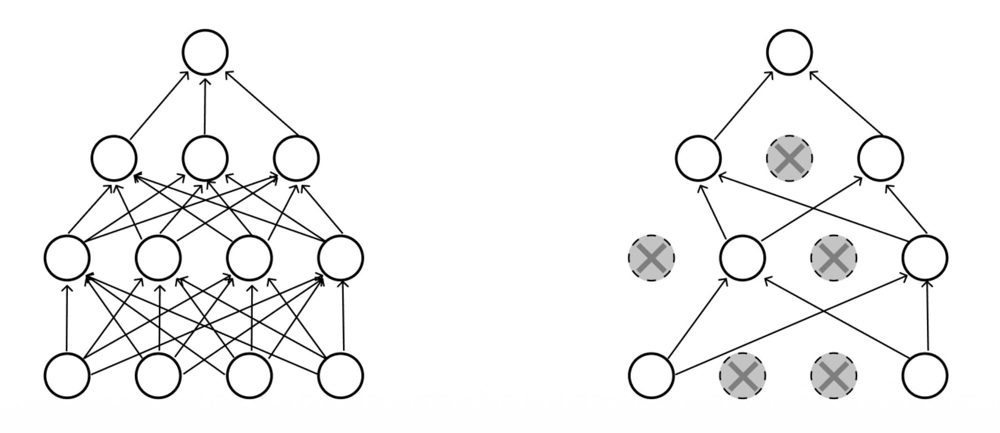
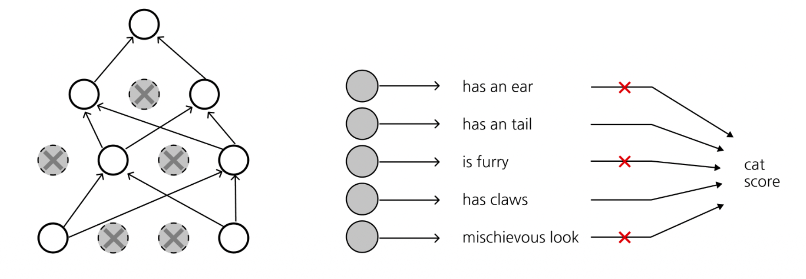

# 1. Introduction: 과적합(Overfitting)과 일반화(Generalization)

* 깊고 복잡한 신경망을 학습시킬 때 직면하는 가장 큰 문제 중 하나는 **과적합(Overfitting)**입니다. 신경망의 파라미터가 지나치게 많아지면, 모델은 학습 데이터(Training data)의 노이즈까지 통째로 외워버리게 됩니다.
* 학습 과정에서 Train Loss는 0을 향해 계속 감소하지만, 어느 순간부터 검증 데이터(Validation data)에 대한 정확도(Accuracy)는 오르지 않거나 오히려 떨어지는(일반화 갭, Generalization gap) 현상을 관찰할 수 있습니다. 
이처럼 보지 못한 새로운 데이터에 대한 성능 하락을 막고, 모델이 데이터의 본질적인 특징만을 학습하도록 유도하는 모든 기법을 통틀어 **정규화(Regularization)**라고 부릅니다.

# 2. 손실 함수에 패널티 추가 (Weight Decay)

* 가장 전통적이고 직관적인 정규화 방식은 기존의 손실 함수(Loss function)에 가중치 행렬 $W$의 크기를 제한하는 패널티 항 $R(W)$를 추가하는 것입니다. 

$$L = \frac{1}{N} \sum_{i=1}^{N} \sum_{j \ne y_i} \max(0, f(x_i; W)_j - f(x_i; W)_{y_i} + 1) + \boxed{\lambda R(W)}$$

* 위 식은 기존 손실(예: SVM Loss)에 **$\lambda R(W)$**를 더한 형태입니다. 여기서 $\lambda$는 정규화의 강도를 조절하는 하이퍼파라미터입니다. 패널티 함수 $R(W)$의 형태에 따라 다음과 같이 분류됩니다.

* 1. **L2 Regularization (Weight decay)**
   $$R(W) = \sum_k \sum_l W_{k,l}^2$$
   * 가중치 제곱의 합을 사용합니다. 모델의 파라미터들이 전반적으로 작고 고르게 퍼지도록 유도하여 특정 특성에 과도하게 의존하는 것을 막습니다. 딥러닝에서 가장 흔히 쓰입니다.
* 2. **L1 Regularization**
   $$R(W) = \sum_k \sum_l |W_{k,l}|$$
   * 가중치 절댓값의 합을 사용합니다. 중요하지 않은 가중치를 완전히 0으로 만들어, 모델의 희소성(Sparsity)을 유도하고 특징 선택(Feature selection) 효과를 냅니다.
* 3. **Elastic Net**
   $$R(W) = \sum_k \sum_l \beta W_{k,l}^2 + |W_{k,l}|$$
   * L1과 L2 정규화를 혼합한 방식입니다.

# 3. Dropout (드롭아웃)의 원리와 직관
* 손실 함수를 수정하는 것 외에, 신경망의 아키텍처나 연산 과정 자체에 개입하여 정규화 효과를 얻는 매우 강력한 기법이 바로 **Dropout (드롭아웃)**입니다.
* **원리:** 드롭아웃은 순전파(Forward pass)를 진행할 때마다 각 뉴런(Activation)을 미리 정해진 **보존 확률 $p$ (보통 0.5)**에 따라 무작위로 0으로 꺼버리는(Drop) 기법입니다.





* 이 단순한 방식이 왜 강력한 정규화 효과를 낼까요? 크게 두 가지 측면에서 해석할 수 있습니다.

## 3.1. 해석 1: 특성 간의 공동 적응(Co-adaptation) 방지
* 어떤 이미지가 "고양이"인지 분류하는 네트워크를 생각해 봅시다. 
* 고양이 판별을 위해 "귀", "꼬리", "털", "발톱"이라는 4개의 뉴런(특성)이 존재한다고 가정합시다. 드롭아웃이 없다면, 네트워크는 가장 식별하기 쉬운 특징(예: "꼬리")에만 전적으로 의존하여 결과를 낼 수 있습니다.
* 하지만 드롭아웃이 적용되면 "꼬리" 뉴런이 무작위로 꺼질 수 있습니다. 결과적으로 네트워크는 특정 소수 뉴런에만 의존할 수 없게 되며, 고양이를 분류하기 위해 모든 특성들에 가중치를 골고루 분산시켜 학습해야 합니다.



## 3.2. 해석 2: 거대한 모델 앙상블(Ensemble)
* 드롭아웃 마스크가 바뀔 때마다 파라미터를 공유하는 수많은 서브 네트워크(Sub-networks)가 생성됩니다. 따라서 드롭아웃을 적용하여 학습하는 것은 마치 수많은 개별 신경망들을 동시에 학습시킨 뒤 앙상블(Ensemble)하는 것과 수학적으로 유사한 효과를 냅니다.

# 4. Test Time에서의 Dropout과 기댓값 보정 (Mathematical Formulation)

* 학습(Training) 시에는 노이즈를 주기 위해 뉴런을 껐지만, **평가 및 테스트(Test time) 단계에서는 예측의 일관성을 위해 모든 뉴런을 항상 활성화(Active) 상태로 유지**해야 합니다.
* 입력 $x$와 무작위 드롭아웃 마스크 $z$가 주어졌을 때 네트워크의 출력을 $f(x, z)$라고 하면, 테스트 시에는 무작위성을 제거한 평균적인 결과값(Integral)을 근사해야 합니다.

$$y = \mathbb{E}_z[f(x,z)] = \int p(z)f(x,z)dz$$

* 이 적분식을 정확하게 계산하는 것은 불가능하므로, 간단한 기댓값 연산을 통해 보정합니다.

* **단일 뉴런을 통한 기댓값 계산 예시**
  * 출력 $a$가 두 입력 $x, y$를 받아 $a = w_1 x + w_2 y$로 계산되는 구조를 가정해 봅시다. 
  * 테스트 시 (모두 활성화): $\mathbb{E}[a] = w_1 x + w_2 y$
  * 학습 시 (보존 확률 $p = 0.5$):
    * 4가지 가능한 마스크의 조합이 발생합니다 (각각 $1/4$ 확률).
      * 1. 둘 다 켜짐: $(w_1 x + w_2 y)$
      * 2. $x$만 켜짐: $(w_1 x + 0y)$
      * 3. $y$만 켜짐: $(0x + w_2 y)$
      * 4. 둘 다 꺼짐: $(0x + 0y)$
    * 따라서 학습 시의 기댓값은 다음과 같습니다.
    $$\mathbb{E}[a] = \frac{1}{4}(w_1 x + w_2 y) + \frac{1}{4}(w_1 x) + \frac{1}{4}(w_2 y) + \frac{1}{4}(0) = \frac{1}{2}(w_1 x + w_2 y)$$

* **결론**
  * 보존 확률이 $p=0.5$일 때, 학습 시의 출력 기댓값은 테스트 시 기댓값의 절반($p$ 배)으로 깎이게 됩니다(Attenuation). 이를 맞추기 위해, **Test 시에는 전체 노드를 켜는 대신 그 출력값에 보존 확률 $p$를 곱해주는 스케일링 과정이 필수적**입니다 ($x \rightarrow px$).

요청하신 대로 강의 자료(lec3-5.pdf)에 수록된 3층 신경망(3-layer neural network) 기준의 전체 드롭아웃 코드를 모두 반영하여 `.qmd` 포맷으로 재작성했습니다.

# 5. 구현 방식 비교 (Vanilla vs Inverted Dropout)

* Dropout을 코드로 구현하는 방법에는 크게 두 가지가 있습니다. 오늘날 대부분의 딥러닝 프레임워크는 테스트 시의 효율성을 위해 두 번째 방법인 Inverted Dropout을 채택합니다.

## 5.1. Vanilla Dropout (권장하지 않음)

* 바닐라 드롭아웃은 순전파 시에 단순히 뉴런을 끄고, 테스트 시에 확률 $p$를 곱해 스케일링을 맞춰주는 가장 직관적인 방식입니다.

```python
p = 0.5 # probability of keeping a unit active. higher = less dropout

def train_step(X):
    """ X contains the data """
    # forward pass for example 3-layer neural network
    H1 = np.maximum(0, np.dot(W1, X) + b1)
    U1 = np.random.rand(*H1.shape) < p # first dropout mask
    H1 *= U1 # drop!
    
    H2 = np.maximum(0, np.dot(W2, H1) + b2)
    U2 = np.random.rand(*H2.shape) < p # second dropout mask
    H2 *= U2 # drop!
    
    out = np.dot(W3, H2) + b3
    
    # backward pass: compute gradients... (not shown)
    # perform parameter update... (not shown)

def predict(X):
    # ensembled forward pass
    # drop in forward pass -> scale at test time
    H1 = np.maximum(0, np.dot(W1, X) + b1) * p # NOTE: scale the activations
    H2 = np.maximum(0, np.dot(W2, H1) + b2) * p # NOTE: scale the activations
    out = np.dot(W3, H2) + b3

```

* **단점:** 이 방식은 추론을 담당하는 `predict` 함수의 코드를 수정(스케일링 연산 추가)해야 한다는 문제점이 있습니다. 시스템의 유지 보수와 배포 관점에서 테스트 코드는 가급적 건드리지 않는 것이 좋습니다.

## 5.2. Inverted Dropout (현대의 표준 방식)

* Inverted Dropout은 테스트 단계에서 수행해야 할 스케일링 연산을 **학습(Train) 단계로 미리 옮겨서 처리**하는 방식입니다.

```python
p = 0.5 # probability of keeping a unit active. higher = less dropout

def train_step(X):
    # forward pass for example 3-layer neural network
    H1 = np.maximum(0, np.dot(W1, X) + b1)
    # Drop and scale during training
    U1 = (np.random.rand(*H1.shape) < p) / p # first dropout mask. Notice /p!
    H1 *= U1 # drop!
    
    H2 = np.maximum(0, np.dot(W2, H1) + b2)
    U2 = (np.random.rand(*H2.shape) < p) / p # second dropout mask. Notice /p!
    H2 *= U2 # drop!
    
    out = np.dot(W3, H2) + b3
    
    # backward pass: compute gradients... (not shown)
    # perform parameter update... (not shown)

def predict(X):
    # ensembled forward pass
    # test time is unchanged!
    H1 = np.maximum(0, np.dot(W1, X) + b1) # no scaling necessary
    H2 = np.maximum(0, np.dot(W2, H1) + b2)
    out = np.dot(W3, H2) + b3

```

* **핵심 장점:** Inverted Dropout은 Test 시에 곱해야 할 $p$를 아예 Train 시 마스크 생성 단계에서 $p$로 나누어(`/ p`) 미리 보상(Compensate)해버립니다.
* 이로 인해 **테스트 타임의 네트워크 구조와 코드가 완벽하게 불변(unchanged)인 상태로 유지**되며, 실제 서비스 배포 및 테스트 과정이 훨씬 간편해지기 때문에 이 방식이 선호됩니다.

# 6. 아키텍처 관점에서의 Dropout 적용 위치

* **과거 (AlexNet, VGG 등):** 위 파라미터 그래프에서 볼 수 있듯, 고전적인 CNN 모델은 파라미터의 대부분(90% 이상)이 마지막 Fully-Connected (FC) 계층에 집중되어 있었습니다. 따라서 주로 이 FC 계층 사이에 드롭아웃을 적용하여 거대한 파라미터 덩어리의 과적합을 막았습니다.
* **현대 (ResNet, ViT 등):** 최근의 아키텍처들은 Global Average Pooling 등을 사용해 FC 계층의 비중을 대폭 줄였으며, 배치 정규화(Batch Normalization) 자체가 강력한 정규화 효과를 제공하기 때문에 드롭아웃을 아주 적게 사용하거나 아예 사용하지 않는 추세(little or no dropout)로 진화했습니다.

# 7. 정규화(Regularization)의 공통 패턴

* 드롭아웃과 이전 포스트에서 다룬 배치 정규화(Batch Normalization)는 다음과 같은 아주 흥미로운 **공통 패턴**을 따릅니다.
  * 1. **학습(Training) 중에는 무작위성(Randomness)을 더한다.**
    * Dropout: 어떤 뉴런이 꺼질지 모르는 노이즈 추가
    * Batch Norm: 미니 배치로 뽑히는 샘플들에 따라 평균과 분산이 매번 달라지는 노이즈 추가
  * 2. **테스트(Test) 중에는 그 무작위성을 평균 내어(Average out) 고정한다.**
    * Dropout: 전체 뉴런을 켜고 확률 $p$를 곱하여 기댓값으로 대체
    * Batch Norm: 학습 중 모아둔 이동 평균(Running average)을 고정값으로 대체하여 추론
* 이러한 "학습 시의 노이즈 주입 + 테스트 시의 기댓값 추론" 패턴은 신경망이 특정 데이터에 과적합되지 않도록 강력한 강건성(Robustness)을 부여하는 딥러닝 정규화 철학의 핵심입니다.