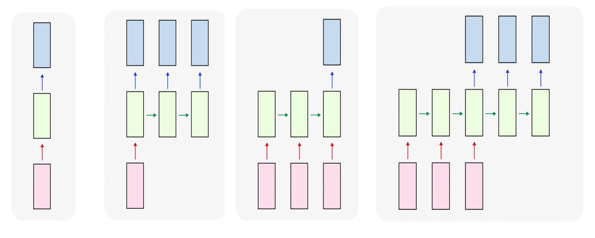
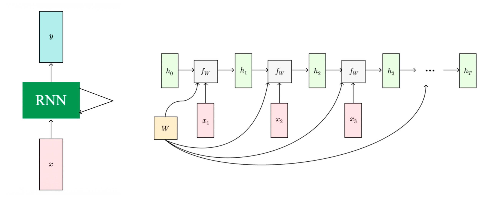
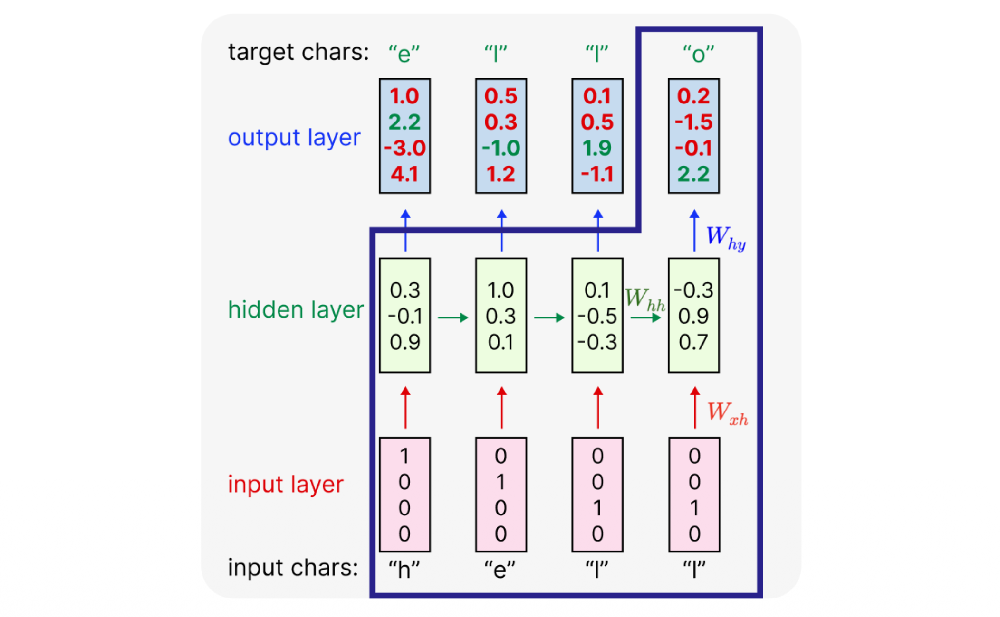
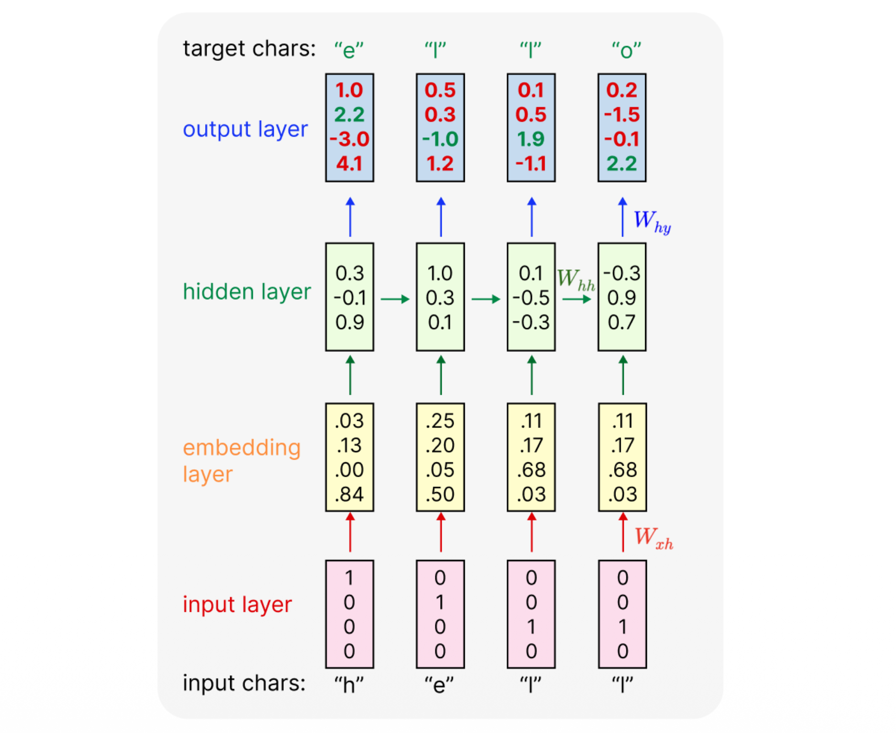
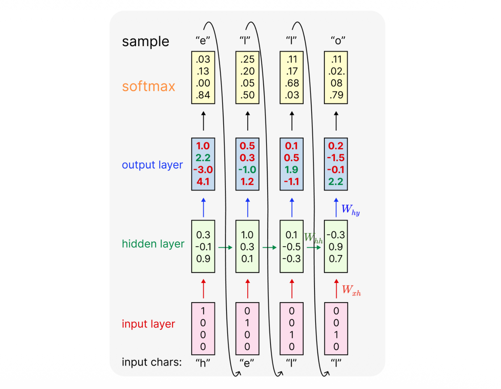
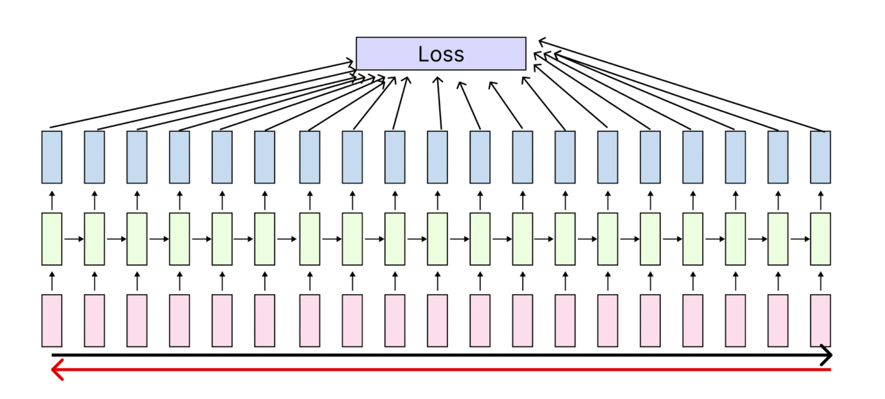
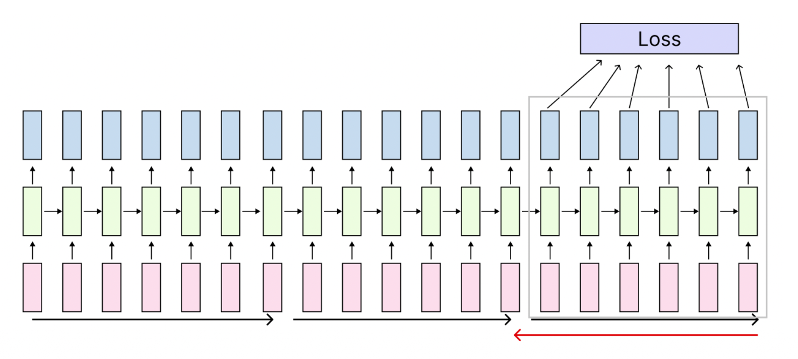

# 1. Introduction: 순차 데이터(Sequence Data) 처리를 향하여

기존의 Feedforward Neural Networks(예: CNN, MLP)는 고정된 크기의 입력값을 받아 고정된 크기의 출력값을 반환하는 구조를 가집니다. 그러나 자연어 처리(NLP), 음성 인식, 비디오 분석과 같은 도메인에서는 입력 데이터의 길이가 가변적이며, 이전 시점의 데이터가 현재 시점에 영향을 미치는 **순차적 특성(Sequential nature)**을 지닙니다. 

이러한 순차 데이터를 효과적으로 모델링하기 위해 등장한 개념이 바로 **순환 신경망(Recurrent Neural Networks, RNN)**입니다. RNN은 내부에 "상태(State)"를 저장할 수 있는 메모리 구조를 도입하여, 시계열 데이터를 처리할 수 있도록 설계되었습니다.

# 2. Architectures of Neural Networks

네트워크가 입력(Input)과 출력(Output)을 어떻게 매핑하느냐에 따라 다양한 아키텍처로 분류할 수 있습니다. RNN은 구조적 유연성을 바탕으로 다양한 형태의 매핑을 지원합니다.

* **One to one**: 단일 입력 $\rightarrow$ 단일 출력. 전통적인 Feedforward Network의 형태입니다.
    * *Example*: 이미지 분류 (Image $\rightarrow$ Label)
* **One to many**: 단일 입력 $\rightarrow$ 순차 출력. 하나의 정보를 바탕으로 일련의 시퀀스를 생성합니다.
    * *Example*: 이미지 캡셔닝 (Image $\rightarrow$ Sequence of words)
* **Many to one**: 순차 입력 $\rightarrow$ 단일 출력. 시계열 데이터를 모두 읽은 후 하나의 결론을 도출합니다.
    * *Example*: 비디오 행동 분류, 감성 분석 (Sequence of words/images $\rightarrow$ Label)
* **Many to many**: 순차 입력 $\rightarrow$ 순차 출력. 입력 시퀀스와 출력 시퀀스의 길이가 같거나 다를 수 있습니다.
    * *Example 1*: 기계 번역 (Sequence of words in English $\rightarrow$ Sequence of words in Korean)
    * *Example 2*: 프레임 단위 비디오 분류 (Sequence of images $\rightarrow$ Sequence of labels)

# 3. Mathematical Formulation of Vanilla RNN

RNN의 가장 핵심적인 아이디어는 **시퀀스가 처리됨에 따라 업데이트되는 "내부 상태(Internal State)"**를 가진다는 것입니다. 매 타임스텝(time step) $t$마다, 네트워크는 이전 시점의 은닉 상태(hidden state) $h_{t-1}$과 현재 시점의 입력 $x_{t}$를 받아 새로운 은닉 상태 $h_{t}$를 계산합니다.

가장 기본적인 형태의 RNN인 **Vanilla RNN (또는 Elman RNN)**은 다음과 같은 점화식(Recurrence formula)으로 표현됩니다.

$$h_{t} = f_{W}(h_{t-1}, x_{t})$$

이때 중요한 점은 **모든 타임스텝에서 동일한 함수 $f_W$와 파라미터 $W$가 반복적으로 사용(Parameter Sharing)**된다는 것입니다. 구체적인 수식은 다음과 같습니다.

$$h_{t} = \tanh(W_{hh}h_{t-1} + W_{xh}x_{t} + b_{h})$$
$$y_{t} = W_{hy}h_{t} + b_{y}$$

* $x_t$: $t$ 시점의 입력 벡터
* $h_t$: $t$ 시점의 은닉 상태 (단일 은닉 벡터로 구성됨). 과거의 정보를 요약하여 담고 있습니다.
* $y_t$: $t$ 시점의 출력 벡터
* $W_{hh}$: 은닉 상태 간의 전이를 담당하는 가중치 행렬
* $W_{xh}$: 입력값을 은닉 상태로 변환하는 가중치 행렬
* $W_{hy}$: 은닉 상태를 최종 출력으로 변환하는 가중치 행렬
* $b_h, b_y$: 편향(bias) 벡터
* $\tanh$: 비선형 활성화 함수. 값의 범위를 $[-1, 1]$로 제한하여 그래디언트의 안정성을 돕습니다.

# 4. Computation Graphs: Unrolling over Time

RNN을 학습하고 이해하기 위해서는 순환 구조를 시간 축(Time-step)에 따라 길게 펼쳐서(Unroll) 생각하는 것이 편리합니다.

### 4.1 Sequence to Sequence (Many to Many)
입력 시퀀스 $x_1, x_2, \dots, x_T$가 들어올 때, 매 스텝마다 $h_t$가 계산되고 그에 대응하는 출력 $y_t$와 손실값 $L_t$가 산출됩니다. 최종 손실값 $L$은 각 스텝의 손실을 모두 합한 값이 됩니다 ($L = \sum_{t=1}^T L_t$).

### 4.2 Encoding & Decoding (Seq to Seq)
기계 번역 등에서 사용되는 **Many to one + One to many** 구조입니다. 
1.  **Many to one (Encoder)**: 입력 시퀀스를 차례대로 읽어들여, 마지막 은닉 상태 $h_T$에 전체 입력 시퀀스의 문맥 정보를 하나의 벡터로 압축(Encode)합니다. 이때 가중치 $W_1$이 사용됩니다.
2.  **One to many (Decoder)**: 압축된 문맥 벡터를 초기 상태로 삼아, 가중치 $W_2$를 사용하여 새로운 출력 시퀀스를 순차적으로 생성(Decode)해 냅니다.

# 5. Example: Character-level Language Modeling

RNN이 작동하는 방식을 직관적으로 이해하기 위해, 문자 수준(Character-level) 언어 모델을 살펴보겠습니다. 모델의 목표는 주어진 문자열을 바탕으로 다음에 올 문자를 예측하는 것입니다.

* **학습 데이터**: "hello"
* **어휘 사전(Vocabulary)**: $[h, e, l, o]$ (크기 $V=4$)
* **입력 인코딩**: 각 문자는 원-핫 벡터(One-hot vector)로 인코딩됩니다. 예) "h" = $[1, 0, 0, 0]^T$

### 5.1 Forward Pass (Training)
주어진 시퀀스 "hel"을 입력하여 "ello"를 예측하는 과정입니다.

1.  **$t=1$**: 입력 "h"가 들어갑니다. $h_1 = \tanh(W_{hh}h_0 + W_{xh}x_1 + b_h)$를 계산합니다. 출력층 $y_1$을 통해 다음 문자가 "e"일 확률을 예측합니다.
2.  **$t=2$**: 입력 "e"가 들어갑니다. 이전 상태 $h_1$과 결합하여 $h_2$를 계산하고, 출력층을 통해 "l"을 예측합니다.
3.  **$t=3$**: 입력 "l"이 들어갑니다. 동일한 방식으로 $h_3$를 업데이트하고, 다음 문자 "l"을 예측합니다.
4.  **$t=4$**: 입력 "l"이 들어가고, 다음 문자 "o"를 예측합니다.

각 출력 $y_t$에 Softmax 함수를 취해 확률 분포를 얻고, 실제 정답 문자와의 Cross-Entropy Loss를 계산하여 네트워크를 학습시킵니다.

### 5.2 Embedding Layer의 도입
입력을 원-핫 벡터로 표현할 때, 입력 가중치 행렬 $W_{xh}$와 원-핫 벡터 $x_t$의 행렬 곱은 단순히 **$W_{xh}$의 특정 열(Column)을 추출**하는 연산과 수학적으로 완전히 동일합니다. 

$$
\begin{bmatrix} w_{11} & w_{12} & w_{13} & w_{14} \\ w_{21} & w_{22} & w_{23} & w_{24} \\ w_{31} & w_{32} & w_{33} & w_{34} \end{bmatrix} \begin{bmatrix} 1 \\ 0 \\ 0 \\ 0 \end{bmatrix} = \begin{bmatrix} w_{11} \\ w_{21} \\ w_{31} \end{bmatrix}
$$

불필요한 행렬 곱 연산을 피하기 위해, 실제 딥러닝 프레임워크에서는 이를 분리하여 **임베딩 계층(Embedding Layer)**으로 구현합니다.

### 5.3 Test-time Generation (Inference)
학습이 끝난 후 모델이 새로운 텍스트를 생성하는 과정은 다음과 같습니다.
1. 초기 문자(Start token)를 네트워크에 입력합니다.
2. Softmax를 통과한 출력 분포에서 다음 문자를 **샘플링(Sample)**합니다.
3. 샘플링된 문자를 다음 타임스텝의 **입력으로 다시 주입(Feed back)**합니다.
4. 이 과정을 반복하여 전체 문장을 생성합니다.

# 6. Training RNNs: BPTT and Truncated BPTT

RNN의 가중치를 업데이트하기 위해서는 시간의 역방향으로 그래디언트를 전파해야 합니다. 이를 **BPTT(Backpropagation Through Time)**라고 부릅니다.

### 6.1 BPTT의 한계
BPTT는 전체 시퀀스에 대해 Forward Pass를 수행하여 손실을 계산한 뒤, 다시 전체 시퀀스를 거슬러 올라가며 Backward Pass를 수행하여 그래디언트를 계산합니다. 만약 시퀀스 길이가 매우 길다면(예: 책 한 권의 텍스트), Forward Pass에서 발생한 모든 은닉 상태를 메모리에 저장해야 하므로 **막대한 메모리가 소모**된다는 치명적인 문제가 발생합니다.

### 6.2 Truncated BPTT (TBPTT)
* 이러한 문제를 해결하기 위해 **Truncated BPTT** 기법이 고안되었습니다.
  * 긴 시퀀스를 일정한 크기의 **청크(Chunk)**로 나눕니다.
  * Forward Pass 시에는 이전 청크의 마지막 은닉 상태를 다음 청크의 초기 은닉 상태로 전달합니다. 즉, **은닉 상태는 시간의 흐름에 따라 끊임없이 앞으로 전달(Carry hidden states forward forever)**됩니다.
  * 그러나 Backward Pass(오차 역전파)는 **해당 청크 내부의 제한된 스텝 수만큼만 수행**합니다. 
  * 예를 들어, 청크 2의 Backward Pass는 청크 1으로 그래디언트를 전달하지 않고 잘라냅니다(Truncate). 이를 통해 긴 문맥 정보를 유지하면서도 메모리 사용량과 연산량을 현실적인 수준으로 제어할 수 있습니다.

# 7. Applications of RNN

RNN은 시계열 데이터를 다룰 수 있는 특성 덕분에 매우 강력한 생성 능력을 보여줍니다.

* **문학 작품 생성**: 셰익스피어의 소네트(Sonnets)나 톨스토이의 소설 텍스트로 RNN을 학습시키면, 처음에는 의미 없는 문자열을 뱉어내다가 학습이 진행될수록 실제 영어 단어, 띄어쓰기, 심지어 문장 구조와 문체까지 모방하여 새로운 텍스트를 생성해냅니다.
* **코드 생성**: 리눅스 커널의 C 코드 등을 학습 데이터로 사용하면, 괄호 맞춤, 들여쓰기, 변수 선언 등을 문법에 맞게 생성하는 코드를 작성할 수 있습니다.

### 7.1 Image Captioning (CNN + RNN)
RNN과 컴퓨터 비전(CNN) 기술을 결합하여, 이미지를 설명하는 자연어 문장을 생성하는 **이미지 캡셔닝(Image Captioning)** 모델을 만들 수 있습니다.

1.  **Feature Extraction**: 먼저, 사전에 학습된 CNN (예: VGG, ResNet)의 마지막 분류 계층(FC layer)을 제거하여 이미지의 핵심 특징이 압축된 **시각적 문맥 벡터(Visual Context Vector) $v$**를 추출합니다.
2.  **RNN Modification**: 기존 Vanilla RNN의 점화식에 이 이미지 벡터 $v$가 추가적인 조건(Condition)으로 작용하도록 수식을 수정합니다.

$$h_{t} = \tanh(W_{hh}h_{t-1} + W_{xh}x_{t} + \mathbf{W_{ih}v} + b_{h})$$

새롭게 추가된 $W_{ih}$는 이미지 벡터 $v$를 은닉 상태의 차원으로 투영하는 가중치 행렬입니다. 즉, RNN은 매 스텝 단어를 생성할 때마다 "이전까지 생성한 문맥"과 "현재 주어진 이미지 정보"를 동시에 고려하여 다음 단어를 예측하게 됩니다. 모델은 예측된 단어가 `<END>` 토큰일 때 생성을 종료합니다.

**실행 결과 예시:**
* **성공 사례**: "A cat sitting on a suitcase on the floor", "A dog is running in the grass with a frisbee." 처럼 이미지 내 객체와 행동을 정확히 파악하여 문장으로 서술합니다.
* **실패 사례**: 거미줄 덩어리를 새가 나뭇가지에 앉아 있는 것("A bird is perched on a tree branch")으로 오인하거나, 야구 수비 장면의 복잡한 동작을 투수("A man in a baseball uniform throwing a ball")로 잘못 예측하기도 합니다. 이는 RNN 자체의 문제라기보다는 시각적 특징 추출의 한계나 데이터셋의 편향성에서 기인하는 경우가 많습니다.