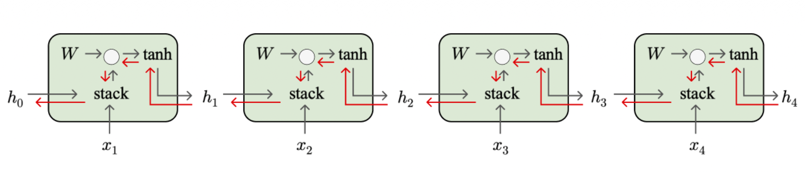
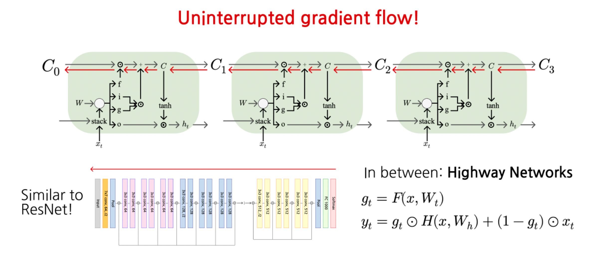
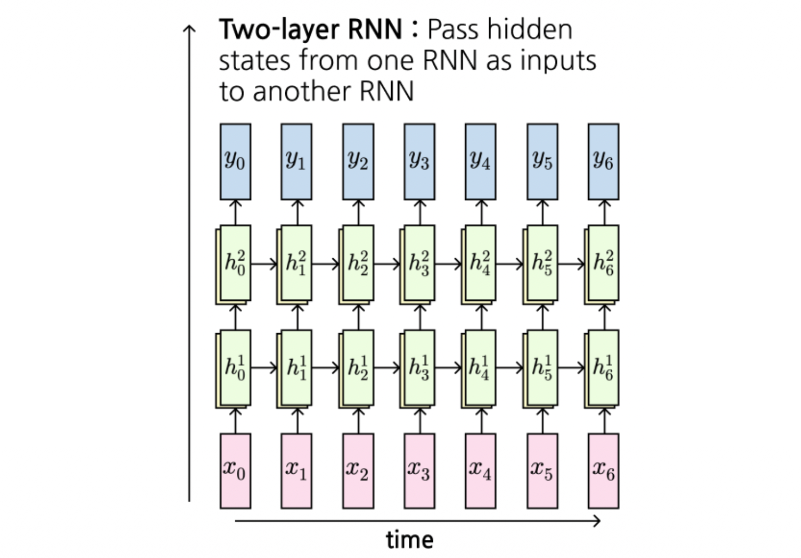

# 1. Introduction: Vanilla RNN의 치명적인 약점

이전 포스트에서는 시계열 데이터를 처리하기 위한 기본적인 순환 신경망(Vanilla RNN)의 구조와 역전파(BPTT) 과정을 살펴보았습니다. RNN은 과거의 정보를 현재로 전달하는 매력적인 구조를 가졌지만, 실제 학습 과정에서는 시퀀스가 길어질수록 과거의 정보를 제대로 기억하지 못하는 치명적인 한계가 존재합니다. 

이번 포스트에서는 Vanilla RNN의 수학적 한계인 **기울기 소실 및 폭발(Vanishing/Exploding Gradients)** 현상의 원인을 수식적으로 파헤치고, 이를 구조적으로 극복한 **LSTM(Long Short-Term Memory)** 아키텍처의 혁신성에 대해 깊이 있게 다루겠습니다.

---

# 2. Vanilla RNN의 기울기 흐름(Gradient Flow) 분석

Vanilla RNN의 은닉 상태(Hidden State)를 업데이트하는 점화식은 다음과 같습니다. 가중치 행렬 $W_{hh}$와 $W_{xh}$를 하나의 행렬 $W$로 묶어 표현하면 수식을 더 직관적으로 볼 수 있습니다.

$$h_{t} = \tanh(W_{hh}h_{t-1} + W_{xh}x_{t} + b_{h})$$
$$= \tanh \left( \begin{pmatrix} W_{hh} & W_{hx} \end{pmatrix} \begin{pmatrix} h_{t-1} \\ x_{t} \end{pmatrix} + b_{h} \right)$$
$$= \tanh \left( W \binom{h_{t-1}}{x_{t}} + b_{h} \right)$$

문제가 발생하는 지점은 역전파(Backpropagation) 과정입니다. 미래의 시점 $t$에서 과거의 시점 $t-k$로 손실 함수의 기울기를 전달하기 위해 연쇄 법칙(Chain Rule)을 적용해 보면, 매 스텝마다 $h_t$를 $h_{t-1}$로 미분한 값이 계속해서 곱해집니다.



## 2.1 기울기 폭발(Exploding Gradients)과 기울기 클리핑(Gradient Clipping)
역전파 시 매 스텝마다 가중치 행렬 $W$가 반복적으로 곱해지므로, 만약 행렬 $W$의 **가장 큰 특이값(Largest Singular Value)이 1보다 크다면**, 기울기는 시퀀스 길이가 길어짐에 따라 기하급수적으로 커집니다. 이를 **기울기 폭발(Exploding Gradients)**이라고 합니다. 

이 문제는 학습을 극도로 불안정하게 만들며, 실무에서는 기울기의 L2 노름(norm)이 특정 임계값을 넘지 못하도록 강제로 줄이는 **기울기 클리핑(Gradient Clipping)** 기법으로 완화합니다.  강의 자료에서 제시된 간단한 구현 예시는 다음과 같습니다.

```python
grad_norm = np.sum(grad * grad)
if grad_norm > threshold:
    grad *= (threshold / grad_norm)

```

## 2.2 기울기 소실(Vanishing Gradients)

반대로, 행렬 $W$의 **가장 큰 특이값이 1보다 작다면**, 기울기는 시퀀스를 거슬러 올라갈수록 기하급수적으로 작아져 결국 0에 수렴하게 됩니다.  이를 **기울기 소실(Vanishing Gradients)**이라고 합니다. 기울기 폭발은 클리핑으로 어느 정도 억제할 수 있지만, 기울기가 사라지는 현상은 학습 자체를 불가능하게 만들기 때문에 **아키텍처(구조)의 변경** 없이는 근본적인 해결이 어렵습니다. 

---

# 3. Long Short-Term Memory (LSTM) 아키텍처

기울기 소실 문제를 구조적으로 해결하기 위해 도입된 것이 바로 **LSTM**입니다. LSTM은 기존 Vanilla RNN이 단일 은닉 상태 $h_t$만을 사용하던 것과 달리, 정보를 오랫동안 보존하기 위한 **셀 상태(Cell State, $c_t$)**를 추가로 도입합니다. 

## 3.1 4개의 게이트(Gates) 구조

매 타임스텝마다 LSTM은 이전 상태 $h_{t-1}$과 현재 입력 $x_t$를 받아, 셀 상태를 어떻게 제어할지 결정하는 4개의 상호작용 벡터(Gate)를 계산합니다. 

$$\begin{pmatrix} i_{t} \\ f_{t} \\ o_{t} \\ g_{t} \end{pmatrix} = \begin{pmatrix} \sigma \\ \sigma \\ \sigma \\ \tanh \end{pmatrix} \left( W \begin{pmatrix} h_{t-1} \\ x_{t} \end{pmatrix} + b_{h} \right)$$

이 수식은 입력값과 이전 은닉 상태를 하나의 가중치 행렬 $W$와 곱한 뒤, 그 결과를 4등분하여 각각 다른 활성화 함수($\sigma$, $\tanh$)를 통과시킴을 의미합니다. 각각의 게이트는 차원이 $\mathbb{R}^H$인 벡터입니다. 

1. **Input Gate ($i_t$)**: 시그모이드($\sigma$)를 통과하여 $[0, 1]$ 값을 가집니다. 새로운 정보를 셀 상태에 **얼마나 쓸 것인지(whether to write to cell)** 결정합니다. 

2. **Forget Gate ($f_t$)**: 시그모이드($\sigma$)를 통과합니다. 과거의 셀 상태를 **얼마나 지울 것인지(whether to erase cell)** 결정합니다. 0에 가까우면 잊고, 1에 가까우면 보존합니다. 

3. **Output Gate ($o_t$)**: 시그모이드($\sigma$)를 통과합니다. 업데이트된 셀 상태의 정보를 바탕으로 외부(다음 레이어 또는 다음 타임스텝)에 **얼마나 노출시킬 것인지(how much to reveal cell)** 결정합니다. 

4. **Gate Gate / Candidate ($g_t$)**: $\tanh$를 통과하여 $[-1, 1]$ 값을 가집니다. 셀 상태에 **더해질 새로운 정보의 후보(how much to write to cell)**를 생성합니다. 

## 3.2 셀 상태와 은닉 상태의 업데이트

계산된 게이트들을 바탕으로 실제 메모리 업데이트는 다음과 같은 두 단계로 이루어집니다. ($\odot$는 원소별 곱, Hadamard Product를 의미합니다.)

**1. Cell State 업데이트:**
$$c_{t} = f_{t} \odot c_{t-1} + i_{t} \odot g_{t}$$
이전 셀 상태 $c_{t-1}$에서 잊을 부분은 $f_t$를 곱해 지우고, 새로운 정보 $g_t$ 중 $i_t$만큼만 허용하여 더해줍니다. 이 **덧셈 연산**이 LSTM의 핵심입니다. 

**2. Hidden State 업데이트:**
$$h_{t} = o_{t} \odot \tanh(c_{t})$$
다음 타임스텝으로 넘겨주거나 출력으로 내보낼 은닉 상태는, 업데이트된 셀 상태 $c_t$를 $\tanh$로 스케일링한 후 $o_t$로 필터링하여 생성합니다. 

---

# 4. LSTM은 어떻게 기울기 소실을 막는가? (Uninterrupted Gradient Flow)

LSTM이 기울기 소실 문제를 어떻게 극복했는지 역전파 관점에서 살펴보겠습니다.

$c_t$에서 $c_{t-1}$로 기울기가 전달될 때, 편미분 $\frac{\partial c_t}{\partial c_{t-1}}$ 연산의 주요 경로는 단순히 **Forget Gate $f_t$와의 원소별 곱셈(Element-wise multiplication)**입니다. 

* Vanilla RNN처럼 행렬 $W$를 매번 곱하지 않습니다! 

* $f_t$가 1에 가까운 값을 유지한다면, 역전파 과정에서 기울기는 손실 없이 수백 스텝 이전까지 흘러갈 수 있습니다.

이러한 특성은 깊은 신경망을 학습할 때 사용되는 **ResNet의 Residual Connection(스킵 커넥션)**과 수학적으로 매우 유사합니다(덧셈을 통한 기울기의 지름길 형성). 더 나아가 강의 자료에서는 $g_t$를 활용한 **Highway Networks** 식별자까지 소개하며 정보의 흐름을 능동적으로 제어하는 유사한 방법론들을 연결합니다. 



---

# 5. 다층 순환 신경망 (Multilayer RNNs)

더 복잡한 패턴을 학습하기 위해 LSTM을 여러 층(Layer)으로 쌓아 올릴 수 있습니다.  이를 Multilayer RNN 또는 Stacked RNN이라고 부릅니다.

특정 층 $l$과 타임스텝 $t$에서의 은닉 상태 $h_{t}^{l}$은 두 가지 입력에 의해 결정됩니다. 

1. 같은 층의 이전 타임스텝 은닉 상태: $h_{t-1}^{l}$
2. 이전 층의 같은 타임스텝 은닉 상태 (입력 역할): $h_{t}^{l-1}$

수식은 기존 LSTM 식에 레이어 인덱스 $l$을 추가하여 다음과 같이 일반화됩니다. 

$$\begin{pmatrix} i_{t}^{l} \\ f_{t}^{l} \\ o_{t}^{l} \\ g_{t}^{l} \end{pmatrix} = \begin{pmatrix} \sigma \\ \sigma \\ \sigma \\ \tanh \end{pmatrix} \left( W \begin{pmatrix} h_{t-1}^{l} \\ h_{t}^{l-1} \end{pmatrix} + b_{h}^{l} \right)$$

$$c_{t}^{l} = f_{t}^{l} \odot c_{t-1}^{l} + i_{t}^{l} \odot g_{t}^{l}$$

$$h_{t}^{l} = o_{t}^{l} \odot \tanh(c_{t}^{l})$$

이렇게 층을 깊게 쌓으면 모델의 표현력(Capacity)이 증가하여 더 추상적인 시퀀스 특징을 잡아낼 수 있습니다. 



---

# 6. Advanced Topics

## 6.1 Neural Architecture Search (NAS)

* 최근에는 연구자가 직접 구조를 설계하는 대신, 강화학습(Reinforcement Learning) 등을 이용해 최적의 RNN 아키텍처를 탐색하는 **NAS(Neural Architecture Search)** 기법이 적용되고 있습니다. 이 방법론이 찾아낸 구조는 인간이 설계한 LSTM 구조보다 훨씬 복잡하고 비직관적(수많은 더하기, 곱하기, max, relu 연산의 난해한 결합)이지만 성능이 더 우수하기도 합니다. 

## 6.2 Interpretable Hidden Units (해석 가능한 은닉 유닛)

강의의 마지막 부분에서는 "리눅스 커널"이나 "전쟁과 평화" 같은 텍스트로 학습된 LSTM의 내부 셀 상태 $\tanh(c_t)$를 시각화한 결과를 다룹니다. 놀랍게도 LSTM 내부에는 특정 구문론적 역할을 전담하는 세포(Cell)들이 자생적으로 발현됩니다. 

* **줄 길이 추적(Line length tracking cell)**: 텍스트가 길어짐에 따라 활성화 정도가 점진적으로 변하다가 개행 문자가 등장하면 초기화됩니다. 
* **조건문 감지(If statement cell)**: `if ( ... ) {` 구조가 시작되면 강하게 활성화되고 조건문 블록이 끝나면 비활성화됩니다. 
* **인용구/주석 감지(Quote/Comment cell)**: 주석 블록 `/* ... */` 또는 문자열 따옴표 `" ... "` 안에서만 활성화됩니다. 
* **코드 깊이/들여쓰기(Code depth cell)**: 중첩된 구조(Nested structure)에 따라 코드의 들여쓰기 깊이를 추적합니다. 

이는 LSTM이 단순히 단어의 통계적 빈도를 외우는 것이 아니라, 텍스트 데이터 내에 존재하는 근본적이고 장기적인 문맥(Long-range dependency)과 구조를 기억하고 모델링하는 능력이 탁월함을 입증하는 흥미로운 결과입니다. 