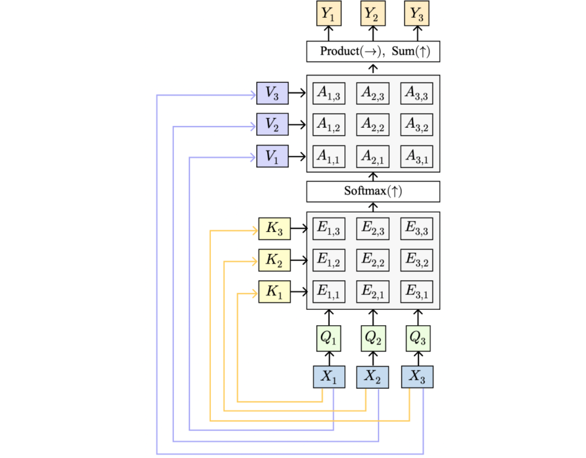
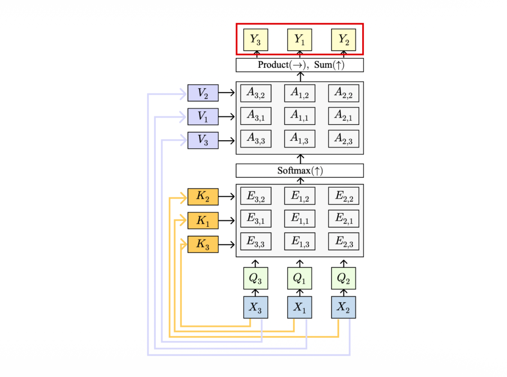
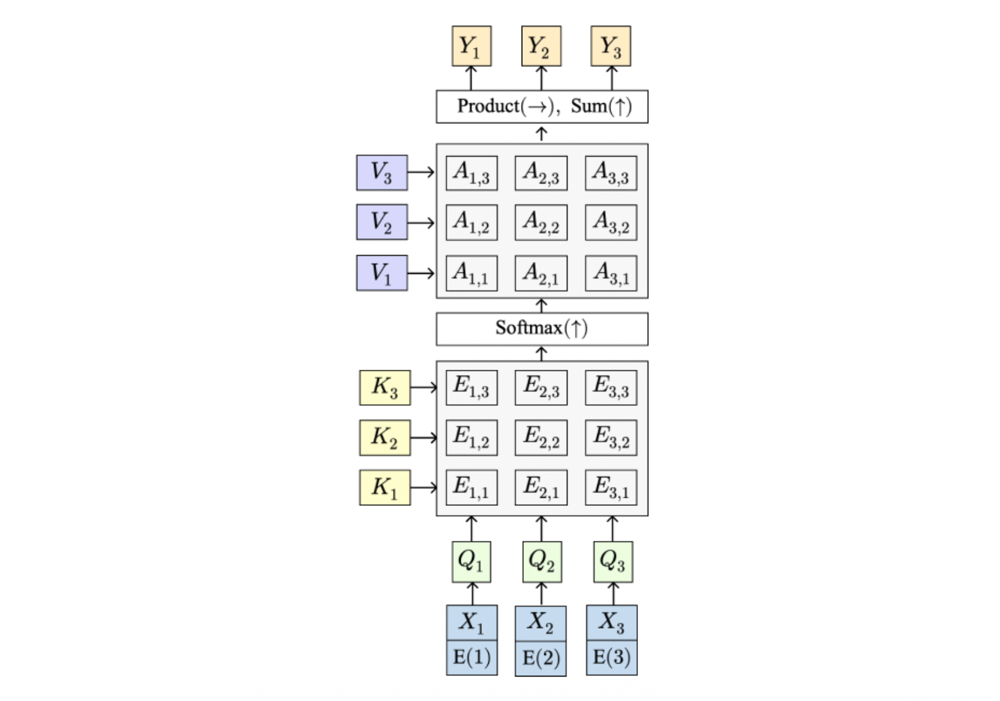
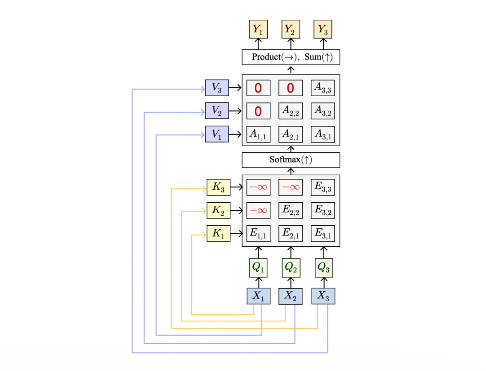
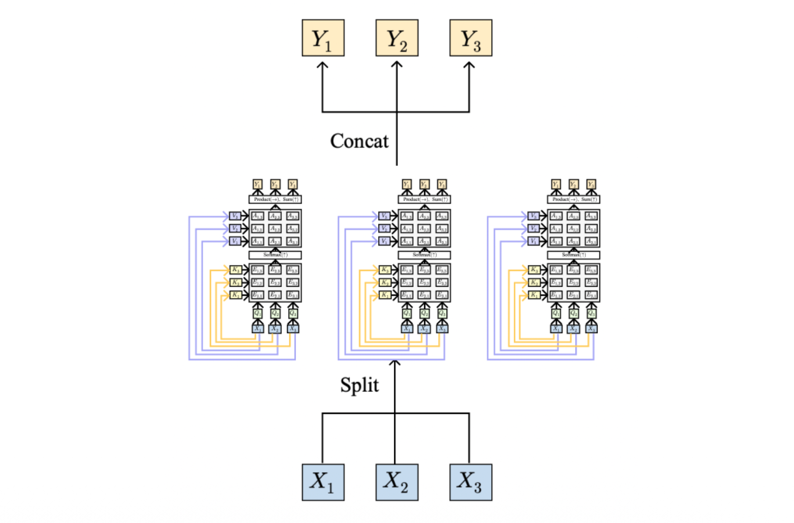

# 1. Introduction: Attention의 등장 배경 

자연어 처리와 시계열 데이터 모델링에서 RNN과 LSTM은 오랜 기간 표준으로 자리 잡아 왔습니다. 특히 기계 번역과 같은 작업에서는 입력 시퀀스를 읽어들이는 인코더(Encoder)와 출력 시퀀스를 생성하는 디코더(Decoder) 구조인 Seq2Seq(Sequence-to-Sequence) 모델이 주로 사용되었습니다. 그러나 이 전통적인 RNN 기반 인코더-디코더 구조는 시퀀스의 길이가 길어질수록 치명적인 한계를 드러냅니다. 이번 포스트에서는 그 한계가 무엇인지 진단하고, 이를 혁신적으로 극복한 **어텐션(Attention)** 메커니즘, 특히 **Self-Attention**의 원리와 수학적 구조를 집중적으로 살펴보겠습니다.

# 2. Sequence-to-Sequence의 정보 병목 현상 (Information Bottleneck) 

전통적인 RNN 기반 Seq2Seq 모델의 작동 방식은 다음과 같습니다.

* **Encoder:** 입력 시퀀스 $x_{1}, x_{2}, \dots, x_{T}$를 순차적으로 읽어들입니다. 매 타임스텝마다 은닉 상태는 $h_{t} = f(x_{t}, h_{t-1})$와 같이 업데이트됩니다. 모든 입력을 읽고 난 후의 최종 은닉 상태 $h_{T}$는 전체 입력의 문맥을 요약하는 단일 컨텍스트 벡터 $c$가 됩니다 ($c = h_{T}$).
* **Decoder:** 이 압축된 컨텍스트 벡터 $c$를 바탕으로 출력 시퀀스를 생성합니다. 디코더의 상태는 $s_{t} = g(y_{t-1}, s_{t-1}, c)$로 업데이트됩니다.

### 2.1 병목 현상(Bottleneck)의 문제점 
이 구조의 근본적인 문제는 **"전체 입력 시퀀스가 단 하나의 벡터 $c$로 압축되어야 한다"**는 점입니다. 
문장이 짧을 때는 문제가 없지만, 시퀀스가 길어지면 제한된 차원의 벡터 하나에 모든 정보를 담을 수 없게 되는 **정보 병목 현상(Information Bottleneck)**이 발생합니다. 또한, 디코더는 출력 시퀀스를 생성할 때 이전 입력 토큰들에 직접적으로 접근할 수 없고 오직 $c$에만 의존해야 합니다.

### 2.2 Attention의 아이디어 
어텐션 메커니즘은 매우 직관적인 아이디어에서 출발합니다. 디코더가 단일 컨텍스트 벡터에만 의존하는 대신, **출력을 생성할 때마다 인코더의 모든 과거 상태(states)를 다시 되돌아볼 수 있게(look back at all encoder states) 허용**하자는 것입니다. 

# 3. Self-Attention Layer의 수학적 구조 

Self-Attention은 시퀀스 내의 각 요소가 다른 모든 요소들과 어떻게 연관되어 있는지를 스스로 학습하는 레이어입니다. 하나의 입력 벡터당 하나의 쿼리(Query)를 생성하여, 입력 시퀀스 전체에 대해 병렬적으로 연산을 수행합니다.

### 3.1 변수 및 가중치 행렬 정의 
* **Input vectors ($X$):** 형태는 $N_X \times D_X$ 입니다 ($N_X$: 시퀀스 길이, $D_X$: 임베딩 차원).
* 학습 가능한 세 개의 가중치 행렬이 필요합니다:
    * **Query matrix ($W_Q$):** 차원은 $D_X \times D_Q$ 
    * **Key matrix ($W_K$):** 차원은 $D_X \times D_Q$ 
    * **Value matrix ($W_V$):** 차원은 $D_X \times D_V$ 

### 3.2 핵심 연산 과정 (Computation) 
Self-Attention의 연산은 다음 단계를 거쳐 이루어집니다.

1.  **Q, K, V 벡터 생성:** 입력 $X$를 선형 변환하여 Query, Key, Value 벡터를 만듭니다.
    * $Q = XW_Q$ (형태: $N_X \times D_Q$) 
    * $K = XW_K$ (형태: $N_X \times D_Q$) 
    * $V = XW_V$ (형태: $N_X \times D_V$) 
2.  **유사도(Similarities) 산출:** 모든 Query와 모든 Key 간의 내적을 통해 각 토큰 간의 연관성을 계산하고, 분산 안정화를 위해 $\sqrt{D_Q}$로 나누어 스케일링합니다.
    * $E = QK^\top / \sqrt{D_Q}$ (형태: $N_X \times N_X$) 
3.  **어텐션 가중치(Attention weights) 계산:** 유사도 행렬의 각 행에 대해 Softmax 함수를 취하여, 합이 1이 되는 확률 분포 형태로 만듭니다.
    * $A = \text{softmax}(E, \dim=1)$ (형태: $N_X \times N_X$) 
4.  **최종 출력(Output vectors) 생성:** 어텐션 가중치를 Value 벡터에 곱하여 최종 문맥 벡터를 생성합니다.
    * $Y = AV$ (형태: $N_X \times D_V$) 

# 4. 순열 동변성 (Permutation Equivariance) 

LSTM이나 Vanilla RNN은 입력 벡터의 '순서(Order)'에 매우 민감합니다. 입력이 들어오는 순서를 바꾸면(Permuting), 연산이 순차적으로 누적되기 때문에 최종 출력 결과가 완전히 달라집니다. 

하지만 **Self-Attention 레이어는 근본적으로 집합(Sets of vectors)에 대한 연산**으로 작동합니다.
입력 벡터들의 순서를 무작위로 뒤섞는다고 가정해 봅시다.
1.  입력 $X$의 순서가 바뀌면 $Q, K, V$ 행렬의 행 순서도 동일하게 뒤섞입니다.
2.  이로 인해 유사도 행렬 $E$와 어텐션 가중치 행렬 $A$의 원소 위치도 똑같이 뒤섞이게 됩니다.
3.  결과적으로 최종 출력 행렬 $Y$를 확인해 보면, 각 출력 벡터가 지닌 고유의 연산 결괏값은 변하지 않으며 단지 출력되는 **순서만 입력이 뒤섞인 것과 동일하게 바뀔 뿐**입니다.

이러한 특성을 **순열 동변성(Permutation Equivariance)**이라고 합니다. 

# 5. 위치 인코딩 (Positional Encoding) 

Self-Attention이 순열 동변성을 가진다는 것은 큰 장점이지만, 동시에 자연어처럼 **어순(순서)이 중요한 데이터에서는 치명적인 약점**이 될 수 있습니다. Self-Attention 자체는 처리하고 있는 벡터들이 문장 내에서 몇 번째 위치에 있는지 알지 못하기 때문입니다.

이를 해결하기 위해 모델이 위치 정보를 인식(Position-aware)할 수 있도록, 기존 입력 벡터에 **위치 인코딩(Positional Encoding, $E$)** 벡터를 연결(Concatenate)하거나 더해줍니다.
이 위치 인코딩 함수 $E$는 학습 가능한 룩업 테이블(Learned lookup table) 형태일 수도 있고, 사인/코사인 함수와 같이 고정된 수식(Fixed function)으로 구현될 수도 있습니다.

# 6. Self-Attention의 확장 구조 

### 6.1 Masked Self-Attention Layer 
언어 모델링(Language Modeling)과 같이 다음 단어를 예측해야 하는 작업에서는, 현재 시점의 단어가 **미래(미리 뒤에 나올 단어)의 정보를 참조(Look ahead)해서는 안 됩니다**.

이를 방지하기 위해 **Masked Self-Attention**을 사용합니다. Softmax 연산을 수행하기 직전에, 유사도 행렬 $E$에서 미래 시점에 해당하는 요소(행렬의 우상단 부분)를 음의 무한대($-\infty$)로 덮어씌웁니다(Masking). 이렇게 하면 Softmax를 통과한 어텐션 가중치가 $0$이 되어, 모델이 미래의 단어를 전혀 고려하지 않게 강제할 수 있습니다.

### 6.2 Multihead Self-Attention Layer 
하나의 Self-Attention 구조만 사용하면, 단일 문맥 기준에서만 연관성을 학습하게 됩니다. 복잡한 패턴을 학습하기 위해 여러 개의 어텐션 메커니즘을 병렬로 사용하는 것을 **Multihead Attention**이라고 합니다.

1.  입력 데이터 $X$의 차원을 분할(Split)합니다.
2.  총 $H$개의 독립적인 어텐션 헤드(Attention Heads)가 각각 병렬적으로 연산을 수행합니다.
3.  각 헤드의 결과물인 $Y$들을 다시 하나의 텐서로 결합(Concat)하여 모델의 표현력을 풍부하게 만듭니다.

