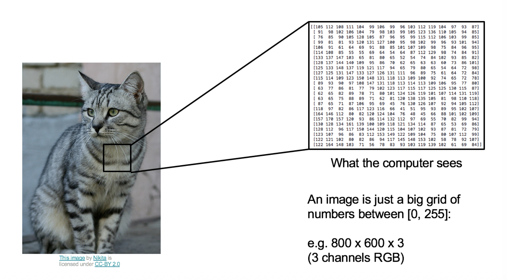
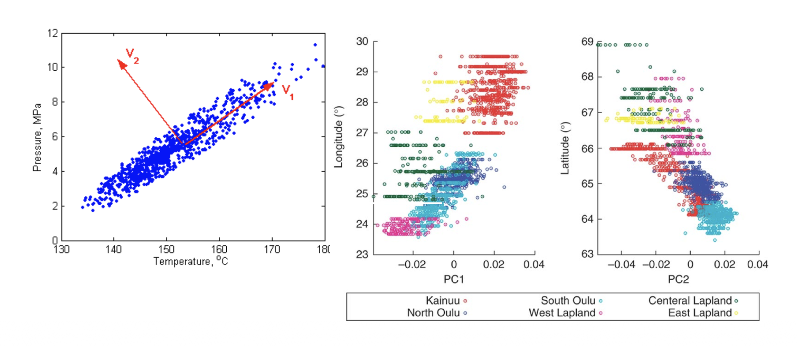
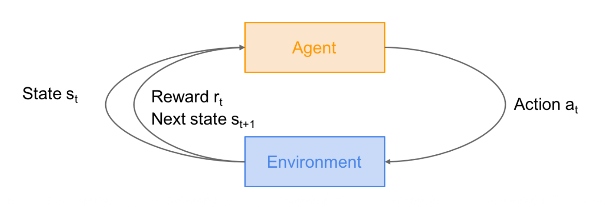
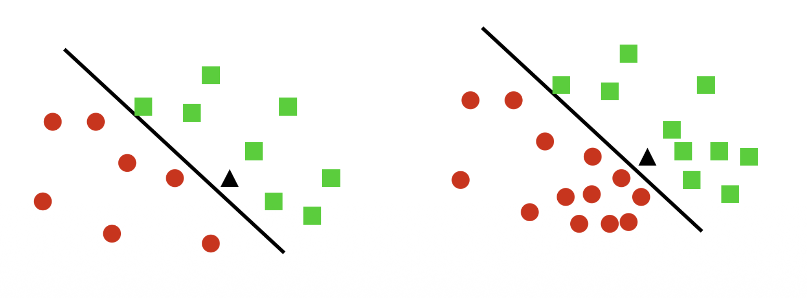

# 1. Introduction

* 이번 포스트에서는 기계학습(Machine Learning, ML) 과정의 첫 번째 강의 내용을 정리합니다. 이 강의의 주된 목표는 **얕은 학습(Shallow Learning)**부터 **딥러닝(Deep Learning)**에 이르기까지, 연구와 응용에 필요한 알고리즘, 수학, 이론, 그리고 그 이면에 있는 직관(Intuition)을 다지는 것입니다. 또한, 강의 후반부에서는 최신 딥러닝의 핵심인 **Transformer**의 구현과 학습 과정까지 다룰 예정입니다.

## 1.1 What is Machine Learning?

* 기계학습이란 근본적으로 **데이터 $x$로부터 학습하는 알고리즘**에 대한 연구입니다. 이를 수학적 함수 관계로 표현하면 다음과 같습니다.
$$
x \xrightarrow{f(x)} y
$$
  * 여기서 $x$는 입력 데이터(Input Data), $y$는 우리가 얻고자 하는 출력(Output), 그리고 $f$는 데이터로부터 학습된 함수(Model)를 의미합니다.

# 2. Types of Machine Learning Problems

* 기계학습 문제는 주어진 데이터의 형태와 목표에 따라 크게 세 가지 범주로 나눌 수 있습니다: **지도 학습(Supervised Learning)**, **비지도 학습(Unsupervised Learning)**, 그리고 **환경과의 상호작용(Interaction with Environments)**입니다.

## 2.1 Supervised Learning (지도 학습)

* 지도 학습은 정답(Label)이 주어진 상태에서 모델을 학습시키는 방식입니다. 입력 $x$와 정답 $y$의 쌍(Pair)이 주어졌을 때, 새로운 $x$에 대해 $y$를 예측하는 함수를 찾는 것이 목표입니다.

* **Binary/Multiclass Classification (분류)**
    * 입력 $x$가 주어졌을 때, 이산적인(Discrete) 클래스 $y$를 찾는 문제입니다.
    $$y \in \{1, \dots, K\}$$ 
        * $K$는 클래스의 개수
    * 예: 이메일 스팸 분류(Binary), 손글씨 숫자 인식(Multiclass)

* **Regression (회귀)**
    * 입력 $x$가 주어졌을 때, 연속적인(Continuous) 실수 값 $y$를 예측하는 문제입니다.
    $$y \in \mathbb{R}^{d}$$
    * 예: 주택 가격 예측, 주가 예측

* **Sequence Annotation**
    * 입력 시퀀스 $x_{1}, \dots, x_{n}$이 주어졌을 때, 이에 대응하는 출력 시퀀스 $y_{1}, \dots, y_{m}$을 찾는 문제입니다.
    * 예: 품사 태깅(Part-of-Speech Tagging), 개체명 인식

* **Prediction (Forecasting)**
    * 과거의 데이터 $x_{t}$와 이전 시점까지의 출력 $y_{1}, \dots, y_{t-1}$이 주어졌을 때, 현재 시점의 $y_{t}$를 예측하는 문제입니다.
    * 예: 시계열 분석, 언어 모델의 다음 단어 예측

### Case Study: Image Classification

* 이미지 분류 문제를 예로 들어봅시다. 컴퓨터가 이미지를 인식하는 과정은 인간의 직관과는 다릅니다.

> **Figure 1 설명**: 좌측은 사람이 보는 고양이 이미지입니다. 우측은 컴퓨터가 인식하는 동일한 이미지의 데이터 형태입니다. 컴퓨터에게 이미지는 $[0, 255]$ 사이의 숫자로 이루어진 거대한 그리드(Grid)일 뿐입니다. 예를 들어, $800 \times 600$ 해상도의 컬러 이미지는 $800 \times 600 \times 3$ (RGB 채널)개의 숫자로 구성된 텐서(Tensor)입니다. 기계학습 모델은 이 숫자 패턴에서 '고양이(Cat)'라는 추상적인 레이블을 도출해내야 합니다.

## 2.2 Unsupervised Learning (비지도 학습)

* 비지도 학습은 정답 레이블 $y$ 없이, 입력 데이터 $x$ 자체의 구조나 패턴을 학습하는 방식입니다.

* **Clustering (군집화)**: 데이터를 대표하는 프로토타입(Prototypes)이나 그룹을 찾습니다.
* **Sequence Analysis**: 관측된 데이터 이면에 존재하는 잠재적인 인과 시퀀스(Latent Causal Sequence)를 찾습니다.
    * 대표 모델: HMM(Hidden Markov Model), Kalman Filter
* **Independent Components / Dictionary Learning**: 관측 데이터를 구성하는 독립적인 요인(Factors)들을 찾아냅니다.
    * 대표 예시: 칵테일 파티 문제(Cocktail Party Problem) - 여러 목소리가 섞인 오디오에서 개별 화자의 목소리 분리.
* **Novelty Detection**: 데이터 분포에서 벗어난 이상치(Odd one out)를 탐지합니다.

### Case Study: Dimensionality Reduction

* 데이터의 차원을 축소하여 시각화하거나 노이즈를 제거하는 것도 비지도 학습의 중요한 응용입니다.

> **Figure 2 설명**: 좌측 그래프는 2차원 평면상의 데이터 분포를 보여주며, 데이터의 분산이 가장 큰 방향인 주성분 벡터 $V_1, V_2$를 나타냅니다. 우측 그래프들은 PCA를 통해 고차원 데이터(예: 유전체 데이터)를 저차원(PC1, PC2)으로 투영하여 시각화한 결과입니다. 이를 통해 복잡한 데이터 내의 숨겨진 구조(예: 지리적 위치에 따른 유전적 군집)를 파악할 수 있습니다.

## 2.3 Interaction with Environments

* 정적인 데이터셋을 학습하는 것을 넘어, 환경과 상호작용하며 데이터를 수집하고 학습하는 방식들입니다.
  * 1.  **Online Learning**: 데이터가 순차적으로 들어옵니다. $x_t$를 관측하고 $f(x_t)$를 예측한 뒤, 실제 $y_t$를 관측하여 모델을 업데이트합니다.
  * 2.  **Active Learning**: 모델이 학습에 도움이 될 만한 $x_t$를 선별하여 라벨 $y_t$를 질의(Query)하고, 모델을 개선한 뒤 다음 $x$를 선택합니다.
  * 3.  **Bandits (Multi-armed Bandits)**: 여러 선택지(Arm) 중 하나를 고르고 보상을 받습니다. 상태(State) 개념이 없거나 단일 상태인 강화학습의 특수한 형태로 볼 수 있습니다.
  * 4.  **Reinforcement Learning (RL, 강화학습)**: 에이전트가 행동을 취하고, 환경이 이에 반응하여 보상과 다음 상태를 반환하는 과정을 반복합니다.

### Reinforcement Learning Framework

* 강화학습은 다음과 같은 순환 구조(Loop)를 가집니다.

> **Figure 3 설명**:
> * **Agent**: 의사결정을 내리는 주체입니다.
> * **Environment**: 에이전트가 상호작용하는 세계입니다.
> * **State ($s_t$)**: 현재 시점 $t$에서의 환경의 상태입니다.
> * **Action ($a_t$)**: 에이전트가 상태 $s_t$에서 취하는 행동입니다.
> * **Reward ($r_t$)**: 행동에 대한 결과로 환경이 주는 피드백(점수)입니다.
> * **Next State ($s_{t+1}$)**: 행동의 결과로 변환된 새로운 상태입니다.

* RL의 대표적인 예시는 다음과 같습니다.

* **Robot Locomotion**:
    * **Objective**: 로봇을 앞으로 이동시키기.
    * **State**: 관절의 각도 및 위치.
    * **Action**: 관절에 가하는 토크(Torque).
    * **Reward**: 넘어지지 않고 앞으로 나아갈 때 양의 보상.
* **Atari Games / Go (바둑)**:
    * 게임의 화면 픽셀(Atari)이나 바둑판의 돌 위치(Go)가 **State**가 되며, 게임 승리 또는 점수 획득이 **Reward**가 됩니다. 특히 바둑의 경우 가능한 상태 공간(State Space)의 크기가 우주적으로 넓기 때문에 효율적인 학습 알고리즘이 필수적입니다.

---

# 3. Discriminative vs. Generative Models

* 기계학습 모델은 데이터를 확률적으로 모델링하는 방식에 따라 **Discriminative(판별)** 모델과 **Generative(생성)** 모델로 구분됩니다.

## 3.1 Discriminative Models (판별 모델)

* Discriminative 모델은 입력 $x$가 주어졌을 때 출력 $y$가 나타날 조건부 확률 **$p(y|x)$를 직접 추정**합니다.

* **특징**:
    * 데이터의 클래스 간 경계(Decision Boundary)를 찾는 데 집중합니다.
    * 데이터의 생성 원리보다는 분류 자체에 최적화되어 있습니다.
    * 일반적으로 더 간단한 솔루션을 제공하며, 수렴(Convergence) 속도가 빠르고 분류 성능이 좋은 경향이 있습니다.
    * 예: Logistic Regression, SVM, Decision Trees, 일반적인 Neural Networks 분류기.

> **Figure 4 설명**: 서로 다른 두 클래스(동그라미와 네모)를 구분하는 결정 경계(직선)를 보여줍니다. 판별 모델은 데이터가 어떻게 분포하는지(각 군집의 모양)보다는 두 군집을 어떻게 **나눌 것인가**에 초점을 맞춥니다.

## 3.2 Generative Models (생성 모델)

* Generative 모델은 입력 $x$와 출력 $y$의 결합 확률 분포 **$p(y, x)$를 추정**합니다.

* **메커니즘**:
    * 데이터 $x$가 생성되는 확률 분포 $p(x)$를 모델링합니다.
    * 베이즈 정리(Bayes' Rule)를 사용하여 조건부 확률을 유도할 수 있습니다:
        $$p(y|x) = \frac{p(y, x)}{p(x)} = \frac{p(x|y)p(y)}{p(x)}$$
* **특징**:
    * 데이터의 분포 자체를 학습하므로, 새로운 데이터 $x$를 **생성(Generation)**할 수 있습니다.
    * 최근의 Image Generation(Imagen, DALL-E)이나 Large Language Models(LLMs)가 이에 해당합니다.
    * 예: Naive Bayes, Gaussian Mixture Models, GANs, Diffusion Models.

### Generative AI Examples
* 강의 자료에서는 Generative Model의 최신 응용 사례로 다음을 제시합니다.
  * **Image**: 텍스트 프롬프트로부터 이미지 생성 (예: 초밥으로 만든 집과 웰시코기).
  * **Music**: 프롬프트, 이미지, 비디오로부터 음악 생성 및 플레이리스트 구성.
  * **Language**: 대규모 언어 모델을 통한 질의응답 및 추론.