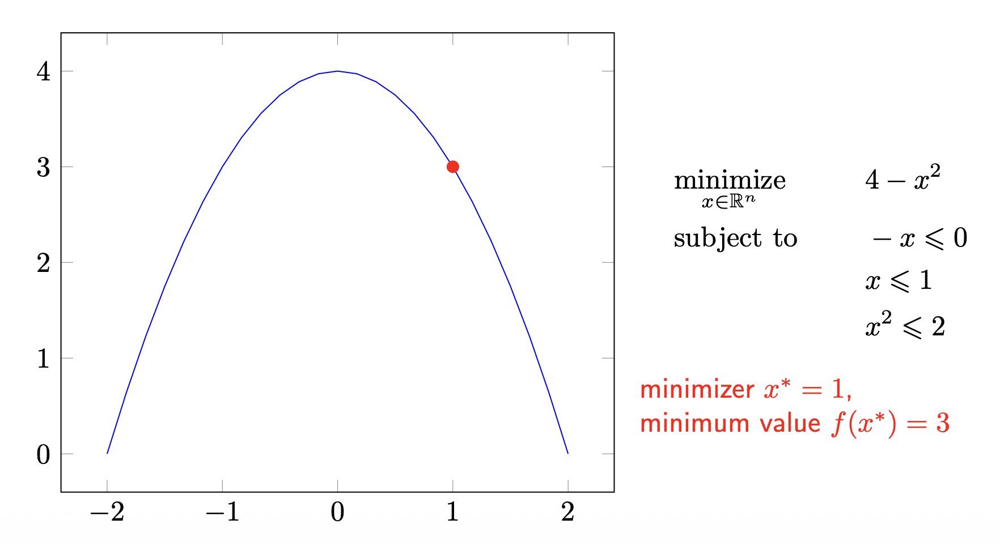

# 1. Introduction

* 이번 포스트에서는 정의한 손실 함수(Loss Function)를 최소화하여 모델의 파라미터를 찾아내는 과정, 즉 **최적화(Optimization)**에 대해 깊이 있게 다룹니다. 특히 딥러닝의 근간이 되는 Gradient Descent 방법론의 수학적 배경을 엄밀하게 유도해 봅니다.

---

# 2. Mathematical Optimization Framework

## 2.1 Optimization Problem Basics

* 일반적인 최적화 문제는 다음과 같이 정의됩니다.
$$
\begin{aligned}
& \text{minimize} & & f(x) \\
& \text{subject to} & & h_i(x) \le b_i, \quad \forall i = 1, \dots, m
\end{aligned}
$$
  * **Optimization Variable** $x = (x_1, \dots, x_n) \in \mathbb{R}^n$: 우리가 찾고자 하는 모델의 파라미터입니다.
  * **Objective Function** $f: \mathbb{R}^n \rightarrow \mathbb{R}$: 최소화하고자 하는 비용 함수(Cost Function) 또는 손실 함수입니다.
  * **Constraint Functions** $h_i: \mathbb{R}^n \rightarrow \mathbb{R}$: 해가 만족해야 하는 제약 조건입니다.
  * **Minimizer** $x^*$: 제약 조건을 만족하면서 $f(x)$를 최소화하는 해(Solution)입니다.

## 2.2 Global vs. Local Minimum

* 최적화에서 '최소'의 의미는 두 가지로 나뉩니다.

* **Global Minimum (전역 최솟값)**:
    * 정의역 전체 $\mathcal{X}$에 대해, 모든 $x$보다 함수 값이 작거나 같은 지점입니다.
    $$f(x^*) \le f(x) \quad \forall x \in \mathcal{X}$$

* **Local Minimum (국소 최솟값)**:
    * $x^*$ 주변의 아주 작은 반경 $\epsilon$ 내($B(x^*, \epsilon)$)에서만 최소이면 됩니다.
    $$f(x^*) \le f(x) \quad \forall x \in \mathcal{X} \cap B(x^*, \epsilon)$$

> **Note**: 볼록 최적화(Convex Optimization) 문제에서는 Local Minimum이 곧 Global Minimum임이 보장되지만, 딥러닝의 손실 함수는 일반적으로 Non-convex하므로 Local Minimum에 빠질 위험이 항상 존재합니다.

> **Figure 1 설명**: 위 그림은 $f(x) = 4 - x^2$ 함수를 $x \in [-2, 2]$ 범위와 제약 조건 $x^2 \le 2$ 등 하에서 최대화(혹은 $-f(x)$ 최소화)하는 예시를 보여줍니다. 제약 조건에 따라 최적 해 $x^*$의 위치가 달라짐을 시각적으로 확인할 수 있습니다.

---

# 3. Descent Methods

* 해석적(Analytic)으로 해를 구하기 힘든 경우, 우리는 반복적(Iterative)인 방법으로 해를 찾아갑니다.

## 3.1 Iterative Approach

* 초기값 $x^{(0)}$에서 시작하여, 함수 값을 감소시키는 방향으로 조금씩 이동하여 수열 $\{x^{(k)}\}$를 생성합니다.
$$x^{(k+1)} = x^{(k)} + t^{(k)} \Delta x^{(k)}$$
  * $\Delta x^{(k)}$: 탐색 방향 (Search Direction)
  * $t^{(k)} > 0$: 스텝 크기 (Step Size or Learning Rate)

* 우리의 목표는 $f(x^{(k+1)}) < f(x^{(k)})$를 만족하는 것입니다.

## 3.2 Descent Condition Derivation

* 함수 $f$가 미분 가능하다고 가정할 때, 1차 테일러 근사(First-order Taylor Approximation)를 통해 다음 식을 얻을 수 있습니다.

$$f(x + t \Delta x) \approx f(x) + t \nabla f(x)^\top \Delta x$$

* 여기서 $f(x + t \Delta x) < f(x)$가 되려면, 근사식의 뒷부분이 음수여야 합니다. $t > 0$이므로, **Descent Condition**은 다음과 같습니다.

$$
\nabla f(x)^\top \Delta x < 0
$$

* 즉, 탐색 방향 $\Delta x$는 그래디언트 $\nabla f(x)$와 **둔각(Obtuse angle, $\theta > 90^\circ$)**을 이뤄야 합니다.

## 3.3 Line Search

* 적절한 스텝 크기 $t$를 결정하는 것은 수렴 성능에 큰 영향을 미칩니다.
  * 1.  **Exact Line Search**: 주어진 방향에서 함수 값을 최소화하는 $t$를 정확히 찾습니다. (계산 비용이 높음)
      $$t = \underset{t > 0}{\text{argmin}} f(x + t \Delta x)$$
  * 2.  **Backtracking Line Search**: 적당히 큰 $t$에서 시작하여, 충분한 감소 조건(Armijo condition)을 만족할 때까지 $t$를 줄여나가는 실용적인 방법입니다.
      $$f(x) - f(x + t \Delta x) \ge -c t \langle \nabla f(x), \Delta x \rangle$$
      * 여기서 $c \in (0, 0.5), \tau \in (0, 1)$

---

# 4. Gradient Descent (GD)

* 가장 대표적인 Descent Method인 경사 하강법은 탐색 방향을 **Negative Gradient**로 설정합니다.

$$\Delta x = - \nabla f(x)$$

## 4.1 Algorithm

* 1.  초기값 $x \in \text{dom } f$ 설정.
* 2.  **Repeat** until stopping criterion ($||\nabla f(x)||_2 \le \epsilon$):
    * $\Delta x := - \nabla f(x)$
    * Line Search를 통해 $t$ 결정 (혹은 고정된 learning rate 사용)
    * Update: $x := x + t \Delta x$

## 4.2 Why Negative Gradient? (Proof of Steepest Descent)

* 왜 하필 $-\nabla f(x)$가 가장 빠르게 함수 값을 감소시키는 방향일까요? 이를 증명하기 위해 **방향 도함수(Directional Derivative)**를 살펴봅시다.

* 단위 벡터 $v$ ($||v||=1$) 방향으로의 변화율인 방향 도함수 $D_v f(x)$는 다음과 같이 정의됩니다.

$$D_v f(x) = \lim_{h \to 0} \frac{f(x + hv) - f(x)}{h} = \nabla f(x)^\top v$$

* 내적의 정의(Dot Product)에 따라 이를 다시 쓰면:
$$D_v f(x) = ||\nabla f(x)|| \, ||v|| \cos \theta = ||\nabla f(x)|| \cos \theta$$
  * 여기서 $\theta$는 $\nabla f(x)$와 $v$ 사이의 각도입니다.
  
* $D_v f(x)$를 최소화(가장 급격하게 감소)하려면 $\cos \theta$가 최소값인 $-1$이 되어야 합니다.

* 즉, $v$는 $\nabla f(x)$와 **정반대 방향**이어야 합니다. 따라서 **가장 가파른 하강 방향(Steepest Descent Direction)**은 Negative Gradient입니다.

---

# 5. Stochastic Gradient Descent (SGD)

## 5.1 Motivation: The Cost of Batch GD

* 현대의 기계학습 문제에서 목적 함수는 보통 데이터셋 전체에 대한 오차의 합(또는 평균)으로 정의됩니다.

$$f(x) = \frac{1}{n} \sum_{i=1}^{n} f_i(x)$$

* Standard (Batch) GD는 한 번의 업데이트를 위해 모든 데이터 $n$개를 다 더해야 합니다.

$$x := x - \eta \sum_{i=1}^{n} \frac{1}{n} \nabla f_i(x)$$

* 데이터셋의 크기 $n$이 수백만, 수십억이 되는 경우 이는 계산적으로 매우 비효율적입니다.

## 5.2 SGD and Minibatch SGD

* 이를 해결하기 위해 **Stochastic Gradient Descent (SGD)**는 매 단계마다 **단 하나의 샘플** $i$를 무작위로 뽑아 그래디언트를 계산합니다.

$$x := x - \eta \nabla f_i(x)$$

* 하지만 이는 노이즈가 심해 수렴이 불안정할 수 있습니다. 그 절충안으로 **Minibatch SGD**를 사용합니다.

* **Minibatch**: 크기 $m$ (예: 32, 64, 128)의 작은 데이터 묶음을 사용.
* **장점**:
    * 1.  단일 샘플보다 그래디언트 추정의 분산(Variance)을 줄여 안정적입니다.
    * 2.  행렬 연산(Vectorization)을 통해 하드웨어(GPU) 효율성을 극대화할 수 있습니다.

## 5.3 Minibatch SGD Algorithm

* 1.  **Shuffle** the data.
* 2.  전체 데이터를 $m$개씩 묶어 미니배치로 나눕니다. ($i = 0, \dots, \lceil n/m \rceil - 1$)
* 3.  각 미니배치에 대해:
    * Gradient 계산: $\Delta x = - \frac{1}{m} \sum_{j=1}^{m} \nabla f_{m \cdot i + j} (x)$
    * Update step size $t$ (Decay scheduling 등 적용 가능)
    * Update parameter: $x := x + t \Delta x$
* 4.  Stopping criterion 만족 시까지 Epoch 반복.