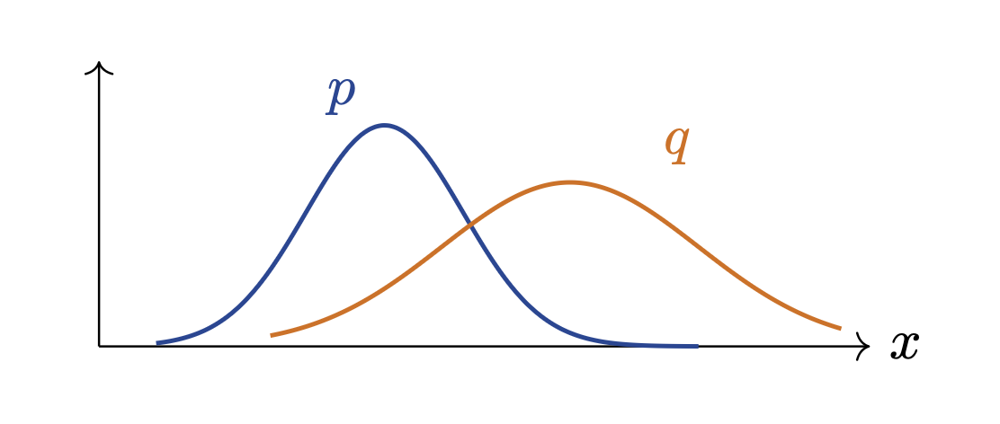

# 1. Introduction: Unsupervised Learning & Generative Modeling

* 머신러닝과 딥러닝의 학습 패러다임은 크게 데이터의 형태와 목적에 따라 지도 학습(Supervised Learning)과 비지도 학습(Unsupervised Learning)으로 나눌 수 있습니다. 

* 지도 학습이 정답(Label)이 존재하는 데이터 쌍 $(x, y)$를 이용하여 입력 $x$에서 출력 $y$로의 함수 매핑을 학습하는 것이라면, 비지도 학습은 레이블이 없는 순수 데이터 $x$만을 활용하여 데이터 내부에 숨겨진 구조(Hidden structure)를 찾아내는 것을 목표로 합니다. 지도 학습의 대표적인 예로는 분류(Classification), 회귀(Regression), 객체 탐지(Detection) 등이 있으며, 비지도 학습에는 군집화(Clustering), 차원 축소(Dimensionality reduction), 특징 학습(Feature learning), 그리고 밀도 추정(Density estimation)이 포함됩니다.

* 본 포스트에서는 비지도 학습의 한 축을 담당하는 **생성 모델(Generative Models)**의 필요성과 근본적인 목적 함수, 그리고 잠재 표현(Latent representation)을 학습하는 **오토인코더(Autoencoders)**의 기본 구조를 상세히 다룹니다. 향후 전개될 VAE(Variational Autoencoder) 툴킷(확률론적 잠재 변수 표기법, KL 발산, 젠슨 부등식, ELBO 등)을 이해하기 위한 필수적인 토대가 될 것입니다.

---

## 1.1. Why Generative Models?

* 생성 모델은 주어진 학습 데이터의 기저 분포 자체를 모델링(Model the data distribution itself)하는 고차원적인 비지도 학습 방법론입니다. 단순히 데이터를 분류하는 것을 넘어, 데이터가 어떻게 생성되었는지 그 원리를 학습함으로써 다음과 같은 다양한 영역에서 활용될 수 있습니다.
  * **현실적인 샘플 생성 (Realistic samples):** 예술 작품 창작(Artwork), 초해상도(Super-resolution), 이미지 채색(Colorization) 등 고품질의 합성 데이터를 생성합니다.
  * **데이터 증강 (Data augmentation):** 데이터가 부족한 환경에서 학습 데이터의 분포를 따르는 새로운 데이터를 생성하여 모델의 일반화 성능을 높입니다.
  * **특징 학습 (Feature learning):** 생성 과정에서 데이터의 핵심적인 잠재 특징(Latent features)을 추출하고 학습할 수 있습니다.

---

## 1.2. Autoencoders: Learning Hidden Structures

* 오토인코더(Autoencoder)는 레이블 없이 데이터 $x$의 유의미한 특징을 추출하기 위해 고안된 대표적인 비지도 특징 학습(Feature learning) 모델입니다. 이 네트워크의 핵심 아이디어는 **입력 데이터를 자신과 동일하게 복원하도록 신경망을 훈련**시키는 데 있습니다.

### 1.2.1. Architecture of Autoencoder

* 오토인코더는 크게 두 가지 핵심 모듈로 구성됩니다.
  * 1. **인코더(Encoder):** 고차원의 입력 데이터 $x$를 저차원의 **잠재 특징 벡터(Latent features) $z$**로 압축합니다. 예를 들어, 이미지 데이터의 경우 4개의 합성곱 계층(4-layer conv)으로 구성된 네트워크가 사용될 수 있습니다.
  * 2. **디코더(Decoder):** 압축된 잠재 벡터 $z$를 바탕으로 원래의 입력 데이터와 동일한 차원을 갖는 **복원된 데이터(Reconstructed data) $\hat{x}$**를 생성합니다. 디코더 역시 4개의 업컨볼루션 계층(4-layer upconv)으로 구성될 수 있습니다.

### 1.2.2. Mathematical Formulation of Objective

* 오토인코더의 학습 목적은 입력 데이터 $x$와 디코더를 통해 생성된 $\hat{x}$ 간의 차이를 최소화하는 것입니다. 이를 위해 주로 **$L_2$ 손실 함수(Mean Squared Error)**를 사용합니다.

$$
\mathcal{L} = ||x - \hat{x}||^2
$$

* **[논리적 흐름 및 수학적 직관]**
  * 단순해 보이는 위 수식은 확률론적으로 깊은 의미를 지닙니다. 만약 디코더가 생성하는 픽셀 값의 오차 분포가 등분산 가우시안 분포(Isotropic Gaussian)를 따른다고 가정하면, 모델의 파라미터에 대한 음의 로그 우도(Negative Log-Likelihood)를 최소화하는 것은 정확히 $L_2$ 거리를 최소화하는 것과 수학적으로 동치입니다. 네트워크는 이 손실 함수를 최소화하는 방향으로 인코더와 디코더의 파라미터를 동시에 업데이트하며, 그 결과 병목 계층(Bottleneck)의 변수 $z$는 데이터 $x$를 복원하는 데 가장 필수적인 정보만을 압축하여 담게 됩니다.

---

## 1.3. The Generative Modeling Objective

* 생성 모델을 확률론적 관점에서 바라볼 때, 궁극적인 목표는 실제 데이터 분포와 가장 유사한 모델 분포를 찾는 것입니다.

* 우리가 수집한 학습 데이터셋이 $x^{(1)}, ..., x^{(N)}$ 이고, 이들이 미지의 실제 데이터 분포 $p_{data}(x)$로부터 추출(i.i.d)되었다고 가정합시다 ($x^{(i)} \sim p_{data}(x)$). 우리는 파라미터 $\theta$로 정의된 모델 분포 $p_\theta(x)$가 주어졌을 때, 이 모델이 실제 현실의 사실적인 데이터에 높은 확률을 부여하도록 학습시키고자 합니다.

### 1.3.1. Maximum Likelihood Estimation (MLE)

* 이를 달성하기 위한 가장 표준적인 접근법은 최대 우도 추정(Maximum Likelihood Estimation)입니다. 독립적으로 추출된 데이터 포인트들에 대해 결합 확률을 최대화하는 $\theta$를 찾는 것은, 로그를 취하여 합산하는 문제로 변환할 수 있습니다.

$$
\max_{\theta} \sum_{i=1}^{N} \log p_{\theta}(x^{(i)})
$$

### 1.3.2 The Intractability Problem

* 간단한 분포 모델에서는 위 식의 $p_{\theta}(x)$를 직접 계산하는 것(Tractable)이 가능합니다. 하지만 이미지나 텍스트와 같이 복잡한 고차원 데이터를 모델링하기 위해 딥러닝 기반의 **신경망 잠재 변수 모델(Neural latent-variable models)**을 도입할 경우 치명적인 수학적 한계에 부딪히게 됩니다. 

* 잠재 변수 $z$가 존재하는 모델에서 데이터의 주변부 확률(Marginal probability) $p_\theta(x)$를 구하기 위해서는 모든 잠재 공간에 대해 적분을 수행해야 합니다.

$$
p_\theta(x) = \int p_\theta(x|z) p(z) dz
$$

* 고차원 공간에서 신경망으로 모델링된 복잡한 분포 $p_\theta(x|z)$에 대한 적분은 분석적으로도 불가능하며, 수치적으로도 다루기 어려운 **난해한 적분(Intractable integral)** 문제가 됩니다. 

### 1.3.3. Introduction to VAE

* 이러한 Intractable 문제를 해결하고 딥러닝 기반 모델에서 우도(Likelihood)를 극대화하기 위한 돌파구로 등장한 것이 바로 **변분 오토인코더(Variational Autoencoder, VAE)** 입니다. VAE는 직접적으로 $\log p_\theta(x)$를 최대화하는 대신, 최적화가 가능한 형태의 **계산 가능한 하한선(Tractable lower bound, ELBO)**을 도출하여 이를 최대화하는 우회적이고 우아한 해법을 제시합니다. (ELBO의 구체적인 수학적 유도 과정과 최적화 기법은 이어지는 포스트에서 다루도록 하겠습니다.)

---

# 2. Autoencoders: Representation Learning

* 앞선 포스트에서 비지도 학습과 생성 모델의 궁극적인 목표를 살펴보았습니다. 이번 포스트에서는 본격적으로 **오토인코더(Autoencoders)**의 수학적 구조와 이를 확률론적으로 해석하는 과정을 다룹니다.

* 오토인코더는 데이터의 고차원 구조를 저차원의 의미 있는 표현(Representation)으로 압축하고 다시 복원하는 과정을 통해 데이터의 기저 특징을 학습하는 비지도 학습 모델입니다.

---

## 2.1. Architecture and The Bottleneck

* 오토인코더는 입력 공간 $\mathcal{X}$에서 잠재 공간(Latent space) $\mathcal{Z}$로, 그리고 다시 $\mathcal{X}$로 매핑하는 두 개의 신경망으로 구성됩니다.
  * 1.  **인코더 (Encoder), $f_\phi$:**
      * 입력 데이터 $x$를 저차원의 잠재 코드(Latent code) $z$로 매핑합니다.
      $$z = f_\phi(x)$$
  * 2.  **디코더 (Decoder), $g_\theta$:**
      * 잠재 코드 $z$를 받아 원래의 데이터와 같은 차원의 $\hat{x}$로 복원(Reconstruction)합니다.
      $$\hat{x} = g_\theta(z)$$

* 여기서 핵심적인 기하학적 제약은 **잠재 공간의 차원이 입력 공간의 차원보다 작다($dim(z) < dim(x)$)**는 점입니다. 이러한 '병목(Bottleneck)' 구조는 네트워크가 단순히 입력을 출력으로 복사하는 항등 함수(Identity function)를 학습하는 것을 방지합니다. 대신, 네트워크는 복원 오차를 최소화하기 위해 데이터 변동을 설명하는 가장 유용한 팩터(Useful factors of variation)만을 $z$에 담도록 강제됩니다.

---

## 2.2. Objective Function and Applications

* 오토인코더의 학습 목적 함수는 원본 데이터 $x^{(i)}$와 이를 인코딩 후 디코딩한 결과 사이의 차이를 최소화하는 것입니다. 주로 $L_2$ 노름(Norm)의 제곱을 손실 함수로 사용합니다.

$$ \min_{\theta, \phi} \sum_{i=1}^N ||x^{(i)} - g_\theta(f_\phi(x^{(i)}))||_2^2 $$

* 이러한 방식으로 학습된 오토인코더는 단순한 데이터 압축을 넘어 다양하게 활용됩니다.
  *   **차원 축소 (Dimensionality reduction)** 및 **특징 학습 (Feature learning)**
  *   **노이즈 제거 (Denoising)** 및 손상된 데이터 복원
  *   **사전 학습 (Pretraining):** 학습된 인코더 부분을 떼어내어 분류기(Classifier) 등의 하위 지도 학습(Downstream supervised tasks)의 특징 추출기(Feature extractor)로 재사용할 수 있습니다.

---

## 2.3. Can a Vanilla Autoencoder Generate?

* 오토인코더가 데이터를 훌륭하게 압축하고 복원할 수 있다면, 이를 그대로 **생성 모델(Generative Model)**로 사용할 수 있을까요?

* 이론적으로 인코더를 버리고, 잠재 공간에서 임의의 $z$를 샘플링한 뒤 디코더 $g_\theta(z)$를 통과시키면 새로운 데이터 $\hat{x}$가 생성될 것 같지만, 결정론적(Deterministic) 오토인코더인 일반적인(Vanilla) 모델에서는 이 방식이 작동하지 않습니다.

$$ z \sim ? \quad \longrightarrow \quad \hat{x} = g_\theta(z) $$

* 문제의 핵심은 **"우리가 어떤 분포에서 $z$를 샘플링해야 하는가?"**를 모른다는 점입니다. 결정론적 오토인코더는 학습 데이터에 대응하는 코드들을 매핑할 뿐, 잠재 공간 전체에 대해 알려진 확률 분포(Known distribution)를 정의하지 않습니다.

### 2.3.1. The "Holes" in Latent Space

* 잠재 공간 내부를 들여다보면 모델이 생성에 적합하지 않은 이유가 명확해집니다. 학습 데이터가 매핑된 잠재 공간은 연속적이지 않고, 매우 복잡한 부분집합(Complicated subset)만을 차지하게 됩니다.

* 만약 우리가 무작위로 $z$를 샘플링할 때, 학습 데이터가 전혀 매핑되지 않은 빈 공간(Holes)에 도달하게 된다면 어떻게 될까요? 디코더는 이 영역의 벡터를 해석하는 방법을 배운 적이 없으므로, 완전히 비현실적이고 망가진 출력(Unrealistic outputs)을 생성하게 됩니다.

### 2.3.2. VAE Intuition
* 이러한 문제를 해결하기 위한 직관적인 아이디어가 바로 **변분 오토인코더(VAE)**의 출발점입니다. 인코딩된 잠재 코드들이 특정 단순한 사전 확률 분포(Prior distribution), 주로 표준 정규 분포 $p(z) = \mathcal{N}(0, I)$를 따르도록 강제하여 잠재 공간을 연속적이고 빈틈없이 채우는 것입니다.

---

## 2.4. Reconstruction Loss as Likelihood

* 앞서 일반적인 오토인코더의 재구성 손실(Reconstruction loss)로 $L_2$ 제곱 오차 $||x - \hat{x}||_2^2$를 사용한다고 했습니다. 이를 확률론적 관점에서 재해석하면, **왜 특정 데이터 형식에 특정 손실 함수를 써야 하는지** 수학적인 당위성을 얻을 수 있습니다.

* 디코더를 단순한 함수 $\hat{x} = g_\theta(z)$가 아니라, 데이터 $x$에 대한 조건부 확률 분포 $p_\theta(x|z)$로 취급해 봅시다.

### 2.4.1. Continuous Data: Gaussian Decoder

* 데이터가 연속적인 실수 값(Continuous data)을 가질 때, 디코더의 출력 분포가 $g_\theta(z)$를 평균으로 하고 분산이 $\sigma^2 I$인 등분산 가우시안(Isotropic Gaussian)을 따른다고 가정합니다.

$$ p_\theta(x|z) = \mathcal{N}(g_\theta(z), \sigma^2 I) $$

* 다변량 정규 분포의 확률 밀도 함수를 기반으로 이 모델의 음의 로그 우도(Negative Log-Likelihood, NLL)를 전개해 보겠습니다.

$$ -\log p_\theta(x|z) = -\log \left( \frac{1}{(2\pi\sigma^2)^{D/2}} \exp\left(-\frac{||x - g_\theta(z)||_2^2}{2\sigma^2}\right) \right) $$

$$ -\log p_\theta(x|z) = \frac{1}{2\sigma^2} ||x - g_\theta(z)||_2^2 + \text{constant} $$

* 놀랍게도, 가우시안 로그 우도를 최대화(NLL을 최소화)하는 것은 오토인코더의 제곱 복원 오차(MSE-like loss)를 최소화하는 것과 정확히 동치입니다. 즉, 우리가 관성적으로 사용하던 $L_2$ 손실은 디코더의 출력이 가우시안 분포를 따른다는 확률론적 가정 하의 최대 우도 추정치였던 것입니다.

### 2.4.2. Binary Data: Bernoulli Decoder

* 만약 데이터가 0과 1로 이루어진 이진 픽셀(Binary data)이라면 가우시안 가정을 적용하는 것은 부적절합니다. 이 경우 디코더의 출력을 베르누이 분포의 파라미터 $\pi_\theta(z)$(픽셀이 1일 확률)로 모델링합니다.

$$ p_\theta(x|z) = \text{Bernoulli}(\pi_\theta(z)) $$

* 베르누이 분포에 대한 음의 로그 우도를 계산하면 다음과 같습니다.

$$ -\log p_\theta(x|z) = -\sum_j \left[ x_j \log \pi_j + (1 - x_j) \log(1 - \pi_j) \right] $$

* 이는 딥러닝에서 분류 문제에 널리 쓰이는 이진 교차 엔트로피(Binary Cross-Entropy, BCE) 손실 함수와 정확히 일치합니다.

* 결론적으로, 디코더에 어떤 확률 분포를 가정하느냐에 따라 오토인코더가 최적화해야 할 재구성 손실 함수의 형태가 수학적으로 자연스럽게 결정됩니다. 이러한 확률론적 접근은 결정론적 모델을 확률적 모델인 VAE로 확장하는 데 필수적인 수학적 징검다리가 됩니다.

---

# 3. Probabilistic Latent-Variable Notation

* 이번 포스트에서는 본격적으로 변분 오토인코더(Variational Autoencoder, VAE)의 수학적 유도를 진행하기에 앞서, 확률론적 잠재 변수 생성 모델(Latent-variable generative model)의 전반적인 흐름과 필수적인 표기법(Notation)을 엄밀하게 정의합니다.

* 생성 모델의 관점에서 데이터 $x$가 생성되는 과정은 다음과 같이 가정할 수 있습니다.
  * 1. 먼저, 우리가 미리 정의한 단순한 사전 확률 분포(Prior distribution) $p(z)$에서 잠재 변수 $z$를 샘플링합니다. 일반적으로 이 분포는 표준 정규 분포인 $\mathcal{N}(0, I)$를 사용합니다.
  * 2. 그 다음, 샘플링된 $z$를 조건으로 하여 디코더(Decoder) 신경망이 정의하는 분포 $p_\theta(x|z)$로부터 실제 데이터 $x$를 생성(샘플링)합니다.

* 이러한 모델에서 데이터 $x$에 대한 주변부 우도(Marginal likelihood)는 잠재 공간에 대한 적분으로 표현됩니다.

$$ p_\theta(x) = \int p(z) p_\theta(x|z) dz $$

* 이 수식은 가능한 모든 잠재적 설명(All possible latent explanations $z$)을 고려했을 때, 데이터 $x$에 할당되는 최종적인 확률을 의미합니다. 하지만 딥러닝 기반의 신경망 디코더를 사용할 경우, 이 적분식은 분석적으로 풀 수 없는 난해한(Intractable) 문제가 됩니다.

---

## 3.1. VAE Notation Cheat Sheet

* 앞으로 전개될 복잡한 수식들을 헷갈리지 않게 따라가기 위해, VAE에서 사용되는 핵심 확률 분포들의 표기법과 그 역할을 명확히 정리할 필요가 있습니다.
  *   **$p(z)$**: 잠재 변수에 대한 사전 확률 분포(Prior)로, 주로 $\mathcal{N}(0, I)$로 설정됩니다.
  *   **$p_\theta(x|z)$**: 잠재 변수 $z$가 주어졌을 때 데이터 $x$의 분포를 나타내며, 생성 네트워크(Generative network) 또는 디코더(Decoder), Likelihood 역할을 합니다.
  *   **$p_\theta(x)$**: 주변부 우도(Marginal likelihood)로, $\int p(z)p_\theta(x|z)dz$ 입니다.
  *   **$p_\theta(z|x)$**: 데이터 $x$가 주어졌을 때 잠재 변수 $z$의 '참인 사후 확률(True posterior)'입니다. 하지만 이 값은 계산이 매우 어렵습니다(Usually intractable).
  *   **$q_\phi(z|x)$**: 계산이 불가능한 참인 사후 확률을 근사하기 위해 도입된 '변분 사후 확률(Variational posterior)'로, 인코더(Encoder) 또는 인식 네트워크(Recognition network) 역할을 합니다.

### 사후 확률(Posterior)이 Intractable한 이유
* 베이즈 정리(Bayes' rule)를 사용하여 참인 사후 확률 $p_\theta(z|x)$를 전개해 보면 그 이유를 알 수 있습니다.

$$ p_\theta(z|x) = \frac{p_\theta(x|z) p(z)}{p_\theta(x)} $$

* 분자는 우리가 설정한 디코더와 사전 확률이므로 계산할 수 있지만, 분모에 있는 주변부 우도 $p_\theta(x)$가 앞서 언급했듯 적분이 불가능한 형태이기 때문에 전체 사후 확률 역시 계산이 불가능해집니다. 이 문제를 우회하기 위해 우리는 $q_\phi(z|x)$라는 인코더 네트워크를 도입하여 사후 확률을 근사하게 됩니다.

---

## 3.2. Training Path vs. Generation Path

* VAE는 학습(Training)할 때와 생성(Generation)할 때 데이터가 흐르는 경로가 다릅니다. 앞서 정의한 표기법을 통해 두 경로를 비교해 보겠습니다.

### 3.2.1 Training / Reconstruction Path
* 학습 과정에서는 입력 데이터 $x$가 존재합니다.
  * 1. 데이터 $x$가 인코더 $q_\phi(z|x)$를 통과하여 잠재 변수 $z$에 대한 분포의 파라미터를 추정합니다.
  * 2. 이 분포에서 $z$를 샘플링합니다.
  * 3. 샘플링된 $z$가 디코더 $p_\theta(x|z)$를 통과하여 복원된 데이터 $\hat{x}$를 생성합니다.

### 3.2.2 Generation Path
* 학습이 끝난 후 새로운 데이터를 생성할 때는 인코더가 필요하지 않습니다.
  * 1. 우리가 이미 알고 있는 사전 확률 분포 $p(z) = \mathcal{N}(0, I)$에서 순수하게 무작위로 잠재 변수 $z$를 샘플링합니다.
  * 2. 이 $z$를 학습된 디코더 $p_\theta(x|z)$에 통과시켜 세상에 없던 완전히 새로운 데이터(new $x$)를 생성해 냅니다.

---

## 3.3. Mathematical Tools We Need (Preview)

* 결론적으로 VAE는 계산이 불가능한 목적 함수를 최적화하기 위해, 이를 우회하는 '계산 가능한 하한선(ELBO)'을 최대화하는 방식을 취합니다. 이 ELBO를 유도하고 계산하기 위해 다음 포스트에서 다루게 될 세 가지 핵심 수학 도구는 다음과 같습니다.
  * 1.  **KL Divergence (쿨백-라이블러 발산):** 두 확률 분포 간의 차이를 측정하는 도구입니다.
      $$ D_{KL}(q_\phi(z|x) || p(z)) $$
  * 2.  **Jensen's Inequality (젠슨 부등식):** 볼록/오목 함수에서 기댓값과 함수의 순서를 바꿀 때 성립하는 부등식으로, 하한선(Lower bound)을 유도하는 핵심입니다.
      $$ \log \mathbb{E}[Y] \ge \mathbb{E}[\log Y] $$
  * 3.  **Gaussian KL in closed form:** 두 가우시안 분포 사이의 KL 발산을 적분 없이 닫힌 형태(Closed form)로 계산하는 공식입니다.
      $$ D_{KL}(\mathcal{N}(\mu, \text{diag}(\sigma^2)) || \mathcal{N}(0, I)) $$

* 이 세 가지 도구를 조합하면, 우리가 궁극적으로 최적화해야 할 VAE의 목적 함수인 **ELBO (Evidence Lower Bound)**를 다음과 같은 직관적인 두 항의 차이로 도출할 수 있습니다.

$$ \text{ELBO} = \text{reconstruction} - \text{latent regularization} $$

---

# 4. Definition of KL Divergence

* KL 발산은 한 확률 분포 $q$를 사용하여 다른 확률 분포 $p$를 근사할 때 발생하는 정보의 손실량을 측정하는 지표입니다. 데이터가 이산적인지 연속적인지에 따라 다음과 같이 정의됩니다.

---

## 4.1 Discrete Case (이산형 분포)
* 두 유한 분포 $p$와 $q$가 공간 $\mathcal{X}$ 상에 존재할 때, KL 발산은 다음과 같이 정의됩니다.

$$
D_{KL}(p||q) = \sum_{x \in \mathcal{X}} p(x) \log \frac{p(x)}{q(x)} = \mathbb{E}_{X \sim p}\left[ \log \frac{p(X)}{q(X)} \right]
$$

## 4.2 Continuous Case (연속형 분포)
* 연속형 확률 분포 $p$와 $q$에 대해서는 합(Summation)이 적분(Integral)으로 대체됩니다.

$$
D_{KL}(p||q) = \int p(x) \log \frac{p(x)}{q(x)} dx = \mathbb{E}_{X \sim p}\left[ \log \frac{p(X)}{q(X)} \right]
$$

* 결국 두 경우 모두 대상 분포 $p$에서 추출한 샘플에 대해, 두 분포의 확률 밀도 비율의 로그값에 대한 기댓값(Expectation)을 구하는 것과 같습니다.

---

## 4.3. Important Properties of KL Divergence

* KL 발산은 단순한 '거리' 함수가 아니며, 머신러닝 최적화 과정에서 매우 중요한 기하학적 성질들을 가집니다.

### 4.3.1 Non-negativity (비음성)
* KL 발산의 값은 항상 0보다 크거나 같습니다.
$$ D_{KL}(p||q) \ge 0 $$
* 이 값이 정확히 0이 되는 조건(Equality iff)은 거의 모든 곳에서(almost everywhere) $p = q$ 일 때뿐입니다. 즉, 두 분포가 완벽히 일치할 때 정보 손실이 0이 됩니다.

### 4.3.2 Not a Distance (거리 함수의 조건 위배)
* 일반적으로 수학에서 말하는 '거리(Distance)' 지표는 대칭성($d(p,q) = d(q,p)$)을 만족해야 합니다. 하지만 KL 발산은 대칭성을 만족하지 않습니다.
$$ D_{KL}(p||q) \neq D_{KL}(q||p) $$
* 방향이 매우 중요하며(The direction matters), $p$를 기준으로 $q$를 평가하느냐, $q$를 기준으로 $p$를 평가하느냐에 따라 서로 다른 종류의 실수(Mistakes)에 페널티를 부여하게 됩니다.

### 4.3.3 The Support Condition (서포트 조건)
* KL 발산 값이 무한대로 발산하지 않고 유한한 값($D_{KL}(p||q) < \infty$)을 가지기 위해서는 매우 중요한 조건이 충족되어야 합니다.
  *   **수학적 조건:** $p$가 양의 확률을 가지는 모든 곳에서, $q$ 역시 반드시 0이 아닌 확률을 가져야 합니다.
  *   **동치 표현:** $p$의 서포트가 $q$의 서포트의 부분집합이어야 합니다 ($supp(p) \subseteq supp(q)$).
  *   **직관적 의미 (Plain language):** 근사 분포 $q$는 원래 분포 $p$보다 더 넓게 퍼져 있을 수는 있지만, $p$에 질량(확률)이 존재하는 영역에 $q$가 '구멍(Holes)'을 가지고 있어서는 안 됩니다. 만약 $p$의 데이터가 존재하는 공간을 $q$가 전혀 설명하지 못한다면($q(x)=0$), 분모가 0이 되어 KL 발산 값은 무한대가 되어버립니다.

---

## 4.4. The KL Term Used in VAEs

* 이러한 특성을 가진 KL 발산이 VAE 모델 내에서는 어떻게 활용될까요? VAE에서 가장 중요한 KL 항(The most important KL for VAEs)은 다음과 같습니다.
$$ D_{KL}(q_\phi(z|x) || p(z)) $$
  *   **$q_\phi(z|x)$**: 우리가 학습시키는 인코더 분포(Encoder distribution)입니다.
  *   **$p(z) = \mathcal{N}(0, I)$**: 생성 시에 샘플링하고자 하는 목표 사전 확률 분포(Prior we want to sample from during generation)입니다.

### Interpretation (해석)

* 이 KL 항이 VAE의 목적 함수에 포함되어 최소화된다는 것은, **인코더가 데이터를 압축하여 만들어낸 잠재 분포 $q_\phi(z|x)$를 우리가 다루기 쉬운 단순한 사전 분포 $p(z)$에 가깝게 유지(Keeps the encoder's latent distribution close to a simple prior)하도록 강제**한다는 의미입니다. 

* 이를 통해 인코더는 잠재 공간(Latent space)의 구조를 일관되고 연속적으로 정돈하게 되며, 앞선 포스트에서 언급했던 "잠재 공간의 구멍(Holes in latent space)" 문제를 원천적으로 방지하여 디코더가 무작위 샘플링된 $z$에서도 현실적인 데이터를 생성할 수 있도록 만듭니다.

---

# 5. Convexity and Jensen's Inequality

* 젠슨 부등식을 이해하기 위해서는 먼저 볼록 함수(Convex function)의 수학적 정의를 짚고 넘어가야 합니다.

---

## 5.1 Definition of Convex Function
* 어떤 함수 $f: \Omega \rightarrow \mathbb{R}$ 가 볼록(Convex)하다는 것은, 정의역 내의 임의의 두 점 $x, y \in \Omega$ 와 $0 \le \lambda \le 1$ 인 $\lambda$에 대하여 다음 부등식을 만족함을 의미합니다.

$$ f(\lambda x + (1-\lambda)y) \le \lambda f(x) + (1-\lambda)f(y) $$

* 이는 기하학적으로 함수의 그래프 상의 임의의 두 점을 연결한 선분(Chord)이 항상 그 두 점 사이의 함수 곡선(Curve)보다 크거나 같음(위쪽에 위치함)을 나타냅니다.

---

## 5.2 Jensen's Inequality
* 함수 $f$가 볼록 함수일 때, 젠슨 부등식은 기댓값(Expectation) 연산과 함수 적용의 순서에 대한 강력한 성질을 제공합니다.

$$ \mathbb{E}[f(X)] \ge f(\mathbb{E}[X]) $$

* 즉, 볼록 함수에 대해 'X의 함수값들의 평균(기댓값)'은 항상 'X의 평균에 대한 함수값'보다 크거나 같습니다.

---

## 5.3. Jensen for Concave Logarithm

* VAE의 ELBO를 유도할 때, 우리는 가능도(Likelihood)를 극대화하기 위해 로그(log) 함수를 주로 다루게 됩니다. 중요한 점은 로그 함수가 볼록 함수가 아니라 **오목 함수(Concave function)**라는 것입니다.

* 오목 함수 $g$에 대해서는 젠슨 부등식의 부등호 방향이 반대가 됩니다.

$$ \mathbb{E}[g(X)] \le g(\mathbb{E}[X]) $$

* 로그 함수 역시 오목 함수이므로, 다음의 부등식이 성립합니다.

$$ \mathbb{E}[\log Y] \le \log \mathbb{E}[Y] $$

* 이를 우리가 자주 사용하게 될 형태로 좌우를 바꾸어 다시 쓰면 다음과 같습니다.

$$ \log \mathbb{E}[Y] \ge \mathbb{E}[\log Y] $$

* 이 수식이 바로 **ELBO를 유도하는 수학적 핵심 단계(The key mathematical step in deriving the ELBO)**입니다. 추후 우리는 이 식의 $Y$ 자리에 $Y(z) = \frac{p_\theta(x,z)}{q_\phi(z|x)}$ 라는 항을 대입하여 전개할 것입니다.

---

## 5.4. Applications of Jensen's Inequality

* 젠슨 부등식은 생성 모델의 수학적 증명 곳곳에서 마법처럼 작용합니다. 강의 자료에 제시된 두 가지 핵심 적용 사례를 살펴보겠습니다.

### 5.4.1 Proof: Non-negativity of KL divergence
* 이전 포스트에서 KL 발산 값은 항상 0 이상($D_{KL}(p||q) \ge 0$)이라고 정의했습니다. 젠슨 부등식을 사용하면 이를 수학적으로 간단명료하게 증명할 수 있습니다.

* 두 분포가 동일한 서포트(Common support)를 가진다고 가정하고 식을 전개합니다.

$$ D_{KL}(p||q) = \mathbb{E}_{X \sim p}\left[ -\log \frac{q(X)}{p(X)} \right] $$

* 여기서 함수 $-\log$ 는 볼록(Convex) 함수입니다. 따라서 젠슨 부등식 $\mathbb{E}[f(X)] \ge f(\mathbb{E}[X])$ 를 적용하면 기댓값 기호가 함수 안으로 들어갈 수 있습니다.

$$ D_{KL}(p||q) \ge -\log \mathbb{E}_{X \sim p}\left[ \frac{q(X)}{p(X)} \right] $$

* 기댓값의 정의에 따라 식을 적분 형태로 바꾸면 다음과 같이 계산됩니다.

$$ = -\log \int p(x) \frac{q(x)}{p(x)} dx = -\log \int q(x) dx $$

* 확률 밀도 함수의 총합(적분값)은 1이므로, $\int q(x) dx = 1$ 입니다.

$$ = -\log(1) = 0 $$

* 따라서, $D_{KL}(p||q) \ge 0$ 이 증명됩니다. (등호는 거의 모든 곳에서 $p=q$ 일 때 성립합니다).

### 5.4.2 Preview: Why Jensen matters for VAEs
* 젠슨 부등식이 VAE에서 어떻게 '하한(Lower bound)'을 만들어내는지 그 시작 과정을 살펴보겠습니다.
  * 1.  먼저, 우리가 최대화하고 싶은 주변부 우도(Marginal likelihood) 식에서 출발합니다.
      $$ p_\theta(x) = \int p_\theta(x,z) dz $$
  * 2.  이 식의 적분 안에 우리가 임의로 정의한 인코더의 변분 사후 확률 분포 $q_\phi(z|x)$를 분모와 분자에 곱하여 삽입합니다.
      $$ p_\theta(x) = \int q_\phi(z|x) \frac{p_\theta(x,z)}{q_\phi(z|x)} dz $$
  * 3.  이는 분포 $q_\phi(z|x)$에 대한 기댓값 형태로 다시 쓸 수 있습니다.
      $$ p_\theta(x) = \mathbb{E}_{z \sim q_\phi(z|x)}\left[ \frac{p_\theta(x,z)}{q_\phi(z|x)} \right] $$
  * 4.  이제 양변에 $\log$ 를 취하고, $\log$가 오목(Concave) 함수라는 성질을 이용하여 앞서 배운 젠슨 부등식 $\log \mathbb{E}[Y] \ge \mathbb{E}[\log Y]$ 를 적용합니다.
      $$ \log p_\theta(x) \ge \mathbb{E}_{z \sim q_\phi(z|x)}\left[ \log \frac{p_\theta(x,z)}{q_\phi(z|x)} \right] $$

* 바로 이 부등식의 우변이 우리가 찾던 **ELBO (Evidence Lower Bound)**입니다. 좌변인 데이터의 로그 우도를 직접 최대화하는 것은 불가능하지만, 이 부등식 덕분에 우리는 계산 가능한 우변의 식을 최대화함으로써 모델을 간접적으로 최적화할 수 있게 됩니다. 

---

# 6. Introduction: The Need for Gaussian KL

## 6.1. General KL Between Two Gaussians

* 일반적인 $k$차원 다변량 정규 분포(Multivariate Gaussians) 두 개가 주어졌다고 가정해 봅시다.
  *   $p_0 = \mathcal{N}(\mu_0, \Sigma_0)$
  *   $p_1 = \mathcal{N}(\mu_1, \Sigma_1)$

* 이 두 분포 사이의 일반적인 KL 발산 식은 다음과 같습니다.

$$
D_{KL}(p_0 || p_1) = \frac{1}{2} \left( \text{Tr}(\Sigma_1^{-1}\Sigma_0) + (\mu_1 - \mu_0)^T\Sigma_1^{-1}(\mu_1 - \mu_0) - k + \log \frac{\det \Sigma_1}{\det \Sigma_0} \right)
$$

* 위 수식은 행렬의 대각합(Trace, $\text{Tr}$), 역행렬($\Sigma^{-1}$), 행렬식($\det$) 등을 포함하고 있어 다소 복잡해 보입니다. 하지만 VAE 아키텍처에서는 이 일반식을 그대로 사용할 필요 없이, **특수한 경우(Special case)**만을 적용하여 식을 극적으로 단순화할 수 있습니다.

---

## 6.2. Gaussian KL for VAEs

* VAE에서 우리는 다음과 같은 두 가지 특수한 가우시안 분포 간의 KL 발산, $D_{KL}(q_\phi(z|x) || p(z))$ 를 구해야 합니다.
  * 1.  **목표 사전 분포 (Prior):** $p(z) = \mathcal{N}(0, I)$
      *   평균 벡터는 $\mu = 0$ 이고, 공분산 행렬은 단위 행렬(Identity matrix, $I$)인 가장 단순한 형태의 표준 정규 분포입니다.
  * 2.  **인코더 예측 분포 (Variational Posterior):** $q_\phi(z|x) = \mathcal{N}(\mu_\phi(x), \text{diag}(\sigma_\phi^2(x)))$
      *   평균 벡터는 $\mu_\phi(x)$ 이며, 공분산 행렬은 각 차원이 독립적이라고 가정한 대각 행렬(Diagonal matrix) $\text{diag}(\sigma_\phi^2(x))$ 입니다.

* 이 조건들을 위 2장의 일반식에 대입하면, 복잡했던 행렬 연산들이 각 차원 $j$에 대한 단순한 스칼라 합으로 분해됩니다. 최종적으로 도출되는 VAE의 KL 발산 식은 다음과 같습니다.

$$
D_{KL}(q_\phi(z|x) || p(z)) = \frac{1}{2} \sum_{j=1}^k \left( \mu_j^2 + \sigma_j^2 - 1 - \log \sigma_j^2 \right)
$$

### Key Takeaways from the Closed-form Solution
* 이 수식이 갖는 딥러닝 최적화 관점에서의 의미는 매우 큽니다.
  *   **No sampling needed:** 복잡한 적분이나 무작위 샘플링 과정 없이 모델 파라미터로 곧바로 계산이 가능한 닫힌 형태(Closed-form solution)의 수식을 얻었습니다.
  *   **Implementation Detail:** 실제 코드로 구현할 때 인코더 신경망은 $\sigma_\phi^2(x)$ 를 직접 출력하기보다 수치적 안정성을 위해 **$\log \sigma_\phi^2(x)$ 를 출력**하도록 설계하는 것이 일반적입니다. $\sigma^2$는 항상 양수여야 하지만, $\log \sigma^2$는 실수 전체 범위를 가질 수 있어 활성화 함수 제약 없이 신경망의 출력값을 그대로 사용할 수 있기 때문입니다.

## 6.3. Sanity Checks for Gaussian KL

* 도출된 수식이 실제로 어떻게 작동하여 인코더를 규제(Regularization)하는지, 개별 잠재 차원 $j$에 대한 항을 분석하여 직관적인 확인(Sanity checks)을 해보겠습니다.

$$ \text{Cost}_j = \frac{1}{2}(\mu_j^2 + \sigma_j^2 - 1 - \log \sigma_j^2) $$

* 1.  **Ideal Case (목표에 도달했을 때):**
    * 만약 인코더가 목표하는 표준 정규 분포와 정확히 일치하여 $\mu_j = 0$ 이고 $\sigma_j^2 = 1$ 이 되었다고 가정해 봅시다.
    $$ \frac{1}{2}(0 + 1 - 1 - \log 1) = 0 $$
    * KL 발산 값이 0이 되며 페널티를 전혀 받지 않습니다.

* 2.  **Mean Penalty (평균이 벗어날 때):**
    * 수식 내의 $\mu_j^2$ 항으로 인해, 평균 값의 절대값 $|\mu_j|$ 이 커질수록(즉 0에서 멀어질수록) KL 발산 값은 포물선 형태로 급격히 증가(Increases KL)합니다.

* 3.  **Variance Penalty (분산이 벗어날 때):**
    * 분산에 관련된 항은 $\sigma_j^2 - \log \sigma_j^2$ 입니다. 이 함수는 $\sigma_j^2 = 1$ 일 때 최소값을 가집니다. 따라서 분산이 1보다 매우 작아지거나(Very small) 매우 커지면(Very large), 두 경우 모두 KL 발산 값이 증가(Increases KL)하며 모델에 페널티를 부여합니다.

* 결론적으로, 이 KL 발산 항은 최적화 과정 내내 끊임없이 $q_\phi(z|x)$ 형태의 분포를 밀어붙여(Pushes toward) 우리가 다루기 쉬운 형태인 $\mathcal{N}(0, I)$ 에 가깝게 유지하도록 만드는 강력한 스프링 같은 역할을 수행합니다. 

* 이제 VAE의 목적 함수를 도출하기 위한 모든 퍼즐 조각이 모였습니다. 다음 포스트에서는 이 도구들을 결합하여 ELBO(Evidence Lower Bound)의 최종 형태를 완성해 보겠습니다.

---

# 7. Introduction: The Culmination of the Toolkit

* 지금까지 우리는 VAE(Variational Autoencoder)의 수학적 기반을 다지기 위해 KL 발산(KL divergence), 젠슨 부등식(Jensen's inequality), 그리고 가우시안 분포 간의 KL 발산(Gaussian KL)이라는 세 가지 강력한 도구를 학습했습니다. 

* 이번 포스트에서는 이 도구들이 최종적으로 결합하여 만들어내는 VAE의 궁극적인 목적 함수, 즉 **ELBO (Evidence Lower Bound)**의 형태를 미리 살펴보고 그 직관적인 의미를 해석해 보겠습니다.

---

## 7.1. The VAE Lower Bound: ELBO

* 앞선 포스트에서 젠슨 부등식을 통해 데이터의 로그 주변부 우도(Log marginal likelihood)인 $\log p_\theta(x)$ 의 하한선(Lower bound)을 도출할 수 있음을 확인했습니다. VAE에서 이 하한선 $\mathcal{L}(x;\theta,\phi)$ 은 다음과 같이 두 개의 항으로 구성됩니다.

$$
\mathcal{L}(x;\theta,\phi) = \mathbb{E}_{z \sim q_\phi(z|x)}[\log p_\theta(x|z)] - D_{KL}(q_\phi(z|x) || p(z))
$$

* 이 수식은 모델의 학습 방향을 결정짓는 매우 직관적인 두 가지 목표를 동시에 담고 있습니다.

### Interpretation (직관적 해석)
* **ELBO = Reconstruction Quality (복원 품질) - Latent Regularization (잠재 공간 정규화)**
  * 1.  **첫 번째 항 ($\mathbb{E}_{z \sim q_\phi(z|x)}[\log p_\theta(x|z)]$):**
      * 인코더가 추정한 분포 $q_\phi$ 에서 샘플링된 잠재 변수 $z$ 를 디코더에 통과시켰을 때, 원래의 데이터 $x$ 가 나올 확률(로그 우도)입니다. 이 항을 최대화하는 것은 모델이 데이터를 훌륭하게 복원(Good reconstruction)하도록 장려하는 역할을 합니다. (오토인코더의 재구성 손실과 본질적으로 같습니다.)
  * 2.  **두 번째 항 ($- D_{KL}(q_\phi(z|x) || p(z))$):**
      * 우리가 앞서 분석했던 '가우시안 KL' 항입니다. 이 항은 인코더가 만들어내는 잠재 코드의 분포 $q_\phi(z|x)$ 가 우리가 생성 단계에서 샘플링하기 쉬운 단순한 사전 분포(Sampleable prior) $p(z)$ 에 가깝게 유지되도록 강제합니다. 이 정규화 덕분에 잠재 공간에 빈 구멍(Holes)이 생기지 않습니다.

---

## 7.2. ELBO as a Lower Bound and The Gap

* 그렇다면 이 ELBO 수식과 우리가 원래 최대화하고자 했던 데이터의 진짜 우도 $\log p_\theta(x)$ 사이에는 어떤 수학적 관계가 있을까요? 베이즈 정리를 이용해 수식을 전개하면 다음의 아름다운 등식을 얻을 수 있습니다.

$$
\log p_\theta(x) = \mathcal{L}(x;\theta,\phi) + D_{KL}(q_\phi(z|x) || p_\theta(z|x))
$$

* 이 등식은 매우 중요한 두 가지 사실을 알려줍니다.

### 7.2.1 The Posterior Approximation Gap
* 우변의 두 번째 항인 $D_{KL}(q_\phi(z|x) || p_\theta(z|x))$ 은 우리가 인코더를 통해 만든 '근사 사후 확률($q_\phi$)'과 모델의 '참인 사후 확률($p_\theta$)' 사이의 차이를 나타냅니다. 이 값을 **사후 확률 근사 오차(Posterior approximation gap)**라고 부릅니다.

### 7.2.2 The Bound Condition
* KL 발산은 항상 0보다 크거나 같다는 성질(Non-negativity)을 가지고 있습니다. 따라서 사후 확률 근사 오차 역시 항상 $0$ 이상이 되며, 결과적으로 다음과 같은 부등식이 성립합니다.

$$
\log p_\theta(x) \ge \mathcal{L}(x;\theta,\phi)
$$

* 이것이 바로 $\mathcal{L}(x;\theta,\phi)$ 가 $\log p_\theta(x)$ 의 하한선(Lower Bound)으로 불리는 명확한 수학적 이유입니다. 

* 우리가 딥러닝 프레임워크를 통해 이 ELBO 값($\mathcal{L}$)을 최대화(Maximizing)하도록 파라미터 $\theta$ 와 $\phi$ 를 업데이트하면, 일석이조의 효과를 얻게 됩니다. 모델의 **재구성 품질(Reconstruction)이 향상**됨과 동시에, 계산이 불가능했던 참인 사후 확률과 근사 분포 사이의 **오차(Gap)가 줄어들게** 됩니다.

---

# 8. Introduction: Beyond Standard KL Divergence

* 이전 포스트까지 VAE(Variational Autoencoder)의 목적 함수인 ELBO를 유도하는 데 필요한 핵심 수학적 도구들을 성공적으로 정립했습니다. 본 포스트는 강의의 부록(Backup) 섹션으로, VAE의 기본적인 유도 과정에는 필수적이지 않지만 생성 모델 전반을 깊이 이해하기 위해 알아두면 유용한 **추가적인 발산(Extra divergences) 지표**들을 다룹니다.

* 확률 분포 간의 차이를 측정하는 방법은 KL 발산 외에도 다양하며, 각 지표가 가지는 기하학적 특성에 따라 최적화 결과가 크게 달라질 수 있습니다.

---

## 8.1. Forward KL vs. Reverse KL

* 진짜 데이터 분포 $p$를 우리가 만든 모델 분포 $q_\theta$로 근사한다고 가정해 보겠습니다. KL 발산은 비대칭성(Asymmetry)을 가지므로, 어떤 분포를 기준으로 삼느냐에 따라 두 가지 전혀 다른 최적화 양상을 보입니다.

### 8.1.1. Forward KL

* Forward KL은 진짜 분포 $p$를 기준으로 모델 분포 $q_\theta$를 평가합니다.

$$
\min_\theta D_{KL}(p||q_\theta)
$$

*   **특징:** 이 방식은 주로 '평균을 추구하는(Mean-seeking)' 또는 '질량을 덮는(Mass-covering)' 특성으로 설명됩니다.
*   **해석:** 모델 분포 $q_\theta$가 진짜 분포 $p$가 존재하는 모든 영역을 넓게 포괄하도록 학습되므로, 여러 개의 봉우리(Mode)가 있는 다봉 분포를 하나의 넓은 분포로 덮어버리는 경향이 있습니다.

### 8.1.2. Reverse KL

* Reverse KL은 모델 분포 $q_\theta$를 기준으로 진짜 분포 $p$를 평가합니다.

$$
\min_\theta D_{KL}(q_\theta||p)
$$

*   **특징:** 이 방식은 주로 '봉우리를 추구하는(Mode-seeking)' 특성으로 설명됩니다.
*   **해석:** 모델 분포 $q_\theta$가 진짜 분포 $p$의 여러 봉우리 중 하나에 집중하여 그 형태를 날카롭게 따라가려는 경향을 보입니다. (참고로 VAE의 ELBO에 포함된 KL 항은 수학적 형태상 Reverse KL의 성격을 띱니다.)

---

## 8.2. Jensen-Shannon Divergence (JSD)

* KL 발산의 비대칭성 문제를 해결하기 위해 등장한 것이 바로 **젠슨-섀넌 발산(Jensen-Shannon divergence)**입니다.

* 두 분포 $p$와 $q$에 대하여 JSD는 다음과 같이 정의됩니다.

$$
JSD(p||q) = \frac{1}{2}(D_{KL}(p||m) + D_{KL}(q||m))
$$

* 여기서 $m$은 두 분포의 평균 분포를 의미합니다.
$$
m = \frac{1}{2}(p + q)
$$

### JSD의 주요 수학적 성질
*   **대칭성 (Symmetric):** $JSD(p||q) = JSD(q||p)$ 가 성립합니다.
*   **거리 공간 지표 (Metric):** JSD의 제곱근인 $\sqrt{JSD}$는 수학적으로 완전한 거리 공간의 지표(Metric)로 기능할 수 있습니다.
*   **유한한 상한선 (Upper Bound):** 밑이 2인 로그(log base 2)를 사용할 경우, JSD의 값은 0과 1 사이로 제한됩니다 ($0 \le JSD(p||q) \le 1$). 자연로그(Natural log)를 사용할 경우 상한선은 $\log 2$ 가 됩니다.

---

## 8.3. f-Divergence

* 다양한 발산 지표들을 하나의 통합된 수학적 틀로 묶어주는 거대한 범용 클래스가 바로 **f-발산(f-divergence)**입니다.

* 함수 $f$가 $f(1)=0$을 만족하는 볼록 함수(Convex function)일 때, f-발산은 다음과 같이 정의됩니다.

$$
D_f(p||q) = \int q(x) f\left(\frac{p(x)}{q(x)}\right) dx = \mathbb{E}_{X \sim q}\left[f\left(\frac{p(X)}{q(X)}\right)\right]
$$

### f-Divergence의 포괄성
* 이 일반화된 수식에서 함수 $f(t)$를 어떻게 설정하느냐에 따라 우리가 아는 지표들이 도출됩니다.
  *   만약 $f(t) = t \log t$ 로 설정하면, 이 f-발산은 정확히 **KL 발산**이 됩니다.
  *   앞서 살펴본 **Jensen-Shannon 발산** 역시 이 f-발산 계열(Family)의 하나로 표현될 수 있습니다.

* 이러한 f-발산은 머신러닝에서 분포 간의 차이를 다루는 매우 유용하고 광범위한 함수군(Broader family)을 제공하지만, 기본적인 VAE를 유도하는 과정에는 반드시 필요하지는 않습니다. 하지만 향후 GAN(Generative Adversarial Networks)과 같은 다른 생성 모델의 원리를 이해할 때 매우 중요한 수학적 배경이 됩니다.