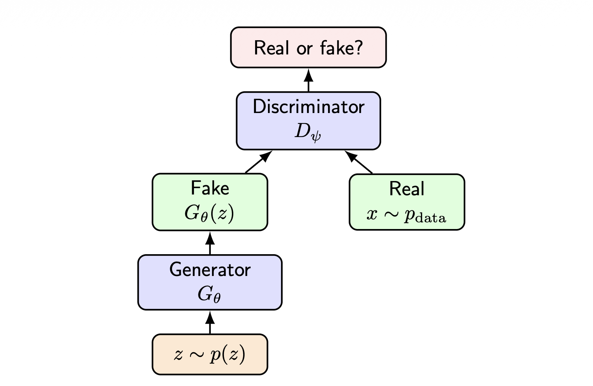
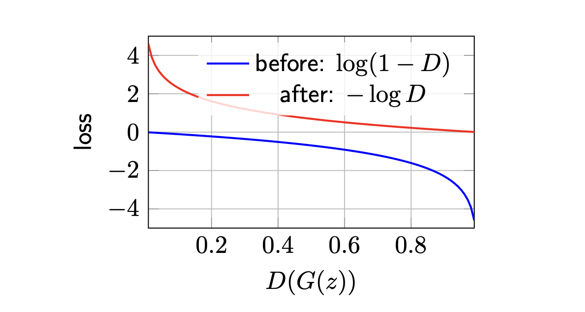
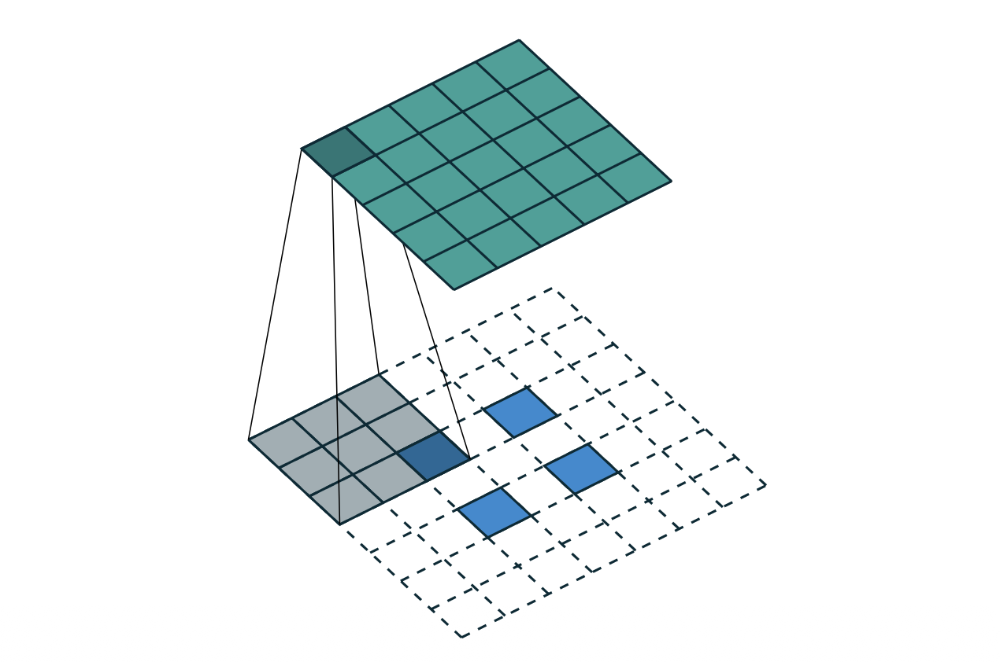
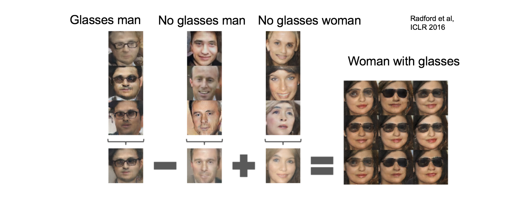

# 1. Introduction: 생성 모델의 분류 (Taxonomy of Generative Models)

이전 강의에서 우리는 변분 오토인코더(Variational Autoencoders, VAE)에 대해 다루었습니다. 이미지 데이터 $x$에 대한 우도(Likelihood) 인 $\log p_{\theta}(x)$를 직접 최적화하는 것은 계산적으로 매우 어렵기 때문에(Intractable), VAE는 대신 증거 하한(Evidence Lower Bound, ELBO)을 유도하여 이를 최대화하는 간접적인 방식을 취했습니다.

딥러닝 기반 생성 모델은 확률 밀도(Density)를 어떻게 다루느냐에 따라 크게 세 가지로 분류할 수 있습니다. 본 포스트에서는 VAE와 대비되는 **자기회귀 모델(Autoregressive Models)**과 그 구체적 구현체인 PixelRNN/PixelCNN을 중점적으로 살펴봅니다.

| 모델 유형 | 밀도(Density) 평가 | 훈련 목적 함수 (Training Objective) | 샘플링 방식 (Sampling) |
| :--- | :--- | :--- | :--- |
| **VAE** | $p_{\theta}(x)=\int p(z)p_{\theta}(x|z)dz$ (직접 계산 불가)  | ELBO 최대화 (Maximize ELBO)  | 빠름: 잠재 변수 $z \sim p(z)$ 샘플링 후 디코딩  |
| **Autoregressive** | $p_{\theta}(x)=\prod_{i}p_{\theta}(x_{i}|x_{<i})$ (명시적 계산 가능)  | 정확한 로그 우도 최대화 (Maximize exact log-likelihood)  | 느림: 한 번에 하나의 픽셀/토큰씩 순차적 샘플링  |
| **GAN** | $p_{\theta}(x)$ 를 명시적으로 평가하지 않음 (Implicit)  | 적대적 두 플레이어 게임 (Adversarial two-player game)  | 빠름: $x=G_{\theta}(z)$  |

위 표에서 볼 수 있듯, 자기회귀 모델의 가장 큰 특징은 VAE나 GAN과 달리 **정확한 우도(Exact Likelihood)를 제공**한다는 점입니다.

---

# 2. 자기회귀 모델의 수학적 공식화 (Mathematical Formulation)

## 2.1. 연쇄 법칙(Chain Rule)을 통한 인수분해
자기회귀 모델은 복잡한 결합 확률 분포를 조건부 확률의 곱으로 분해합니다. 어떤 순서를 가진 확률 변수들의 집합 $x = (x_1, x_2, \dots, x_T)$가 주어졌을 때, 확률의 연쇄 법칙에 의해 결합 확률 $p(x)$는 다음과 같이 전개됩니다.

$$p(x) = p(x_1)p(x_2|x_1)p(x_3|x_1,x_2) \dots p(x_T|x_{<T})$$

이를 수식으로 간결하게 표현하면 다음과 같습니다:

$$p(x) = \prod_{t=1}^{T} p(x_t | x_{<t})$$

**자기회귀 모델링(Autoregressive Modeling)**은 이 수식에 기반하여, 변수들의 순서를 정한 뒤 신경망을 훈련시켜 이전 변수들($x_{<t}$)이 주어졌을 때 다음 변수($x_t$)의 확률 분포를 예측하도록 만드는 기법입니다.

## 2.2. 이미지 데이터로의 확장: 래스터 스캔 순서 (Raster-scan Ordering)
이미지 데이터에 자기회귀 모델을 적용하기 위해서는 2차원 그리드 형태의 픽셀들을 1차원 시퀀스로 평탄화(Flatten)해야 합니다. 이를 위해 보통 **래스터 스캔 순서(Raster-scan order)**를 사용합니다.

* 픽셀들은 위에서 아래로, 좌에서 우로 (마치 글을 읽듯) 행 단위로 정렬됩니다.
* 따라서 $t$ 번째 픽셀을 생성할 때, 조건이 되는 '이전 픽셀들'은 이미지 상에서 $t$ 번째 픽셀의 위쪽(Above) 또는 왼쪽(Left)에 위치한 픽셀들이 됩니다.

이미지의 크기가 $H \times W \times C$ (높이, 너비, 채널 수)일 때, 총 변수의 개수 $T$는 $T = H \times W \times C$가 됩니다. 이때 로그 우도는 다음과 같이 전개됩니다:

$$\log p_{\theta}(x) = \sum_{t=1}^{T} \log p_{\theta}(x_t | x_{<t})$$

 

## 2.3. RGB 채널 순서링 (RGB Channel Ordering)
컬러 이미지의 경우 각 픽셀 $i$는 3개의 색상 채널 $(x_{i,R}, x_{i,G}, x_{i,B})$를 가집니다. 이 채널 간에도 의존성을 부여하기 위해 추가적인 인수분해를 수행합니다. 일반적으로 R $\rightarrow$ G $\rightarrow$ B 순서로 조건을 부여합니다:

$$p(x_i | x_{<i}) = p(x_{i,R} | x_{<i}) \cdot p(x_{i,G} | x_{<i}, x_{i,R}) \cdot p(x_{i,B} | x_{<i}, x_{i,R}, x_{i,G})$$ 

어떤 순서(예: B $\rightarrow$ G $\rightarrow$ R)를 사용하든 수학적으로 무방하지만, 모델을 구성할 때 반드시 하나의 순서를 고정해야 합니다.

---

# 3. 훈련 및 샘플링 (Training and Sampling)

## 3.1. 정확한 로그 우도 최대화를 통한 훈련
자기회귀 모델은 VAE의 하한(ELBO) 근사와 달리, **정확한 로그 우도(Exact log-likelihood)를 직접 최대화**하는 방식으로 훈련됩니다.

$$\max_{\theta} \mathbb{E}_{x \sim \mathcal{D}_{train}} \left[ \sum_{t=1}^{T} \log p_{\theta}(x_t | x_{<t}) \right]$$

이것은 지도 학습(Supervised-learning)의 관점으로 해석할 수 있습니다. 이전 픽셀들 $x_{<t}$ 가 입력(Feature)으로 주어졌을 때, 다음 픽셀 $x_t$ (Target)를 예측하는 분류 문제와 같습니다. 픽셀 값이 이산적(Discrete, 예: 0~255)이므로, 각 조건부 확률 분포는 픽셀 값에 대한 범주형 분포(Categorical distribution)로 모델링할 수 있습니다.

## 3.2. 순차적 샘플링과 Trade-off
훈련 시에는 정답 이미지 $x$가 모두 주어져 있으므로 연산을 병렬화할 수 있는 여지가 있지만, **새로운 이미지를 생성(Sampling)할 때는 반드시 순차적(Sequential)이어야 합니다**.

1. $x_1 \sim p_{\theta}(x_1)$ 
2. $x_2 \sim p_{\theta}(x_2 | x_1)$ 
3. $x_3 \sim p_{\theta}(x_3 | x_1, x_2)$ 
4. $\dots$
5. $x_T \sim p_{\theta}(x_T | x_{<T})$ 

여기서 자기회귀 모델의 핵심적인 딜레마(Tradeoff)가 발생합니다. 모델은 **정확한 우도를 계산할 수 있고 훈련이 안정적**이라는 큰 장점이 있지만, **생성 과정은 픽셀을 한 번에 하나씩 샘플링해야 하므로 매우 느리다**는 단점이 있습니다.

---

# 4. PixelRNN과 PixelCNN

이미지의 이전 컨텍스트 $x_{<t}$를 모델링하기 위해 어떤 신경망 아키텍처를 사용할 것인지에 따라 두 가지 주요 모델로 나뉩니다.

## 4.1. PixelRNN
* **구조:** 픽셀 공간 전체에 걸쳐 순환 신경망(RNN, Recurrent Neural Networks) 연결을 사용합니다.
* **장점:** RNN의 메모리 특성 덕분에 이미지 내의 매우 긴 의존성(Long-range dependencies)을 효과적으로 포착할 수 있습니다.
* **단점:** 연산이 순차적이므로 훈련 시 병렬 처리가 어렵고 계산 비용이 매우 높습니다.

## 4.2. PixelCNN과 마스크 합성곱 (Masked Convolution)
PixelRNN의 훈련 속도 문제를 극복하기 위해 제안된 것이 **PixelCNN**입니다. CNN(Convolutional Neural Networks)을 사용하면 훈련 시 모든 픽셀에 대한 특성(Features)을 한 번에 병렬로 계산할 수 있습니다. 하지만, 일반적인 CNN 필터는 '미래의 픽셀' 정보까지 참조할 수 있기 때문에, 자기회귀 조건(미래 정보를 보면 안 됨)을 위반하게 됩니다.

이를 방지하기 위해 PixelCNN은 **마스크 합성곱(Masked Convolution)**을 도입합니다. 

 

합성곱 계층에서 $p_{\theta}(x_t | x_{<t})$는 미래의 픽셀 $x_t, x_{t+1}, \dots$에 의존해서는 안 됩니다. 이를 구현하기 위해 합성곱 필터 가중치 행렬에 마스크를 곱하여 미래 픽셀 방향의 가중치를 0으로 만듭니다.

### Mask A vs Mask B
안정적인 정보 흐름을 제어하기 위해 PixelCNN은 두 종류의 마스크를 혼용합니다.

**1. Mask A (첫 번째 레이어 적용)** 
네트워크의 첫 번째 레이어에서는 필터 정중앙(현재 픽셀 위치)의 값도 0으로 마스킹해야 합니다. 현재 입력이 자기 자신의 값을 그대로 다음 레이어로 전달해 버리면(Cheating), 올바른 조건부 확률 학습이 이루어지지 않기 때문입니다.
$$
\text{Mask A} =
\begin{bmatrix}
1 & 1 & 1 & 1 & 1 \\
1 & 1 & 1 & 1 & 1 \\
1 & 1 & 0 & 0 & 0 \\
0 & 0 & 0 & 0 & 0 \\
0 & 0 & 0 & 0 & 0
\end{bmatrix}
$$ 

**2. Mask B (이후 레이어 적용)** 
두 번째 레이어부터는 이미 현재 공간적 위치의 은닉 특성(Hidden feature)이 이전 픽셀들 정보만으로 구성되어 있습니다. 따라서 중앙 위치의 값을 사용할 수 있도록 중앙 가중치를 1로 둡니다. 단, 미래 픽셀 영역은 여전히 0으로 유지합니다.
$$
\text{Mask B} =
\begin{bmatrix}
1 & 1 & 1 & 1 & 1 \\
1 & 1 & 1 & 1 & 1 \\
1 & 1 & 1 & 0 & 0 \\
0 & 0 & 0 & 0 & 0 \\
0 & 0 & 0 & 0 & 0
\end{bmatrix}
$$ 

이러한 마스킹 기법 덕분에, PixelCNN은 **훈련 시에는 전체 이미지에 대해 병렬 연산(Fast training)**을 수행하고, **샘플링 시에는 순차 생성(Slow sampling)**을 하는 비대칭적 효율성을 얻게 됩니다.

---

# 5. Summary: 자기회귀 모델 요약

마지막으로 PixelRNN과 PixelCNN의 핵심 특성을 요약 비교합니다.

| 특징 | PixelRNN | PixelCNN |
| :--- | :--- | :--- |
| **메커니즘 (Mechanism)** | 픽셀에 걸친 순환 의존성 (Recurrent dependencies)  | 마스크 합성곱 (Masked convolutions)  |
| **훈련 속도 (Training)** | 매우 순차적 (More sequential)  | 픽셀 전체 병렬 연산 (Parallel over pixels)  |
| **샘플링 (Sampling)** | 순차적 (Sequential)  | 순차적 (Sequential)  |
| **강점 (Strength)** | 긴 의존성 포착 가능 (Long-range dependencies)  | 효율적인 훈련 속도 (Efficient training)  |
| **약점 (Weakness)** | 계산 비용이 막대함 (Computationally expensive)  | 네트워크가 깊거나 Dilated 필터가 아니면 수용 영역(Receptive field)이 제한됨  |
| **우도 평가 (Likelihood)** | 정확함 (Exact)  | 정확함 (Exact)  |

**핵심 요약 (Takeaway):**
자기회귀 모델은 안정적인 훈련이 가능하며 입력 데이터의 확률 밀도(Likelihood)를 정확하게 평가할 수 있는 강력한 프레임워크입니다. 하지만 생성 과정이 본질적으로 순차적이기 때문에, 실시간 고해상도 이미지 생성 등 응답성이 중요한 환경에서는 적용하기 어렵다는 한계가 존재합니다.

---

# 1. Introduction: 암묵적 생성 모델 (Implicit Generative Models)

이전 포스트에서 다룬 자기회귀 모델(Autoregressive Models)은 확률 밀도 $p_\theta(x)$를 명시적으로 정의하고 정확한 우도(Exact likelihood)를 최대화하는 모델이었습니다. 이와 달리, **생성적 적대 신경망(Generative Adversarial Networks, GAN)**은 명시적인 확률 밀도 함수를 추정하지 않는 **암묵적 생성 모델(Implicit Generative Models)**입니다.

GAN은 잠재 공간(Latent space)의 노이즈 $z \sim p(z)$를 샘플링한 후, 생성자(Generator) 역할을 하는 신경망 $G_\theta$를 통과시켜 가짜 샘플 $x = G_\theta(z)$를 만들어냅니다. 즉, 데이터의 확률 밀도 $p_\theta(x)$에 대한 다루기 쉬운(Tractable) 수식을 제공하지 않으며, 결과적으로 우도를 직접 최대화하는 방식을 사용하지 않습니다. 대신, 두 신경망 간의 **적대적 게임(Adversarial game)**을 통해 모델을 학습시킵니다.

---

# 2. 적대적 두 플레이어 게임 (Adversarial Two-Player Game)

GAN의 핵심 아이디어는 위조지폐범(Generator)과 경찰(Discriminator)의 경쟁으로 자주 비유됩니다. 

1. **생성자 (Generator, $G_\theta$)**: 노이즈 $z \sim p(z)$를 입력받아 실제 데이터와 구별할 수 없는 가짜 샘플 $G_\theta(z)$를 생성하는 것이 목표입니다.
2. **식별자 (Discriminator, $D_\psi$)**: 입력된 데이터 $x$가 실제 데이터 분포 $p_{data}$에서 온 것인지(Real, $y=1$), 생성자가 만든 것인지(Fake, $y=0$)를 판별합니다. 즉, $D_\psi(x) \approx P(y=1|x)$를 출력하며 그 값은 $(0,1)$ 범위를 가집니다.

## 2.1. Minimax 목적 함수
이러한 경쟁 관계는 다음과 같은 **Minimax 목적 함수(Objective)**로 공식화됩니다:

$$\min_G \max_D V(G,D) = \mathbb{E}_{x \sim p_{data}}[\log D(x)] + \mathbb{E}_{z \sim p(z)}[\log(1 - D(G(z)))]$$

* **Discriminator의 목표 ($\max_D$)**: 실제 데이터에 대해서는 $D(x) \rightarrow 1$을, 가짜 데이터에 대해서는 $D(G(z)) \rightarrow 0$을 예측하여 위 목적 함수를 최대화하고자 합니다.
* **Generator의 목표 ($\min_G$)**: 식별자를 속여 $D(G(z)) \rightarrow 1$이 되도록 만들어, 두 번째 항의 값을 최소화하고자 합니다.

---

# 3. 훈련 메커니즘과 Generator Loss의 개선

실제 훈련 시에는 하나의 최적화 문제를 푸는 대신, 두 네트워크를 교대로 업데이트(Alternating updates)합니다.

1. **Discriminator 업데이트**: 식별자를 강화하기 위해 목적 함수를 $\max_D$ 방향으로 경사 상승법(Gradient Ascent)을 적용합니다.
2. **Generator 업데이트**: 생성자를 강화하기 위해 $\min_G$ 방향으로 경사 하강법(Gradient Descent)을 적용합니다.

## 3.1. 포화(Saturating) vs 비포화(Non-saturating) Generator Loss

초기 GAN 학습의 가장 큰 문제 중 하나는 식별자가 생성자보다 너무 빨리 학습될 때 발생하는 **기울기 소실(Vanishing gradient)**입니다.

오리지널 Generator 손실 함수는 $\min_G \mathbb{E}_z[\log(1 - D(G(z)))]$ 입니다. 만약 생성자가 만든 이미지가 너무 조악해서 식별자가 완벽하게 가짜로 판별한다면($D(G(z)) \approx 0$), 이 함수의 기울기는 매우 평탄해져(Saturated) 학습이 사실상 멈추게 됩니다.

이를 해결하기 위해 **비포화 생성자 손실(Non-saturating generator loss)** 트릭을 사용합니다:
$$\max_G \mathbb{E}_z[\log D(G(z))] \quad \text{또는} \quad \min_G -\mathbb{E}_z[\log D(G(z))]$$

이러한 변경으로 인해 생성자는 훈련 초기에 훨씬 더 강력한 기울기 신호를 받아 안정적인 훈련이 가능해집니다.

---

# 4. 이론적 분석: 최적 식별자와 Jensen-Shannon Divergence

GAN의 수학적 우수성은 이 모델이 분포 간의 차이를 측정하는 발산(Divergence)을 최소화한다는 점을 증명할 수 있다는 데 있습니다.

## 4.1. 고정된 생성자에 대한 최적 식별자 (Optimal Discriminator)
어떤 고정된 생성자 $G$에 대해 가짜 샘플의 분포를 $p_g$라고 합시다 ($x = G(z) \sim p_g$). 이때 식별자가 최대화하려는 목적 함수는 적분 형태로 나타낼 수 있습니다:

$$V(G,D) = \int \left[ p_{data}(x)\log D(x) + p_g(x)\log(1 - D(x)) \right] dx$$

각 공간적 위치 $x$에 대해 피적분 함수를 개별적으로 최대화할 수 있습니다. 계산을 단순화하기 위해 변수를 치환해 보겠습니다:
$a = p_{data}(x)$, $b = p_g(x)$, $y = D(x)$ 라고 두면, 최대화할 함수는 $f(y) = a \log y + b \log(1 - y)$ 가 됩니다.

이 식을 $y$에 대해 미분하여 극대값을 찾습니다:
$$\frac{df}{dy} = \frac{a}{y} - \frac{b}{1 - y} = 0$$
$$a(1 - y) = by \implies y = \frac{a}{a + b}$$

따라서, 고정된 $G$에 대한 **최적의 식별자 $D_G^*(x)$** 는 다음과 같이 정의됩니다:
$$D_G^*(x) = \frac{p_{data}(x)}{p_{data}(x) + p_g(x)}$$

**해석 (Interpretation):** 최적 식별자는 실제 데이터 분포 밀도가 가짜 분포 밀도보다 상대적으로 얼마나 큰지를 측정하는 **밀도비 추정기(Density-ratio estimator)** 역할을 수행합니다. $\frac{D_G^*(x)}{1 - D_G^*(x)} = \frac{p_{data}(x)}{p_g(x)}$가 성립합니다.

## 4.2. GAN은 JSD를 최소화한다
이제 찾아낸 최적 식별자 $D_G^*(x)$를 원래의 Minimax 목적 함수에 대입해봅시다. 생성자의 최적화 목표 $C(G) = \max_D V(G,D)$는 다음과 같이 전개됩니다.

$$C(G) = \mathbb{E}_{x \sim p_{data}} \left[ \log \frac{p_{data}(x)}{p_{data}(x) + p_g(x)} \right] + \mathbb{E}_{x \sim p_g} \left[ \log \frac{p_g(x)}{p_{data}(x) + p_g(x)} \right]$$

여기서 분포 간 거리 측도인 **Jensen-Shannon Divergence (JSD)** 의 정의를 떠올려 봅시다.
$JSD(p||q) = \frac{1}{2}KL(p||m) + \frac{1}{2}KL(q||m)$, (단, $m = \frac{p+q}{2}$)

식을 JSD 형태로 변형하기 위해 식의 분모와 분자에 $2$를 곱하고 나누어 식을 조정합니다:
$$C(G) = \mathbb{E}_{x \sim p_{data}} \left[ \log \left( \frac{p_{data}(x)}{\frac{p_{data}(x) + p_g(x)}{2}} \cdot \frac{1}{2} \right) \right] + \mathbb{E}_{x \sim p_g} \left[ \log \left( \frac{p_g(x)}{\frac{p_{data}(x) + p_g(x)}{2}} \cdot \frac{1}{2} \right) \right]$$
$$= -\log 4 + KL\left(p_{data} \Big|\Big| \frac{p_{data}+p_g}{2}\right) + KL\left(p_g \Big|\Big| \frac{p_{data}+p_g}{2}\right)$$
$$= -\log 4 + 2 \cdot JSD(p_{data}||p_g)$$

결론적으로 $\min_G C(G)$를 푸는 것은 $JSD(p_{data}||p_g)$를 최소화하는 것과 같습니다. JSD의 최솟값은 두 분포가 완벽히 일치할 때($p_g = p_{data}$) $0$이 되며, 이 **전역 최적해(Global optimum)** 에서 $C(G) = -\log 4$가 되고, 판별자는 완벽한 혼란 상태인 $D_G^*(x) = \frac{1}{2}$를 출력하게 됩니다.

---

# 5. 심층 구조로의 확장: DCGAN과 잠재 공간(Latent Space)

GAN은 학습이 매우 불안정하다는 여러 실패 모드(Failure modes - Mode collapse, Oscillatory dynamics 등)를 겪습니다. 이를 완화하기 위해 합성곱(Convolution) 구조를 성공적으로 도입한 것이 **DCGAN(Deep Convolutional GANs)**입니다.

## 5.1. Transposed Convolution
이미지를 생성해야 하는 Generator는 저해상도의 잠재 벡터 $z$ (예: $100$차원)에서 시작하여 점진적으로 공간적 해상도(Spatial resolution)를 키워나가야 합니다. 이를 위해 학습 가능한 업샘플링(Upsampling) 연산인 **전치 합성곱(Transposed Convolution)** 또는 Fractional-strided convolution을 사용합니다. 

## 5.2. DCGAN 아키텍처 가이드라인 (Architecture Guidelines)
DCGAN 논문(Radford et al., 2016)은 안정적인 적대적 학습을 위해 다음과 같은 구조적 규칙을 제안했습니다.
* **Discriminator**: Pooling 계층 대신 Strided Convolution을 사용하여 공간을 축소합니다. 활성화 함수로 **LeakyReLU**를 사용합니다.
* **Generator**: Transposed Convolution을 사용하여 해상도를 키웁니다. 활성화 함수로 **ReLU**를 사용하되, 마지막 출력층에는 **Tanh**를 사용합니다.
* **공통**: Fully Connected (FC) 은닉층을 제거하고, 두 네트워크 모두에 **배치 정규화(Batch Normalization)**를 적용합니다.

## 5.3. 잠재 공간 연산 (Latent-space Arithmetic)
GAN의 가장 매력적인 특징 중 하나는 노이즈 공간 $z$가 유의미한 의미적(Semantic) 방향성을 갖도록 학습된다는 점입니다. $z$ 벡터들 간의 선형 연산(Linear operations)이 출력 이미지의 직관적인 변화로 이어집니다.

---

# 6. Summary

GAN은 우도를 명시적으로 모델링하는 대신, 생성자와 식별자 간의 적대적 게임을 통해 데이터 분포를 학습합니다. 수학적으로 이는 데이터 분포와 생성 분포 간의 Jensen-Shannon Divergence를 최소화하는 과정으로 증명됩니다. 학습 불안정성이라는 고질적인 문제가 있으나, 비포화 손실 함수의 적용 및 DCGAN과 같은 구조적 개선을 통해 이를 극복하고 잠재 공간의 풍부한 표현력을 활용할 수 있게 되었습니다.

---

# 1. Introduction: 딥러닝 기반 생성 모델의 여정

지금까지 세 번의 포스트에 걸쳐 딥러닝을 활용한 대표적인 생성 모델(Deep Generative Models)인 **변분 오토인코더(VAE)**, **자기회귀 모델(Autoregressive Models, AR)**, 그리고 **생성적 적대 신경망(GAN)**을 살펴보았습니다. 

이들 모델은 데이터의 확률 분포를 어떻게 다루고 학습할 것인지에 대해 각기 다른 철학적, 수학적 접근을 취합니다. 본 포스트에서는 이 세 가지 모델의 특성을 종합적으로 비교하고, 자기회귀 모델과 GAN의 학습을 돕는 심화 개념(Dilated Convolution, 세부 훈련 알고리즘 등)을 정리하며 생성 모델 파트를 마무리하겠습니다.

---

# 2. 생성 모델 총정리 및 최종 비교 (Final Comparison)

세 가지 주요 생성 모델은 밀도 추정 방식, 훈련 목적 함수, 샘플링 속도 및 생성 품질 등에서 뚜렷한 장단점(Trade-offs)을 보입니다.

## 2.1. 모델 간 특성 비교 요약표

| 비교 항목 (Aspect) | VAE (Variational Autoencoders) | Autoregressive Models (PixelRNN/CNN) | GAN (Generative Adversarial Networks) |
| :--- | :--- | :--- | :--- |
| **밀도 (Density)** | 암묵적 적분 (Implicit integral) | 명시적 우도 (Explicit likelihood) | 암묵적 밀도 (Implicit density) |
| **목적 함수 (Objective)** | 증거 하한(ELBO) 최대화 | 정확한 로그 우도(Exact log-likelihood) 최대화 | 적대적 손실 (Adversarial loss) 미니맥스 게임 |
| **추론 (Inference)** | 가능: 인코더 $q_\phi(z|x)$ 존재 | 불가능: 간단한 저차원 잠재 코드(Low-dim code) 없음 | 기본적으로는 불가능: 인코더가 없음 |
| **샘플링 (Sampling)** | 빠름 (Fast) | 느림, 순차적 (Slow, sequential) | 빠름 (Fast) |
| **샘플 품질 (Sample quality)** | 종종 부드럽거나 흐릿함 (Smooth/blurry) | 좋지만 생성 속도가 느림 | 매우 선명함 (Sharp) |
| **훈련 안정성 (Training)** | 안정적 (Stable) | 지도 학습 손실로 매우 안정적 (Stable supervised loss) | 불안정한 게임 다이내믹스 (Unstable game dynamics) |
| **주요 약점 (Main weakness)** | 느슨한 하한 / 흐릿한 이미지 | 지나치게 느린 샘플링 속도 | 모드 붕괴(Mode collapse) 및 학습 불안정 |

## 2.2. 핵심 요약 (Takeaways) 및 최신 동향 (Modern Context)

* **자기회귀 모델 (AR Models)**: 연쇄 법칙 $p_\theta(x) = \prod_t p_\theta(x_t | x_{<t})$ 을 사용하여 정확한 우도를 제공하고 학습이 매우 안정적입니다. 과거 PixelCNN이 이미지 생성에서 마스크 합성곱을 통해 병렬 훈련을 이끌어냈듯, 이 **자기회귀 모델링 기법은 오늘날 대규모 언어 모델(LLMs, 예: GPT)의 핵심 기반 기술**로 자리 잡았습니다.
* **GAN**: 잠재 공간에서 $z \sim p(z)$를 추출해 $x = G_\theta(z)$로 매핑하는 암묵적 생성기입니다. 훈련은 최적의 식별자를 가정할 때 $-\log 4 + 2JSD(p_{data}||p_g)$ 를 최소화하는 과정으로 해석됩니다. 
* **최신 동향**: GAN은 확산 모델(Diffusion Models)이 주류로 자리 잡기 전까지 고해상도의 선명한 이미지를 생성하는 데 지배적으로 사용되었습니다. 여전히 '우도 계산의 정확성 vs 샘플의 품질 vs 샘플링 속도'라는 생성 모델의 중심적인 딜레마(Central tradeoffs)는 최신 연구에서도 중요하게 다뤄지고 있습니다.

---

# 3. 보충 심화: 팽창 합성곱 (Dilated Convolutions)

이전 포스트에서 PixelCNN의 약점으로 '네트워크가 깊어지거나 구조적 변화가 없으면 수용 영역(Receptive field)이 제한된다'는 점을 언급했습니다. 이를 극복하기 위해 자기회귀 모델(특히 합성곱 기반)에서 널리 쓰이는 기법이 **팽창 합성곱(Dilated Convolutions)**입니다.

* **작동 원리**: 필터 커널이 입력값을 처리할 때, 인접한 값을 바로 취하지 않고 일정한 간격(Dilation rate)만큼 건너뛰어(Skip) 연산을 수행합니다.
* **효과**: 모델의 **파라미터 수나 연산량을 늘리지 않고도 모델의 수용 영역을 기하급수적으로(Exponentially) 확장**할 수 있습니다. 
* **적용**: PixelCNN이나 Wavenet과 같은 구조에서 과거의 넓은 컨텍스트(Expanding context)를 참조하여 현재 픽셀/음성 샘플을 예측해야 할 때 핵심적인 역할을 합니다.

---

# 4. 보충 심화: 오리지널 GAN 훈련 알고리즘 (Original GAN Training Algorithm)

이전 포스트에서 다룬 수식을 실제 코드 기반의 훈련 알고리즘(Mini-batch Stochastic Gradient Ascent)으로 정리하면 다음과 같습니다. 

GAN은 식별자(Discriminator)를 $k$번 업데이트할 때 생성자(Generator)를 1번 업데이트하는 방식으로 학습 비율을 조정하기도 합니다. (단, 최적의 $k$값은 문제마다 다릅니다.)

**[알고리즘: GAN 훈련 루프]**

1. 훈련 반복(Iterations) 횟수만큼 다음을 수행합니다.
2. **식별자 업데이트 (For $k$ steps):**
   * 노이즈 사전 분포 $p_g(z)$에서 크기가 $m$인 미니배치 $\{z^{(1)}, \dots, z^{(m)}\}$를 샘플링합니다.
   * 실제 데이터 분포 $p_{data}(x)$에서 크기가 $m$인 미니배치 $\{x^{(1)}, \dots, x^{(m)}\}$를 샘플링합니다.
   * 다음 목적 함수를 식별자의 파라미터 $\theta_d$에 대해 **확률적 경사 상승법(Stochastic Gradient Ascent)**으로 업데이트하여 최대화합니다.
   $$\nabla_{\theta_d} \frac{1}{m} \sum_{i=1}^{m} \left[ \log D_{\theta_d}(x^{(i)}) + \log(1 - D_{\theta_d}(G_{\theta_g}(z^{(i)}))) \right]$$

3. **생성자 업데이트 (1 step):**
   * 다시 사전 분포 $p_g(z)$에서 미니배치 $\{z^{(1)}, \dots, z^{(m)}\}$를 샘플링합니다.
   * 초기 학습 지연(Saturating gradient)을 막기 위한 **개선된 목적 함수(Non-saturating objective)**를 사용하여, 생성자의 파라미터 $\theta_g$에 대해 경사 상승법으로 업데이트합니다.
   $$\nabla_{\theta_g} \frac{1}{m} \sum_{i=1}^{m} \log(D_{\theta_d}(G_{\theta_g}(z^{(i)})))$$

---

# 5. 보충 심화: 잠재 공간의 의미론적 산술 (Latent-vector Arithmetic)

GAN의 흥미로운 성질인 $z$ 벡터의 의미론적(Semantic) 선형 연산을 좀 더 명확한 예시로 확인해보겠습니다.

위 그림처럼, 생성 모델이 데이터를 단순히 암기하는 것이 아니라, 잠재 공간(Latent space) 내에 '성별(Gender)', '표정(Expression)', '안경 착용 여부(Glasses)'와 같은 **추상적이고 고차원적인 특징들을 선형적으로 분리(Disentanglement)**하여 학습했음을 보여주는 강력한 증거입니다.

이러한 성공 이후 GAN의 구조를 응용한 수백 가지의 변형 모델들이 쏟아져 나왔으며, 이를 학계에서는 우스갯소리로 "The GAN Zoo(동물원)"라고 부르기도 합니다(예: CycleGAN, InfoGAN, StyleGAN 등).