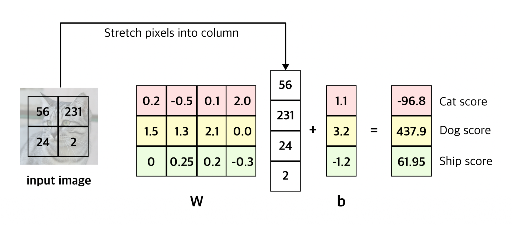
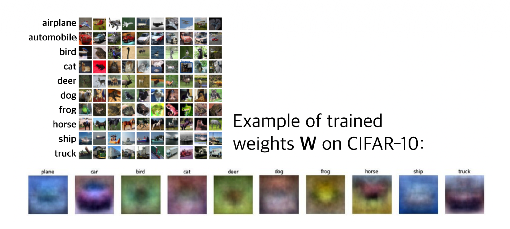
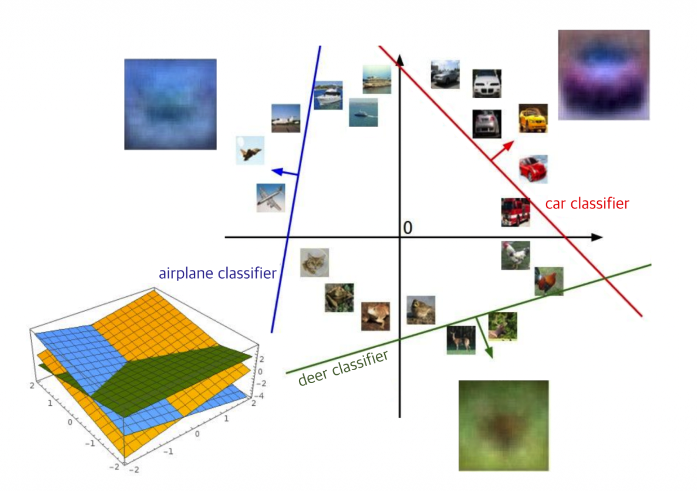

# 1. Introduction

이전 포스트([Lecture 2.1])에서는 이미지 분류 문제의 정의와 주요 데이터셋(CIFAR-10 등)에 대해 다루었다. 이미지는 컴퓨터에게 그저 거대한 숫자 그리드(Tensor)일 뿐이며, 우리는 이를 입력받아 "고양이", "강아지"와 같은 클래스 라벨을 출력하는 함수가 필요하다.

이번 포스트에서는 그 첫 번째 단계로, 입력 데이터를 클래스별 점수(Score)로 매핑하는 **스코어 함수(Score Function)**, 그중에서도 가장 기본이 되는 **선형 분류기(Linear Classifier)**에 대해 알아본다.

# 2. Score Function

## 2.1. 정의 (Definition)

스코어 함수는 입력 데이터(이미지)를 받아 각 클래스에 대한 '확신(confidence)'을 나타내는 점수 벡터를 출력하는 함수이다. 이를 수식으로 정의하면 다음과 같다.

$$
f_{\theta}: \mathcal{X} \rightarrow \mathbb{R}^{C}
$$

* $\mathcal{X}$: 입력 공간 (예: 이미지)
* $\theta$: 모델의 파라미터(Parameters)
* $C$: 분류하고자 하는 클래스의 개수 (예: CIFAR-10의 경우 10)

함수 $f$는 입력 $x \in \mathcal{X}$를 받아 실수 벡터 $s$로 매핑한다.

$$
s = f_{\theta}(x) = (s_{1}, s_{2}, \dots, s_{C})
$$

여기서 $s_j$는 $j$번째 클래스에 대한 점수이다. 최종적으로 모델은 가장 높은 점수를 가진 클래스를 예측값($\hat{y}$)으로 선택한다.

$$
\hat{y} = \operatorname*{argmax}_{j \in \{1, \dots, C\}} s_{j}
$$

> **Note**: 여기서 계산된 점수 $s_j$는 확률(Probability)이 아니다. 정규화되지 않은 선호도(Unnormalized preference)일 뿐이며, 값의 범위에 제한이 없다(음수일 수도, 매우 큰 양수일 수도 있음).

# 3. Linear Classifier

## 3.1. 수식적 표현 (Parametric Approach)

가장 단순하면서도 강력한 기초 모델인 선형 분류기(Linear Classifier)를 살펴보자. 이 모델은 입력 이미지 $x$와 파라미터 $W$의 선형 결합으로 점수를 계산한다.

$$
f(x, W) = Wx + b
$$

이 수식이 작동하는 방식을 차원(Dimension) 관점에서 분석해보면 다음과 같다. (CIFAR-10 데이터셋 기준: $32 \times 32 \times 3$ 이미지, 10개 클래스)

1.  **입력 $x$**: $32 \times 32 \times 3$ 크기의 3차원 배열을 1차원 벡터로 **쭉 펼친다(Stretch/Flatten)**.
    $$
    32 \times 32 \times 3 \rightarrow 3072 \times 1 \text{ vector}
    $$
2.  **가중치 $W$ (Weights)**: 입력 차원과 클래스 개수를 연결하는 행렬이다.
    $$
    W \in \mathbb{R}^{10 \times 3072}
    $$
3.  **편향 $b$ (Bias)**: 입력과 무관하게 각 클래스가 가질 수 있는 기본 점수(우선순위)를 보정하는 벡터이다.
    $$
    b \in \mathbb{R}^{10 \times 1}
    $$

결과적으로 행렬 곱셈을 통해 $10 \times 1$ 크기의 점수 벡터를 얻게 된다.

$$
[\text{10} \times \text{1 Score}] = [\text{10} \times \text{3072}] \cdot [\text{3072} \times \text{1}] + [\text{10} \times \text{1}]
$$

## 3.2. 계산 예시 (Example Calculation)

이해를 돕기 위해 이미지를 4개 픽셀($2 \times 2$)로 단순화하고, 3개의 클래스(Cat, Dog, Ship)를 분류하는 상황을 가정해보자.

위 그림의 수식을 보면:
* **Cat Score**: $(0.2 \times 56) + (-0.5 \times 231) + (0.1 \times 24) + (2.0 \times 2) + 1.1 = -96.8$
* **Dog Score**: $(1.5 \times 56) + (1.3 \times 231) + (2.1 \times 24) + (0.0 \times 2) + 3.2 = 437.9$

이 경우, Dog의 점수가 가장 높으므로 모델은 입력 이미지를 "Dog"로 예측하게 된다.

# 4. Interpretation of Linear Classifiers

선형 분류기 $Wx + b$는 단순한 행렬 곱셈이지만, 이를 해석하는 방법에는 세 가지 관점이 있다.

## 4.1. 템플릿 매칭 (Template Matching)

행렬 $W$의 각 행(Row)은 해당 클래스에 대한 **템플릿(Template) 또는 프로토타입(Prototype)**으로 볼 수 있다.
입력 이미지 $x$와 특정 클래스의 행 벡터 간의 내적(Dot Product)은 두 벡터의 **유사도(Similarity)**를 측정하는 것과 같다.

* 즉, 선형 분류기는 **"입력 이미지가 각 클래스의 템플릿과 얼마나 비슷하게 생겼는지"**를 측정하는 과정이다.

## 4.2. 시각적 관점 (Visual View)

학습된 가중치 $W$를 다시 이미지 형태로 시각화해보면, 모델이 각 클래스를 어떻게 인식하고 있는지 알 수 있다.

* **Car**: 붉은색 스포츠카 형태가 뭉뚱그려져 보인다.
* **Frog**: 화면 중앙에 녹색 덩어리가 보인다.
* **Horse**: 말의 형상이 보이지만, 다양한 자세의 말이 겹쳐져 머리가 양쪽에 있는 기이한 형태가 되기도 한다. 이는 선형 분류기가 클래스당 **단 하나의 템플릿**만 학습할 수 있기 때문에 발생하는 한계다.

## 4.3. 기하학적 관점 (Geometric View)

이미지를 고차원 공간(예: 3072차원)의 한 점으로 생각할 때, 선형 분류기는 각 클래스를 구분하는 **선형 경계(Linear Decision Boundary)** 또는 **초평면(Hyperplane)**을 긋는 것과 같다.

$$
Wx + b = 0
$$

# 5. The "Good" and "Bad" Parameters

우리는 $f(x, W)$를 통해 점수를 계산했다. 하지만 이 점수가 '좋은지 나쁜지'는 어떻게 판단할 수 있을까?

아래 표는 임의의 가중치 $W$로 계산된 3개 이미지의 점수 예시이다.

| Class | Image 1 (Cat) | Image 2 (Car) | Image 3 (Frog) |
| :--- | :---: | :---: | :---: |
| **Cat** | **2.9** | -4.22 | 5.1 |
| **Car** | -8.87 | **6.04** | 4.64 |
| **Frog** | 3.78 | 4.49 | **-4.34** |
| ... | ... | ... | ... |

* **Image 1 (실제 정답: Cat)**: Cat 점수(2.9)가 Frog 점수(3.78)보다 낮다. $\rightarrow$ **Bad Prediction**
* **Image 2 (실제 정답: Car)**: Car 점수(6.04)가 가장 높다. $\rightarrow$ **Good Prediction**
* **Image 3 (실제 정답: Frog)**: Frog 점수(-4.34)가 매우 낮다. $\rightarrow$ **Terrible Prediction**

단순히 점수를 계산하는 것만으로는 부족하다. 정답 클래스의 점수는 높이고, 오답 클래스의 점수는 낮추도록 가중치 $W$를 업데이트해야 한다.

이를 위해 **"현재 모델의 예측이 얼마나 나쁜지"**를 정량적으로 측정하는 함수가 필요한데, 이것이 바로 다음 포스트에서 다룰 **손실 함수(Loss Function)**이다.